# Arquitetura Backend NestJS

<cite>
**Arquivo referenciados neste documento**
- [module.json](file://backend/module.json)
- [module.config.json](file://backend/module.config.json)
- [README.md](file://backend/README.md)
- [ordem_servico.module.ts](file://backend/ordem_servico.module.ts)
- [routes.ts](file://backend/routes.ts)
- [clientes.module.ts](file://backend/clientes/clientes.module.ts)
- [produtos.module.ts](file://backend/produtos/produtos.module.ts)
- [ordens.module.ts](file://backend/ordens/ordens.module.ts)
- [configuracoes.module.ts](file://backend/configuracoes/configuracoes.module.ts)
- [shared.module.ts](file://backend/shared/shared.module.ts)
- [core.module.ts](file://backend/core/core.module.ts)
- [clientes.service.ts](file://backend/clientes/clientes.service.ts)
- [ordens.service.ts](file://backend/ordens/ordens.service.ts)
- [permission.service.ts](file://backend/shared/services/permission.service.ts)
- [permission.guard.ts](file://backend/shared/guards/permission.guard.ts)
- [require-permission.decorator.ts](file://backend/shared/decorators/require-permission.decorator.ts)
</cite>

## Sumário
1. [Introdução](#introdução)
2. [Estrutura do Projeto](#estrutura-do-projeto)
3. [Componentes Principais](#componentes-principais)
4. [Visão Geral da Arquitetura](#visão-geral-da-arquitetura)
5. [Análise Detalhada dos Componentes](#análise-detalhada-dos-componentes)
6. [Análise de Dependências](#análise-de-dependências)
7. [Considerações de Desempenho](#considerações-de-desempenho)
8. [Guia de Solução de Problemas](#guia-de-solução-de-problemas)
9. [Conclusão](#conclusão)
10. [Apêndice](#apêndice)

## Introdução
Este documento apresenta a arquitetura backend NestJS do módulo de Ordens de Serviço, com foco em sua estrutura modular, padrões de projeto, injeção de dependência e relacionamentos entre módulos. O módulo segue uma abordagem de módulos independentes (Clientes, Produtos, Ordens, Configurações) e um módulo central OrdemServicoModule que os integra, além de serviços compartilhados e um módulo de núcleo com funcionalidades específicas. A documentação inclui diagramas de dependência, fluxos de inicialização, boas práticas de separação de preocupações e recomendações para adicionar novos módulos mantendo escalabilidade.

## Estrutura do Projeto
O backend do módulo Ordens de Serviço é organizado em camadas e módulos bem definidos:
- Módulo principal OrdemServicoModule que agrega todos os submódulos e serviços compartilhados.
- Submódulos por domínio: Clientes, Produtos, Ordens, Configurações.
- Módulo Shared com serviços, guardas e controladores compartilhados.
- Módulo Core com configurações e tarefas agendadas.
- Arquivos de configuração do módulo e rotas expostas.

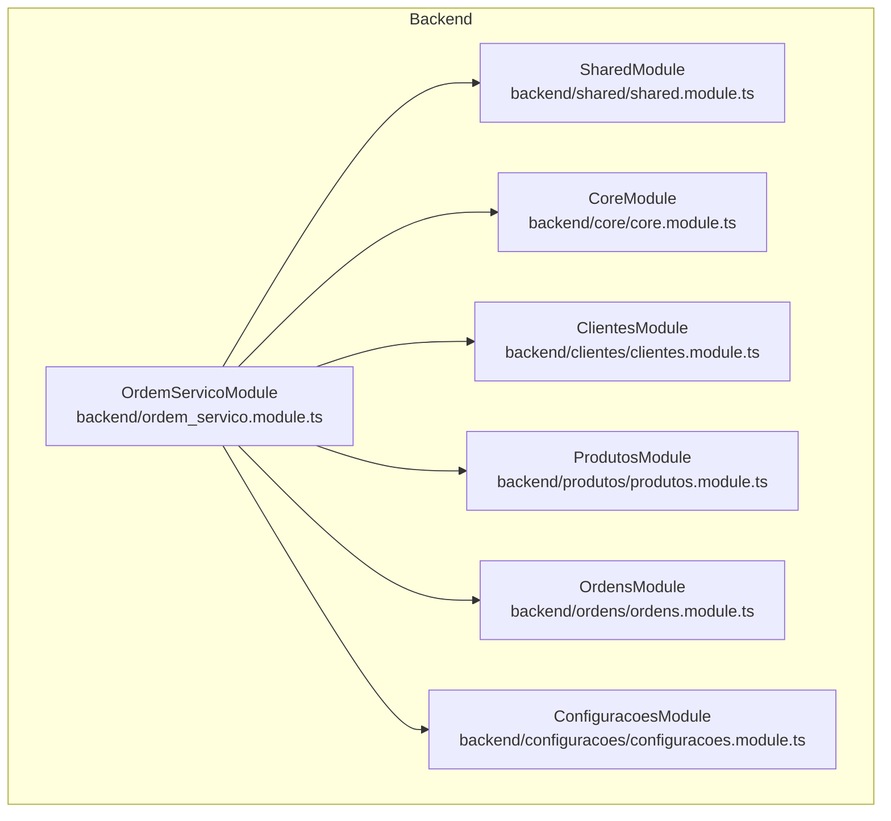

**Diagrama fonte**
- [ordem_servico.module.ts](file://backend/ordem_servico.module.ts#L11-L30)
- [clientes.module.ts](file://backend/clientes/clientes.module.ts#L8-L13)
- [produtos.module.ts](file://backend/produtos/produtos.module.ts#L8-L13)
- [ordens.module.ts](file://backend/ordens/ordens.module.ts#L7-L12)
- [configuracoes.module.ts](file://backend/configuracoes/configuracoes.module.ts#L12-L29)
- [shared.module.ts](file://backend/shared/shared.module.ts#L11-L16)
- [core.module.ts](file://backend/core/core.module.ts#L7-L12)

**Seção fonte**
- [README.md](file://backend/README.md#L5-L21)
- [module.json](file://backend/module.json#L1-L48)
- [module.config.json](file://backend/module.config.json#L1-L79)

## Componentes Principais
- OrdemServicoModule: Módulo raiz que importa PrismaModule, AuditModule, SharedModule, CoreModule, ClientesModule, ProdutosModule, OrdensModule e ConfiguracoesModule, e exporta os mesmos para uso externo.
- ClientesModule: Fornece serviços e controladores para gerenciamento de clientes, com dependência em PrismaModule, AuditModule e SharedModule.
- ProdutosModule: Fornece serviços e controladores para produtos/serviços, com dependência em PrismaModule, AuditModule e SharedModule.
- OrdensModule: Fornece serviços e controladores para ordens de serviço, com dependência em PrismaModule e SharedModule.
- ConfiguracoesModule: Fornece serviços e controladores para configurações, incluindo tipos de serviço e tipos de equipamento, com dependência em PrismaModule e SharedModule.
- SharedModule: Fornece serviços compartilhados (permissões, templates, IA), guardas e controladores compartilhados, com dependência em PrismaModule.
- CoreModule: Fornece controlador de configurações do módulo e serviço de cron, com dependência em PrismaModule e CronModule.

**Seção fonte**
- [ordem_servico.module.ts](file://backend/ordem_servico.module.ts#L11-L30)
- [clientes.module.ts](file://backend/clientes/clientes.module.ts#L8-L13)
- [produtos.module.ts](file://backend/produtos/produtos.module.ts#L8-L13)
- [ordens.module.ts](file://backend/ordens/ordens.module.ts#L7-L12)
- [configuracoes.module.ts](file://backend/configuracoes/configuracoes.module.ts#L12-L29)
- [shared.module.ts](file://backend/shared/shared.module.ts#L11-L16)
- [core.module.ts](file://backend/core/core.module.ts#L7-L12)

## Visão Geral da Arquitetura
A arquitetura segue o padrão modular do NestJS com injeção de dependência e exportação de módulos. O OrdemServicoModule atua como container principal, enquanto os módulos de domínio encapsulam lógica de negócio e acesso a dados. O SharedModule centraliza serviços e guardas reutilizáveis, e o CoreModule oferece funcionalidades específicas do módulo.

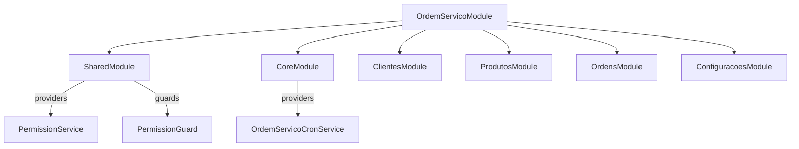

**Diagrama fonte**
- [ordem_servico.module.ts](file://backend/ordem_servico.module.ts#L11-L30)
- [shared.module.ts](file://backend/shared/shared.module.ts#L11-L16)
- [core.module.ts](file://backend/core/core.module.ts#L7-L12)

## Análise Detalhada dos Componentes

### Módulo Principal: OrdemServicoModule
- Importa PrismaModule, AuditModule, SharedModule, CoreModule, ClientesModule, ProdutosModule, OrdensModule e ConfiguracoesModule.
- Exporta os mesmos módulos para que outros módulos possam consumir seus provedores e controladores.
- Realiza log simples no construtor para confirmação de carregamento.

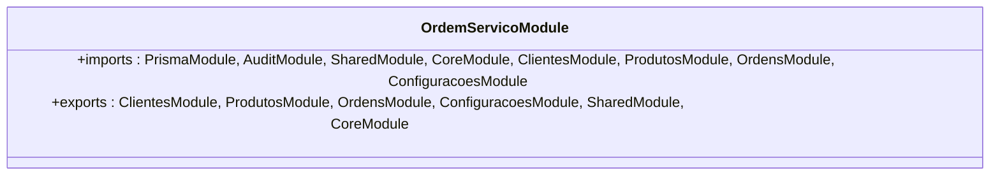

**Diagrama fonte**
- [ordem_servico.module.ts](file://backend/ordem_servico.module.ts#L11-L30)

**Seção fonte**
- [ordem_servico.module.ts](file://backend/ordem_servico.module.ts#L11-L30)

### Módulo Clientes
- Controlador: ClientesController
- Serviço: ClientesService
- Dependências: PrismaModule, AuditModule, SharedModule
- Exporta: ClientesService

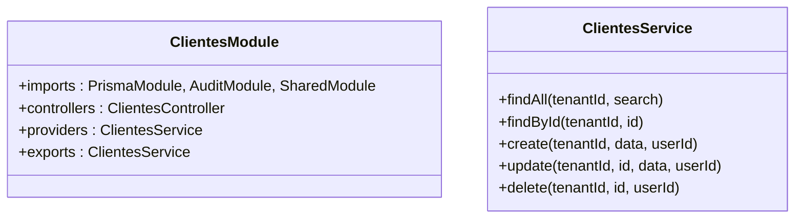

**Diagrama fonte**
- [clientes.module.ts](file://backend/clientes/clientes.module.ts#L8-L13)
- [clientes.service.ts](file://backend/clientes/clientes.service.ts#L6-L13)

**Seção fonte**
- [clientes.module.ts](file://backend/clientes/clientes.module.ts#L8-L13)
- [clientes.service.ts](file://backend/clientes/clientes.service.ts#L15-L253)

### Módulo Produtos
- Controlador: ProdutosController
- Serviço: ProdutosService
- Dependências: PrismaModule, AuditModule, SharedModule
- Exporta: ProdutosService

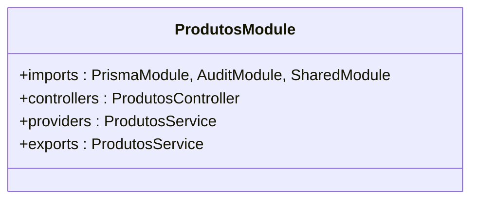

**Diagrama fonte**
- [produtos.module.ts](file://backend/produtos/produtos.module.ts#L8-L13)

**Seção fonte**
- [produtos.module.ts](file://backend/produtos/produtos.module.ts#L8-L13)

### Módulo Ordens
- Controlador: OrdensController
- Serviço: OrdensService
- Dependências: PrismaModule, SharedModule
- Exporta: OrdensService

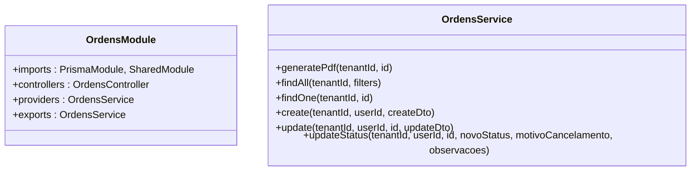

**Diagrama fonte**
- [ordens.module.ts](file://backend/ordens/ordens.module.ts#L7-L12)
- [ordens.service.ts](file://backend/ordens/ordens.service.ts#L9-L13)

**Seção fonte**
- [ordens.module.ts](file://backend/ordens/ordens.module.ts#L7-L12)
- [ordens.service.ts](file://backend/ordens/ordens.service.ts#L15-L800)

### Módulo Configurações
- Controladores: ConfiguracoesController, TiposServicoController, TiposEquipamentoController
- Serviços: ConfiguracoesService, TiposServicoService, TiposEquipamentoService
- Dependências: PrismaModule, SharedModule
- Exporta: ConfiguracoesService, TiposServicoService, TiposEquipamentoService

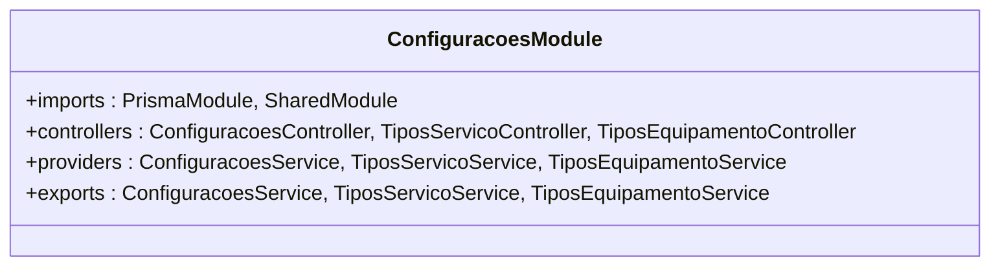

**Diagrama fonte**
- [configuracoes.module.ts](file://backend/configuracoes/configuracoes.module.ts#L12-L29)

**Seção fonte**
- [configuracoes.module.ts](file://backend/configuracoes/configuracoes.module.ts#L12-L29)

### Módulo Shared
- Controladores: PermissionController, TemplateController, AiController
- Serviços: PermissionService, TemplateService, AiService
- Guardas: PermissionGuard
- Dependências: PrismaModule
- Exporta: PermissionService, TemplateService, AiService, PermissionGuard

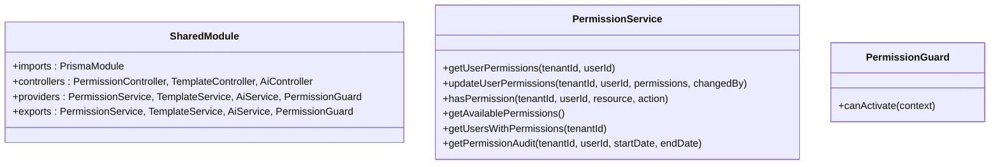

**Diagrama fonte**
- [shared.module.ts](file://backend/shared/shared.module.ts#L11-L16)
- [permission.service.ts](file://backend/shared/services/permission.service.ts#L13-L19)
- [permission.guard.ts](file://backend/shared/guards/permission.guard.ts#L5-L10)

**Seção fonte**
- [shared.module.ts](file://backend/shared/shared.module.ts#L11-L16)
- [permission.service.ts](file://backend/shared/services/permission.service.ts#L21-L313)
- [permission.guard.ts](file://backend/shared/guards/permission.guard.ts#L12-L57)

### Módulo Core
- Controlador: OrdemServicoConfigController
- Serviço: OrdemServicoCronService
- Dependências: CronModule, PrismaModule
- Exporta: OrdemServicoCronService

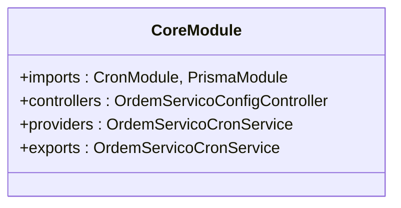

**Diagrama fonte**
- [core.module.ts](file://backend/core/core.module.ts#L7-L12)

**Seção fonte**
- [core.module.ts](file://backend/core/core.module.ts#L7-L12)

### Fluxo de Inicialização
O módulo principal OrdemServicoModule é carregado primeiro, importando e exportando os demais módulos. Os módulos de domínio são inicializados com suas dependências (PrismaModule, AuditModule, SharedModule, CoreModule). O SharedModule fornece serviços e guardas reutilizáveis, enquanto o CoreModule disponibiliza funcionalidades específicas do módulo.

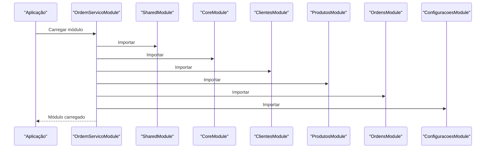

**Diagrama fonte**
- [ordem_servico.module.ts](file://backend/ordem_servico.module.ts#L11-L30)

**Seção fonte**
- [ordem_servico.module.ts](file://backend/ordem_servico.module.ts#L32-L34)

### Padrões de Projeto e Injeção de Dependência
- Injeção de dependência: Os serviços são instanciados automaticamente pelo NestJS com base nos construtores e decorators. Exemplo: ClientesService recebe PrismaService e AuditService.
- Guardas e Decoradores: PermissionGuard verifica permissões antes de permitir acesso a métodos protegidos, usando RequirePermission decorator.
- Modularidade: Cada módulo encapsula sua lógica de negócio e expõe apenas o necessário através de exports.

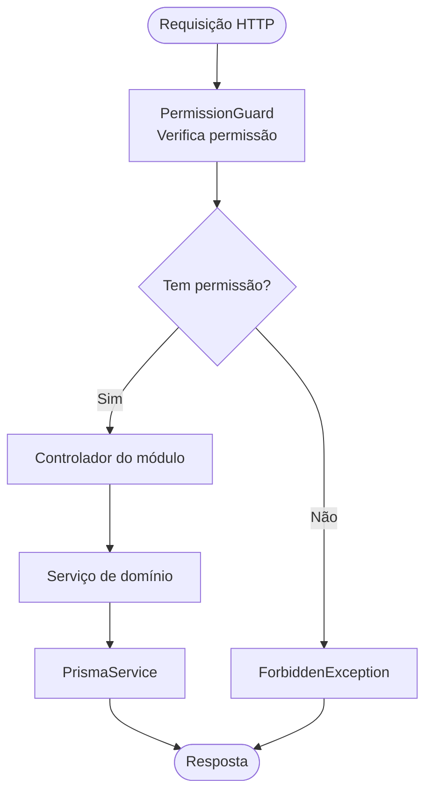

**Diagrama fonte**
- [permission.guard.ts](file://backend/shared/guards/permission.guard.ts#L12-L57)
- [require-permission.decorator.ts](file://backend/shared/decorators/require-permission.decorator.ts#L8-L9)
- [clientes.service.ts](file://backend/clientes/clientes.service.ts#L10-L13)

**Seção fonte**
- [clientes.service.ts](file://backend/clientes/clientes.service.ts#L6-L13)
- [permission.guard.ts](file://backend/shared/guards/permission.guard.ts#L12-L57)
- [require-permission.decorator.ts](file://backend/shared/decorators/require-permission.decorator.ts#L8-L25)

## Análise de Dependências
Os módulos possuem dependências explícitas e são carregados em ordem lógica. O OrdemServicoModule centraliza as importações e exportações, garantindo que os módulos de domínio tenham acesso aos serviços compartilhados e ao PrismaModule.

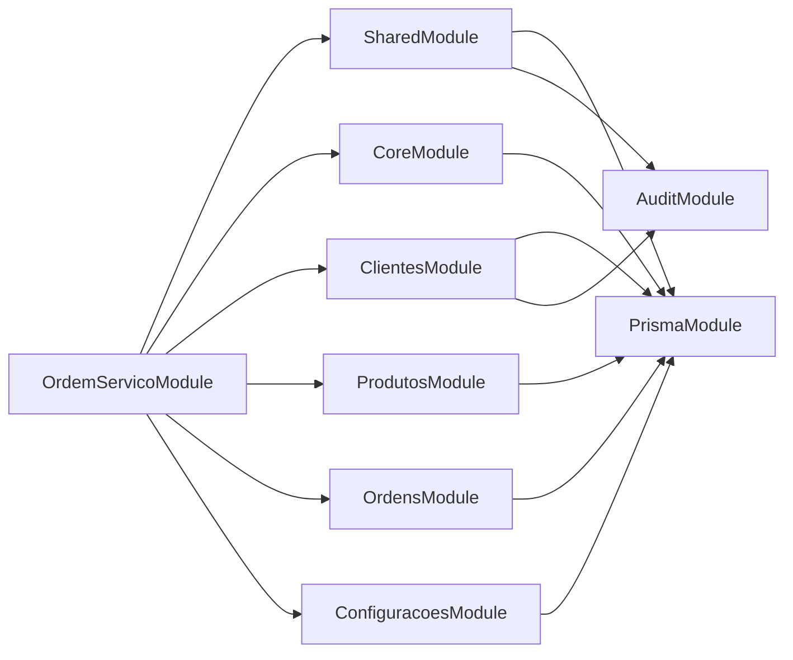

**Diagrama fonte**
- [ordem_servico.module.ts](file://backend/ordem_servico.module.ts#L11-L30)
- [clientes.module.ts](file://backend/clientes/clientes.module.ts#L8-L13)
- [produtos.module.ts](file://backend/produtos/produtos.module.ts#L8-L13)
- [ordens.module.ts](file://backend/ordens/ordens.module.ts#L7-L12)
- [configuracoes.module.ts](file://backend/configuracoes/configuracoes.module.ts#L12-L29)
- [shared.module.ts](file://backend/shared/shared.module.ts#L11-L16)
- [core.module.ts](file://backend/core/core.module.ts#L7-L12)

**Seção fonte**
- [ordem_servico.module.ts](file://backend/ordem_servico.module.ts#L11-L30)

## Considerações de Desempenho
- ClientesService: Realiza buscas com critérios de segurança e limites para evitar sobrecarga. Evita buscas muito curtas e aplica limites máximos.
- OrdensService: Implementa validações rigorosas de entrada, sanitização de parâmetros e paginamento seguro. Utiliza consultas parametrizadas e evita injeção SQL.
- PermissionService: Implementa cache de permissões com TTL para reduzir chamadas ao banco de dados.

**Seção fonte**
- [clientes.service.ts](file://backend/clientes/clientes.service.ts#L15-L86)
- [ordens.service.ts](file://backend/ordens/ordens.service.ts#L137-L473)
- [permission.service.ts](file://backend/shared/services/permission.service.ts#L21-L68)

## Guia de Solução de Problemas
- Erros de permissão: PermissionGuard lança ForbiddenException quando o usuário não possui permissão. Verifique os decorators RequirePermission e o serviço PermissionService.
- Erros de validação: OrdensService realiza validações manuais rigorosas. Confirme que os DTOs estão corretos e que os campos obrigatórios foram preenchidos.
- Erros de banco de dados: ClientesService e OrdensService registram logs detalhados. Verifique os erros lançados e os logs para diagnóstico.

**Seção fonte**
- [permission.guard.ts](file://backend/shared/guards/permission.guard.ts#L42-L56)
- [ordens.service.ts](file://backend/ordens/ordens.service.ts#L146-L161)
- [clientes.service.ts](file://backend/clientes/clientes.service.ts#L145-L148)

## Conclusão
A arquitetura do módulo de Ordens de Serviço adota uma estrutura modular sólida com injeção de dependência e separação clara de preocupações. O OrdemServicoModule atua como container principal, enquanto os módulos de domínio encapsulam lógica de negócio. O SharedModule centraliza serviços e guardas reutilizáveis, e o CoreModule oferece funcionalidades específicas. A implementação de validações rigorosas, cache e logs contribui para robustez e manutenibilidade.

## Apêndice

### Exemplos práticos de como adicionar novos módulos mantendo escalabilidade
- Criar novo módulo de domínio:
  - Definir módulo com imports, controllers, providers e exports.
  - Garantir dependências mínimas (ex: PrismaModule, SharedModule).
  - Exportar somente o necessário.
- Integrar no módulo principal:
  - Importar o novo módulo em OrdemServicoModule.
  - Adicionar rotas no arquivo de rotas se for um controlador público.
- Manter boas práticas:
  - Separar lógica de negócio nos serviços.
  - Utilizar guardas e decorators para controle de permissões.
  - Implementar validações e sanitização de dados.
  - Utilizar cache para melhorar desempenho de leitura.

**Seção fonte**
- [ordem_servico.module.ts](file://backend/ordem_servico.module.ts#L11-L30)
- [routes.ts](file://backend/routes.ts#L9-L17)