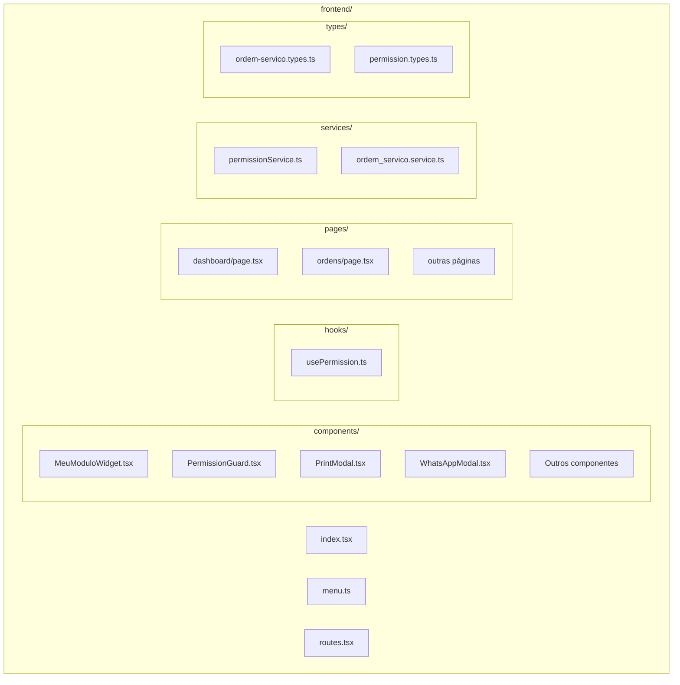
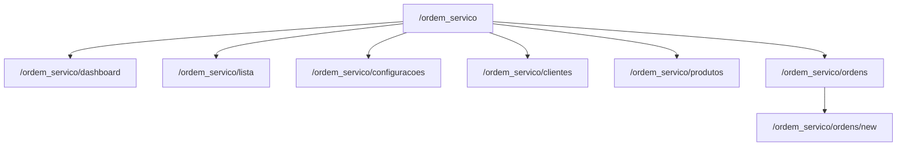
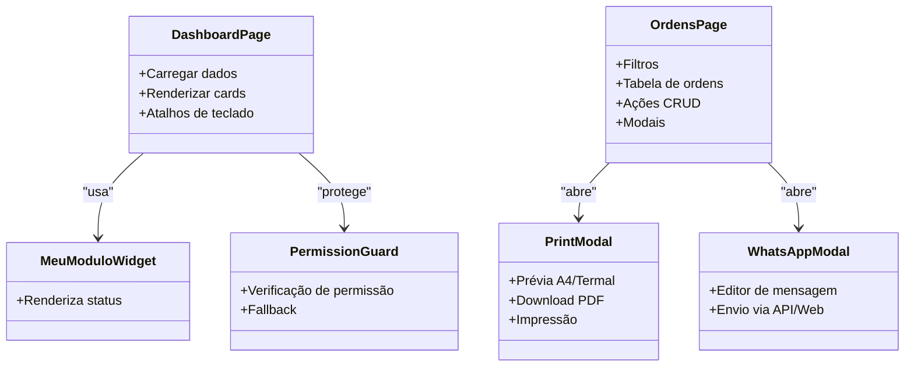
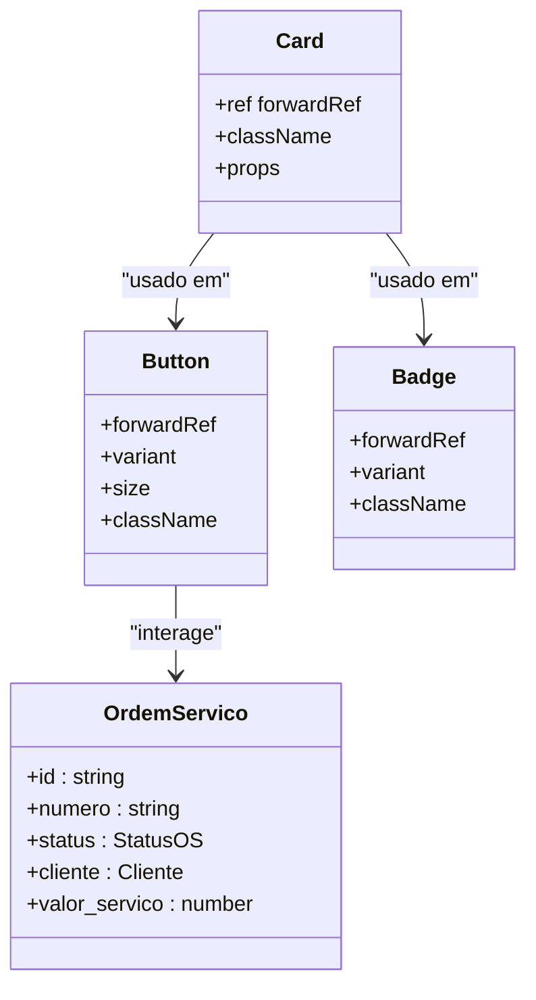
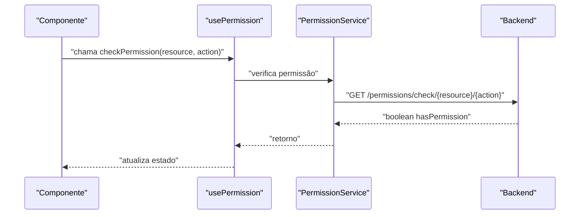
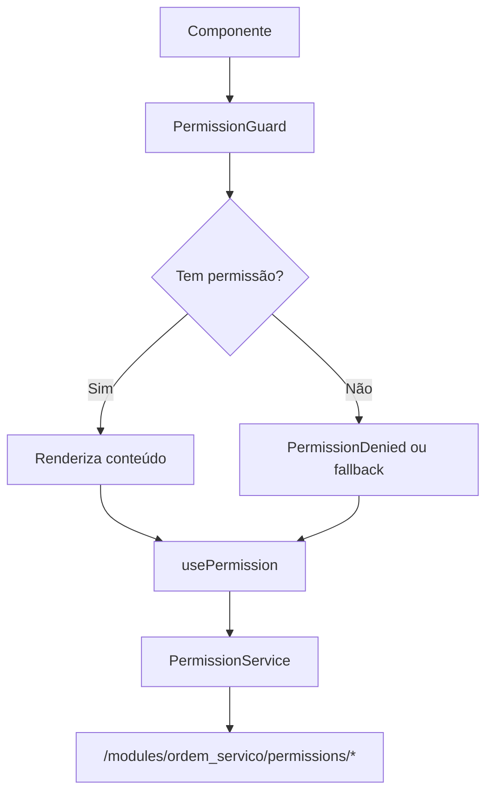
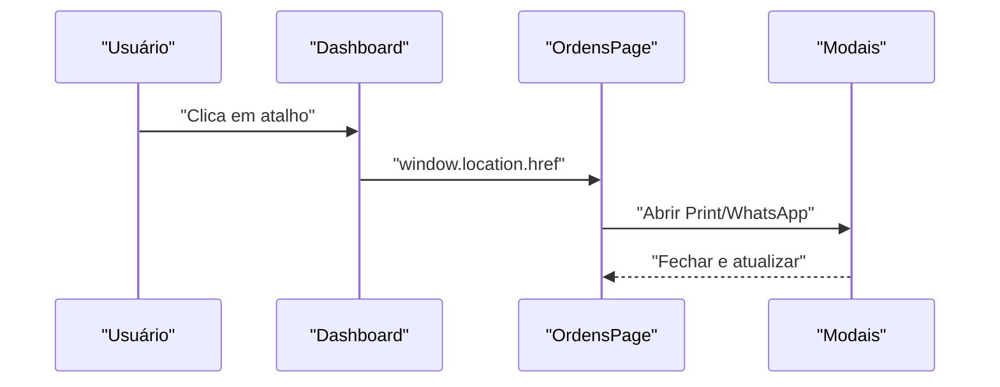

# Arquitetura Frontend React

<cite>
**Arquivo referenciados neste documento**
- [frontend/index.tsx](file://frontend/index.tsx)
- [frontend/menu.ts](file://frontend/menu.ts)
- [frontend/routes.tsx](file://frontend/routes.tsx)
- [frontend/pages/dashboard/page.tsx](file://frontend/pages/dashboard/page.tsx)
- [frontend/pages/ordens/page.tsx](file://frontend/pages/ordens/page.tsx)
- [frontend/components/MeuModuloWidget.tsx](file://frontend/components/MeuModuloWidget.tsx)
- [frontend/components/PermissionGuard.tsx](file://frontend/components/PermissionGuard.tsx)
- [frontend/hooks/usePermission.ts](file://frontend/hooks/usePermission.ts)
- [frontend/services/permissionService.ts](file://frontend/services/permissionService.ts)
- [frontend/types/ordem-servico.types.ts](file://frontend/types/ordem-servico.types.ts)
- [frontend/types/permission.types.ts](file://frontend/types/permission.types.ts)
- [frontend/components/PrintModal.tsx](file://frontend/components/PrintModal.tsx)
- [frontend/components/WhatsAppModal.tsx](file://frontend/components/WhatsAppModal.tsx)
- [frontend/services/ordem_servico.service.ts](file://frontend/services/ordem_servico.service.ts)
</cite>

## Sumário
1. [Introdução](#introdução)
2. [Estrutura de Pastas](#estrutura-de-pastas)
3. [Sistema de Rotas Next.js](#sistema-de-rotas-nextjs)
4. [Componentes Principais](#componentes-principais)
5. [Padrão de Componentes Reutilizáveis](#padrão-de-componentes-reutilizáveis)
6. [Hooks Personalizados](#hooks-personalizados)
7. [Sistema de Estado Global](#sistema-de-estado-global)
8. [Design System com Tailwind CSS](#design-system-com-tailwind-css)
9. [Autenticação e Permissões](#autenticação-e-permissões)
10. [Fluxo de Navegação](#fluxo-de-navegação)
11. [Exemplos Práticos](#exemplos-práticos)
12. [Considerações de Desempenho](#considerações-de-desempenho)
13. [Guia de Solução de Problemas](#guia-de-solução-de-problemas)
14. [Conclusão](#conclusão)

## Introdução
Este documento apresenta a arquitetura frontend React do módulo de Ordens de Serviço, detalhando a estrutura de pastas, rotas, componentes e fluxos de navegação. O projeto utiliza Next.js para roteamento, Tailwind CSS para design system, e componentes reutilizáveis para padronização. Além disso, o sistema inclui um mecanismo de permissões integrado e funcionalidades de impressão e comunicação via WhatsApp.

## Estrutura de Pastas
A estrutura do frontend segue uma organização por recursos e camadas:

**Fontes do diagrama**
- [frontend/index.tsx](file://frontend/index.tsx#L1-L22)
- [frontend/menu.ts](file://frontend/menu.ts#L1-L50)
- [frontend/routes.tsx](file://frontend/routes.tsx#L1-L20)

**Seções fonte**
- [frontend/index.tsx](file://frontend/index.tsx#L1-L22)
- [frontend/menu.ts](file://frontend/menu.ts#L1-L50)
- [frontend/routes.tsx](file://frontend/routes.tsx#L1-L20)

## Sistema de Rotas Next.js
O módulo define um conjunto de rotas no escopo `/ordem_servico` com mapeamento explícito para cada página. As rotas são declaradas em um array centralizado, facilitando manutenção e expansão.

**Fontes do diagrama**
- [frontend/routes.tsx](file://frontend/routes.tsx#L1-L20)

**Seções fonte**
- [frontend/routes.tsx](file://frontend/routes.tsx#L1-L20)

## Componentes Principais
Os componentes principais são responsáveis por diferentes aspectos da interface e funcionalidades:

- **Dashboard**: Exibe resumo de ordens e atalhos de navegação.
- **Página de Ordens**: Lista, filtra e gerencia ordens de serviço.
- **Widgets**: Componentes reutilizáveis para dashboards.
- **Modais**: Impressão e comunicação via WhatsApp.
- **Permissões**: Controle de acesso granular.

**Fontes do diagrama**
- [frontend/pages/dashboard/page.tsx](file://frontend/pages/dashboard/page.tsx#L283-L437)
- [frontend/pages/ordens/page.tsx](file://frontend/pages/ordens/page.tsx#L166-L684)
- [frontend/components/MeuModuloWidget.tsx](file://frontend/components/MeuModuloWidget.tsx#L1-L21)
- [frontend/components/PrintModal.tsx](file://frontend/components/PrintModal.tsx#L1-L223)
- [frontend/components/WhatsAppModal.tsx](file://frontend/components/WhatsAppModal.tsx#L1-L216)
- [frontend/components/PermissionGuard.tsx](file://frontend/components/PermissionGuard.tsx#L1-L50)

**Seções fonte**
- [frontend/pages/dashboard/page.tsx](file://frontend/pages/dashboard/page.tsx#L283-L437)
- [frontend/pages/ordens/page.tsx](file://frontend/pages/ordens/page.tsx#L166-L684)
- [frontend/components/MeuModuloWidget.tsx](file://frontend/components/MeuModuloWidget.tsx#L1-L21)
- [frontend/components/PrintModal.tsx](file://frontend/components/PrintModal.tsx#L1-L223)
- [frontend/components/WhatsAppModal.tsx](file://frontend/components/WhatsAppModal.tsx#L1-L216)
- [frontend/components/PermissionGuard.tsx](file://frontend/components/PermissionGuard.tsx#L1-L50)

## Padrão de Componentes Reutilizáveis
A aplicação adota um design system com componentes reutilizáveis construídos com Tailwind CSS. Os componentes principais incluem:

- **Card**: Container com bordas, sombras e fundos variáveis.
- **Button**: Variante e tamanho configuráveis.
- **Badge**: Indicadores de status com cores específicas.
- **Tipos de dados**: Interfaces para ordens de serviço, clientes e histórico.

**Fontes do diagrama**
- [frontend/pages/dashboard/page.tsx](file://frontend/pages/dashboard/page.tsx#L21-L108)
- [frontend/types/ordem-servico.types.ts](file://frontend/types/ordem-servico.types.ts#L3-L48)

**Seções fonte**
- [frontend/pages/dashboard/page.tsx](file://frontend/pages/dashboard/page.tsx#L21-L108)
- [frontend/types/ordem-servico.types.ts](file://frontend/types/ordem-servico.types.ts#L3-L48)

## Hooks Personalizados
O hook `usePermission` fornece uma interface para verificar permissões de forma assíncrona, com suporte a múltiplas permissões e cache de resultados.

**Fontes do diagrama**
- [frontend/hooks/usePermission.ts](file://frontend/hooks/usePermission.ts#L12-L56)
- [frontend/services/permissionService.ts](file://frontend/services/permissionService.ts#L107-L115)

**Seções fonte**
- [frontend/hooks/usePermission.ts](file://frontend/hooks/usePermission.ts#L12-L56)
- [frontend/services/permissionService.ts](file://frontend/services/permissionService.ts#L107-L115)

## Sistema de Estado Global
O frontend utiliza React Hooks para gerenciamento local de estado nos componentes. Para estados compartilhados entre componentes, recomenda-se:

- Contextos para autenticação e configurações globais.
- Stores para dados complexos e persistência.
- Persistência em localStorage/sessionStorage apenas para dados não sensíveis.

## Design System com Tailwind CSS
A aplicação adota Tailwind CSS para estilização, com classes utilitárias para:
- Layouts responsivos (grid, flex).
- Cores e temas claro/escuro.
- Componentes reutilizáveis (Card, Button, Badge).
- Animações e transições.

## Autenticação e Permissões
O sistema de permissões permite verificar acesso a recursos específicos e proteger rotas e componentes:

- **PermissionGuard**: Componente que protege conteúdo com base em permissões.
- **usePermission**: Hook para verificar permissões em tempo real.
- **PermissionService**: Camada de serviço para requisições de permissões.

**Fontes do diagrama**
- [frontend/components/PermissionGuard.tsx](file://frontend/components/PermissionGuard.tsx#L12-L50)
- [frontend/hooks/usePermission.ts](file://frontend/hooks/usePermission.ts#L12-L56)
- [frontend/services/permissionService.ts](file://frontend/services/permissionService.ts#L52-L135)

**Seções fonte**
- [frontend/components/PermissionGuard.tsx](file://frontend/components/PermissionGuard.tsx#L12-L50)
- [frontend/hooks/usePermission.ts](file://frontend/hooks/usePermission.ts#L12-L56)
- [frontend/services/permissionService.ts](file://frontend/services/permissionService.ts#L52-L135)

## Fluxo de Navegação
O fluxo de navegação segue o padrão Next.js com navegação programática e uso de modais para ações secundárias.

**Fontes do diagrama**
- [frontend/pages/dashboard/page.tsx](file://frontend/pages/dashboard/page.tsx#L292-L335)
- [frontend/pages/ordens/page.tsx](file://frontend/pages/ordens/page.tsx#L275-L324)

**Seções fonte**
- [frontend/pages/dashboard/page.tsx](file://frontend/pages/dashboard/page.tsx#L292-L335)
- [frontend/pages/ordens/page.tsx](file://frontend/pages/ordens/page.tsx#L275-L324)

## Exemplos Práticos
Para criar uma nova página seguindo a arquitetura:

1. **Adicione a rota** em `routes.tsx` com o caminho e componente correspondente.
2. **Crie o arquivo** na pasta `pages/nova-pagina/page.tsx`.
3. **Importe e exporte** a página no `index.tsx`.
4. **Adicione ao menu** em `menu.ts` com ícone, nome e permissões.
5. **Proteja com permissões** usando `PermissionGuard` quando necessário.

Para criar um novo componente reutilizável:

1. **Defina a interface** em `types/` se for um tipo específico.
2. **Crie o componente** em `components/` com Tailwind CSS.
3. **Exporte no index.tsx** do diretório de componentes.
4. **Utilize em páginas** e outros componentes.

## Considerações de Desempenho
- Utilize `React.lazy` e `Suspense` para divisão de código em páginas raras.
- Evite re-renderizações desnecessárias com `React.memo` e `useMemo`.
- Prefira `useCallback` para funções passadas como props.
- Otimize imagens e evite grandes dependências.

## Guia de Solução de Problemas
- **Permissões negadas**: Verifique se o usuário possui a permissão necessária e se a API retorna corretamente.
- **Token ausente**: Confirme a presença do token em cookies ou sessionStorage.
- **Erros de rede**: Valide URLs e headers da API.
- **Modais não abrindo**: Verifique estados de abertura e propagação de eventos.

**Seções fonte**
- [frontend/services/permissionService.ts](file://frontend/services/permissionService.ts#L52-L135)
- [frontend/pages/ordens/page.tsx](file://frontend/pages/ordens/page.tsx#L204-L247)

## Conclusão
A arquitetura frontend do módulo de Ordens de Serviço demonstra uma estrutura bem definida com Next.js, Tailwind CSS e componentes reutilizáveis. O sistema de permissões e os hooks personalizados garantem segurança e manutenibilidade. A padronização de componentes e o design system facilitam a expansão e a manutenção contínua do projeto.