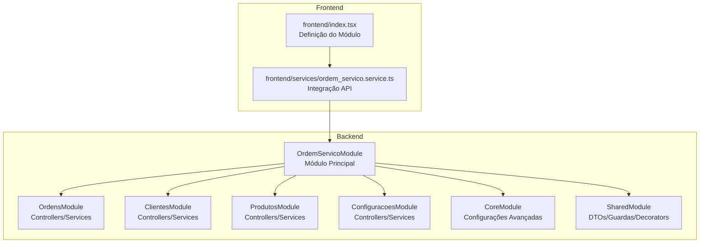
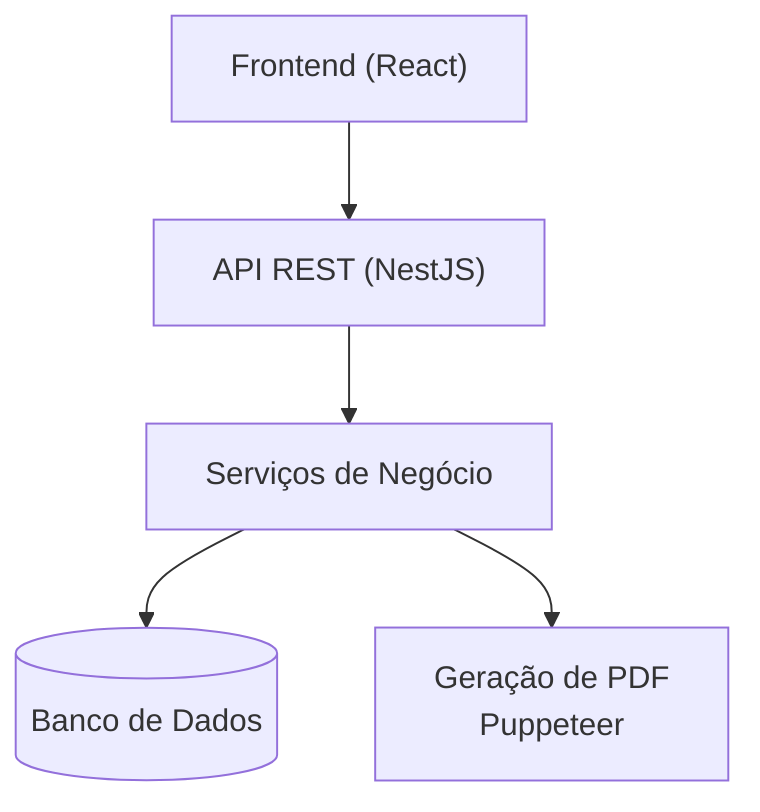
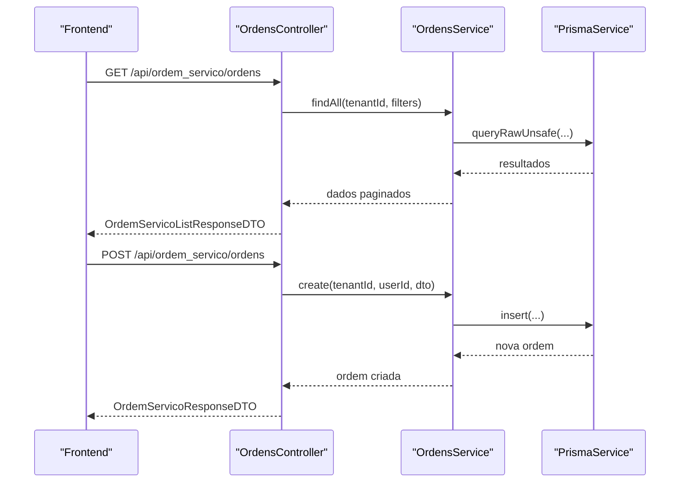
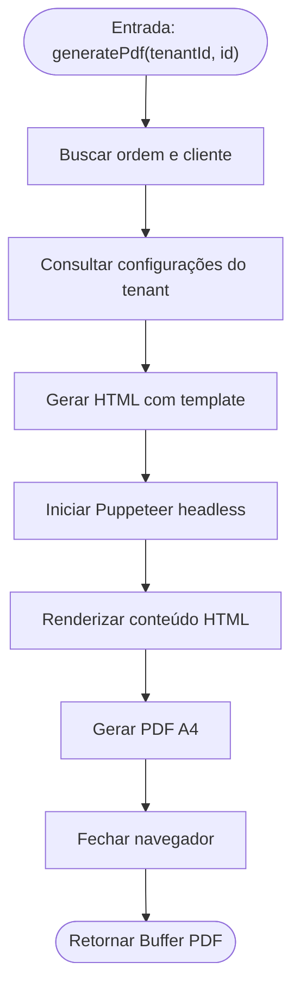
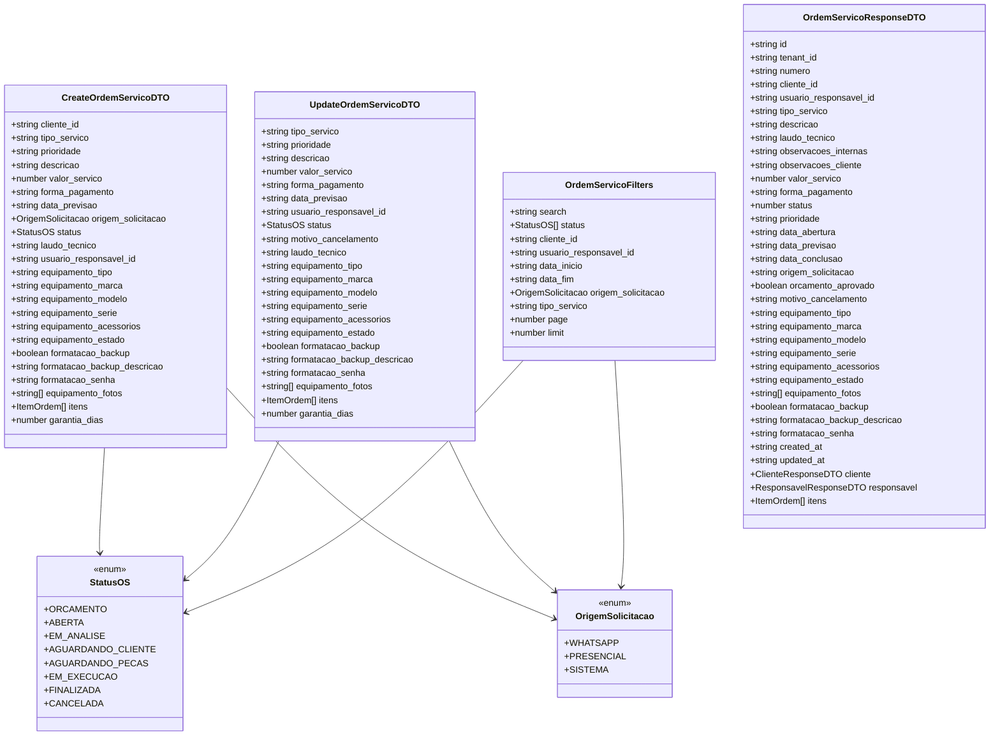
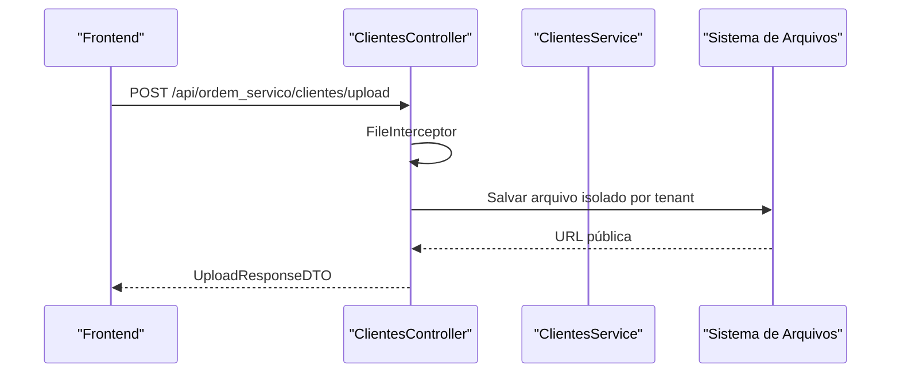
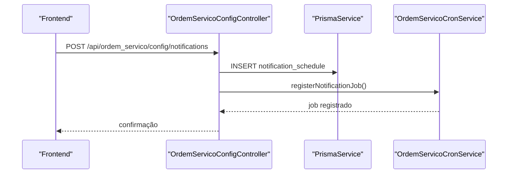
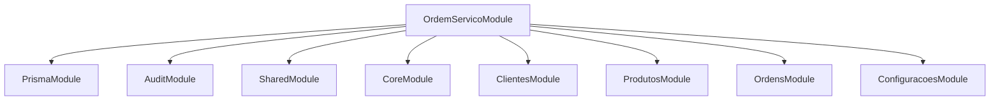

# Arquitetura Técnica

<cite>
**Arquivo Referenciados Neste Documento**
- [backend/README.md](file://backend/README.md)
- [backend/module.json](file://backend/module.json)
- [backend/ordem_servico.module.ts](file://backend/ordem_servico.module.ts)
- [backend/routes.ts](file://backend/routes.ts)
- [backend/ordens/ordens.controller.ts](file://backend/ordens/ordens.controller.ts)
- [backend/ordens/ordens.service.ts](file://backend/ordens/ordens.service.ts)
- [backend/shared/dto/ordem-servico.dto.ts](file://backend/shared/dto/ordem-servico.dto.ts)
- [backend/migrations/004_add_tables_os.sql](file://backend/migrations/004_add_tables_os.sql)
- [backend/seeds/seeds_os.sql](file://backend/seeds/seeds_os.sql)
- [backend/clientes/clientes.controller.ts](file://backend/clientes/clientes.controller.ts)
- [backend/produtos/produtos.controller.ts](file://backend/produtos/produtos.controller.ts)
- [backend/configuracoes/configuracoes.controller.ts](file://backend/configuracoes/configuracoes.controller.ts)
- [backend/core/ordem-servico-config.controller.ts](file://backend/core/ordem-servico-config.controller.ts)
- [frontend/index.tsx](file://frontend/index.tsx)
- [frontend/services/ordem_servico.service.ts](file://frontend/services/ordem_servico.service.ts)
</cite>

## Sumário
1. [Introdução](#introdução)
2. [Estrutura do Projeto](#estrutura-do-projeto)
3. [Componentes Principais](#componentes-principais)
4. [Visão Geral da Arquitetura](#visão-geral-da-arquitetura)
5. [Análise Detalhada dos Componentes](#análise-detalhada-dos-componentes)
6. [Análise de Dependências](#análise-de-dependências)
7. [Considerações de Desempenho](#considerações-de-desempenho)
8. [Guia de Solução de Problemas](#guia-de-solução-de-problemas)
9. [Conclusão](#conclusão)
10. [Apêndices](#apêndices)

## Introdução
O módulo de Ordens de Serviço constitui um componente crítico de um sistema multitenant, oferecendo funcionalidades completas de gestão de ordens, acompanhamento de status, geração de documentos, integração com clientes e produtos, além de configurações avançadas de notificações e papéis de usuário. Este documento apresenta a arquitetura técnica, padrões adotados, limites do sistema, interações entre componentes, fluxos de dados e padrões de integração, além de decisões técnicas, compensações, requisitos de infraestrutura, escalabilidade, topologia de implantação, preocupações transversais e pilha tecnológica.

## Estrutura do Projeto
O módulo segue uma arquitetura modular NestJS com camadas bem definidas:
- Backend: módulos de Ordens, Clientes, Produtos, Configurações, Core e Shared.
- Frontend: componentes React com serviços de integração à API.
- Infraestrutura: migrações e seeds para inicialização do esquema de dados.

**Diagrama fonte**
- [backend/ordem_servico.module.ts](file://backend/ordem_servico.module.ts#L11-L30)
- [backend/routes.ts](file://backend/routes.ts#L9-L17)
- [frontend/index.tsx](file://frontend/index.tsx#L6-L21)

**Fontes da seção**
- [backend/README.md](file://backend/README.md#L1-L59)
- [backend/module.json](file://backend/module.json#L1-L48)

## Componentes Principais
- Módulo Principal: OrdemServicoModule, que importa e exporta os demais módulos.
- Controllers: OrdemServicoConfigController, OrdensController, ClientesController, ProdutosController, ConfiguracoesController.
- Services: OrdensService, ClientesService, ProdutosService, ConfiguracoesService, OrdemServicoCronService.
- DTOs: Tipos e validações para requisições e respostas.
- Mapeamento de Rotas: Routes.ts define os controladores expostos.
- Frontend: index.tsx e ordem_servico.service.ts para integração com a API.

**Fontes da seção**
- [backend/ordem_servico.module.ts](file://backend/ordem_servico.module.ts#L1-L35)
- [backend/routes.ts](file://backend/routes.ts#L1-L17)
- [backend/shared/dto/ordem-servico.dto.ts](file://backend/shared/dto/ordem-servico.dto.ts#L1-L397)
- [frontend/index.tsx](file://frontend/index.tsx#L1-L22)
- [frontend/services/ordem_servico.service.ts](file://frontend/services/ordem_servico.service.ts#L1-L20)

## Visão Geral da Arquitetura
A arquitetura adota o padrão de módulos NestJS com separação de responsabilidades:
- Controladores: lidam com requisições HTTP, validações e autenticação.
- Serviços: implementam a lógica de negócio, integrações e persistência.
- DTOs: validação e tipagem de dados de entrada/saída.
- Módulos: encapsulamento de funcionalidades e exportação de dependências.
- Frontend: comunicação assíncrona com a API REST.

**Diagrama fonte**
- [backend/ordens/ordens.controller.ts](file://backend/ordens/ordens.controller.ts#L25-L377)
- [backend/ordens/ordens.service.ts](file://backend/ordens/ordens.service.ts#L15-L123)

## Análise Detalhada dos Componentes

### Controller de Ordens de Serviço
Responsável pelas operações CRUD, geração de PDF, upload de arquivos, histórico e validações de status.

**Diagrama fonte**
- [backend/ordens/ordens.controller.ts](file://backend/ordens/ordens.controller.ts#L34-L179)
- [backend/ordens/ordens.service.ts](file://backend/ordens/ordens.service.ts#L137-L473)

**Fontes da seção**
- [backend/ordens/ordens.controller.ts](file://backend/ordens/ordens.controller.ts#L1-L377)
- [backend/ordens/ordens.service.ts](file://backend/ordens/ordens.service.ts#L1-L800)

### Serviço de Ordens de Serviço
Implementa a lógica de negócio, geração de PDF com Puppeteer, validações de status e histórico.

**Diagrama fonte**
- [backend/ordens/ordens.service.ts](file://backend/ordens/ordens.service.ts#L15-L123)

**Fontes da seção**
- [backend/ordens/ordens.service.ts](file://backend/ordens/ordens.service.ts#L15-L123)

### DTOs de Ordens de Serviço
Define enums de status e origem, DTOs de criação/atualização, filtros de consulta e DTOs de resposta.

**Diagrama fonte**
- [backend/shared/dto/ordem-servico.dto.ts](file://backend/shared/dto/ordem-servico.dto.ts#L1-L397)

**Fontes da seção**
- [backend/shared/dto/ordem-servico.dto.ts](file://backend/shared/dto/ordem-servico.dto.ts#L1-L397)

### Controllers de Clientes e Produtos
Controladores com permissões e upload de arquivos, com validações e tratamento de erros robusto.

**Diagrama fonte**
- [backend/clientes/clientes.controller.ts](file://backend/clientes/clientes.controller.ts#L74-L119)

**Fontes da seção**
- [backend/clientes/clientes.controller.ts](file://backend/clientes/clientes.controller.ts#L1-L182)
- [backend/produtos/produtos.controller.ts](file://backend/produtos/produtos.controller.ts#L1-L144)

### Configurações e Papéis
Endpoints para configurações de notificações, tipos de serviço/equipamento, usuários e papéis.

**Diagrama fonte**
- [backend/core/ordem-servico-config.controller.ts](file://backend/core/ordem-servico-config.controller.ts#L28-L46)

**Fontes da seção**
- [backend/core/ordem-servico-config.controller.ts](file://backend/core/ordem-servico-config.controller.ts#L1-L254)
- [backend/configuracoes/configuracoes.controller.ts](file://backend/configuracoes/configuracoes.controller.ts#L1-L136)

## Análise de Dependências
- Módulo Principal: OrdemServicoModule importa PrismaModule, AuditModule, SharedModule, CoreModule, ClientesModule, ProdutosModule, OrdensModule, ConfiguracoesModule.
- Rotas: ModuleRoutes aponta para os controladores expostos.
- Frontend: index.tsx define widgets e módulo; ordem_servico.service.ts consome endpoints da API.

**Diagrama fonte**
- [backend/ordem_servico.module.ts](file://backend/ordem_servico.module.ts#L11-L30)

**Fontes da seção**
- [backend/ordem_servico.module.ts](file://backend/ordem_servico.module.ts#L1-L35)
- [backend/routes.ts](file://backend/routes.ts#L1-L17)
- [frontend/index.tsx](file://frontend/index.tsx#L1-L22)

## Considerações de Desempenho
- Validação e sanitização de filtros: evita consultas inseguras e melhora desempenho com limites de busca e paginação.
- Paginação controlada: limites máximos e mínimos de registros por página.
- Geração de PDF: Puppeteer em modo headless com argumentos otimizados e timeouts configuráveis.
- Persistência: uso de Prisma com queries raw para maior controle e performance em operações complexas.

[Sem fontes desta seção, pois fornece orientações gerais]

## Guia de Solução de Problemas
- Erros de upload: verificação de buffer, tipos MIME e tamanhos máximos; caminhos de upload isolados por tenant.
- Validações de status: transições permitidas previamente definidas; mensagens de erro específicas para estados inválidos.
- Geração de PDF: verifique permissões de leitura de arquivos, caminho do logo e configurações do Puppeteer.

**Fontes da seção**
- [backend/ordens/ordens.controller.ts](file://backend/ordens/ordens.controller.ts#L310-L355)
- [backend/ordens/ordens.service.ts](file://backend/ordens/ordens.service.ts#L15-L123)
- [backend/clientes/clientes.controller.ts](file://backend/clientes/clientes.controller.ts#L74-L119)

## Conclusão
O módulo de Ordens de Serviço demonstra uma arquitetura sólida, com clara separação de camadas, validações rigorosas, persistência eficiente e geração de documentos automatizada. A abordagem multitenant, com papéis e permissões bem definidos, proporciona flexibilidade e segurança. As decisões técnicas priorizam robustez operacional, escalabilidade e manutenibilidade.

[Sem fontes desta seção, pois resume sem análise específica de arquivos]

## Apêndices

### Requisitos de Infraestrutura
- Backend: Node.js com NestJS, PostgreSQL, Prisma, Puppeteer.
- Frontend: React com TypeScript, bibliotecas de UI e serviços HTTP.
- Armazenamento: sistema de arquivos local para uploads (isolados por tenant).
- Segurança: JWT, guardas de permissão e papéis de usuário.

**Fontes da seção**
- [backend/README.md](file://backend/README.md#L31-L59)
- [backend/ordens/ordens.service.ts](file://backend/ordens/ordens.service.ts#L82-L95)

### Topologia de Implantação
- Backend: instância única ou cluster com balanceamento de carga, conectada ao banco de dados PostgreSQL.
- Frontend: hospedado separadamente, consumindo a API REST.
- PDF: geração local com Puppeteer; recomendado em ambiente com permissões de escrita e recursos suficientes.

**Fontes da seção**
- [backend/README.md](file://backend/README.md#L1-L59)

### Padrões de Integração
- API REST: endpoints padronizados com métodos HTTP e DTOs de entrada/saída.
- Autenticação: JWT com guardas de autenticação e permissões.
- Upload de Arquivos: multipart/form-data com validações e armazenamento isolado.

**Fontes da seção**
- [backend/ordens/ordens.controller.ts](file://backend/ordens/ordens.controller.ts#L310-L377)
- [backend/clientes/clientes.controller.ts](file://backend/clientes/clientes.controller.ts#L74-L140)
- [backend/produtos/produtos.controller.ts](file://backend/produtos/produtos.controller.ts#L63-L144)

### Migrações e Seeds
- Migrações: criação de tabelas, ajuste de campos e triggers para sincronização.
- Seeds: configurações padrão, termos e papéis iniciais.

**Fontes da seção**
- [backend/migrations/004_add_tables_os.sql](file://backend/migrations/004_add_tables_os.sql#L1-L80)
- [backend/seeds/seeds_os.sql](file://backend/seeds/seeds_os.sql#L1-L69)

### Pilha Tecnológica e Dependências
- Backend: NestJS, Prisma, Puppeteer, Express.
- Frontend: React, TypeScript, Axios.
- Banco de Dados: PostgreSQL.
- Segurança: JWT, guardas de permissão.

**Fontes da seção**
- [backend/module.json](file://backend/module.json#L1-L48)
- [backend/README.md](file://backend/README.md#L1-L59)