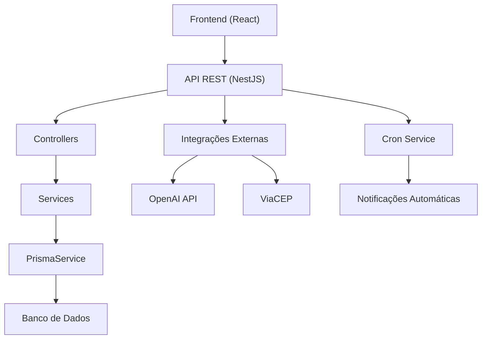
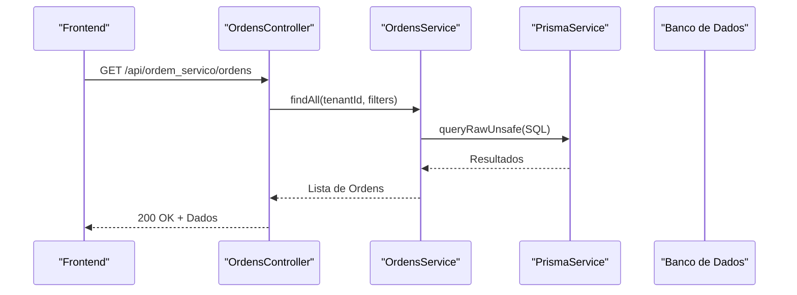
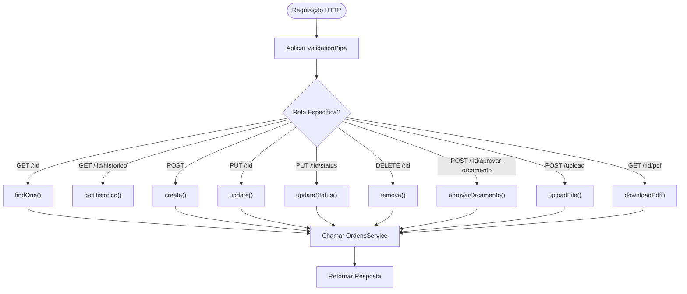
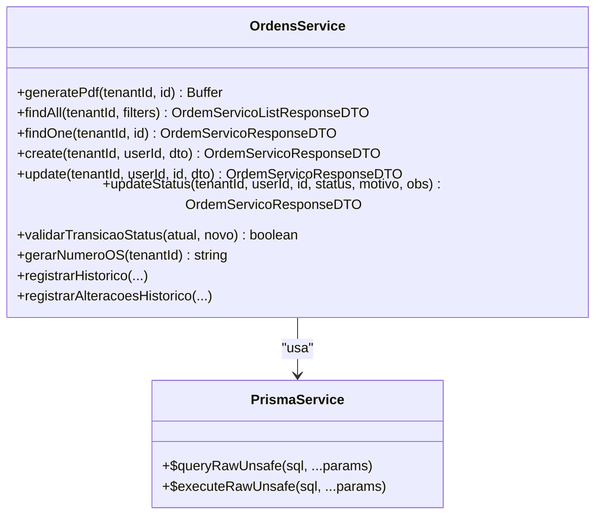
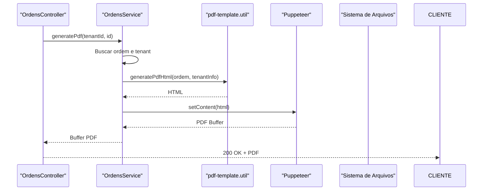
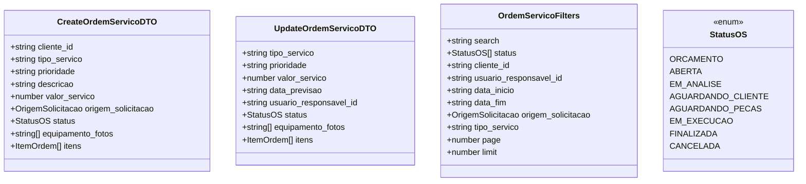
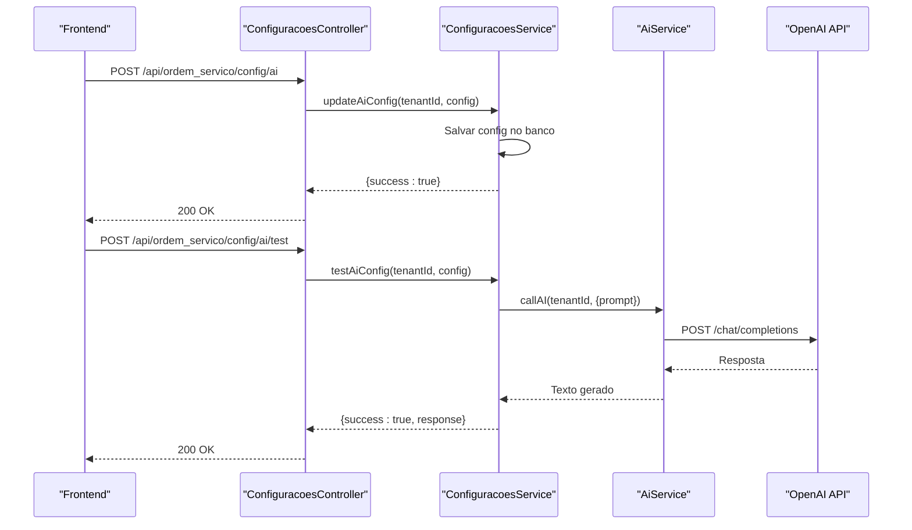
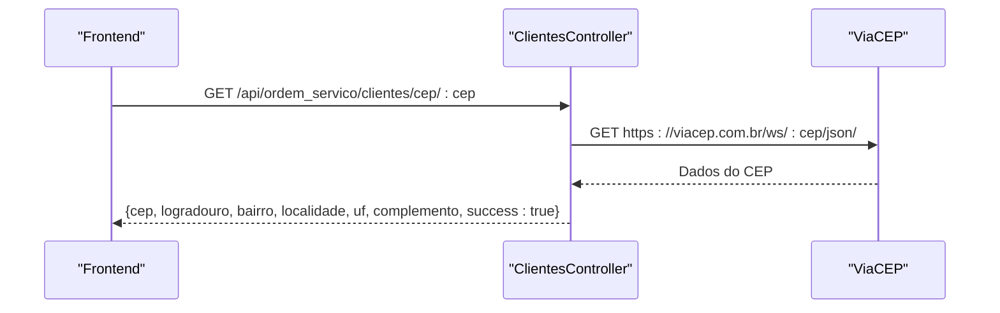
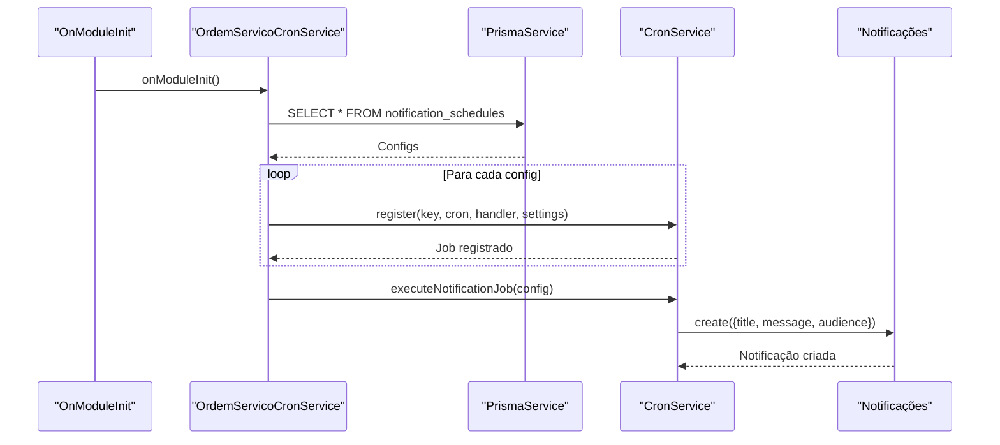
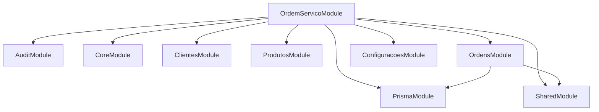

# Fluxo de Dados e Integrações

<cite>
**Arquivos referenciados neste documento**
- [backend/ordens/ordens.controller.ts](file://backend/ordens/ordens.controller.ts)
- [backend/ordens/ordens.service.ts](file://backend/ordens/ordens.service.ts)
- [backend/ordens/pdf-template.util.ts](file://backend/ordens/pdf-template.util.ts)
- [backend/ordens/ordens.module.ts](file://backend/ordens/ordens.module.ts)
- [backend/ordem_servico.module.ts](file://backend/ordem_servico.module.ts)
- [backend/routes.ts](file://backend/routes.ts)
- [backend/shared/dto/ordem-servico.dto.ts](file://backend/shared/dto/ordem-servico.dto.ts)
- [frontend/services/ordem_servico.service.ts](file://frontend/services/ordem_servico.service.ts)
- [frontend/types/ordem-servico.types.ts](file://frontend/types/ordem-servico.types.ts)
- [backend/configuracoes/configuracoes.controller.ts](file://backend/configuracoes/configuracoes.controller.ts)
- [backend/configuracoes/configuracoes.service.ts](file://backend/configuracoes/configuracoes.service.ts)
- [backend/shared/services/ai.service.ts](file://backend/shared/services/ai.service.ts)
- [backend/migrations/001_master.sql](file://backend/migrations/001_master.sql)
- [backend/core/ordem-servico-cron.service.ts](file://backend/core/ordem-servico-cron.service.ts)
- [backend/clientes/clientes.controller.ts](file://backend/clientes/clientes.controller.ts)
- [frontend/components/ClientModal.tsx](file://frontend/components/ClientModal.tsx)
- [frontend/components/ClientEditModal.tsx](file://frontend/components/ClientEditModal.tsx)
</cite>

## Sumário
1. [Introdução](#introdução)
2. [Estrutura do Projeto](#estrutura-do-projeto)
3. [Componentes-Chave](#componentes-chave)
4. [Visão Geral da Arquitetura](#visão-geral-da-arquitetura)
5. [Análise Detalhada dos Componentes](#análise-detalhada-dos-componentes)
6. [Análise de Dependências](#análise-de-dependências)
7. [Considerações de Desempenho](#considerações-de-desempenho)
8. [Guia de Solução de Problemas](#guia-de-solução-de-problemas)
9. [Conclusão](#conclusão)

## Introdução
Este documento apresenta o fluxo completo de dados e integrações no módulo de Ordens de Serviço, desde o frontend até o banco de dados. Ele explica como controllers, services e repositories se comunicam, descreve o ciclo de requisições HTTP, operações CRUD, validações e tratamento de erros. Também documenta integrações externas como OpenAI API, ViaCEP e notificações automáticas, além do processo de geração de PDFs com templates e impressão.

## Estrutura do Projeto
O módulo segue uma arquitetura modular NestJS com camadas bem definidas:
- Backend: Controllers, Services, DTOs, Módulos e migrações
- Frontend: Componentes React, serviços e tipos
- Integrações: OpenAI, ViaCEP, notificações automáticas

**Diagrama fonte**
- [backend/ordem_servico.module.ts](file://backend/ordem_servico.module.ts#L11-L31)
- [backend/routes.ts](file://backend/routes.ts#L9-L17)

**Seção fonte**
- [backend/ordem_servico.module.ts](file://backend/ordem_servico.module.ts#L11-L31)
- [backend/ordens/ordens.module.ts](file://backend/ordens/ordens.module.ts#L7-L12)

## Componentes-Chave
- Controllers: Controlam o fluxo de requisições HTTP e validações iniciais
- Services: Implementam a lógica de negócio, integrações e persistência
- DTOs: Definem estruturas de dados para entrada/saída
- PDF Generator: Utiliza templates e Puppeteer para geração de documentos
- Integrações: OpenAI, ViaCEP, notificações automáticas

**Seção fonte**
- [backend/ordens/ordens.controller.ts](file://backend/ordens/ordens.controller.ts#L25-L377)
- [backend/ordens/ordens.service.ts](file://backend/ordens/ordens.service.ts#L1-L800)
- [backend/shared/dto/ordem-servico.dto.ts](file://backend/shared/dto/ordem-servico.dto.ts#L1-L397)

## Visão Geral da Arquitetura
O fluxo de requisições segue o padrão MVC com injeção de dependência e pipes de validação. O controller recebe a requisição, aplica validações e delega para o service, que interage com o PrismaService para operações no banco de dados. Para geração de PDFs, o service utiliza um utilitário de template e o Puppeteer para renderização.

**Diagrama fonte**
- [backend/ordens/ordens.controller.ts](file://backend/ordens/ordens.controller.ts#L34-L55)
- [backend/ordens/ordens.service.ts](file://backend/ordens/ordens.service.ts#L137-L473)

## Análise Detalhada dos Componentes

### Controller de Ordens
Responsável por expor endpoints REST, aplicar pipes de validação e tratar erros. Realiza:
- Listagem com filtros e paginação
- Busca por ID e histórico
- Criação, atualização, aprovação de orçamento e exclusão
- Upload de arquivos e geração de PDF
- Validações de status e permissões

**Diagrama fonte**
- [backend/ordens/ordens.controller.ts](file://backend/ordens/ordens.controller.ts#L34-L377)

**Seção fonte**
- [backend/ordens/ordens.controller.ts](file://backend/ordens/ordens.controller.ts#L34-L377)

### Service de Ordens
Implementa a lógica de negócio com:
- Geração de PDF usando Puppeteer e templates
- Validação de transições de status
- Consultas SQL personalizadas com sanitização
- Histórico de alterações
- Persistência com PrismaService

**Diagrama fonte**
- [backend/ordens/ordens.service.ts](file://backend/ordens/ordens.service.ts#L1-L800)

**Seção fonte**
- [backend/ordens/ordens.service.ts](file://backend/ordens/ordens.service.ts#L15-L123)
- [backend/ordens/ordens.service.ts](file://backend/ordens/ordens.service.ts#L125-L135)
- [backend/ordens/ordens.service.ts](file://backend/ordens/ordens.service.ts#L137-L473)
- [backend/ordens/ordens.service.ts](file://backend/ordens/ordens.service.ts#L557-L770)

### Geração de PDF
O PDF é gerado com base em um template HTML e CSS, utilizando Puppeteer:
- Busca dados da ordem e informações do tenant
- Carrega configurações específicas (como condições de execução)
- Gera HTML com base em um utilitário de template
- Renderiza PDF com Puppeteer e retorna buffer

**Diagrama fonte**
- [backend/ordens/ordens.controller.ts](file://backend/ordens/ordens.controller.ts#L135-L157)
- [backend/ordens/ordens.service.ts](file://backend/ordens/ordens.service.ts#L16-L123)
- [backend/ordens/pdf-template.util.ts](file://backend/ordens/pdf-template.util.ts#L2-L462)

**Seção fonte**
- [backend/ordens/pdf-template.util.ts](file://backend/ordens/pdf-template.util.ts#L2-L462)

### DTOs e Tipagens
Os DTOs definem:
- Entradas: CreateOrdemServicoDTO, UpdateOrdemServicoDTO, OrdemServicoFilters
- Saídas: OrdemServicoResponseDTO, OrdemServicoListResponseDTO, etc.
- Enums: StatusOS, OrigemSolicitacao, TipoServico

**Diagrama fonte**
- [backend/shared/dto/ordem-servico.dto.ts](file://backend/shared/dto/ordem-servico.dto.ts#L28-L133)
- [backend/shared/dto/ordem-servico.dto.ts](file://backend/shared/dto/ordem-servico.dto.ts#L135-L241)
- [backend/shared/dto/ordem-servico.dto.ts](file://backend/shared/dto/ordem-servico.dto.ts#L249-L271)

**Seção fonte**
- [backend/shared/dto/ordem-servico.dto.ts](file://backend/shared/dto/ordem-servico.dto.ts#L1-L397)

### Integrações Externas

#### OpenAI API
O módulo permite integrar com OpenAI via configurações salvas no banco. O service de configurações busca e atualiza as configurações, enquanto o service de IA faz a chamada HTTP para a API externa.

**Diagrama fonte**
- [backend/configuracoes/configuracoes.controller.ts](file://backend/configuracoes/configuracoes.controller.ts#L91-L111)
- [backend/configuracoes/configuracoes.service.ts](file://backend/configuracoes/configuracoes.service.ts#L205-L281)
- [backend/shared/services/ai.service.ts](file://backend/shared/services/ai.service.ts#L33-L89)

**Seção fonte**
- [backend/configuracoes/configuracoes.controller.ts](file://backend/configuracoes/configuracoes.controller.ts#L80-L111)
- [backend/configuracoes/configuracoes.service.ts](file://backend/configuracoes/configuracoes.service.ts#L179-L281)
- [backend/shared/services/ai.service.ts](file://backend/shared/services/ai.service.ts#L1-L91)

#### ViaCEP
O frontend consulta um endpoint interno que faz requisição ao ViaCEP e retorna os dados padronizados.

**Diagrama fonte**
- [frontend/components/ClientModal.tsx](file://frontend/components/ClientModal.tsx#L125-L150)
- [frontend/components/ClientEditModal.tsx](file://frontend/components/ClientEditModal.tsx#L159-L185)
- [backend/clientes/clientes.controller.ts](file://backend/clientes/clientes.controller.ts#L150-L182)

**Seção fonte**
- [backend/clientes/clientes.controller.ts](file://backend/clientes/clientes.controller.ts#L150-L182)
- [frontend/components/ClientModal.tsx](file://frontend/components/ClientModal.tsx#L125-L150)
- [frontend/components/ClientEditModal.tsx](file://frontend/components/ClientEditModal.tsx#L159-L185)

#### Notificações Automáticas
O sistema registra jobs de notificação com base em cron expressions armazenadas no banco. O serviço de cron lê as configurações e cria notificações programadas.

**Diagrama fonte**
- [backend/core/ordem-servico-cron.service.ts](file://backend/core/ordem-servico-cron.service.ts#L14-L84)
- [backend/migrations/001_master.sql](file://backend/migrations/001_master.sql#L28-L41)

**Seção fonte**
- [backend/core/ordem-servico-cron.service.ts](file://backend/core/ordem-servico-cron.service.ts#L14-L84)
- [backend/migrations/001_master.sql](file://backend/migrations/001_master.sql#L28-L41)

## Análise de Dependências
O módulo de ordens depende do PrismaModule e do SharedModule. O módulo principal agrupa todos os subsistemas.

**Diagrama fonte**
- [backend/ordem_servico.module.ts](file://backend/ordem_servico.module.ts#L11-L31)
- [backend/ordens/ordens.module.ts](file://backend/ordens/ordens.module.ts#L7-L12)

**Seção fonte**
- [backend/ordem_servico.module.ts](file://backend/ordem_servico.module.ts#L11-L31)
- [backend/ordens/ordens.module.ts](file://backend/ordens/ordens.module.ts#L7-L12)

## Considerações de Desempenho
- Queries com paginação e sanitização de parâmetros evitam injeção e sobrecarga
- Uso de raw queries permite controle fino sobre consultas complexas
- Geração de PDF com Puppeteer pode ser pesada; otimizar templates e limitar uso frequente
- Validações manuais em alguns casos garantem segurança adicional

## Guia de Solução de Problemas
- Erros de PDF: Verifique logs do service e certifique-se de que o template e o Puppeteer estão configurados corretamente
- Erros de upload: Confira permissões de diretório e tamanho máximo de arquivos
- Erros de status: Valide transições permitidas e dados obrigatórios para finalização
- Erros de IA: Verifique configurações salvas e chaves de API
- Erros de CEP: Confirme o formato do CEP e resposta da API externa

**Seção fonte**
- [backend/ordens/ordens.controller.ts](file://backend/ordens/ordens.controller.ts#L48-L54)
- [backend/ordens/ordens.service.ts](file://backend/ordens/ordens.service.ts#L119-L122)
- [backend/configuracoes/configuracoes.service.ts](file://backend/configuracoes/configuracoes.service.ts#L254-L281)
- [backend/clientes/clientes.controller.ts](file://backend/clientes/clientes.controller.ts#L150-L182)

## Conclusão
O módulo de Ordens de Serviço apresenta uma arquitetura robusta com clara separação de responsabilidades, validações rigorosas e integrações bem definidas. A geração de PDFs, integrações com OpenAI e ViaCEP, além de notificações automáticas, demonstram uma abordagem completa para gerenciamento de ordens de serviço em um ambiente multitenant.