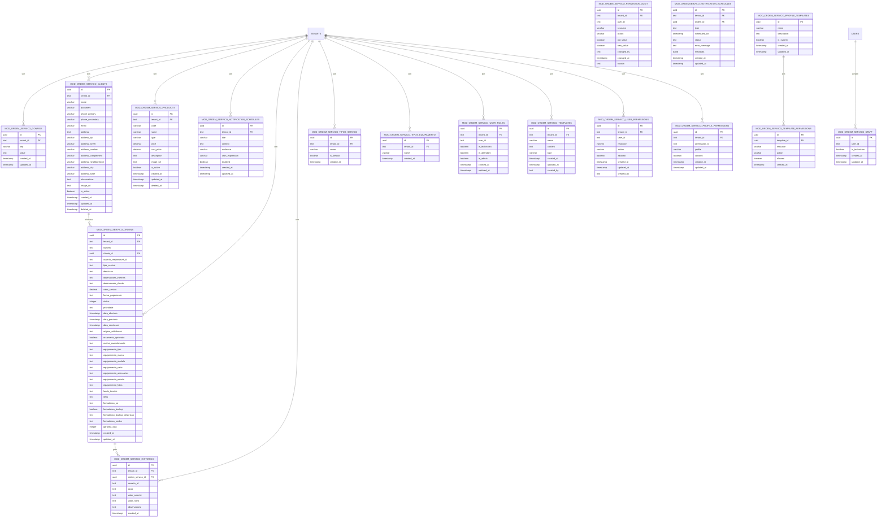
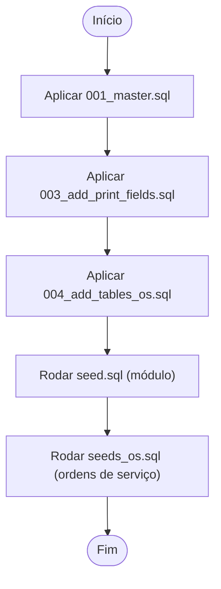
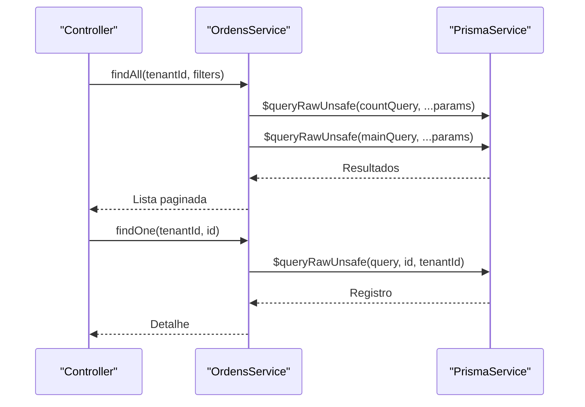
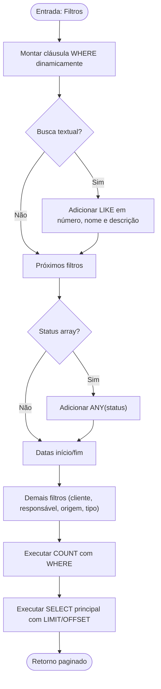
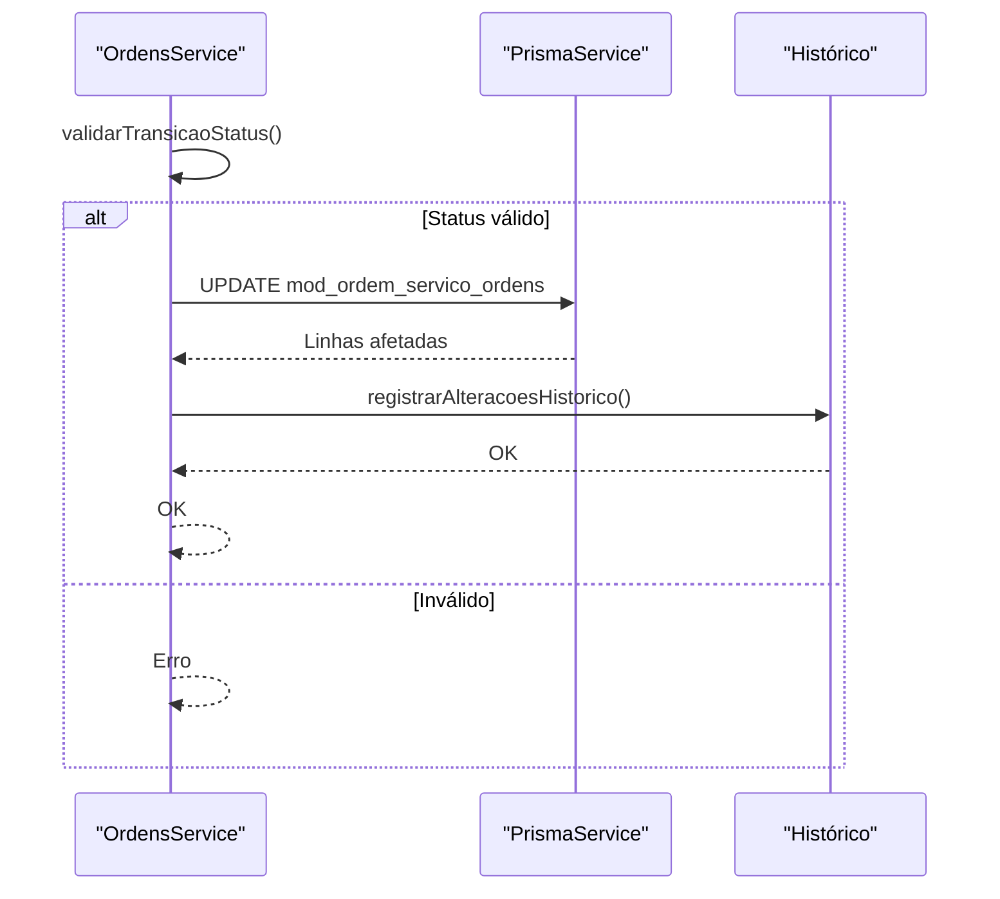

# Integração com Banco de Dados

<cite>
**Arquivos Referenciados neste Documento**
- [001_master.sql](file://backend/migrations/001_master.sql)
- [003_add_print_fields.sql](file://backend/migrations/003_add_print_fields.sql)
- [004_add_tables_os.sql](file://backend/migrations/004_add_tables_os.sql)
- [seed.sql](file://backend/seeds/seed.sql)
- [seeds_os.sql](file://backend/seeds/seeds_os.sql)
- [ordens.service.ts](file://backend/ordens/ordens.service.ts)
- [ordens.controller.ts](file://backend/ordens/ordens.controller.ts)
- [ordem-servico.dto.ts](file://backend/shared/dto/ordem-servico.dto.ts)
- [README.md](file://backend/README.md)
</cite>

## Sumário
1. [Introdução](#introdução)
2. [Estrutura do Banco de Dados](#estrutura-do-banco-de-dados)
3. [Migrações e Seeds](#migrações-e-seeds)
4. [ORM e Acesso aos Dados](#orm-e-acesso-aos-dados)
5. [Consultas Complexas, Joins e Índices](#consultas-complexas-joins-e-índices)
6. [Práticas de Manipulação de Dados e Transações](#práticas-de-manipulação-de-dados-e-transações)
7. [Tratamento de Erros](#tratamento-de-erros)
8. [Exemplos de Consultas Comuns](#exemplos-de-consultas-comuns)
9. [Otimização de Performance](#otimização-de-performance)
10. [Backup, Recuperação e Manutenção](#backup-recuperação-e-manutenção)
11. [Conclusão](#conclusão)

## Introdução
Este documento apresenta a integração com o banco de dados PostgreSQL no módulo de Ordens de Serviço. Ele descreve o esquema de banco de dados, tabelas principais e relacionamentos, o uso de migrações e seeds, o acesso aos dados via Prisma (com uso de consultas SQL bruto em cenários específicos), consultas complexas, joins, índices, práticas de manipulação de dados, transações, tratamento de erros, exemplos de consultas comuns e dicas de otimização de performance. Também aborda backup, recuperação e manutenção do banco de dados.

## Estrutura do Banco de Dados
O módulo define um conjunto de tabelas para gerenciar configurações, clientes, produtos/serviços, notificações, ordens de serviço, histórico, tipos de serviços/equipamentos e papéis de usuários. As principais entidades são:

- Configurações do módulo
- Clientes
- Produtos/Serviços
- Templates
- Tabelas de permissões (usuários, perfis, templates e auditoria)
- Ordens de Serviço
- Histórico de Ordens
- Tipos de Serviço e Equipamento
- Papéis de Usuários no módulo

**Diagrama fonte**
- [001_master.sql](file://backend/migrations/001_master.sql#L12-L249)
- [004_add_tables_os.sql](file://backend/migrations/004_add_tables_os.sql#L7-L32)

**Seção fonte**
- [001_master.sql](file://backend/migrations/001_master.sql#L1-L622)
- [004_add_tables_os.sql](file://backend/migrations/004_add_tables_os.sql#L1-L80)

## Migrações e Seeds
- Migrações: O projeto possui três migrações principais:
  - 001_master.sql: Criação completa do esquema do módulo, incluindo tabelas, índices e dados iniciais.
  - 003_add_print_fields.sql: Adiciona campos para impressão e configurações padrão.
  - 004_add_tables_os.sql: Adiciona tabelas ausentes em alguns ambientes e sincroniza campos e triggers.
- Seeds: Existem seeds para dados iniciais do módulo e para configurações específicas do módulo de ordens de serviço.

**Diagrama fonte**
- [001_master.sql](file://backend/migrations/001_master.sql#L1-L622)
- [003_add_print_fields.sql](file://backend/migrations/003_add_print_fields.sql#L1-L24)
- [004_add_tables_os.sql](file://backend/migrations/004_add_tables_os.sql#L1-L80)
- [seed.sql](file://backend/seeds/seed.sql#L1-L18)
- [seeds_os.sql](file://backend/seeds/seeds_os.sql#L1-L69)

**Seção fonte**
- [001_master.sql](file://backend/migrations/001_master.sql#L1-L622)
- [003_add_print_fields.sql](file://backend/migrations/003_add_print_fields.sql#L1-L24)
- [004_add_tables_os.sql](file://backend/migrations/004_add_tables_os.sql#L1-L80)
- [seed.sql](file://backend/seeds/seed.sql#L1-L18)
- [seeds_os.sql](file://backend/seeds/seeds_os.sql#L1-L69)

## ORM e Acesso aos Dados
- O módulo utiliza PrismaService para acesso ao banco de dados.
- Em alguns casos, consultas SQL bruto são utilizadas para maior controle (ex: geração de PDF, buscas avançadas com joins).
- O serviço de ordens implementa métodos para:
  - Listagem com paginação e filtros complexos
  - Busca individual com joins
  - Criação e atualização com validações e tratamento de JSON
  - Geração de PDF com dados combinados de ordens, tenants e configurações

**Diagrama fonte**
- [ordens.controller.ts](file://backend/ordens/ordens.controller.ts#L34-L55)
- [ordens.service.ts](file://backend/ordens/ordens.service.ts#L137-L473)
- [ordens.service.ts](file://backend/ordens/ordens.service.ts#L475-L555)

**Seção fonte**
- [ordens.controller.ts](file://backend/ordens/ordens.controller.ts#L1-L377)
- [ordens.service.ts](file://backend/ordens/ordens.service.ts#L1-L123)
- [ordens.service.ts](file://backend/ordens/ordens.service.ts#L137-L555)

## Consultas Complexas, Joins e Índices
- Consultas complexas:
  - Busca com múltiplos filtros (busca textual, status, cliente, responsável, datas, origem, tipo de serviço).
  - Joins com clientes e usuários para enriquecer os dados retornados.
  - Uso de parâmetros posicionais e sanitização manual para evitar injeção.
- Índices:
  - Índices criados para otimizar buscas em tenant_id, status, data_abertura, número, cliente_id, usuário responsável, etc.
  - Índices em campos de texto e enum para melhorar desempenho de consultas.

**Diagrama fonte**
- [ordens.service.ts](file://backend/ordens/ordens.service.ts#L211-L280)
- [ordens.service.ts](file://backend/ordens/ordens.service.ts#L281-L321)

**Seção fonte**
- [ordens.service.ts](file://backend/ordens/ordens.service.ts#L137-L321)
- [001_master.sql](file://backend/migrations/001_master.sql#L322-L396)

## Práticas de Manipulação de Dados e Transações
- Validação e sanitização de entradas:
  - Validação manual de UUIDs, datas, arrays e strings.
  - Limites de tamanho e caracteres especiais removidos.
- Persistência de dados:
  - Criação e atualização com tratamento de JSON (itens, fotos).
  - Validação de status e transições permitidas.
- Histórico:
  - Registros de histórico de alterações com valores antigos e novos.
- PDF:
  - Geração com Puppeteer usando dados combinados de ordens, tenants e configurações.

**Diagrama fonte**
- [ordens.service.ts](file://backend/ordens/ordens.service.ts#L656-L770)
- [ordens.service.ts](file://backend/ordens/ordens.service.ts#L126-L135)

**Seção fonte**
- [ordens.service.ts](file://backend/ordens/ordens.service.ts#L656-L770)
- [ordens.service.ts](file://backend/ordens/ordens.service.ts#L126-L135)

## Tratamento de Erros
- Logs detalhados em todos os métodos críticos.
- Validação rigorosa de entrada e tipos.
- Tratamento de erros em operações de leitura, escrita e geração de PDF.
- Exceções lançadas com mensagens informativas.

**Seção fonte**
- [ordens.service.ts](file://backend/ordens/ordens.service.ts#L16-L123)
- [ordens.service.ts](file://backend/ordens/ordens.service.ts#L468-L472)

## Exemplos de Consultas Comuns
- Listagem de ordens com paginação e filtros:
  - Busca textual em número, nome do cliente e descrição.
  - Filtragem por status, cliente, responsável, datas, origem e tipo de serviço.
- Detalhe de ordem com joins:
  - Informações da ordem, cliente e responsável.
- Criação de ordem:
  - Geração de número sequencial, definição de status inicial e persistência de dados JSON.
- Atualização de status:
  - Validação de transição permitida e campos obrigatórios para finalização/cancelamento.

**Seção fonte**
- [ordens.service.ts](file://backend/ordens/ordens.service.ts#L137-L473)
- [ordens.service.ts](file://backend/ordens/ordens.service.ts#L475-L555)
- [ordens.service.ts](file://backend/ordens/ordens.service.ts#L557-L654)
- [ordens.service.ts](file://backend/ordens/ordens.service.ts#L772-L800)

## Otimização de Performance
- Índices estratégicos:
  - Tenant, status, data de abertura, número, cliente_id, usuário responsável.
- Consultas paginadas:
  - COUNT separado e LIMIT/OFFSET no resultado principal.
- Sanitização e parâmetros posicionais:
  - Evita injeção e melhora cache de planos de consulta.
- Uso de JSONB:
  - Armazenamento de arrays e objetos em campos JSONB para flexibilidade.

**Seção fonte**
- [001_master.sql](file://backend/migrations/001_master.sql#L322-L396)
- [ordens.service.ts](file://backend/ordens/ordens.service.ts#L137-L321)

## Backup, Recuperação e Manutenção
- Backup:
  - Utilize ferramentas de backup do PostgreSQL (ex: pg_dump) para exportar o schema e dados do módulo.
- Recuperação:
  - Restaure backups usando pg_restore ou psql para reverter mudanças indesejadas.
- Manutenção:
  - Monitore índices e desempenho com análise de consultas lentas.
  - Mantenha migrações e seeds organizadas e versionadas.
  - Revise triggers e funções de atualização automática de timestamps.

[Sem fontes, pois esta seção fornece orientações gerais]

## Conclusão
O módulo de Ordens de Serviço implementa um esquema robusto de banco de dados com migrações e seeds bem definidos. O acesso aos dados utiliza Prisma com consultas SQL bruto quando necessário, proporcionando controle sobre operações complexas como paginação, joins e geração de PDF. A estratégia de índices e validações contribui para desempenho e integridade. Recomenda-se seguir práticas de backup, recuperação e manutenção para garantir a estabilidade do ambiente.