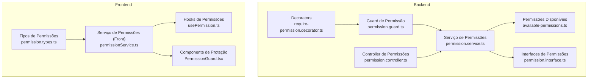
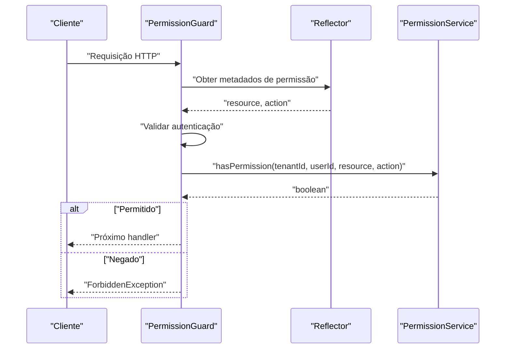
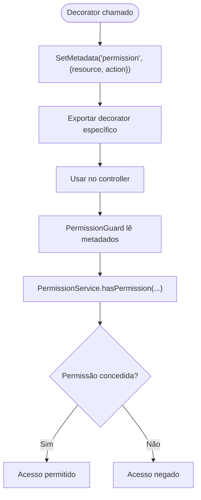
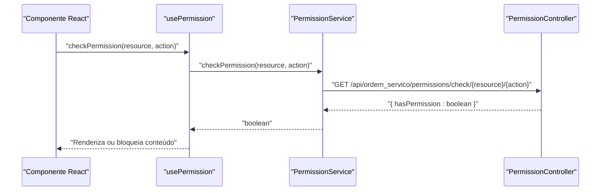
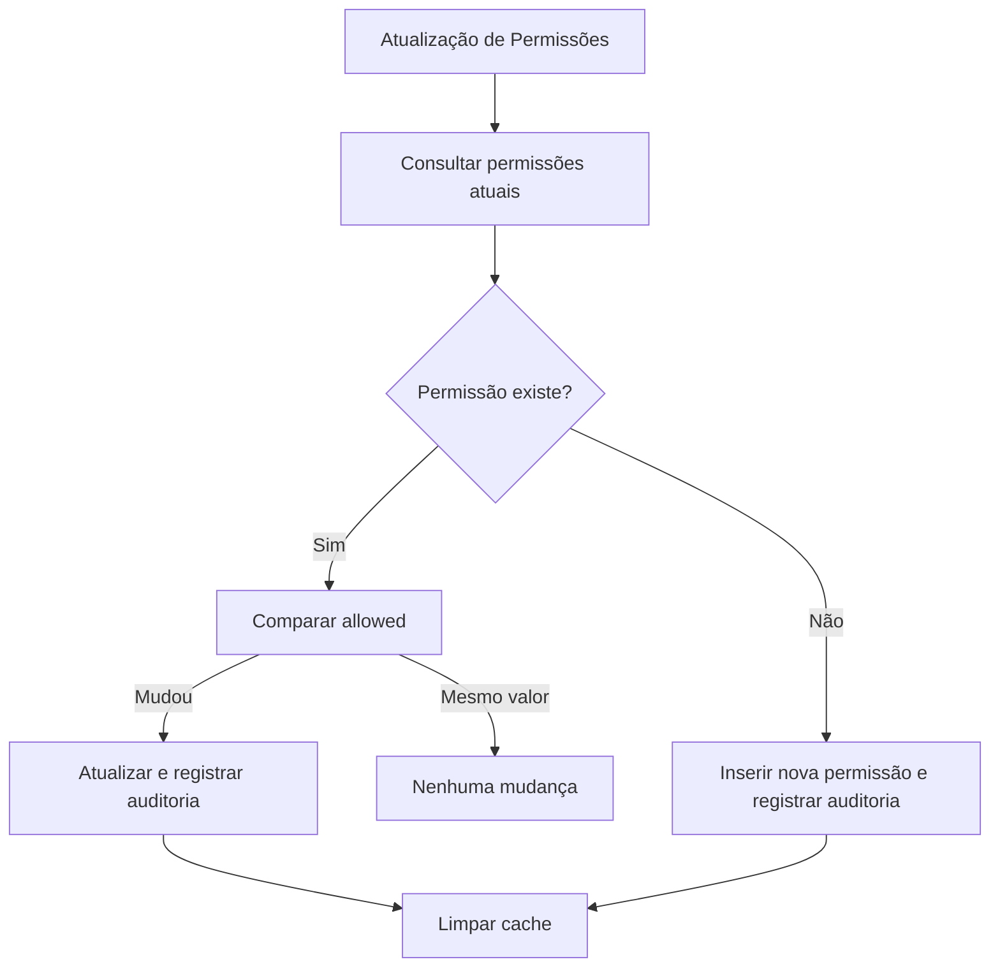

# Segurança e Permissões

<cite>
**Arquivos referenciados neste documento**
- [require-permission.decorator.ts](file://backend/shared/decorators/require-permission.decorator.ts)
- [permission.guard.ts](file://backend/shared/guards/permission.guard.ts)
- [available-permissions.ts](file://backend/shared/constants/available-permissions.ts)
- [permission.interface.ts](file://backend/shared/interfaces/permission.interface.ts)
- [permission.controller.ts](file://backend/shared/controllers/permission.controller.ts)
- [permission.service.ts](file://backend/shared/services/permission.service.ts)
- [permission.types.ts](file://frontend/types/permission.types.ts)
- [permissionService.ts](file://frontend/services/permissionService.ts)
- [usePermission.ts](file://frontend/hooks/usePermission.ts)
- [PermissionGuard.tsx](file://frontend/components/PermissionGuard.tsx)
- [permissions_seed.sql](file://backend/seeds/permissions_seed.sql)
- [004_add_tables_os.sql](file://backend/migrations/004_add_tables_os.sql)
</cite>

## Sumário
- Apresentação geral do sistema de segurança e permissões do módulo de Ordens de Serviço
- Arquitetura RBAC implementada (Recursos, Ações e Níveis de Acesso)
- Guards de permissão no backend e frontend
- Decorators e verificação de permissões em tempo de execução
- Autenticação JWT, validação de tokens e controle de acesso baseado em funções
- Práticas de segurança, proteção contra ataques e melhores práticas de implementação
- Exemplos de configuração de permissões e implementação de novos recursos de segurança

## Introdução
Este documento apresenta a implementação técnica do sistema de segurança e permissões do módulo de Ordens de Serviço. O sistema adota um modelo RBAC (Controle de Acesso Baseado em Funções) com recursos granulares e ações específicas, integrado com um guard de permissão no backend e componentes de proteção no frontend. Além disso, descreve como os decorators permitem declarar permissões em endpoints, como o serviço de permissões realiza verificações em tempo de execução, e como o sistema registra auditorias de acesso.

## Estrutura do Projeto
O sistema de segurança é composto por camadas bem definidas:
- Backend: decorators, guards, controller e service de permissões, além de interfaces e constantes de permissões
- Frontend: hooks e componentes para verificação de permissões em tempo de execução
- Infraestrutura de dados: migrações e seeds que criam e populam as tabelas de permissões

**Diagrama fonte**
- [require-permission.decorator.ts](file://backend/shared/decorators/require-permission.decorator.ts#L1-L25)
- [permission.guard.ts](file://backend/shared/guards/permission.guard.ts#L1-L58)
- [permission.controller.ts](file://backend/shared/controllers/permission.controller.ts#L1-L83)
- [permission.service.ts](file://backend/shared/services/permission.service.ts#L1-L313)
- [available-permissions.ts](file://backend/shared/constants/available-permissions.ts#L1-L164)
- [permission.interface.ts](file://backend/shared/interfaces/permission.interface.ts#L1-L63)
- [permission.types.ts](file://frontend/types/permission.types.ts#L1-L55)
- [permissionService.ts](file://frontend/services/permissionService.ts#L1-L135)
- [usePermission.ts](file://frontend/hooks/usePermission.ts#L1-L142)
- [PermissionGuard.tsx](file://frontend/components/PermissionGuard.tsx#L1-L50)

**Seção fonte**
- [require-permission.decorator.ts](file://backend/shared/decorators/require-permission.decorator.ts#L1-L25)
- [permission.guard.ts](file://backend/shared/guards/permission.guard.ts#L1-L58)
- [permission.controller.ts](file://backend/shared/controllers/permission.controller.ts#L1-L83)
- [permission.service.ts](file://backend/shared/services/permission.service.ts#L1-L313)
- [available-permissions.ts](file://backend/shared/constants/available-permissions.ts#L1-L164)
- [permission.types.ts](file://frontend/types/permission.types.ts#L1-L55)
- [permissionService.ts](file://frontend/services/permissionService.ts#L1-L135)
- [usePermission.ts](file://frontend/hooks/usePermission.ts#L1-L142)
- [PermissionGuard.tsx](file://frontend/components/PermissionGuard.tsx#L1-L50)

## Recursos, Ações e Níveis de Acesso (RBAC)
O sistema define permissões granulares organizadas por recursos e ações. Cada recurso possui um conjunto de ações associadas, com nomes e descrições claras. Os níveis de acesso são determinados pela presença ou ausência de permissões específicas.

Recursos e ações disponíveis:
- Dashboard
  - Visualizar Dashboard
  - Ver Estatísticas
- Clientes
  - Listar Clientes
  - Ver Detalhes
  - Criar Cliente
  - Editar Cliente
  - Excluir Cliente
  - Upload de Imagens
- Produtos/Serviços
  - Listar Produtos
  - Criar Produto
  - Editar Produto
  - Excluir Produto
  - Upload de Imagens
- Ordens de Serviço
  - Listar Ordens
  - Ver Detalhes
  - Criar Ordem
  - Editar Ordem
  - Excluir Ordem
  - Alterar Status
  - Aprovar Orçamento
  - Ver Histórico
- Configurações
  - Ver Configurações
  - Editar Configurações
  - Gerenciar Permissões
  - Gerenciar Notificações

Níveis de acesso:
- Usuários com papéis ADMIN ou SUPER_ADMIN têm acesso automático a todos os recursos e ações (bypass automático).
- Demais usuários são restritos às permissões explicitamente concedidas.

**Seção fonte**
- [available-permissions.ts](file://backend/shared/constants/available-permissions.ts#L1-L164)
- [permission.interface.ts](file://backend/shared/interfaces/permission.interface.ts#L1-L63)
- [permission.service.ts](file://backend/shared/services/permission.service.ts#L131-L162)

## Guards de Permissão (Backend e Frontend)
O sistema utiliza dois mecanismos complementares de proteção:

- Backend: Guard de permissão (CanActivate) que intercepta requisições, lê os decorators aplicados e consulta o serviço de permissões.
- Frontend: Componente e hooks que verificam permissões antes de renderizar conteúdo ou habilitar funcionalidades.

### Guard de Permissão (Backend)
O guard:
- Lê os metadados de permissão definidos nos decorators
- Verifica se o usuário está autenticado
- Consulta o serviço de permissões para validar o acesso
- Retorna erro de acesso negado quando necessário

**Diagrama fonte**
- [permission.guard.ts](file://backend/shared/guards/permission.guard.ts#L12-L57)
- [permission.service.ts](file://backend/shared/services/permission.service.ts#L131-L162)

**Seção fonte**
- [permission.guard.ts](file://backend/shared/guards/permission.guard.ts#L1-L58)

### Decorators de Permissão (Backend)
Os decorators permitem declarar permissões diretamente nos endpoints:
- RequirePermission: aceita qualquer recurso e ação
- RequireDashboardPermission, RequireOrdersPermission, RequireClientsPermission, RequireProductsPermission, RequireConfigPermission: wrappers específicos

**Diagrama fonte**
- [require-permission.decorator.ts](file://backend/shared/decorators/require-permission.decorator.ts#L8-L25)
- [permission.guard.ts](file://backend/shared/guards/permission.guard.ts#L12-L47)

**Seção fonte**
- [require-permission.decorator.ts](file://backend/shared/decorators/require-permission.decorator.ts#L1-L25)

### Verificação de Permissões em Tempo de Execução (Frontend)
O frontend oferece três camadas de verificação:
- Componente PermissionGuard: protege rotas e elementos
- Hook usePermission: permite verificar permissões em componentes
- Hook useMultiplePermissions: permite verificar múltiplas permissões de uma vez

**Diagrama fonte**
- [usePermission.ts](file://frontend/hooks/usePermission.ts#L17-L35)
- [permissionService.ts](file://frontend/services/permissionService.ts#L107-L115)
- [permission.controller.ts](file://backend/shared/controllers/permission.controller.ts#L1-L83)

**Seção fonte**
- [PermissionGuard.tsx](file://frontend/components/PermissionGuard.tsx#L1-L50)
- [usePermission.ts](file://frontend/hooks/usePermission.ts#L1-L142)
- [permissionService.ts](file://frontend/services/permissionService.ts#L1-L135)

## Autenticação JWT, Validação de Tokens e Controle Baseado em Funções
O backend utiliza um guard de autenticação JWT para garantir que apenas usuários válidos possam acessar os endpoints de permissões. O guard de permissão depende do usuário autenticado para obter tenantId e userId.

Funcionamento:
- Todos os endpoints do controller de permissões usam o guard JwtAuthGuard
- O guard de permissão verifica se o usuário possui as permissões necessárias
- Os usuários com papéis ADMIN ou SUPER_ADMIN têm acesso automático

Observações importantes:
- O guard de permissão também implementa um bypass automático para ADMIN e SUPER_ADMIN
- O serviço de permissões registra tentativas de acesso negado em auditoria

**Seção fonte**
- [permission.controller.ts](file://backend/shared/controllers/permission.controller.ts#L1-L83)
- [permission.guard.ts](file://backend/shared/guards/permission.guard.ts#L27-L30)
- [permission.service.ts](file://backend/shared/services/permission.service.ts#L131-L162)

## Sistema de Auditoria de Permissões
O sistema mantém um histórico de mudanças nas permissões e tentativas de acesso negado:
- Registros de alterações de permissões com valores antigos e novos
- Registro de tentativas de acesso negado
- Consultas de auditoria com filtros por usuário e período

**Diagrama fonte**
- [permission.service.ts](file://backend/shared/services/permission.service.ts#L70-L129)
- [permission.service.ts](file://backend/shared/services/permission.service.ts#L221-L259)

**Seção fonte**
- [permission.service.ts](file://backend/shared/services/permission.service.ts#L261-L313)

## Práticas de Segurança e Melhores Práticas
- Bypass automático somente para ADMIN e SUPER_ADMIN
- Cache de permissões com TTL para melhor performance
- Auditoria de todas as mudanças e tentativas de acesso negado
- Uso obrigatório de decorators para declarar permissões nos endpoints
- Validação rigorosa de autenticação antes de verificar permissões
- Separação clara entre backend e frontend: backend faz as verificações críticas, frontend apenas melhora UX

## Exemplos de Configuração de Permissões e Implementação de Novos Recursos

### 1. Aplicar permissão em um endpoint (Backend)
- Importar o decorator necessário
- Aplicar o decorator no método do controller
- Garantir que o guard de permissão esteja ativado no controller

Fontes:
- [require-permission.decorator.ts](file://backend/shared/decorators/require-permission.decorator.ts#L8-L25)
- [permission.controller.ts](file://backend/shared/controllers/permission.controller.ts#L1-L83)

### 2. Verificar permissão em um componente (Frontend)
- Utilizar PermissionGuard para proteger rotas
- Usar usePermission para verificar permissões condicionais
- Utilizar PermissionDenied para exibir mensagem padrão

Fontes:
- [PermissionGuard.tsx](file://frontend/components/PermissionGuard.tsx#L1-L50)
- [usePermission.ts](file://frontend/hooks/usePermission.ts#L1-L142)

### 3. Adicionar um novo recurso com ações
- Atualizar a constante de permissões disponíveis
- Popular as permissões no banco de dados via seed
- Aplicar decorators nos endpoints correspondentes

Fontes:
- [available-permissions.ts](file://backend/shared/constants/available-permissions.ts#L1-L164)
- [permissions_seed.sql](file://backend/seeds/permissions_seed.sql#L1-L329)

### 4. Configurar permissões para perfis (seeds)
- Criar templates de perfil
- Atribuir permissões padrão para cada perfil
- Garantir que SUPER_ADMIN tenha acesso total

Fontes:
- [permissions_seed.sql](file://backend/seeds/permissions_seed.sql#L12-L329)

### 5. Estrutura de dados e migrações
- Tabelas de permissões do usuário e auditoria
- Migrações para sincronizar estruturas

Fontes:
- [004_add_tables_os.sql](file://backend/migrations/004_add_tables_os.sql#L1-L80)

## Conclusão
O módulo de Ordens de Serviço implementa um sistema de segurança robusto com RBAC completo, integração entre backend e frontend, e mecanismos de auditoria. A utilização de decorators simplifica a declaração de permissões, enquanto o guard de permissão garante a segurança no backend. As práticas recomendadas ajudam a manter o sistema seguro e escalável.