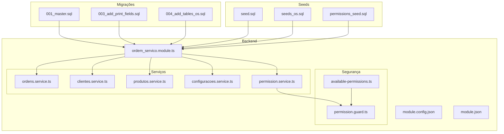
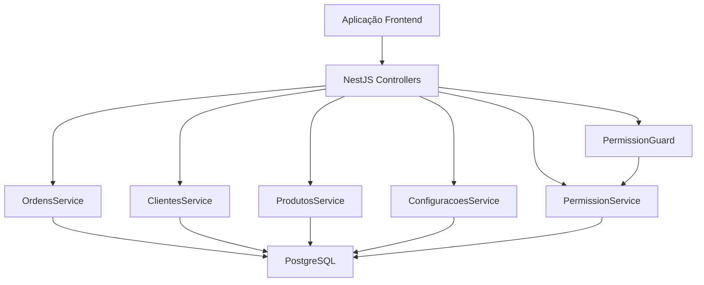
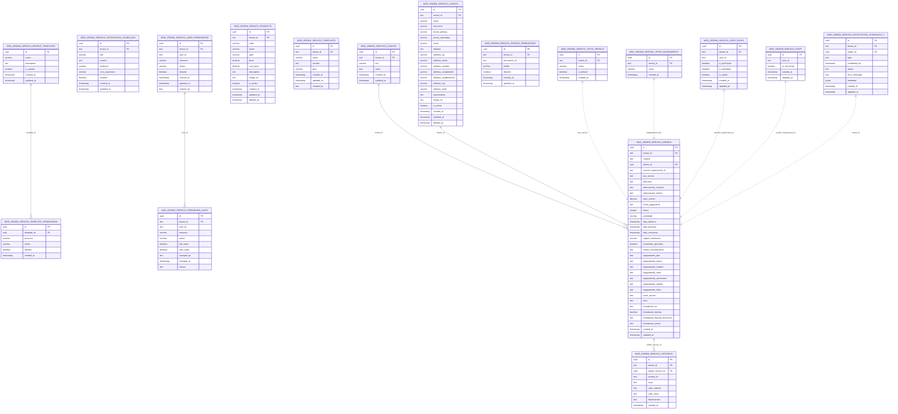
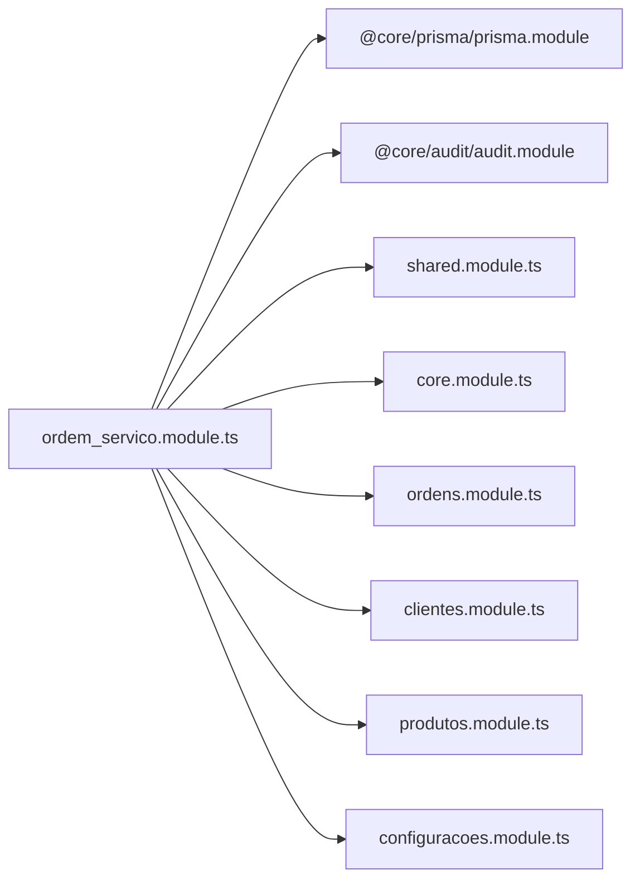
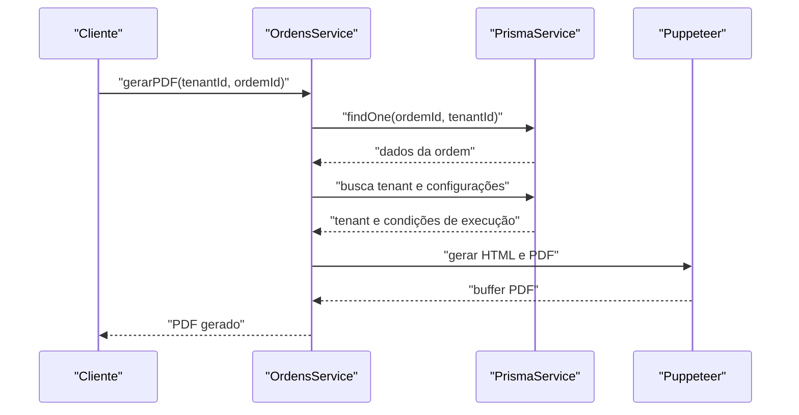
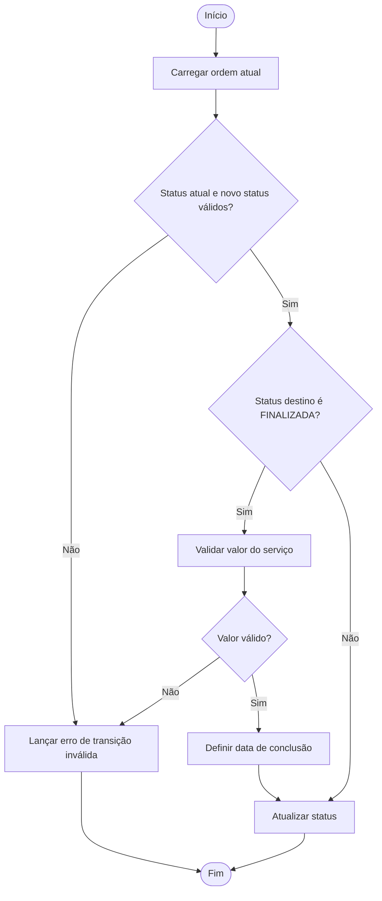

# Banco de Dados e Migrações

<cite>
**Arquivos Referenciados Neste Documento**
- [001_master.sql](file://backend/migrations/001_master.sql)
- [003_add_print_fields.sql](file://backend/migrations/003_add_print_fields.sql)
- [004_add_tables_os.sql](file://backend/migrations/004_add_tables_os.sql)
- [seed.sql](file://backend/seeds/seed.sql)
- [seeds_os.sql](file://backend/seeds/seeds_os.sql)
- [permissions_seed.sql](file://backend/seeds/permissions_seed.sql)
- [ordem_servico.module.ts](file://backend/ordem_servico.module.ts)
- [module.config.json](file://backend/module.config.json)
- [module.json](file://backend/module.json)
- [ordens.service.ts](file://backend/ordens/ordens.service.ts)
- [clientes.service.ts](file://backend/clientes/clientes.service.ts)
- [produtos.service.ts](file://backend/produtos/produtos.service.ts)
- [configuracoes.service.ts](file://backend/configuracoes/configuracoes.service.ts)
- [permission.service.ts](file://backend/shared/services/permission.service.ts)
- [permission.guard.ts](file://backend/shared/guards/permission.guard.ts)
- [available-permissions.ts](file://backend/shared/constants/available-permissions.ts)
</cite>

## Sumário
- Introdução
- Estrutura do Projeto
- Componentes Principais
- Visão Geral da Arquitetura
- Análise Detalhada de Componentes
- Análise de Dependências
- Considerações de Desempenho
- Guia de Solução de Problemas
- Conclusão
- Apêndices

## Introdução
Este documento apresenta o modelo de dados e o sistema de migrações do módulo de Ordens de Serviço. Ele descreve entidades, relacionamentos, tipos de dados, chaves primárias/estrangeiras, índices, restrições, regras de validação e regras de negócio. Também inclui padrões de acesso a dados, estratégias de cache, considerações de desempenho, ciclo de vida dos dados, políticas de retenção, regras de arquivamento, caminhos de migração e gerenciamento de versões, além de segurança de dados, requisitos de privacidade e controle de acesso.

## Estrutura do Projeto
O módulo é composto por:
- Migrações SQL que criam e atualizam o esquema do banco de dados
- Seeds iniciais que populam dados essenciais
- Serviços NestJS que encapsulam acesso a dados e regras de negócio
- Guardas e serviços de permissão para controle de acesso
- Módulos que agrupam funcionalidades

**Diagrama Fonte**
- [001_master.sql](file://backend/migrations/001_master.sql#L1-L622)
- [003_add_print_fields.sql](file://backend/migrations/003_add_print_fields.sql#L1-L24)
- [004_add_tables_os.sql](file://backend/migrations/004_add_tables_os.sql#L1-L80)
- [seed.sql](file://backend/seeds/seed.sql#L1-L18)
- [seeds_os.sql](file://backend/seeds/seeds_os.sql#L1-L69)
- [permissions_seed.sql](file://backend/seeds/permissions_seed.sql#L1-L329)
- [ordem_servico.module.ts](file://backend/ordem_servico.module.ts#L1-L35)
- [module.config.json](file://backend/module.config.json#L1-L79)
- [module.json](file://backend/module.json#L1-L48)
- [ordens.service.ts](file://backend/ordens/ordens.service.ts#L1-L1148)
- [clientes.service.ts](file://backend/clientes/clientes.service.ts#L1-L253)
- [produtos.service.ts](file://backend/produtos/produtos.service.ts#L1-L169)
- [configuracoes.service.ts](file://backend/configuracoes/configuracoes.service.ts#L1-L331)
- [permission.service.ts](file://backend/shared/services/permission.service.ts#L1-L313)
- [permission.guard.ts](file://backend/shared/guards/permission.guard.ts#L1-L58)
- [available-permissions.ts](file://backend/shared/constants/available-permissions.ts#L1-L164)

**Seção Fonte**
- [ordem_servico.module.ts](file://backend/ordem_servico.module.ts#L1-L35)
- [module.config.json](file://backend/module.config.json#L1-L79)
- [module.json](file://backend/module.json#L1-L48)

## Componentes Principais
- Migrações: scripts SQL que criam tabelas, índices, triggers e dados iniciais
- Seeds: dados iniciais para configurações, permissões e dados de exemplo
- Serviços: acesso a dados e regras de negócio implementadas com Prisma
- Segurança: permissões granulares, auditoria e guardas de rota

**Seção Fonte**
- [001_master.sql](file://backend/migrations/001_master.sql#L1-L622)
- [003_add_print_fields.sql](file://backend/migrations/003_add_print_fields.sql#L1-L24)
- [004_add_tables_os.sql](file://backend/migrations/004_add_tables_os.sql#L1-L80)
- [seed.sql](file://backend/seeds/seed.sql#L1-L18)
- [seeds_os.sql](file://backend/seeds/seeds_os.sql#L1-L69)
- [permissions_seed.sql](file://backend/seeds/permissions_seed.sql#L1-L329)
- [ordens.service.ts](file://backend/ordens/ordens.service.ts#L1-L1148)
- [clientes.service.ts](file://backend/clientes/clientes.service.ts#L1-L253)
- [produtos.service.ts](file://backend/produtos/produtos.service.ts#L1-L169)
- [configuracoes.service.ts](file://backend/configuracoes/configuracoes.service.ts#L1-L331)
- [permission.service.ts](file://backend/shared/services/permission.service.ts#L1-L313)
- [permission.guard.ts](file://backend/shared/guards/permission.guard.ts#L1-L58)
- [available-permissions.ts](file://backend/shared/constants/available-permissions.ts#L1-L164)

## Visão Geral da Arquitetura
O módulo utiliza:
- PostgreSQL com extensão UUID e JSON/JSONB
- Migrações controladas por scripts SQL
- Seeds para dados iniciais
- Prisma para acesso a dados nos serviços
- Guardas de permissão baseadas em recursos e ações
- Cache de permissões com TTL

**Diagrama Fonte**
- [ordem_servico.module.ts](file://backend/ordem_servico.module.ts#L1-L35)
- [ordens.service.ts](file://backend/ordens/ordens.service.ts#L1-L1148)
- [clientes.service.ts](file://backend/clientes/clientes.service.ts#L1-L253)
- [produtos.service.ts](file://backend/produtos/produtos.service.ts#L1-L169)
- [configuracoes.service.ts](file://backend/configuracoes/configuracoes.service.ts#L1-L331)
- [permission.service.ts](file://backend/shared/services/permission.service.ts#L1-L313)
- [permission.guard.ts](file://backend/shared/guards/permission.guard.ts#L1-L58)

## Análise Detalhada de Componentes

### Modelo de Dados e Relacionamentos
As principais entidades são:
- Configurações do módulo
- Agendamento de notificações
- Clientes
- Produtos/Serviços
- Templates
- Permissões de usuário e perfis
- Ordens de Serviço e histórico
- Tipos de serviço e equipamento
- Papéis de usuário
- Tabelas auxiliares e sincronização

**Diagrama Fonte**
- [001_master.sql](file://backend/migrations/001_master.sql#L12-L320)
- [004_add_tables_os.sql](file://backend/migrations/004_add_tables_os.sql#L7-L32)

**Seção Fonte**
- [001_master.sql](file://backend/migrations/001_master.sql#L12-L320)
- [004_add_tables_os.sql](file://backend/migrations/004_add_tables_os.sql#L7-L32)

### Chaves Primárias, Estrangeiras, Índices e Restrições
- Chaves primárias: UUIDs para todas as tabelas principais
- Chaves estrangeiras: ligam entidades ao tenant e a outras entidades quando aplicável
- Índices: criados para otimizar buscas em tenant_id, campos de busca e relacionamentos
- Restrições: CHECK para status e origem de solicitação, UNIQUE para códigos de produtos e numeração de ordens

**Seção Fonte**
- [001_master.sql](file://backend/migrations/001_master.sql#L20-L249)
- [001_master.sql](file://backend/migrations/001_master.sql#L325-L396)
- [003_add_print_fields.sql](file://backend/migrations/003_add_print_fields.sql#L6-L9)
- [004_add_tables_os.sql](file://backend/migrations/004_add_tables_os.sql#L36-L42)

### Regras de Validação de Dados e Regras de Negócio
- Validação manual em serviços (ex: ordens) com sanitização de entradas e limites de paginação
- Transições de status controladas e regras específicas para finalização
- Unicidade de códigos de produtos e numeração de ordens
- Campos JSON armazenados como JSON/JSONB com tratamento seguro
- Validação de UUIDs e datas
- Regras de negócio para garantia e condições de execução

**Seção Fonte**
- [ordens.service.ts](file://backend/ordens/ordens.service.ts#L125-L135)
- [ordens.service.ts](file://backend/ordens/ordens.service.ts#L145-L209)
- [ordens.service.ts](file://backend/ordens/ordens.service.ts#L680-L700)
- [produtos.service.ts](file://backend/produtos/produtos.service.ts#L64-L68)
- [003_add_print_fields.sql](file://backend/migrations/003_add_print_fields.sql#L9-L23)

### Padrões de Acesso a Dados, Estratégias de Cache e Desempenho
- Acesso a dados via Prisma com consultas SQL brutas para performance e flexibilidade
- Cache de permissões com TTL de 5 minutos
- Índices estratégicos para buscas e relacionamentos
- Paginação com limites máximos e proteção contra buscas muito curtas

**Seção Fonte**
- [permission.service.ts](file://backend/shared/services/permission.service.ts#L16-L17)
- [permission.service.ts](file://backend/shared/services/permission.service.ts#L21-L68)
- [ordens.service.ts](file://backend/ordens/ordens.service.ts#L163-L166)
- [ordens.service.ts](file://backend/ordens/ordens.service.ts#L220-L234)

### Ciclo de Vida dos Dados, Políticas de Retenção e Arquivamento
- Soft delete com deleted_at em clientes e produtos
- Histórico de ordens registrado em tabela separada
- Configurações de módulo armazenadas em tabela de configurações
- Seeds populam dados iniciais e padrões

**Seção Fonte**
- [001_master.sql](file://backend/migrations/001_master.sql#L67-L93)
- [001_master.sql](file://backend/migrations/001_master.sql#L252-L268)
- [001_master.sql](file://backend/migrations/001_master.sql#L433-L476)
- [001_master.sql](file://backend/migrations/001_master.sql#L560-L602)
- [seed.sql](file://backend/seeds/seed.sql#L3-L17)
- [seeds_os.sql](file://backend/seeds/seeds_os.sql#L7-L26)

### Migrações e Gerenciamento de Versões
- Migrações sequenciais: master, adição de campos de impressão, sincronização de tabelas
- Seeds de permissões e dados iniciais
- Tabelas de staff e notificações sincronizadas entre ambientes

**Seção Fonte**
- [001_master.sql](file://backend/migrations/001_master.sql#L1-L622)
- [003_add_print_fields.sql](file://backend/migrations/003_add_print_fields.sql#L1-L24)
- [004_add_tables_os.sql](file://backend/migrations/004_add_tables_os.sql#L1-L80)
- [permissions_seed.sql](file://backend/seeds/permissions_seed.sql#L1-L329)

### Segurança de Dados, Privacidade e Controle de Acesso
- Permissões granulares por recurso e ação
- Guarda de permissão em rotas
- Auditoria de mudanças de permissões
- BYPASS automático para ADMIN/SUPER_ADMIN
- Máscara de chaves de API em configurações

**Seção Fonte**
- [available-permissions.ts](file://backend/shared/constants/available-permissions.ts#L1-L164)
- [permission.service.ts](file://backend/shared/services/permission.service.ts#L131-L162)
- [permission.service.ts](file://backend/shared/services/permission.service.ts#L221-L241)
- [permission.guard.ts](file://backend/shared/guards/permission.guard.ts#L1-L58)
- [configuracoes.service.ts](file://backend/configuracoes/configuracoes.service.ts#L194-L196)

## Análise de Dependências
O módulo depende do Prisma e de módulos do núcleo. Os serviços utilizam Prisma para acesso a dados e implementam regras de negócio. As guardas de permissão dependem do serviço de permissões.

**Diagrama Fonte**
- [ordem_servico.module.ts](file://backend/ordem_servico.module.ts#L1-L35)

**Seção Fonte**
- [ordem_servico.module.ts](file://backend/ordem_servico.module.ts#L1-L35)

## Considerações de Desempenho
- Uso de índices para tenant_id, campos de busca e relacionamentos
- Paginação com limites máximos
- Cache de permissões com TTL
- Queries otimizadas com parâmetros posicionais
- Evitar buscas muito curtas para performance

[Sem fonte específica, pois esta seção fornece orientações gerais]

## Guia de Solução de Problemas
- Erros de serialização em dados de ordens: verificação e tratamento de JSON
- Buscas muito curtas bloqueadas: aumentar o tamanho mínimo de busca
- Erros de tabela não encontrada ao excluir cliente: verificação condicional para tabelas ausentes
- Erros de permissão: auditoria de tentativas negadas e BYPASS para admins

**Seção Fonte**
- [ordens.service.ts](file://backend/ordens/ordens.service.ts#L422-L437)
- [ordens.service.ts](file://backend/ordens/ordens.service.ts#L221-L223)
- [clientes.service.ts](file://backend/clientes/clientes.service.ts#L225-L236)
- [permission.service.ts](file://backend/shared/services/permission.service.ts#L243-L259)

## Conclusão
O módulo de Ordens de Serviço possui um modelo de dados bem estruturado com entidades claras, relacionamentos consistentes, regras de validação e regras de negócio implementadas nos serviços. As migrações e seeds garantem a consistência e disponibilidade de dados iniciais. O sistema de permissões granular, cache e índices contribuem para desempenho e segurança. Recomenda-se manter os scripts de migração e seeds atualizados e seguir as práticas de validação e auditoria já implementadas.

[Sem fonte específica, pois esta seção resume sem análise de arquivos específicos]

## Apêndices

### Exemplos de Dados Iniciais
- Configurações iniciais de módulo e versão
- Seeds de condições de execução e termos
- Permissões padrão para perfis admin, técnico e atendente

**Seção Fonte**
- [seed.sql](file://backend/seeds/seed.sql#L3-L17)
- [seeds_os.sql](file://backend/seeds/seeds_os.sql#L7-L26)
- [permissions_seed.sql](file://backend/seeds/permissions_seed.sql#L12-L16)

### Sequência de Fluxo: Geração de PDF de Ordem de Serviço

**Diagrama Fonte**
- [ordens.service.ts](file://backend/ordens/ordens.service.ts#L16-L123)

### Fluxo de Validação de Status de Ordem de Serviço

**Diagrama Fonte**
- [ordens.service.ts](file://backend/ordens/ordens.service.ts#L680-L700)
- [ordens.service.ts](file://backend/ordens/ordens.service.ts#L687-L696)