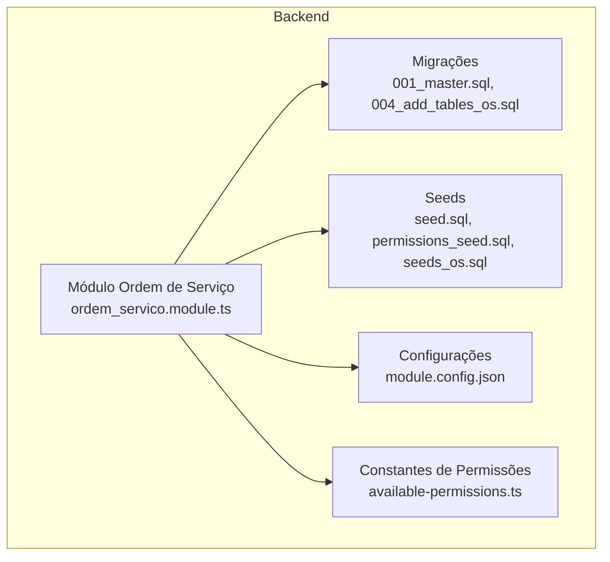
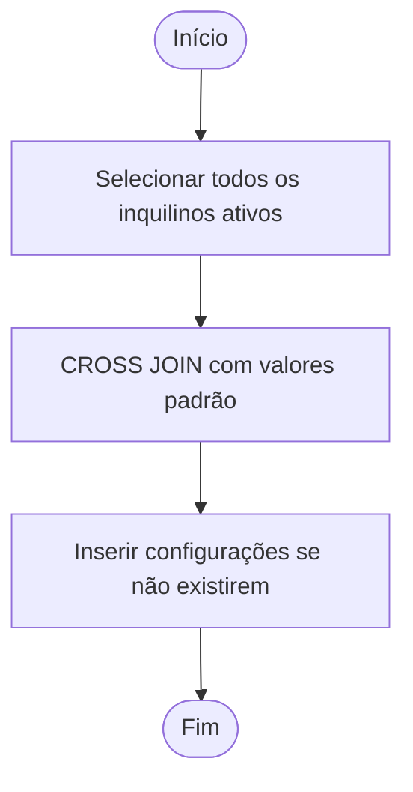
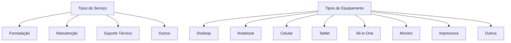
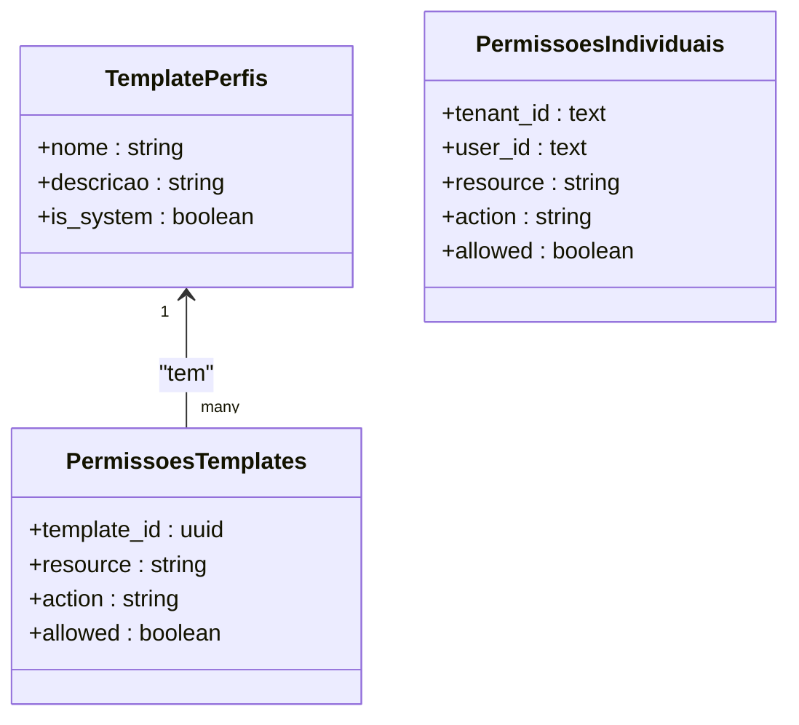
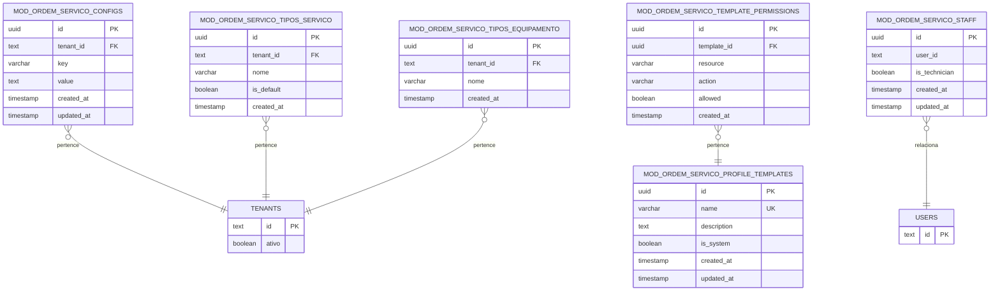

# Dados Iniciais e Seeds

<cite>
**Arquivos Referenciados Neste Documento**
- [seed.sql](file://backend/seeds/seed.sql)
- [permissions_seed.sql](file://backend/seeds/permissions_seed.sql)
- [seeds_os.sql](file://backend/seeds/seeds_os.sql)
- [001_master.sql](file://backend/migrations/001_master.sql)
- [004_add_tables_os.sql](file://backend/migrations/004_add_tables_os.sql)
- [available-permissions.ts](file://backend/shared/constants/available-permissions.ts)
- [module.config.json](file://backend/module.config.json)
- [README.md](file://backend/README.md)
- [ordem_servico.module.ts](file://backend/ordem_servico.module.ts)
- [configuracoes.service.ts](file://backend/configuracoes/configuracoes.service.ts)
- [clientes.service.ts](file://backend/clientes/clientes.service.ts)
- [produtos.service.ts](file://backend/produtos/produtos.service.ts)
- [ordem-servico-cron.service.ts](file://backend/core/ordem-servico-cron.service.ts)
</cite>

## Sumário
1. [Introdução](#introdução)
2. [Estrutura do Módulo e Seeds](#estrutura-do-módulo-e-seeds)
3. [Tipos de Seeds e Seus Propósitos](#tipos-de-seeds-e-seus-propósitos)
4. [Configurações Padrão](#configurações-padrão)
5. [Tipos de Serviços e Equipamentos](#tipos-de-serviços-e-equipamentos)
6. [Permissões de Usuário](#permissões-de-usuário)
7. [Consistência Inicial do Sistema](#consistência-inicial-do-sistema)
8. [Personalização para Ambientes Específicos](#personalização-para-ambientes-específicos)
9. [Adicionando Novos Dados Iniciais](#adicionando-novos-dados-iniciais)
10. [Ambientes: Desenvolvimento, Teste e Produção](#ambientes-desenvolvimento-teste-e-produção)
11. [Arquitetura de Seeds e Mapeamento de Tabelas](#arquitetura-de-seeds-e-mapeamento-de-tabelas)
12. [Considerações de Desempenho](#considerações-de-desempenho)
13. [Guia de Solução de Problemas](#guia-de-solução-de-problemas)
14. [Conclusão](#conclusão)

## Introdução
Este documento apresenta uma visão abrangente dos dados iniciais (seeds) do módulo de Ordens de Serviço. Ele explica como são estruturados os dados de seed, quais informações são inseridas automaticamente, para que servem cada conjunto de dados, e como esses seeds garantem a consistência inicial do sistema. Também mostra como personalizá-los para ambientes específicos e como adicionar novos dados iniciais, com base nos scripts SQL e nas definições de permissões disponíveis.

## Estrutura do Módulo e Seeds
O módulo é composto por:
- Módulos de negócio: clientes, produtos, ordens, configurações.
- Camada compartilhada com constantes e serviços de permissão.
- Migrações que criam e populam tabelas iniciais.
- Seeds que preenchem dados essenciais para o funcionamento inicial.

**Diagrama fonte**
- [ordem_servico.module.ts](file://backend/ordem_servico.module.ts#L1-L35)
- [001_master.sql](file://backend/migrations/001_master.sql#L1-L622)
- [004_add_tables_os.sql](file://backend/migrations/004_add_tables_os.sql#L1-L80)
- [seed.sql](file://backend/seeds/seed.sql#L1-L18)
- [permissions_seed.sql](file://backend/seeds/permissions_seed.sql#L1-L329)
- [seeds_os.sql](file://backend/seeds/seeds_os.sql#L1-L69)
- [module.config.json](file://backend/module.config.json#L1-L79)
- [available-permissions.ts](file://backend/shared/constants/available-permissions.ts#L1-L164)

**Seção fonte**
- [README.md](file://backend/README.md#L1-L59)
- [ordem_servico.module.ts](file://backend/ordem_servico.module.ts#L1-L35)

## Tipos de Seeds e Seus Propósitos
- Seed de módulo: define configurações básicas do módulo (habilitação e versão).
- Seed de permissões: popula templates de perfis e permissões granulares.
- Seed de dados iniciais do módulo: configurações de exibição, termos, e dados padrão (tipos de serviço, equipamento, staff).

**Seção fonte**
- [seed.sql](file://backend/seeds/seed.sql#L1-L18)
- [permissions_seed.sql](file://backend/seeds/permissions_seed.sql#L1-L329)
- [seeds_os.sql](file://backend/seeds/seeds_os.sql#L1-L69)

## Configurações Padrão
Os seeds garantem que cada inquilino (tenant) tenha as seguintes configurações iniciais:
- Condições de execução
- Termo de garantia
- Exibição do valor total
- Notificação via WhatsApp

Essas configurações são inseridas com base em um cruzamento com a tabela de inquilinos e evitam duplicidade com verificações de existência.

**Diagrama fonte**
- [seeds_os.sql](file://backend/seeds/seeds_os.sql#L7-L26)

**Seção fonte**
- [seeds_os.sql](file://backend/seeds/seeds_os.sql#L5-L26)

## Tipos de Serviços e Equipamentos
As migrações incluem a criação e população de tabelas de tipos:
- Tipos de serviço: Formatação, Manutenção, Suporte Técnico, Outros.
- Tipos de equipamento: Desktop, Notebook, Celular, Tablet, All-in-One, Monitor, Impressora, Outros.

Esses dados são inseridos por inquilino, respeitando unicidade e evitando duplicidade.

**Diagrama fonte**
- [001_master.sql](file://backend/migrations/001_master.sql#L434-L557)

**Seção fonte**
- [001_master.sql](file://backend/migrations/001_master.sql#L434-L557)

## Permissões de Usuário
O sistema oferece um modelo de permissões granulares com templates de perfis:
- Técnico: acesso limitado às próprias ordens.
- Admin: acesso avançado às operações do módulo.
- Super Admin: acesso total ao sistema, incluindo configurações.

As permissões são definidas por recurso e ação, e podem ser atribuídas a perfis ou individualmente. O arquivo de constantes descreve os recursos e ações disponíveis.

**Diagrama fonte**
- [permissions_seed.sql](file://backend/seeds/permissions_seed.sql#L12-L329)
- [available-permissions.ts](file://backend/shared/constants/available-permissions.ts#L3-L164)

**Seção fonte**
- [permissions_seed.sql](file://backend/seeds/permissions_seed.sql#L8-L329)
- [available-permissions.ts](file://backend/shared/constants/available-permissions.ts#L1-L164)

## Consistência Inicial do Sistema
Os seeds garantem:
- Existência de configurações essenciais para cada inquilino.
- Presença de dados padrão para tipos de serviço e equipamento.
- Criação de perfis de usuário com permissões pré-definidas.
- Inserção de dados iniciais para staff (técnicos), facilitando testes iniciais.

Isso evita inconsistências em ambientes novos e garante que funcionalidades-chave estejam disponíveis imediatamente após a instalação.

**Seção fonte**
- [seed.sql](file://backend/seeds/seed.sql#L1-L18)
- [seeds_os.sql](file://backend/seeds/seeds_os.sql#L5-L69)
- [001_master.sql](file://backend/migrations/001_master.sql#L434-L618)

## Personalização para Ambientes Específicos
Para adaptar os seeds a diferentes ambientes:
- Substitua valores padrão pelas configurações locais (termos, mensagens, regras de negócio).
- Ajuste os templates de perfis e permissões conforme a política de segurança da sua organização.
- Personalize os tipos de serviço e equipamento com base nas práticas locais.
- Em produção, evite inserir dados sensíveis diretamente nos seeds; prefira variáveis de ambiente e processos de aprovação.

[Sem fontes, pois esta seção apresenta orientações gerais]

## Adicionando Novos Dados Iniciais
Para adicionar novos dados iniciais:
1. Crie um novo script SQL dentro da pasta de seeds com a lógica de inserção.
2. Utilize CROSS JOIN com a tabela de inquilinos para garantir que os dados sejam replicados por inquilino.
3. Empregue verificações de existência para evitar duplicidade.
4. Documente o propósito e os dados inseridos no cabeçalho do script.
5. Execute o script após as migrações.

Exemplos de localização de scripts:
- [seed.sql](file://backend/seeds/seed.sql#L1-L18)
- [permissions_seed.sql](file://backend/seeds/permissions_seed.sql#L1-L329)
- [seeds_os.sql](file://backend/seeds/seeds_os.sql#L1-L69)

**Seção fonte**
- [seed.sql](file://backend/seeds/seed.sql#L1-L18)
- [permissions_seed.sql](file://backend/seeds/permissions_seed.sql#L1-L329)
- [seeds_os.sql](file://backend/seeds/seeds_os.sql#L1-L69)

## Ambientes: Desenvolvimento, Teste e Produção
- Desenvolvimento: execute os seeds para criar dados iniciais e perfis de teste.
- Teste: utilize seeds padronizados para validar fluxos críticos.
- Produção: evite seeds que inserem dados sensíveis; prefira processos controlados e auditoriados.

[Sem fontes, pois esta seção apresenta orientações gerais]

## Arquitetura de Seeds e Mapeamento de Tabelas
Os seeds interagem com as seguintes entidades:
- Configurações do módulo
- Tipos de serviço e equipamento
- Templates de permissões e permissões individuais
- Staff (técnicos)

**Diagrama fonte**
- [001_master.sql](file://backend/migrations/001_master.sql#L12-L196)
- [004_add_tables_os.sql](file://backend/migrations/004_add_tables_os.sql#L7-L32)
- [seeds_os.sql](file://backend/seeds/seeds_os.sql#L7-L67)

**Seção fonte**
- [001_master.sql](file://backend/migrations/001_master.sql#L12-L196)
- [004_add_tables_os.sql](file://backend/migrations/004_add_tables_os.sql#L7-L32)
- [seeds_os.sql](file://backend/seeds/seeds_os.sql#L7-L67)

## Considerações de Desempenho
- Os seeds utilizam consultas com CROSS JOIN e NOT EXISTS para evitar inserções duplicadas, mantendo a eficiência.
- Para grandes bases de dados, prefira inserções em lote e evite inserts desnecessários em loops.
- Mantenha índices adequados nas tabelas envolvidas (já criados pelas migrações) para otimizar buscas e verificações.

[Sem fontes, pois esta seção apresenta orientações gerais]

## Guia de Solução de Problemas
- Erro de chave única ao rodar seeds: verifique se já existem dados e utilize verificações de existência (ON CONFLICT, WHERE NOT EXISTS).
- Permissões não aplicadas: confirme que os templates de perfil foram criados antes de vincular permissões.
- Configurações ausentes: certifique-se de que os inquilinos estão ativos e que o script de seeds foi executado após as migrações.

**Seção fonte**
- [permissions_seed.sql](file://backend/seeds/permissions_seed.sql#L12-L329)
- [seeds_os.sql](file://backend/seeds/seeds_os.sql#L23-L26)

## Conclusão
Os seeds são fundamentais para garantir a consistência inicial do módulo de Ordens de Serviço. Eles preparam configurações essenciais, tipos de serviço/equipamento e permissões, permitindo que o sistema funcione imediatamente após a instalação. Com personalizações cuidadosas e boas práticas de segurança, os seeds podem ser adaptados a diversos ambientes, desde desenvolvimento até produção.