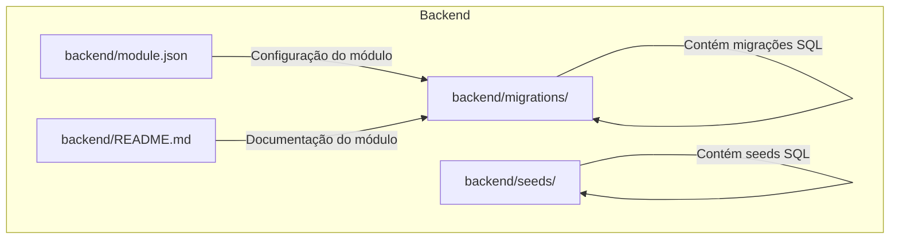
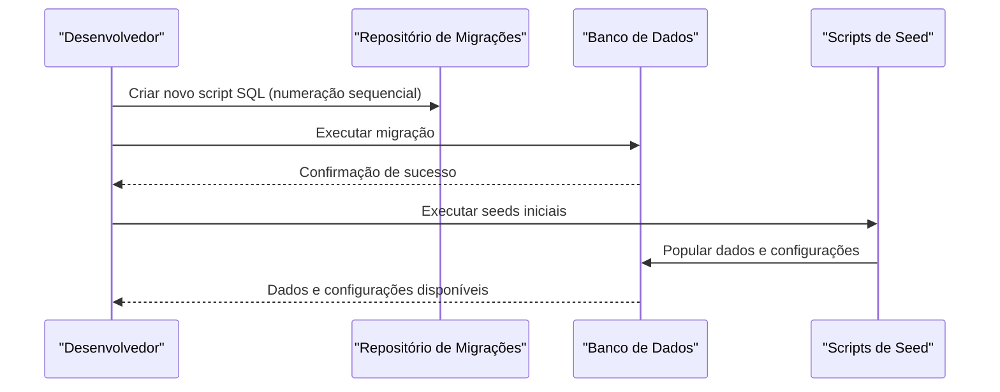
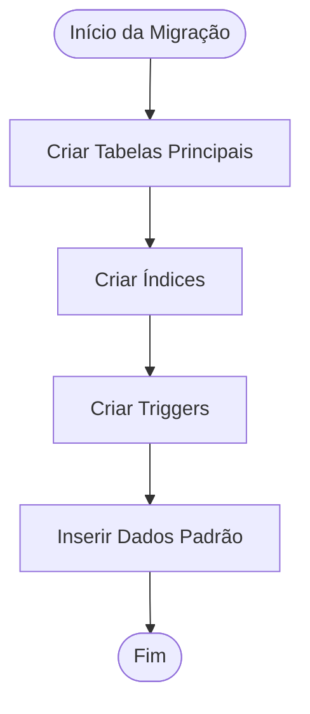
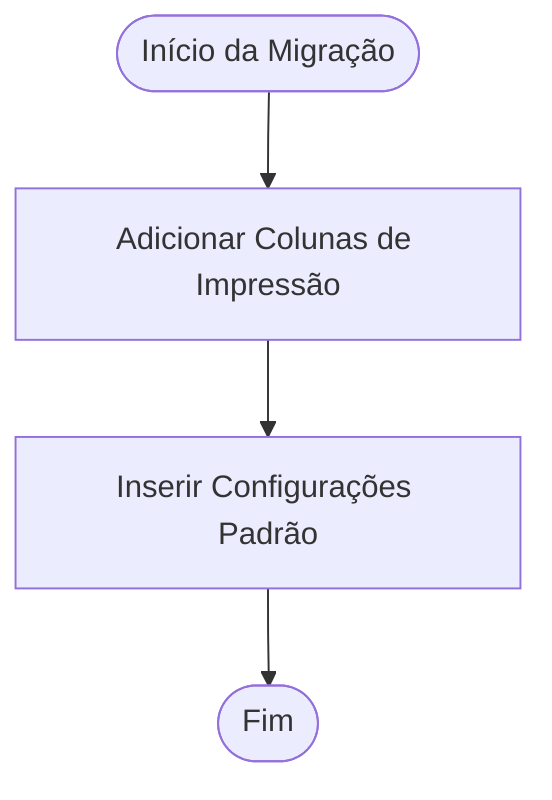
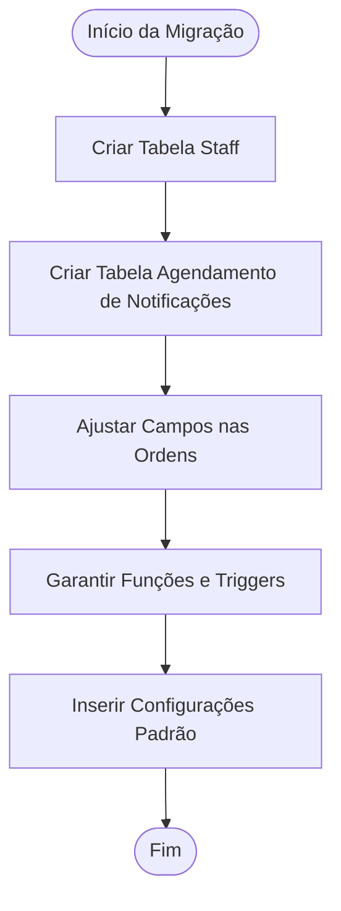
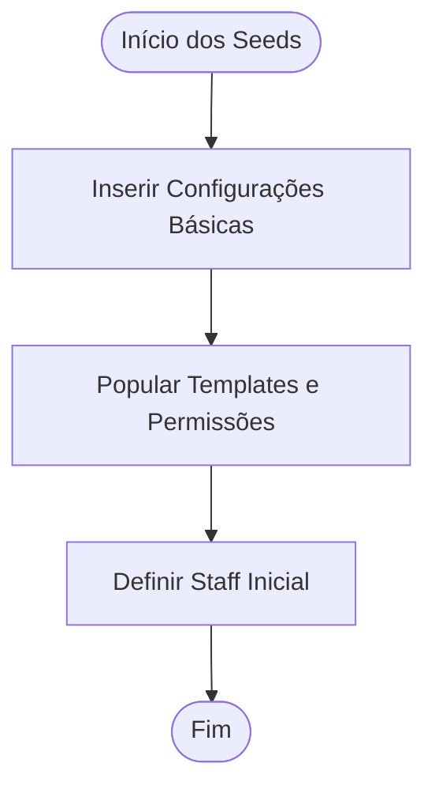
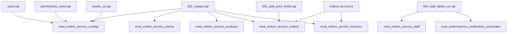

# Gerenciamento de Migrações

<cite>
**Arquivos Referenciados Neste Documento**
- [001_master.sql](file://backend/migrations/001_master.sql)
- [003_add_print_fields.sql](file://backend/migrations/003_add_print_fields.sql)
- [004_add_tables_os.sql](file://backend/migrations/004_add_tables_os.sql)
- [seed.sql](file://backend/seeds/seed.sql)
- [permissions_seed.sql](file://backend/seeds/permissions_seed.sql)
- [seeds_os.sql](file://backend/seeds/seeds_os.sql)
- [README.md](file://backend/README.md)
- [module.json](file://backend/module.json)
- [ordens.service.ts](file://backend/ordens/ordens.service.ts)
- [configuracoes.service.ts](file://backend/configuracoes/configuracoes.service.ts)
</cite>

## Sumário
1. [Introdução](#introdução)
2. [Estrutura do Projeto](#estrutura-do-projeto)
3. [Componentes-Chave](#componentes-chave)
4. [Visão Geral da Arquitetura](#visão-geral-da-arquitetura)
5. [Análise Detalhada dos Componentes](#análise-detalhada-dos-componentes)
6. [Análise de Dependências](#análise-de-dependências)
7. [Considerações de Desempenho](#considerações-de-desempenho)
8. [Guia de Solução de Problemas](#guia-de-solução-de-problemas)
9. [Conclusão](#conclusão)
10. [Apêndices](#apêndices)

## Introdução
Este documento apresenta o sistema de migrações do banco de dados do módulo Ordem de Serviço. Ele explica como as migrações são criadas, executadas e versionadas, descreve a estrutura e convenções de nomenclatura, e mostra como adicionar novas migrações ao projeto. Além disso, demonstra estratégias para migrações seguras em produção, rollback, tratamento de erros e boas práticas para manutenção e evolução contínua do esquema de dados.

## Estrutura do Projeto
O sistema de migrações e seeds está localizado dentro do backend do módulo, organizado em pastas dedicadas:
- migrations: contém as migrações SQL numeradas em ordem cronológica crescente.
- seeds: contém scripts SQL para popular dados iniciais e configurações padrão.

**Diagrama fonte**
- [module.json](file://backend/module.json#L1-L48)
- [README.md](file://backend/README.md#L1-L59)

**Fontes da seção**
- [module.json](file://backend/module.json#L1-L48)
- [README.md](file://backend/README.md#L1-L59)

## Componentes-Chave
- Migrações SQL: scripts numerados que definem mudanças no esquema do banco de dados.
- Seeds: scripts que populam dados iniciais e configurações padrão.
- Tabelas principais do módulo: configs, clientes, produtos, ordens, histórico, tipos de serviços, tipos de equipamentos, papéis de usuário, permissões e templates de permissões.

**Fontes da seção**
- [001_master.sql](file://backend/migrations/001_master.sql#L1-L622)
- [003_add_print_fields.sql](file://backend/migrations/003_add_print_fields.sql#L1-L24)
- [004_add_tables_os.sql](file://backend/migrations/004_add_tables_os.sql#L1-L80)
- [seed.sql](file://backend/seeds/seed.sql#L1-L18)
- [permissions_seed.sql](file://backend/seeds/permissions_seed.sql#L1-L329)
- [seeds_os.sql](file://backend/seeds/seeds_os.sql#L1-L69)

## Visão Geral da Arquitetura
O fluxo típico de migração segue estas etapas:
1. Criação de uma nova migração com numeração sequencial.
2. Execução da migração no ambiente de destino.
3. População de dados iniciais via seeds.
4. Validação da integridade e consistência dos dados após a migração.

[Este diagrama ilustra o fluxo conceitual e não está associado a arquivos específicos do código-fonte]

## Análise Detalhada dos Componentes

### Migração 001_master.sql
- Objetivo: estrutura completa do módulo em uma única migração.
- Recursos principais:
  - Tabelas: configs, notificações, clientes, produtos, templates, permissões, ordens, histórico, tipos, papéis de usuário.
  - Índices: otimização de consultas por tenant, nome, status, datas e outras colunas críticas.
  - Triggers: atualização automática de timestamps.
  - Inserts iniciais: dados padrão para serviços, equipamentos, permissões e papéis.

**Fontes da seção**
- [001_master.sql](file://backend/migrations/001_master.sql#L1-L622)

### Migração 003_add_print_fields.sql
- Objetivo: adicionar campos para impressão e configurações padrão.
- Recursos:
  - Adiciona coluna de garantia nas ordens.
  - Insere configurações padrão de condições de execução para todos os tenants.

**Fontes da seção**
- [003_add_print_fields.sql](file://backend/migrations/003_add_print_fields.sql#L1-L24)

### Migração 004_add_tables_os.sql
- Objetivo: sincronizar tabelas faltantes e ajustar campos divergentes entre ambientes.
- Recursos:
  - Criação de tabelas faltantes (staff, agendamento de notificações).
  - Ajuste de campos nas ordens de serviço.
  - Garantia de existência de funções e triggers.
  - Inserção de configurações padrão.

**Fontes da seção**
- [004_add_tables_os.sql](file://backend/migrations/004_add_tables_os.sql#L1-L80)

### Seeds Iniciais
- seed.sql: insere configurações básicas do módulo (habilitado e versão).
- permissions_seed.sql: popula templates de permissões e permissões padrão para perfis de admin, técnico e atendente.
- seeds_os.sql: configurações base, termos e condições, definição inicial de staff.

**Fontes da seção**
- [seed.sql](file://backend/seeds/seed.sql#L1-L18)
- [permissions_seed.sql](file://backend/seeds/permissions_seed.sql#L1-L329)
- [seeds_os.sql](file://backend/seeds/seeds_os.sql#L1-L69)

### Convenções de Nomenclatura e Estrutura
- Numeração sequencial: 001, 002, 003, etc., garantindo ordem de aplicação.
- Nomes de arquivos: descrevem claramente o objetivo da migração.
- Scripts SQL: inclusão de comentários explicativos, índices, triggers e inserts iniciais.

**Fontes da seção**
- [001_master.sql](file://backend/migrations/001_master.sql#L1-L622)
- [003_add_print_fields.sql](file://backend/migrations/003_add_print_fields.sql#L1-L24)
- [004_add_tables_os.sql](file://backend/migrations/004_add_tables_os.sql#L1-L80)

### Adicionando Novas Migrações
Passos recomendados:
1. Criar um novo arquivo SQL na pasta migrations com numeração sequencial.
2. Especificar claramente o objetivo da migração nos comentários.
3. Incluir todas as alterações necessárias (tabelas, índices, triggers, inserts).
4. Garantir que a migração seja idempotente (usar IF NOT EXISTS quando apropriado).
5. Executar a migração em ambiente de teste antes de aplicar em produção.
6. Atualizar seeds se necessário e validar a integridade dos dados.

**Fontes da seção**
- [001_master.sql](file://backend/migrations/001_master.sql#L1-L622)
- [003_add_print_fields.sql](file://backend/migrations/003_add_print_fields.sql#L1-L24)
- [004_add_tables_os.sql](file://backend/migrations/004_add_tables_os.sql#L1-L80)

### Exemplos Práticos de Migrações

#### Criação de Tabelas
- Objetivo: criar tabelas principais do módulo.
- Recursos: definição de colunas, chaves primárias, restrições e índices.

**Fontes da seção**
- [001_master.sql](file://backend/migrations/001_master.sql#L11-L320)

#### Alterações de Estrutura
- Objetivo: adicionar campos para impressão e sincronizar campos divergentes.
- Recursos: ALTER TABLE com IF NOT EXISTS, COMMENT ON COLUMN.

**Fontes da seção**
- [003_add_print_fields.sql](file://backend/migrations/003_add_print_fields.sql#L5-L21)
- [004_add_tables_os.sql](file://backend/migrations/004_add_tables_os.sql#L34-L44)

#### Inserção de Dados
- Objetivo: popular dados iniciais e configurações padrão.
- Recursos: INSERT INTO com SELECT e WHERE NOT EXISTS.

**Fontes da seção**
- [001_master.sql](file://backend/migrations/001_master.sql#L433-L619)
- [seed.sql](file://backend/seeds/seed.sql#L3-L17)
- [permissions_seed.sql](file://backend/seeds/permissions_seed.sql#L12-L329)
- [seeds_os.sql](file://backend/seeds/seeds_os.sql#L7-L26)

### Estratégias para Migrações Seguras em Produção
- Idempotência: usar IF NOT EXISTS para tabelas, índices e inserts.
- Validação de dependências: verificar existência de tabelas e chaves estrangeiras antes de criar.
- Backup prévio: sempre fazer backup antes de aplicar migrações em produção.
- Testes em staging: executar migrações em ambiente de homologação antes de produção.
- Logs e auditoria: registrar todas as operações e validar resultados.

**Fontes da seção**
- [001_master.sql](file://backend/migrations/001_master.sql#L1-L622)
- [003_add_print_fields.sql](file://backend/migrations/003_add_print_fields.sql#L1-L24)
- [004_add_tables_os.sql](file://backend/migrations/004_add_tables_os.sql#L1-L80)

### Rollback de Migrações
- Planejamento: manter scripts de rollback para cada migração crítica.
- Reversibilidade: quando possível, tornar as migrações reversíveis (ex: DROP TABLE se necessário).
- Validação: após rollback, verificar integridade dos dados e funcionamento da aplicação.

[Esta seção fornece orientações gerais e não faz análise de arquivos específicos]

### Tratamento de Erros
- Verificação de erros: validar mensagens de erro e corrigir scripts.
- Recuperação: utilizar backups e scripts de rollback.
- Monitoramento: registrar logs de migrações e auditorar alterações.

**Fontes da seção**
- [001_master.sql](file://backend/migrations/001_master.sql#L1-L622)
- [003_add_print_fields.sql](file://backend/migrations/003_add_print_fields.sql#L1-L24)
- [004_add_tables_os.sql](file://backend/migrations/004_add_tables_os.sql#L1-L80)

### Boas Práticas para Manutenção e Evolução Contínua
- Versionamento: seguir convenções de nomenclatura e manter histórico claro.
- Modularidade: separar migrações por funcionalidades e manter pequenas alterações.
- Documentação: incluir comentários explicativos nos scripts.
- Testes: validar migrações em ambientes de teste antes de produção.
- Revisão de código: revisar scripts de migração e seeds antes de aplicar.

**Fontes da seção**
- [001_master.sql](file://backend/migrations/001_master.sql#L1-L622)
- [003_add_print_fields.sql](file://backend/migrations/003_add_print_fields.sql#L1-L24)
- [004_add_tables_os.sql](file://backend/migrations/004_add_tables_os.sql#L1-L80)

## Análise de Dependências
As migrações e seeds interagem com o esquema do banco de dados e com os serviços da aplicação. As tabelas criadas pelas migrações são utilizadas pelos serviços para operações CRUD.

**Diagrama fonte**
- [001_master.sql](file://backend/migrations/001_master.sql#L11-L320)
- [003_add_print_fields.sql](file://backend/migrations/003_add_print_fields.sql#L5-L21)
- [004_add_tables_os.sql](file://backend/migrations/004_add_tables_os.sql#L6-L32)
- [seed.sql](file://backend/seeds/seed.sql#L3-L17)
- [permissions_seed.sql](file://backend/seeds/permissions_seed.sql#L12-L329)
- [seeds_os.sql](file://backend/seeds/seeds_os.sql#L7-L26)
- [ordens.service.ts](file://backend/ordens/ordens.service.ts#L557-L577)

**Fontes da seção**
- [001_master.sql](file://backend/migrations/001_master.sql#L1-L622)
- [003_add_print_fields.sql](file://backend/migrations/003_add_print_fields.sql#L1-L24)
- [004_add_tables_os.sql](file://backend/migrations/004_add_tables_os.sql#L1-L80)
- [seed.sql](file://backend/seeds/seed.sql#L1-L18)
- [permissions_seed.sql](file://backend/seeds/permissions_seed.sql#L1-L329)
- [seeds_os.sql](file://backend/seeds/seeds_os.sql#L1-L69)
- [ordens.service.ts](file://backend/ordens/ordens.service.ts#L557-L577)

## Considerações de Desempenho
- Índices: a migração 001_master.sql cria índices estratégicos para melhorar consultas em colunas críticas.
- Triggers: triggers de atualização automática de timestamps ajudam a manter integridade dos dados.
- Inserts condicionais: uso de WHERE NOT EXISTS evita duplicidade e melhora eficiência.

**Fontes da seção**
- [001_master.sql](file://backend/migrations/001_master.sql#L321-L428)
- [001_master.sql](file://backend/migrations/001_master.sql#L433-L619)

## Guia de Solução de Problemas
- Erros de chave estrangeira: verificar se as tabelas-alvo existem antes de criar relações.
- Conflitos de dados: usar INSERT com WHERE NOT EXISTS para evitar duplicidade.
- Falhas de migração: reverter para backup e corrigir o script antes de tentar novamente.
- Validação pós-migração: executar consultas de verificação e testes de integridade.

**Fontes da seção**
- [001_master.sql](file://backend/migrations/001_master.sql#L1-L622)
- [003_add_print_fields.sql](file://backend/migrations/003_add_print_fields.sql#L1-L24)
- [004_add_tables_os.sql](file://backend/migrations/004_add_tables_os.sql#L1-L80)

## Conclusão
O sistema de migrações do módulo Ordem de Serviço utiliza uma abordagem prática e estruturada com scripts SQL numerados, seeds para dados iniciais e boas práticas de idempotência e segurança. Seguindo as convenções e estratégias descritas, é possível manter o esquema de dados evolutivo e confiável, mesmo em ambientes de produção complexos.

## Apêndices
- Documentação do módulo: informações gerais sobre funcionalidades e endpoints.
- Configuração do módulo: definições de menus e configurações padrão.

**Fontes da seção**
- [README.md](file://backend/README.md#L1-L59)
- [module.json](file://backend/module.json#L1-L48)