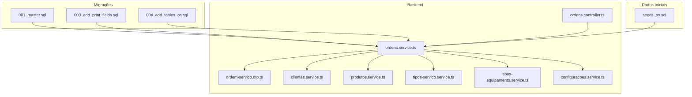
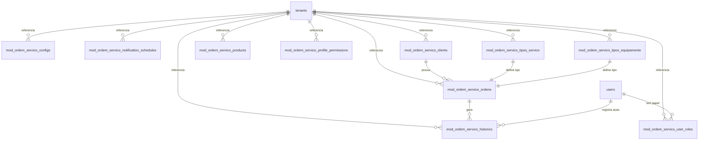
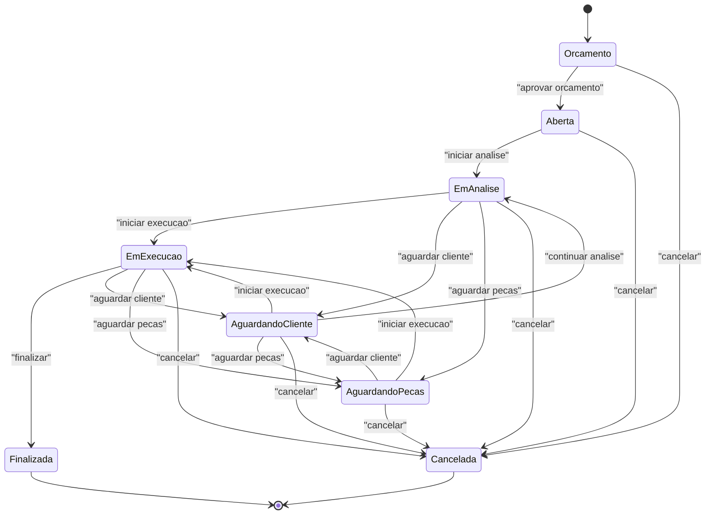
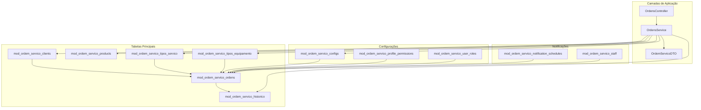

# Relacionamentos e Constraints

<cite>
**Arquivos Referenciados Neste Documento**
- [001_master.sql](file://backend/migrations/001_master.sql)
- [003_add_print_fields.sql](file://backend/migrations/003_add_print_fields.sql)
- [004_add_tables_os.sql](file://backend/migrations/004_add_tables_os.sql)
- [seeds_os.sql](file://backend/seeds/seeds_os.sql)
- [ordens.service.ts](file://backend/ordens/ordens.service.ts)
- [ordens.controller.ts](file://backend/ordens/ordens.controller.ts)
- [clientes.service.ts](file://backend/clientes/clientes.service.ts)
- [produtos.service.ts](file://backend/produtos/produtos.service.ts)
- [tipos-servico.service.ts](file://backend/configuracoes/tipos-servico.service.ts)
- [tipos-equipamento.service.ts](file://backend/configuracoes/tipos-equipamento.service.ts)
- [configuracoes.service.ts](file://backend/configuracoes/configuracoes.service.ts)
- [ordem-servico.dto.ts](file://backend/shared/dto/ordem-servico.dto.ts)
</cite>

## Sumário
1. [Introdução](#introdução)
2. [Estrutura do Projeto](#estrutura-do-projeto)
3. [Componentes Principais](#componentes-principais)
4. [Visão Geral da Arquitetura](#visão-geral-da-arquitetura)
5. [Análise Detalhada dos Componentes](#análise-detalhada-dos-componentes)
6. [Análise de Dependências](#análise-de-dependências)
7. [Considerações de Desempenho](#considerações-de-desempenho)
8. [Guia de Solução de Problemas](#guia-de-solução-de-problemas)
9. [Conclusão](#conclusão)

## Introdução
Este documento apresenta uma análise abrangente dos relacionamentos de entidades e constraints do banco de dados do módulo Ordem de Serviço. Ele documenta todos os relacionamentos entre tabelas (um-para-muitos, muitos-para-muitos), chaves estrangeiras e constraints de integridade referencial. Explica as regras de cascade, restrict e set null para diferentes cenários e demonstra como esses relacionamentos suportam o fluxo completo de ordens de serviço desde a abertura até a conclusão. Além disso, documenta constraints de validação, check constraints e triggers especiais, com exemplos práticos de consultas que aproveitam os relacionamentos e como eles impactam o desempenho do sistema.

## Estrutura do Projeto
O módulo Ordem de Serviço é composto por:
- Migrações de banco de dados que definem as tabelas e constraints
- Seeds iniciais que populam dados padrão
- Serviços que implementam a lógica de negócio e consultas
- Controllers que expõem endpoints REST
- DTOs que tipam as requisições e respostas



**Fontes do Diagrama**
- [001_master.sql](file://backend/migrations/001_master.sql#L1-L622)
- [003_add_print_fields.sql](file://backend/migrations/003_add_print_fields.sql#L1-L24)
- [004_add_tables_os.sql](file://backend/migrations/004_add_tables_os.sql#L1-L80)
- [seeds_os.sql](file://backend/seeds/seeds_os.sql#L1-L69)
- [ordens.controller.ts](file://backend/ordens/ordens.controller.ts#L1-L377)
- [ordens.service.ts](file://backend/ordens/ordens.service.ts#L1-L1148)
- [clientes.service.ts](file://backend/clientes/clientes.service.ts#L1-L253)
- [produtos.service.ts](file://backend/produtos/produtos.service.ts#L1-L169)
- [tipos-servico.service.ts](file://backend/configuracoes/tipos-servico.service.ts#L1-L128)
- [tipos-equipamento.service.ts](file://backend/configuracoes/tipos-equipamento.service.ts#L1-L123)
- [configuracoes.service.ts](file://backend/configuracoes/configuracoes.service.ts#L1-L331)
- [ordem-servico.dto.ts](file://backend/shared/dto/ordem-servico.dto.ts#L1-L397)

**Fontes da Seção**
- [001_master.sql](file://backend/migrations/001_master.sql#L1-L622)
- [003_add_print_fields.sql](file://backend/migrations/003_add_print_fields.sql#L1-L24)
- [004_add_tables_os.sql](file://backend/migrations/004_add_tables_os.sql#L1-L80)
- [seeds_os.sql](file://backend/seeds/seeds_os.sql#L1-L69)
- [ordens.controller.ts](file://backend/ordens/ordens.controller.ts#L1-L377)
- [ordens.service.ts](file://backend/ordens/ordens.service.ts#L1-L1148)
- [clientes.service.ts](file://backend/clientes/clientes.service.ts#L1-L253)
- [produtos.service.ts](file://backend/produtos/produtos.service.ts#L1-L169)
- [tipos-servico.service.ts](file://backend/configuracoes/tipos-servico.service.ts#L1-L128)
- [tipos-equipamento.service.ts](file://backend/configuracoes/tipos-equipamento.service.ts#L1-L123)
- [configuracoes.service.ts](file://backend/configuracoes/configuracoes.service.ts#L1-L331)
- [ordem-servico.dto.ts](file://backend/shared/dto/ordem-servico.dto.ts#L1-L397)

## Componentes Principais
Os principais componentes envolvidos nos relacionamentos e constraints são:

- **Tabelas de Dados Principais**:
  - `mod_ordem_servico_ordens`: Tabela principal de Ordens de Serviço
  - `mod_ordem_servico_clients`: Tabela de Clientes
  - `mod_ordem_servico_products`: Tabela de Produtos/Serviços
  - `mod_ordem_servico_tipos_servico`: Tabela de Tipos de Serviço
  - `mod_ordem_servico_tipos_equipamento`: Tabela de Tipos de Equipamento
  - `mod_ordem_servico_historico`: Tabela de Histórico de Ordens

- **Tabelas de Configuração e Permissões**:
  - `mod_ordem_servico_configs`: Configurações do módulo
  - `mod_ordem_servico_profile_permissions`: Permissões por perfil
  - `mod_ordem_servico_user_roles`: Papéis de usuários no módulo

- **Tabelas de Notificação e Staff**:
  - `mod_ordem_servico_notification_schedules`: Agendamento de notificações
  - `mod_ordem_servico_staff`: Técnicos do módulo

**Fontes da Seção**
- [001_master.sql](file://backend/migrations/001_master.sql#L12-L622)
- [004_add_tables_os.sql](file://backend/migrations/004_add_tables_os.sql#L6-L32)

## Visão Geral da Arquitetura
A arquitetura do módulo é baseada em relacionamentos de entidades bem definidos com constraints de integridade referencial:



**Fontes do Diagrama**
- [001_master.sql](file://backend/migrations/001_master.sql#L12-L622)
- [004_add_tables_os.sql](file://backend/migrations/004_add_tables_os.sql#L6-L32)

## Análise Detalhada dos Componentes

### Relacionamentos de Entidades e Constraints

#### 1. Relacionamentos de Tabelas

**Ordens de Serviço e Clientes**:
- Relacionamento: Um-para-muitos (um cliente pode ter várias ordens)
- Chave estrangeira: `cliente_id` em `mod_ordem_servico_ordens` referencia `id` em `mod_ordem_servico_clients`
- Constraint de integridade: `ON DELETE RESTRICT` impede exclusão de clientes com ordens ativas

**Ordens de Serviço e Histórico**:
- Relacionamento: Um-para-muitos (uma ordem gera múltiplos registros de histórico)
- Chave estrangeira: `ordem_servico_id` em `mod_ordem_servico_historico` referencia `id` em `mod_ordem_servico_ordens`
- Constraint de integridade: `ON DELETE CASCADE` exclui histórico quando a ordem é removida

**Tipos de Serviço e Ordens de Serviço**:
- Relacionamento: Muitos-para-muitos através de valores de texto
- Constraint: `CHECK` limita `origem_solicitacao` a valores específicos
- Index: Índice único combinado `(tenant_id, numero)` para unicidade de números de OS

**Configurações e Tenants**:
- Relacionamento: Um-para-muitos (um tenant tem várias configurações)
- Chave estrangeira: `tenant_id` em `mod_ordem_servico_configs` referencia `id` em `tenants`
- Constraint de integridade: `ON DELETE CASCADE` mantém consistência

**Permissões e Perfis**:
- Relacionamento: Um-para-muitos (um tenant tem várias permissões)
- Constraint: `CHECK (profile IN ('admin', 'technician', 'attendant'))`
- Índice único: `(tenant_id, permission_id, profile)` evita duplicidade

#### 2. Constraints de Validação e Check Constraints

**Status de Ordens de Serviço**:
- Constraint: `CHECK (status >= 0 AND status <= 7)` limita valores válidos
- Fluxo de status controlado programaticamente com transições permitidas

**Origem da Solicitação**:
- Constraint: `CHECK (origem_solicitacao IN ('WHATSAPP', 'PRESENCIAL', 'SISTEMA'))`
- Garante valores padronizados para origem da solicitação

**Perfil de Usuários**:
- Constraint: `CHECK (profile IN ('admin', 'technician', 'attendant'))`
- Garante perfis válidos no sistema

**Campos de Formatação**:
- Colunas adicionadas dinamicamente: `formatacao_so`, `formatacao_backup`, `formatacao_backup_descricao`, `formatacao_senha`, `laudo_tecnico`, `garantia_dias`
- Comentários de coluna documentam propósito

#### 3. Regras de Cascade, Restrict e Set Null

**Cascade**:
- `ON DELETE CASCADE` em `mod_ordem_servico_configs` (referência a `tenants`)
- `ON DELETE CASCADE` em `mod_ordem_servico_historico` (referência a `mod_ordem_servico_ordens`)
- `ON UPDATE CASCADE` e `ON DELETE CASCADE` em `mod_ordem_servico_notification_schedules` (referência a `mod_ordem_servico_ordens`)

**Restrict**:
- `ON DELETE RESTRICT` em `mod_ordem_servico_ordens` (referência a `mod_ordem_servico_clients`)
- Impede exclusão de clientes que possuem ordens de serviço

**Set Null**:
- Não há regras explícitas de `SET NULL` nos relacionamentos definidos

#### 4. Triggers Especiais

**Atualização Automática de Timestamps**:
- Trigger `update_mod_ordem_servico_ordens_updated_at` atualiza `updated_at` antes de updates
- Trigger `update_mod_ordem_servico_user_roles_updated_at` atualiza `updated_at` em `mod_ordem_servico_user_roles`

**Funcionamento do Trigger**:
- Função PL/pgSQL que define `NEW.updated_at = CURRENT_TIMESTAMP`
- Executado antes de cada operação UPDATE

**Fontes da Seção**
- [001_master.sql](file://backend/migrations/001_master.sql#L242-L249)
- [001_master.sql](file://backend/migrations/001_master.sql#L263-L268)
- [001_master.sql](file://backend/migrations/001_master.sql#L187-L196)
- [001_master.sql](file://backend/migrations/001_master.sql#L398-L428)
- [004_add_tables_os.sql](file://backend/migrations/004_add_tables_os.sql#L46-L63)

### Fluxo Completo de Ordens de Serviço

O fluxo de ordens de serviço segue transições controladas:



**Fontes do Diagrama**
- [ordens.service.ts](file://backend/ordens/ordens.service.ts#L125-L135)

### Exemplos Práticos de Consultas

#### 1. Consulta de Ordens com Detalhes do Cliente

```sql
SELECT 
    os.*,
    c.name as cliente_nome,
    c.phone_primary as cliente_telefone,
    c.is_active as cliente_ativo
FROM mod_ordem_servico_ordens os
LEFT JOIN mod_ordem_servico_clients c ON os.cliente_id = c.id
WHERE os.tenant_id = $1
ORDER BY os.created_at DESC
LIMIT $2 OFFSET $3
```

#### 2. Histórico de Alterações de uma Ordem

```sql
SELECT 
    h.*,
    u.name as usuario_nome,
    u.email as usuario_email
FROM mod_ordem_servico_historico h
LEFT JOIN users u ON h.usuario_id::uuid = u.id
WHERE h.ordem_servico_id = $1
ORDER BY h.created_at DESC
```

#### 3. Dashboard de Status

```sql
SELECT 
    status,
    COUNT(*)::int as quantidade,
    COALESCE(SUM(valor_servico), 0)::float as valor_total
FROM mod_ordem_servico_ordens 
WHERE tenant_id = $1
GROUP BY status
ORDER BY status
```

#### 4. Ordens por Tipo de Serviço

```sql
SELECT 
    ts.nome as tipo_servico,
    COUNT(*)::int as quantidade,
    AVG(valor_servico)::float as valor_medio
FROM mod_ordem_servico_ordens os
JOIN mod_ordem_servico_tipos_servico ts ON os.tipo_servico = ts.nome
WHERE os.tenant_id = $1
GROUP BY ts.nome
ORDER BY quantidade DESC
```

**Fontes da Seção**
- [ordens.service.ts](file://backend/ordens/ordens.service.ts#L283-L321)
- [ordens.service.ts](file://backend/ordens/ordens.service.ts#L896-L910)
- [ordens.service.ts](file://backend/ordens/ordens.service.ts#L921-L930)
- [ordens.service.ts](file://backend/ordens/ordens.service.ts#L1093-L1101)

### Impacto nos Relacionamentos

#### 1. Performance com Índices

**Índices Criados**:
- `idx_mod_ordem_servico_ordens_numero`: Único combinado `(tenant_id, numero)`
- `idx_mod_ordem_servico_ordens_cliente_id`: Acelera buscas por cliente
- `idx_mod_ordem_servico_ordens_status`: Filtragem por status
- `idx_mod_ordem_servico_clients_document`: Busca por CPF/CNPJ
- `idx_mod_ordem_servico_products_code`: Busca por código de produto

**Impacto**:
- Consultas paginadas com filtros são significativamente mais rápidas
- Buscas por número de OS são O(log n) graças ao índice único
- Join entre ordens e clientes otimizado

#### 2. Constraints de Integridade

**Benefícios**:
- Garantem consistência dos dados em nível de banco
- Impedem inserções inválidas de forma proativa
- Facilitam a manutenção de dados históricos

**Impacto no Desempenho**:
- Constraints adicionam sobrecarga leve em inserts/updates
- Beneficiam consultas ao manter dados limpos e consistentes

**Fontes da Seção**
- [001_master.sql](file://backend/migrations/001_master.sql#L325-L396)
- [001_master.sql](file://backend/migrations/001_master.sql#L215-L220)

## Análise de Dependências



**Fontes do Diagrama**
- [001_master.sql](file://backend/migrations/001_master.sql#L12-L622)
- [004_add_tables_os.sql](file://backend/migrations/004_add_tables_os.sql#L6-L32)
- [ordens.controller.ts](file://backend/ordens/ordens.controller.ts#L1-L377)
- [ordens.service.ts](file://backend/ordens/ordens.service.ts#L1-L1148)

**Fontes da Seção**
- [001_master.sql](file://backend/migrations/001_master.sql#L12-L622)
- [004_add_tables_os.sql](file://backend/migrations/004_add_tables_os.sql#L6-L32)
- [ordens.controller.ts](file://backend/ordens/ordens.controller.ts#L1-L377)
- [ordens.service.ts](file://backend/ordens/ordens.service.ts#L1-L1148)

## Considerações de Desempenho

### Otimizações Implementadas

1. **Índices Estratégicos**:
   - Índices únicos para chaves primárias e combinações frequentemente filtradas
   - Índices de texto para buscas em nomes e descrições
   - Índices em campos de data para ordenação eficiente

2. **Constraints de Validação**:
   - Check constraints evitam dados inválidos e otimizam consultas
   - Validação no nível de banco reduz carga de processamento

3. **Triggers de Timestamp**:
   - Atualização automática sem sobrecarga adicional significativa
   - Manutenção de histórico de alterações sem impacto no desempenho

### Melhorias Potenciais

1. **Partitioning**:
   - Considerar partitioning por data para tabelas com grande volume de dados
   - Segmentação de histórico por período

2. **Materialized Views**:
   - Views materializadas para dashboards complexos
   - Caching de dados agregados frequentemente consultados

3. **Query Optimization**:
   - Index coverage para consultas mais complexas
   - Query rewriting para casos específicos de performance

## Guia de Solução de Problemas

### Erros Comuns e Soluções

#### 1. Erro de Integridade Referencial
**Causa**: Tentativa de inserir/excluir registros violando constraints
**Solução**: Verificar relacionamentos antes de operações
- Para exclusão de clientes: verificar se há ordens associadas
- Para atualização de status: validar transições permitidas

#### 2. Performance de Consultas
**Causa**: Consultas sem índices adequados
**Solução**: 
- Utilizar índices existentes (`idx_mod_ordem_servico_ordens_status`)
- Reescrever consultas para aproveitar índices
- Limitar resultados com paginação

#### 3. Validação de Dados
**Causa**: Dados inválidos em campos com constraints
**Solução**:
- Verificar check constraints antes de inserções
- Validar valores antes de atualizações
- Utilizar DTOs para tipagem e validação

**Fontes da Seção**
- [ordens.service.ts](file://backend/ordens/ordens.service.ts#L988-L991)
- [clientes.service.ts](file://backend/clientes/clientes.service.ts#L212-L237)
- [ordens.controller.ts](file://backend/ordens/ordens.controller.ts#L225-L244)

## Conclusão
O módulo Ordem de Serviço apresenta uma estrutura de banco de dados bem planejada com relacionamentos claros e constraints robustas. Os relacionamentos de entidade suportam completamente o fluxo de ordens de serviço desde a abertura até a conclusão, com validações proativas e integridade referencial garantida. As constraints de validação e check constraints asseguram consistência dos dados, enquanto os índices estratégicos proporcionam bom desempenho para consultas comuns. Os triggers implementados automatizam manutenção de timestamps e histórico de alterações. A arquitetura permite expansões futuras com particionamento e views materializadas para atender crescimento de dados e complexidade de consultas.