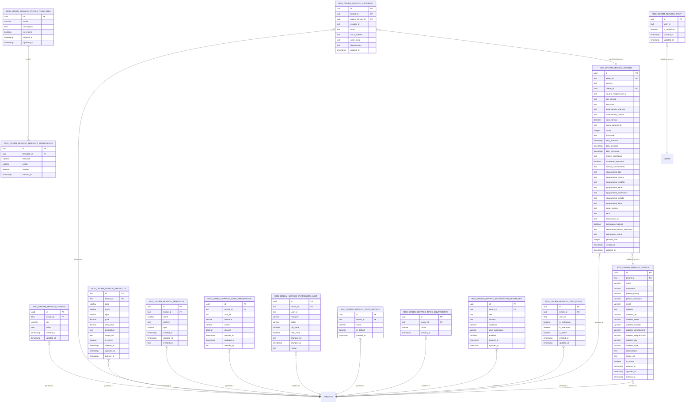
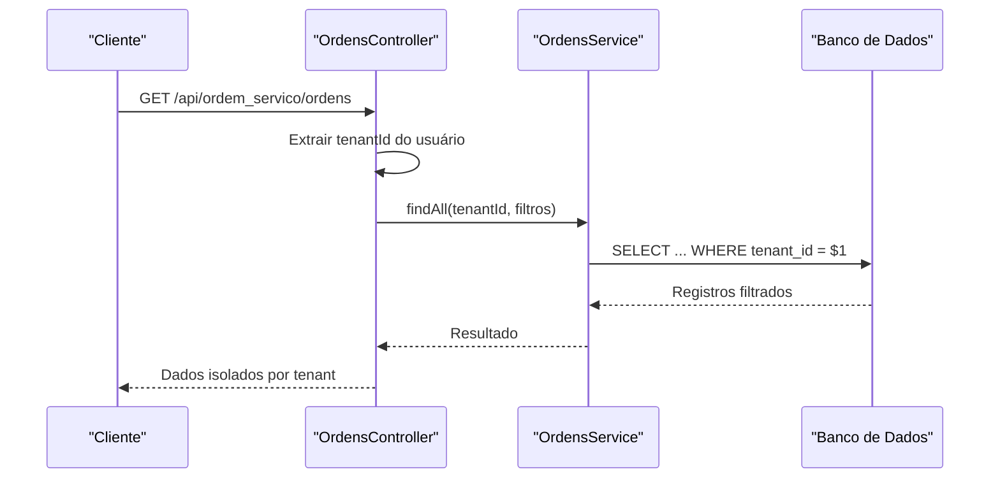
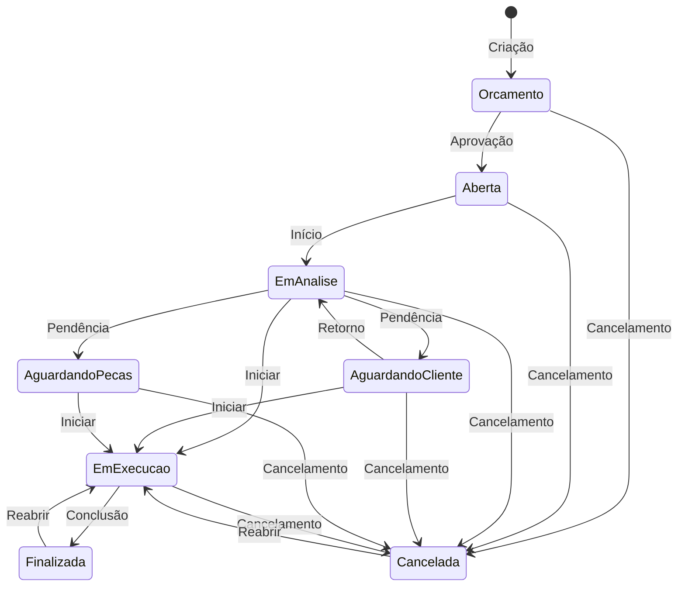
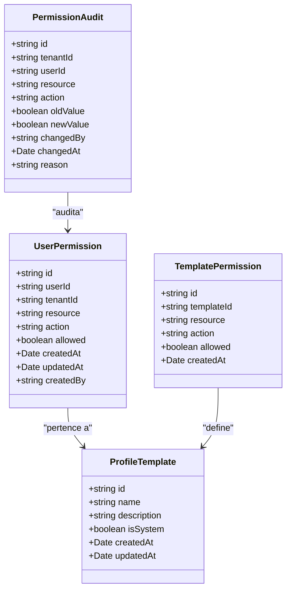

# Visão Geral do Esquema de Dados

<cite>
**Arquivos Referenciados Neste Documento**
- [001_master.sql](file://backend/migrations/001_master.sql)
- [004_add_tables_os.sql](file://backend/migrations/004_add_tables_os.sql)
- [ordens.service.ts](file://backend/ordens/ordens.service.ts)
- [ordens.controller.ts](file://backend/ordens/ordens.controller.ts)
- [clientes.service.ts](file://backend/clientes/clientes.service.ts)
- [produtos.service.ts](file://backend/produtos/produtos.service.ts)
- [configuracoes.service.ts](file://backend/configuracoes/configuracoes.service.ts)
- [permission.service.ts](file://backend/shared/services/permission.service.ts)
- [available-permissions.ts](file://backend/shared/constants/available-permissions.ts)
- [ordem-servico.dto.ts](file://backend/shared/dto/ordem-servico.dto.ts)
- [pdf-template.util.ts](file://backend/ordens/pdf-template.util.ts)
- [module.json](file://backend/module.json)
</cite>

## Sumário
- Este documento apresenta uma visão abrangente do esquema de dados do módulo de Ordens de Serviço, com ênfase em:
  - Estrutura geral do banco de dados e relacionamentos entre tabelas principais
  - Hierarquia de entidades e design do esquema (chaves primárias, estrangeiras e relacionamentos)
  - Multi-tenant e isolamento de dados por inquilino
  - Integração com áreas do sistema (clientes, produtos, ordens, permissões)
  - Considerações de escalabilidade e desempenho

## Estrutura Geral do Banco de Dados

O esquema do módulo de Ordens de Serviço é composto por múltiplas tabelas organizadas em camadas funcionais:

- **Configurações do módulo**: armazena configurações específicas de cada inquilino
- **Clientes**: cadastro de clientes com dados de contato e endereços
- **Produtos/Serviços**: catálogo de produtos e serviços disponíveis
- **Templates de documentos**: modelos reutilizáveis para geração de documentos
- **Permissões**: sistema granular de permissões por usuário e perfil
- **Ordens de Serviço**: entidade central com histórico e relacionamentos
- **Tipos**: definições de tipos de serviço e equipamento
- **Notificações**: agendamento de notificações programadas
- **Papéis de usuários**: papéis específicos dentro do módulo

**Fontes do Diagrama**
- [001_master.sql](file://backend/migrations/001_master.sql#L12-L320)
- [004_add_tables_os.sql](file://backend/migrations/004_add_tables_os.sql#L7-L32)

**Fontes da Seção**
- [001_master.sql](file://backend/migrations/001_master.sql#L12-L320)
- [004_add_tables_os.sql](file://backend/migrations/004_add_tables_os.sql#L7-L32)

## Design do Esquema e Relacionamentos

### Chaves Primárias e Estrangeiras

O esquema adota um design consistente com:

- **Chaves primárias**: UUIDs para todas as entidades principais, proporcionando isolamento e facilidade de replicação
- **Chaves estrangeiras**: Referências explícitas com constraints de integridade
- **Campos tenant_id**: Presente em todas as tabelas para implementar multi-tenant

### Hierarquia de Entidades

```mermaid
graph TD
subgraph "Configurações"
A[MOD_ORDEM_SERVICO_CONFIGS]
B[MOD_ORDEM_SERVICO_NOTIFICATION_SCHEDULES]
C[MOD_ORDEM_SERVICO_TEMPLATES]
end
subgraph "Cadastros"
D[MOD_ORDEM_SERVICO_CLIENTS]
E[MOD_ORDEM_SERVICO_PRODUCTS]
F[MOD_ORDEM_SERVICO_TIPOS_SERVICO]
G[MOD_ORDEM_SERVICO_TIPOS_EQUIPAMENTO]
end
subgraph "Permissões"
H[MOD_ORDEM_SERVICO_USER_PERMISSIONS]
I[MOD_ORDEM_SERVICO_PROFILE_TEMPLATES]
J[MOD_ORDEM_SERVICO_TEMPLATE_PERMISSIONS]
K[MOD_ORDEM_SERVICO_PERMISSION_AUDIT]
L[MOD_ORDEM_SERVICO_USER_ROLES]
M[MOD_ORDEM_SERVICO_STAFF]
end
subgraph "Ordens de Serviço"
N[MOD_ORDEM_SERVICO_ORDENS]
O[MOD_ORDEM_SERVICO_HISTORICO]
end
A --> N
B --> N
C --> N
D --> N
E --> N
F --> N
G --> N
H --> N
I --> J
K --> N
L --> N
M --> N
```

**Fontes do Diagrama**
- [001_master.sql](file://backend/migrations/001_master.sql#L12-L320)
- [004_add_tables_os.sql](file://backend/migrations/004_add_tables_os.sql#L7-L32)

**Fontes da Seção**
- [001_master.sql](file://backend/migrations/001_master.sql#L12-L320)
- [004_add_tables_os.sql](file://backend/migrations/004_add_tables_os.sql#L7-L32)

## Multi-Tenant e Isolamento de Dados

### Implementação

O sistema implementa multi-tenant através de:

- **Campo tenant_id**: presente em todas as tabelas principais
- **Constraints de chave estrangeira**: todas as FK apontam para a tabela tenants
- **Filtros automáticos**: todas as operações de leitura incluem o tenant_id
- **Isolamento de uploads**: arquivos são armazenados em diretórios separados por tenant

### Exemplos de Isolamento

**Fontes do Diagrama**
- [ordens.controller.ts](file://backend/ordens/ordens.controller.ts#L34-L55)
- [ordens.service.ts](file://backend/ordens/ordens.service.ts#L137-L473)

**Fontes da Seção**
- [ordens.controller.ts](file://backend/ordens/ordens.controller.ts#L34-L55)
- [ordens.service.ts](file://backend/ordens/ordens.service.ts#L137-L473)

## Áreas do Sistema e Integrações

### Ordens de Serviço

A entidade central possui integrações ricas:

- **Clientes**: relacionamento obrigatório para identificação do solicitante
- **Produtos/Serviços**: itens associados à ordem
- **Histórico**: controle de todas as alterações
- **Tipos**: categorização de serviços e equipamentos
- **Notificações**: agendamento de lembretes

### Fluxo de Status

**Fontes do Diagrama**
- [ordem-servico.dto.ts](file://backend/shared/dto/ordem-servico.dto.ts#L9-L18)
- [ordens.service.ts](file://backend/ordens/ordens.service.ts#L125-L135)

**Fontes da Seção**
- [ordem-servico.dto.ts](file://backend/shared/dto/ordem-servico.dto.ts#L9-L18)
- [ordens.service.ts](file://backend/ordens/ordens.service.ts#L125-L135)

### Permissões e Controles

O sistema implementa um sistema de permissões granular:

- **Permissões individuais**: controle específico por usuário
- **Perfis de usuário**: papéis pré-definidos (admin, técnico, atendente)
- **Auditoria**: histórico completo de alterações de permissões
- **Templates**: definição de conjuntos de permissões

**Fontes do Diagrama**
- [permission.service.ts](file://backend/shared/services/permission.service.ts#L1-L313)
- [available-permissions.ts](file://backend/shared/constants/available-permissions.ts#L1-L164)

**Fontes da Seção**
- [permission.service.ts](file://backend/shared/services/permission.service.ts#L1-L313)
- [available-permissions.ts](file://backend/shared/constants/available-permissions.ts#L1-L164)

## Considerações de Escalabilidade e Desempenho

### Índices e Otimizações

O esquema inclui índices estratégicos para otimizar consultas:

- **Índices compostos**: tenant_id + chave única para evitar scans completos
- **Índices de busca**: para campos frequentemente pesquisados (nome, documento, status)
- **Índices de data**: para ordenações e filtros temporais
- **Índices de auditoria**: para histórico e permissões

### Características de Escalabilidade

- **Particionamento natural**: o tenant_id permite particionamento lógico
- **Padrões de acesso**: consultas direcionadas com filtros explícitos
- **Armazenamento de arquivos**: separação por tenant evita conflitos
- **Documentação padronizada**: templates reutilizáveis para geração de PDFs

### Melhorias Recomendadas

- **Partitioning avançado**: considerar partitioning por tenant_id em grandes volumes
- **Caching de configurações**: cache para dados de configuração e templates
- **Batch operations**: otimizações para operações em massa
- **Monitoramento de índices**: revisão periódica de eficiência de índices

**Fontes da Seção**
- [001_master.sql](file://backend/migrations/001_master.sql#L325-L396)
- [ordens.service.ts](file://backend/ordens/ordens.service.ts#L137-L473)

## Conclusão

O esquema de dados do módulo de Ordens de Serviço apresenta uma arquitetura bem estruturada com:

- **Isolamento completo** por inquilino através do campo tenant_id
- **Relacionamentos claros** entre entidades principais
- **Controles de permissões** granulares e auditáveis
- **Padrões de design** consistentes com boas práticas de banco de dados
- **Considerações de escalabilidade** incorporadas desde a modelagem

A implementação permite crescimento horizontal adequado e manutenção simplificada, mantendo a integridade dos dados e o isolamento necessário para múltiplos inquilinos.