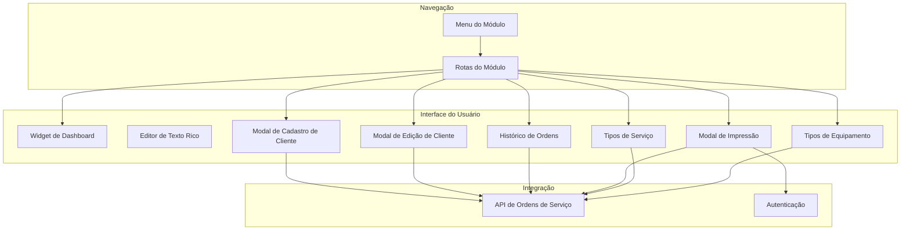
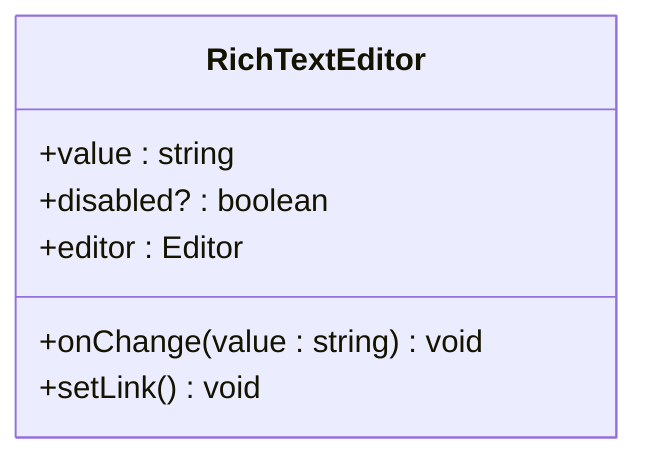
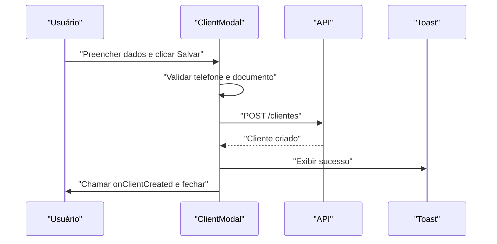
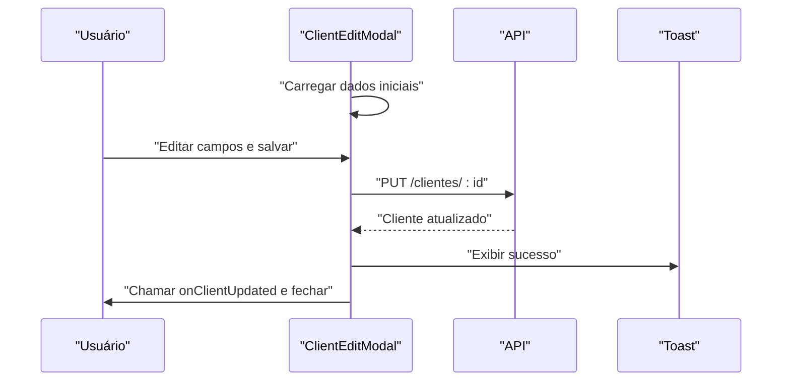
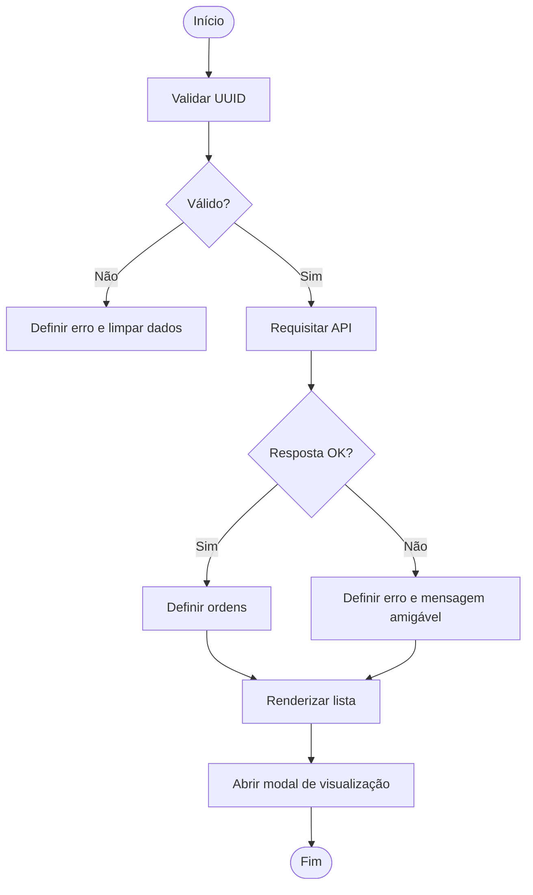
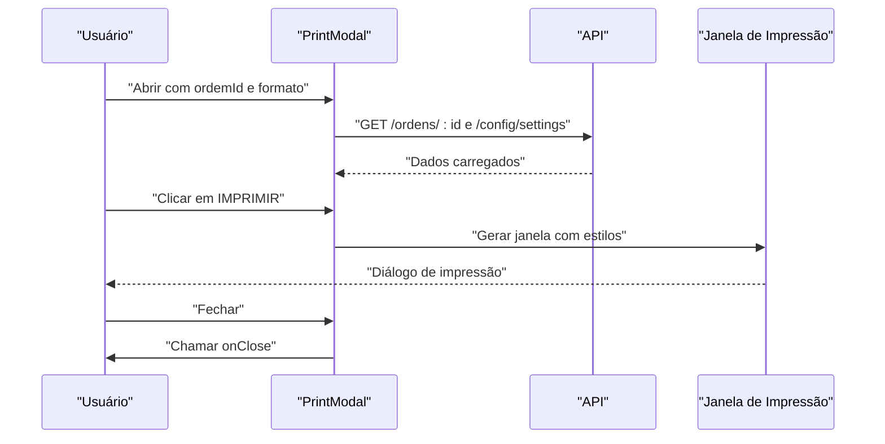
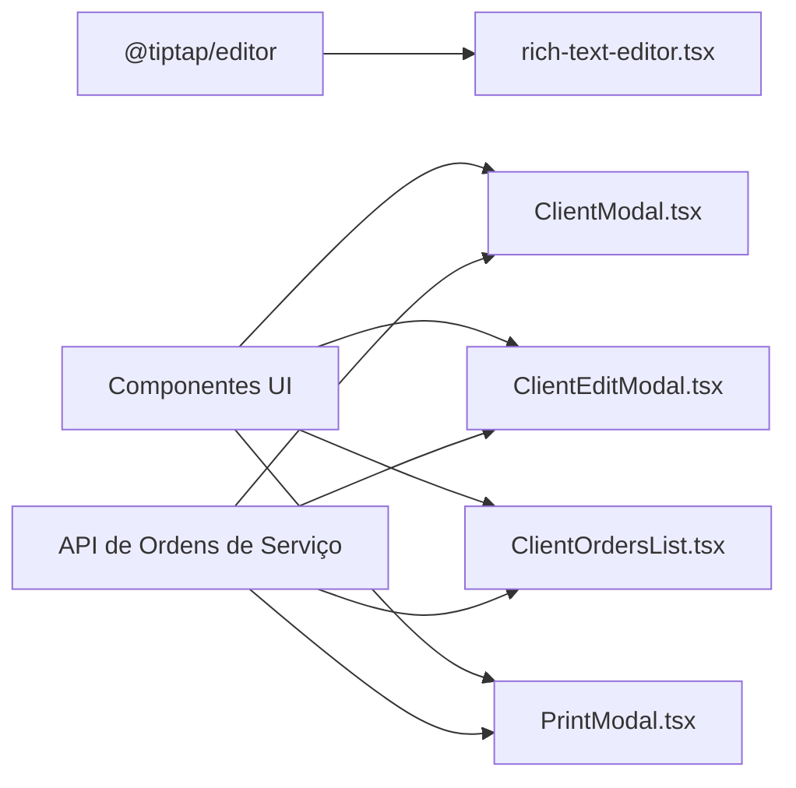

# Componentes de Interface do Usuário

<cite>
**Arquivos referenciados neste documento**
- [frontend/index.tsx](file://frontend/index.tsx)
- [frontend/menu.ts](file://frontend/menu.ts)
- [frontend/routes.tsx](file://frontend/routes.tsx)
- [frontend/components/ui/rich-text-editor.tsx](file://frontend/components/ui/rich-text-editor.tsx)
- [frontend/components/MeuModuloWidget.tsx](file://frontend/components/MeuModuloWidget.tsx)
- [frontend/components/MeuModuloDashboard.tsx](file://frontend/components/MeuModuloDashboard.tsx)
- [frontend/components/ClientModal.tsx](file://frontend/components/ClientModal.tsx)
- [frontend/components/ClientEditModal.tsx](file://frontend/components/ClientEditModal.tsx)
- [frontend/components/ClientOrdersList.tsx](file://frontend/components/ClientOrdersList.tsx)
- [frontend/components/PrintModal.tsx](file://frontend/components/PrintModal.tsx)
- [frontend/components/TiposServicoManager.tsx](file://frontend/components/TiposServicoManager.tsx)
- [frontend/components/TiposEquipamentoManager.tsx](file://frontend/components/TiposEquipamentoManager.tsx)
</cite>

## Sumário
1. [Introdução](#introdução)
2. [Estrutura do Projeto](#estrutura-do-projeto)
3. [Componentes Principais](#componentes-principais)
4. [Visão Geral da Arquitetura](#visão-geral-da-arquitetura)
5. [Análise Detalhada dos Componentes](#análise-detalhada-dos-componentes)
6. [Análise de Dependências](#análise-de-dependências)
7. [Considerações de Desempenho](#considerações-de-desempenho)
8. [Guia de Solução de Problemas](#guia-de-solução-de-problemas)
9. [Conclusão](#conclusão)

## Introdução
Este documento apresenta uma documentação abrangente dos componentes de interface do usuário do módulo de Ordens de Serviço. Ele descreve aparência visual, comportamento, padrões de interação, props/atributos, eventos, slots, opções de personalização, exemplos de uso, design responsivo, conformidade com acessibilidade, estados do componente, animações e transições, além de compatibilidade com navegadores e otimizações de desempenho. Também inclui recomendações de composição de componentes e integração com outros elementos da interface.

## Estrutura do Projeto
O frontend é composto por componentes reutilizáveis, páginas e rotas específicas do módulo. O módulo registra um widget de dashboard e define um menu com acesso às páginas de dashboard, listagem, configurações, clientes, produtos/serviços e ordens de serviço. Os componentes de interface são organizados em pastas para separar elementos reutilizáveis (ui) de componentes específicos do módulo.

```mermaid
graph TB
A["frontend/index.tsx<br/>Módulo frontend"] --> B["frontend/menu.ts<br/>Menu do módulo"]
A --> C["frontend/routes.tsx<br/>Rotas do módulo"]
A --> D["frontend/components/MeuModuloWidget.tsx<br/>Widget de dashboard"]
A --> E["frontend/components/MeuModuloDashboard.tsx<br/>Dashboard principal"]
A --> F["frontend/components/ui/rich-text-editor.tsx<br/>Editor de texto rico"]
A --> G["frontend/components/ClientModal.tsx<br/>Cadastro de cliente"]
A --> H["frontend/components/ClientEditModal.tsx<br/>Edição de cliente"]
A --> I["frontend/components/ClientOrdersList.tsx<br/>Histórico de ordens"]
A --> J["frontend/components/PrintModal.tsx<br/>Prévia de impressão"]
A --> K["frontend/components/TiposServicoManager.tsx<br/>Tipos de serviço"]
A --> L["frontend/components/TiposEquipamentoManager.tsx<br/>Tipos de equipamento"]
```

**Diagrama fonte**
- [frontend/index.tsx](file://frontend/index.tsx#L1-L22)
- [frontend/menu.ts](file://frontend/menu.ts#L1-L50)
- [frontend/routes.tsx](file://frontend/routes.tsx#L1-L20)

**Seção fonte**
- [frontend/index.tsx](file://frontend/index.tsx#L1-L22)
- [frontend/menu.ts](file://frontend/menu.ts#L1-L50)
- [frontend/routes.tsx](file://frontend/routes.tsx#L1-L20)

## Componentes Principais
Esta seção apresenta os principais componentes de interface e suas funções dentro do módulo.

- Widget de Dashboard: Exibe um resumo com ícone e status do módulo.
- Editor de Texto Rico: Interface de edição com formatação e alinhamento.
- Modal de Cadastro de Cliente: Formulário completo com máscaras, validações e busca de CEP.
- Modal de Edição de Cliente: Formulário de edição com persistência de dados.
- Histórico de Ordens do Cliente: Lista de ordens anteriores com prévia.
- Modal de Impressão: Visualização e geração de PDF/A4 e termal.
- Gerenciadores de Tipos: Tela de gerenciamento de tipos de serviço e equipamento.

**Seção fonte**
- [frontend/components/MeuModuloWidget.tsx](file://frontend/components/MeuModuloWidget.tsx#L1-L21)
- [frontend/components/ui/rich-text-editor.tsx](file://frontend/components/ui/rich-text-editor.tsx#L1-L226)
- [frontend/components/ClientModal.tsx](file://frontend/components/ClientModal.tsx#L1-L673)
- [frontend/components/ClientEditModal.tsx](file://frontend/components/ClientEditModal.tsx#L1-L711)
- [frontend/components/ClientOrdersList.tsx](file://frontend/components/ClientOrdersList.tsx#L1-L156)
- [frontend/components/PrintModal.tsx](file://frontend/components/PrintModal.tsx#L1-L223)
- [frontend/components/TiposServicoManager.tsx](file://frontend/components/TiposServicoManager.tsx#L1-L407)
- [frontend/components/TiposEquipamentoManager.tsx](file://frontend/components/TiposEquipamentoManager.tsx#L1-L370)

## Visão Geral da Arquitetura
A arquitetura da interface segue um padrão de componentes reutilizáveis com dependências de bibliotecas externas (ex: editor de texto) e componentes de UI compartilhados. O fluxo típico envolve a navegação pelas rotas do módulo, a interação com formulários e modais, e a comunicação com serviços via API.

**Diagrama fonte**
- [frontend/routes.tsx](file://frontend/routes.tsx#L1-L20)
- [frontend/menu.ts](file://frontend/menu.ts#L1-L50)
- [frontend/components/ClientModal.tsx](file://frontend/components/ClientModal.tsx#L1-L673)
- [frontend/components/ClientEditModal.tsx](file://frontend/components/ClientEditModal.tsx#L1-L711)
- [frontend/components/ClientOrdersList.tsx](file://frontend/components/ClientOrdersList.tsx#L1-L156)
- [frontend/components/PrintModal.tsx](file://frontend/components/PrintModal.tsx#L1-L223)
- [frontend/components/TiposServicoManager.tsx](file://frontend/components/TiposServicoManager.tsx#L1-L407)
- [frontend/components/TiposEquipamentoManager.tsx](file://frontend/components/TiposEquipamentoManager.tsx#L1-L370)

## Análise Detalhada dos Componentes

### Widget de Dashboard
- Propósito: Apresentar um card com título, ícone e status do módulo.
- Aparência: Card com borda azul, título pequeno, ícone e texto em destaque.
- Estados: Sem estados internos; exibe conteúdo estático.
- Personalização: Estilo pode ser alterado via classes Tailwind passadas ao Card.

**Seção fonte**
- [frontend/components/MeuModuloWidget.tsx](file://frontend/components/MeuModuloWidget.tsx#L1-L21)

### Editor de Texto Rico
- Propósito: Editor com formatação (negrito, itálico, sublinhado, tachado), cores de texto, alinhamento, listas e separador horizontal.
- Props:
  - value: string (HTML inicial)
  - onChange: (value: string) => void (notifica mudanças)
  - disabled: boolean (opcional)
- Comportamento:
  - Sincroniza valor com o conteúdo HTML do editor.
  - Habilita/desabilita edição com base em prop.
  - Cria links com prompt seguro.
- Acessibilidade:
  - Botões possuem rótulos aria-label.
- Estilos:
  - Classes de borda, fundo e altura mínima aplicadas ao editor.
- Personalização:
  - Estilos podem ser sobrescritos via classes passadas ao EditorContent.

**Diagrama fonte**
- [frontend/components/ui/rich-text-editor.tsx](file://frontend/components/ui/rich-text-editor.tsx#L21-L226)

**Seção fonte**
- [frontend/components/ui/rich-text-editor.tsx](file://frontend/components/ui/rich-text-editor.tsx#L1-L226)

### Modal de Cadastro de Cliente
- Propósito: Formulário para criação de novos clientes com validações, máscaras e busca de CEP.
- Props:
  - isOpen: boolean
  - onClose: () => void
  - onClientCreated?: (client: any) => void
- Funcionalidades:
  - Máscaras para telefone, CPF/CNPJ e CEP.
  - Validações de telefone e documento.
  - Busca automática de endereço por CEP.
  - Upload e compressão de imagem com preview.
  - Toasts informativos e de erro.
- Estados:
  - saving, compressing, showAddress, validationErrors, formData.
- Acessibilidade:
  - Labels associadas a inputs, botões com títulos e rótulos descritivos.
- Design Responsivo:
  - Layout em grade responsiva (grid-cols-1 md:grid-cols-2).
- Exemplo de uso:
  - Abrir modal com isOpen=true e tratar fechamento via onClose.
  - Receber novo cliente via onClientCreated.

**Diagrama fonte**
- [frontend/components/ClientModal.tsx](file://frontend/components/ClientModal.tsx#L317-L366)

**Seção fonte**
- [frontend/components/ClientModal.tsx](file://frontend/components/ClientModal.tsx#L1-L673)

### Modal de Edição de Cliente
- Propósito: Formulário para edição de cliente existente com carregamento de dados iniciais.
- Props:
  - isOpen: boolean
  - onClose: () => void
  - client: Cliente | null
  - onClientUpdated?: (client: Cliente) => void
- Funcionalidades:
  - Carrega dados iniciais ao abrir.
  - Mesma lógica de máscaras, validações e busca de CEP.
  - Atualiza registro via PUT.
- Estados:
  - saving, compressing, showAddress, validationErrors, formData.
- Exemplo de uso:
  - Passar cliente selecionado via prop client.
  - Receber atualização via onClientUpdated.

**Diagrama fonte**
- [frontend/components/ClientEditModal.tsx](file://frontend/components/ClientEditModal.tsx#L352-L402)

**Seção fonte**
- [frontend/components/ClientEditModal.tsx](file://frontend/components/ClientEditModal.tsx#L1-L711)

### Histórico de Ordens do Cliente
- Propósito: Listar ordens anteriores de um cliente com visualização rápida.
- Props:
  - clientId: string
  - clientName: string
- Funcionalidades:
  - Validação de UUID.
  - Requisição assíncrona à API.
  - Modal de visualização de ordem.
  - Recarregar dados com botão de tentar novamente.
- Estados:
  - orders, loading, error, selectedOrder, isModalOpen.
- Design Responsivo:
  - Scroll vertical limitado com barra customizada.

**Diagrama fonte**
- [frontend/components/ClientOrdersList.tsx](file://frontend/components/ClientOrdersList.tsx#L33-L74)

**Seção fonte**
- [frontend/components/ClientOrdersList.tsx](file://frontend/components/ClientOrdersList.tsx#L1-L156)

### Modal de Impressão
- Propósito: Visualizar e imprimir ordens de serviço em A4 ou termal, além de gerar PDF.
- Props:
  - isOpen: boolean
  - onClose: () => void
  - ordemId: string | null
  - format: 'a4' | 'thermal'
- Funcionalidades:
  - Carregar dados da ordem e configurações.
  - Geração de janela de impressão com estilos copiados.
  - Download de PDF via endpoint.
  - Layout responsivo para tamanho específico (termal 80mm).
- Estados:
  - loading, data, error.
- Design Responsivo:
  - Tamanhos fixos e escalas para impressão.

**Diagrama fonte**
- [frontend/components/PrintModal.tsx](file://frontend/components/PrintModal.tsx#L45-L79)
- [frontend/components/PrintModal.tsx](file://frontend/components/PrintModal.tsx#L81-L123)

**Seção fonte**
- [frontend/components/PrintModal.tsx](file://frontend/components/PrintModal.tsx#L1-L223)

### Tipos de Serviço
- Propósito: Gerenciar tipos de serviço com CRUD básico.
- Funcionalidades:
  - Listagem, inclusão, edição e exclusão.
  - Validação de campos obrigatórios.
  - Exclusão condicional (tipos padrão bloqueados).
  - Feedback via toast.
- Design Responsivo:
  - Scroll vertical customizado para listagem.

**Seção fonte**
- [frontend/components/TiposServicoManager.tsx](file://frontend/components/TiposServicoManager.tsx#L1-L407)

### Tipos de Equipamento
- Propósito: Gerenciar tipos de equipamento com CRUD básico.
- Funcionalidades:
  - Listagem, inclusão, edição e exclusão.
  - Validação de campos obrigatórios.
  - Feedback via toast.
- Design Responsivo:
  - Scroll vertical customizado para listagem.

**Seção fonte**
- [frontend/components/TiposEquipamentoManager.tsx](file://frontend/components/TiposEquipamentoManager.tsx#L1-L370)

## Análise de Dependências
- Componentes reutilizáveis:
  - Editor de texto rico depende de @tiptap/react e extensões.
  - Modais utilizam componentes de diâlogo e formulários de UI.
- Navegação:
  - Rotas e menu definem acesso às páginas do módulo.
- Integração com API:
  - Todos os componentes de formulário e listagem fazem chamadas HTTP para endpoints específicos.

**Diagrama fonte**
- [frontend/components/ui/rich-text-editor.tsx](file://frontend/components/ui/rich-text-editor.tsx#L1-L226)
- [frontend/components/ClientModal.tsx](file://frontend/components/ClientModal.tsx#L1-L673)
- [frontend/components/ClientEditModal.tsx](file://frontend/components/ClientEditModal.tsx#L1-L711)
- [frontend/components/ClientOrdersList.tsx](file://frontend/components/ClientOrdersList.tsx#L1-L156)
- [frontend/components/PrintModal.tsx](file://frontend/components/PrintModal.tsx#L1-L223)

**Seção fonte**
- [frontend/components/ui/rich-text-editor.tsx](file://frontend/components/ui/rich-text-editor.tsx#L1-L226)
- [frontend/components/ClientModal.tsx](file://frontend/components/ClientModal.tsx#L1-L673)
- [frontend/components/ClientEditModal.tsx](file://frontend/components/ClientEditModal.tsx#L1-L711)
- [frontend/components/ClientOrdersList.tsx](file://frontend/components/ClientOrdersList.tsx#L1-L156)
- [frontend/components/PrintModal.tsx](file://frontend/components/PrintModal.tsx#L1-L223)

## Considerações de Desempenho
- Lazy rendering do editor de texto rico:
  - O editor é criado apenas quando necessário, evitando inicialização desnecessária.
- Scroll customizado:
  - Listas com scroll vertical limitado para manter a experiência fluida.
- Compressão de imagens:
  - Redução de tamanho de imagens antes do upload para diminuir tempo de transferência.
- Requisições paralelas:
  - Carregamento de dados de impressão utiliza Promise.all para reduzir tempos de espera.
- Validações locais:
  - Máscaras e validações ocorrem no front-end para feedback imediato.

[Sem fonte específica, pois esta seção fornece orientações gerais]

## Guia de Solução de Problemas
- Máscaras de CEP:
  - Ao digitar CEP, o campo é mascarado automaticamente. Para buscar endereço, pressione Tab/Enter ou clique no botão de busca.
- Validações de CPF/CNPJ:
  - O sistema valida o número e exibe mensagens de erro caso inválido. Certifique-se de digitar apenas números.
- Upload de imagem:
  - A imagem é redimensionada e convertida para JPEG. Em caso de erro, verifique o formato e tamanho permitido.
- Erros de impressão:
  - Se ocorrer falha ao carregar dados, utilize o botão "Tentar novamente". Confirme se o ID da ordem é válido.
- Acessibilidade:
  - Todos os botões possuem rótulos descritivos. Utilize teclado para navegar pelos formulários.

**Seção fonte**
- [frontend/components/ClientModal.tsx](file://frontend/components/ClientModal.tsx#L125-L180)
- [frontend/components/ClientEditModal.tsx](file://frontend/components/ClientEditModal.tsx#L159-L214)
- [frontend/components/PrintModal.tsx](file://frontend/components/PrintModal.tsx#L158-L169)

## Conclusão
Os componentes de interface do módulo de Ordens de Serviço oferecem uma experiência completa de cadastro, edição, visualização e impressão de dados. Eles seguem boas práticas de design responsivo, acessibilidade e desempenho, com validações locais e integração robusta com a API. A modularidade permite fácil manutenção e expansão de funcionalidades.

[Sem fonte específica, pois esta seção resume sem análise de arquivos]