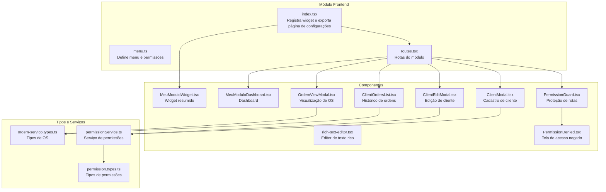
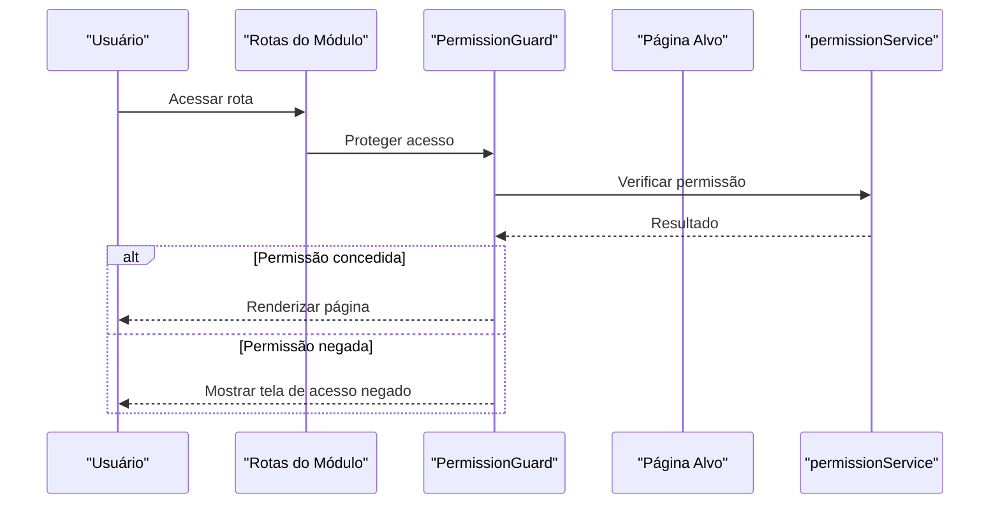
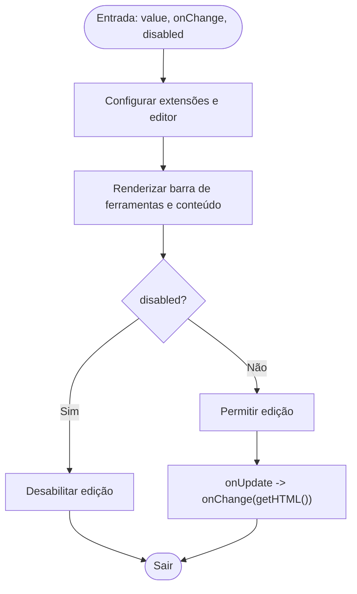
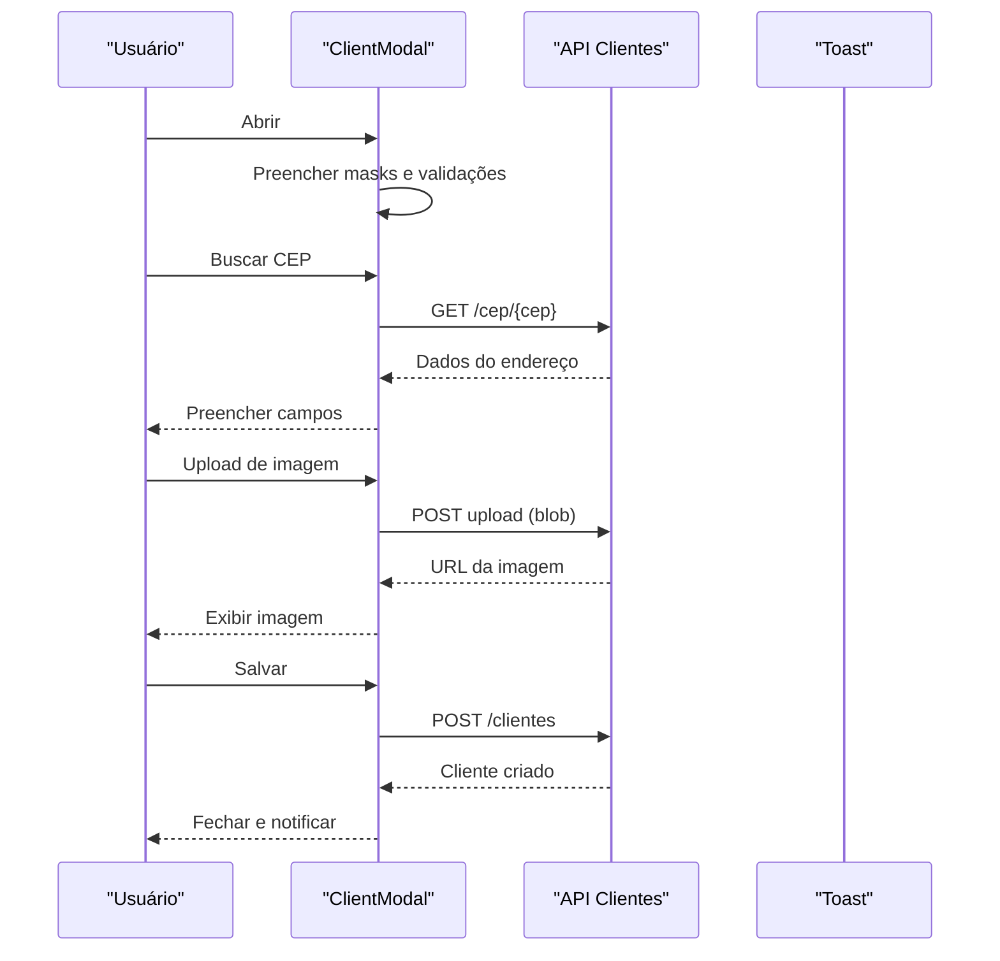
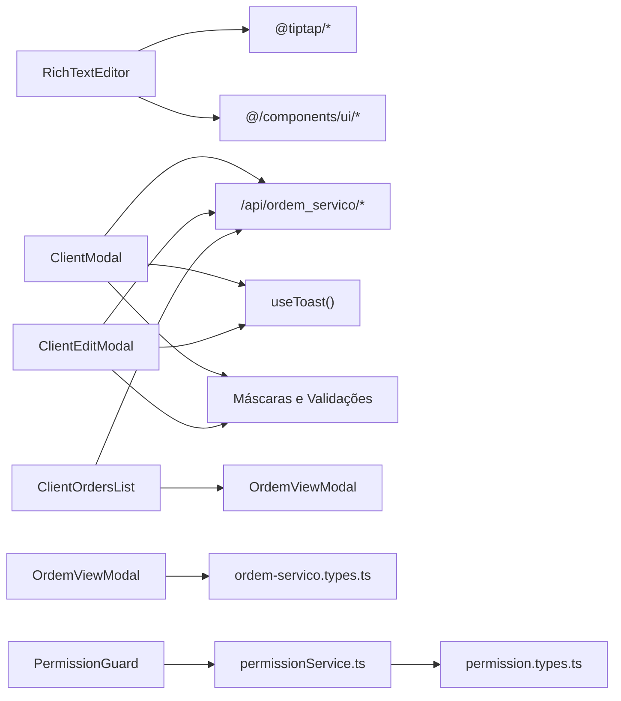

# Componentes e Interfaces do Frontend

<cite>
**Arquivos referenciados neste documento**
- [index.tsx](file://frontend/index.tsx)
- [menu.ts](file://frontend/menu.ts)
- [routes.tsx](file://frontend/routes.tsx)
- [rich-text-editor.tsx](file://frontend/components/ui/rich-text-editor.tsx)
- [MeuModuloDashboard.tsx](file://frontend/components/MeuModuloDashboard.tsx)
- [MeuModuloWidget.tsx](file://frontend/components/MeuModuloWidget.tsx)
- [ClientModal.tsx](file://frontend/components/ClientModal.tsx)
- [ClientEditModal.tsx](file://frontend/components/ClientEditModal.tsx)
- [ClientOrdersList.tsx](file://frontend/components/ClientOrdersList.tsx)
- [OrdemViewModal.tsx](file://frontend/components/OrdemViewModal.tsx)
- [PermissionGuard.tsx](file://frontend/components/PermissionGuard.tsx)
- [PermissionDenied.tsx](file://frontend/components/PermissionDenied.tsx)
- [permissionService.ts](file://frontend/services/permissionService.ts)
- [permission.types.ts](file://frontend/types/permission.types.ts)
- [ordem-servico.types.ts](file://frontend/types/ordem-servico.types.ts)
</cite>

## Sumário
1. [Introdução](#introdução)
2. [Estrutura do Projeto](#estrutura-do-projeto)
3. [Componentes Principais](#componentes-principais)
4. [Visão Geral da Arquitetura](#visão-geral-da-arquitetura)
5. [Análise Detalhada dos Componentes](#análise-detalhada-dos-componentes)
6. [Análise de Dependências](#análise-de-dependências)
7. [Considerações de Desempenho](#considerações-de-desempenho)
8. [Guia de Solução de Problemas](#guia-de-solução-de-problemas)
9. [Conclusão](#conclusão)
10. [Apêndices](#apêndices)

## Introdução
Este documento apresenta uma documentação abrangente dos componentes e interfaces do frontend do módulo de Ordens de Serviço. Ele descreve aparência visual, comportamento, padrões de interação, props/atributos, eventos, slots e opções de personalização. Também inclui orientações para design responsivo, conformidade com acessibilidade, estados do componente, animações, transições, customizações de estilo, suporte a temas, compatibilidade entre navegadores e otimização de desempenho. Além disso, aborda padrões de composição de componentes e integração com outros elementos da interface.

## Estrutura do Projeto
O frontend é composto por:
- Módulo principal que registra widgets e exporta páginas de configuração
- Menu de navegação com grupos e permissões
- Rotas para as páginas do módulo
- Componentes reutilizáveis e páginas específicas
- Tipagens para permissões e dados de ordens de serviço
- Serviços para integração com APIs de permissões

**Diagrama fonte**
- [index.tsx](file://frontend/index.tsx#L1-L22)
- [menu.ts](file://frontend/menu.ts#L1-L50)
- [routes.tsx](file://frontend/routes.tsx#L1-L20)
- [rich-text-editor.tsx](file://frontend/components/ui/rich-text-editor.tsx#L1-L226)
- [MeuModuloWidget.tsx](file://frontend/components/MeuModuloWidget.tsx#L1-L21)
- [MeuModuloDashboard.tsx](file://frontend/components/MeuModuloDashboard.tsx#L1-L27)
- [ClientModal.tsx](file://frontend/components/ClientModal.tsx#L1-L673)
- [ClientEditModal.tsx](file://frontend/components/ClientEditModal.tsx#L1-L711)
- [ClientOrdersList.tsx](file://frontend/components/ClientOrdersList.tsx#L1-L156)
- [OrdemViewModal.tsx](file://frontend/components/OrdemViewModal.tsx#L1-L367)
- [PermissionGuard.tsx](file://frontend/components/PermissionGuard.tsx#L1-L50)
- [PermissionDenied.tsx](file://frontend/components/PermissionDenied.tsx#L1-L140)
- [permissionService.ts](file://frontend/services/permissionService.ts#L1-L135)
- [ordem-servico.types.ts](file://frontend/types/ordem-servico.types.ts#L1-L235)
- [permission.types.ts](file://frontend/types/permission.types.ts#L1-L55)

**Seção fonte**
- [index.tsx](file://frontend/index.tsx#L1-L22)
- [menu.ts](file://frontend/menu.ts#L1-L50)
- [routes.tsx](file://frontend/routes.tsx#L1-L20)

## Componentes Principais
- Widget de resumo: exibe status do módulo em um card com ícone e destaque visual.
- Editor de texto rico: barra de ferramentas com formatação, cores, alinhamento e inserção de links.
- Diálogos de cliente: cadastro e edição com máscaras, validações, busca de CEP, upload de imagem e endereços.
- Histórico de ordens: lista paginada de ordens de serviço de um cliente com visualização em modal.
- Visualização de ordem: modal com dados completos, status, prioridade, itens, observações e opções de impressão.
- Proteção de permissões: guardião de rotas e tela de acesso negado com botões de navegação.

**Seção fonte**
- [MeuModuloWidget.tsx](file://frontend/components/MeuModuloWidget.tsx#L1-L21)
- [rich-text-editor.tsx](file://frontend/components/ui/rich-text-editor.tsx#L21-L226)
- [ClientModal.tsx](file://frontend/components/ClientModal.tsx#L14-L673)
- [ClientEditModal.tsx](file://frontend/components/ClientEditModal.tsx#L32-L711)
- [ClientOrdersList.tsx](file://frontend/components/ClientOrdersList.tsx#L13-L156)
- [OrdemViewModal.tsx](file://frontend/components/OrdemViewModal.tsx#L35-L367)
- [PermissionGuard.tsx](file://frontend/components/PermissionGuard.tsx#L5-L50)
- [PermissionDenied.tsx](file://frontend/components/PermissionDenied.tsx#L54-L140)

## Visão Geral da Arquitetura
O frontend é modular e reutiliza componentes UI compartilhados. O fluxo típico de navegação segue as rotas definidas, com proteção de permissões e chamadas a serviços para dados de clientes e ordens. O módulo registra um widget resumido que pode ser adicionado ao painel.

**Diagrama fonte**
- [routes.tsx](file://frontend/routes.tsx#L1-L20)
- [PermissionGuard.tsx](file://frontend/components/PermissionGuard.tsx#L12-L50)
- [permissionService.ts](file://frontend/services/permissionService.ts#L107-L115)

**Seção fonte**
- [routes.tsx](file://frontend/routes.tsx#L1-L20)
- [PermissionGuard.tsx](file://frontend/components/PermissionGuard.tsx#L1-L50)
- [permissionService.ts](file://frontend/services/permissionService.ts#L1-L135)

## Análise Detalhada dos Componentes

### Widget de Resumo
- Propósito: Apresentar status resumido do módulo em um card com destaque visual.
- Aparência: Card com borda azul, título, ícone e valor em destaque.
- Personalização: Estilo de borda, cor e tipografia podem ser alterados via classes existentes.
- Estados: Sem estados dinâmicos além do conteúdo fixo.

**Seção fonte**
- [MeuModuloWidget.tsx](file://frontend/components/MeuModuloWidget.tsx#L5-L20)

### Editor de Texto Rico
- Propósito: Editor com formatação de texto, cores, alinhamento, listas e inserção de links.
- Props:
  - value: string (HTML inicial)
  - onChange: (value: string) => void (notifica alterações)
  - disabled?: boolean (desativa edição)
- Funcionalidades:
  - Botões de negrito, itálico, sublinhado, tachado.
  - Escolha de cor de texto com paleta fixa.
  - Alinhamento à esquerda, centro e direita.
  - Listas com marcadores e numeração.
  - Linha horizontal e inserção de links com prompt.
- Acessibilidade: Rótulos aria-label para botões de ferramentas.
- Estilos: Classes de borda, fundo e scroll customizados.

**Diagrama fonte**
- [rich-text-editor.tsx](file://frontend/components/ui/rich-text-editor.tsx#L28-L70)

**Seção fonte**
- [rich-text-editor.tsx](file://frontend/components/ui/rich-text-editor.tsx#L21-L226)

### Diálogo de Cadastro de Cliente
- Propósito: Criar novo cliente com validações, máscaras e busca de CEP.
- Props:
  - isOpen: boolean
  - onClose: () => void
  - onClientCreated?: (client: any) => void
- Estados:
  - Formulário controlado com masks para telefone, CPF/CNPJ e CEP.
  - Validações para telefone e documento.
  - Upload de imagem com compressão e envio multipart.
  - Busca automática de CEP com feedback via toast.
- Acessibilidade: Labels associados, estados de erro visíveis, teclas Tab/Enter para busca.
- Estilos: Layout responsivo, cores de erro, transições e sombras.

**Diagrama fonte**
- [ClientModal.tsx](file://frontend/components/ClientModal.tsx#L14-L673)
- [permissionService.ts](file://frontend/services/permissionService.ts#L1-L135)

**Seção fonte**
- [ClientModal.tsx](file://frontend/components/ClientModal.tsx#L14-L673)

### Diálogo de Edição de Cliente
- Propósito: Editar dados de cliente com validações semelhantes e busca de CEP.
- Props:
  - isOpen: boolean
  - onClose: () => void
  - client: Cliente | null
  - onClientUpdated?: (client: Cliente) => void
- Recursos:
  - Carregamento automático de dados do cliente.
  - Máscaras e validações idênticas ao cadastro.
  - Upload e remoção de imagem.
  - Busca de CEP com tratamento de erros.
- Fluxo:
  - Validações antes de salvar.
  - PUT /clientes/{id} e callback onClientUpdated.

**Seção fonte**
- [ClientEditModal.tsx](file://frontend/components/ClientEditModal.tsx#L32-L711)

### Histórico de Ordens de um Cliente
- Propósito: Listar ordens anteriores de um cliente com visualização rápida.
- Props:
  - clientId: string
  - clientName: string
- Recursos:
  - Validação de UUID.
  - Requisição GET com tratamento de erros.
  - Modal de visualização com detalhes.
- Acessibilidade: Ícone de olho para visualizar, estados de carregamento e erro.

**Seção fonte**
- [ClientOrdersList.tsx](file://frontend/components/ClientOrdersList.tsx#L13-L156)

### Visualização de Ordem de Serviço
- Propósito: Exibir detalhes completos de uma OS com status, prioridade, itens e observações.
- Props:
  - isOpen: boolean
  - onClose: () => void
  - ordem: OrdemServico | null
  - onPrintA4?: (ordem: OrdemServico) => void
  - onPrintThermal?: (ordem: OrdemServico) => void
- Recursos:
  - Badges de status e prioridade com cores mapeadas.
  - Tabelas de itens formatadas com valores monetários.
  - Campos condicionais para formatação.
  - Opções de impressão A4 e termal.

**Seção fonte**
- [OrdemViewModal.tsx](file://frontend/components/OrdemViewModal.tsx#L35-L367)

### Proteção de Permissões
- Propósito: Proteger rotas com base em recursos e ações.
- Props:
  - resource: string
  - action: string
  - children: React.ReactNode
  - fallback?: React.ReactNode
- Recursos:
  - Verificação assíncrona de permissão.
  - Loading com spinner.
  - Tela de acesso negado personalizável.

**Seção fonte**
- [PermissionGuard.tsx](file://frontend/components/PermissionGuard.tsx#L5-L50)
- [PermissionDenied.tsx](file://frontend/components/PermissionDenied.tsx#L54-L140)

## Análise de Dependências
- Componentes dependem de bibliotecas externas (ex: @tiptap/*, lucide-react) e componentes UI locais.
- Serviços de permissão fazem requisições HTTP para endpoints do módulo.
- Tipagens compartilhadas entre componentes e serviços garantem coerência de dados.

**Diagrama fonte**
- [rich-text-editor.tsx](file://frontend/components/ui/rich-text-editor.tsx#L1-L20)
- [ClientModal.tsx](file://frontend/components/ClientModal.tsx#L1-L12)
- [ClientEditModal.tsx](file://frontend/components/ClientEditModal.tsx#L1-L12)
- [ClientOrdersList.tsx](file://frontend/components/ClientOrdersList.tsx#L1-L11)
- [OrdemViewModal.tsx](file://frontend/components/OrdemViewModal.tsx#L1-L33)
- [PermissionGuard.tsx](file://frontend/components/PermissionGuard.tsx#L1-L3)
- [permissionService.ts](file://frontend/services/permissionService.ts#L1-L48)
- [ordem-servico.types.ts](file://frontend/types/ordem-servico.types.ts#L1-L48)
- [permission.types.ts](file://frontend/types/permission.types.ts#L1-L55)

**Seção fonte**
- [permissionService.ts](file://frontend/services/permissionService.ts#L1-L135)
- [ordem-servico.types.ts](file://frontend/types/ordem-servico.types.ts#L1-L235)
- [permission.types.ts](file://frontend/types/permission.types.ts#L1-L55)

## Considerações de Desempenho
- Lazy loading de editor: o editor é carregado apenas quando necessário, evitando overhead em telas que não usam.
- Efeitos condicionais: a edição é ativada/desativada com base no estado disabled, evitando re-renderizações desnecessárias.
- Máscaras e validações: feitas com funções puras e efeitos para evitar cálculos repetidos.
- Upload de imagens: compressão no client-side reduz tamanho e tempo de upload.
- Paginação implícita: a API retorna dados paginados, e o componente aceita arrays, evitando sobrecarga de memória.

[Sem fonte específica, pois esta seção fornece orientações gerais]

## Guia de Solução de Problemas
- Erros de CEP:
  - Verifique o tamanho do CEP (8 dígitos).
  - Confirme status HTTP da requisição (404/400) e trate mensagens amigáveis.
- Validações de CPF/CNPJ:
  - Certifique-se de limpar caracteres não numéricos antes de validar.
  - Para CPF, verifique dígitos verificadores.
  - Para CNPJ, utilize pesos específicos.
- Upload de imagem:
  - Garanta que o blob seja gerado com qualidade adequada.
  - Confirme headers multipart e tratamento de erro.
- Permissões:
  - Em caso de falha, o guardião exibe tela de acesso negado com opções de voltar ou ir para início.

**Seção fonte**
- [ClientModal.tsx](file://frontend/components/ClientModal.tsx#L125-L180)
- [ClientEditModal.tsx](file://frontend/components/ClientEditModal.tsx#L159-L214)
- [ClientModal.tsx](file://frontend/components/ClientModal.tsx#L182-L242)
- [ClientEditModal.tsx](file://frontend/components/ClientEditModal.tsx#L216-L277)
- [PermissionDenied.tsx](file://frontend/components/PermissionDenied.tsx#L65-L71)

## Conclusão
O frontend do módulo de Ordens de Serviço oferece uma base sólida de componentes reutilizáveis, com foco em usabilidade, validações robustas, busca de CEP, upload de imagens e proteção de permissões. A arquitetura modular facilita manutenção e expansão, enquanto as tipagens garantem coerência de dados. As recomendações de design responsivo, acessibilidade e desempenho foram integradas ao longo dos componentes.

[Sem fonte específica, pois esta seção resume sem análise de arquivos]

## Apêndices

### Padrões de Composição de Componentes
- Componentes funcionais com props tipadas.
- Uso de hooks para estado e efeitos.
- Separação de lógica de validação e máscaras.
- Integração com serviços de permissões e APIs.

**Seção fonte**
- [ClientModal.tsx](file://frontend/components/ClientModal.tsx#L1-L673)
- [ClientEditModal.tsx](file://frontend/components/ClientEditModal.tsx#L1-L711)
- [PermissionGuard.tsx](file://frontend/components/PermissionGuard.tsx#L1-L50)

### Integração com Outros Elementos da Interface
- Widgets: Registrados no módulo e exibidos como cards.
- Menu: Definição de grupos, ícones, ordenação e permissões.
- Rotas: Mapeamento de caminhos para páginas e modais.

**Seção fonte**
- [index.tsx](file://frontend/index.tsx#L6-L21)
- [menu.ts](file://frontend/menu.ts#L1-L50)
- [routes.tsx](file://frontend/routes.tsx#L1-L20)

### Exemplos de Uso (caminhos)
- Widget resumido: [MeuModuloWidget.tsx](file://frontend/components/MeuModuloWidget.tsx#L5-L20)
- Editor de texto rico: [rich-text-editor.tsx](file://frontend/components/ui/rich-text-editor.tsx#L28-L70)
- Diálogo de cadastro: [ClientModal.tsx](file://frontend/components/ClientModal.tsx#L373-L372)
- Diálogo de edição: [ClientEditModal.tsx](file://frontend/components/ClientEditModal.tsx#L411-L410)
- Histórico de ordens: [ClientOrdersList.tsx](file://frontend/components/ClientOrdersList.tsx#L87-L155)
- Visualização de OS: [OrdemViewModal.tsx](file://frontend/components/OrdemViewModal.tsx#L79-L366)
- Proteção de permissões: [PermissionGuard.tsx](file://frontend/components/PermissionGuard.tsx#L12-L49)