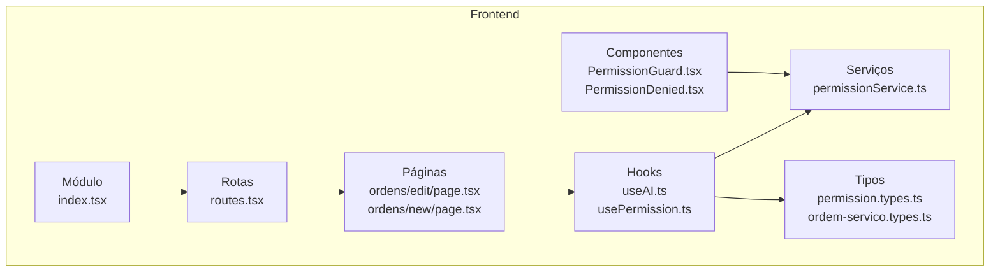
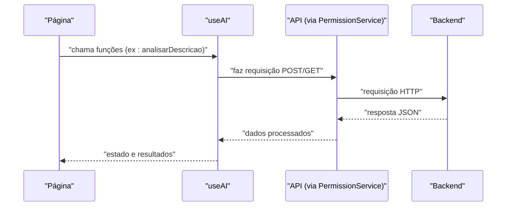
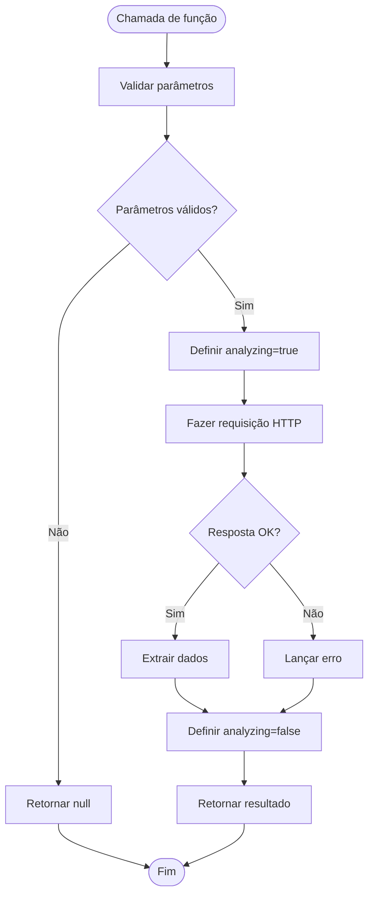
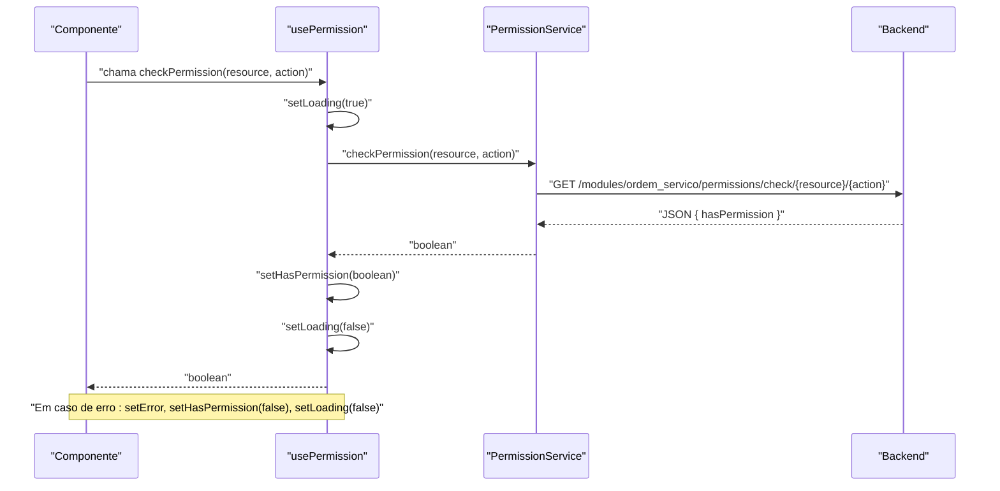

# Hooks Personalizados

<cite>
**Arquivos referenciados neste documento**
- [frontend/hooks/useAI.ts](file://frontend/hooks/useAI.ts)
- [frontend/hooks/usePermission.ts](file://frontend/hooks/usePermission.ts)
- [frontend/services/permissionService.ts](file://frontend/services/permissionService.ts)
- [frontend/types/permission.types.ts](file://frontend/types/permission.types.ts)
- [frontend/types/ordem-servico.types.ts](file://frontend/types/ordem-servico.types.ts)
- [frontend/pages/ordens/edit/page.tsx](file://frontend/pages/ordens/edit/page.tsx)
- [frontend/pages/ordens/new/page.tsx](file://frontend/pages/ordens/new/page.tsx)
- [frontend/components/PermissionGuard.tsx](file://frontend/components/PermissionGuard.tsx)
- [frontend/components/PermissionDenied.tsx](file://frontend/components/PermissionDenied.tsx)
- [frontend/routes.tsx](file://frontend/routes.tsx)
- [frontend/index.tsx](file://frontend/index.tsx)
</cite>

## Sumário
1. [Introdução](#introdução)
2. [Estrutura do Projeto](#estrutura-do-projeto)
3. [Componentes Principais](#componentes-principais)
4. [Visão Geral da Arquitetura](#visão-geral-da-arquitetura)
5. [Análise Detalhada dos Hooks](#análise-detalhada-dos-hooks)
6. [Relacionamento com Outros Componentes](#relacionamento-com-outros-componentes)
7. [Considerações de Desempenho](#considerações-de-desempenho)
8. [Guia de Solução de Problemas](#guia-de-solução-de-problemas)
9. [Conclusão](#conclusão)

## Introdução
Este documento apresenta uma documentação abrangente sobre os hooks personalizados do frontend do módulo de Ordens de Serviço. Ele explica a implementação, relacionamento de invocação, interfaces, parâmetros de entrada, valores de retorno, estados gerenciados, opções de configuração e integrações com outros componentes. O objetivo é tornar o conteúdo acessível para iniciantes, mas com profundidade técnica suficiente para desenvolvedores experientes.

## Estrutura do Projeto
O frontend está organizado em camadas bem definidas:
- **hooks/**: Contém os hooks personalizados que encapsulam lógica reutilizável e estado.
- **services/**: Fornece serviços para comunicação com APIs backend.
- **types/**: Define os tipos TypeScript usados pela aplicação.
- **pages/**: Componentes de página que utilizam os hooks.
- **components/**: Componentes reutilizáveis, incluindo proteção de permissões.
- **routes.tsx e index.tsx**: Configuração de rotas e exportação do módulo.

**Fontes do diagrama**
- [frontend/hooks/useAI.ts](file://frontend/hooks/useAI.ts#L1-L41)
- [frontend/hooks/usePermission.ts](file://frontend/hooks/usePermission.ts#L1-L142)
- [frontend/services/permissionService.ts](file://frontend/services/permissionService.ts#L1-L135)
- [frontend/types/permission.types.ts](file://frontend/types/permission.types.ts#L1-L55)
- [frontend/types/ordem-servico.types.ts](file://frontend/types/ordem-servico.types.ts#L1-L235)
- [frontend/pages/ordens/edit/page.tsx](file://frontend/pages/ordens/edit/page.tsx#L150-L184)
- [frontend/pages/ordens/new/page.tsx](file://frontend/pages/ordens/new/page.tsx#L70-L108)
- [frontend/components/PermissionGuard.tsx](file://frontend/components/PermissionGuard.tsx#L1-L50)
- [frontend/components/PermissionDenied.tsx](file://frontend/components/PermissionDenied.tsx#L1-L140)
- [frontend/routes.tsx](file://frontend/routes.tsx#L1-L20)
- [frontend/index.tsx](file://frontend/index.tsx#L1-L22)

**Seções fonte**
- [frontend/hooks/useAI.ts](file://frontend/hooks/useAI.ts#L1-L41)
- [frontend/hooks/usePermission.ts](file://frontend/hooks/usePermission.ts#L1-L142)
- [frontend/services/permissionService.ts](file://frontend/services/permissionService.ts#L1-L135)
- [frontend/types/permission.types.ts](file://frontend/types/permission.types.ts#L1-L55)
- [frontend/types/ordem-servico.types.ts](file://frontend/types/ordem-servico.types.ts#L1-L235)
- [frontend/pages/ordens/edit/page.tsx](file://frontend/pages/ordens/edit/page.tsx#L150-L184)
- [frontend/pages/ordens/new/page.tsx](file://frontend/pages/ordens/new/page.tsx#L70-L108)
- [frontend/components/PermissionGuard.tsx](file://frontend/components/PermissionGuard.tsx#L1-L50)
- [frontend/components/PermissionDenied.tsx](file://frontend/components/PermissionDenied.tsx#L1-L140)
- [frontend/routes.tsx](file://frontend/routes.tsx#L1-L20)
- [frontend/index.tsx](file://frontend/index.tsx#L1-L22)

## Componentes Principais
- **useAI**: Hook para integração com funcionalidades de IA relacionadas à análise de descrições e geração de laudos técnicos.
- **usePermission**: Hook para verificação de permissões de recursos e ações, com suporte a múltiplas permissões e buscas específicas.
- **PermissionService**: Classe de serviço que encapsula chamadas HTTP para o backend relacionadas a permissões.
- **Tipos de Permissão**: Interfaces e enums que descrevem estruturas de dados de permissões, usuários e auditoria.
- **Tipos de Ordem de Serviço**: Interfaces e utilitários para o domínio de ordens de serviço.

**Seções fonte**
- [frontend/hooks/useAI.ts](file://frontend/hooks/useAI.ts#L1-L41)
- [frontend/hooks/usePermission.ts](file://frontend/hooks/usePermission.ts#L1-L142)
- [frontend/services/permissionService.ts](file://frontend/services/permissionService.ts#L50-L135)
- [frontend/types/permission.types.ts](file://frontend/types/permission.types.ts#L1-L55)
- [frontend/types/ordem-servico.types.ts](file://frontend/types/ordem-servico.types.ts#L1-L235)

## Visão Geral da Arquitetura
A arquitetura segue um padrão de separação de responsabilidades:
- Os hooks gerenciam estado e lógica de negócio.
- Os serviços tratam a comunicação com APIs backend.
- Os componentes de página utilizam os hooks para obter dados e comportamentos.
- Componentes de UI auxiliares (ex: PermissionGuard) protegem rotas e conteúdos com base nas permissões.

**Fontes do diagrama**
- [frontend/pages/ordens/edit/page.tsx](file://frontend/pages/ordens/edit/page.tsx#L150-L184)
- [frontend/pages/ordens/new/page.tsx](file://frontend/pages/ordens/new/page.tsx#L70-L108)
- [frontend/hooks/useAI.ts](file://frontend/hooks/useAI.ts#L7-L33)
- [frontend/services/permissionService.ts](file://frontend/services/permissionService.ts#L1-L40)

**Seções fonte**
- [frontend/pages/ordens/edit/page.tsx](file://frontend/pages/ordens/edit/page.tsx#L150-L184)
- [frontend/pages/ordens/new/page.tsx](file://frontend/pages/ordens/new/page.tsx#L70-L108)
- [frontend/hooks/useAI.ts](file://frontend/hooks/useAI.ts#L1-L41)
- [frontend/services/permissionService.ts](file://frontend/services/permissionService.ts#L1-L135)

## Análise Detalhada dos Hooks

### Hook useAI
- Propósito: Prover métodos assíncronos para análise de descrições e geração de laudos técnicos via IA, além de um estado de análise em andamento.
- Estados gerenciados:
  - analyzing: booleano indicando se uma operação de IA está em execução.
- Funções expostas:
  - analisarDescricao(descricao: string): Promise<any|null>
  - gerarLaudo(problema: string, notas: string): Promise<string>
- Parâmetros de entrada:
  - analisarDescricao: string (descrição a ser analisada)
  - gerarLaudo: string (problema), string (notas)
- Valores de retorno:
  - analisarDescricao: dados da resposta ou null se entrada inválida
  - gerarLaudo: string (laudo técnico extraído da resposta)
- Comportamento:
  - Ambas as funções ativam o estado de análise, fazem chamadas assíncronas e garantem que o estado seja desativado no finally.
  - Em caso de erro, o erro é lançado após ser registrado no console.
- Exemplos de uso:
  - Página de edição de ordem de serviço: [frontend/pages/ordens/edit/page.tsx](file://frontend/pages/ordens/edit/page.tsx#L150-L184)
  - Página de nova ordem de serviço: [frontend/pages/ordens/new/page.tsx](file://frontend/pages/ordens/new/page.tsx#L70-L108)

**Fontes do fluxo**
- [frontend/hooks/useAI.ts](file://frontend/hooks/useAI.ts#L7-L33)
- [frontend/pages/ordens/edit/page.tsx](file://frontend/pages/ordens/edit/page.tsx#L160-L184)
- [frontend/pages/ordens/new/page.tsx](file://frontend/pages/ordens/new/page.tsx#L84-L108)

**Seções fonte**
- [frontend/hooks/useAI.ts](file://frontend/hooks/useAI.ts#L1-L41)
- [frontend/pages/ordens/edit/page.tsx](file://frontend/pages/ordens/edit/page.tsx#L150-L184)
- [frontend/pages/ordens/new/page.tsx](file://frontend/pages/ordens/new/page.tsx#L70-L108)

### Hook usePermission
- Propósito: Verificar permissões de um único recurso e ação, com estados de carregamento, erro e resultados.
- Estados gerenciados:
  - hasPermission: boolean | null (permissão verificada ou null se ainda não carregado)
  - loading: boolean (indica se a verificação está em andamento)
  - error: string | null (armazena mensagens de erro)
- Funções expostas:
  - checkPermission(resource: string, action: string): Promise<boolean>
  - refetch(): void (reexecuta a verificação se resource e action estiverem definidos)
- Parâmetros de entrada:
  - checkPermission: string (recurso), string (ação)
- Valores de retorno:
  - checkPermission: boolean (true/false com base na resposta)
- Comportamento:
  - Ao montar, se resource e action forem fornecidos, executa a verificação automaticamente.
  - Em caso de erro, define error e retorna false.
  - O estado loading é gerido internamente durante a requisição.

**Fontes do diagrama**
- [frontend/hooks/usePermission.ts](file://frontend/hooks/usePermission.ts#L17-L35)
- [frontend/services/permissionService.ts](file://frontend/services/permissionService.ts#L107-L115)

**Seções fonte**
- [frontend/hooks/usePermission.ts](file://frontend/hooks/usePermission.ts#L1-L142)
- [frontend/services/permissionService.ts](file://frontend/services/permissionService.ts#L107-L115)

### Hooks Adicionais de Permissão
Além do hook principal, há variantes para múltiplas permissões:
- useMultiplePermissions: Verifica várias permissões de uma só vez, retorna resultados consolidados e funções utilitárias.
- useHasAnyPermission: Retorna se o usuário tem ao menos uma das permissões informadas.
- useHasAllPermissions: Retorna se o usuário tem todas as permissões informadas.

Esses hooks utilizam o mesmo serviço de permissões e compartilham a mesma lógica de tratamento de erros e carregamento.

**Seções fonte**
- [frontend/hooks/usePermission.ts](file://frontend/hooks/usePermission.ts#L58-L142)
- [frontend/services/permissionService.ts](file://frontend/services/permissionService.ts#L107-L115)

## Relacionamento com Outros Componentes

### Uso nos Componentes de Página
- Páginas de ordens (edição e nova) utilizam o hook useAI para integrar funcionalidades de IA:
  - [frontend/pages/ordens/edit/page.tsx](file://frontend/pages/ordens/edit/page.tsx#L150-L184)
  - [frontend/pages/ordens/new/page.tsx](file://frontend/pages/ordens/new/page.tsx#L70-L108)

### Proteção de Permissões
- PermissionGuard: Componente que protege rotas e conteúdo com base em permissões:
  - [frontend/components/PermissionGuard.tsx](file://frontend/components/PermissionGuard.tsx#L1-L50)
- PermissionDenied: Componente de UI exibido quando permissão é negada:
  - [frontend/components/PermissionDenied.tsx](file://frontend/components/PermissionDenied.tsx#L1-L140)

### Tipos e Tipagem
- Tipos de permissões e auditoria:
  - [frontend/types/permission.types.ts](file://frontend/types/permission.types.ts#L1-L55)
- Tipos de ordem de serviço:
  - [frontend/types/ordem-servico.types.ts](file://frontend/types/ordem-servico.types.ts#L1-L235)

### Rotas e Exportação do Módulo
- Definição de rotas do módulo:
  - [frontend/routes.tsx](file://frontend/routes.tsx#L1-L20)
- Exportação do módulo frontend:
  - [frontend/index.tsx](file://frontend/index.tsx#L1-L22)

**Seções fonte**
- [frontend/pages/ordens/edit/page.tsx](file://frontend/pages/ordens/edit/page.tsx#L150-L184)
- [frontend/pages/ordens/new/page.tsx](file://frontend/pages/ordens/new/page.tsx#L70-L108)
- [frontend/components/PermissionGuard.tsx](file://frontend/components/PermissionGuard.tsx#L1-L50)
- [frontend/components/PermissionDenied.tsx](file://frontend/components/PermissionDenied.tsx#L1-L140)
- [frontend/types/permission.types.ts](file://frontend/types/permission.types.ts#L1-L55)
- [frontend/types/ordem-servico.types.ts](file://frontend/types/ordem-servico.types.ts#L1-L235)
- [frontend/routes.tsx](file://frontend/routes.tsx#L1-L20)
- [frontend/index.tsx](file://frontend/index.tsx#L1-L22)

## Considerações de Desempenho
- O hook useAI:
  - Realiza requisições assíncronas; evite múltiplas chamadas simultâneas desnecessárias.
  - O estado analyzing pode ser usado para desabilitar botões e evitar reentrância.
- O hook usePermission:
  - As verificações são feitas via requisições HTTP; cache de resultados deve ser considerado no componente consumidor.
  - useMultiplePermissions realiza Promise.all para verificar múltiplas permissões em paralelo, otimizando tempo de resposta.

[Sem seções fonte, pois esta seção fornece orientações gerais]

## Guia de Solução de Problemas

### Erros de Permissão
- Causas comuns:
  - Falha na requisição HTTP (network errors, status != 2xx).
  - Resposta inesperada do backend (formato inválido).
- Soluções:
  - Verifique a conexão com o backend e os endpoints de permissão.
  - Confirme que os parâmetros resource e action estão corretos.
  - Utilize o campo error retornado pelo hook para depuração.

**Seções fonte**
- [frontend/hooks/usePermission.ts](file://frontend/hooks/usePermission.ts#L26-L32)
- [frontend/services/permissionService.ts](file://frontend/services/permissionService.ts#L12-L20)

### Erros de IA
- Causas comuns:
  - Requisição sem parâmetros válidos.
  - Falha na comunicação com o backend de IA.
- Soluções:
  - Garanta que os campos obrigatórios estejam preenchidos antes de chamar as funções.
  - Trate os erros capturados e mostre mensagens amigáveis ao usuário.

**Seções fonte**
- [frontend/hooks/useAI.ts](file://frontend/hooks/useAI.ts#L7-L33)
- [frontend/pages/ordens/edit/page.tsx](file://frontend/pages/ordens/edit/page.tsx#L160-L184)
- [frontend/pages/ordens/new/page.tsx](file://frontend/pages/ordens/new/page.tsx#L84-L108)

### Componentes de Permissão
- PermissionGuard:
  - Exibe um estado de carregamento enquanto verifica permissões.
  - Caso negado, renderiza PermissionDenied com opções de navegação.
- PermissionDenied:
  - Fornece mensagens claras e botões para voltar ou ir para a página inicial.

**Seções fonte**
- [frontend/components/PermissionGuard.tsx](file://frontend/components/PermissionGuard.tsx#L37-L49)
- [frontend/components/PermissionDenied.tsx](file://frontend/components/PermissionDenied.tsx#L54-L140)

## Conclusão
Os hooks personalizados do frontend oferecem uma abordagem modular e reutilizável para lidar com funcionalidades críticas como análise com IA e controle de permissões. Eles encapsulam estados, tratamento de erros e interações assíncronas, facilitando a manutenção e a escalabilidade. A integração com serviços e componentes de UI permite uma experiência consistente e segura ao longo do sistema.

[Sem seções fonte, pois esta seção resume sem análise específica de arquivos]