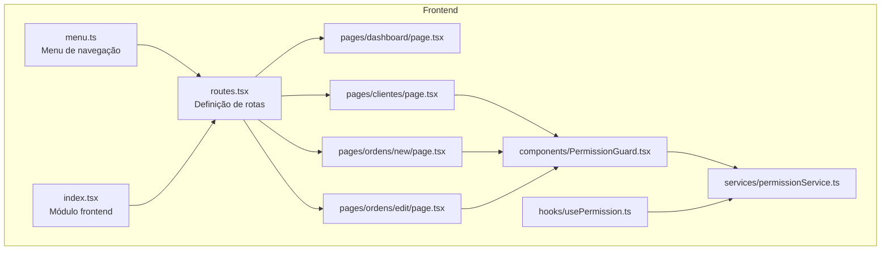
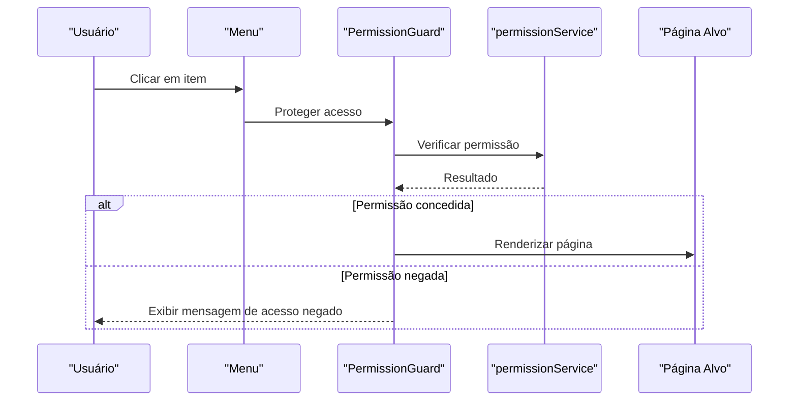
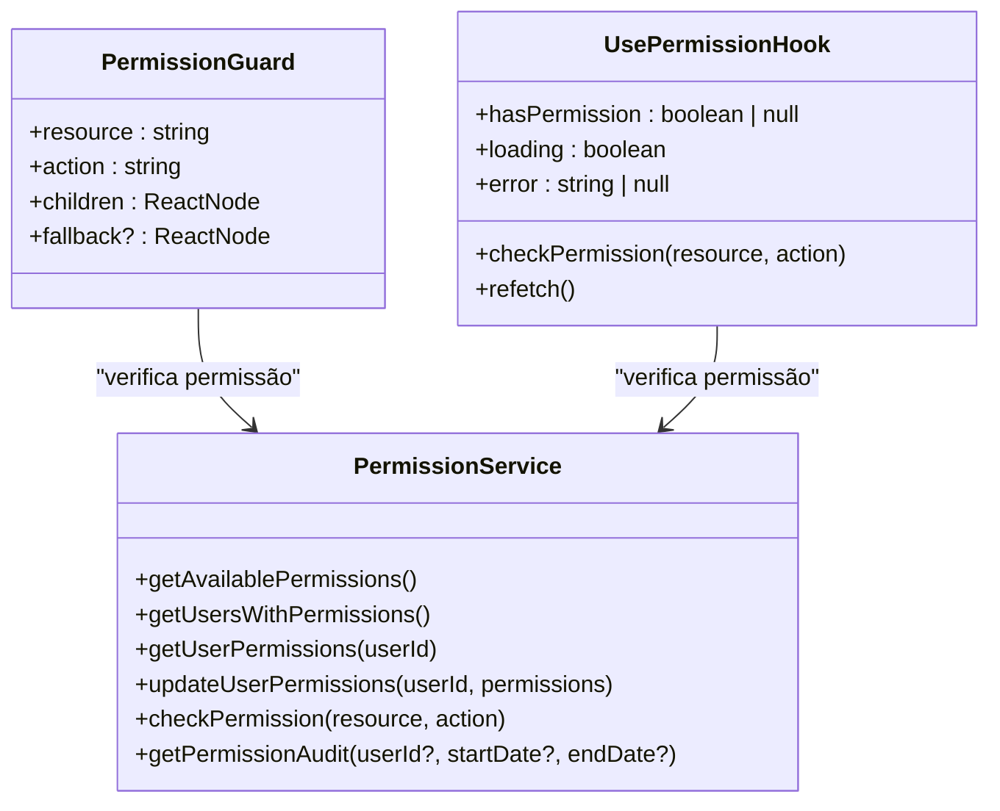
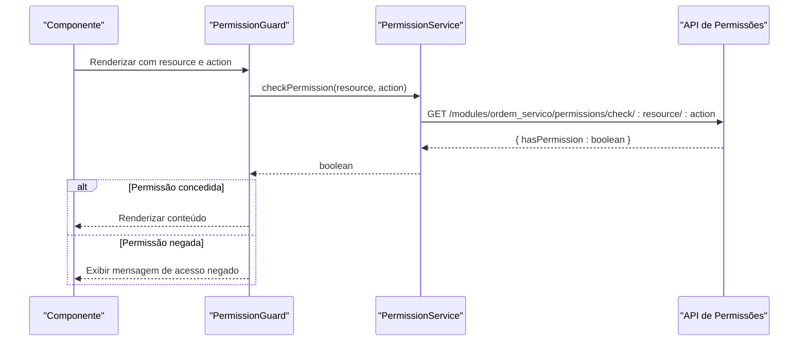

# Rotas e Navegação

<cite>
**Arquivos referenciados neste documento**
- [routes.tsx](file://frontend/routes.tsx)
- [index.tsx](file://frontend/index.tsx)
- [menu.ts](file://frontend/menu.ts)
- [page.tsx (Dashboard)](file://frontend/pages/dashboard/page.tsx)
- [page.tsx (Clientes)](file://frontend/pages/clientes/page.tsx)
- [page.tsx (Ordens - Nova)](file://frontend/pages/ordens/new/page.tsx)
- [page.tsx (Ordens - Edição)](file://frontend/pages/ordens/edit/page.tsx)
- [PermissionGuard.tsx](file://frontend/components/PermissionGuard.tsx)
- [permissionService.ts](file://frontend/services/permissionService.ts)
- [usePermission.ts](file://frontend/hooks/usePermission.ts)
- [permission.types.ts](file://frontend/types/permission.types.ts)
</cite>

## Sumário
1. [Introdução](#introdução)
2. [Estrutura do Projeto](#estrutura-do-projeto)
3. [Componentes-Chave de Rotas e Navegação](#componentes-chave-de-rotas-e-navegação)
4. [Visão Geral da Arquitetura](#visão-geral-da-arquitetura)
5. [Análise Detalhada dos Componentes](#análise-detalhada-dos-componentes)
6. [Relacionamento com Permissões e Proteção de Rotas](#relacionamento-com-permissões-e-proteção-de-rotas)
7. [Considerações de Desempenho](#considerações-de-desempenho)
8. [Guia de Solução de Problemas](#guia-de-solução-de-problemas)
9. [Conclusão](#conclusão)

## Introdução
Este documento apresenta o sistema de rotas e navegação do frontend do módulo de Ordens de Serviço. Ele explica como as rotas são definidas, como ocorre a navegação entre páginas, como o estado de navegação é gerido e como o sistema integra permissões para proteger recursos. O conteúdo foi elaborado para ser acessível a iniciantes e oferecer profundidade técnica para desenvolvedores experientes.

## Estrutura do Projeto
O frontend organiza as páginas por funcionalidades e as exporta como módulos React. As rotas são declarativas e centralizadas, e o menu define a navegação principal. A navegação interna entre páginas é feita via navegação programática e links estáticos.

**Diagrama fonte**
- [routes.tsx](file://frontend/routes.tsx#L1-L20)
- [menu.ts](file://frontend/menu.ts#L1-L50)
- [index.tsx](file://frontend/index.tsx#L1-L22)
- [page.tsx (Dashboard)](file://frontend/pages/dashboard/page.tsx#L1-L437)
- [page.tsx (Clientes)](file://frontend/pages/clientes/page.tsx#L1-L341)
- [page.tsx (Ordens - Nova)](file://frontend/pages/ordens/new/page.tsx#L1-L1323)
- [page.tsx (Ordens - Edição)](file://frontend/pages/ordens/edit/page.tsx#L1-L1705)
- [PermissionGuard.tsx](file://frontend/components/PermissionGuard.tsx#L1-L50)
- [permissionService.ts](file://frontend/services/permissionService.ts#L1-L135)
- [usePermission.ts](file://frontend/hooks/usePermission.ts#L1-L142)

**Seção fonte**
- [routes.tsx](file://frontend/routes.tsx#L1-L20)
- [menu.ts](file://frontend/menu.ts#L1-L50)
- [index.tsx](file://frontend/index.tsx#L1-L22)

## Componentes-Chave de Rotas e Navegação
- Definição de rotas: O módulo define um array de rotas com caminho e componente associado. O prefixo raiz é usado para agrupar as rotas sob um namespace comum.
- Navegação programática: Páginas utilizam a navegação programática para redirecionar o usuário após ações específicas.
- Menu de navegação: O menu define os links visíveis e os papéis autorizados a acessá-los.

**Seção fonte**
- [routes.tsx](file://frontend/routes.tsx#L9-L19)
- [menu.ts](file://frontend/menu.ts#L1-L50)

## Visão Geral da Arquitetura
O fluxo típico de navegação segue estas etapas:
- O usuário clica em um item do menu.
- O sistema verifica permissões (se aplicável).
- A navegação é executada para a página correspondente.
- A página carrega dados e apresenta a interface.

**Diagrama fonte**
- [PermissionGuard.tsx](file://frontend/components/PermissionGuard.tsx#L12-L50)
- [permissionService.ts](file://frontend/services/permissionService.ts#L107-L115)

## Análise Detalhada dos Componentes

### Definição de Rotas
As rotas são declaradas em um array com caminho e componente. O prefixo raiz permite agrupar todas as rotas do módulo sob um único namespace.

- Caminho base: "/ordem_servico"
- Rotas definidas:
  - Dashboard
  - Lista
  - Configurações
  - Clientes
  - Produtos
  - Ordens
  - Nova Ordem

**Seção fonte**
- [routes.tsx](file://frontend/routes.tsx#L9-L19)

### Menu de Navegação
O menu define os links principais, ícones, ordem e papéis autorizados. Ele também agrupa subitens, como Ordens de Serviço, Clientes, Produtos e Configurações.

- Itens principais: Agrupamento com ícone e título.
- Subitens: Links para páginas específicas.
- Papéis: Apenas certos papéis podem acessar determinados itens.

**Seção fonte**
- [menu.ts](file://frontend/menu.ts#L1-L50)

### Página Dashboard
A página de dashboard demonstra navegação programática e atalhos de teclado. Ela redireciona o usuário para outras páginas usando navegação completa.

- Redirecionamento: Utiliza navegação completa para ir às páginas de Clientes, Produtos e Ordens.
- Atalhos de teclado: F1, F2 e F3 levam a páginas específicas.

**Seção fonte**
- [page.tsx (Dashboard)](file://frontend/pages/dashboard/page.tsx#L292-L335)

### Página Clientes
A página de clientes permite navegar para a página de Ordens de Serviço e exibe uma lista de clientes com filtros.

- Navegação: Botão para ir às Ordens de Serviço.
- Filtros: Busca textual e filtro por status.
- Ações: Editar, excluir e alternar status.

**Seção fonte**
- [page.tsx (Clientes)](file://frontend/pages/clientes/page.tsx#L91-L144)

### Página Ordens - Nova Ordem
A página de criação de ordem permite navegar de volta à lista de ordens e redireciona após o salvamento.

- Navegação de volta: Histórico do navegador.
- Redirecionamento após salvar: Redireciona para a lista de ordens.

**Seção fonte**
- [page.tsx (Ordens - Nova)](file://frontend/pages/ordens/new/page.tsx#L479-L494)
- [page.tsx (Ordens - Nova)](file://frontend/pages/ordens/new/page.tsx#L464-L464)

### Página Ordens - Edição
A página de edição carrega dados de uma ordem específica e permite navegar de volta à lista.

- Carregamento condicional: Se o ID não for fornecido, redireciona para a lista.
- Navegação de volta: Botão para voltar à lista.

**Seção fonte**
- [page.tsx (Ordens - Edição)](file://frontend/pages/ordens/edit/page.tsx#L245-L261)
- [page.tsx (Ordens - Edição)](file://frontend/pages/ordens/edit/page.tsx#L719-L726)

## Relacionamento com Permissões e Proteção de Rotas
O sistema de permissões permite proteger rotas e componentes com base em recursos e ações. Existem três camadas de proteção:

- PermissionGuard: Componente que protege um bloco de conteúdo com base em permissão.
- Hooks de permissão: usePermission e useMultiplePermissions permitem verificar permissões em componentes.
- Serviço de permissões: permissionService encapsula chamadas à API de permissões.

**Diagrama fonte**
- [PermissionGuard.tsx](file://frontend/components/PermissionGuard.tsx#L12-L50)
- [permissionService.ts](file://frontend/services/permissionService.ts#L52-L135)
- [usePermission.ts](file://frontend/hooks/usePermission.ts#L12-L56)

### Fluxo de Verificação de Permissão
O fluxo de verificação de permissão ocorre quando um componente protegido é renderizado. O serviço faz uma chamada à API e retorna um resultado booleano.

**Diagrama fonte**
- [PermissionGuard.tsx](file://frontend/components/PermissionGuard.tsx#L21-L35)
- [permissionService.ts](file://frontend/services/permissionService.ts#L107-L115)

### Tipos e Modelos de Permissão
Os tipos definem a estrutura de permissões, usuários e auditoria.

- UserPermission: Representa uma permissão individual de um usuário.
- AvailablePermission: Define os recursos e ações disponíveis.
- UserWithPermissions: Usuário com lista de permissões e resumo.
- PermissionAudit: Registro de auditoria de permissões.

**Seção fonte**
- [permission.types.ts](file://frontend/types/permission.types.ts#L1-L55)

## Considerações de Desempenho
- Navegação programática: Redirecionamentos via navegação completa podem causar recarregamento completo da página. Para melhor desempenho, prefira navegação programática com bibliotecas de roteamento que suportem navegação SPA quando disponível.
- Carregamento condicional: Em páginas como a de edição, o carregamento condicional de dados evita requisições desnecessárias até que o ID seja fornecido.
- Hooks de permissão: Os hooks de permissão devem evitar chamadas redundantes e usar cache local quando possível.

## Guia de Solução de Problemas
- Erro ao carregar dados de uma ordem:
  - Verifique se o ID foi passado corretamente.
  - Confirme se a API está retornando dados válidos.
  - Em caso de erro 401, redirecione o usuário para o login.

- Permissão negada:
  - Verifique se o usuário possui a permissão necessária.
  - Confirme se a permissão foi configurada corretamente no backend.

- Navegação inesperada:
  - Revise os redirecionamentos programáticos.
  - Confirme se os caminhos das rotas estão corretos.

**Seção fonte**
- [page.tsx (Ordens - Edição)](file://frontend/pages/ordens/edit/page.tsx#L533-L556)
- [PermissionGuard.tsx](file://frontend/components/PermissionGuard.tsx#L45-L47)

## Conclusão
O sistema de rotas e navegação do frontend é claro e bem estruturado. As rotas são declaradas de forma centralizada, o menu define a navegação principal e as páginas utilizam navegação programática para redirecionamentos. A integração com o sistema de permissões permite proteger recursos de forma eficaz, garantindo que apenas usuários autorizados possam acessar determinadas áreas. Com pequenas otimizações, como evitar recarregamentos completos e reforçar o tratamento de erros, o sistema pode oferecer ainda melhor experiência ao usuário.