# Tipagens TypeScript

<cite>
**Arquivos referenciados neste documento**
- [ordem-servico.types.ts](file://frontend/types/ordem-servico.types.ts)
- [permission.types.ts](file://frontend/types/permission.types.ts)
- [ordem_servico.service.ts](file://frontend/services/ordem_servico.service.ts)
- [permissionService.ts](file://frontend/services/permissionService.ts)
- [usePermission.ts](file://frontend/hooks/usePermission.ts)
- [useAI.ts](file://frontend/hooks/useAI.ts)
- [ClientEditModal.tsx](file://frontend/components/ClientEditModal.tsx)
- [ClientModal.tsx](file://frontend/components/ClientModal.tsx)
</cite>

## Sumário
1. [Introdução](#introdução)
2. [Estrutura do Projeto](#estrutura-do-projeto)
3. [Componentes Principais](#componentes-principais)
4. [Visão Geral da Arquitetura](#visão-geral-da-arquitetura)
5. [Análise Detalhada dos Componentes](#análise-detalhada-dos-componentes)
6. [Análise de Dependências](#análise-de-dependências)
7. [Considerações de Desempenho](#considerações-de-desempenho)
8. [Guia de Solução de Problemas](#guia-de-solução-de-problemas)
9. [Conclusão](#conclusão)

## Introdução
Este documento apresenta uma documentação abrangente das tipagens TypeScript do frontend do módulo de Ordens de Serviço. Ele detalha as definições de entidade, relacionamentos de campo, tipos de dados, regras de validação, restrições de negócio, padrões de acesso a dados, estratégias de cache, ciclo de vida dos dados e políticas de retenção, além de segurança de dados, requisitos de privacidade e controle de acesso.

## Estrutura do Projeto
O frontend organiza as tipagens em dois módulos principais:
- Tipagens de Ordens de Serviço: contém interfaces para entidades, enums e DTOs relacionados às ordens de serviço.
- Tipagens de Permissões: define estruturas para gerenciamento de permissões de usuários.

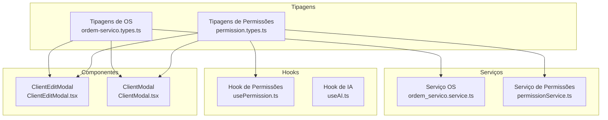

**Diagrama fonte**
- [ordem-servico.types.ts](file://frontend/types/ordem-servico.types.ts#L1-L235)
- [permission.types.ts](file://frontend/types/permission.types.ts#L1-L55)
- [ordem_servico.service.ts](file://frontend/services/ordem_servico.service.ts#L1-L20)
- [permissionService.ts](file://frontend/services/permissionService.ts#L1-L135)
- [usePermission.ts](file://frontend/hooks/usePermission.ts#L1-L142)
- [useAI.ts](file://frontend/hooks/useAI.ts#L1-L41)
- [ClientEditModal.tsx](file://frontend/components/ClientEditModal.tsx#L1-L711)
- [ClientModal.tsx](file://frontend/components/ClientModal.tsx#L1-L673)

**Seção fonte**
- [ordem-servico.types.ts](file://frontend/types/ordem-servico.types.ts#L1-L235)
- [permission.types.ts](file://frontend/types/permission.types.ts#L1-L55)

## Componentes Principais

### Tipagens de Ordens de Serviço
O módulo de ordens de serviço define as seguintes entidades principais:

- **OrdemServico**: Representa uma ordem de serviço completa com campos obrigatórios e opcionais, incluindo informações do cliente, responsável, status e dados técnicos.
- **Cliente**: Dados do cliente associado à ordem de serviço.
- **Usuario**: Informações básicas do usuário responsável.
- **HistoricoOS**: Histórico de alterações de status da ordem de serviço.

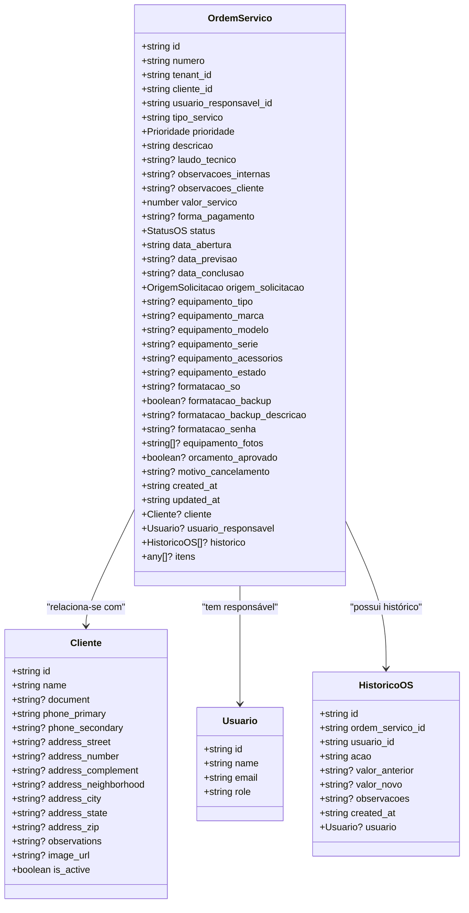

**Diagrama fonte**
- [ordem-servico.types.ts](file://frontend/types/ordem-servico.types.ts#L3-L48)
- [ordem-servico.types.ts](file://frontend/types/ordem-servico.types.ts#L50-L66)
- [ordem-servico.types.ts](file://frontend/types/ordem-servico.types.ts#L68-L73)
- [ordem-servico.types.ts](file://frontend/types/ordem-servico.types.ts#L75-L85)

**Seção fonte**
- [ordem-servico.types.ts](file://frontend/types/ordem-servico.types.ts#L3-L85)

### Enums e Validações
O módulo define enums para representar estados e origens de solicitação, além de constantes para rótulos e cores associados aos status.

- **StatusOS**: Estados possíveis de uma ordem de serviço.
- **OrigemSolicitacao**: Formas de origem da solicitação.
- **TipoServico**: Tipos de serviço oferecidos.
- **TRANSICOES_PERMITIDAS**: Regras de transição válidas entre status.

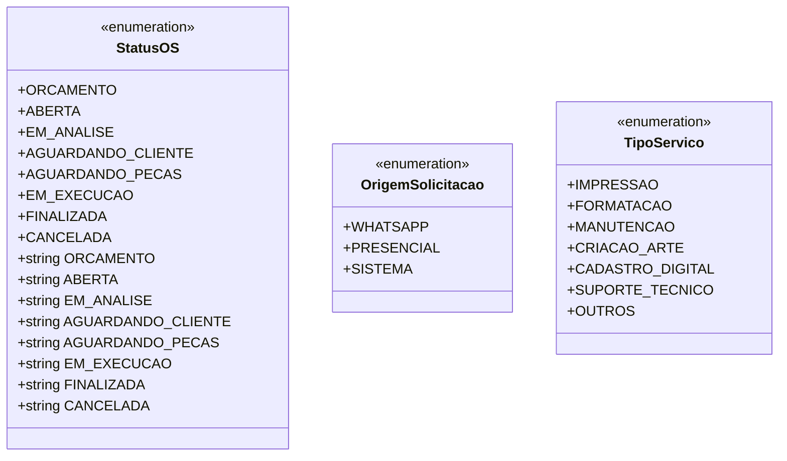

**Diagrama fonte**
- [ordem-servico.types.ts](file://frontend/types/ordem-servico.types.ts#L88-L113)

**Seção fonte**
- [ordem-servico.types.ts](file://frontend/types/ordem-servico.types.ts#L88-L164)

### DTOs de Criação e Atualização
Para operações CRUD, são definidos DTOs específicos:

- **CreateOrdemServicoDTO**: Campos necessários para criação de nova ordem de serviço.
- **UpdateOrdemServicoDTO**: Campos que podem ser atualizados em uma ordem existente.
- **OrdemServicoFilters**: Parâmetros de filtro para consultas.

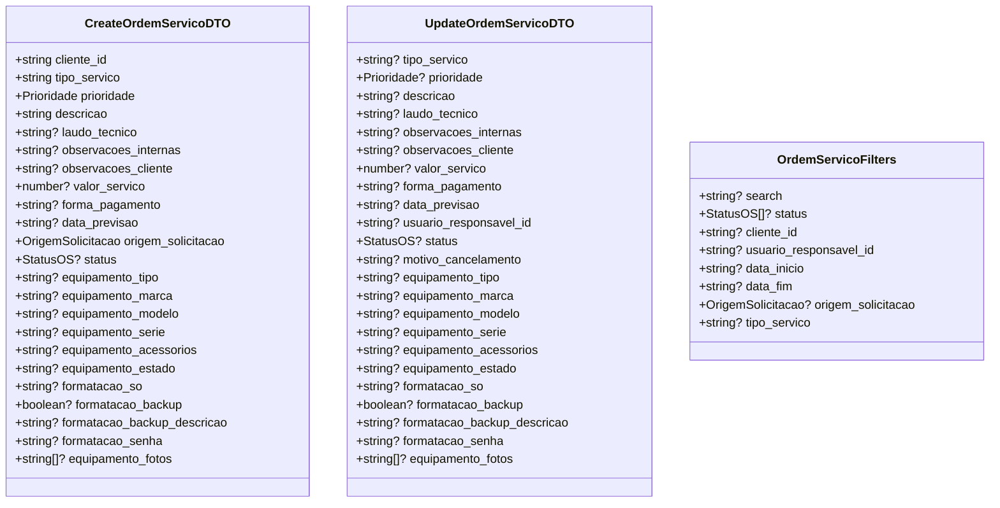

**Diagrama fonte**
- [ordem-servico.types.ts](file://frontend/types/ordem-servico.types.ts#L166-L194)
- [ordem-servico.types.ts](file://frontend/types/ordem-servico.types.ts#L196-L224)
- [ordem-servico.types.ts](file://frontend/types/ordem-servico.types.ts#L226-L235)

**Seção fonte**
- [ordem-servico.types.ts](file://frontend/types/ordem-servico.types.ts#L166-L235)

### Tipagens de Permissões
O módulo de permissões define estruturas para gerenciamento de acesso:

- **UserPermission**: Permissão individual de um usuário.
- **PermissionUpdate**: Dados para atualização de permissões.
- **AvailablePermission**: Recurso disponível com suas ações.
- **PermissionAction**: Ações associadas a um recurso.
- **UserWithPermissions**: Usuário com suas permissões consolidadas.
- **PermissionAudit**: Registro de auditoria de mudanças de permissão.

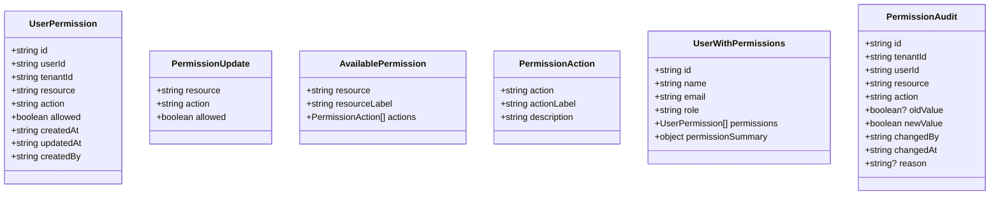

**Diagrama fonte**
- [permission.types.ts](file://frontend/types/permission.types.ts#L1-L11)
- [permission.types.ts](file://frontend/types/permission.types.ts#L13-L17)
- [permission.types.ts](file://frontend/types/permission.types.ts#L19-L29)
- [permission.types.ts](file://frontend/types/permission.types.ts#L31-L42)
- [permission.types.ts](file://frontend/types/permission.types.ts#L44-L55)

**Seção fonte**
- [permission.types.ts](file://frontend/types/permission.types.ts#L1-L55)

## Visão Geral da Arquitetura
A arquitetura do frontend segue um padrão de separação de responsabilidades com tipagens fortemente tipadas:

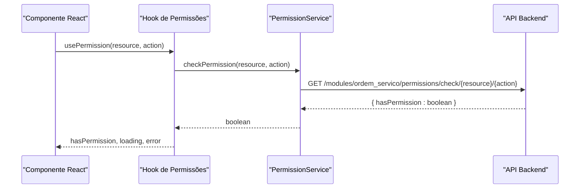

**Diagrama fonte**
- [usePermission.ts](file://frontend/hooks/usePermission.ts#L12-L56)
- [permissionService.ts](file://frontend/services/permissionService.ts#L107-L115)

**Seção fonte**
- [usePermission.ts](file://frontend/hooks/usePermission.ts#L1-L142)
- [permissionService.ts](file://frontend/services/permissionService.ts#L1-L135)

## Análise Detalhada dos Componentes

### Componente ClientEditModal
O componente de edição de cliente demonstra validações complexas e tratamento de dados:

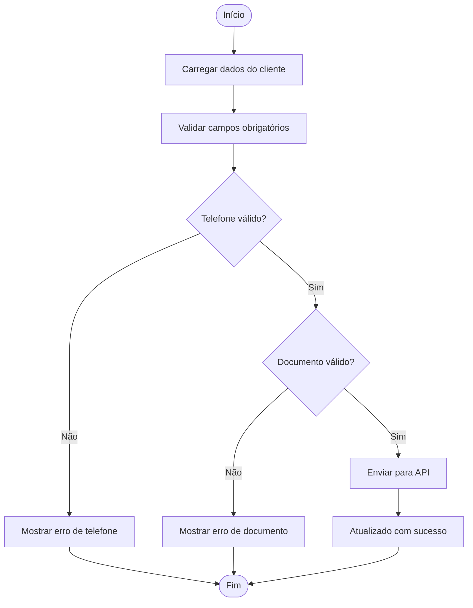

**Diagrama fonte**
- [ClientEditModal.tsx](file://frontend/components/ClientEditModal.tsx#L352-L402)

**Seção fonte**
- [ClientEditModal.tsx](file://frontend/components/ClientEditModal.tsx#L1-L711)

### Componente ClientModal
O componente de criação de cliente possui fluxo semelhante com validações adicionais:

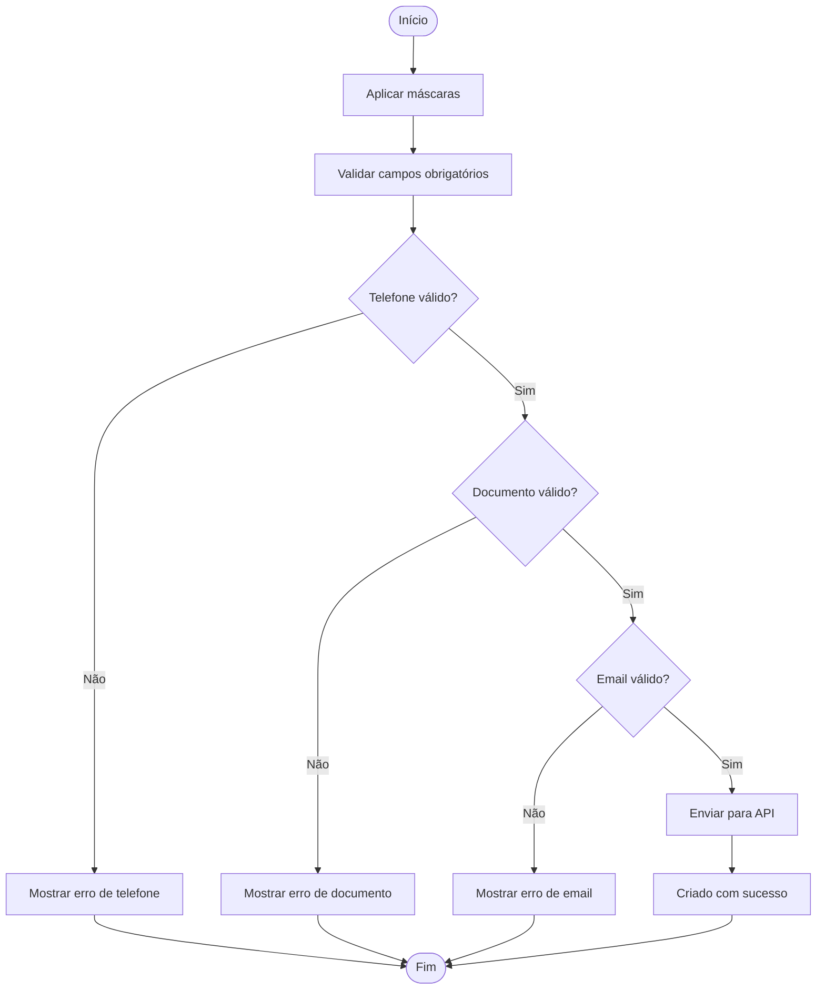

**Diagrama fonte**
- [ClientModal.tsx](file://frontend/components/ClientModal.tsx#L317-L366)

**Seção fonte**
- [ClientModal.tsx](file://frontend/components/ClientModal.tsx#L1-L673)

### Hooks de Permissões
Os hooks implementam padrões de acesso a dados com cache local:

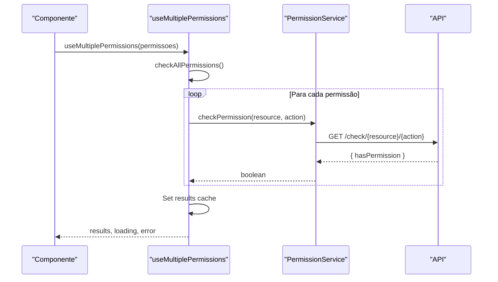

**Diagrama fonte**
- [usePermission.ts](file://frontend/hooks/usePermission.ts#L58-L120)
- [permissionService.ts](file://frontend/services/permissionService.ts#L107-L115)

**Seção fonte**
- [usePermission.ts](file://frontend/hooks/usePermission.ts#L1-L142)
- [permissionService.ts](file://frontend/services/permissionService.ts#L1-L135)

### Serviços de Dados
Os serviços implementam padrões de acesso a dados com tratamento de erros:

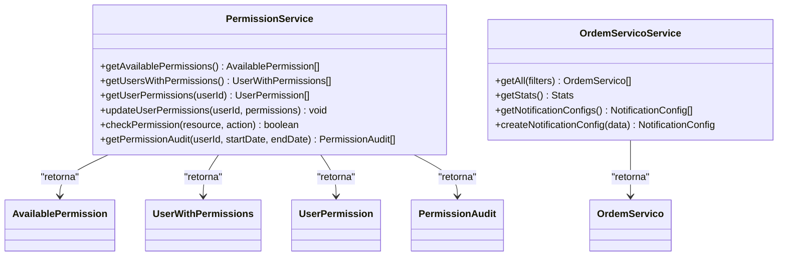

**Diagrama fonte**
- [permissionService.ts](file://frontend/services/permissionService.ts#L52-L135)
- [ordem_servico.service.ts](file://frontend/services/ordem_servico.service.ts#L3-L19)

**Seção fonte**
- [permissionService.ts](file://frontend/services/permissionService.ts#L1-L135)
- [ordem_servico.service.ts](file://frontend/services/ordem_servico.service.ts#L1-L20)

## Análise de Dependências
As dependências entre componentes seguem um padrão de baixo acoplamento:

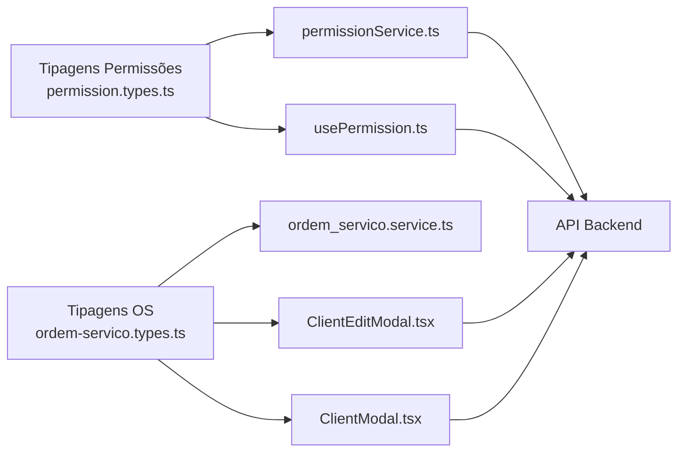

**Diagrama fonte**
- [ordem-servico.types.ts](file://frontend/types/ordem-servico.types.ts#L1-L235)
- [permission.types.ts](file://frontend/types/permission.types.ts#L1-L55)
- [ClientEditModal.tsx](file://frontend/components/ClientEditModal.tsx#L1-L711)
- [ClientModal.tsx](file://frontend/components/ClientModal.tsx#L1-L673)
- [ordem_servico.service.ts](file://frontend/services/ordem_servico.service.ts#L1-L20)
- [permissionService.ts](file://frontend/services/permissionService.ts#L1-L135)
- [usePermission.ts](file://frontend/hooks/usePermission.ts#L1-L142)

**Seção fonte**
- [ordem-servico.types.ts](file://frontend/types/ordem-servico.types.ts#L1-L235)
- [permission.types.ts](file://frontend/types/permission.types.ts#L1-L55)

## Considerações de Desempenho
- **Cache Local**: Os hooks implementam cache local de resultados de permissões para evitar chamadas redundantes à API.
- **Validações Client-Side**: Componentes realizam validações imediatas antes de enviar dados para o backend, reduzindo chamadas desnecessárias.
- **Tipagem Estática**: As tipagens fortes permitem otimizações durante a compilação e melhor desempenho em tempo de execução.

## Guia de Solução de Problemas
- **Erros de Permissão**: Verificar se o usuário possui as permissões necessárias através do hook `usePermission`.
- **Validações de Dados**: Em componentes de formulário, verificar mensagens de erro retornadas pelas funções de validação.
- **Chamadas API**: Verificar status de resposta e tratar erros específicos de diferentes códigos HTTP.

**Seção fonte**
- [usePermission.ts](file://frontend/hooks/usePermission.ts#L17-L35)
- [ClientEditModal.tsx](file://frontend/components/ClientEditModal.tsx#L355-L381)
- [ClientModal.tsx](file://frontend/components/ClientModal.tsx#L318-L343)

## Conclusão
As tipagens TypeScript implementadas no frontend garantem:
- Segurança de dados através de tipagem forte
- Clareza na definição de entidades e relacionamentos
- Validação eficiente de dados antes do envio para o backend
- Controle de acesso baseado em permissões
- Boas práticas de desenvolvimento com cache local e tratamento de erros

A arquitetura modular e as tipagens bem definidas facilitam a manutenção e evolução do módulo de Ordens de Serviço.