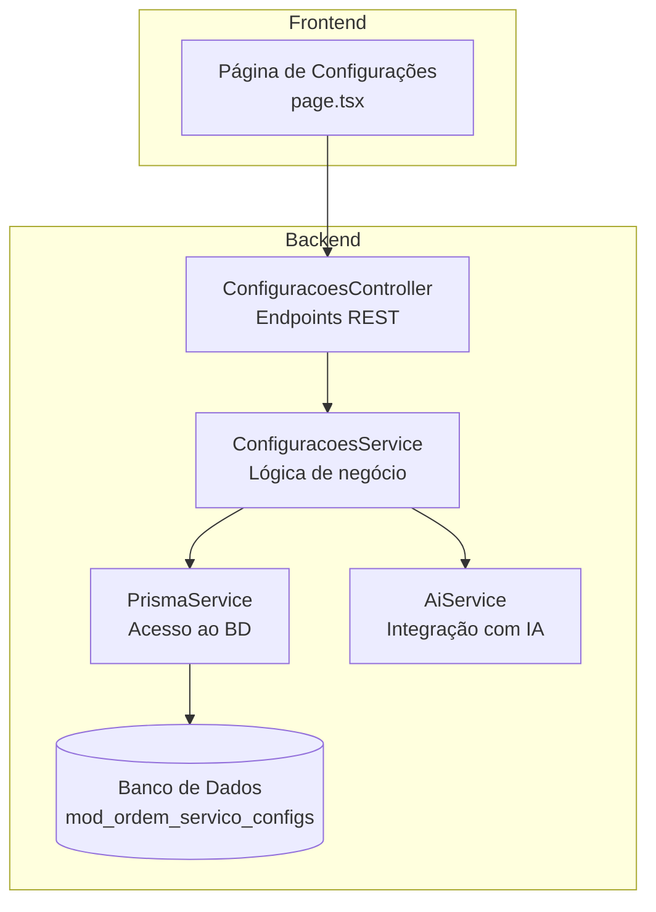
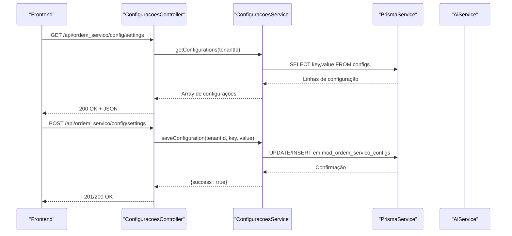
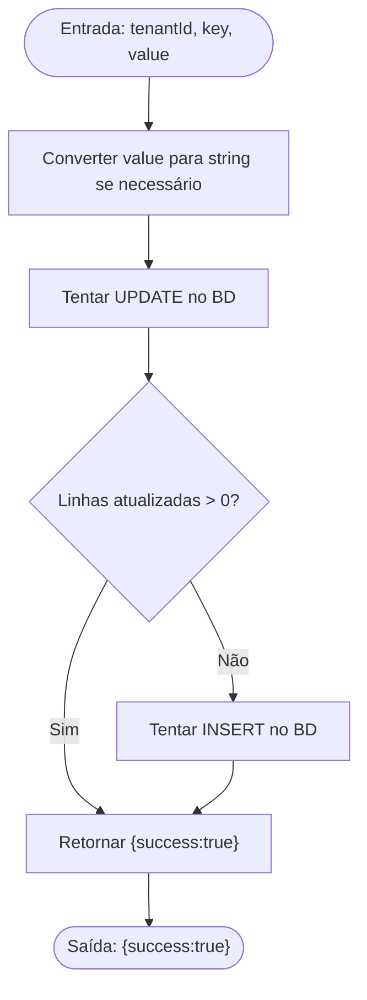
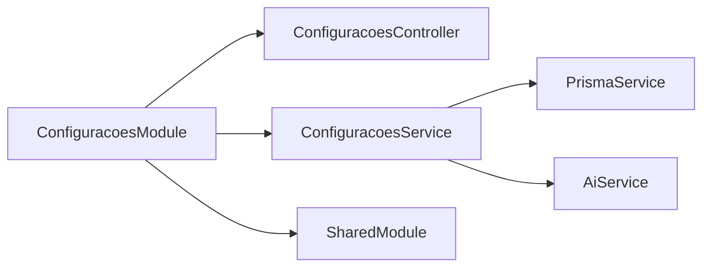

# Configurações Gerais

<cite>
**Arquivos referenciados neste documento**
- [configuracoes.controller.ts](file://backend/configuracoes/configuracoes.controller.ts)
- [configuracoes.service.ts](file://backend/configuracoes/configuracoes.service.ts)
- [configuracoes.module.ts](file://backend/configuracoes/configuracoes.module.ts)
- [ai.service.ts](file://backend/shared/services/ai.service.ts)
- [004_add_tables_os.sql](file://backend/migrations/004_add_tables_os.sql)
- [seeds_os.sql](file://backend/seeds/seeds_os.sql)
- [page.tsx](file://frontend/pages/configuracoes/page.tsx)
- [tipos-servico.controller.ts](file://backend/configuracoes/tipos-servico.controller.ts)
- [tipos-servico.service.ts](file://backend/configuracoes/tipos-servico.service.ts)
- [tipos-equipamento.controller.ts](file://backend/configuracoes/tipos-equipamento.controller.ts)
- [tipos-equipamento.service.ts](file://backend/configuracoes/tipos-equipamento.service.ts)
</cite>

## Sumário
1. [Introdução](#introdução)
2. [Estrutura do Projeto](#estrutura-do-projeto)
3. [Componentes Principais](#componentes-principais)
4. [Visão Geral da Arquitetura](#visão-geral-da-arquitetura)
5. [Análise Detalhada dos Componentes](#análise-detalhada-dos-componentes)
6. [Análise de Dependências](#análise-de-dependências)
7. [Considerações de Desempenho](#considerações-de-desempenho)
8. [Guia de Solução de Problemas](#guia-de-solução-de-problemas)
9. [Conclusão](#conclusão)

## Introdução
Este documento apresenta as configurações gerais do módulo de Ordem de Serviço, com foco no controller e service de configurações, APIs REST expostas, parâmetros de requisição/resposta, validações implementadas, e como os dados são lidos, atualizados e persistidos. Também explica os parâmetros configuráveis e seus impactos no funcionamento do módulo, abordando questões de validação, tratamento de erros e otimizações de desempenho. O conteúdo foi elaborado para ser acessível a iniciantes e detalhado o suficiente para desenvolvedores experientes.

## Estrutura do Projeto
O módulo de configurações está localizado no backend, dentro da pasta `backend/configuracoes`. Ele expõe endpoints REST protegidos por autenticação JWT e interage com o banco de dados via Prisma. O frontend disponibiliza uma interface de configurações que consome esses endpoints.

**Diagrama fonte**
- [configuracoes.controller.ts](file://backend/configuracoes/configuracoes.controller.ts#L1-L136)
- [configuracoes.service.ts](file://backend/configuracoes/configuracoes.service.ts#L1-L331)
- [ai.service.ts](file://backend/shared/services/ai.service.ts#L1-L91)
- [page.tsx](file://frontend/pages/configuracoes/page.tsx#L1-L1272)

**Seção fonte**
- [configuracoes.controller.ts](file://backend/configuracoes/configuracoes.controller.ts#L1-L136)
- [configuracoes.service.ts](file://backend/configuracoes/configuracoes.service.ts#L1-L331)
- [configuracoes.module.ts](file://backend/configuracoes/configuracoes.module.ts#L1-L30)

## Componentes Principais
- Controller de Configurações: Define os endpoints REST para leitura e escrita de configurações, notificações, permissões, usuários e configurações de IA.
- Service de Configurações: Implementa a lógica de persistência, validações e integrações (como IA).
- Módulo de Configurações: Registra controller e service no NestJS.
- Service de IA: Fornece integração com provedores externos de IA.
- Frontend: Interface que consome os endpoints REST e exibe/edita as configurações.

**Seção fonte**
- [configuracoes.controller.ts](file://backend/configuracoes/configuracoes.controller.ts#L1-L136)
- [configuracoes.service.ts](file://backend/configuracoes/configuracoes.service.ts#L1-L331)
- [configuracoes.module.ts](file://backend/configuracoes/configuracoes.module.ts#L1-L30)
- [ai.service.ts](file://backend/shared/services/ai.service.ts#L1-L91)

## Visão Geral da Arquitetura
A comunicação segue o padrão REST com autenticação JWT. O frontend faz chamadas HTTP para o backend, que delega as operações ao service e ao Prisma. Para configurações de IA, o service utiliza o AiService para validar e chamar provedores externos.

**Diagrama fonte**
- [configuracoes.controller.ts](file://backend/configuracoes/configuracoes.controller.ts#L115-L135)
- [configuracoes.service.ts](file://backend/configuracoes/configuracoes.service.ts#L283-L330)
- [ai.service.ts](file://backend/shared/services/ai.service.ts#L33-L89)

## Análise Detalhada dos Componentes

### Controller de Configurações
- Proteção: Todos os endpoints utilizam o guard JwtAuthGuard.
- Endpoints:
  - GET /api/ordem_servico/config/users: Retorna todos os usuários do sistema principal.
  - PUT /api/ordem_servico/config/users/:id/technician: Alterna o papel técnico de um usuário.
  - GET /api/ordem_servico/config/profile-permissions: Busca permissões de perfil.
  - POST /api/ordem_servico/config/profile-permissions: Atualiza permissões de perfil.
  - GET /api/ordem_servico/config/notifications: Lista agendamentos de notificação.
  - POST /api/ordem_servico/config/notifications: Cria novo agendamento.
  - GET /api/ordem_servico/config/ai: Lê configuração de IA.
  - POST /api/ordem_servico/config/ai: Atualiza configuração de IA.
  - POST /api/ordem_servico/config/ai/test: Testa configuração de IA.
  - GET /api/ordem_servico/config/settings: Lê todas as configurações genéricas.
  - POST /api/ordem_servico/config/settings: Persiste uma configuração genérica.

Cada endpoint possui tratamento de erro com logs e re-lançamento de exceções.

**Seção fonte**
- [configuracoes.controller.ts](file://backend/configuracoes/configuracoes.controller.ts#L1-L136)

### Service de Configurações
- Métodos principais:
  - getUsers(tenantId): Consulta usuários via raw SQL.
  - toggleTechnician(tenantId, userId, isTechnician): Placeholder para alternar papel técnico.
  - getProfilePermissions(tenantId): Lê permissões de perfil, com fallback para permissões padrão.
  - updateProfilePermissions(tenantId, permissions): Apaga e reinsere permissões em lote.
  - getNotifications(tenantId): Retorna todos os agendamentos.
  - createNotification(tenantId, data): Insere novo agendamento.
  - getAiConfig(tenantId): Lê configuração de IA, mascarando API Key.
  - updateAiConfig(tenantId, config): Atualiza ou insere configuração de IA, mantendo API Key existente quando mascarada.
  - testAiConfig(tenantId, testConfig): Testa conexão com IA usando AiService.
  - getConfigurations(tenantId): Lê todas as configurações genéricas.
  - saveConfiguration(tenantId, key, value): Atualiza se existir, senão insere.

- Validações e tratamento:
  - Retorno de arrays vazios para tabelas inexistentes (fallback).
  - Masking de API Key ao ler configuração de IA.
  - Tratamento de erros com logs e lançamento de exceções.

**Seção fonte**
- [configuracoes.service.ts](file://backend/configuracoes/configuracoes.service.ts#L1-L331)

### Service de IA
- getAiConfig(tenantId): Lê configuração de IA do banco.
- callAI(tenantId, {prompt, system}, configOverride?): Chama provedor OpenAI/OpenRouter com parâmetros configurados. Lança BadRequestException se IA não estiver habilitada ou se API Key estiver faltando.

**Seção fonte**
- [ai.service.ts](file://backend/shared/services/ai.service.ts#L1-L91)

### Frontend
- A página de configurações consome os endpoints REST:
  - GET /api/ordem_servico/config/notifications
  - POST /api/ordem_servico/config/notifications
  - GET /api/ordem_servico/config/ai
  - POST /api/ordem_servico/config/ai
  - POST /api/ordem_servico/config/ai/test
  - GET /api/ordem_servico/config/users
  - PUT /api/ordem_servico/config/users/:id/technician
  - GET /api/ordem_servico/config/settings
  - POST /api/ordem_servico/config/settings

- Exemplos de uso:
  - Carrega agendamentos e exibe em cards.
  - Permite criar novos agendamentos com título, conteúdo, público-alvo e expressão cron.
  - Edita configurações de IA (provedor, API Key, modelo, temperatura, tokens).
  - Testa a configuração de IA e exibe resposta.
  - Lista usuários e permite alternar papel técnico.
  - Lê e salva a configuração "condicoes_execucao" (usada no template A4).

**Seção fonte**
- [page.tsx](file://frontend/pages/configuracoes/page.tsx#L457-L668)

### CRUD Genérico de Configurações
- Leitura: GET /api/ordem_servico/config/settings retorna um array de objetos com config_key e config_value.
- Persistência: POST /api/ordem_servico/config/settings com corpo { config_key, config_value }.
- Persistência atualiza se já existir, senão insere.

**Diagrama fonte**
- [configuracoes.service.ts](file://backend/configuracoes/configuracoes.service.ts#L299-L330)

**Seção fonte**
- [configuracoes.controller.ts](file://backend/configuracoes/configuracoes.controller.ts#L115-L135)
- [configuracoes.service.ts](file://backend/configuracoes/configuracoes.service.ts#L283-L330)

### Parâmetros Configuráveis e Impactos
- condicoes_execucao (chave genérica):
  - Local persistência: mod_ordem_servico_configs.
  - Impacto: Texto exibido automaticamente no template de impressão A4.
  - Como configurar: POST /api/ordem_servico/config/settings com config_key="condicoes_execucao" e config_value como string.
- termo_garantia:
  - Local persistência: seeds_os.sql.
  - Impacto: Termo exibido no template de OS.
- exibir_valor_total:
  - Local persistência: seeds_os.sql.
  - Impacto: Controla exibição do valor total no template.
- notificar_whatsapp_status:
  - Local persistência: seeds_os.sql.
  - Impacto: Habilita notificações automáticas via WhatsApp.
- Configurações de IA:
  - Chave: ai_integration.
  - Campos: provider, apiKey, model, temperature, maxTokens, enabled.
  - Impacto: Ativa/desativa e define parâmetros de integração com IA.

**Seção fonte**
- [004_add_tables_os.sql](file://backend/migrations/004_add_tables_os.sql#L66-L78)
- [seeds_os.sql](file://backend/seeds/seeds_os.sql#L7-L26)
- [configuracoes.service.ts](file://backend/configuracoes/configuracoes.service.ts#L179-L241)

### Validações e Tratamento de Erros
- Validações no service:
  - Fallback para permissões padrão se tabela não existir.
  - Masking de API Key ao ler configuração de IA.
  - Erros de banco tratados com logs e lançamento de exceções.
- Validações no AiService:
  - BadRequestException se IA não estiver habilitada ou se API Key estiver faltando.
- Frontend:
  - Valida campos obrigatórios antes de criar agendamentos.
  - Toasts informativos para sucesso/erro.

**Seção fonte**
- [configuracoes.service.ts](file://backend/configuracoes/configuracoes.service.ts#L95-L97)
- [configuracoes.service.ts](file://backend/configuracoes/configuracoes.service.ts#L194-L196)
- [ai.service.ts](file://backend/shared/services/ai.service.ts#L40-L46)
- [page.tsx](file://frontend/pages/configuracoes/page.tsx#L594-L626)

### Integração com Tipos de Serviço e Equipamento
- Tipos de Serviço:
  - Controller: GET/POST/PUT/DELETE em /api/ordem_servico/tipos-servico.
  - Service: Validações de duplicidade, uso em ordens e exclusão de tipos padrão.
- Tipos de Equipamento:
  - Controller: GET/POST/PUT/DELETE em /api/ordem_servico/tipos-equipamento.
  - Service: Validações semelhantes às de serviços.

Esses endpoints complementam as configurações do módulo, permitindo gerenciar categorias de serviços e equipamentos.

**Seção fonte**
- [tipos-servico.controller.ts](file://backend/configuracoes/tipos-servico.controller.ts#L1-L39)
- [tipos-servico.service.ts](file://backend/configuracoes/tipos-servico.service.ts#L1-L128)
- [tipos-equipamento.controller.ts](file://backend/configuracoes/tipos-equipamento.controller.ts#L1-L39)
- [tipos-equipamento.service.ts](file://backend/configuracoes/tipos-equipamento.service.ts#L1-L123)

## Análise de Dependências
- O módulo de configurações depende de:
  - PrismaModule para acesso ao banco de dados.
  - SharedModule para serviços compartilhados (incluindo AiService).
- O ConfiguracoesController depende de ConfiguracoesService.
- ConfiguracoesService depende de PrismaService e AiService.

**Diagrama fonte**
- [configuracoes.module.ts](file://backend/configuracoes/configuracoes.module.ts#L12-L29)

**Seção fonte**
- [configuracoes.module.ts](file://backend/configuracoes/configuracoes.module.ts#L1-L30)

## Considerações de Desempenho
- Persistência em lote:
  - Atualização de permissões de perfil utiliza Promise.all para inserções em lote, reduzindo round-trips.
- Queries customizadas:
  - Uso de raw queries para consultas específicas melhora controle e pode otimizar performance em alguns casos.
- Masking de API Key:
  - Evita exposição de credenciais sensíveis nos logs e respostas.
- Recomendações:
  - Indexar colunas usadas em filtros (ex: tenant_id, key).
  - Limitar o tamanho de valores armazenados em configurações genéricas.
  - Cache de configurações críticas em memória se necessário.

[Sem fonte, pois esta seção fornece orientações gerais]

## Guia de Solução de Problemas
- Erros ao buscar configurações:
  - Verifique se a tabela mod_ordem_servico_configs existe e contém registros.
  - Confirme que o tenantId está correto.
- Erros de IA:
  - Certifique-se de que a chave de API esteja válida e que o provedor esteja configurado corretamente.
  - Use o endpoint de teste para validar a conexão.
- Erros de permissões:
  - Ao atualizar permissões, verifique se a tabela de permissões existe; o service retorna permissões padrão caso contrário.

**Seção fonte**
- [configuracoes.service.ts](file://backend/configuracoes/configuracoes.service.ts#L95-L97)
- [ai.service.ts](file://backend/shared/services/ai.service.ts#L40-L46)
- [page.tsx](file://frontend/pages/configuracoes/page.tsx#L510-L541)

## Conclusão
O módulo de configurações oferece uma base sólida para gerenciar parâmetros do sistema, com endpoints REST completos, validações robustas e integração com IA. As configurações genéricas permitem personalizar o comportamento do módulo, enquanto as configurações de IA possibilitam automações e análises. A arquitetura modular facilita manutenção e expansão, e o frontend proporciona uma experiência prática para edição e teste.