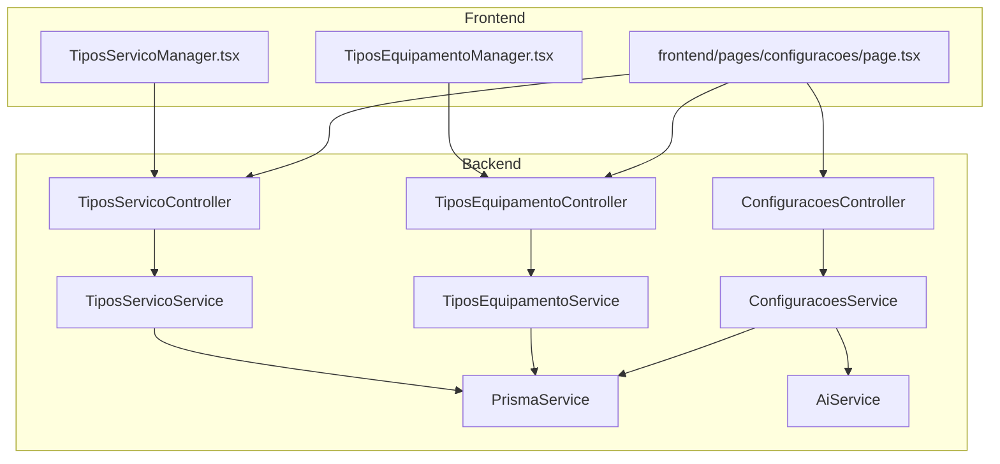
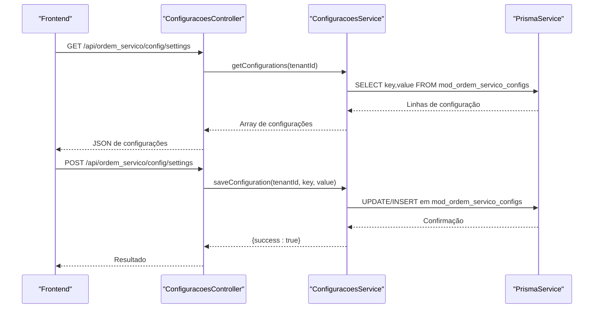
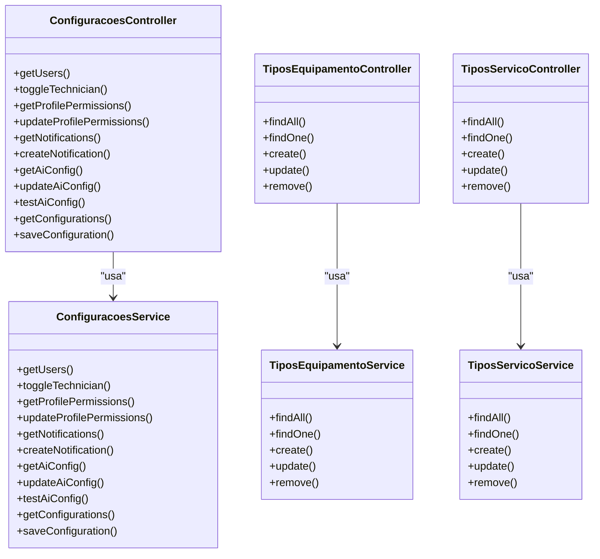
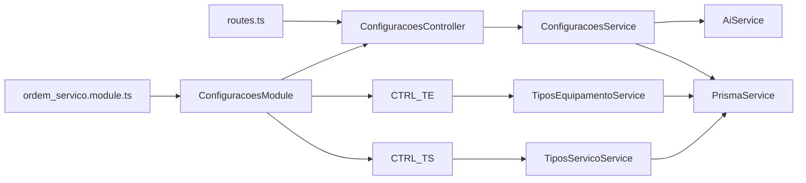
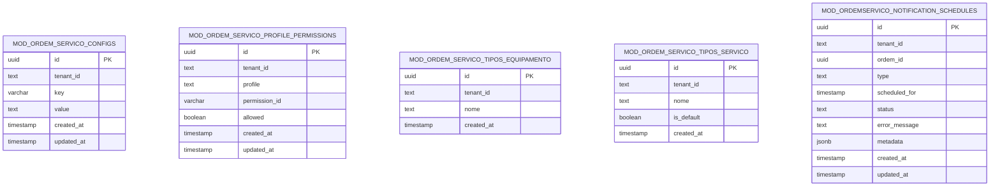

# Configurações do Sistema

<cite>
**Arquivos Referenciados Neste Documento**
- [configuracoes.controller.ts](file://backend/configuracoes/configuracoes.controller.ts)
- [configuracoes.service.ts](file://backend/configuracoes/configuracoes.service.ts)
- [tipos-equipamento.controller.ts](file://backend/configuracoes/tipos-equipamento.controller.ts)
- [tipos-equipamento.service.ts](file://backend/configuracoes/tipos-equipamento.service.ts)
- [tipos-servico.controller.ts](file://backend/configuracoes/tipos-servico.controller.ts)
- [tipos-servico.service.ts](file://backend/configuracoes/tipos-servico.service.ts)
- [configuracoes.module.ts](file://backend/configuracoes/configuracoes.module.ts)
- [ordem_servico.module.ts](file://backend/ordem_servico.module.ts)
- [routes.ts](file://backend/routes.ts)
- [page.tsx](file://frontend/pages/configuracoes/page.tsx)
- [TiposEquipamentoManager.tsx](file://frontend/components/TiposEquipamentoManager.tsx)
- [TiposServicoManager.tsx](file://frontend/components/TiposServicoManager.tsx)
- [004_add_tables_os.sql](file://backend/migrations/004_add_tables_os.sql)
- [seed.sql](file://backend/seeds/seed.sql)
- [seeds_os.sql](file://backend/seeds/seeds_os.sql)
</cite>

## Sumário
1. [Introdução](#introdução)
2. [Estrutura do Projeto](#estrutura-do-projeto)
3. [Componentes Principais](#componentes-principais)
4. [Visão Geral da Arquitetura](#visão-geral-da-arquitetura)
5. [Análise Detalhada dos Componentes](#análise-detalhada-dos-componentes)
6. [Análise de Dependências](#análise-de-dependências)
7. [Considerações de Desempenho](#considerações-de-desempenho)
8. [Guia de Solução de Problemas](#guia-de-solução-de-problemas)
9. [Conclusão](#conclusão)
10. [Apêndices](#apêndices)

## Introdução
Este documento apresenta as configurações do sistema do módulo Ordem de Serviço, com foco em:
- Configurações gerais do módulo (chave-valor persistidas)
- Tipos de equipamentos e tipos de serviço
- Interfaces de API de configurações e padrões de uso
- Exemplos de código-fonte e fluxos de integração
- Impactos das configurações no comportamento do sistema e possíveis parâmetros ajustáveis

As configurações são armazenadas em uma tabela genérica e podem ser lidas e atualizadas via API. Além disso, há endpoints específicos para permissões, notificações, usuários e integração com IA, além de gerenciamento de tipos de equipamentos e serviços.

## Estrutura do Projeto
O módulo de configurações é composto por:
- Controladores e serviços para configurações gerais, permissões, notificações e IA
- Controladores e serviços para tipos de equipamentos e tipos de serviço
- Frontend com páginas e componentes para gerenciamento visual
- Migrações e seeds que definem a estrutura de dados e valores iniciais

**Diagrama Fonte**
- [configuracoes.controller.ts](file://backend/configuracoes/configuracoes.controller.ts#L6-L136)
- [configuracoes.service.ts](file://backend/configuracoes/configuracoes.service.ts#L1-L331)
- [tipos-equipamento.controller.ts](file://backend/configuracoes/tipos-equipamento.controller.ts#L5-L39)
- [tipos-equipamento.service.ts](file://backend/configuracoes/tipos-equipamento.service.ts#L1-L123)
- [tipos-servico.controller.ts](file://backend/configuracoes/tipos-servico.controller.ts#L5-L39)
- [tipos-servico.service.ts](file://backend/configuracoes/tipos-servico.service.ts#L1-L128)
- [page.tsx](file://frontend/pages/configuracoes/page.tsx#L1-L1272)
- [TiposEquipamentoManager.tsx](file://frontend/components/TiposEquipamentoManager.tsx#L1-L370)
- [TiposServicoManager.tsx](file://frontend/components/TiposServicoManager.tsx#L1-L407)

**Seção Fonte**
- [configuracoes.module.ts](file://backend/configuracoes/configuracoes.module.ts#L1-L30)
- [ordem_servico.module.ts](file://backend/ordem_servico.module.ts#L1-L35)
- [routes.ts](file://backend/routes.ts#L1-L17)

## Componentes Principais
- Configurações gerais: endpoints para leitura e escrita de configurações genéricas (chave-valor)
- Permissões de perfil: leitura e atualização de permissões associadas a perfis
- Notificações: listagem e criação de agendas de notificações
- IA: leitura, atualização e teste de configurações de integração com IA
- Tipos de equipamentos: CRUD completo com validações e restrições
- Tipos de serviço: CRUD completo com validações e proteção de registros padrão

**Seção Fonte**
- [configuracoes.controller.ts](file://backend/configuracoes/configuracoes.controller.ts#L14-L136)
- [configuracoes.service.ts](file://backend/configuracoes/configuracoes.service.ts#L283-L331)
- [tipos-equipamento.controller.ts](file://backend/configuracoes/tipos-equipamento.controller.ts#L10-L39)
- [tipos-equipamento.service.ts](file://backend/configuracoes/tipos-equipamento.service.ts#L8-L123)
- [tipos-servico.controller.ts](file://backend/configuracoes/tipos-servico.controller.ts#L10-L39)
- [tipos-servico.service.ts](file://backend/configuracoes/tipos-servico.service.ts#L8-L128)

## Visão Geral da Arquitetura
A arquitetura segue o padrão NestJS com controladores expostos via rotas e serviços que interagem com o banco de dados através do Prisma. O frontend consome os endpoints via fetch, passando o token de acesso obtido de cookies ou sessionStorage.

**Diagrama Fonte**
- [configuracoes.controller.ts](file://backend/configuracoes/configuracoes.controller.ts#L115-L136)
- [configuracoes.service.ts](file://backend/configuracoes/configuracoes.service.ts#L283-L331)
- [page.tsx](file://frontend/pages/configuracoes/page.tsx#L628-L668)

**Seção Fonte**
- [routes.ts](file://backend/routes.ts#L9-L17)
- [ordem_servico.module.ts](file://backend/ordem_servico.module.ts#L11-L31)

## Análise Detalhada dos Componentes

### Configurações Gerais
- Endpoint GET /api/ordem_servico/config/settings retorna todas as configurações do locatário
- Endpoint POST /api/ordem_servico/config/settings salva uma configuração com chave e valor
- O serviço converte objetos para JSON antes de persistir, se necessário
- Persistência em mod_ordem_servico_configs com tenant_id

Parâmetros ajustáveis:
- Qualquer chave-valor configurável pelo sistema (ex: termos, exibição de valores, notificações)

Impactos:
- Alterações podem afetar templates de impressão, exibições e fluxos de negócio

**Seção Fonte**
- [configuracoes.controller.ts](file://backend/configuracoes/configuracoes.controller.ts#L115-L136)
- [configuracoes.service.ts](file://backend/configuracoes/configuracoes.service.ts#L283-L331)
- [page.tsx](file://frontend/pages/configuracoes/page.tsx#L628-L668)
- [004_add_tables_os.sql](file://backend/migrations/004_add_tables_os.sql#L12-L17)
- [seeds_os.sql](file://backend/seeds/seeds_os.sql#L7-L26)

### Permissões de Perfil
- GET /api/ordem_servico/config/profile-permissions: busca permissões por perfil
- POST /api/ordem_servico/config/profile-permissions: atualiza permissões em massa
- O serviço retorna um objeto estruturado e pode fornecer permissões padrão se a tabela não existir

Parâmetros ajustáveis:
- Permissões por perfil (admin, technician, attendant)

Impactos:
- Controle de acesso granular ao módulo

**Seção Fonte**
- [configuracoes.controller.ts](file://backend/configuracoes/configuracoes.controller.ts#L36-L56)
- [configuracoes.service.ts](file://backend/configuracoes/configuracoes.service.ts#L68-L137)

### Notificações
- GET /api/ordem_servico/config/notifications: lista agendas de notificação
- POST /api/ordem_servico/config/notifications: cria nova agenda
- A migração cria a tabela de notificações com campos como cron_expression, audience, enabled

Parâmetros ajustáveis:
- Título, conteúdo, público-alvo, expressão cron, habilitado

Impactos:
- Agendamento de notificações automáticas

**Seção Fonte**
- [configuracoes.controller.ts](file://backend/configuracoes/configuracoes.controller.ts#L58-L78)
- [configuracoes.service.ts](file://backend/configuracoes/configuracoes.service.ts#L139-L177)
- [004_add_tables_os.sql](file://backend/migrations/004_add_tables_os.sql#L18-L32)

### IA
- GET /api/ordem_servico/config/ai: busca configuração de IA (com máscara de API Key)
- POST /api/ordem_servico/config/ai: atualiza configuração de IA
- POST /api/ordem_servico/config/ai/test: testa a configuração com a IA

Parâmetros ajustáveis:
- Provider, API Key, modelo, temperatura, tokens máximos, habilitado

Impactos:
- Ativação e testes de integração com provedor de IA

**Seção Fonte**
- [configuracoes.controller.ts](file://backend/configuracoes/configuracoes.controller.ts#L80-L111)
- [configuracoes.service.ts](file://backend/configuracoes/configuracoes.service.ts#L179-L281)

### Tipos de Equipamento
- CRUD completo com validações de unicidade e uso
- Validação de exclusão: não permite excluir se estiver sendo usado em ordens

Parâmetros ajustáveis:
- Nome do tipo de equipamento

Impactos:
- Padronização de equipamentos para ordens de serviço

**Seção Fonte**
- [tipos-equipamento.controller.ts](file://backend/configuracoes/tipos-equipamento.controller.ts#L10-L39)
- [tipos-equipamento.service.ts](file://backend/configuracoes/tipos-equipamento.service.ts#L8-L123)

### Tipos de Serviço
- CRUD completo com proteção de registros padrão
- Validação de exclusão: não permite excluir tipos padrão e aqueles em uso

Parâmetros ajustáveis:
- Nome do tipo de serviço

Impactos:
- Padronização de serviços e prevenção de exclusão acidental de registros críticos

**Seção Fonte**
- [tipos-servico.controller.ts](file://backend/configuracoes/tipos-servico.controller.ts#L10-L39)
- [tipos-servico.service.ts](file://backend/configuracoes/tipos-servico.service.ts#L8-L128)

### Frontend
- Página de configurações com abas para Agendamento, Usuários, Permissões, Opções OS e IA
- Componentes de gerenciamento de tipos de equipamento e serviço
- Chamadas HTTP para os endpoints do backend com token de autenticação

Exemplos de uso:
- Salvar condições de execução via POST /api/ordem_servico/config/settings
- Testar configuração de IA via POST /api/ordem_servico/config/ai/test

**Seção Fonte**
- [page.tsx](file://frontend/pages/configuracoes/page.tsx#L364-L743)
- [TiposEquipamentoManager.tsx](file://frontend/components/TiposEquipamentoManager.tsx#L195-L370)
- [TiposServicoManager.tsx](file://frontend/components/TiposServicoManager.tsx#L216-L407)

## Visão Geral da Arquitetura

**Diagrama Fonte**
- [configuracoes.controller.ts](file://backend/configuracoes/configuracoes.controller.ts#L6-L136)
- [configuracoes.service.ts](file://backend/configuracoes/configuracoes.service.ts#L1-L331)
- [tipos-equipamento.controller.ts](file://backend/configuracoes/tipos-equipamento.controller.ts#L5-L39)
- [tipos-equipamento.service.ts](file://backend/configuracoes/tipos-equipamento.service.ts#L1-L123)
- [tipos-servico.controller.ts](file://backend/configuracoes/tipos-servico.controller.ts#L5-L39)
- [tipos-servico.service.ts](file://backend/configuracoes/tipos-servico.service.ts#L1-L128)

## Análise de Dependências

**Diagrama Fonte**
- [routes.ts](file://backend/routes.ts#L9-L17)
- [ordem_servico.module.ts](file://backend/ordem_servico.module.ts#L11-L31)
- [configuracoes.module.ts](file://backend/configuracoes/configuracoes.module.ts#L12-L29)

**Seção Fonte**
- [routes.ts](file://backend/routes.ts#L9-L17)
- [ordem_servico.module.ts](file://backend/ordem_servico.module.ts#L11-L31)
- [configuracoes.module.ts](file://backend/configuracoes/configuracoes.module.ts#L12-L29)

## Considerações de Desempenho
- Persistência em tabelas com índices implícitos (tenant_id, key) favorece consultas por locatário
- Operações de bulk (atualização de permissões) usam múltiplos inserts em lote
- Máscara de API Key evita vazamento de informações sensíveis
- Uso de raw queries permite controle fino sobre SQL, mas requer validação de parâmetros

[Sem fonte específica, pois esta seção fornece orientações gerais]

## Guia de Solução de Problemas

- Erros de autenticação:
  - Verifique se o token está presente nos headers Authorization
  - Confirme que o guard JWT está sendo aplicado nos controladores

- Erros de validação ao criar/atualizar:
  - Tipos de equipamento/serviço: nome obrigatório e único
  - Exclusão de registros: verifique dependências em ordens de serviço

- Configurações de IA:
  - Mantenha a API Key mascarada; o sistema recupera a original se fornecida mascarada
  - Use o endpoint de teste para validar a conexão

- Permissões:
  - Se a tabela de permissões não existir, o serviço retorna permissões padrão

**Seção Fonte**
- [configuracoes.service.ts](file://backend/configuracoes/configuracoes.service.ts#L14-L35)
- [tipos-equipamento.service.ts](file://backend/configuracoes/tipos-equipamento.service.ts#L33-L48)
- [tipos-servico.service.ts](file://backend/configuracoes/tipos-servico.service.ts#L33-L48)
- [configuracoes.controller.ts](file://backend/configuracoes/configuracoes.controller.ts#L25-L34)

## Conclusão
O módulo de configurações oferece um conjunto completo de funcionalidades para gerenciar o comportamento do sistema:
- Configurações gerais escaláveis por chave-valor
- Controle de permissões por perfil
- Agendamento de notificações
- Integração com IA testável
- Cadastro de tipos de equipamentos e serviços com validações robustas

Essas configurações impactam diretamente a experiência do usuário, a segurança e a padronização operacional do módulo.

[Sem fonte específica, pois esta seção resume sem análise de arquivos]

## Apêndices

### Exemplos de Uso

- Salvar configurações gerais:
  - Endpoint: POST /api/ordem_servico/config/settings
  - Corpo: { config_key: "condicoes_execucao", config_value: "Texto..." }
  - Fonte: [page.tsx](file://frontend/pages/configuracoes/page.tsx#L648-L668)

- Testar configuração de IA:
  - Endpoint: POST /api/ordem_servico/config/ai/test
  - Corpo: { provider, apiKey, model, temperature, maxTokens, enabled }
  - Fonte: [page.tsx](file://frontend/pages/configuracoes/page.tsx#L509-L541)

- CRUD de tipos de serviço:
  - Buscar: GET /api/ordem_servico/tipos-servico
  - Criar: POST /api/ordem_servico/tipos-servico
  - Atualizar: PUT /api/ordem_servico/tipos-servico/:id
  - Excluir: DELETE /api/ordem_servico/tipos-servico/:id
  - Fonte: [tipos-servico.controller.ts](file://backend/configuracoes/tipos-servico.controller.ts#L10-L39)

### Estrutura de Dados

**Diagrama Fonte**
- [004_add_tables_os.sql](file://backend/migrations/004_add_tables_os.sql#L12-L17)
- [004_add_tables_os.sql](file://backend/migrations/004_add_tables_os.sql#L18-L32)
- [004_add_tables_os.sql](file://backend/migrations/004_add_tables_os.sql#L66-L78)

### Seeds e Valores Iniciais
- Configurações iniciais por tenant (condições de execução, termos, exibição de valores, notificações)
- Flags iniciais (módulo ativado, versão)
- Fonte: [seeds_os.sql](file://backend/seeds/seeds_os.sql#L7-L26), [seed.sql](file://backend/seeds/seed.sql#L3-L17)