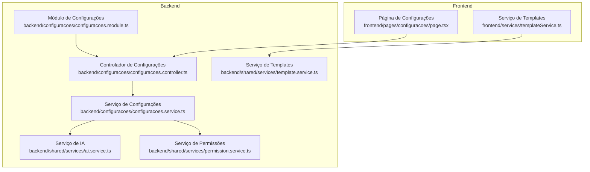
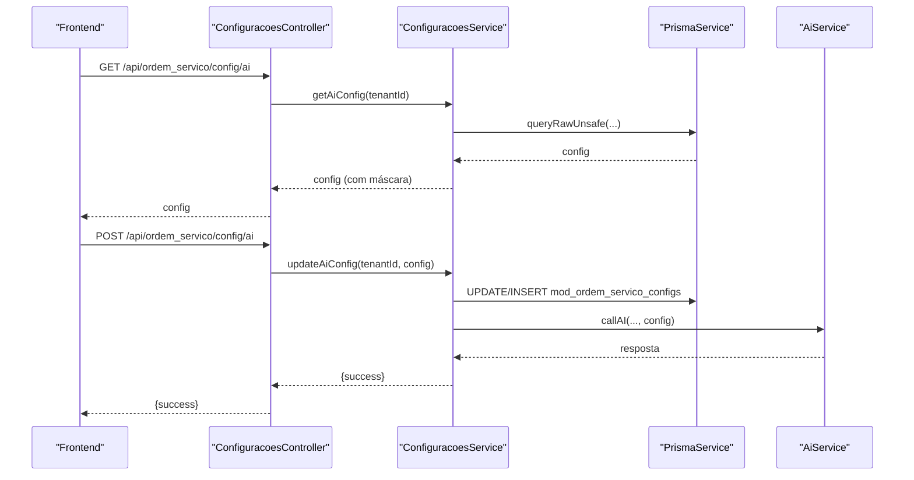
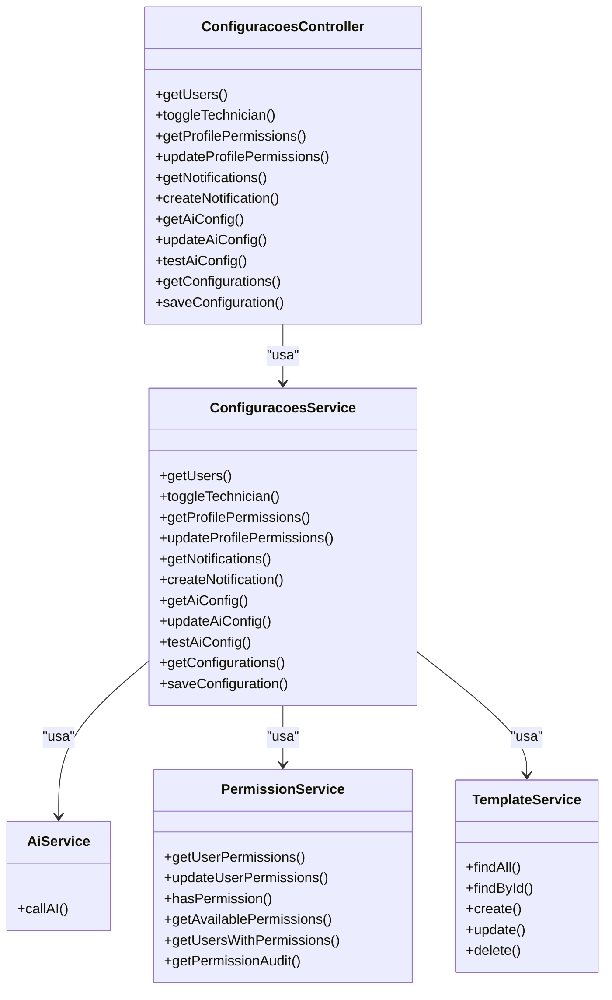
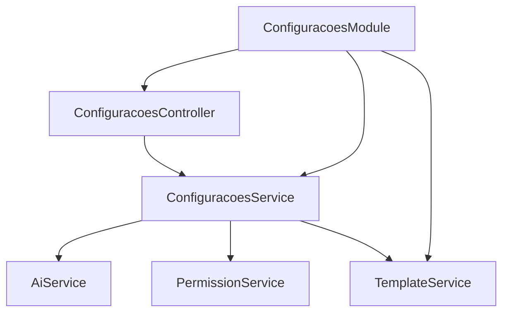

# Parâmetros do Sistema

<cite>
**Arquivos referenciados neste documento**
- [configuracoes.controller.ts](file://backend/configuracoes/configuracoes.controller.ts)
- [configuracoes.service.ts](file://backend/configuracoes/configuracoes.service.ts)
- [configuracoes.module.ts](file://backend/configuracoes/configuracoes.module.ts)
- [module.config.json](file://backend/module.config.json)
- [module.json](file://backend/module.json)
- [available-permissions.ts](file://backend/shared/constants/available-permissions.ts)
- [permission.service.ts](file://backend/shared/services/permission.service.ts)
- [template.service.ts](file://backend/shared/services/template.service.ts)
- [ai.service.ts](file://backend/shared/services/ai.service.ts)
- [004_add_tables_os.sql](file://backend/migrations/004_add_tables_os.sql)
- [permissions_seed.sql](file://backend/seeds/permissions_seed.sql)
- [seed.sql](file://backend/seeds/seed.sql)
- [page.tsx](file://frontend/pages/configuracoes/page.tsx)
- [templateService.ts](file://frontend/services/templateService.ts)
</cite>

## Sumário
1. [Introdução](#introdução)
2. [Estrutura do Projeto](#estrutura-do-projeto)
3. [Componentes-Chave](#componentes-chave)
4. [Visão Geral da Arquitetura](#visão-geral-da-arquitetura)
5. [Análise Detalhada dos Componentes](#análise-detalhada-dos-componentes)
6. [Análise de Dependências](#análise-de-dependências)
7. [Considerações de Desempenho](#considerações-de-desempenho)
8. [Guia de Solução de Problemas](#guia-de-solução-de-problemas)
9. [Conclusão](#conclusão)
10. [Apêndices](#apêndices)

## Introdução
Este documento apresenta os parâmetros do sistema do módulo de Ordens de Serviço, descrevendo quais configurações podem ser ajustadas, como elas afetam o comportamento do módulo e quais os impactos de segurança, manutenção e atualizações. São abordados parâmetros de permissões, notificações, templates, integrações com IA e configurações genéricas. Também são fornecidas orientações práticas para leitura, atualização, backup, restauração e upgrades.

## Estrutura do Projeto
O módulo é composto por:
- Backend: controladores, serviços e módulos de configurações, permissões, templates e IA.
- Frontend: página de configurações e serviços para interação com APIs.
- Migrações e sementes: criação de tabelas e dados iniciais relacionados às configurações.

**Diagrama fonte**
- [configuracoes.controller.ts](file://backend/configuracoes/configuracoes.controller.ts#L1-L136)
- [configuracoes.service.ts](file://backend/configuracoes/configuracoes.service.ts#L1-L331)
- [configuracoes.module.ts](file://backend/configuracoes/configuracoes.module.ts#L1-L30)
- [permission.service.ts](file://backend/shared/services/permission.service.ts#L1-L313)
- [ai.service.ts](file://backend/shared/services/ai.service.ts#L1-L91)
- [template.service.ts](file://backend/shared/services/template.service.ts#L1-L104)
- [page.tsx](file://frontend/pages/configuracoes/page.tsx#L1-L800)
- [templateService.ts](file://frontend/services/templateService.ts#L1-L146)

**Seção fonte**
- [configuracoes.controller.ts](file://backend/configuracoes/configuracoes.controller.ts#L1-L136)
- [configuracoes.service.ts](file://backend/configuracoes/configuracoes.service.ts#L1-L331)
- [configuracoes.module.ts](file://backend/configuracoes/configuracoes.module.ts#L1-L30)
- [module.config.json](file://backend/module.config.json#L1-L79)
- [module.json](file://backend/module.json#L1-L48)

## Componentes-Chave
- Controlador de Configurações: expõe endpoints para permissões, notificações, IA e configurações genéricas.
- Serviço de Configurações: persiste e recupera parâmetros em tabelas específicas, incluindo permissões de perfis, notificações e configurações genéricas.
- Serviço de Permissões: fornece permissões disponíveis, verificação de acesso e auditoria.
- Serviço de Templates: gerencia templates de permissões e aplicações.
- Serviço de IA: lida com configurações de integração com provedores de IA e testes de conectividade.
- Frontend: interface para edição de configurações, notificações e IA.

**Seção fonte**
- [configuracoes.controller.ts](file://backend/configuracoes/configuracoes.controller.ts#L1-L136)
- [configuracoes.service.ts](file://backend/configuracoes/configuracoes.service.ts#L1-L331)
- [permission.service.ts](file://backend/shared/services/permission.service.ts#L1-L313)
- [template.service.ts](file://backend/shared/services/template.service.ts#L1-L104)
- [ai.service.ts](file://backend/shared/services/ai.service.ts#L1-L91)
- [page.tsx](file://frontend/pages/configuracoes/page.tsx#L1-L800)

## Visão Geral da Arquitetura
A arquitetura segue um padrão de camadas:
- Camada de apresentação: frontend com páginas e serviços.
- Camada de controle: controladores NestJS protegidos por autenticação JWT.
- Camada de serviço: lógica de negócio e acesso a dados via Prisma.
- Camada de persistência: tabelas no banco de dados com migrações e sementes.

**Diagrama fonte**
- [configuracoes.controller.ts](file://backend/configuracoes/configuracoes.controller.ts#L80-L111)
- [configuracoes.service.ts](file://backend/configuracoes/configuracoes.service.ts#L179-L241)
- [ai.service.ts](file://backend/shared/services/ai.service.ts#L33-L89)

## Análise Detalhada dos Componentes

### Parâmetros de Permissões
- Definição de permissões: constantes disponíveis descrevem recursos e ações (ex: dashboard, clients, products, orders, config).
- Permissões de perfil: armazenadas em uma tabela com tenant_id, profile, permission_id e allowed.
- Permissões por usuário: consultadas e atualizadas com auditoria e cache.
- Perfis pré-definidos: Admin, Técnico e Super Admin com conjuntos de permissões.

Impactos:
- Controle granular de acesso a funcionalidades.
- Auditoria de mudanças e tentativas de acesso negadas.
- Cache de permissões para desempenho.

Segurança:
- Bypass automático para ADMIN e SUPER_ADMIN.
- Auditoria de acesso negado.
- Validação de tenant_id.

Melhores práticas:
- Sempre registrar razão ao alterar permissões.
- Evitar conceder permissões de configurações a usuários não confiáveis.
- Utilizar o mínimo necessário (princípio da menor privilégio).

**Seção fonte**
- [available-permissions.ts](file://backend/shared/constants/available-permissions.ts#L1-L164)
- [permission.service.ts](file://backend/shared/services/permission.service.ts#L1-L313)
- [configuracoes.service.ts](file://backend/configuracoes/configuracoes.service.ts#L68-L137)
- [permissions_seed.sql](file://backend/seeds/permissions_seed.sql#L1-L329)

### Parâmetros de Notificações
- Agendamento de notificações: tabela com campos para título, conteúdo, público-alvo, expressão cron, status e metadados.
- Criação e listagem de notificações programadas.
- Frequência e horário derivados de expressões cron.

Impactos:
- Automatização de lembretes e alertas.
- Personalização por público-alvo (todos, admin, super_admin).

Segurança:
- Validação de dados antes de persistir.
- Controle de acesso via autenticação JWT.

Melhores práticas:
- Testar expressões cron antes de ativar.
- Limitar o volume de notificações para evitar sobrecarga.

**Seção fonte**
- [configuracoes.controller.ts](file://backend/configuracoes/configuracoes.controller.ts#L58-L78)
- [configuracoes.service.ts](file://backend/configuracoes/configuracoes.service.ts#L139-L177)
- [004_add_tables_os.sql](file://backend/migrations/004_add_tables_os.sql#L18-L32)

### Parâmetros de Templates
- Templates de permissões: armazenados em tabela com nome, descrição e tipo.
- Operações CRUD de templates com histórico de quem criou/atualizou.
- Aplicação de templates a usuários.

Impactos:
- Padronização de permissões por perfis.
- Facilita a gestão de grandes grupos de usuários.

Segurança:
- Controle de acesso a operações de gerenciamento de templates.
- Auditoria de alterações.

Melhores práticas:
- Manter templates atualizados e revisados periodicamente.
- Fazer backup antes de apagar templates.

**Seção fonte**
- [template.service.ts](file://backend/shared/services/template.service.ts#L1-L104)
- [permissions_seed.sql](file://backend/seeds/permissions_seed.sql#L12-L16)

### Parâmetros de Integração com IA
- Configuração de IA: chave de API, provedor (OpenAI/OpenRouter), modelo, temperatura, tokens máximos e status de ativação.
- Máscara de chave de API nos retornos.
- Teste de configuração com chamada real à API.

Impactos:
- Habilita ou desabilita funcionalidades baseadas em IA.
- Ajusta qualidade e custo da geração de conteúdo.

Segurança:
- Máscara de chave de API nos retornos.
- Validação de presença de chave e ativação.
- Uso seguro de credenciais.

Melhores práticas:
- Armazenar somente a chave necessária.
- Testar antes de ativar em produção.
- Monitorar erros e logs de chamadas.

**Seção fonte**
- [configuracoes.controller.ts](file://backend/configuracoes/configuracoes.controller.ts#L80-L111)
- [configuracoes.service.ts](file://backend/configuracoes/configuracoes.service.ts#L179-L281)
- [ai.service.ts](file://backend/shared/services/ai.service.ts#L15-L91)
- [page.tsx](file://frontend/pages/configuracoes/page.tsx#L380-L541)

### Parâmetros Genéricos
- Armazenamento de configurações em formato chave-valor com tenant_id.
- Leitura e escrita de qualquer parâmetro genérico.
- Exemplo: condições de execução usadas em impressões.

Impactos:
- Flexibilidade para adicionar novas opções sem alterar o schema.
- Persistência por inquilino (tenant).

Segurança:
- Validação de dados antes de persistir.
- Controle de acesso via autenticação.

Melhores práticas:
- Padronizar nomes de chaves.
- Documentar os significados das chaves.

**Seção fonte**
- [configuracoes.controller.ts](file://backend/configuracoes/configuracoes.controller.ts#L115-L135)
- [configuracoes.service.ts](file://backend/configuracoes/configuracoes.service.ts#L283-L330)
- [004_add_tables_os.sql](file://backend/migrations/004_add_tables_os.sql#L66-L78)
- [seed.sql](file://backend/seeds/seed.sql#L1-L18)

### Exemplos de Leitura e Atualização de Parâmetros
- Leitura de configurações de IA:
  - Endpoint: GET /api/ordem_servico/config/ai
  - Fonte: [configuracoes.controller.ts](file://backend/configuracoes/configuracoes.controller.ts#L80-L89)
  - Lógica: [configuracoes.service.ts](file://backend/configuracoes/configuracoes.service.ts#L179-L203)
- Atualização de configurações de IA:
  - Endpoint: POST /api/ordem_servico/config/ai
  - Fonte: [configuracoes.controller.ts](file://backend/configuracoes/configuracoes.controller.ts#L91-L100)
  - Lógica: [configuracoes.service.ts](file://backend/configuracoes/configuracoes.service.ts#L205-L241)
- Teste de configurações de IA:
  - Endpoint: POST /api/ordem_servico/config/ai/test
  - Fonte: [configuracoes.controller.ts](file://backend/configuracoes/configuracoes.controller.ts#L102-L111)
  - Lógica: [configuracoes.service.ts](file://backend/configuracoes/configuracoes.service.ts#L254-L281)
- Leitura de configurações genéricas:
  - Endpoint: GET /api/ordem_servico/config/settings
  - Fonte: [configuracoes.controller.ts](file://backend/configuracoes/configuracoes.controller.ts#L115-L124)
  - Lógica: [configuracoes.service.ts](file://backend/configuracoes/configuracoes.service.ts#L283-L296)
- Atualização de configurações genéricas:
  - Endpoint: POST /api/ordem_servico/config/settings
  - Fonte: [configuracoes.controller.ts](file://backend/configuracoes/configuracoes.controller.ts#L126-L135)
  - Lógica: [configuracoes.service.ts](file://backend/configuracoes/configuracoes.service.ts#L299-L330)

**Seção fonte**
- [configuracoes.controller.ts](file://backend/configuracoes/configuracoes.controller.ts#L80-L135)
- [configuracoes.service.ts](file://backend/configuracoes/configuracoes.service.ts#L179-L330)

### Importância de Cada Parâmetro e Impactos
- Permissões:
  - Importante: controle de acesso e conformidade.
  - Impacto: protege dados sensíveis e evita ações não autorizadas.
- Notificações:
  - Importante: comunicação automática e produtividade.
  - Impacto: melhora a experiência do usuário e mantém informações atualizadas.
- Templates:
  - Importante: padronização de permissões.
  - Impacto: reduz erros humanos e facilita escalabilidade.
- IA:
  - Importante: funcionalidades avançadas de geração de conteúdo.
  - Impacto: pode aumentar eficiência mas requer configuração segura.
- Configurações genéricas:
  - Importante: flexibilidade de funcionalidades.
  - Impacto: permite adaptações sem alterações no código.

## Visão Geral da Arquitetura

**Diagrama fonte**
- [configuracoes.controller.ts](file://backend/configuracoes/configuracoes.controller.ts#L1-L136)
- [configuracoes.service.ts](file://backend/configuracoes/configuracoes.service.ts#L1-L331)
- [permission.service.ts](file://backend/shared/services/permission.service.ts#L1-L313)
- [ai.service.ts](file://backend/shared/services/ai.service.ts#L1-L91)
- [template.service.ts](file://backend/shared/services/template.service.ts#L1-L104)

## Análise de Dependências

**Diagrama fonte**
- [configuracoes.module.ts](file://backend/configuracoes/configuracoes.module.ts#L12-L29)
- [configuracoes.controller.ts](file://backend/configuracoes/configuracoes.controller.ts#L1-L136)
- [configuracoes.service.ts](file://backend/configuracoes/configuracoes.service.ts#L1-L331)

**Seção fonte**
- [configuracoes.module.ts](file://backend/configuracoes/configuracoes.module.ts#L1-L30)

## Considerações de Desempenho
- Cache de permissões: cache com TTL para reduzir consultas ao banco.
- Consultas otimizadas: uso de raw queries com parâmetros para evitar injeção e melhorar desempenho.
- Auditoria: operações de auditoria devem ser feitas de forma assíncrona ou com índices adequados.

[Sem fonte específica, pois esta seção fornece orientações gerais]

## Guia de Solução de Problemas
- Erros de permissão:
  - Verifique se o usuário possui o papel ADMIN/SUPER_ADMIN ou permissões específicas.
  - Confira auditoria de acesso negado.
- Erros de IA:
  - Valide chave de API, provedor e configurações.
  - Teste a configuração antes de ativar.
- Erros de notificações:
  - Revise expressões cron e público-alvo.
  - Confira status e mensagens de erro.

**Seção fonte**
- [permission.service.ts](file://backend/shared/services/permission.service.ts#L131-L162)
- [configuracoes.service.ts](file://backend/configuracoes/configuracoes.service.ts#L254-L281)

## Conclusão
Os parâmetros do sistema permitem um controle refinado sobre permissões, notificações, templates e integrações com IA, além de uma base de configurações genéricas. A segurança é reforçada com máscaras de chaves, auditoria e bypass automático para papéis privilegiados. Para manutenção, recomenda-se seguir práticas de backup, testes rigorosos e atualizações planejadas com migrações.

[Sem fonte específica, pois esta seção resume sem análise de arquivos]

## Apêndices

### Tabelas e Chaves de Configuração
- Tabela de configurações: mod_ordem_servico_configs
  - Campos: tenant_id, key, value, created_at, updated_at
  - Exemplos: module_enabled, version, condicoes_execucao
- Tabela de permissões de perfil: mod_ordem_servico_profile_permissions
  - Campos: tenant_id, profile, permission_id, allowed
- Tabela de notificações agendadas: mod_ordemservico_notification_schedules
  - Campos: tenant_id, ordem_id, type, scheduled_for, status, metadata
- Tabela de templates: mod_ordem_servico_templates
  - Campos: tenant_id, name, content, type, created_by

**Seção fonte**
- [004_add_tables_os.sql](file://backend/migrations/004_add_tables_os.sql#L6-L32)
- [seed.sql](file://backend/seeds/seed.sql#L1-L18)

### Diretrizes de Backup e Restauração
- Backup:
  - Exportar tabelas de configurações e permissões.
  - Armazenar em local seguro e criptografado.
- Restauração:
  - Importar dados em ambiente de teste primeiro.
  - Validar permissões e integrações após restauração.
- Atualizações:
  - Rodar migrações antes de atualizar a versão.
  - Fazer backup antes de realizar upgrades.

[Sem fonte específica, pois esta seção fornece orientações gerais]

### Melhores Práticas para Manutenção de Configurações
- Documentar todas as chaves de configuração.
- Utilizar o mínimo necessário de permissões.
- Testar alterações em ambiente de homologação.
- Manter logs de auditoria sempre ativos.

[Sem fonte específica, pois esta seção fornece orientações gerais]