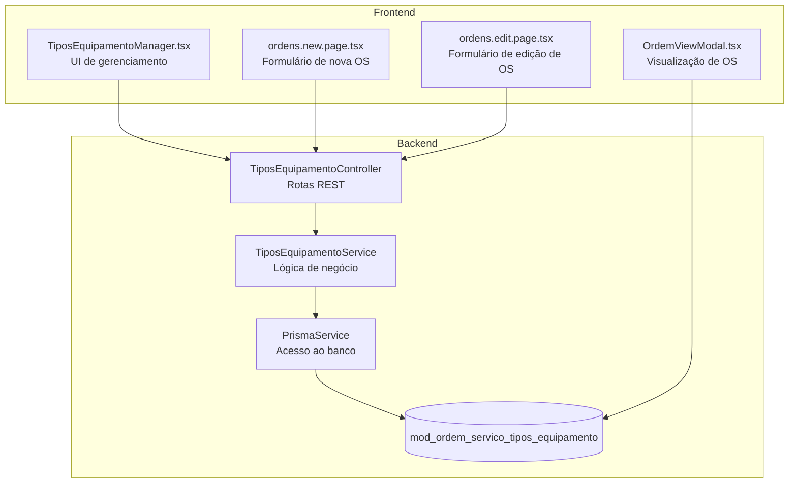
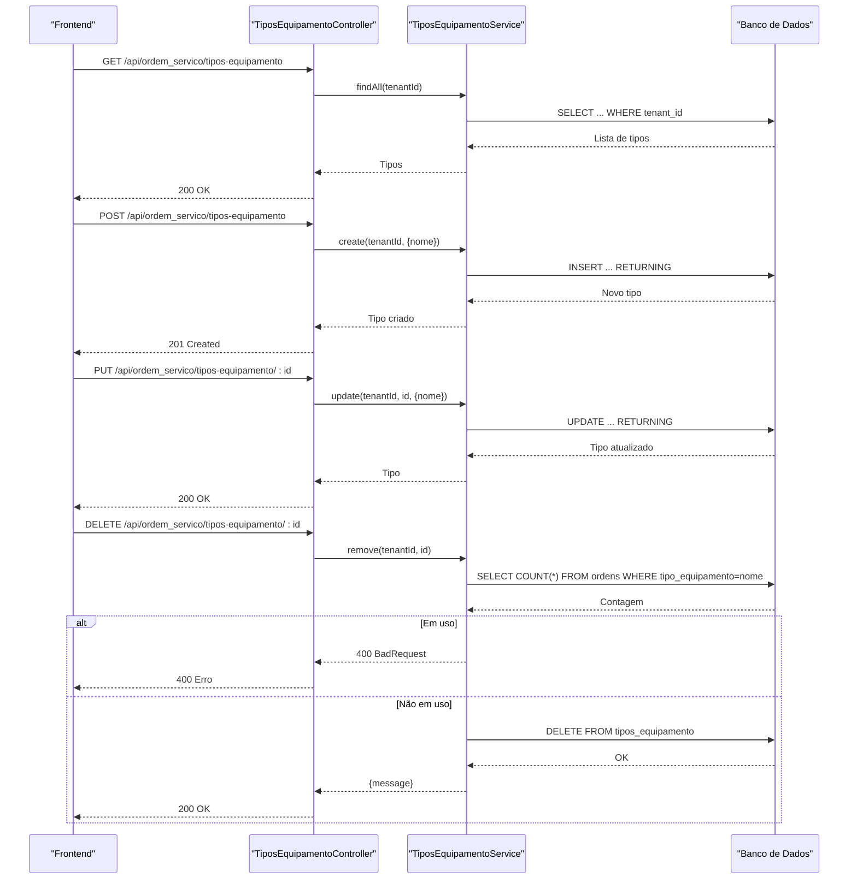
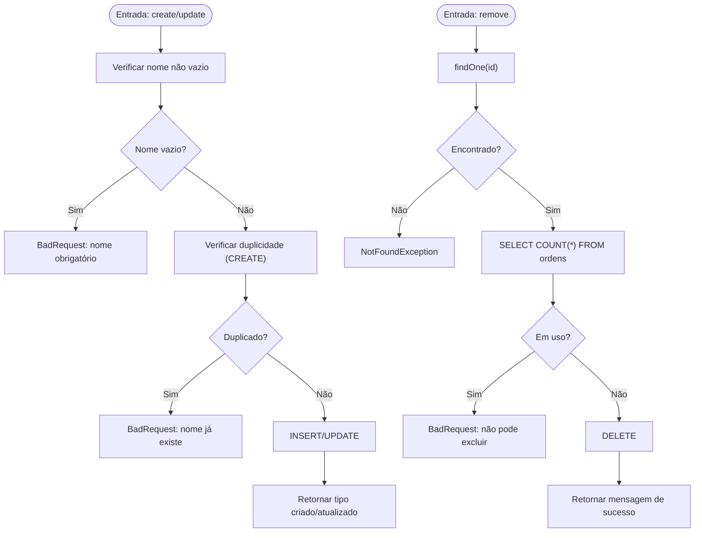
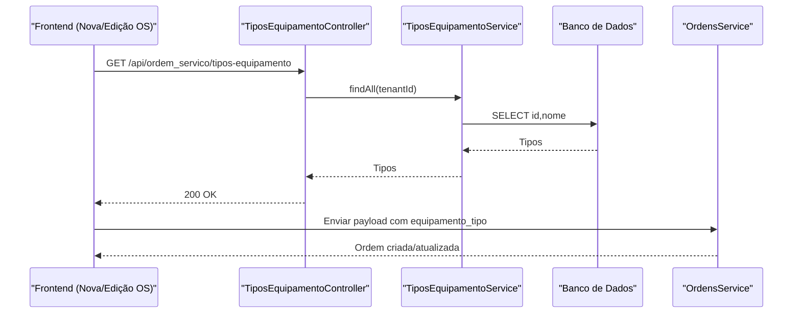
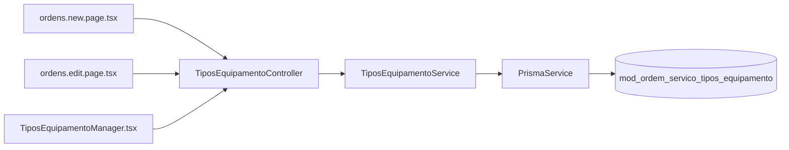

# Tipos de Equipamentos

<cite>
**Arquivos Referenciados Neste Documento**
- [tipos-equipamento.controller.ts](file://backend/configuracoes/tipos-equipamento.controller.ts)
- [tipos-equipamento.service.ts](file://backend/configuracoes/tipos-equipamento.service.ts)
- [TiposEquipamentoManager.tsx](file://frontend/components/TiposEquipamentoManager.tsx)
- [001_master.sql](file://backend/migrations/001_master.sql)
- [004_add_tables_os.sql](file://backend/migrations/004_add_tables_os.sql)
- [ordens.service.ts](file://backend/ordens/ordens.service.ts)
- [ordem-servico.dto.ts](file://backend/shared/dto/ordem-servico.dto.ts)
- [ordens.new.page.tsx](file://frontend/pages/ordens/new/page.tsx)
- [ordens.edit.page.tsx](file://frontend/pages/ordens/edit/page.tsx)
- [ordens.view.modal.tsx](file://frontend/components/OrdemViewModal.tsx)
- [ordem-servico.types.ts](file://frontend/types/ordem-servico.types.ts)
- [ordem-servico-config.controller.ts](file://backend/core/ordem-servico-config.controller.ts)
</cite>

## Sumário
1. [Introdução](#introdução)
2. [Estrutura do Projeto](#estrutura-do-projeto)
3. [Componentes Principais](#componentes-principais)
4. [Visão Geral da Arquitetura](#visão-geral-da-arquitetura)
5. [Análise Detalhada dos Componentes](#análise-detalhada-dos-componentes)
6. [Análise de Dependências](#análise-de-dependências)
7. [Considerações de Desempenho](#considerações-de-desempenho)
8. [Guia de Solução de Problemas](#guia-de-solução-de-problemas)
9. [Conclusão](#conclusão)
10. [Apêndices](#apêndices)

## Introdução
O módulo de tipos de equipamentos permite gerenciar os tipos de equipamentos disponíveis no sistema de ordens de serviço. Ele fornece operações CRUD completas (listagem, consulta individual, criação, atualização e exclusão) com validações de dados e integração com o módulo de ordens de serviço. Os tipos são utilizados para padronizar a identificação de equipamentos nas ordens, facilitando relatórios, buscas e geração de documentos.

## Estrutura do Projeto
O módulo está distribuído entre backend e frontend, com persistência em banco de dados PostgreSQL e migrações que definem a estrutura da tabela de tipos de equipamento.

**Diagrama fonte**
- [tipos-equipamento.controller.ts](file://backend/configuracoes/tipos-equipamento.controller.ts#L1-L39)
- [tipos-equipamento.service.ts](file://backend/configuracoes/tipos-equipamento.service.ts#L1-L123)
- [TiposEquipamentoManager.tsx](file://frontend/components/TiposEquipamentoManager.tsx#L1-L370)
- [ordens.new.page.tsx](file://frontend/pages/ordens/new/page.tsx#L1022-L1058)
- [ordens.edit.page.tsx](file://frontend/pages/ordens/edit/page.tsx#L1163-L1177)
- [ordens.view.modal.tsx](file://frontend/components/OrdemViewModal.tsx#L180-L220)

**Seção fonte**
- [tipos-equipamento.controller.ts](file://backend/configuracoes/tipos-equipamento.controller.ts#L1-L39)
- [tipos-equipamento.service.ts](file://backend/configuracoes/tipos-equipamento.service.ts#L1-L123)
- [TiposEquipamentoManager.tsx](file://frontend/components/TiposEquipamentoManager.tsx#L1-L370)
- [001_master.sql](file://backend/migrations/001_master.sql#L288-L299)

## Componentes Principais
- Controlador REST: expõe endpoints para CRUD de tipos de equipamentos com autenticação JWT.
- Serviço: implementa regras de negócio, validações e interações com o banco de dados.
- Frontend: componentes de gerenciamento e formulários de ordem de serviço que consomem os tipos.

**Seção fonte**
- [tipos-equipamento.controller.ts](file://backend/configuracoes/tipos-equipamento.controller.ts#L1-L39)
- [tipos-equipamento.service.ts](file://backend/configuracoes/tipos-equipamento.service.ts#L1-L123)
- [TiposEquipamentoManager.tsx](file://frontend/components/TiposEquipamentoManager.tsx#L195-L370)

## Visão Geral da Arquitetura
O fluxo típico de uma operação CRUD segue o caminho: frontend → controlador → serviço → banco de dados. A exclusão verifica dependências antes de remover registros.

**Diagrama fonte**
- [tipos-equipamento.controller.ts](file://backend/configuracoes/tipos-equipamento.controller.ts#L10-L38)
- [tipos-equipamento.service.ts](file://backend/configuracoes/tipos-equipamento.service.ts#L8-L122)

## Análise Detalhada dos Componentes

### Controlador de Tipos de Equipamentos
- Rotas REST expostas sob `/api/ordem_servico/tipos-equipamento`.
- Autenticação JWT obrigatória.
- Extração do tenantId do usuário logado ou do cabeçalho `x-tenant-id`.
- Métodos: findAll, findOne, create, update, remove.

**Seção fonte**
- [tipos-equipamento.controller.ts](file://backend/configuracoes/tipos-equipamento.controller.ts#L5-L39)

### Serviço de Tipos de Equipamentos
- Consultas usando raw queries com template literals.
- Validações:
  - Nome obrigatório.
  - Unicidade de nome por tenant.
  - Exclusão verificando uso em ordens de serviço.
- Retornos padronizados com id, nome e created_at.

**Diagrama fonte**
- [tipos-equipamento.service.ts](file://backend/configuracoes/tipos-equipamento.service.ts#L33-L122)

**Seção fonte**
- [tipos-equipamento.service.ts](file://backend/configuracoes/tipos-equipamento.service.ts#L1-L123)

### Frontend: Gerenciador de Tipos de Equipamentos
- Componente React com estado local para gerenciar tipos.
- Chamadas HTTP para os mesmos endpoints REST do backend.
- Validação local de campos obrigatórios.
- Integração com Toast para feedback de erro/sucesso.

**Seção fonte**
- [TiposEquipamentoManager.tsx](file://frontend/components/TiposEquipamentoManager.tsx#L195-L370)

### Tabela de Tipos de Equipamentos
- Estrutura: id (UUID), tenant_id, nome (único por tenant), created_at.
- Índices: tenant_id, nome único.

**Seção fonte**
- [001_master.sql](file://backend/migrations/001_master.sql#L288-L299)
- [001_master.sql](file://backend/migrations/001_master.sql#L388-L390)

### Utilização nos Tipos de Serviço (exemplo de uso semelhante)
- O controlador de configurações também expõe endpoints para tipos de serviço, demonstrando o padrão de uso de nomes como valores associados a ordens de serviço.

**Seção fonte**
- [ordem-servico-config.controller.ts](file://backend/core/ordem-servico-config.controller.ts#L104-L144)

### Integração com Ordens de Serviço
- Na criação/edição de ordens, o campo `equipamento_tipo` é preenchido com o nome do tipo de equipamento selecionado.
- No frontend, os formulários de nova e edição de OS carregam os tipos e permitem seleção.
- Na visualização de OS, o tipo aparece nos detalhes do equipamento.

**Diagrama fonte**
- [ordens.new.page.tsx](file://frontend/pages/ordens/new/page.tsx#L1034-L1050)
- [ordens.edit.page.tsx](file://frontend/pages/ordens/edit/page.tsx#L1163-L1177)
- [ordens.service.ts](file://backend/ordens/ordens.service.ts#L571-L599)

**Seção fonte**
- [ordens.new.page.tsx](file://frontend/pages/ordens/new/page.tsx#L1022-L1058)
- [ordens.edit.page.tsx](file://frontend/pages/ordens/edit/page.tsx#L1163-L1177)
- [ordens.view.modal.tsx](file://frontend/components/OrdemViewModal.tsx#L180-L220)
- [ordem-servico.dto.ts](file://backend/shared/dto/ordem-servico.dto.ts#L78-L101)
- [ordem-servico.types.ts](file://frontend/types/ordem-servico.types.ts#L1-L224)

## Análise de Dependências
- Backend:
  - Controlador depende do serviço.
  - Serviço depende do PrismaService e do banco de dados.
- Frontend:
  - Componentes de ordem consomem os mesmos endpoints REST.
  - Tipos de equipamento são carregados e usados em formulários de OS.

**Diagrama fonte**
- [tipos-equipamento.controller.ts](file://backend/configuracoes/tipos-equipamento.controller.ts#L1-L39)
- [tipos-equipamento.service.ts](file://backend/configuracoes/tipos-equipamento.service.ts#L1-L123)
- [ordens.new.page.tsx](file://frontend/pages/ordens/new/page.tsx#L1022-L1058)
- [ordens.edit.page.tsx](file://frontend/pages/ordens/edit/page.tsx#L1163-L1177)
- [TiposEquipamentoManager.tsx](file://frontend/components/TiposEquipamentoManager.tsx#L209-L250)

**Seção fonte**
- [tipos-equipamento.controller.ts](file://backend/configuracoes/tipos-equipamento.controller.ts#L1-L39)
- [tipos-equipamento.service.ts](file://backend/configuracoes/tipos-equipamento.service.ts#L1-L123)
- [ordens.new.page.tsx](file://frontend/pages/ordens/new/page.tsx#L1022-L1058)
- [ordens.edit.page.tsx](file://frontend/pages/ordens/edit/page.tsx#L1163-L1177)
- [TiposEquipamentoManager.tsx](file://frontend/components/TiposEquipamentoManager.tsx#L209-L250)

## Considerações de Desempenho
- Persistência:
  - Queries com `ORDER BY nome ASC` e índices em `tenant_id` ajudam na performance de listagem.
  - Índice único em `(tenant_id, nome)` evita duplicidades com baixo custo.
- Frontend:
  - Carregamento assíncrono com estados de loading e feedback visual.
  - Validações locais reduzem chamadas desnecessárias.

[Sem fontes, pois esta seção fornece orientações gerais]

## Guia de Solução de Problemas
- Erros comuns:
  - 400 BadRequest: nome obrigatório ou nome duplicado.
  - 404 NotFound: tipo não encontrado.
  - 400 BadRequest ao excluir: tipo sendo usado em ordens de serviço.
- Diagnóstico:
  - Verifique se o campo `nome` está presente e único.
  - Confirme que o `tenantId` está presente no cabeçalho ou no usuário logado.
  - Antes de excluir, verifique se o tipo não está sendo referenciado em registros de ordens.

**Seção fonte**
- [tipos-equipamento.service.ts](file://backend/configuracoes/tipos-equipamento.service.ts#L36-L48)
- [tipos-equipamento.service.ts](file://backend/configuracoes/tipos-equipamento.service.ts#L95-L122)

## Conclusão
O módulo de tipos de equipamentos oferece uma implementação sólida e eficiente para gerenciar categorias de equipamentos, integrando-se diretamente às ordens de serviço. Com validações adequadas, controle de dependências e uma interface amigável no frontend, ele facilita a padronização e o acompanhamento de equipamentos no fluxo de trabalho.

[Sem fontes, pois esta seção resume sem análise específica de arquivos]

## Apêndices

### Endpoints REST
- GET `/api/ordem_servico/tipos-equipamento`
  - Parâmetros: nenhum (tenantId extraído do contexto).
  - Resposta: array de objetos com id, nome, created_at.
- GET `/api/ordem_servico/tipos-equipamento/:id`
  - Resposta: objeto com id, nome, created_at.
- POST `/api/ordem_servico/tipos-equipamento`
  - Corpo: `{ nome: string }`.
  - Resposta: objeto criado.
- PUT `/api/ordem_servico/tipos-equipamento/:id`
  - Corpo: `{ nome: string }`.
  - Resposta: objeto atualizado.
- DELETE `/api/ordem_servico/tipos-equipamento/:id`
  - Resposta: `{ message: string }`.

**Seção fonte**
- [tipos-equipamento.controller.ts](file://backend/configuracoes/tipos-equipamento.controller.ts#L10-L38)

### Campos Obrigatórios e Validações
- Nome:
  - Obrigatório em criação e atualização.
  - Único por tenant (verificação de duplicidade).
- Uso em ordens:
  - Exclusão bloqueada se o tipo estiver sendo usado em registros de ordens.

**Seção fonte**
- [tipos-equipamento.service.ts](file://backend/configuracoes/tipos-equipamento.service.ts#L33-L93)

### Exemplos de Uso
- Criar um tipo de equipamento:
  - Frontend: preencher o campo “Nome” e enviar POST para `/api/ordem_servico/tipos-equipamento`.
  - Backend: validação de nome e unicidade, inserção e retorno.
- Atualizar um tipo de equipamento:
  - Frontend: selecionar um tipo e enviar PUT para `/api/ordem_servico/tipos-equipamento/:id`.
  - Backend: validação de existência, verificação de duplicidade e atualização.
- Deletar um tipo de equipamento:
  - Frontend: confirmar exclusão e enviar DELETE para `/api/ordem_servico/tipos-equipamento/:id`.
  - Backend: verificação de uso e remoção.

**Seção fonte**
- [TiposEquipamentoManager.tsx](file://frontend/components/TiposEquipamentoManager.tsx#L226-L284)
- [tipos-equipamento.controller.ts](file://backend/configuracoes/tipos-equipamento.controller.ts#L22-L38)
- [tipos-equipamento.service.ts](file://backend/configuracoes/tipos-equipamento.service.ts#L95-L122)

### Relacionamentos com Outros Módulos
- Módulo de Ordens de Serviço:
  - Campo `equipamento_tipo` armazena o nome do tipo de equipamento.
  - Utilizado em formulários, visualização e geração de documentos.
- Módulo de Configurações:
  - Também expõe endpoints semelhantes para tipos de serviço, demonstrando o padrão de uso de nomes como valores associados.

**Seção fonte**
- [ordem-servico.dto.ts](file://backend/shared/dto/ordem-servico.dto.ts#L78-L101)
- [ordens.view.modal.tsx](file://frontend/components/OrdemViewModal.tsx#L180-L220)
- [ordem-servico-config.controller.ts](file://backend/core/ordem-servico-config.controller.ts#L104-L144)

### Boas Práticas
- Manutenção:
  - Evite excluir tipos em uso; atualize registros antes de remover.
  - Mantenha nomes claros e consistentes.
- Expansão:
  - Para novos campos, adicione índices e validações no serviço.
  - Reutilize o padrão de endpoints REST e validações já implementados.

[Sem fontes, pois esta seção fornece orientações gerais]