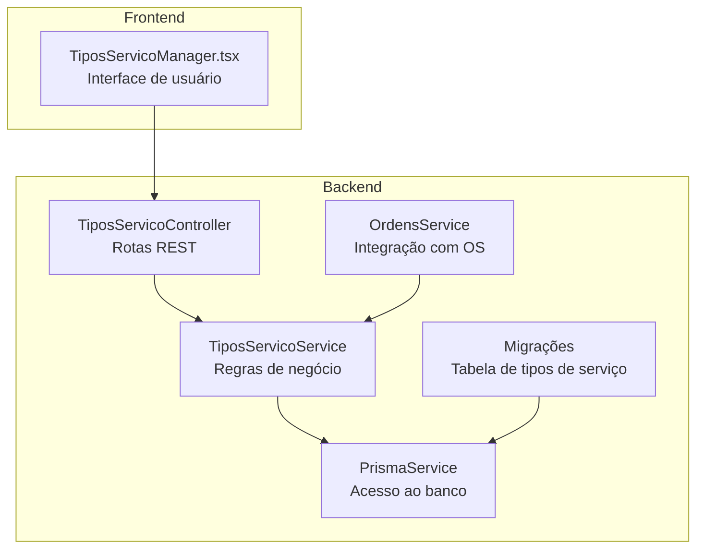
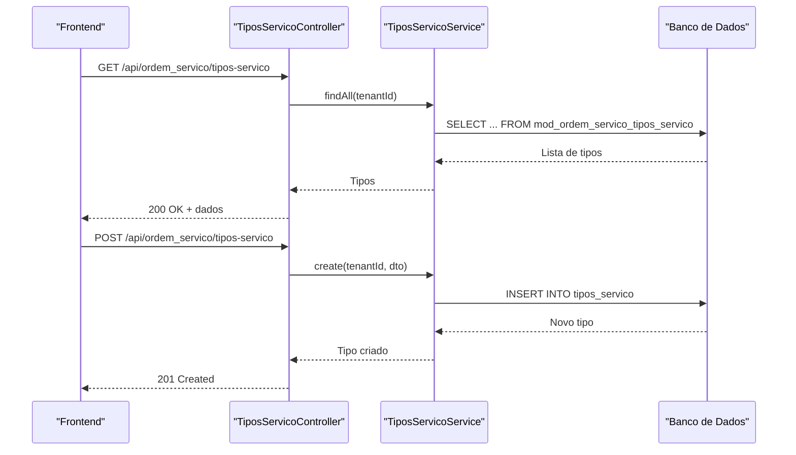
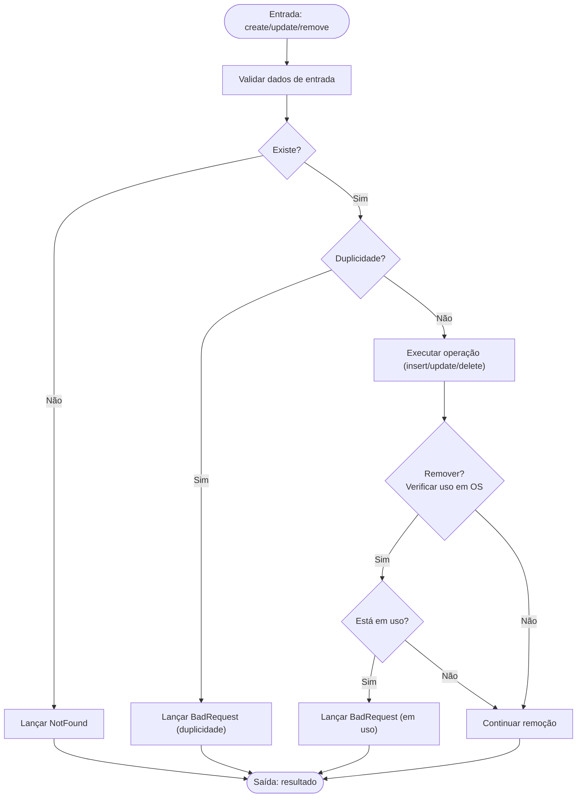
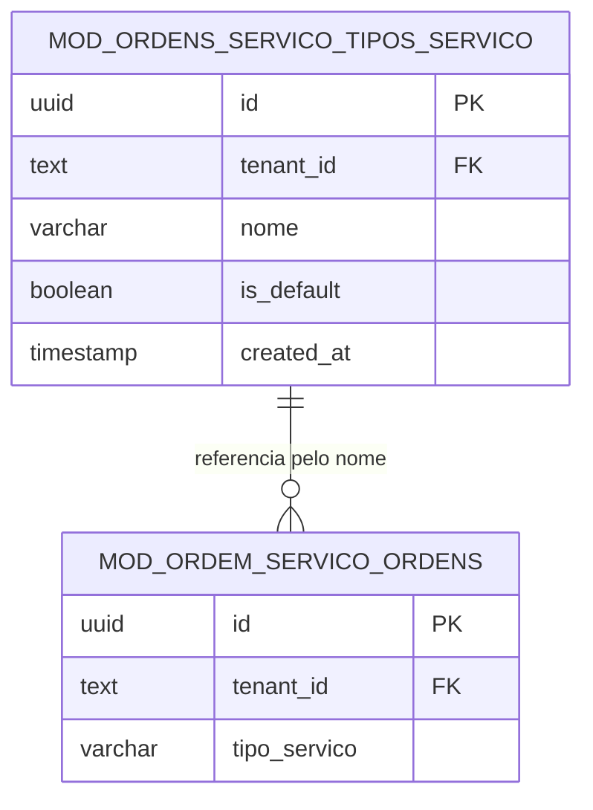

# Tipos de Serviços

<cite>
**Arquivos Referenciados neste Documento**
- [tipos-servico.controller.ts](file://backend/configuracoes/tipos-servico.controller.ts)
- [tipos-servico.service.ts](file://backend/configuracoes/tipos-servico.service.ts)
- [TiposServicoManager.tsx](file://frontend/components/TiposServicoManager.tsx)
- [ordens.service.ts](file://backend/ordens/ordens.service.ts)
- [ordem-servico.dto.ts](file://backend/shared/dto/ordem-servico.dto.ts)
- [001_master.sql](file://backend/migrations/001_master.sql)
- [004_add_tables_os.sql](file://backend/migrations/004_add_tables_os.sql)
- [configuracoes.module.ts](file://backend/configuracoes/configuracoes.module.ts)
- [configuracoes.controller.ts](file://backend/configuracoes/configuracoes.controller.ts)
</cite>

## Sumário
1. [Introdução](#introdução)
2. [Estrutura do Projeto](#estrutura-do-projeto)
3. [Componentes Principais](#componentes-principais)
4. [Visão Geral da Arquitetura](#visão-geral-da-arquitetura)
5. [Análise Detalhada dos Componentes](#análise-detalhada-dos-componentes)
6. [Relacionamentos e Integrações](#relacionamentos-e-integrações)
7. [Considerações de Desempenho](#considerações-de-desempenho)
8. [Guia de Resolução de Problemas](#guia-de-resolução-de-problemas)
9. [Conclusão](#conclusão)
10. [Apêndices](#apêndices)

## Introdução
O módulo de tipos de serviços permite gerenciar categorias de serviços dentro do sistema de ordens de serviço. Ele fornece operações CRUD completas, validações específicas e integrações diretas com o cadastro de ordens. Este documento explica a implementação do controller e service, as APIs REST, como os tipos influenciam a criação de ordens e quais campos são críticos, além de orientações para expansão e customização.

## Estrutura do Projeto
O módulo de tipos de serviços está localizado no backend sob a pasta de configurações e é consumido tanto pelo backend quanto pelo frontend. Ele se integra com o módulo de ordens de serviço e utiliza o mecanismo de migrações para criar e manter a estrutura de dados.

**Diagrama fonte**
- [tipos-servico.controller.ts](file://backend/configuracoes/tipos-servico.controller.ts#L1-L39)
- [tipos-servico.service.ts](file://backend/configuracoes/tipos-servico.service.ts#L1-L128)
- [001_master.sql](file://backend/migrations/001_master.sql#L274-L286)
- [TiposServicoManager.tsx](file://frontend/components/TiposServicoManager.tsx#L1-L407)

**Seção fonte**
- [configuracoes.module.ts](file://backend/configuracoes/configuracoes.module.ts#L1-L30)
- [configuracoes.controller.ts](file://backend/configuracoes/configuracoes.controller.ts#L1-L136)

## Componentes Principais
- Controller de Tipos de Serviço: expõe endpoints REST para consulta, criação, atualização e remoção de tipos de serviço.
- Service de Tipos de Serviço: implementa regras de negócio, validações e interações com o banco de dados.
- Frontend: componente React que consome os endpoints REST e apresenta a interface de gerenciamento.
- Migrações: estrutura de dados persistida no banco, incluindo índices e dados padrão.
- Integração com Ordens: o campo tipo_servico nas ordens se relaciona com os tipos cadastrados.

**Seção fonte**
- [tipos-servico.controller.ts](file://backend/configuracoes/tipos-servico.controller.ts#L1-L39)
- [tipos-servico.service.ts](file://backend/configuracoes/tipos-servico.service.ts#L1-L128)
- [TiposServicoManager.tsx](file://frontend/components/TiposServicoManager.tsx#L1-L407)
- [001_master.sql](file://backend/migrations/001_master.sql#L274-L286)

## Visão Geral da Arquitetura
A arquitetura segue o padrão NestJS com controller-service e acesso ao banco via Prisma. O frontend consome endpoints REST protegidos por autenticação JWT. As migrações garantem a existência da tabela de tipos de serviço e seus dados padrão.

**Diagrama fonte**
- [tipos-servico.controller.ts](file://backend/configuracoes/tipos-servico.controller.ts#L10-L38)
- [tipos-servico.service.ts](file://backend/configuracoes/tipos-servico.service.ts#L8-L57)
- [TiposServicoManager.tsx](file://frontend/components/TiposServicoManager.tsx#L230-L279)

## Análise Detalhada dos Componentes

### Controller de Tipos de Serviço
- Rotas REST expostas:
  - GET /api/ordem_servico/tipos-servico: lista todos os tipos de serviço de um tenant.
  - GET /api/ordem_servico/tipos-servico/:id: consulta um tipo específico.
  - POST /api/ordem_servico/tipos-servico: cria um novo tipo.
  - PUT /api/ordem_servico/tipos-servico/:id: atualiza um tipo existente.
  - DELETE /api/ordem_servico/tipos-servico/:id: remove um tipo.
- Autenticação: todas as rotas exigem JWT via guard.
- Tenant: o tenantId é obtido do token ou do cabeçalho x-tenant-id.

**Seção fonte**
- [tipos-servico.controller.ts](file://backend/configuracoes/tipos-servico.controller.ts#L1-L39)

### Service de Tipos de Serviço
- findAll: retorna tipos ordenados por tipo padrão e nome.
- findOne: busca um tipo pelo id e lança exceção se não encontrado.
- create: valida presença do nome, evita duplicidade e insere com is_default=false.
- update: valida existência, nome obrigatório e unicidade ao alterar o nome.
- remove: impede exclusão de tipos padrão e quando ainda estiver em uso nas ordens.

**Diagrama fonte**
- [tipos-servico.service.ts](file://backend/configuracoes/tipos-servico.service.ts#L33-L127)

**Seção fonte**
- [tipos-servico.service.ts](file://backend/configuracoes/tipos-servico.service.ts#L1-L128)

### Frontend: Gerenciador de Tipos de Serviço
- Carrega tipos via GET /api/ordem_servico/tipos-servico.
- Permite criar/atualizar tipos com POST/PUT.
- Impede exclusão de tipos padrão e confirma antes de remover.
- Exibe badges para tipos padrão e mensagens de erro/sucesso.

**Seção fonte**
- [TiposServicoManager.tsx](file://frontend/components/TiposServicoManager.tsx#L1-L407)

### Migrações e Estrutura de Dados
- Tabela: mod_ordem_servico_tipos_servico com campos id, tenant_id, nome, is_default, created_at.
- Restrições: chave estrangeira para tenants e unique (tenant_id, nome).
- Dados padrão: inserção automática de tipos “Formatação” e “Manutenção” para novos tenants.
- Índices: otimização de consultas por tenant.

**Seção fonte**
- [001_master.sql](file://backend/migrations/001_master.sql#L274-L286)
- [001_master.sql](file://backend/migrations/001_master.sql#L433-L455)

## Relacionamentos e Integrações

### Com o Módulo de Ordens de Serviço
- O campo tipo_servico nas ordens armazena o nome do tipo de serviço associado.
- Na criação de ordens, o valor do campo tipo_servico é passado diretamente como string.
- Na listagem de ordens, há filtro por tipo_servico.

**Diagrama fonte**
- [001_master.sql](file://backend/migrations/001_master.sql#L274-L286)
- [ordens.service.ts](file://backend/ordens/ordens.service.ts#L275-L279)

**Seção fonte**
- [ordens.service.ts](file://backend/ordens/ordens.service.ts#L275-L279)
- [ordem-servico.dto.ts](file://backend/shared/dto/ordem-servico.dto.ts#L32-L33)

### Com o Módulo de Produtos
- O módulo de produtos possui sua própria tabela e lógica de CRUD, separada dos tipos de serviço.
- Ambos são parte do módulo de ordem de serviço, mas atuam em contextos distintos (categorias de serviço vs itens vendidos).

**Seção fonte**
- [produtos.service.ts](file://backend/produtos/produtos.service.ts#L1-L169)

### Com o Módulo de Configurações
- O controller de configurações expõe endpoints diversos, mas os tipos de serviço são gerenciados especificamente pelos controladores de tipos de serviço e equipamento.

**Seção fonte**
- [configuracoes.controller.ts](file://backend/configuracoes/configuracoes.controller.ts#L1-L136)

## Considerações de Desempenho
- Consultas: a ordenação por is_default e nome, combinada com índice no tenant, melhora a performance de listagens.
- Validações: checagens de unicidade e uso em ordens ocorrem com consultas simples, adequadas para volumes moderados.
- Recomendações:
  - Manter índices existentes.
  - Evitar nomes duplicados e manter is_default apenas para tipos essenciais.
  - Em casos de alta frequência de remoção, considerar desativação lógica em vez de exclusão física.

[Sem seção fonte, pois esta seção fornece orientações gerais]

## Guia de Resolução de Problemas
- Erro 404 ao buscar/atualizar/remover: verifique se o id é um UUID válido e pertence ao tenant.
- Erro 400 ao criar/atualizar: confirme que o nome não está vazio e não há duplicidade.
- Erro 400 ao remover: o tipo pode estar marcado como padrão ou estar sendo usado em ordens de serviço.
- Erro 500 ao criar ordem: verifique se o campo tipo_servico contém um valor válido correspondente a um tipo cadastrado.

**Seção fonte**
- [tipos-servico.service.ts](file://backend/configuracoes/tipos-servico.service.ts#L26-L127)
- [ordens.service.ts](file://backend/ordens/ordens.service.ts#L557-L654)

## Conclusão
O módulo de tipos de serviços oferece um gerenciamento eficiente e seguro de categorias de serviço, integrando-se diretamente com o fluxo de criação de ordens. As validações e restrições garantem consistência e integridade dos dados, enquanto a estrutura modular facilita expansões futuras.

[Sem seção fonte, pois esta seção resume sem analisar arquivos específicos]

## Apêndices

### Endpoints REST - Tipos de Serviço
- GET /api/ordem_servico/tipos-servico
  - Descrição: Retorna todos os tipos de serviço do tenant.
  - Cabeçalhos: Authorization: Bearer <token>, x-tenant-id (opcional se token contém tenantId).
  - Resposta: Array de objetos com id, nome, is_default, created_at.

- GET /api/ordem_servico/tipos-servico/:id
  - Descrição: Retorna um tipo de serviço específico.
  - Resposta: Objeto com id, nome, is_default, created_at.

- POST /api/ordem_servico/tipos-servico
  - Corpo: { nome: string }
  - Resposta: Objeto criado.

- PUT /api/ordem_servico/tipos-servico/:id
  - Corpo: { nome: string }
  - Resposta: Objeto atualizado.

- DELETE /api/ordem_servico/tipos-servico/:id
  - Resposta: { message: string }.

**Seção fonte**
- [tipos-servico.controller.ts](file://backend/configuracoes/tipos-servico.controller.ts#L10-L38)

### Campos Críticos nas Ordens de Serviço
- tipo_servico: string que representa o nome do tipo de serviço associado à ordem.
- Outros campos relevantes: prioridade, descricao, status, itens, garantia_dias, etc.

**Seção fonte**
- [ordem-servico.dto.ts](file://backend/shared/dto/ordem-servico.dto.ts#L32-L33)
- [ordens.service.ts](file://backend/ordens/ordens.service.ts#L569-L570)

### Expansão e Customização
- Adicionar campos: incluir novos campos na tabela e nos DTOs, mantendo compatibilidade.
- Tipos padrão: is_default pode ser usado para marcar categorias essenciais; evite remover tipos com is_default=true.
- Hierarquia e categorização: atualmente o sistema usa um campo nome; para hierarquia, considere campos pai/filho ou tags.
- Catálogo: utilize o campo is_default para manter um conjunto mínimo de tipos em cada tenant.

[Sem seção fonte, pois esta seção fornece orientações gerais]