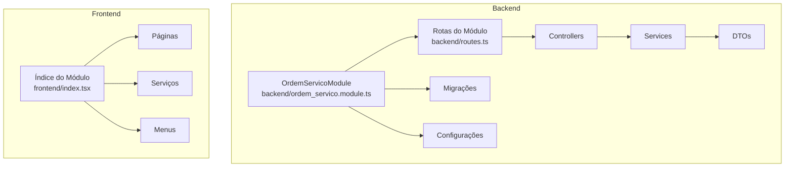
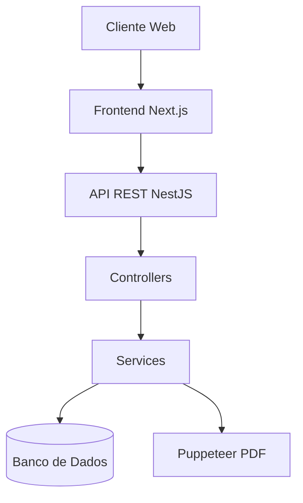
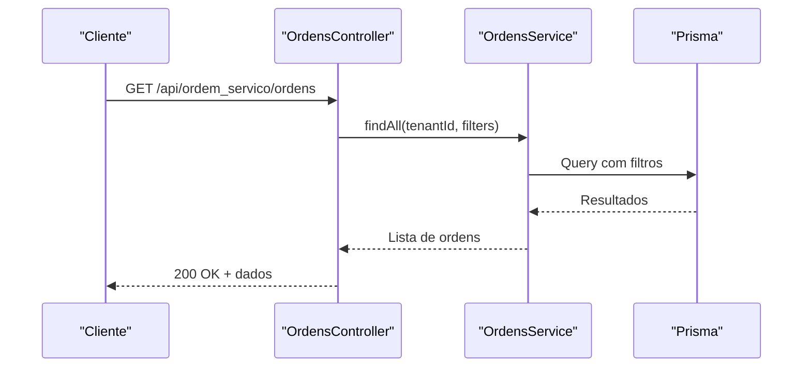
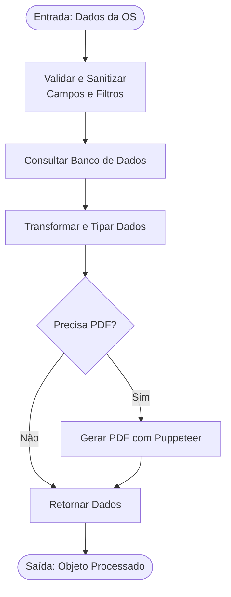
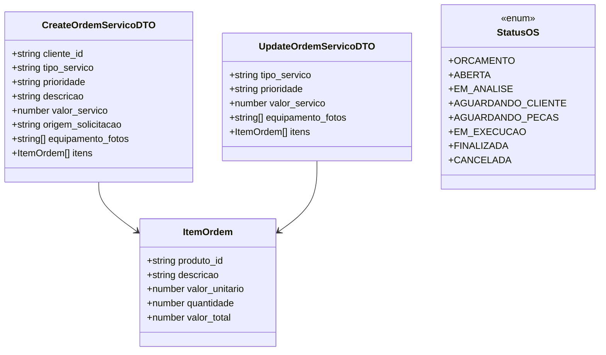
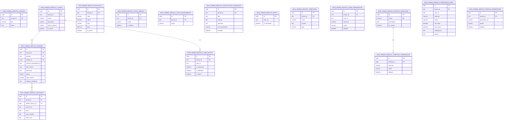
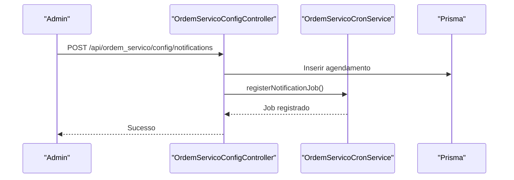
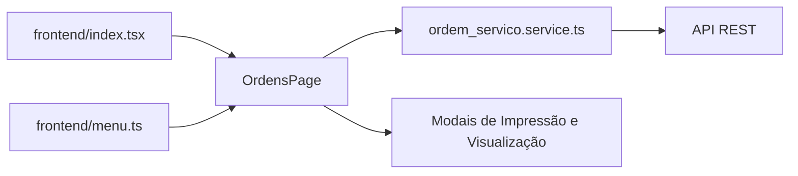
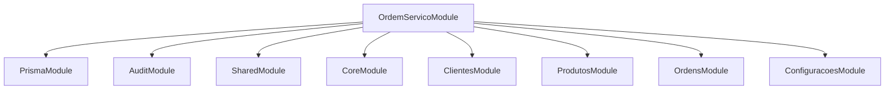

# Desenvolvimento e Contribuição

<cite>
**Arquivos Referenciados neste Documento**
- [README.md](file://README.md)
- [module.json](file://module.json)
- [backend/ordem_servico.module.ts](file://backend/ordem_servico.module.ts)
- [backend/routes.ts](file://backend/routes.ts)
- [backend/ordens/ordens.controller.ts](file://backend/ordens/ordens.controller.ts)
- [backend/ordens/ordens.service.ts](file://backend/ordens/ordens.service.ts)
- [backend/shared/dto/ordem-servico.dto.ts](file://backend/shared/dto/ordem-servico.dto.ts)
- [backend/migrations/001_master.sql](file://backend/migrations/001_master.sql)
- [backend/migrations/003_add_print_fields.sql](file://backend/migrations/003_add_print_fields.sql)
- [backend/migrations/004_add_tables_os.sql](file://backend/migrations/004_add_tables_os.sql)
- [backend/core/ordem-servico-config.controller.ts](file://backend/core/ordem-servico-config.controller.ts)
- [frontend/index.tsx](file://frontend/index.tsx)
- [frontend/pages/ordens/page.tsx](file://frontend/pages/ordens/page.tsx)
- [frontend/services/ordem_servico.service.ts](file://frontend/services/ordem_servico.service.ts)
- [frontend/menu.ts](file://frontend/menu.ts)
</cite>

## Sumário
1. [Introdução](#introdução)
2. [Estrutura do Projeto](#estrutura-do-projeto)
3. [Componentes-Chave](#componentes-chave)
4. [Visão Geral da Arquitetura](#visão-geral-da-arquitetura)
5. [Análise Detalhada dos Componentes](#análise-detalhada-dos-componentes)
6. [Análise de Dependências](#análise-de-dependências)
7. [Considerações de Desempenho](#considerações-de-desempenho)
8. [Guia de Contribuição](#guia-de-contribuição)
9. [Guia de Depuração e Otimização](#guia-de-depuração-e-otimização)
10. [Conclusão](#conclusão)

## Introdução
Este documento apresenta um guia completo para desenvolvimento e contribuição no módulo de Ordens de Serviço. Ele aborda a estrutura de desenvolvimento, padrões de código, convenções de nomenclatura, boas práticas, configuração do ambiente, execução de testes, build do projeto, processos de contribuição, branchs, commits e pull requests, padrões arquitetônicos, regras de validação e integrações. Também oferece orientações para novos desenvolvedores e manutenção do código, além de dicas para debugging, profiling e otimização de desempenho.

## Estrutura do Projeto
O módulo segue uma arquitetura modular com backend e frontend separados. O backend é baseado em NestJS e utiliza Prisma para acesso ao banco de dados. O frontend é uma aplicação Next.js com componentes React e serviços customizados.

**Fontes**
- [backend/ordem_servico.module.ts](file://backend/ordem_servico.module.ts#L1-L35)
- [backend/routes.ts](file://backend/routes.ts#L1-L17)
- [frontend/index.tsx](file://frontend/index.tsx#L1-L22)

**Seção fonte**
- [README.md](file://README.md#L1-L59)
- [module.json](file://module.json#L1-L48)

## Componentes-Chave
- Módulo principal: OrdemServicoModule
- Controllers: OrdensController, OrdemServicoConfigController
- Services: OrdensService
- DTOs: OrdemServico DTOs e enums
- Migrações: Tabelas e índices do módulo
- Frontend: Páginas, serviços e menus

**Seção fonte**
- [backend/ordem_servico.module.ts](file://backend/ordem_servico.module.ts#L1-L35)
- [backend/ordens/ordens.controller.ts](file://backend/ordens/ordens.controller.ts#L1-L377)
- [backend/core/ordem-servico-config.controller.ts](file://backend/core/ordem-servico-config.controller.ts#L1-L254)
- [backend/shared/dto/ordem-servico.dto.ts](file://backend/shared/dto/ordem-servico.dto.ts#L1-L397)
- [backend/migrations/001_master.sql](file://backend/migrations/001_master.sql#L1-L622)

## Visão Geral da Arquitetura
O módulo adota uma arquitetura de camadas bem definida:
- Controladores expõem endpoints REST
- Services contêm a lógica de negócio
- DTOs validam e tipam dados de entrada e saída
- Migrações gerenciam o esquema do banco de dados
- Frontend consome os endpoints via serviços customizados

**Fontes**
- [backend/ordens/ordens.controller.ts](file://backend/ordens/ordens.controller.ts#L25-L377)
- [backend/ordens/ordens.service.ts](file://backend/ordens/ordens.service.ts#L1-L123)
- [frontend/pages/ordens/page.tsx](file://frontend/pages/ordens/page.tsx#L1-L684)

## Análise Detalhada dos Componentes

### Controlador de Ordens de Serviço
O controlador expõe endpoints para CRUD completo de ordens, geração de PDF, histórico, status e upload de arquivos. Aplica validações rigorosas e proteções de acesso.

**Fontes**
- [backend/ordens/ordens.controller.ts](file://backend/ordens/ordens.controller.ts#L34-L55)
- [backend/ordens/ordens.service.ts](file://backend/ordens/ordens.service.ts#L137-L473)

**Seção fonte**
- [backend/ordens/ordens.controller.ts](file://backend/ordens/ordens.controller.ts#L1-L377)

### Serviço de Ordens de Serviço
Responsável pela lógica de negócio, geração de PDF com Puppeteer, validações de status e histórico de alterações.

**Fontes**
- [backend/ordens/ordens.service.ts](file://backend/ordens/ordens.service.ts#L16-L123)
- [backend/ordens/ordens.service.ts](file://backend/ordens/ordens.service.ts#L125-L135)

**Seção fonte**
- [backend/ordens/ordens.service.ts](file://backend/ordens/ordens.service.ts#L1-L800)

### DTOs e Validações
DTOs com class-validator garantem integridade dos dados de entrada e saída, incluindo enums para status e origem.

**Fontes**
- [backend/shared/dto/ordem-servico.dto.ts](file://backend/shared/dto/ordem-servico.dto.ts#L28-L133)
- [backend/shared/dto/ordem-servico.dto.ts](file://backend/shared/dto/ordem-servico.dto.ts#L135-L241)
- [backend/shared/dto/ordem-servico.dto.ts](file://backend/shared/dto/ordem-servico.dto.ts#L9-L18)

**Seção fonte**
- [backend/shared/dto/ordem-servico.dto.ts](file://backend/shared/dto/ordem-servico.dto.ts#L1-L397)

### Migrações e Esquema de Dados
As migrações criam e mantêm o esquema completo do módulo, incluindo tabelas de clientes, produtos, ordens, histórico, tipos e configurações.

**Fontes**
- [backend/migrations/001_master.sql](file://backend/migrations/001_master.sql#L12-L249)
- [backend/migrations/003_add_print_fields.sql](file://backend/migrations/003_add_print_fields.sql#L5-L23)
- [backend/migrations/004_add_tables_os.sql](file://backend/migrations/004_add_tables_os.sql#L6-L32)

**Seção fonte**
- [backend/migrations/001_master.sql](file://backend/migrations/001_master.sql#L1-L622)
- [backend/migrations/003_add_print_fields.sql](file://backend/migrations/003_add_print_fields.sql#L1-L24)
- [backend/migrations/004_add_tables_os.sql](file://backend/migrations/004_add_tables_os.sql#L1-L80)

### Configurações do Módulo
Controlador de configurações expõe endpoints para notificações, tipos de serviço, tipos de equipamento e papéis de usuários.

**Fontes**
- [backend/core/ordem-servico-config.controller.ts](file://backend/core/ordem-servico-config.controller.ts#L28-L46)

**Seção fonte**
- [backend/core/ordem-servico-config.controller.ts](file://backend/core/ordem-servico-config.controller.ts#L1-L254)

### Frontend
O frontend consiste em páginas Next.js, componentes React e serviços customizados para consumir a API.

**Fontes**
- [frontend/pages/ordens/page.tsx](file://frontend/pages/ordens/page.tsx#L166-L684)
- [frontend/services/ordem_servico.service.ts](file://frontend/services/ordem_servico.service.ts#L1-L20)
- [frontend/index.tsx](file://frontend/index.tsx#L1-L22)
- [frontend/menu.ts](file://frontend/menu.ts#L1-L50)

**Seção fonte**
- [frontend/pages/ordens/page.tsx](file://frontend/pages/ordens/page.tsx#L1-L684)
- [frontend/services/ordem_servico.service.ts](file://frontend/services/ordem_servico.service.ts#L1-L20)
- [frontend/index.tsx](file://frontend/index.tsx#L1-L22)
- [frontend/menu.ts](file://frontend/menu.ts#L1-L50)

## Análise de Dependências
O módulo depende de componentes do core (Prisma, audit, decorators) e exporta seus módulos para o sistema.

**Fontes**
- [backend/ordem_servico.module.ts](file://backend/ordem_servico.module.ts#L11-L30)

**Seção fonte**
- [backend/ordem_servico.module.ts](file://backend/ordem_servico.module.ts#L1-L35)

## Considerações de Desempenho
- Validação e sanitização de filtros evitam consultas ineficientes e SQL injection
- Paginação controlada com limites máximos
- Buscas com comprimento mínimo para evitar sobrecarga
- Uso de índices estratégicos no banco de dados
- Geração de PDF com Puppeteer otimizada (headless, timeouts configurados)

## Guia de Contribuição

### Padrões de Código e Convenções
- NestJS: Controllers com @Controller, Services com @Injectable
- DTOs com class-validator para validação
- Enums para status e origem
- Nomenclatura de métodos: findAll, findOne, create, update, remove
- Logs com Logger e mensagens descritivas

### Configuração do Ambiente
- Backend: NestJS + Prisma + PostgreSQL
- Frontend: Next.js + React + TypeScript
- Variáveis de ambiente: NEXT_PUBLIC_API_URL, tokens de autenticação

### Execução de Testes
- Estratégia sugerida: Testes unitários para Services e DTOs
- Testes de integração para Controllers
- Mock de PrismaService e Puppeteer para testes controlados

### Build do Projeto
- Backend: nest build
- Frontend: next build
- Geração de PDF: Puppeteer requer dependências do sistema

### Processos de Contribuição
- Branchs: develop, feature/*, fix/*
- Commits: mensagens descritivas, seguir conventional commits
- Pull Requests: revisão de código, testes, documentação

## Guia de Depuração e Otimização

### Debugging
- Utilizar logs com Logger nos controladores e services
- Verificar erros de validação com class-validator
- Depuração de PDF: verificar caminho do logotipo e conteúdo HTML
- Erros de upload: validar buffer e permissões de diretório

### Profiling
- Medir tempo de execução de queries no banco
- Monitorar uso de memória com Puppeteer
- Perfis de carga para endpoints de listagem

### Otimização de Desempenho
- Índices estratégicos: status, data_abertura, numero, cliente_id
- Limitar resultados e paginar consultas
- Evitar consultas desnecessárias no PDF
- Cache de configurações do tenant

**Seção fonte**
- [backend/ordens/ordens.controller.ts](file://backend/ordens/ordens.controller.ts#L40-L54)
- [backend/ordens/ordens.service.ts](file://backend/ordens/ordens.service.ts#L82-L113)
- [backend/migrations/001_master.sql](file://backend/migrations/001_master.sql#L325-L396)

## Conclusão
O módulo de Ordens de Serviço apresenta uma arquitetura sólida com separação clara de responsabilidades, validações robustas e integrações bem definidas. O guia fornece diretrizes completas para desenvolvimento, contribuição e manutenção, garantindo qualidade e consistência no código.