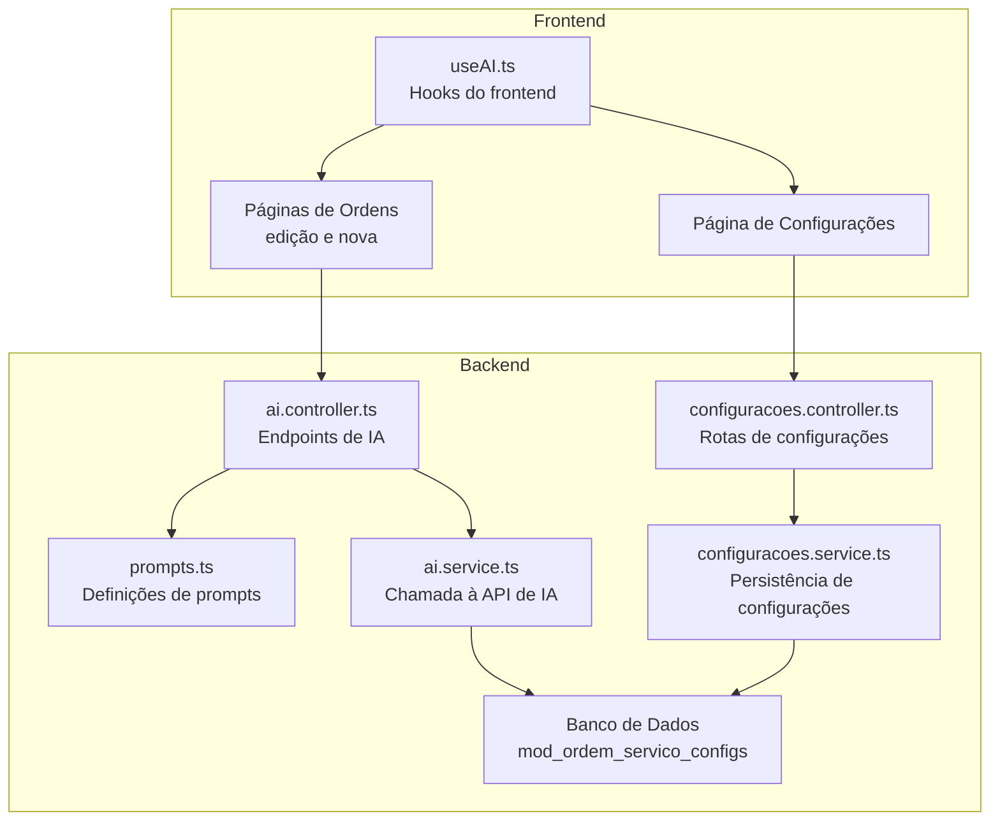
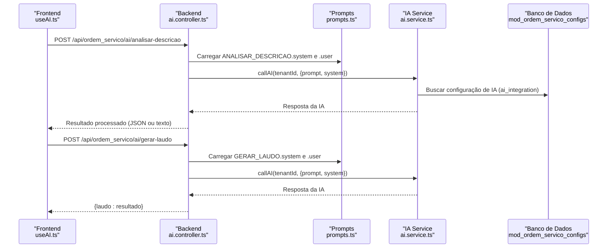
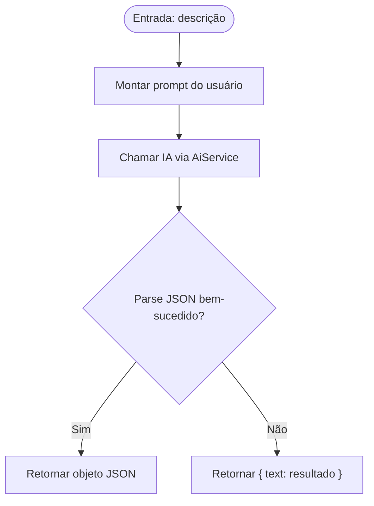
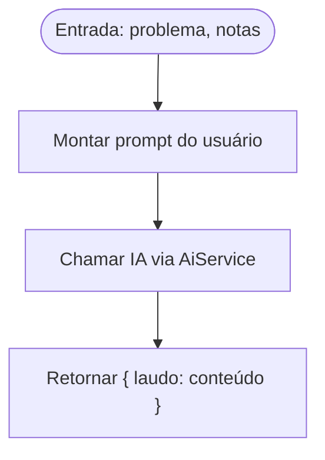
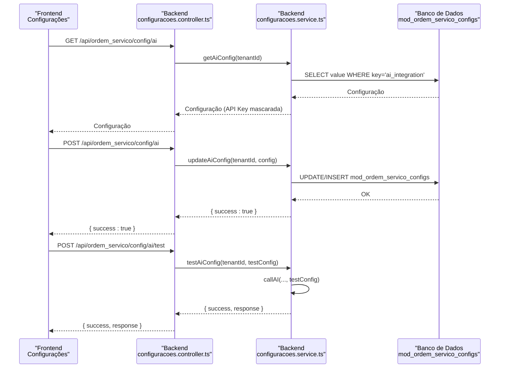
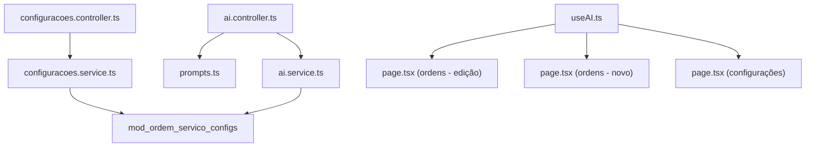

# Configuração de Prompts

<cite>
**Arquivos referenciados neste documento**
- [prompts.ts](file://backend/shared/services/prompts.ts)
- [ai.controller.ts](file://backend/shared/controllers/ai.controller.ts)
- [ai.service.ts](file://backend/shared/services/ai.service.ts)
- [useAI.ts](file://frontend/hooks/useAI.ts)
- [page.tsx (ordens - edição)](file://frontend/pages/ordens/edit/page.tsx)
- [page.tsx (ordens - novo)](file://frontend/pages/ordens/new/page.tsx)
- [page.tsx (configurações)](file://frontend/pages/configuracoes/page.tsx)
- [configuracoes.controller.ts](file://backend/configuracoes/configuracoes.controller.ts)
- [configuracoes.service.ts](file://backend/configuracoes/configuracoes.service.ts)
- [001_master.sql](file://backend/migrations/001_master.sql)
- [004_add_tables_os.sql](file://backend/migrations/004_add_tables_os.sql)
</cite>

## Sumário
1. [Introdução](#introdução)
2. [Estrutura do Projeto](#estrutura-do-projeto)
3. [Componentes-Chave](#componentes-chave)
4. [Visão Geral da Arquitetura](#visão-geral-da-arquitetura)
5. [Análise Detalhada dos Componentes](#análise-detalhada-dos-componentes)
6. [Análise de Dependências](#análise-de-dependências)
7. [Considerações de Desempenho](#considerações-de-desempenho)
8. [Guia de Solução de Problemas](#guia-de-solução-de-problemas)
9. [Conclusão](#conclusão)

## Introdução
Este documento explica como são configurados e utilizados os prompts da IA no módulo de ordens de serviço. Ele descreve os tipos de prompts disponíveis, sua estrutura, variáveis, e como são empregados nos fluxos de trabalho tanto no backend quanto no frontend. Também mostra como os prompts são carregados e invocados através do hook useAI, e como as configurações de IA influenciam o comportamento da integração.

## Estrutura do Projeto
O sistema é dividido entre backend e frontend, com prompts centralizados no backend e consumidos via hooks no frontend. As configurações de IA são armazenadas no banco de dados e expostas pelas rotas de configurações.

**Diagrama fonte**
- [useAI.ts](file://frontend/hooks/useAI.ts#L1-L41)
- [page.tsx (ordens - edição)](file://frontend/pages/ordens/edit/page.tsx#L157-L184)
- [page.tsx (ordens - novo)](file://frontend/pages/ordens/new/page.tsx#L81-L108)
- [page.tsx (configurações)](file://frontend/pages/configuracoes/page.tsx#L1089-L1231)
- [prompts.ts](file://backend/shared/services/prompts.ts#L1-L27)
- [ai.controller.ts](file://backend/shared/controllers/ai.controller.ts#L1-L53)
- [ai.service.ts](file://backend/shared/services/ai.service.ts#L1-L91)
- [configuracoes.controller.ts](file://backend/configuracoes/configuracoes.controller.ts#L80-L120)
- [configuracoes.service.ts](file://backend/configuracoes/configuracoes.service.ts#L185-L281)
- [001_master.sql](file://backend/migrations/001_master.sql#L12-L17)
- [004_add_tables_os.sql](file://backend/migrations/004_add_tables_os.sql#L66-L78)

**Seção fonte**
- [prompts.ts](file://backend/shared/services/prompts.ts#L1-L27)
- [ai.controller.ts](file://backend/shared/controllers/ai.controller.ts#L1-L53)
- [ai.service.ts](file://backend/shared/services/ai.service.ts#L1-L91)
- [useAI.ts](file://frontend/hooks/useAI.ts#L1-L41)
- [page.tsx (ordens - edição)](file://frontend/pages/ordens/edit/page.tsx#L157-L184)
- [page.tsx (ordens - novo)](file://frontend/pages/ordens/new/page.tsx#L81-L108)
- [page.tsx (configurações)](file://frontend/pages/configuracoes/page.tsx#L1089-L1231)
- [configuracoes.controller.ts](file://backend/configuracoes/configuracoes.controller.ts#L80-L120)
- [configuracoes.service.ts](file://backend/configuracoes/configuracoes.service.ts#L185-L281)
- [001_master.sql](file://backend/migrations/001_master.sql#L12-L17)
- [004_add_tables_os.sql](file://backend/migrations/004_add_tables_os.sql#L66-L78)

## Componentes-Chave

### Prompts Disponíveis
- **analise_problema** (chave: ANALISAR_DESCRICAO)
  - Propósito: Analisar a descrição do problema e extrair resumo, possíveis causas, sugestões e nível de complexidade.
  - Entradas esperadas: descrição (string).
  - Saída esperada: objeto contendo chaves como resumo, causas, sugestoes, complexidade.
  - Fonte: [prompts.ts](file://backend/shared/services/prompts.ts#L2-L12)

- **gera_laudos** (chave: GERAR_LAUDO)
  - Propósito: Transformar informações técnicas em um laudo técnico profissional formatado em HTML.
  - Entradas esperadas: problema (string), notas (string).
  - Saída esperada: string contendo o laudo formatado.
  - Fonte: [prompts.ts](file://backend/shared/services/prompts.ts#L13-L26)

**Seção fonte**
- [prompts.ts](file://backend/shared/services/prompts.ts#L1-L27)

### Backend: Controlador de IA
- **Endpoints**
  - POST /api/ordem_servico/ai/analisar-descricao: Recebe a descrição, monta o prompt com base no tipo ANALISAR_DESCRICAO e retorna o resultado processado.
  - POST /api/ordem_servico/ai/gerar-laudo: Recebe problema e notas, monta o prompt com base no tipo GERAR_LAUDO e retorna o laudo.
- **Tratamento de Resposta**: Para a análise, tenta fazer parse JSON e, se falhar, retorna um objeto com a chave text contendo o resultado bruto.
- Fonte: [ai.controller.ts](file://backend/shared/controllers/ai.controller.ts#L14-L51)

**Seção fonte**
- [ai.controller.ts](file://backend/shared/controllers/ai.controller.ts#L1-L53)

### Backend: Serviço de IA
- **Carregamento de Configurações**: Busca a configuração de IA associada ao tenant (chave: ai_integration) no banco de dados.
- **Valores Padrão**: Se provider for openrouter, usa o modelo openai/gpt-3.5-turbo; caso contrário, gpt-3.5-turbo. Temperatura padrão 0.3, tokens máximos 800.
- **Cabeçalhos**: Para openrouter, inclui HTTP-Referer e X-Title.
- **Resposta**: Retorna a mensagem gerada pela IA.
- Fonte: [ai.service.ts](file://backend/shared/services/ai.service.ts#L15-L91)

**Seção fonte**
- [ai.service.ts](file://backend/shared/services/ai.service.ts#L1-L91)

### Frontend: Hook useAI
- **Funções**
  - analisarDescricao(descricao): Envia a descrição para o endpoint de análise e retorna o resultado.
  - gerarLaudo(problema, notas): Envia as informações para o endpoint de geração de laudo e retorna o laudo.
- **Estados**: tracking do estado analyzing para UX.
- Fonte: [useAI.ts](file://frontend/hooks/useAI.ts#L7-L33)

**Seção fonte**
- [useAI.ts](file://frontend/hooks/useAI.ts#L1-L41)

### Frontend: Fluxos de Trabalho
- **Páginas de Ordens (Edição e Nova)**: Utilizam o hook useAI para disparar análises e exibir sugestões diretamente no formulário.
- **Página de Configurações**: Permite ativar/desativar a IA, escolher o provedor, definir modelo, temperatura e tokens máximos, além de testar a conexão.
- Fontes:
  - [page.tsx (ordens - edição)](file://frontend/pages/ordens/edit/page.tsx#L157-L184)
  - [page.tsx (ordens - novo)](file://frontend/pages/ordens/new/page.tsx#L81-L108)
  - [page.tsx (configurações)](file://frontend/pages/configuracoes/page.tsx#L1089-L1231)

**Seção fonte**
- [page.tsx (ordens - edição)](file://frontend/pages/ordens/edit/page.tsx#L157-L184)
- [page.tsx (ordens - novo)](file://frontend/pages/ordens/new/page.tsx#L81-L108)
- [page.tsx (configurações)](file://frontend/pages/configuracoes/page.tsx#L1089-L1231)

## Visão Geral da Arquitetura

**Diagrama fonte**
- [useAI.ts](file://frontend/hooks/useAI.ts#L7-L33)
- [ai.controller.ts](file://backend/shared/controllers/ai.controller.ts#L14-L51)
- [prompts.ts](file://backend/shared/services/prompts.ts#L1-L27)
- [ai.service.ts](file://backend/shared/services/ai.service.ts#L33-L91)
- [configuracoes.service.ts](file://backend/configuracoes/configuracoes.service.ts#L185-L281)
- [001_master.sql](file://backend/migrations/001_master.sql#L12-L17)

## Análise Detalhada dos Componentes

### Estrutura de Prompt: analise_problema
- Sistema: Define o papel da IA como assistente técnico e especifica as chaves esperadas na resposta.
- Usuário: Recebe a descrição do problema e a insere no prompt.
- Saída: Espera um JSON estruturado com as chaves resumo, causas, sugestoes, complexidade. O controlador tenta fazer parse e, se falhar, retorna um objeto com text.

**Diagrama fonte**
- [prompts.ts](file://backend/shared/services/prompts.ts#L2-L12)
- [ai.controller.ts](file://backend/shared/controllers/ai.controller.ts#L19-L29)
- [ai.service.ts](file://backend/shared/services/ai.service.ts#L33-L91)

**Seção fonte**
- [prompts.ts](file://backend/shared/services/prompts.ts#L1-L27)
- [ai.controller.ts](file://backend/shared/controllers/ai.controller.ts#L14-L34)

### Estrutura de Prompt: gera_laudos
- Sistema: Define o papel da IA como técnico sênior e instrui a formatação em HTML com tags específicas.
- Usuário: Recebe problema e notas técnicas e gera um laudo completo seguindo um roteiro estruturado.
- Saída: Um único campo laudo contendo o conteúdo formatado.

**Diagrama fonte**
- [prompts.ts](file://backend/shared/services/prompts.ts#L13-L26)
- [ai.controller.ts](file://backend/shared/controllers/ai.controller.ts#L41-L46)
- [ai.service.ts](file://backend/shared/services/ai.service.ts#L33-L91)

**Seção fonte**
- [prompts.ts](file://backend/shared/services/prompts.ts#L1-L27)
- [ai.controller.ts](file://backend/shared/controllers/ai.controller.ts#L36-L51)

### Carregamento e Persistência de Configurações de IA
- Backend:
  - GET /api/ordem_servico/config/ai: Busca a configuração do tenant e mascara a API Key.
  - POST /api/ordem_servico/config/ai: Atualiza a configuração, mantendo a API Key original se for fornecida mascarada.
  - POST /api/ordem_servico/config/ai/test: Testa a conexão com a IA usando a configuração fornecida.
- Banco de Dados:
  - Tabela mod_ordem_servico_configs armazena as configurações por tenant e chave.
- Frontend:
  - Página de configurações permite ativar/desativar, selecionar provedor, definir modelo, temperatura e tokens máximos, além de testar a conexão.

**Diagrama fonte**
- [configuracoes.controller.ts](file://backend/configuracoes/configuracoes.controller.ts#L80-L120)
- [configuracoes.service.ts](file://backend/configuracoes/configuracoes.service.ts#L185-L281)
- [001_master.sql](file://backend/migrations/001_master.sql#L12-L17)
- [004_add_tables_os.sql](file://backend/migrations/004_add_tables_os.sql#L66-L78)

**Seção fonte**
- [configuracoes.controller.ts](file://backend/configuracoes/configuracoes.controller.ts#L80-L120)
- [configuracoes.service.ts](file://backend/configuracoes/configuracoes.service.ts#L185-L281)
- [page.tsx (configurações)](file://frontend/pages/configuracoes/page.tsx#L1089-L1231)

### Exemplos de Uso e Influência nas Saídas
- Na página de ordens (edição/nova), ao clicar em "Analisar com IA", o hook useAI envia a descrição do problema para o backend. O controlador monta o prompt ANALISAR_DESCRICAO e, ao receber a resposta, exibe sugestões como resumo, causas, sugestões e complexidade. Isso orienta o técnico na tomada de decisão e agiliza o preenchimento do formulário.
- Na geração de laudos, ao preencher problema e notas técnicas, o hook useAI dispara o endpoint GERAR_LAUDO, que retorna um conteúdo HTML formatado para inclusão no laudo técnico da ordem.

**Seção fonte**
- [useAI.ts](file://frontend/hooks/useAI.ts#L7-L33)
- [page.tsx (ordens - edição)](file://frontend/pages/ordens/edit/page.tsx#L1060-L1132)
- [page.tsx (ordens - novo)](file://frontend/pages/ordens/new/page.tsx#L84-L108)

## Análise de Dependências

**Diagrama fonte**
- [prompts.ts](file://backend/shared/services/prompts.ts#L1-L27)
- [ai.controller.ts](file://backend/shared/controllers/ai.controller.ts#L1-L53)
- [ai.service.ts](file://backend/shared/services/ai.service.ts#L1-L91)
- [useAI.ts](file://frontend/hooks/useAI.ts#L1-L41)
- [page.tsx (ordens - edição)](file://frontend/pages/ordens/edit/page.tsx#L157-L184)
- [page.tsx (ordens - novo)](file://frontend/pages/ordens/new/page.tsx#L81-L108)
- [page.tsx (configurações)](file://frontend/pages/configuracoes/page.tsx#L1089-L1231)
- [configuracoes.controller.ts](file://backend/configuracoes/configuracoes.controller.ts#L80-L120)
- [configuracoes.service.ts](file://backend/configuracoes/configuracoes.service.ts#L185-L281)
- [001_master.sql](file://backend/migrations/001_master.sql#L12-L17)

**Seção fonte**
- [prompts.ts](file://backend/shared/services/prompts.ts#L1-L27)
- [ai.controller.ts](file://backend/shared/controllers/ai.controller.ts#L1-L53)
- [ai.service.ts](file://backend/shared/services/ai.service.ts#L1-L91)
- [useAI.ts](file://frontend/hooks/useAI.ts#L1-L41)
- [configuracoes.controller.ts](file://backend/configuracoes/configuracoes.controller.ts#L80-L120)
- [configuracoes.service.ts](file://backend/configuracoes/configuracoes.service.ts#L185-L281)

## Considerações de Desempenho
- A temperatura baixa (0.1 a 0.3) torna a IA mais precisa e determinística, ideal para análise de dados e geração de sugestões estruturadas.
- Temperaturas mais altas (0.7 a 1.0) podem gerar respostas mais criativas, mas menos padronizadas, sendo mais apropriadas para geração de conteúdo diverso.
- Limitar o número de tokens máximos ajuda a controlar custos e tempos de resposta.

[Sem seção fonte, pois esta seção fornece orientações gerais]

## Guia de Solução de Problemas
- Erro ao buscar configuração de IA: Verifique se a chave ai_integration existe no banco para o tenant e se a API Key está correta.
- IA não habilitada: Confirme que o campo enabled está ativado nas configurações.
- Erro na API de IA: Revise os cabeçalhos e URL do provedor (OpenRouter ou OpenAI) e valide a resposta da API.
- Falha no parse JSON: O controlador de análise tenta fazer parse e, se falhar, retorna um objeto com text. Verifique a formatação do prompt system.

**Seção fonte**
- [ai.service.ts](file://backend/shared/services/ai.service.ts#L15-L91)
- [ai.controller.ts](file://backend/shared/controllers/ai.controller.ts#L24-L29)
- [configuracoes.service.ts](file://backend/configuracoes/configuracoes.service.ts#L185-L281)

## Conclusão
Os prompts da IA estão centralizados no backend e seguem um padrão claro de definição de sistema e usuário, permitindo respostas estruturadas e previsíveis. O hook useAI no frontend simplifica a integração, enquanto as configurações de IA são gerenciadas de forma segura e testável. Essa abordagem garante que os fluxos de análise de problemas e geração de laudos sejam rápidos, padronizados e adaptáveis às necessidades do negócio.