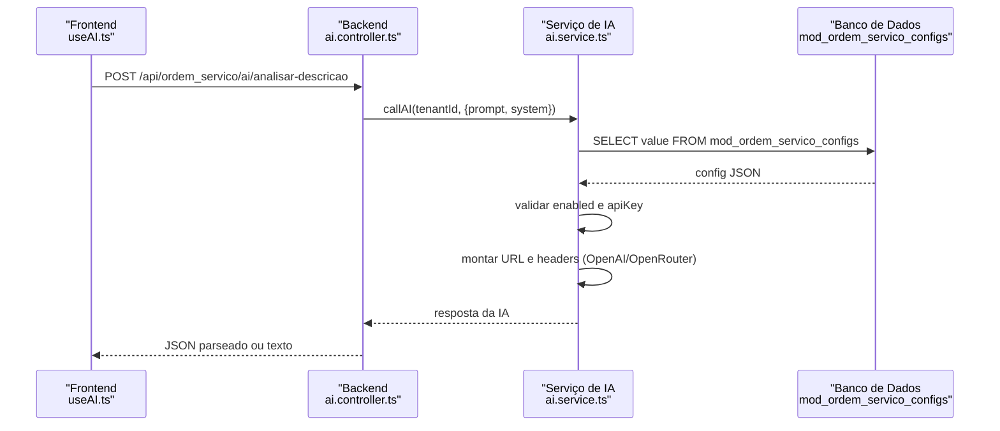
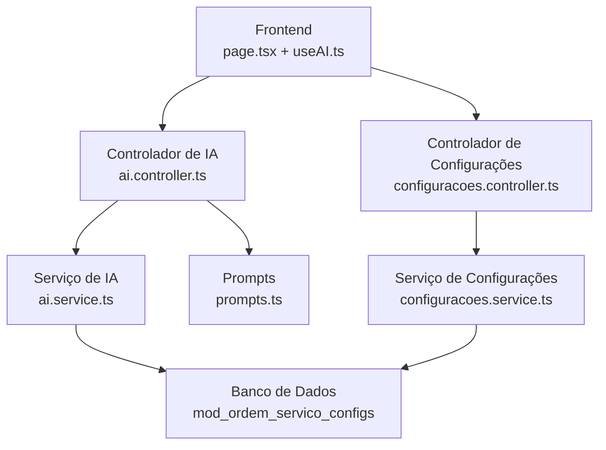
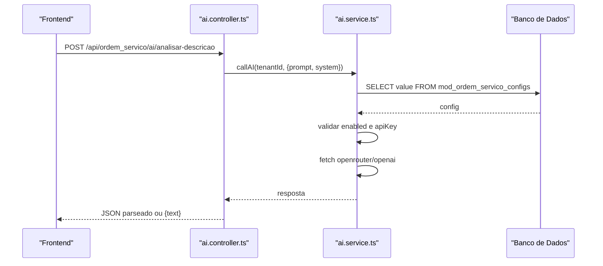
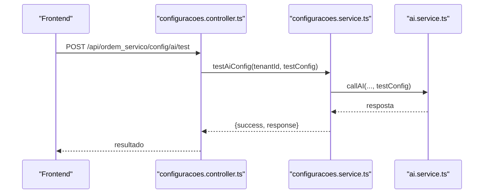
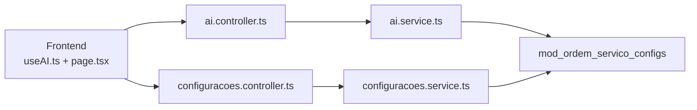
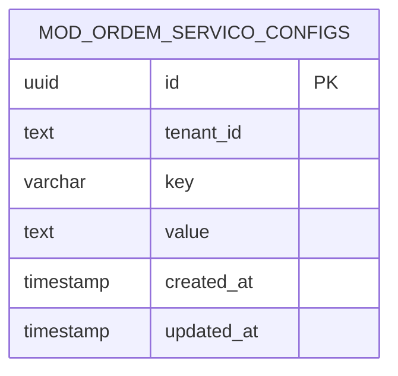

# Configuração e Integração

<cite>
**Arquivos Referenciados Neste Documento**
- [ai.controller.ts](file://backend/shared/controllers/ai.controller.ts)
- [ai.service.ts](file://backend/shared/services/ai.service.ts)
- [prompts.ts](file://backend/shared/services/prompts.ts)
- [useAI.ts](file://frontend/hooks/useAI.ts)
- [configuracoes.controller.ts](file://backend/configuracoes/configuracoes.controller.ts)
- [configuracoes.service.ts](file://backend/configuracoes/configuracoes.service.ts)
- [page.tsx](file://frontend/pages/configuracoes/page.tsx)
- [available-permissions.ts](file://backend/shared/constants/available-permissions.ts)
- [permission.guard.ts](file://backend/shared/guards/permission.guard.ts)
- [require-permission.decorator.ts](file://backend/shared/decorators/require-permission.decorator.ts)
- [001_master.sql](file://backend/migrations/001_master.sql)
- [004_add_tables_os.sql](file://backend/migrations/004_add_tables_os.sql)
- [seed.sql](file://backend/seeds/seed.sql)
</cite>

## Índice
1. [Introdução](#introdução)
2. [Estrutura do Projeto](#estrutura-do-projeto)
3. [Componentes-Chave](#componentes-chave)
4. [Visão Geral da Arquitetura](#visão-geral-da-arquitetura)
5. [Análise Detalhada dos Componentes](#análise-detalhada-dos-componentes)
6. [Análise de Dependências](#análise-de-dependências)
7. [Considerações de Desempenho](#considerações-de-desempenho)
8. [Guia de Solução de Problemas](#guia-de-solução-de-problemas)
9. [Conclusão](#conclusão)
10. [Apêndices](#apêndices)

## Introdução
Este documento explica como configurar e integrar a Inteligência Artificial (IA) no módulo de Ordens de Serviço. Ele descreve como habilitar/desabilitar a integração, configurar chaves de API, selecionar provedores e modelos, quais permissões são necessárias e como testar a integração com os provedores OpenAI e OpenRouter. Também apresenta passos práticos, validações implementadas e exemplos de configurações válidas, além de problemas comuns durante a instalação.

## Estrutura do Projeto
O módulo de IA é composto por camadas no backend e frontend:
- Backend: controlador de IA, serviço de IA, prompts pré-definidos, controlador e serviço de configurações, guardas e permissões.
- Frontend: hook para consumir os recursos de IA e página de configurações com abas para gerenciar as opções de IA.

```mermaid
graph TB
subgraph "Frontend"
FE_Page["Página de Configurações<br/>page.tsx"]
FE_Hook["Hook useAI<br/>useAI.ts"]
end
subgraph "Backend"
BE_AI_Controller["Controlador de IA<br/>ai.controller.ts"]
BE_AI_Service["Serviço de IA<br/>ai.service.ts"]
BE_Config_Controller["Controlador de Configurações<br/>configuracoes.controller.ts"]
BE_Config_Service["Serviço de Configurações<br/>configuracoes.service.ts"]
BE_Guard["Guarda de Permissões<br/>permission.guard.ts"]
BE_Perms["Permissões Disponíveis<br/>available-permissions.ts"]
end
FE_Page --> FE_Hook
FE_Hook --> BE_AI_Controller
BE_AI_Controller --> BE_AI_Service
FE_Page --> BE_Config_Controller
BE_Config_Controller --> BE_Config_Service
BE_AI_Controller -. autenticação .-> BE_Guard
BE_Config_Controller -. autenticação .-> BE_Guard
BE_Guard --> BE_Perms
```

**Diagrama fonte**
- [ai.controller.ts](file://backend/shared/controllers/ai.controller.ts#L1-L53)
- [ai.service.ts](file://backend/shared/services/ai.service.ts#L1-L91)
- [configuracoes.controller.ts](file://backend/configuracoes/configuracoes.controller.ts#L1-L136)
- [configuracoes.service.ts](file://backend/configuracoes/configuracoes.service.ts#L1-L331)
- [useAI.ts](file://frontend/hooks/useAI.ts#L1-L41)
- [page.tsx](file://frontend/pages/configuracoes/page.tsx#L364-L742)
- [permission.guard.ts](file://backend/shared/guards/permission.guard.ts#L1-L58)
- [available-permissions.ts](file://backend/shared/constants/available-permissions.ts#L1-L164)

**Seção fonte**
- [ai.controller.ts](file://backend/shared/controllers/ai.controller.ts#L1-L53)
- [ai.service.ts](file://backend/shared/services/ai.service.ts#L1-L91)
- [configuracoes.controller.ts](file://backend/configuracoes/configuracoes.controller.ts#L1-L136)
- [configuracoes.service.ts](file://backend/configuracoes/configuracoes.service.ts#L1-L331)
- [useAI.ts](file://frontend/hooks/useAI.ts#L1-L41)
- [page.tsx](file://frontend/pages/configuracoes/page.tsx#L364-L742)
- [permission.guard.ts](file://backend/shared/guards/permission.guard.ts#L1-L58)
- [available-permissions.ts](file://backend/shared/constants/available-permissions.ts#L1-L164)

## Componentes-Chave
- Controlador de IA: expõe endpoints para análise de descrição e geração de laudo técnico, usando prompts pré-definidos e o serviço de IA.
- Serviço de IA: recupera a configuração de IA por tenant, valida parâmetros e faz chamadas HTTP para os provedores OpenAI/OpenRouter.
- Prompts: define instruções sistemáticas e prompts de usuário para cada tarefa.
- Controlador e Serviço de Configurações: permitem buscar, salvar e testar a configuração de IA, incluindo mascaramento seguro da chave de API.
- Frontend: hook e página de configurações para salvar e testar a configuração de IA.

**Seção fonte**
- [ai.controller.ts](file://backend/shared/controllers/ai.controller.ts#L14-L51)
- [ai.service.ts](file://backend/shared/services/ai.service.ts#L33-L89)
- [prompts.ts](file://backend/shared/services/prompts.ts#L1-L27)
- [configuracoes.controller.ts](file://backend/configuracoes/configuracoes.controller.ts#L80-L111)
- [configuracoes.service.ts](file://backend/configuracoes/configuracoes.service.ts#L179-L281)
- [useAI.ts](file://frontend/hooks/useAI.ts#L7-L33)
- [page.tsx](file://frontend/pages/configuracoes/page.tsx#L474-L541)

## Visão Geral da Arquitetura
A integração com a IA segue um fluxo de autenticação JWT e permissões, com persistência de configurações no banco de dados. O frontend consome endpoints protegidos e o backend aplica validações antes de encaminhar chamadas para os provedores.

**Diagrama fonte**
- [ai.controller.ts](file://backend/shared/controllers/ai.controller.ts#L14-L34)
- [ai.service.ts](file://backend/shared/services/ai.service.ts#L33-L89)
- [001_master.sql](file://backend/migrations/001_master.sql#L12-L17)

**Seção fonte**
- [ai.controller.ts](file://backend/shared/controllers/ai.controller.ts#L14-L34)
- [ai.service.ts](file://backend/shared/services/ai.service.ts#L33-L89)
- [001_master.sql](file://backend/migrations/001_master.sql#L12-L17)

## Análise Detalhada dos Componentes

### Controlador de IA
- Métodos:
  - POST /api/ordem_servico/ai/analisar-descricao: usa prompt de análise de descrição e retorna JSON parseado ou objeto com texto.
  - POST /api/ordem_servico/ai/gerar-laudo: gera laudo técnico formatado em HTML com base em problema e notas.
- Autenticação: utiliza guard JWT.
- Validação: o serviço de IA lança exceção quando IA não está habilitada ou chave não configurada.

**Seção fonte**
- [ai.controller.ts](file://backend/shared/controllers/ai.controller.ts#L14-L51)

### Serviço de IA
- Recupera configuração de IA por tenant a partir de mod_ordem_servico_configs com chave “ai_integration”.
- Valida:
  - enabled = true (ou override informado).
  - apiKey presente.
- Provedores:
  - OpenRouter: URL específico e headers adicionais.
  - OpenAI: URL padrão.
- Parâmetros da requisição:
  - model (padrão diferente por provedor).
  - temperature (padrão 0.3).
  - max_tokens (padrão 800).
  - system (opcional) e user (obrigatório).
- Resposta: extrai choices[0].message.content.

**Seção fonte**
- [ai.service.ts](file://backend/shared/services/ai.service.ts#L15-L89)

### Prompts
- ANÁLISAR_DESCRICAO: instruções sistemáticas para resumo, causas, sugestões e complexidade, com saída em JSON.
- GERAR_LAUDO: instruções para diagnóstico, procedimentos, conclusão e recomendações, com saída em HTML.

**Seção fonte**
- [prompts.ts](file://backend/shared/services/prompts.ts#L1-L27)

### Controlador e Serviço de Configurações
- Endpoints:
  - GET /api/ordem_servico/config/ai: busca configuração de IA (com mascaramento da chave).
  - POST /api/ordem_servico/config/ai: salva configuração de IA.
  - POST /api/ordem_servico/config/ai/test: testa configuração com chamada real.
- Persistência: tabela mod_ordem_servico_configs com tenant_id e key “ai_integration”.

**Seção fonte**
- [configuracoes.controller.ts](file://backend/configuracoes/configuracoes.controller.ts#L80-L111)
- [configuracoes.service.ts](file://backend/configuracoes/configuracoes.service.ts#L179-L281)
- [001_master.sql](file://backend/migrations/001_master.sql#L12-L17)

### Frontend
- Hook useAI:
  - analisarDescricao: envia descrição e retorna resultado.
  - gerarLaudo: envia problema e notas e retorna laudo.
- Página de Configurações:
  - Aba “Inteligência Artificial” com formulário de configuração.
  - Botão de teste que chama POST /api/ordem_servico/config/ai/test.

**Seção fonte**
- [useAI.ts](file://frontend/hooks/useAI.ts#L7-L33)
- [page.tsx](file://frontend/pages/configuracoes/page.tsx#L474-L541)

### Permissões e Autenticação
- Guarda de Permissões: exige autenticação JWT e verifica permissões específicas.
- Permissões disponíveis: inclui recursos como “config”, “orders”, “clients”, “products”, “dashboard”.
- Decorators: RequirePermission e variants para facilitar uso.

**Seção fonte**
- [permission.guard.ts](file://backend/shared/guards/permission.guard.ts#L12-L57)
- [available-permissions.ts](file://backend/shared/constants/available-permissions.ts#L1-L164)
- [require-permission.decorator.ts](file://backend/shared/decorators/require-permission.decorator.ts#L8-L25)

## Visão Geral da Arquitetura

**Diagrama fonte**
- [ai.controller.ts](file://backend/shared/controllers/ai.controller.ts#L1-L53)
- [ai.service.ts](file://backend/shared/services/ai.service.ts#L1-L91)
- [prompts.ts](file://backend/shared/services/prompts.ts#L1-L27)
- [configuracoes.controller.ts](file://backend/configuracoes/configuracoes.controller.ts#L1-L136)
- [configuracoes.service.ts](file://backend/configuracoes/configuracoes.service.ts#L1-L331)
- [001_master.sql](file://backend/migrations/001_master.sql#L12-L17)

## Análise Detalhada dos Componentes

### Fluxo de Chamada da IA (analisar-descricao)

**Diagrama fonte**
- [ai.controller.ts](file://backend/shared/controllers/ai.controller.ts#L14-L34)
- [ai.service.ts](file://backend/shared/services/ai.service.ts#L33-L89)

**Seção fonte**
- [ai.controller.ts](file://backend/shared/controllers/ai.controller.ts#L14-L34)
- [ai.service.ts](file://backend/shared/services/ai.service.ts#L33-L89)

### Fluxo de Teste de Configuração

**Diagrama fonte**
- [configuracoes.controller.ts](file://backend/configuracoes/configuracoes.controller.ts#L102-L111)
- [configuracoes.service.ts](file://backend/configuracoes/configuracoes.service.ts#L254-L281)
- [ai.service.ts](file://backend/shared/services/ai.service.ts#L33-L89)

**Seção fonte**
- [configuracoes.controller.ts](file://backend/configuracoes/configuracoes.controller.ts#L102-L111)
- [configuracoes.service.ts](file://backend/configuracoes/configuracoes.service.ts#L254-L281)
- [ai.service.ts](file://backend/shared/services/ai.service.ts#L33-L89)

### Validações Implementadas
- Habilitação: se enabled=false (e sem override), lança erro.
- Chave de API: se apiKey ausente, lança erro.
- Resposta HTTP: se response.ok for falso, lança erro com dados.
- Parse de JSON: o controlador tenta parsear a resposta da IA e retorna objeto ou texto.

**Seção fonte**
- [ai.service.ts](file://backend/shared/services/ai.service.ts#L40-L87)
- [ai.controller.ts](file://backend/shared/controllers/ai.controller.ts#L24-L29)

## Análise de Dependências
- Camada de persistência: tabela mod_ordem_servico_configs armazena a configuração de IA por tenant.
- Autenticação e permissões: todos os endpoints estão protegidos por guardas JWT e decorators de permissão.
- Frontend: depende de rotas e token de autenticação para chamar os endpoints.

**Diagrama fonte**
- [useAI.ts](file://frontend/hooks/useAI.ts#L1-L41)
- [page.tsx](file://frontend/pages/configuracoes/page.tsx#L364-L742)
- [ai.controller.ts](file://backend/shared/controllers/ai.controller.ts#L1-L53)
- [configuracoes.controller.ts](file://backend/configuracoes/configuracoes.controller.ts#L1-L136)
- [ai.service.ts](file://backend/shared/services/ai.service.ts#L1-L91)
- [configuracoes.service.ts](file://backend/configuracoes/configuracoes.service.ts#L1-L331)
- [001_master.sql](file://backend/migrations/001_master.sql#L12-L17)

**Seção fonte**
- [useAI.ts](file://frontend/hooks/useAI.ts#L1-L41)
- [page.tsx](file://frontend/pages/configuracoes/page.tsx#L364-L742)
- [ai.controller.ts](file://backend/shared/controllers/ai.controller.ts#L1-L53)
- [configuracoes.controller.ts](file://backend/configuracoes/configuracoes.controller.ts#L1-L136)
- [ai.service.ts](file://backend/shared/services/ai.service.ts#L1-L91)
- [configuracoes.service.ts](file://backend/configuracoes/configuracoes.service.ts#L1-L331)
- [001_master.sql](file://backend/migrations/001_master.sql#L12-L17)

## Considerações de Desempenho
- A chamada à IA é síncrona e bloqueia a requisição até receber a resposta do provedor.
- Recomendações:
  - Implementar timeouts e retries com backoff.
  - Adicionar cache para respostas imutáveis.
  - Monitorar latência e erros de provedor.
  - Considerar fallback para outros provedores.

[Sem fonte, pois esta seção fornece orientações gerais]

## Guia de Solução de Problemas

### Erros Comuns Durante a Instalação
- Tabela mod_ordem_servico_configs não existe:
  - Execute as migrações para criar a tabela e inserir seeds iniciais.
- Configuração de IA ausente:
  - A API retorna enabled=false quando não há configuração.
- Erro de chave de API:
  - Certifique-se de que a chave esteja correta e com permissões no provedor.
- Erro de provedor:
  - Confirme se o provedor e o modelo são válidos e se a URL está correta.
- Erro de permissão:
  - Verifique se o usuário possui a permissão necessária e está autenticado.

**Seção fonte**
- [001_master.sql](file://backend/migrations/001_master.sql#L12-L17)
- [seed.sql](file://backend/seeds/seed.sql#L3-L17)
- [configuracoes.service.ts](file://backend/configuracoes/configuracoes.service.ts#L188-L202)
- [permission.guard.ts](file://backend/shared/guards/permission.guard.ts#L28-L56)

### Passos Práticos de Configuração
1. Acesse a aba “Inteligência Artificial” na página de configurações.
2. Preencha:
   - provider: openai ou openrouter.
   - apiKey: sua chave de API.
   - model: modelo desejado (padrão já configurado).
   - temperature: valor entre 0 e 1.
   - maxTokens: limite de tokens.
   - enabled: marque para habilitar.
3. Salve as configurações.
4. Clique em “Testar” para validar a integração.

**Seção fonte**
- [page.tsx](file://frontend/pages/configuracoes/page.tsx#L474-L541)
- [configuracoes.controller.ts](file://backend/configuracoes/configuracoes.controller.ts#L91-L111)
- [configuracoes.service.ts](file://backend/configuracoes/configuracoes.service.ts#L205-L241)

### Exemplos de Configurações Válidas
- OpenAI:
  - provider: openai
  - apiKey: [chave válida]
  - model: gpt-4o-mini
  - temperature: 0.3
  - maxTokens: 800
- OpenRouter:
  - provider: openrouter
  - apiKey: [chave válida]
  - model: openai/gpt-3.5-turbo
  - temperature: 0.3
  - maxTokens: 800

**Seção fonte**
- [ai.service.ts](file://backend/shared/services/ai.service.ts#L48-L75)
- [prompts.ts](file://backend/shared/services/prompts.ts#L1-L27)

### Como Testar a Integração
- No frontend, clique em “Testar” após salvar a configuração.
- O teste envia uma mensagem simples para verificar conectividade.
- O backend faz uma chamada real ao provedor e retorna sucesso ou erro com detalhes.

**Seção fonte**
- [page.tsx](file://frontend/pages/configuracoes/page.tsx#L509-L541)
- [configuracoes.controller.ts](file://backend/configuracoes/configuracoes.controller.ts#L102-L111)
- [configuracoes.service.ts](file://backend/configuracoes/configuracoes.service.ts#L254-L281)

## Conclusão
A integração da IA no módulo de Ordens de Serviço é flexível e segura, com persistência de configurações por tenant, validações rigorosas e testes diretos pela interface. Ao seguir os passos descritos e respeitar as permissões e configurações de provedor, você pode habilitar e testar a IA com eficiência.

[Sem fonte, pois esta seção resume sem análise de arquivos]

## Apêndices

### Estrutura de Dados da Configuração de IA

**Diagrama fonte**
- [001_master.sql](file://backend/migrations/001_master.sql#L12-L17)

**Seção fonte**
- [001_master.sql](file://backend/migrations/001_master.sql#L12-L17)

### Permissões Necessárias
- Recursos relacionados a configurações e ordens de serviço exigem permissões específicas. O guardas verificam a presença do usuário autenticado e a permissão necessária antes de permitir acesso.

**Seção fonte**
- [permission.guard.ts](file://backend/shared/guards/permission.guard.ts#L12-L57)
- [available-permissions.ts](file://backend/shared/constants/available-permissions.ts#L137-L163)