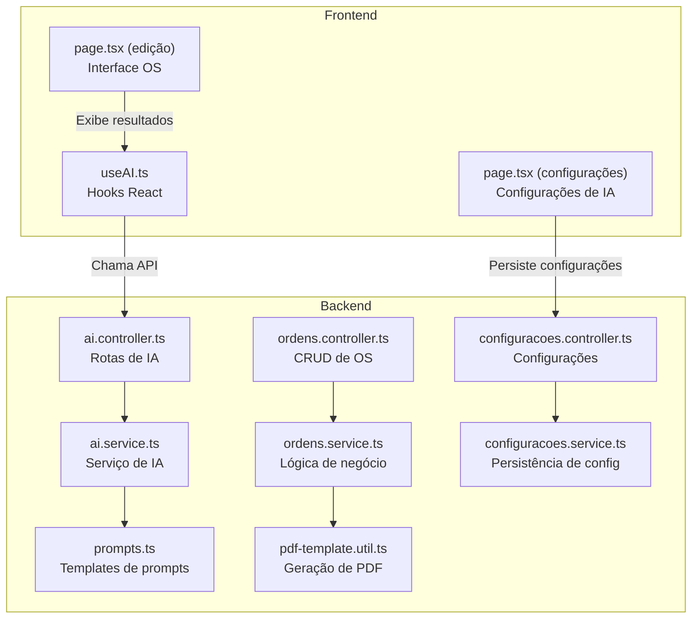
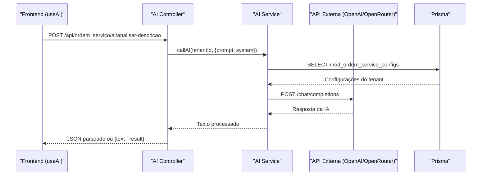
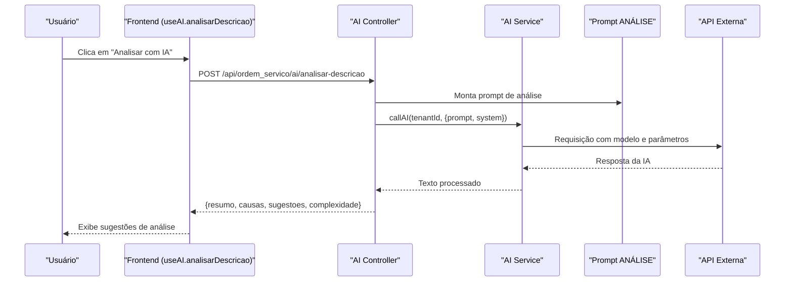
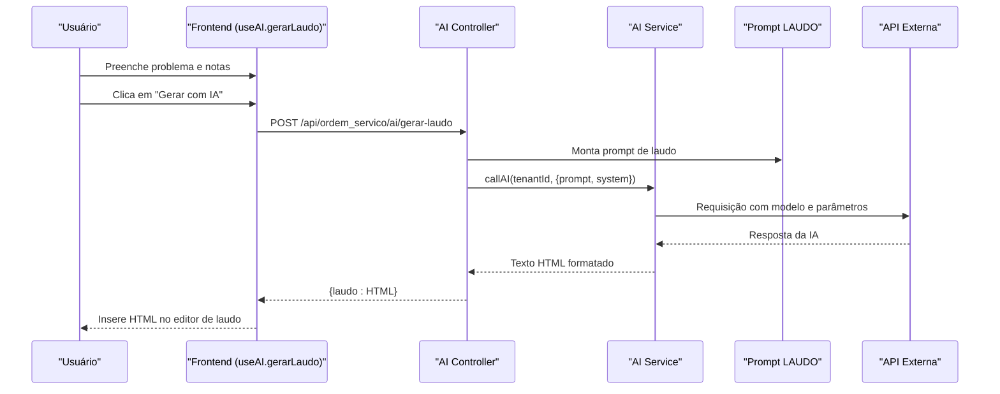
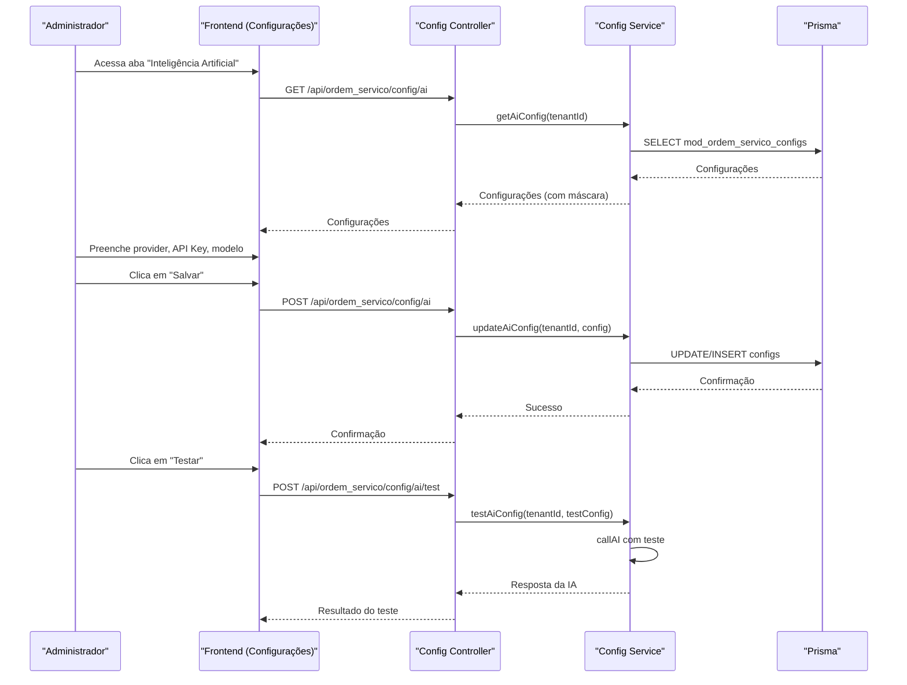
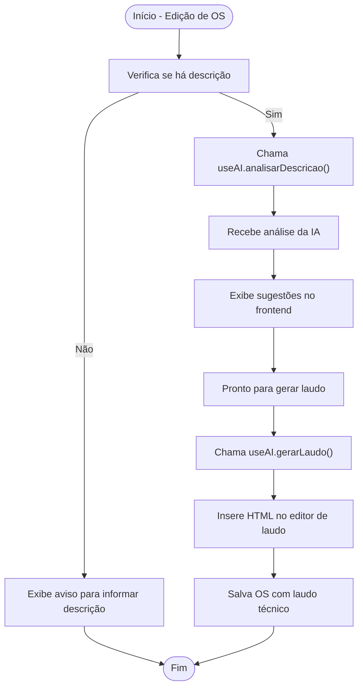
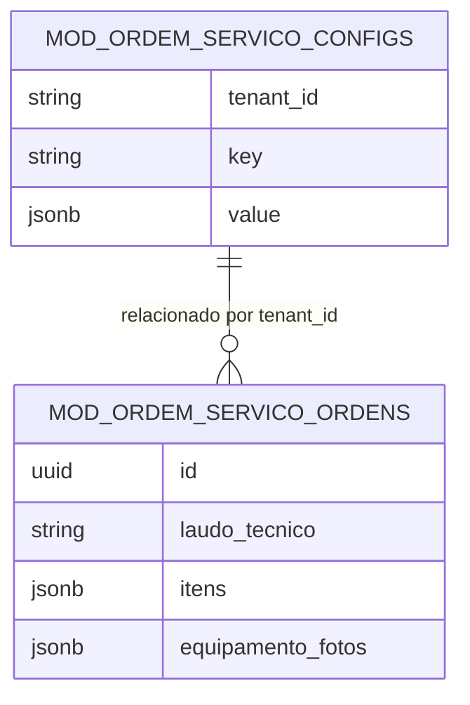
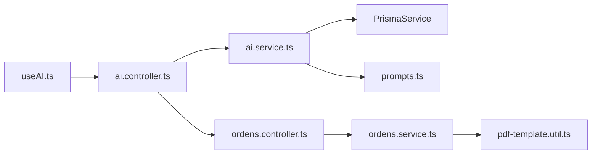

# Fluxos de Trabalho com IA

<cite>
**Arquivos referenciados neste documento**
- [ai.controller.ts](file://backend/shared/controllers/ai.controller.ts)
- [ai.service.ts](file://backend/shared/services/ai.service.ts)
- [prompts.ts](file://backend/shared/services/prompts.ts)
- [useAI.ts](file://frontend/hooks/useAI.ts)
- [page.tsx (edição de OS)](file://frontend/pages/ordens/edit/page.tsx)
- [ordens.controller.ts](file://backend/ordens/ordens.controller.ts)
- [ordens.service.ts](file://backend/ordens/ordens.service.ts)
- [pdf-template.util.ts](file://backend/ordens/pdf-template.util.ts)
- [configuracoes.controller.ts](file://backend/configuracoes/configuracoes.controller.ts)
- [configuracoes.service.ts](file://backend/configuracoes/configuracoes.service.ts)
- [page.tsx (configurações)](file://frontend/pages/configuracoes/page.tsx)
- [ordem-servico.types.ts](file://frontend/types/ordem-servico.types.ts)
</cite>

## Sumário
1. [Introdução](#introdução)
2. [Estrutura do Projeto](#estrutura-do-projeto)
3. [Componentes-Chave da IA](#componentes-chave-da-ia)
4. [Arquitetura Geral](#arquitetura-geral)
5. [Fluxos de Trabalho Detalhados](#fluxos-de-trabalho-detalhados)
6. [Integração com Ordens de Serviço](#integração-com-ordens-de-serviço)
7. [Armazenamento e Uso dos Resultados](#armazenamento-e-uso-dos-resultados)
8. [Análise de Dependências](#análise-de-dependências)
9. [Considerações de Desempenho](#considerações-de-desempenho)
10. [Guia de Solução de Problemas](#guia-de-solução-de-problemas)
11. [Conclusão](#conclusão)

## Introdução
Este documento descreve como a Inteligência Artificial (IA) está integrada nos fluxos de trabalho do módulo de Ordens de Serviço. Ele explica como a IA auxilia na análise de problemas, geração de laudos e criação de relatórios técnicos, quais componentes são afetados, como os resultados são apresentados e armazenados, e como esses resultados são utilizados nas ordens de serviço.

## Estrutura do Projeto
O projeto segue uma arquitetura modular com backend (NestJS) e frontend (Next.js). A integração com IA ocorre através de um controller dedicado no backend, um serviço de IA que consulta APIs externas (OpenAI/OpenRouter), e hooks no frontend que encapsulam chamadas à API.

**Diagrama fonte**
- [ai.controller.ts](file://backend/shared/controllers/ai.controller.ts#L1-L53)
- [ai.service.ts](file://backend/shared/services/ai.service.ts#L1-L91)
- [prompts.ts](file://backend/shared/services/prompts.ts#L1-L27)
- [useAI.ts](file://frontend/hooks/useAI.ts#L1-L41)
- [page.tsx (edição de OS)](file://frontend/pages/ordens/edit/page.tsx#L153-L184)
- [page.tsx (configurações)](file://frontend/pages/configuracoes/page.tsx#L474-L541)
- [ordens.controller.ts](file://backend/ordens/ordens.controller.ts#L1-L377)
- [ordens.service.ts](file://backend/ordens/ordens.service.ts#L1-L800)
- [pdf-template.util.ts](file://backend/ordens/pdf-template.util.ts#L1-L462)
- [configuracoes.controller.ts](file://backend/configuracoes/configuracoes.controller.ts#L1-L136)
- [configuracoes.service.ts](file://backend/configuracoes/configuracoes.service.ts#L1-L331)

**Seção fonte**
- [ai.controller.ts](file://backend/shared/controllers/ai.controller.ts#L1-L53)
- [ai.service.ts](file://backend/shared/services/ai.service.ts#L1-L91)
- [prompts.ts](file://backend/shared/services/prompts.ts#L1-L27)
- [useAI.ts](file://frontend/hooks/useAI.ts#L1-L41)
- [page.tsx (edição de OS)](file://frontend/pages/ordens/edit/page.tsx#L153-L184)
- [page.tsx (configurações)](file://frontend/pages/configuracoes/page.tsx#L474-L541)
- [ordens.controller.ts](file://backend/ordens/ordens.controller.ts#L1-L377)
- [ordens.service.ts](file://backend/ordens/ordens.service.ts#L1-L800)
- [pdf-template.util.ts](file://backend/ordens/pdf-template.util.ts#L1-L462)
- [configuracoes.controller.ts](file://backend/configuracoes/configuracoes.controller.ts#L1-L136)
- [configuracoes.service.ts](file://backend/configuracoes/configuracoes.service.ts#L1-L331)

## Componentes-Chave da IA
- Controller de IA: expõe endpoints para análise de descrição e geração de laudo técnico.
- Serviço de IA: consulta a API externa (OpenAI/OpenRouter) com base em configurações do tenant.
- Prompts: templates de instruções e dados de entrada para a IA.
- Hook useAI: encapsula chamadas à API de IA no frontend.
- Interface de edição de OS: permite acionar a IA e exibir resultados.
- Interface de configurações: permite ativar e testar a IA.

**Seção fonte**
- [ai.controller.ts](file://backend/shared/controllers/ai.controller.ts#L14-L51)
- [ai.service.ts](file://backend/shared/services/ai.service.ts#L33-L89)
- [prompts.ts](file://backend/shared/services/prompts.ts#L1-L27)
- [useAI.ts](file://frontend/hooks/useAI.ts#L4-L39)
- [page.tsx (edição de OS)](file://frontend/pages/ordens/edit/page.tsx#L153-L184)
- [page.tsx (configurações)](file://frontend/pages/configuracoes/page.tsx#L474-L541)

## Arquitetura Geral
A IA é acionada via endpoints protegidos por autenticação JWT. O serviço de IA recupera as configurações do tenant, monta a requisição para a API externa e retorna o conteúdo processado. No frontend, o hook useAI encapsula as chamadas e fornece funções para análise e geração de laudo.

**Diagrama fonte**
- [ai.controller.ts](file://backend/shared/controllers/ai.controller.ts#L14-L34)
- [ai.service.ts](file://backend/shared/services/ai.service.ts#L33-L89)
- [prompts.ts](file://backend/shared/services/prompts.ts#L1-L27)

**Seção fonte**
- [ai.controller.ts](file://backend/shared/controllers/ai.controller.ts#L14-L34)
- [ai.service.ts](file://backend/shared/services/ai.service.ts#L33-L89)

## Fluxos de Trabalho Detalhados

### Fluxo 1: Análise de Descrição do Problema
Este fluxo ajuda a identificar diagnóstico inicial, possíveis causas, sugestões e complexidade com base na descrição fornecida.

**Diagrama fonte**
- [useAI.ts](file://frontend/hooks/useAI.ts#L7-L20)
- [ai.controller.ts](file://backend/shared/controllers/ai.controller.ts#L14-L34)
- [ai.service.ts](file://backend/shared/services/ai.service.ts#L33-L89)
- [prompts.ts](file://backend/shared/services/prompts.ts#L2-L12)

**Seção fonte**
- [useAI.ts](file://frontend/hooks/useAI.ts#L7-L20)
- [ai.controller.ts](file://backend/shared/controllers/ai.controller.ts#L14-L34)
- [ai.service.ts](file://backend/shared/services/ai.service.ts#L33-L89)
- [prompts.ts](file://backend/shared/services/prompts.ts#L2-L12)

### Fluxo 2: Geração de Laudo Técnico
Este fluxo transforma informações iniciais e anotações técnicas em um laudo profissional formatado em HTML.

**Diagrama fonte**
- [useAI.ts](file://frontend/hooks/useAI.ts#L22-L33)
- [ai.controller.ts](file://backend/shared/controllers/ai.controller.ts#L36-L51)
- [ai.service.ts](file://backend/shared/services/ai.service.ts#L33-L89)
- [prompts.ts](file://backend/shared/services/prompts.ts#L13-L26)

**Seção fonte**
- [useAI.ts](file://frontend/hooks/useAI.ts#L22-L33)
- [ai.controller.ts](file://backend/shared/controllers/ai.controller.ts#L36-L51)
- [ai.service.ts](file://backend/shared/services/ai.service.ts#L33-L89)
- [prompts.ts](file://backend/shared/services/prompts.ts#L13-L26)

### Fluxo 3: Configuração e Teste da IA
Os administradores podem ativar e testar a integração de IA por tenant.

**Diagrama fonte**
- [page.tsx (configurações)](file://frontend/pages/configuracoes/page.tsx#L474-L541)
- [configuracoes.controller.ts](file://backend/configuracoes/configuracoes.controller.ts#L80-L111)
- [configuracoes.service.ts](file://backend/configuracoes/configuracoes.service.ts#L179-L281)

**Seção fonte**
- [page.tsx (configurações)](file://frontend/pages/configuracoes/page.tsx#L474-L541)
- [configuracoes.controller.ts](file://backend/configuracoes/configuracoes.controller.ts#L80-L111)
- [configuracoes.service.ts](file://backend/configuracoes/configuracoes.service.ts#L179-L281)

## Integração com Ordens de Serviço
A IA é utilizada diretamente dentro da tela de edição de ordens de serviço. O usuário pode:
- Acionar a análise de descrição para sugerir diagnóstico, causas e sugestões.
- Gerar um laudo técnico formatado em HTML com base no problema e notas técnicas.
- Salvar os resultados diretamente no campo de laudo técnico da OS.

**Diagrama fonte**
- [page.tsx (edição de OS)](file://frontend/pages/ordens/edit/page.tsx#L153-L184)
- [useAI.ts](file://frontend/hooks/useAI.ts#L7-L33)

**Seção fonte**
- [page.tsx (edição de OS)](file://frontend/pages/ordens/edit/page.tsx#L153-L184)
- [useAI.ts](file://frontend/hooks/useAI.ts#L7-L33)

## Armazenamento e Uso dos Resultados
- Os resultados da IA são armazenados no campo específico da ordem de serviço:
  - Laudo técnico: campo `laudo_tecnico` no DTO de atualização.
- A geração de PDF utiliza o conteúdo do laudo técnico para incluir o conteúdo formatado em HTML no documento final.
- As configurações da IA (provider, API Key, modelo, temperatura, tokens máximos) são persistidas por tenant.

**Diagrama fonte**
- [ordens.service.ts](file://backend/ordens/ordens.service.ts#L656-L770)
- [pdf-template.util.ts](file://backend/ordens/pdf-template.util.ts#L167-L171)
- [configuracoes.service.ts](file://backend/configuracoes/configuracoes.service.ts#L205-L241)

**Seção fonte**
- [ordens.service.ts](file://backend/ordens/ordens.service.ts#L656-L770)
- [pdf-template.util.ts](file://backend/ordens/pdf-template.util.ts#L167-L171)
- [configuracoes.service.ts](file://backend/configuracoes/configuracoes.service.ts#L205-L241)

## Análise de Dependências
- O serviço de IA depende de:
  - Prisma para ler as configurações do tenant.
  - Fetch para chamar a API externa.
  - Prompt templates para montar as mensagens.
- O frontend depende do hook useAI para comunicação com os endpoints.
- A geração de PDF depende do conteúdo do laudo técnico armazenado.

**Diagrama fonte**
- [useAI.ts](file://frontend/hooks/useAI.ts#L1-L41)
- [ai.controller.ts](file://backend/shared/controllers/ai.controller.ts#L1-L53)
- [ai.service.ts](file://backend/shared/services/ai.service.ts#L1-L91)
- [prompts.ts](file://backend/shared/services/prompts.ts#L1-L27)
- [ordens.controller.ts](file://backend/ordens/ordens.controller.ts#L1-L377)
- [ordens.service.ts](file://backend/ordens/ordens.service.ts#L1-L800)
- [pdf-template.util.ts](file://backend/ordens/pdf-template.util.ts#L1-L462)

**Seção fonte**
- [useAI.ts](file://frontend/hooks/useAI.ts#L1-L41)
- [ai.controller.ts](file://backend/shared/controllers/ai.controller.ts#L1-L53)
- [ai.service.ts](file://backend/shared/services/ai.service.ts#L1-L91)
- [prompts.ts](file://backend/shared/services/prompts.ts#L1-L27)
- [ordens.controller.ts](file://backend/ordens/ordens.controller.ts#L1-L377)
- [ordens.service.ts](file://backend/ordens/ordens.service.ts#L1-L800)
- [pdf-template.util.ts](file://backend/ordens/pdf-template.util.ts#L1-L462)

## Considerações de Desempenho
- A IA é acionada via requisições assíncronas e pode impactar o tempo de resposta da interface. Recomenda-se:
  - Mostrar estados de carregamento durante as chamadas.
  - Limitar o tamanho do prompt e tokens máximos conforme configuração.
  - Armazenar respostas em cache temporário quando a mesma análise for solicitada novamente.

## Guia de Solução de Problemas
- Erros de configuração:
  - Verifique se a IA está habilitada e se a API Key está configurada para o tenant.
  - Utilize o endpoint de teste para validar a conexão.
- Erros de autenticação:
  - Certifique-se de que o usuário está logado e possui token válido.
- Erros de rede:
  - Verifique conectividade com a API externa e timeouts.
- Validação de dados:
  - Garanta que campos obrigatórios (descrição, problema, notas) estejam preenchidos antes de chamar a IA.

**Seção fonte**
- [configuracoes.controller.ts](file://backend/configuracoes/configuracoes.controller.ts#L80-L111)
- [configuracoes.service.ts](file://backend/configuracoes/configuracoes.service.ts#L254-L281)
- [ai.service.ts](file://backend/shared/services/ai.service.ts#L40-L46)

## Conclusão
A integração da IA no módulo de Ordens de Serviço proporciona uma assistência significativa na análise de problemas e geração de laudos técnicos. Com prompts estruturados, configurações por tenant e persistência de resultados, a IA se torna uma ferramenta eficaz para agilizar processos operacionais e melhorar a qualidade técnica dos documentos gerados. A arquitetura modular facilita manutenção e expansão futura.