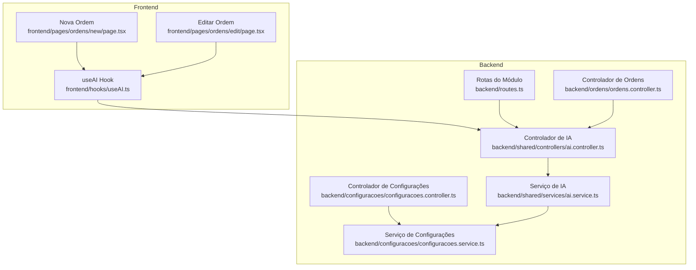
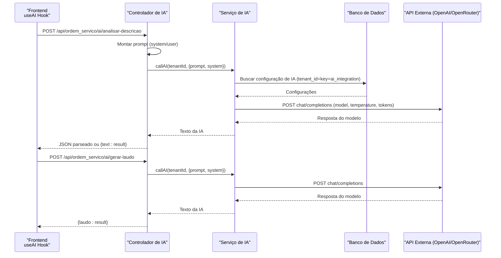
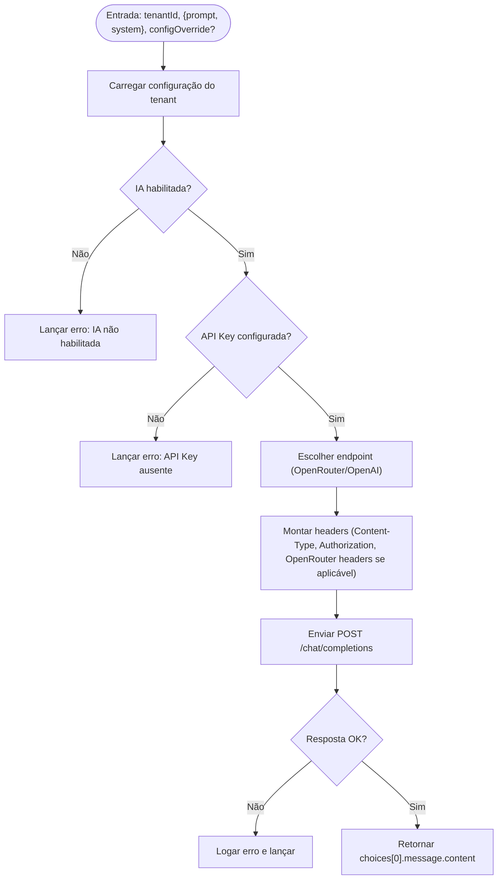
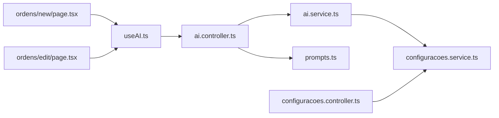

# Integração com IA

<cite>
**Arquivos referenciados neste documento**
- [backend/shared/controllers/ai.controller.ts](file://backend/shared/controllers/ai.controller.ts)
- [backend/shared/services/ai.service.ts](file://backend/shared/services/ai.service.ts)
- [backend/shared/services/prompts.ts](file://backend/shared/services/prompts.ts)
- [backend/configuracoes/configuracoes.controller.ts](file://backend/configuracoes/configuracoes.controller.ts)
- [backend/configuracoes/configuracoes.service.ts](file://backend/configuracoes/configuracoes.service.ts)
- [backend/ordens/ordens.controller.ts](file://backend/ordens/ordens.controller.ts)
- [backend/routes.ts](file://backend/routes.ts)
- [frontend/hooks/useAI.ts](file://frontend/hooks/useAI.ts)
- [frontend/pages/ordens/edit/page.tsx](file://frontend/pages/ordens/edit/page.tsx)
- [frontend/pages/ordens/new/page.tsx](file://frontend/pages/ordens/new/page.tsx)
- [frontend/pages/configuracoes/page.tsx](file://frontend/pages/configuracoes/page.tsx)
</cite>

## Sumário
1. [Introdução](#introdução)
2. [Estrutura do Projeto](#estrutura-do-projeto)
3. [Componentes Principais](#componentes-principais)
4. [Visão Geral da Arquitetura](#visão-geral-da-arquitetura)
5. [Análise Detalhada dos Componentes](#análise-detalhada-dos-componentes)
6. [Análise de Dependências](#análise-de-dependências)
7. [Considerações de Desempenho](#considerações-de-desempenho)
8. [Guia de Solução de Problemas](#guia-de-solução-de-problemas)
9. [Conclusão](#conclusão)
10. [Apêndices](#apêndices)

## Introdução
Este documento apresenta uma visão abrangente da integração com inteligência artificial (IA) no módulo de Ordens de Serviço. Ele explica como a IA é utilizada para auxiliar na análise de problemas descritos pelos clientes e na geração de laudos técnicos, além de detalhar a configuração de prompts, as APIs de IA, as integrações com provedores OpenAI/OpenRouter e os fluxos de trabalho no frontend e backend. O conteúdo foi elaborado para ser acessível a iniciantes e oferecer profundidade técnica para desenvolvedores experientes.

## Estrutura do Projeto
A integração IA está distribuída entre camadas do backend e frontend:

- Backend:
  - Controlador de IA expõe endpoints para análise de descrição e geração de laudo.
  - Serviço de IA faz a chamada à API externa com base em configurações do tenant.
  - Prompts pré-definidos orientam o comportamento do modelo.
  - Configurações permitem ativar/desativar a IA, escolher provedor, definir modelo e parâmetros.
  - Rotas do módulo incluem os controladores relevantes.

- Frontend:
  - Hook useAI encapsula chamadas às rotas de IA.
  - Telas de criação e edição de ordens de serviço integram a IA com campos de entrada e saída.

**Diagrama fonte**
- [backend/routes.ts](file://backend/routes.ts#L9-L17)
- [backend/shared/controllers/ai.controller.ts](file://backend/shared/controllers/ai.controller.ts#L7-L8)
- [backend/shared/services/ai.service.ts](file://backend/shared/services/ai.service.ts#L33-L89)
- [backend/configuracoes/configuracoes.controller.ts](file://backend/configuracoes/configuracoes.controller.ts#L80-L111)
- [backend/configuracoes/configuracoes.service.ts](file://backend/configuracoes/configuracoes.service.ts#L205-L281)
- [frontend/hooks/useAI.ts](file://frontend/hooks/useAI.ts#L1-L41)
- [frontend/pages/ordens/new/page.tsx](file://frontend/pages/ordens/new/page.tsx#L76-L108)
- [frontend/pages/ordens/edit/page.tsx](file://frontend/pages/ordens/edit/page.tsx#L153-L184)

**Seção fonte**
- [backend/routes.ts](file://backend/routes.ts#L9-L17)
- [backend/shared/controllers/ai.controller.ts](file://backend/shared/controllers/ai.controller.ts#L7-L8)
- [frontend/hooks/useAI.ts](file://frontend/hooks/useAI.ts#L1-L41)

## Componentes Principais
- Controlador de IA: expõe endpoints POST para análise de descrição e geração de laudo, montando prompts com base nos dados fornecidos e delegando à camada de serviço.
- Serviço de IA: recupera configurações do tenant, valida estado da IA e faz requisições HTTP para a API externa (OpenAI ou OpenRouter), tratando erros e retornando a resposta do modelo.
- Prompts: definições de instruções do sistema e templates de usuário para análise de problemas e geração de laudos.
- Configurações de IA: endpoints e lógica para persistir e testar configurações específicas de cada tenant.
- Hook useAI: funções no frontend para consumir os endpoints de IA com tratamento de loading e erros.
- Telas de ordens: integração com IA para sugerir diagnósticos e gerar laudos técnicos.

**Seção fonte**
- [backend/shared/controllers/ai.controller.ts](file://backend/shared/controllers/ai.controller.ts#L14-L51)
- [backend/shared/services/ai.service.ts](file://backend/shared/services/ai.service.ts#L33-L89)
- [backend/shared/services/prompts.ts](file://backend/shared/services/prompts.ts#L1-L27)
- [backend/configuracoes/configuracoes.controller.ts](file://backend/configuracoes/configuracoes.controller.ts#L80-L111)
- [backend/configuracoes/configuracoes.service.ts](file://backend/configuracoes/configuracoes.service.ts#L205-L281)
- [frontend/hooks/useAI.ts](file://frontend/hooks/useAI.ts#L1-L41)
- [frontend/pages/ordens/edit/page.tsx](file://frontend/pages/ordens/edit/page.tsx#L153-L184)
- [frontend/pages/ordens/new/page.tsx](file://frontend/pages/ordens/new/page.tsx#L76-L108)

## Visão Geral da Arquitetura
A integração IA segue um fluxo de autenticação JWT, onde o frontend chama endpoints protegidos do backend. O controlador de IA monta o prompt com base nos dados do usuário e encaminha à camada de serviço. O serviço de IA carrega as configurações do tenant, seleciona o provedor e envia uma requisição HTTP para a API externa. A resposta é devolvida ao frontend, que a utiliza para preencher campos como sugestões de diagnóstico e laudo técnico.

**Diagrama fonte**
- [backend/shared/controllers/ai.controller.ts](file://backend/shared/controllers/ai.controller.ts#L14-L51)
- [backend/shared/services/ai.service.ts](file://backend/shared/services/ai.service.ts#L33-L89)
- [backend/configuracoes/configuracoes.service.ts](file://backend/configuracoes/configuracoes.service.ts#L243-L253)
- [frontend/hooks/useAI.ts](file://frontend/hooks/useAI.ts#L7-L33)

## Análise Detalhada dos Componentes

### Controlador de IA
- Endpoints:
  - POST /api/ordem_servico/ai/analisar-descricao: recebe uma descrição textual e retorna um JSON estruturado com resumo, causas, sugestões e complexidade.
  - POST /api/ordem_servico/ai/gerar-laudo: recebe problema e notas técnicas e retorna um laudo formatado em HTML.
- Autenticação: usa guard JWT.
- Tratamento de erro: registra logs e lança exceções para que o middleware trate.

**Seção fonte**
- [backend/shared/controllers/ai.controller.ts](file://backend/shared/controllers/ai.controller.ts#L14-L51)

### Serviço de IA
- Recupera configuração de IA por tenant a partir de uma tabela específica.
- Valida se a IA está habilitada e se a API Key está configurada.
- Decide o endpoint da API externa com base no provedor (OpenAI ou OpenRouter).
- Envia requisição HTTP com parâmetros como modelo, temperatura e número máximo de tokens.
- Trata erros de rede e respostas inválidas, logando detalhes.

**Diagrama fonte**
- [backend/shared/services/ai.service.ts](file://backend/shared/services/ai.service.ts#L33-L89)

**Seção fonte**
- [backend/shared/services/ai.service.ts](file://backend/shared/services/ai.service.ts#L15-L89)

### Prompts
- ANÁLISE DE DESCRIÇÃO:
  - Instrução do sistema: orienta a resposta em JSON estruturado contendo resumo, causas, sugestões e complexidade.
  - Prompt do usuário: recebe a descrição do problema e solicita análise técnica.
- GERAÇÃO DE LAUDO:
  - Instrução do sistema: define estrutura de diagnóstico, procedimentos, conclusão e recomendações, com formatação HTML.
  - Prompt do usuário: combina problema inicial e notas técnicas para gerar um laudo profissional.

**Seção fonte**
- [backend/shared/services/prompts.ts](file://backend/shared/services/prompts.ts#L1-L27)

### Configurações de IA
- Endpoints:
  - GET /api/ordem_servico/config/ai: retorna configuração atual (com máscara da API Key).
  - POST /api/ordem_servico/config/ai: atualiza configuração (mantém API Key se já existente).
  - POST /api/ordem_servico/config/ai/test: testa a configuração com uma mensagem de verificação.
- Persistência: armazena em uma tabela com chave fixa para cada tenant.
- Máscara de segurança: exibe apenas os últimos 4 caracteres da API Key ao recuperar.

**Seção fonte**
- [backend/configuracoes/configuracoes.controller.ts](file://backend/configuracoes/configuracoes.controller.ts#L80-L111)
- [backend/configuracoes/configuracoes.service.ts](file://backend/configuracoes/configuracoes.service.ts#L205-L281)

### Frontend: useAI Hook
- Funções:
  - analisarDescricao(descricao): envia a descrição para análise e retorna o resultado.
  - gerarLaudo(problema, notas): gera um laudo técnico com base em problema e notas.
  - analyzing: flag para indicar estado de processamento.
- Tratamento de erros: exibe mensagens no console e lança exceções para que o componente trate.

**Seção fonte**
- [frontend/hooks/useAI.ts](file://frontend/hooks/useAI.ts#L1-L41)

### Telas de Ordens de Serviço
- Nova Ordem:
  - Botão “Analisar com IA” no formulário dispara a análise da descrição.
  - Toast notifica sucesso ou erro.
- Editar Ordem:
  - Campo de “Laudo Técnico” com botão “Gerar com IA” para criar conteúdo profissional com base em problema e notas.
  - Estados de loading e desabilitação de campos durante processamento.

**Seção fonte**
- [frontend/pages/ordens/new/page.tsx](file://frontend/pages/ordens/new/page.tsx#L76-L108)
- [frontend/pages/ordens/edit/page.tsx](file://frontend/pages/ordens/edit/page.tsx#L153-L184)

## Análise de Dependências
- O controlador de IA depende do serviço de IA e dos prompts.
- O serviço de IA depende do acesso ao banco de dados para carregar configurações e da API externa.
- O controlador de configurações fornece acesso às configurações de IA, sendo usado tanto pelo próprio serviço quanto pela interface administrativa.
- As telas de ordens dependem do hook useAI, que chama os endpoints do controlador de IA.

**Diagrama fonte**
- [backend/shared/controllers/ai.controller.ts](file://backend/shared/controllers/ai.controller.ts#L1-L8)
- [backend/shared/services/ai.service.ts](file://backend/shared/services/ai.service.ts#L1-L13)
- [backend/shared/services/prompts.ts](file://backend/shared/services/prompts.ts#L1-L27)
- [backend/configuracoes/configuracoes.controller.ts](file://backend/configuracoes/configuracoes.controller.ts#L1-L12)
- [backend/configuracoes/configuracoes.service.ts](file://backend/configuracoes/configuracoes.service.ts#L205-L281)
- [frontend/hooks/useAI.ts](file://frontend/hooks/useAI.ts#L1-L41)
- [frontend/pages/ordens/new/page.tsx](file://frontend/pages/ordens/new/page.tsx#L76-L108)
- [frontend/pages/ordens/edit/page.tsx](file://frontend/pages/ordens/edit/page.tsx#L153-L184)

**Seção fonte**
- [backend/shared/controllers/ai.controller.ts](file://backend/shared/controllers/ai.controller.ts#L1-L8)
- [backend/shared/services/ai.service.ts](file://backend/shared/services/ai.service.ts#L1-L13)
- [backend/configuracoes/configuracoes.controller.ts](file://backend/configuracoes/configuracoes.controller.ts#L1-L12)
- [frontend/hooks/useAI.ts](file://frontend/hooks/useAI.ts#L1-L41)

## Considerações de Desempenho
- Latência da API externa: o tempo total de resposta depende da latência da API OpenAI/OpenRouter e da rede. Recomenda-se:
  - Usar cache local para respostas frequentemente solicitadas (ex: sugestões de diagnóstico).
  - Limitar o tamanho do prompt e das notas técnicas para reduzir tokens.
  - Ajustar temperature e max_tokens conforme a necessidade de padronização vs criatividade.
- Escalabilidade: o serviço de IA realiza chamadas HTTP síncronas. Em cenários de alta carga, considere:
  - Filas assíncronas para geração de laudos.
  - Rate limiting e retries com backoff.
  - Monitoramento de tempos de resposta e taxas de erro.

## Guia de Solução de Problemas
- Erro: IA não habilitada para este tenant
  - Causa: configuração desativada.
  - Solução: ativar a IA nas configurações do módulo.
  - Fonte: [backend/shared/services/ai.service.ts](file://backend/shared/services/ai.service.ts#L40-L42)
- Erro: API Key da IA não configurada
  - Causa: campo apiKey ausente.
  - Solução: inserir a chave de API nas configurações e salvar.
  - Fonte: [backend/shared/services/ai.service.ts](file://backend/shared/services/ai.service.ts#L44-L46)
- Erro: Falha na API de IA (status inválido)
  - Causa: resposta HTTP não ok.
  - Solução: verificar credenciais, limite de uso e conectividade; testar a configuração via endpoint de teste.
  - Fonte: [backend/shared/services/ai.service.ts](file://backend/shared/services/ai.service.ts#L77-L81)
- Erro: Resposta não é JSON esperado
  - Causa: modelo retornou texto fora do formato esperado.
  - Solução: revisar prompts e parâmetros; garantir que o modelo esteja configurado corretamente.
  - Fonte: [backend/shared/controllers/ai.controller.ts](file://backend/shared/controllers/ai.controller.ts#L24-L29)
- Erro no frontend ao gerar laudo
  - Causa: falha na requisição.
  - Solução: verificar se a IA está habilitada e configurada; confirmar que o campo “problema” e “notas” estão preenchidos.
  - Fonte: [frontend/pages/ordens/edit/page.tsx](file://frontend/pages/ordens/edit/page.tsx#L153-L184), [frontend/hooks/useAI.ts](file://frontend/hooks/useAI.ts#L22-L33)

**Seção fonte**
- [backend/shared/services/ai.service.ts](file://backend/shared/services/ai.service.ts#L40-L81)
- [backend/shared/controllers/ai.controller.ts](file://backend/shared/controllers/ai.controller.ts#L24-L29)
- [frontend/pages/ordens/edit/page.tsx](file://frontend/pages/ordens/edit/page.tsx#L153-L184)
- [frontend/hooks/useAI.ts](file://frontend/hooks/useAI.ts#L22-L33)

## Conclusão
A integração com IA no módulo de Ordens de Serviço oferece funcionalidades poderosas de análise de problemas e geração de laudos técnicos. Com prompts bem definidos, configurações por tenant e uma arquitetura modular, o sistema permite que técnicos acelerem diagnósticos e padronizem relatórios. A implementação atual demonstra boas práticas de tratamento de erros, segurança (máscara de API Key) e escalabilidade com opções de melhoria.

## Apêndices

### Exemplos de Uso
- Análise de descrição:
  - Frontend: [frontend/pages/ordens/new/page.tsx](file://frontend/pages/ordens/new/page.tsx#L76-L108)
  - Backend: [backend/shared/controllers/ai.controller.ts](file://backend/shared/controllers/ai.controller.ts#L14-L34)
- Geração de laudo:
  - Frontend: [frontend/pages/ordens/edit/page.tsx](file://frontend/pages/ordens/edit/page.tsx#L1284-L1320)
  - Backend: [backend/shared/controllers/ai.controller.ts](file://backend/shared/controllers/ai.controller.ts#L36-L51)

### Configurações Disponíveis
- Habilitar IA, Provedor (OpenAI/OpenRouter), API Key, Modelo, Temperatura, Tokens Máximos.
- Interface administrativa: [frontend/pages/configuracoes/page.tsx](file://frontend/pages/configuracoes/page.tsx#L1089-L1143)
- Endpoints de configuração: [backend/configuracoes/configuracoes.controller.ts](file://backend/configuracoes/configuracoes.controller.ts#L80-L111)