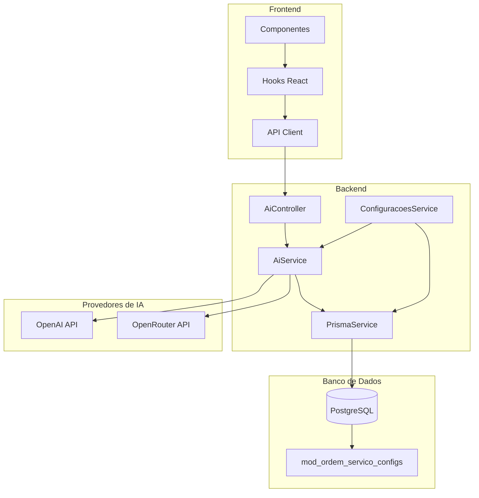
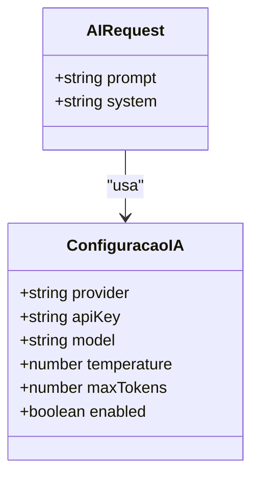
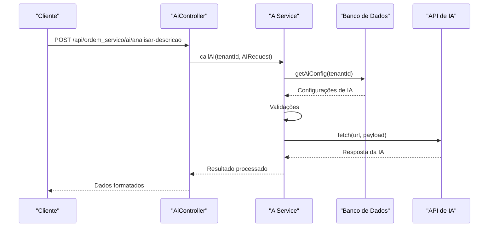
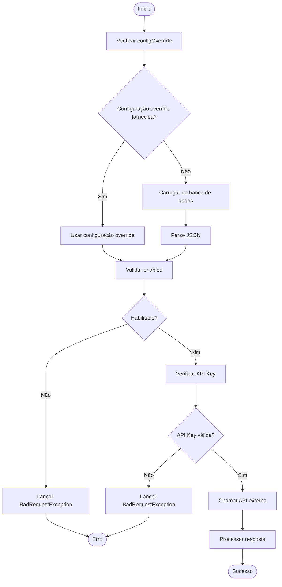
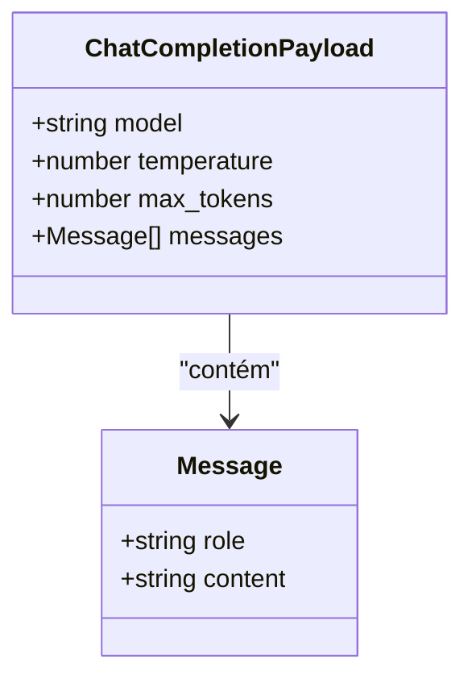
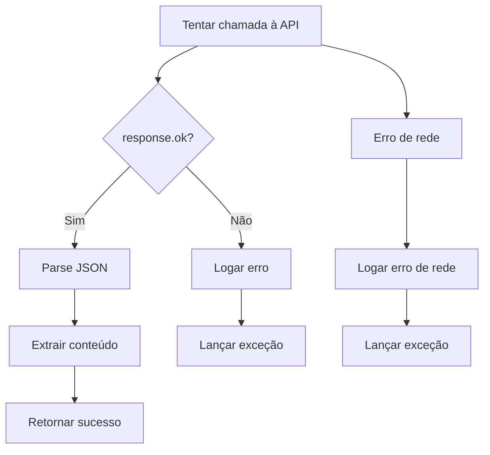
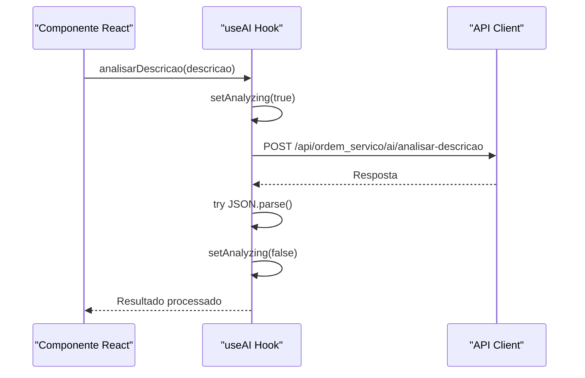
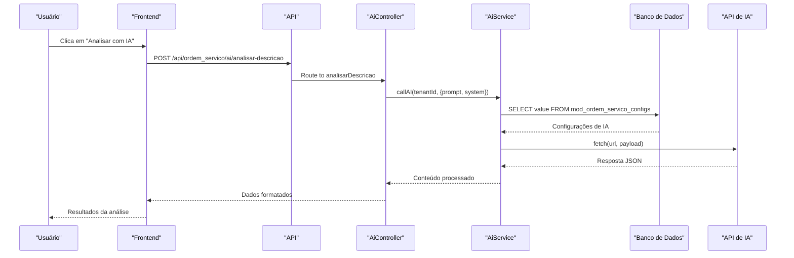

# Serviço de IA

<cite>
**Arquivos Referenciados neste Documento**
- [ai.service.ts](file://backend/shared/services/ai.service.ts)
- [ai.controller.ts](file://backend/shared/controllers/ai.controller.ts)
- [prompts.ts](file://backend/shared/services/prompts.ts)
- [useAI.ts](file://frontend/hooks/useAI.ts)
- [configuracoes.service.ts](file://backend/configuracoes/configuracoes.service.ts)
- [configuracoes.controller.ts](file://backend/configuracoes/configuracoes.controller.ts)
- [page.tsx](file://frontend/pages/configuracoes/page.tsx)
- [page.tsx](file://frontend/pages/ordens/edit/page.tsx)
- [001_master.sql](file://backend/migrations/001_master.sql)
- [004_add_tables_os.sql](file://backend/migrations/004_add_tables_os.sql)
</cite>

## Sumário
- [Introdução](#introdução)
- [Arquitetura Geral](#arquitetura-geral)
- [Componentes Principais](#componentes-principais)
- [Interface AIRequest e Configurações](#interface-airequest-e-configurações)
- [Implementação do AiService](#implementação-do-aiservice)
- [Integração com APIs Externas](#integração-com-apis-externas)
- [Tratamento de Erros e Segurança](#tratamento-de-erros-e-segurança)
- [Uso nos Controllers e Componentes](#uso-nos-controllers-e-componentes)
- [Fluxo de Comunicação](#fluxo-de-comunicação)
- [Considerações de Resiliência](#considerações-de-resiliência)
- [Conclusão](#conclusão)

## Introdução

O serviço de IA do módulo de ordem de serviço é uma implementação robusta que permite a integração com provedores de inteligência artificial através de APIs externas. O sistema oferece funcionalidades avançadas de análise de problemas técnicos e geração de laudos técnicos automatizados, otimizando significativamente o processo de atendimento técnico.

O serviço é totalmente multitenant, permitindo que diferentes empresas (tenants) configurem suas próprias credenciais de API e parâmetros específicos, mantendo isolamento completo entre os dados e configurações.

## Arquitetura Geral

**Diagrama Fontes**
- [ai.controller.ts](file://backend/shared/controllers/ai.controller.ts#L1-L53)
- [ai.service.ts](file://backend/shared/services/ai.service.ts#L1-L91)
- [configuracoes.service.ts](file://backend/configuracoes/configuracoes.service.ts#L1-L331)

## Componentes Principais

### 1. AiService - Serviço Principal

O `AiService` é o componente central responsável por toda a lógica de comunicação com as APIs de IA. Ele implementa um padrão de serviço NestJS com injeção de dependência e logging abrangente.

### 2. AiController - Controlador de API

O `AiController` expõe endpoints REST para consumo dos recursos de IA, com autenticação JWT obrigatória e validação de permissões.

### 3. ConfiguracoesService - Gerenciamento de Configurações

Responsável por armazenar e gerenciar as configurações de IA por tenant, incluindo testes de conexão e validações de segurança.

### 4. Hooks React - Frontend

O hook `useAI` fornece uma interface simplificada para o frontend consumir os serviços de IA com tratamento de estados e erros.

**Seção Fontes**
- [ai.service.ts](file://backend/shared/services/ai.service.ts#L9-L13)
- [ai.controller.ts](file://backend/shared/controllers/ai.controller.ts#L7-L12)
- [configuracoes.service.ts](file://backend/configuracoes/configuracoes.service.ts#L6-L12)

## Interface AIRequest e Configurações

### Interface AIRequest

A interface `AIRequest` define a estrutura básica para requisições à API de IA:

**Diagrama Fontes**
- [ai.service.ts](file://backend/shared/services/ai.service.ts#L4-L7)

### Configurações de IA

As configurações são armazenadas no banco de dados em formato JSON com as seguintes propriedades:

| Propriedade | Tipo | Descrição | Padrão |
|-------------|------|-----------|--------|
| `enabled` | boolean | Habilita/desabilita o serviço de IA | false |
| `provider` | string | Provedor de IA (openai/openrouter) | 'openai' |
| `apiKey` | string | Chave de API secreta | - |
| `model` | string | Modelo de IA a ser usado | 'gpt-3.5-turbo' |
| `temperature` | number | Aleatoriedade da resposta (0.0-1.0) | 0.3 |
| `maxTokens` | number | Limite máximo de tokens | 800 |

**Seção Fontes**
- [ai.service.ts](file://backend/shared/services/ai.service.ts#L48-L74)
- [configuracoes.service.ts](file://backend/configuracoes/configuracoes.service.ts#L380-L387)

## Implementação do AiService

### Métodos Principais

**Diagrama Fontes**
- [ai.controller.ts](file://backend/shared/controllers/ai.controller.ts#L14-L34)
- [ai.service.ts](file://backend/shared/services/ai.service.ts#L33-L89)

### Fluxo de Validação

**Diagrama Fontes**
- [ai.service.ts](file://backend/shared/services/ai.service.ts#L33-L46)

**Seção Fontes**
- [ai.service.ts](file://backend/shared/services/ai.service.ts#L15-L31)
- [ai.service.ts](file://backend/shared/services/ai.service.ts#L33-L46)

## Integração com APIs Externas

### Provedores Suportados

O sistema suporta dois provedores de IA:

#### OpenAI (Direct)
- URL: `https://api.openai.com/v1/chat/completions`
- Headers padrão: `Authorization: Bearer ${apiKey}`, `Content-Type: application/json`
- Modelo padrão: `gpt-3.5-turbo`

#### OpenRouter (Unified API)
- URL: `https://openrouter.ai/api/v1/chat/completions`
- Headers adicionais: 
  - `HTTP-Referer: https://github.com/Projeto-menu-multitenant-seguro`
  - `X-Title: Sistema OS Multitenant`
- Modelo padrão: `openai/gpt-3.5-turbo`

### Payload de Requisição

O payload enviado para as APIs segue o padrão da OpenAI:

**Diagrama Fontes**
- [ai.service.ts](file://backend/shared/services/ai.service.ts#L66-L74)

**Seção Fontes**
- [ai.service.ts](file://backend/shared/services/ai.service.ts#L48-L60)
- [ai.service.ts](file://backend/shared/services/ai.service.ts#L66-L74)

## Tratamento de Erros e Segurança

### Tratamento de Erros

O serviço implementa um sistema abrangente de tratamento de erros:

**Diagrama Fontes**
- [ai.service.ts](file://backend/shared/services/ai.service.ts#L77-L88)

### Medidas de Segurança

1. **Máscara de API Key**: As chaves de API são mascaradas ao serem exibidas no frontend
2. **Validação de Configurações**: Verificação obrigatória de todas as configurações antes de qualquer chamada
3. **Autenticação JWT**: Todos os endpoints exigem autenticação válida
4. **Logging Aberto**: Registros detalhados de todas as operações para auditoria

**Seção Fontes**
- [configuracoes.service.ts](file://backend/configuracoes/configuracoes.service.ts#L193-L196)
- [ai.service.ts](file://backend/shared/services/ai.service.ts#L28-L30)

## Uso nos Controllers e Componentes

### Backend - Controllers

#### AiController

O controlador expõe dois endpoints principais:

1. **POST /api/ordem_servico/ai/analisar-descricao**
   - Analisa descrições de problemas técnicos
   - Retorna JSON estruturado com resumo, causas e sugestões

2. **POST /api/ordem_servico/ai/gerar-laudo**
   - Gera laudos técnicos profissionais em HTML
   - Baseado em problemas e notas técnicas fornecidos

#### ConfiguracoesController

Gerencia as configurações de IA:

1. **GET /api/ordem_servico/config/ai** - Busca configurações atuais
2. **POST /api/ordem_servico/config/ai** - Atualiza configurações
3. **POST /api/ordem_servico/config/ai/test** - Testa conexão com IA

**Seção Fontes**
- [ai.controller.ts](file://backend/shared/controllers/ai.controller.ts#L14-L51)
- [configuracoes.controller.ts](file://backend/configuracoes/configuracoes.controller.ts#L80-L111)

### Frontend - Hooks e Componentes

#### useAI Hook

O hook `useAI` fornece uma interface simplificada para o frontend:

**Diagrama Fontes**
- [useAI.ts](file://frontend/hooks/useAI.ts#L7-L20)

#### Componente de Edição de Ordens

O componente de edição de ordens utiliza o serviço de IA para:

1. **Análise Automática**: Botão "Analisar com IA" que processa descrições de problemas
2. **Geração de Laudos**: Funções para gerar laudos técnicos formatados
3. **Integração em Tempo Real**: Feedback imediato ao técnico

**Seção Fontes**
- [useAI.ts](file://frontend/hooks/useAI.ts#L1-L41)
- [page.tsx](file://frontend/pages/ordens/edit/page.tsx#L160-L184)

## Fluxo de Comunicação

### Fluxo Completo de Análise

**Diagrama Fontes**
- [ai.controller.ts](file://backend/shared/controllers/ai.controller.ts#L14-L34)
- [ai.service.ts](file://backend/shared/services/ai.service.ts#L33-L89)

## Considerações de Resiliência

### Timeout e Retentativas

O serviço foi projetado com resiliência em mente:

1. **Validações Antecipadas**: Verificação completa das configurações antes de qualquer chamada
2. **Tratamento de Erros**: Captura e logagem detalhada de todos os erros
3. **Fallbacks**: Retorno de mensagens de erro claras ao frontend
4. **Logging Aberto**: Todos os passos são registrados para diagnóstico

### Melhorias Sugeridas

1. **Implementar Retry Logic**: Adicionar tentativas automáticas para falhas temporárias
2. **Rate Limiting**: Implementar limites para evitar sobrecarga de API
3. **Caching**: Armazenar respostas em cache para consultas repetidas
4. **Monitoramento**: Adicionar métricas de desempenho e disponibilidade

## Conclusão

O serviço de IA implementado no módulo de ordem de serviço representa uma solução completa e robusta para integração com APIs de inteligência artificial. Com sua arquitetura multitenant, validações rigorosas e tratamento abrangente de erros, o sistema proporciona uma experiência segura e confiável tanto para desenvolvedores quanto para usuários finais.

As funcionalidades de análise de problemas técnicos e geração de laudos técnicos automatizados representam um diferencial competitivo significativo, aumentando a produtividade dos técnicos e melhorando a qualidade do atendimento ao cliente.

A implementação segue boas práticas de desenvolvimento moderno, incluindo injeção de dependência, logging abrangente, tratamento de erros e segurança adequada, tornando o sistema escalável e mantível para ambientes corporativos de grande porte.