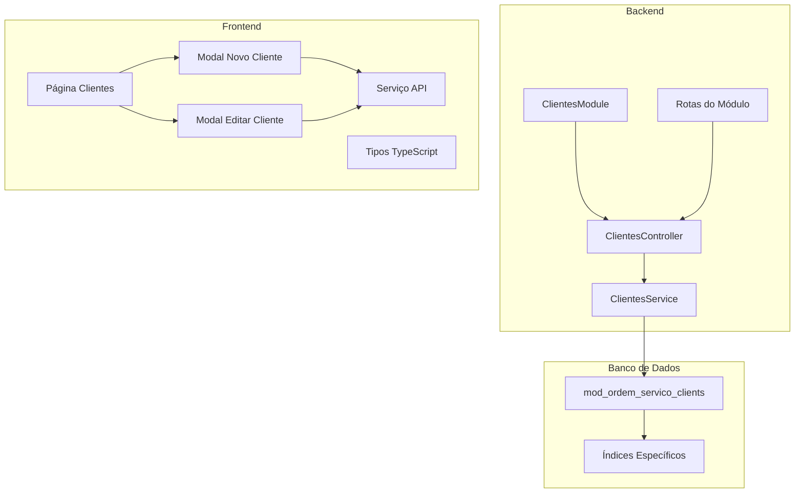
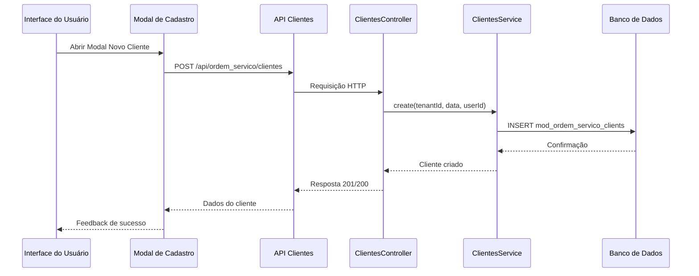
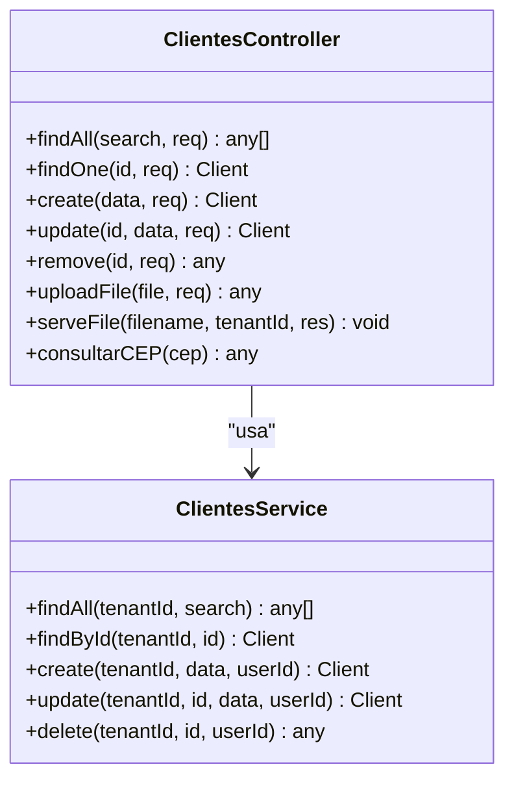
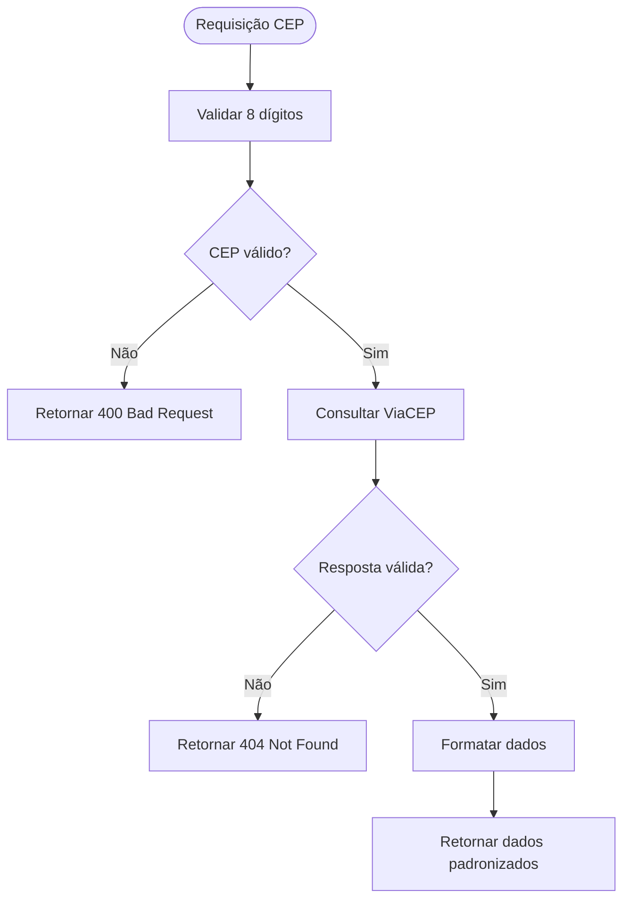
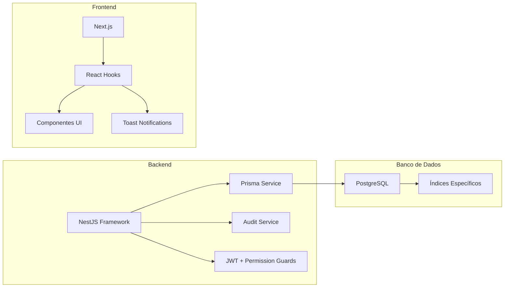
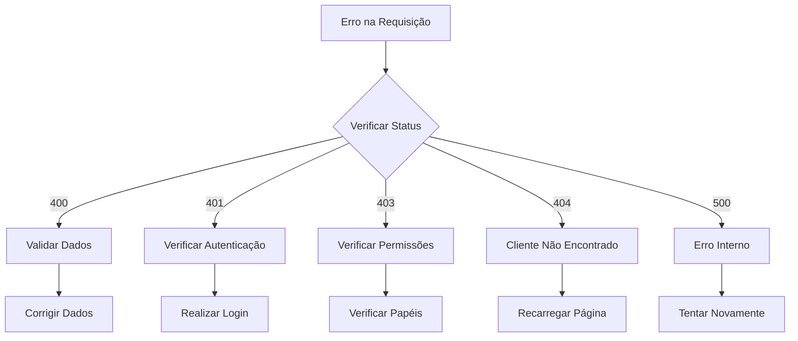

# Cadastro de Clientes

<cite>
**Arquivos Referenciados Neste Documento**
- [clientes.controller.ts](file://backend/clientes/clientes.controller.ts)
- [clientes.service.ts](file://backend/clientes/clientes.service.ts)
- [clientes.module.ts](file://backend/clientes/clientes.module.ts)
- [page.tsx](file://frontend/pages/clientes/page.tsx)
- [ClientModal.tsx](file://frontend/components/ClientModal.tsx)
- [ClientEditModal.tsx](file://frontend/components/ClientEditModal.tsx)
- [ordem-servico.types.ts](file://frontend/types/ordem-servico.types.ts)
- [001_master.sql](file://backend/migrations/001_master.sql)
- [routes.ts](file://backend/routes.ts)
- [module.config.json](file://backend/module.config.json)
- [templateService.ts](file://frontend/services/templateService.ts)
</cite>

## Sumário
1. [Introdução](#introdução)
2. [Estrutura do Projeto](#estrutura-do-projeto)
3. [Componentes Principais](#componentes-principais)
4. [Visão Geral da Arquitetura](#visão-geral-da-arquitetura)
5. [Análise Detalhada dos Componentes](#análise-detalhada-dos-componentes)
6. [Análise de Dependências](#análise-de-dependências)
7. [Considerações de Desempenho](#considerações-de-desempenho)
8. [Guia de Solução de Problemas](#guia-de-solução-de-problemas)
9. [Conclusão](#conclusão)

## Introdução
Este documento apresenta uma documentação completa do CRUD de clientes, abrangendo todas as operações REST, implementação backend e frontend, validações, tratamento de erros e boas práticas. O módulo permite gerenciar clientes com cadastro, edição, exclusão e busca avançada, incluindo integração com CEP via serviço externo e upload de imagens com compressão.

## Estrutura do Projeto
O módulo de clientes segue uma arquitetura modular com separação clara entre backend e frontend:

**Diagrama Fonte**
- [clientes.controller.ts](file://backend/clientes/clientes.controller.ts#L12-L182)
- [clientes.service.ts](file://backend/clientes/clientes.service.ts#L1-L253)
- [clientes.module.ts](file://backend/clientes/clientes.module.ts#L1-L14)
- [page.tsx](file://frontend/pages/clientes/page.tsx#L1-L341)

**Seção Fonte**
- [clientes.controller.ts](file://backend/clientes/clientes.controller.ts#L1-L182)
- [clientes.service.ts](file://backend/clientes/clientes.service.ts#L1-L253)
- [clientes.module.ts](file://backend/clientes/clientes.module.ts#L1-L14)

## Componentes Principais

### Backend - Controlador de Clientes
O controlador expõe os seguintes endpoints REST:

| Método | Endpoint | Permissão | Descrição |
|--------|----------|-----------|-----------|
| GET | `/api/ordem_servico/clientes` | `view` | Lista clientes com busca e paginação |
| GET | `/api/ordem_servico/clientes/:id` | `view_details` | Retorna cliente específico |
| POST | `/api/ordem_servico/clientes` | `create` | Cria novo cliente |
| PUT | `/api/ordem_servico/clientes/:id` | `edit` | Atualiza cliente existente |
| DELETE | `/api/ordem_servico/clientes/:id` | `delete` | Remove cliente (com validação) |
| POST | `/api/ordem_servico/clientes/upload` | `create/edit` | Upload de imagem com compressão |
| GET | `/api/ordem_servico/clientes/uploads/:tenantId/:filename` | `public` | Serviço de arquivos |
| GET | `/api/ordem_servico/clientes/cep/:cep` | `public` | Consulta CEP via ViaCEP |

### Frontend - Componentes React
- **Página Principal**: [page.tsx](file://frontend/pages/clientes/page.tsx#L40-L341)
- **Modal Novo Cliente**: [ClientModal.tsx](file://frontend/components/ClientModal.tsx#L1-L673)
- **Modal Editar Cliente**: [ClientEditModal.tsx](file://frontend/components/ClientEditModal.tsx#L1-L711)
- **Tipos TypeScript**: [ordem-servico.types.ts](file://frontend/types/ordem-servico.types.ts#L50-L66)

**Seção Fonte**
- [page.tsx](file://frontend/pages/clientes/page.tsx#L1-L341)
- [ClientModal.tsx](file://frontend/components/ClientModal.tsx#L1-L673)
- [ClientEditModal.tsx](file://frontend/components/ClientEditModal.tsx#L1-L711)
- [ordem-servico.types.ts](file://frontend/types/ordem-servico.types.ts#L1-L235)

## Visão Geral da Arquitetura

**Diagrama Fonte**
- [clientes.controller.ts](file://backend/clientes/clientes.controller.ts#L42-L52)
- [clientes.service.ts](file://backend/clientes/clientes.service.ts#L96-L149)
- [ClientModal.tsx](file://frontend/components/ClientModal.tsx#L317-L366)

## Análise Detalhada dos Componentes

### Controlador de Clientes

#### Implementação e Validações
O controlador implementa autenticação JWT e permissões específicas:

**Diagrama Fonte**
- [clientes.controller.ts](file://backend/clientes/clientes.controller.ts#L14-L72)
- [clientes.service.ts](file://backend/clientes/clientes.service.ts#L7-L253)

#### Validações de Dados
- **Campos obrigatórios**: Nome e Telefone Principal
- **Validação de CEP**: 8 dígitos obrigatórios
- **Validação de Telefone**: 10-11 dígitos
- **Validação de Documento**: CPF/CNPJ conforme tamanho

#### Tratamento de Erros
- HTTP 404 para cliente não encontrado
- HTTP 400 para dados inválidos
- HTTP 403 para acesso negado
- HTTP 500 para erros internos

**Seção Fonte**
- [clientes.controller.ts](file://backend/clientes/clientes.controller.ts#L21-L72)
- [clientes.service.ts](file://backend/clientes/clientes.service.ts#L96-L149)

### Serviço de Clientes

#### Operações CRUD
- **Busca Avançada**: Com filtro por nome, telefone e email
- **Paginação**: Limite de 20 resultados para buscas e 50 para listagens
- **Filtros**: Busca com `LIKE` e ordenação por nome
- **Soft Delete**: Campo `deleted_at` para remoção lógica

#### Integração de CEP

**Diagrama Fonte**
- [clientes.controller.ts](file://backend/clientes/clientes.controller.ts#L142-L181)

#### Upload de Imagens
- **Compressão**: Redimensionamento para avatar (400px)
- **Armazenamento**: Pasta isolada por tenant
- **Segurança**: Validação de caminho e extensões
- **URL Pública**: Endpoint público para acesso

**Seção Fonte**
- [clientes.controller.ts](file://backend/clientes/clientes.controller.ts#L74-L140)
- [clientes.service.ts](file://backend/clientes/clientes.service.ts#L212-L252)

### Interface do Usuário

#### Página Principal
A página implementa:
- **Busca em tempo real**: Debounce de 500ms
- **Filtros**: Ativos/Inativos e busca textual
- **Tabela de resultados**: Com paginação e ordenação
- **Ações**: Criar, editar, excluir e alternar status

#### Modal de Cadastro
Funcionalidades avançadas:
- **Máscaras**: CPF/CNPJ, Telefone, CEP
- **Validações**: Em tempo real com feedback visual
- **Consulta CEP**: Integração automática com ViaCEP
- **Upload de imagem**: Com compressão e preview

#### Modal de Edição
Recursos adicionais:
- **Alternar status**: Ativo/Inativo com confirmação
- **Endereço completo**: CEP, rua, número, complemento
- **Observações**: Área de texto para informações adicionais

**Seção Fonte**
- [page.tsx](file://frontend/pages/clientes/page.tsx#L53-L144)
- [ClientModal.tsx](file://frontend/components/ClientModal.tsx#L73-L123)
- [ClientEditModal.tsx](file://frontend/components/ClientEditModal.tsx#L116-L157)

## Análise de Dependências

**Diagrama Fonte**
- [clientes.module.ts](file://backend/clientes/clientes.module.ts#L8-L13)
- [routes.ts](file://backend/routes.ts#L9-L17)

### Mapeamento de Tabelas e Índices
O banco de dados contém índices otimizados para consultas de clientes:

| Índice | Coluna | Tipo | Descrição |
|--------|--------|------|-----------|
| idx_mod_ordem_servico_clients_tenant_id | tenant_id | INDEX | Filtragem por locatário |
| idx_mod_ordem_servico_clients_name | name | INDEX | Busca por nome |
| idx_mod_ordem_servico_clients_document | document | INDEX | Busca por documento |
| idx_mod_ordem_servico_clients_active | is_active | INDEX | Filtro por status |
| idx_mod_ordem_servico_clients_email | email | INDEX | Busca por email |
| idx_mod_ordem_servico_clients_address_zip | address_zip | INDEX | Busca por CEP |

**Seção Fonte**
- [001_master.sql](file://backend/migrations/001_master.sql#L333-L342)

## Considerações de Desempenho

### Otimizações Implementadas
- **Busca com limite**: Máximo 20 resultados para buscas e 50 para listagens
- **Índices específicos**: Otimização para consultas mais comuns
- **Debounce de 500ms**: Redução de requisições durante digitação
- **Compressão de imagens**: Diminuição do tamanho de uploads
- **Soft delete**: Preservação de dados históricos

### Melhorias Recomendadas
- Implementar paginação infinita para grandes volumes de dados
- Adicionar cache para consultas frequentes
- Considerar indexação adicional para buscas complexas
- Implementar rate limiting para endpoints públicos

## Guia de Solução de Problemas

### Erros Comuns e Soluções

#### Erros de Validação
- **Mensagem**: "Nome e Telefone principal são obrigatórios"
- **Solução**: Preencher campos obrigatórios antes de salvar
- **Local**: [clientes.service.ts](file://backend/clientes/clientes.service.ts#L97-L98)

#### Erros de CEP
- **Mensagem**: "CEP deve ter 8 dígitos"
- **Solução**: Informar CEP com 8 dígitos apenas
- **Local**: [clientes.controller.ts](file://backend/clientes/clientes.controller.ts#L148-L149)

#### Erros de Upload
- **Mensagem**: "Erro ao processar upload"
- **Solução**: Verificar tamanho e formato da imagem
- **Local**: [clientes.controller.ts](file://backend/clientes/clientes.controller.ts#L115-L118)

#### Erros de Exclusão
- **Mensagem**: "Não é possível excluir o cliente pois existem Ordens de Serviço associadas"
- **Solução**: Excluir ordens de serviço antes de remover o cliente
- **Local**: [clientes.service.ts](file://backend/clientes/clientes.service.ts#L222-L224)

### Diagnóstico de Erros

**Seção Fonte**
- [clientes.controller.ts](file://backend/clientes/clientes.controller.ts#L36-L38)
- [clientes.service.ts](file://backend/clientes/clientes.service.ts#L222-L237)

## Conclusão
O módulo de cadastro de clientes oferece uma implementação completa e robusta com:
- **Segurança**: Autenticação JWT e permissões granulares
- **Usabilidade**: Interface intuitiva com validações em tempo real
- **Performance**: Otimizações de banco de dados e cache
- **Integração**: Consulta de CEP e upload de imagens
- **Manutenibilidade**: Código bem estruturado e testável

As boas práticas implementadas incluem tratamento adequado de erros, validações robustas e separação clara de responsabilidades entre frontend e backend.