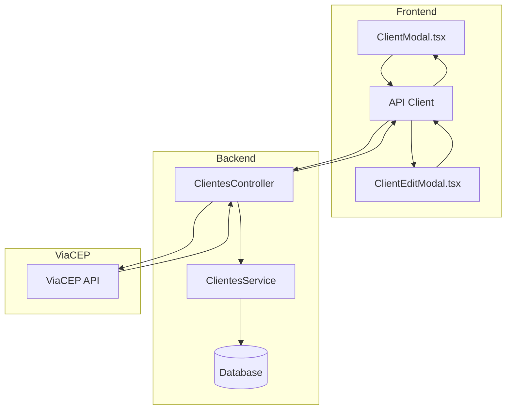
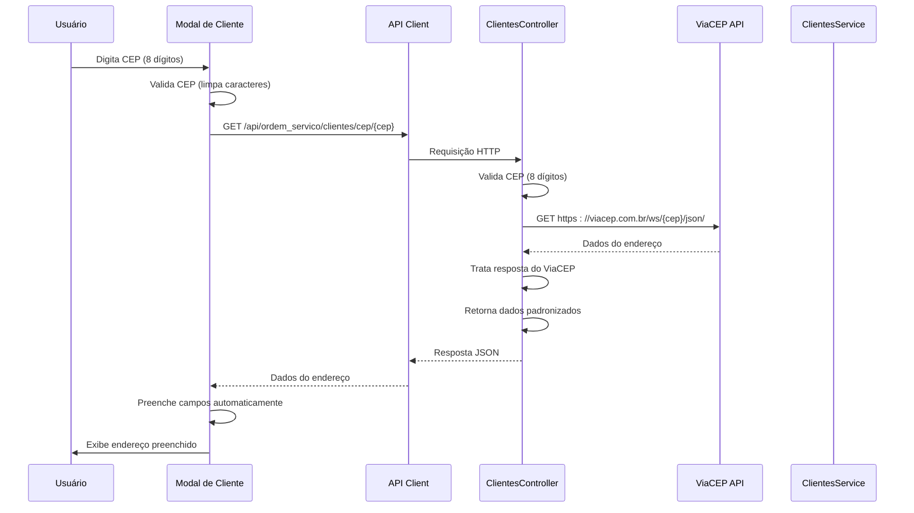
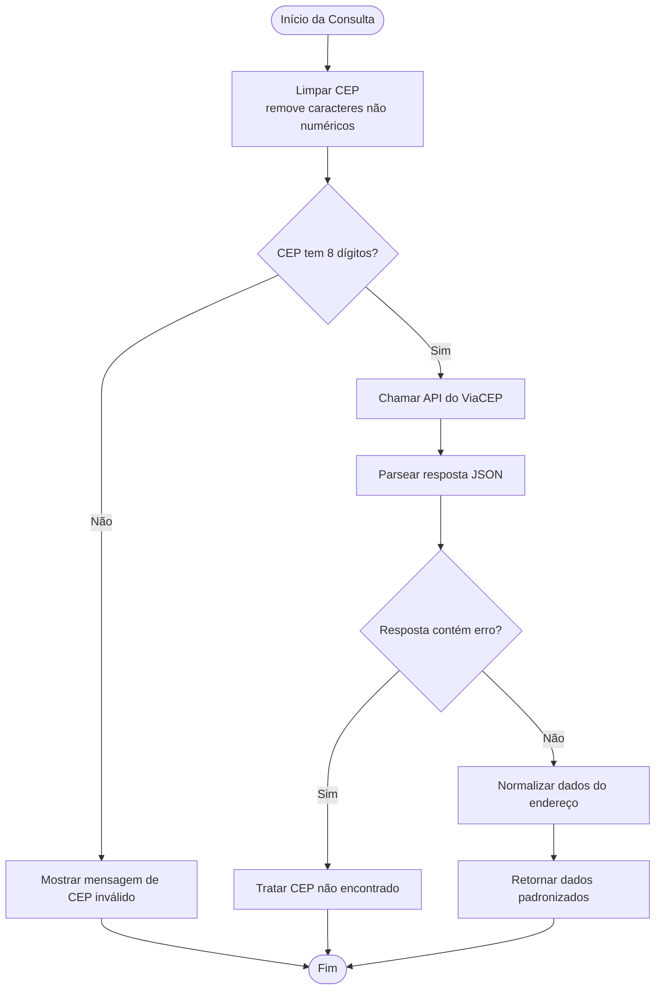
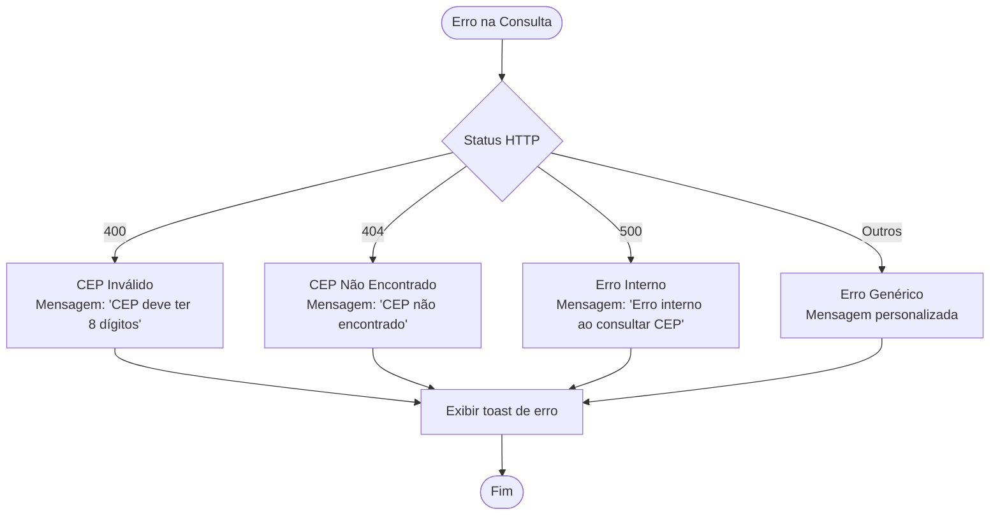

# Integração com ViaCEP

<cite>
**Arquivos Referenciados Neste Documento**
- [clientes.controller.ts](file://backend/clientes/clientes.controller.ts)
- [clientes.service.ts](file://backend/clientes/clientes.service.ts)
- [ClientEditModal.tsx](file://frontend/components/ClientEditModal.tsx)
- [ClientModal.tsx](file://frontend/components/ClientModal.tsx)
- [ordem_servico.service.ts](file://frontend/services/ordem_servico.service.ts)
</cite>

## Sumário
- [Introdução](#introdução)
- [Arquitetura Geral](#arquitetura-geral)
- [Fluxo de Integração](#fluxo-de-integração)
- [Implementação Backend](#implementação-backend)
- [Implementação Frontend](#implementação-frontend)
- [Tratamento de Erros](#tratamento-de-erros)
- [Exemplos de Chamadas API](#exemplos-de-chamadas-api)
- [Melhorias e Considerações](#melhorias-e-considersações)
- [Conclusão](#conclusão)

## Introdução

A integração com o ViaCEP permite que o sistema consulte automaticamente informações de endereço através do CEP informado pelo usuário. Esta funcionalidade melhora significativamente a experiência do usuário ao preencher automaticamente campos de endereço como rua, bairro, cidade e estado, evitando erros de digitação e redundâncias.

O sistema utiliza o serviço público do ViaCEP (viacep.com.br) como fonte de dados confiável e padronizada, retornando informações em formato JSON que são processadas e apresentadas ao usuário de forma automática.

## Arquitetura Geral



**Diagrama Fontes**
- [clientes.controller.ts](file://backend/clientes/clientes.controller.ts#L142-L181)
- [ClientModal.tsx](file://frontend/components/ClientModal.tsx#L125-L180)
- [ClientEditModal.tsx](file://frontend/components/ClientEditModal.tsx#L159-L214)

## Fluxo de Integração

### Fluxo Básico de Consulta



**Diagrama Fontes**
- [clientes.controller.ts](file://backend/clientes/clientes.controller.ts#L142-L181)
- [ClientModal.tsx](file://frontend/components/ClientModal.tsx#L125-L180)
- [ClientEditModal.tsx](file://frontend/components/ClientEditModal.tsx#L159-L214)

### Fluxo de Validação de CEP



**Diagrama Fontes**
- [clientes.controller.ts](file://backend/clientes/clientes.controller.ts#L146-L180)

## Implementação Backend

### Controlador de Clientes

O controlador implementa o endpoint público `/api/ordem_servico/clientes/cep/:cep` que faz a integração com o ViaCEP:

**Seção Fontes**
- [clientes.controller.ts](file://backend/clientes/clientes.controller.ts#L142-L181)

### Processamento de Dados

O backend realiza os seguintes passos:

1. **Validação do CEP**: Remove caracteres não numéricos e verifica se possui exatamente 8 dígitos
2. **Consulta ao ViaCEP**: Faz requisição HTTP para `https://viacep.com.br/ws/{cep}/json/`
3. **Tratamento de Resposta**: Verifica se o campo `erro` está presente
4. **Padronização de Dados**: Retorna objeto padronizado com campos `success: true`

### Estrutura de Resposta Padronizada

```typescript
{
  cep: string,
  logradouro: string,
  bairro: string,
  localidade: string,
  uf: string,
  complemento: string,
  success: boolean
}
```

## Implementação Frontend

### Componente ClientModal

O componente de cadastro de novo cliente implementa a funcionalidade de busca automática de CEP:

**Seção Fontes**
- [ClientModal.tsx](file://frontend/components/ClientModal.tsx#L125-L180)

### Componente ClientEditModal

O componente de edição de cliente também oferece a mesma funcionalidade:

**Seção Fontes**
- [ClientEditModal.tsx](file://frontend/components/ClientEditModal.tsx#L159-L214)

### Máscaras e Validações

Ambos os componentes implementam:

1. **Máscara de CEP**: Formata automaticamente para o padrão `00000-000`
2. **Validação em tempo real**: Verifica se o CEP possui 8 dígitos antes de consultar
3. **Tratamento de eventos**: Consulta ao pressionar Tab/Enter ou ao sair do campo

## Tratamento de Erros

### Erros Comuns e Tratamentos



**Diagrama Fontes**
- [clientes.controller.ts](file://backend/clientes/clientes.controller.ts#L172-L180)
- [ClientModal.tsx](file://frontend/components/ClientModal.tsx#L164-L180)
- [ClientEditModal.tsx](file://frontend/components/ClientEditModal.tsx#L198-L214)

### Mensagens de Erro Personalizadas

- **CEP Inválido**: "CEP inválido" - quando o CEP não possui 8 dígitos
- **CEP Não Encontrado**: "CEP não encontrado" - quando o ViaCEP retorna erro
- **Erro Interno**: "Erro interno ao consultar CEP" - para falhas de conexão ou parsing

## Exemplos de Chamadas API

### Requisição Básica

**Endpoint**: `GET /api/ordem_servico/clientes/cep/{cep}`

**Headers**: 
- Content-Type: application/json
- Authorization: Bearer {token}

**Parâmetros**:
- cep: Código postal (8 dígitos)

### Resposta de Sucesso

```json
{
  "cep": "01001000",
  "logradouro": "Praça da Sé",
  "bairro": "Sé",
  "localidade": "São Paulo",
  "uf": "SP",
  "complemento": "lado ímpar",
  "success": true
}
```

### Resposta de Erro

```json
{
  "statusCode": 404,
  "message": "CEP não encontrado",
  "error": "Not Found"
}
```

## Melhorias e Considerações

### Melhorias Sugeridas

1. **Cache de Consultas**: Armazenar temporariamente resultados de CEPs consultados recentemente
2. **Timeout Configurável**: Adicionar tempo limite para requisições ao ViaCEP
3. **Fallback Local**: Implementar busca em base local de CEPs caso o ViaCEP esteja indisponível
4. **Validação Mais Rígida**: Adicionar validações adicionais para CEPs inválidos

### Considerações de Segurança

- **Rate Limiting**: Implementar limites de requisições para evitar sobrecarga do ViaCEP
- **Sanitização de Entrada**: Garantir que apenas números sejam processados
- **Logging Controlado**: Registrar apenas informações necessárias para diagnóstico

### Performance

- **Debounce**: Implementar debounce para evitar múltiplas requisições consecutivas
- **Loading States**: Exibir indicadores visuais durante consultas
- **Prefetching**: Carregar dados quando o usuário começa a digitar

## Conclusão

A integração com o ViaCEP proporciona uma experiência de usuário excepcional ao automatizar o preenchimento de informações de endereço. A implementação segue boas práticas de tratamento de erros, validação de dados e feedback visual, garantindo uma experiência consistente mesmo em situações de falha do serviço externo.

A arquitetura modular permite fácil manutenção e expansão da funcionalidade, podendo ser estendida para incluir outras fontes de dados geográficos conforme necessário.