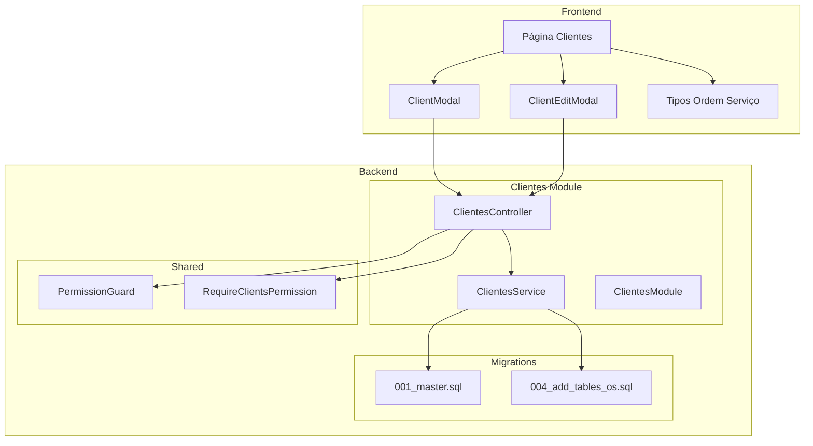
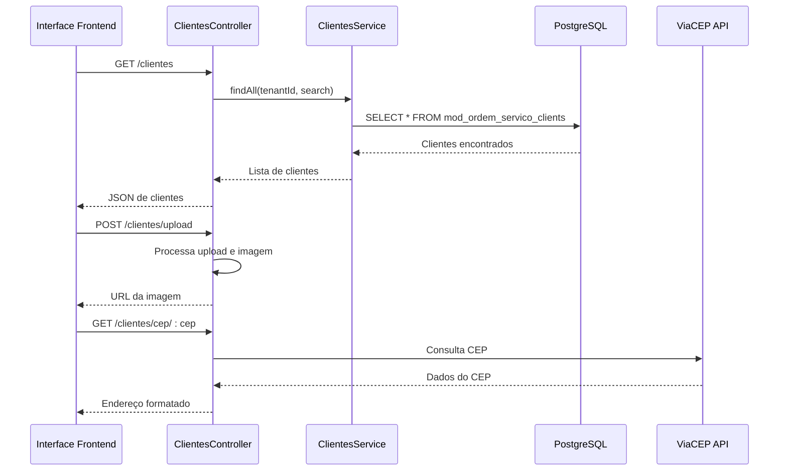
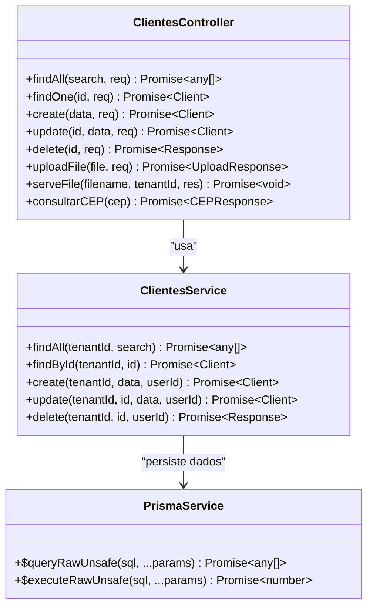
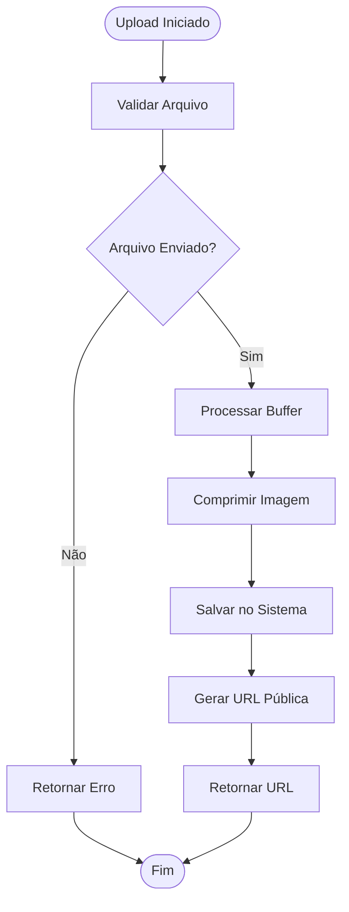
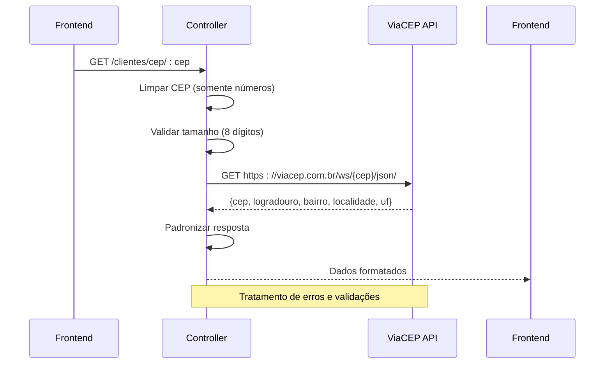
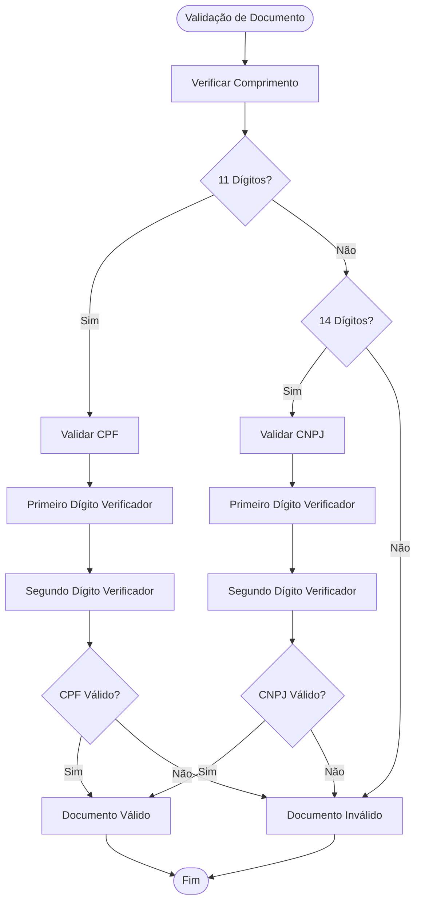
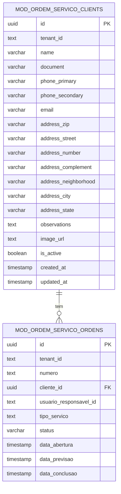
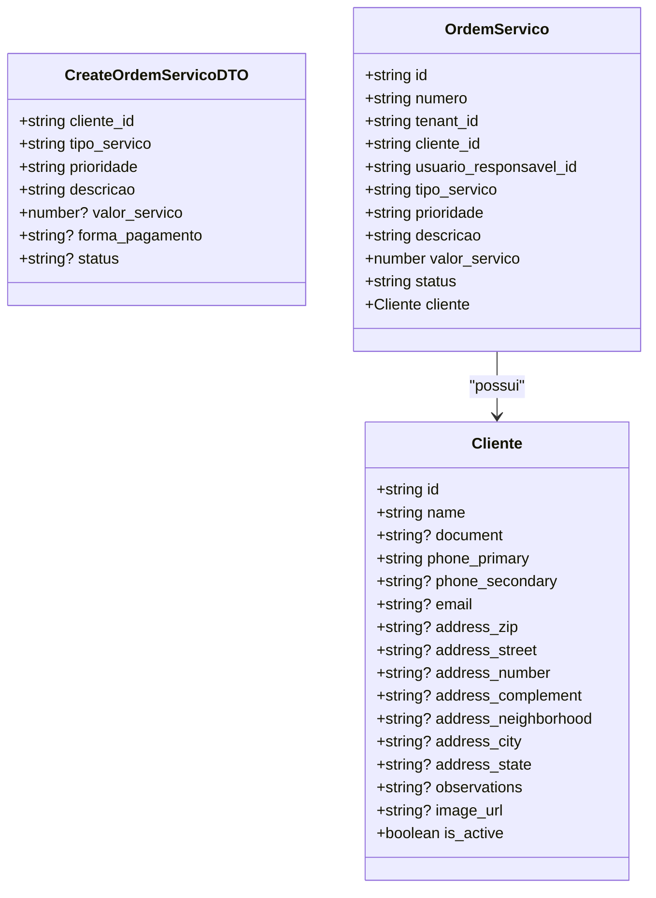

# Módulo de Clientes

<cite>
**Arquivos Referenciados Neste Documento**
- [clientes.controller.ts](file://backend/clientes/clientes.controller.ts)
- [clientes.service.ts](file://backend/clientes/clientes.service.ts)
- [clientes.module.ts](file://backend/clientes/clientes.module.ts)
- [001_master.sql](file://backend/migrations/001_master.sql)
- [004_add_tables_os.sql](file://backend/migrations/004_add_tables_os.sql)
- [page.tsx](file://frontend/pages/clientes/page.tsx)
- [ClientModal.tsx](file://frontend/components/ClientModal.tsx)
- [ClientEditModal.tsx](file://frontend/components/ClientEditModal.tsx)
- [ordem-servico.types.ts](file://frontend/types/ordem-servico.types.ts)
- [routes.ts](file://backend/routes.ts)
- [require-permission.decorator.ts](file://backend/shared/decorators/require-permission.decorator.ts)
- [permission.guard.ts](file://backend/shared/guards/permission.guard.ts)
</cite>

## Sumário
1. [Introdução](#introdução)
2. [Estrutura do Projeto](#estrutura-do-projeto)
3. [Componentes Principais](#componentes-principais)
4. [Visão Geral da Arquitetura](#visão-geral-da-arquitetura)
5. [Análise Detalhada dos Componentes](#análise-detalhada-dos-componentes)
6. [Relacionamentos e Integrações](#relacionamentos-e-integrações)
7. [Considerações de Desempenho](#considerações-de-desempenho)
8. [Guia de Solução de Problemas](#guia-de-solução-de-problemas)
9. [Conclusão](#conclusão)

## Introdução
O módulo de clientes é uma funcionalidade central do sistema de ordens de serviço, responsável por gerenciar toda a base de clientes, incluindo cadastro completo, busca avançada, upload de imagens e consulta de CEP via integração com o ViaCEP. O módulo foi projetado com foco em segurança, escalabilidade e experiência do usuário, integrando-se perfeitamente com o restante do sistema de ordens de serviço.

O módulo oferece:
- CRUD completo de clientes com validações rigorosas
- Upload e gerenciamento de imagens de perfil
- Consulta de CEP com integração ao ViaCEP
- Controle de permissões granular
- Auditoria de todas as operações
- Integração com o sistema de ordens de serviço

## Estrutura do Projeto
O módulo de clientes segue uma arquitetura modular bem definida com separação clara de responsabilidades:

**Fontes da Figura**
- [clientes.controller.ts](file://backend/clientes/clientes.controller.ts#L12-L182)
- [clientes.service.ts](file://backend/clientes/clientes.service.ts#L1-L253)
- [clientes.module.ts](file://backend/clientes/clientes.module.ts#L1-L14)

**Fontes da Seção**
- [clientes.controller.ts](file://backend/clientes/clientes.controller.ts#L1-L182)
- [clientes.service.ts](file://backend/clientes/clientes.service.ts#L1-L253)
- [clientes.module.ts](file://backend/clientes/clientes.module.ts#L1-L14)

## Componentes Principais

### Backend - Controlador de Clientes
O controlador implementa todas as operações CRUD com proteção de permissões e validações:

**Operações Disponíveis:**
- GET /api/ordem_servico/clientes - Listagem com busca
- GET /api/ordem_servico/clientes/:id - Detalhe específico
- POST /api/ordem_servico/clientes - Criação de novo cliente
- PUT /api/ordem_servico/clientes/:id - Atualização
- DELETE /api/ordem_servico/clientes/:id - Exclusão
- POST /api/ordem_servico/clientes/upload - Upload de imagens
- GET /api/ordem_servico/clientes/uploads/:tenantId/:filename - Serviço de imagens
- GET /api/ordem_servico/clientes/cep/:cep - Consulta de CEP

**Fontes da Seção**
- [clientes.controller.ts](file://backend/clientes/clientes.controller.ts#L21-L182)

### Backend - Serviço de Clientes
Implementa a lógica de negócio com persistência em banco de dados PostgreSQL:

**Recursos Especiais:**
- Busca inteligente com proteção contra buscas muito curtas
- Validação de dados antes da persistência
- Auditoria de todas as operações
- Verificação de dependências antes da exclusão
- Suporte a campos de endereço detalhados

**Fontes da Seção**
- [clientes.service.ts](file://backend/clientes/clientes.service.ts#L15-L253)

### Frontend - Interface de Usuário
Interface completa para gerenciamento de clientes com recursos avançados:

**Funcionalidades:**
- Tabela de clientes com paginação e filtros
- Modal de criação com validação em tempo real
- Modal de edição com edição direta
- Upload de imagens com compressão automática
- Consulta de CEP com preenchimento automático
- Validação de documentos (CPF/CNPJ)
- Máscaras de telefone e CEP

**Fontes da Seção**
- [page.tsx](file://frontend/pages/clientes/page.tsx#L40-L341)
- [ClientModal.tsx](file://frontend/components/ClientModal.tsx#L20-L673)
- [ClientEditModal.tsx](file://frontend/components/ClientEditModal.tsx#L39-L711)

## Visão Geral da Arquitetura

**Fontes da Figura**
- [clientes.controller.ts](file://backend/clientes/clientes.controller.ts#L142-L181)
- [clientes.service.ts](file://backend/clientes/clientes.service.ts#L15-L87)

## Análise Detalhada dos Componentes

### Controlador de Clientes - Implementação Completa

**Fontes da Figura**
- [clientes.controller.ts](file://backend/clientes/clientes.controller.ts#L14-L182)
- [clientes.service.ts](file://backend/clientes/clientes.service.ts#L10-L13)

### Upload de Imagens - Fluxo Completo

**Fontes da Figura**
- [clientes.controller.ts](file://backend/clientes/clientes.controller.ts#L74-L119)

### Consulta de CEP - Integração ViaCEP

**Fontes da Figura**
- [clientes.controller.ts](file://backend/clientes/clientes.controller.ts#L142-L181)

**Fontes da Seção**
- [clientes.controller.ts](file://backend/clientes/clientes.controller.ts#L74-L181)

### Validação de Documentos - CPF/CNPJ

**Fontes da Figura**
- [ClientModal.tsx](file://frontend/components/ClientModal.tsx#L182-L242)
- [ClientEditModal.tsx](file://frontend/components/ClientEditModal.tsx#L216-L277)

**Fontes da Seção**
- [ClientModal.tsx](file://frontend/components/ClientModal.tsx#L182-L242)
- [ClientEditModal.tsx](file://frontend/components/ClientEditModal.tsx#L216-L277)

## Relacionamentos e Integrações

### Relacionamento com Ordens de Serviço
Os clientes são fundamentalmente integrados ao sistema de ordens de serviço:

**Fontes da Figura**
- [001_master.sql](file://backend/migrations/001_master.sql#L47-L68)
- [001_master.sql](file://backend/migrations/001_master.sql#L203-L249)

### Mapeamento de Tipos - Frontend para Backend

**Fontes da Figura**
- [ordem-servico.types.ts](file://frontend/types/ordem-servico.types.ts#L50-L66)
- [ordem-servico.types.ts](file://frontend/types/ordem-servico.types.ts#L3-L48)

### Controle de Permissões
O módulo implementa um sistema de permissões granular:

**Permissões Disponíveis:**
- clients:view - Visualização de lista de clientes
- clients:view_details - Visualização detalhada
- clients:create - Criação de clientes
- clients:edit - Edição de clientes
- clients:delete - Exclusão de clientes

**Fontes da Seção**
- [require-permission.decorator.ts](file://backend/shared/decorators/require-permission.decorator.ts#L18-L19)
- [permission.guard.ts](file://backend/shared/guards/permission.guard.ts#L1-L42)

## Considerações de Desempenho

### Otimizações Implementadas
- **Busca Inteligente**: Proteção contra buscas muito curtas (< 2 caracteres)
- **Limites de Resultados**: Máximo de 50 registros para listagem padrão
- **Índices Específicos**: Índices otimizados para campos mais utilizados
- **Consulta Parametrizada**: Uso de prepared statements para evitar SQL Injection
- **Auditoria Eficiente**: Logs otimizados com timestamps

### Melhorias Recomendadas
- Implementar paginação para grandes volumes de dados
- Adicionar cache para consultas frequentes de CEP
- Considerar indexação adicional para campos de busca
- Implementar lazy loading para imagens

## Guia de Solução de Problemas

### Erros Comuns e Soluções

**Problema: Erro ao salvar cliente**
- **Causa**: Campos obrigatórios ausentes (nome, telefone principal)
- **Solução**: Verificar validações no frontend e backend
- **Status**: Erro 400 Bad Request

**Problema: Exclusão de cliente falha**
- **Causa**: Cliente possui ordens de serviço associadas
- **Solução**: Excluir ou reassociar as ordens antes da exclusão
- **Status**: Erro 400 Bad Request

**Problema: Upload de imagem falha**
- **Causa**: Arquivo inválido ou tamanho excedido
- **Solução**: Verificar formato e tamanho máximo (400px)
- **Status**: Erro 400 Bad Request

**Problema: Consulta de CEP falha**
- **Causa**: CEP inválido ou serviço externo indisponível
- **Solução**: Validar formato do CEP e tentar novamente
- **Status**: Erro 400/404/500 conforme o caso

**Fontes da Seção**
- [clientes.service.ts](file://backend/clientes/clientes.service.ts#L212-L237)
- [clientes.controller.ts](file://backend/clientes/clientes.controller.ts#L48-L51)
- [clientes.controller.ts](file://backend/clientes/clientes.controller.ts#L148-L150)

## Conclusão

O módulo de clientes representa uma implementação completa e robusta de gerenciamento de clientes para sistemas de ordens de serviço. Combinando funcionalidades essenciais como CRUD completo, upload de imagens, consulta de CEP e controle de permissões, o módulo oferece uma base sólida para a gestão eficiente de clientes.

As principais características que destacam o módulo incluem:
- **Segurança**: Controle de permissões granular e auditoria completa
- **Usabilidade**: Interface intuitiva com validações em tempo real
- **Integração**: Conexão direta com o sistema de ordens de serviço
- **Escalabilidade**: Estrutura modular e otimizações de desempenho
- **Manutenibilidade**: Código bem organizado e documentado

O módulo está pronto para produção e pode ser facilmente integrado a outros sistemas através de suas APIs REST bem definidas e seus componentes reutilizáveis.