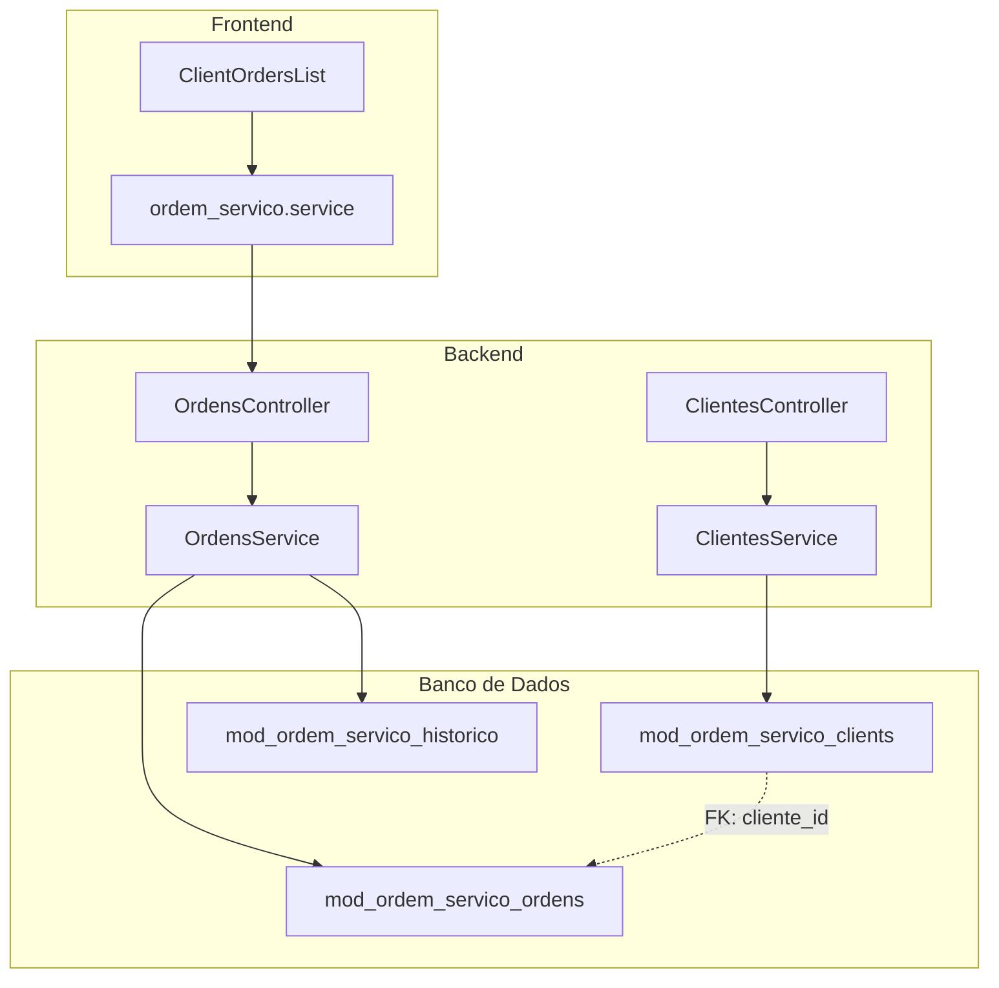
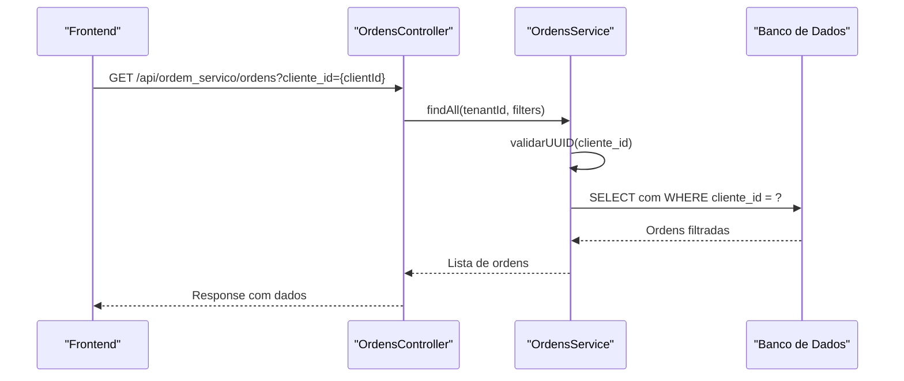
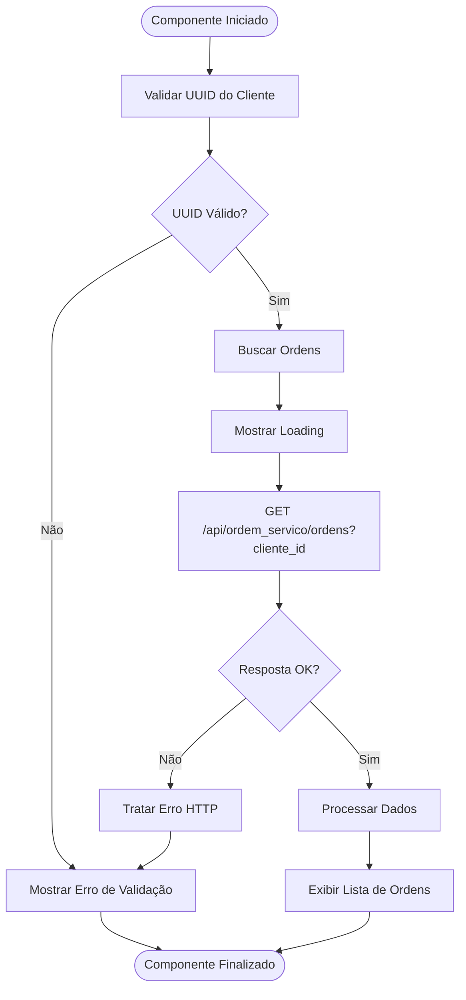
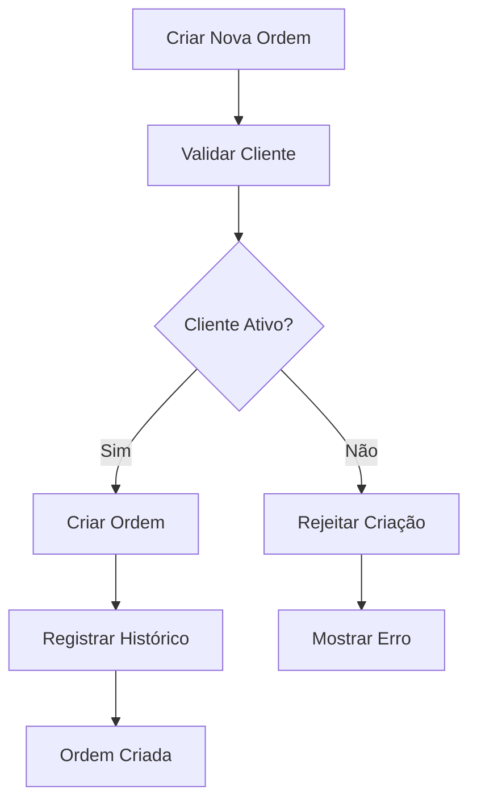

# Relacionamentos com Ordens de Serviço

<cite>
**Arquivos Referenciados nesta Documentação**
- [clientes.controller.ts](file://backend/clientes/clientes.controller.ts)
- [clientes.service.ts](file://backend/clientes/clientes.service.ts)
- [ordens.controller.ts](file://backend/ordens/ordens.controller.ts)
- [ordens.service.ts](file://backend/ordens/ordens.service.ts)
- [001_master.sql](file://backend/migrations/001_master.sql)
- [004_add_tables_os.sql](file://backend/migrations/004_add_tables_os.sql)
- [ClientOrdersList.tsx](file://frontend/components/ClientOrdersList.tsx)
- [ordem_servico.service.ts](file://frontend/services/ordem_servico.service.ts)
- [ordem-servico.dto.ts](file://backend/shared/dto/ordem-servico.dto.ts)
- [ordem-servico.types.ts](file://frontend/types/ordem-servico.types.ts)
</cite>

## Sumário
- Introdução
- Arquitetura de Relacionamentos
- Modelagem de Dados e Chaves Estrangeiras
- Operações de Busca e Filtragem
- Histórico de Ordens por Cliente
- Exemplos de Frontend e Backend
- Integridade Referencial
- Considerações de Desempenho

## Introdução

Este documento explora os relacionamentos entre clientes e ordens de serviço no módulo de Ordem de Serviço. Ele descreve como os clientes são vinculados às ordens criadas, como funciona o histórico de ordens por cliente, quais operações de busca retornam ordens associadas a um cliente específico, e como tanto o frontend quanto o backend filtram e exibem esses dados. Além disso, aborda os relacionamentos de chave estrangeira e a integridade referencial implementada no banco de dados.

## Arquitetura de Relacionamentos

O módulo implementa uma arquitetura de relacionamento direto entre clientes e ordens de serviço através de uma chave estrangeira no campo `cliente_id` da tabela `mod_ordem_servico_ordens`. Esta abordagem garante que toda ordem de serviço esteja vinculada a um cliente existente, mantendo a consistência dos dados.



**Fontes do Diagrama**
- [ordens.controller.ts](file://backend/ordens/ordens.controller.ts#L25-L32)
- [ordens.service.ts](file://backend/ordens/ordens.service.ts#L475-L555)
- [001_master.sql](file://backend/migrations/001_master.sql#L203-L249)

## Modelagem de Dados e Chaves Estrangeiras

A modelagem do relacionamento entre clientes e ordens de serviço é implementada através de uma chave estrangeira no campo `cliente_id` da tabela `mod_ordem_servico_ordens`, apontando para a tabela `mod_ordem_servico_clients`.

### Estrutura das Tabelas

```mermaid
erDiagram
MOD_ORDEM_SERVICO_CLIENTS {
uuid id PK
text tenant_id FK
varchar name
varchar document
varchar phone_primary
varchar phone_secondary
varchar email
text address
varchar address_zip
varchar address_street
varchar address_number
varchar address_complement
varchar address_neighborhood
varchar address_city
varchar address_state
text observations
text image_url
boolean is_active
timestamp created_at
timestamp updated_at
timestamp deleted_at
}
MOD_ORDEM_SERVICO_ORDENS {
uuid id PK
text tenant_id FK
text numero
uuid cliente_id FK
text usuario_responsavel_id
text tipo_servico
text descricao
text observacoes_internas
text observacoes_cliente
decimal valor_servico
text forma_pagamento
integer status
text prioridade
timestamp data_abertura
timestamp data_previsao
timestamp data_conclusao
text origem_solicitacao
boolean orcamento_aprovado
text motivo_cancelamento
text equipamento_tipo
text equipamento_marca
text equipamento_modelo
text equipamento_serie
text equipamento_acessorios
text equipamento_estado
text equipamento_fotos
text laudo_tecnico
text itens
text formatacao_so
boolean formatacao_backup
text formatacao_backup_descricao
text formatacao_senha
timestamp created_at
timestamp updated_at
}
MOD_ORDEM_SERVICO_HISTORICO {
uuid id PK
text tenant_id FK
uuid ordem_servico_id FK
text usuario_id
text acao
text valor_anterior
text valor_novo
text observacoes
timestamp created_at
}
MOD_ORDEM_SERVICO_CLIENTS ||--o{ MOD_ORDEM_SERVICO_ORDENS : "possui"
MOD_ORDEM_SERVICO_ORDENS ||--o{ MOD_ORDEM_SERVICO_HISTORICO : "gera"
```



**Fontes do Diagrama**
- [001_master.sql](file://backend/migrations/001_master.sql#L47-L74)
- [001_master.sql](file://backend/migrations/001_master.sql#L203-L249)
- [001_master.sql](file://backend/migrations/001_master.sql#L252-L268)

### Restrições de Integridade Referencial

O relacionamento entre clientes e ordens de serviço é protegido pelas seguintes restrições:

1. **Chave Estrangeira**: `cliente_id` em `mod_ordem_servico_ordens` referencia `id` em `mod_ordem_servico_clients`
2. **Restrição de Exclusão**: `ON DELETE RESTRICT` impede a exclusão de clientes enquanto existirem ordens associadas
3. **Verificação de Atividade**: O backend valida se o cliente está ativo antes de criar novas ordens

**Fontes**
- [001_master.sql](file://backend/migrations/001_master.sql#L245-L246)
- [001_master.sql](file://backend/migrations/001_master.sql#L246-L246)
- [clientes.service.ts](file://backend/clientes/clientes.service.ts#L212-L237)
- [ordens.service.ts](file://backend/ordens/ordens.service.ts#L942-L986)

## Operações de Busca e Filtragem

### Busca de Ordens por Cliente

O backend oferece múltiplas formas de buscar ordens associadas a um cliente específico:

#### 1. Endpoint Principal de Busca

O endpoint `/api/ordem_servico/ordens` aceita o parâmetro `cliente_id` para filtrar ordens por cliente:



**Fontes do Diagrama**
- [ordens.controller.ts](file://backend/ordens/ordens.controller.ts#L34-L55)
- [ordens.service.ts](file://backend/ordens/ordens.service.ts#L137-L473)

#### 2. Validação de Parâmetros

O serviço implementa validações rigorosas para o parâmetro `cliente_id`:

- **Validação de UUID**: Verifica formato UUID v4
- **Sanitização**: Remove caracteres perigosos e limita tamanho
- **Paginação**: Suporte a paginação com limites máximos

**Fontes**
- [ordens.service.ts](file://backend/ordens/ordens.service.ts#L145-L161)

#### 3. Consultas Específicas

O backend também oferece consultas específicas para histórico e detalhes:

- `GET /api/ordem_servico/ordens/:id/historico` - Histórico completo da ordem
- `GET /api/ordem_servico/ordens/:id` - Detalhes completos da ordem

**Fontes**
- [ordens.controller.ts](file://backend/ordens/ordens.controller.ts#L121-L133)
- [ordens.controller.ts](file://backend/ordens/ordens.controller.ts#L101-L119)

## Histórico de Ordens por Cliente

### Exibição no Frontend

O componente `ClientOrdersList` implementa a exibição do histórico de ordens para um cliente específico:



**Fontes do Diagrama**
- [ClientOrdersList.tsx](file://frontend/components/ClientOrdersList.tsx#L33-L78)

### Estrutura de Dados do Histórico

O frontend utiliza os seguintes tipos para representar o histórico:

- `OrdemServico`: Representa uma ordem de serviço com relacionamento ao cliente
- `Cliente`: Dados do cliente associado à ordem
- `HistoricoOS`: Registro de histórico de alterações

**Fontes**
- [ordem-servico.types.ts](file://frontend/types/ordem-servico.types.ts#L3-L48)
- [ordem-servico.types.ts](file://frontend/types/ordem-servico.types.ts#L50-L85)

## Exemplos de Frontend e Backend

### Frontend - Componente ClientOrdersList

O componente implementa uma lista de ordens anteriores com funcionalidades completas:

```typescript
// Exemplo de chamada para buscar ordens de um cliente específico
const response = await api.get(`/api/ordem_servico/ordens?cliente_id=${clientId}`);
```

**Recursos implementados:**
- Validação de UUID antes da requisição
- Tratamento de erros HTTP específicos
- Carregamento assíncrono com feedback visual
- Modal para visualização detalhada de ordens
- Paginação automática

**Fontes**
- [ClientOrdersList.tsx](file://frontend/components/ClientOrdersList.tsx#L50-L74)

### Backend - Serviço de Ordens

O serviço de ordens implementa a lógica de filtragem e busca:

```typescript
// Exemplo de implementação do filtro por cliente_id
if (filters.cliente_id) {
    whereClause += ` AND os.cliente_id = $${paramIndex}::uuid`;
    params.push(filters.cliente_id);
    paramIndex++;
}
```

**Recursos implementados:**
- Validação de UUID com regex
- Sanitização de entradas
- Paginação com limites máximos
- Busca com múltiplos critérios
- Tratamento de erros robusto

**Fontes**
- [ordens.service.ts](file://backend/ordens/ordens.service.ts#L245-L249)

## Integridade Referencial

### Restrições Implementadas

O sistema implementa várias camadas de integridade referencial:

#### 1. Restrições no Banco de Dados

- **Chave Estrangeira**: `cliente_id` referencia `mod_ordem_servico_clients.id`
- **Restrição de Exclusão**: `ON DELETE RESTRICT` impede exclusão de clientes com ordens
- **Verificação de Atividade**: Clientes inativos não podem abrir novas ordens

#### 2. Validações no Backend

- **Verificação de Existência**: O backend confirma a existência do cliente antes de criar ordens
- **Validação de Atividade**: Verifica se o cliente está ativo
- **Contagem de Ordens**: Impede exclusão de clientes com ordens associadas

**Fontes**
- [001_master.sql](file://backend/migrations/001_master.sql#L245-L246)
- [clientes.service.ts](file://backend/clientes/clientes.service.ts#L212-L237)
- [ordens.service.ts](file://backend/ordens/ordens.service.ts#L942-L986)

### Fluxo de Validação de Cliente



**Fontes do Diagrama**
- [ordens.controller.ts](file://backend/ordens/ordens.controller.ts#L168-L172)
- [ordens.service.ts](file://backend/ordens/ordens.service.ts#L942-L986)

## Considerações de Desempenho

### Índices Implementados

O banco de dados possui índices otimizados para consultas frequentes:

- **Clientes**: Índices para `tenant_id`, `name`, `document`, `email`
- **Ordens**: Índices para `tenant_id`, `cliente_id`, `status`, `data_abertura`, `numero`
- **Histórico**: Índices para `tenant_id`, `ordem_servico_id`, `created_at`

### Melhorias Recomendadas

1. **Índice Composto**: Criar índice composto `(tenant_id, cliente_id)` para melhorar consultas por cliente
2. **Paginação**: Manter limites máximos de registros por página
3. **Cache**: Implementar cache para consultas de histórico de clientes
4. **Projeção de Campos**: Limitar campos retornados em consultas de listagem

**Fontes**
- [001_master.sql](file://backend/migrations/001_master.sql#L375-L386)

## Conclusão

O módulo de Ordem de Serviço implementa um relacionamento sólido e seguro entre clientes e ordens de serviço. As restrições de integridade referencial, validações rigorosas e implementações de frontend eficientes garantem a consistência dos dados e uma experiência de usuário robusta. A arquitetura permite fácil expansão e manutenção, mantendo a integridade dos relacionamentos através de múltiplas camadas de proteção tanto no backend quanto no frontend.