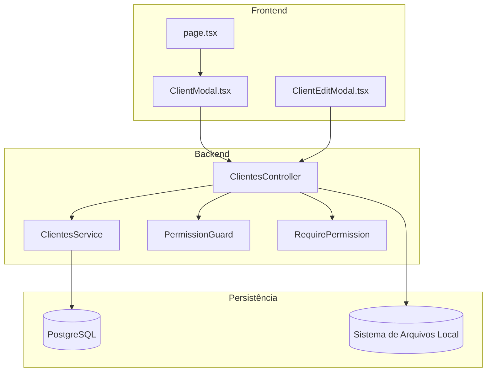
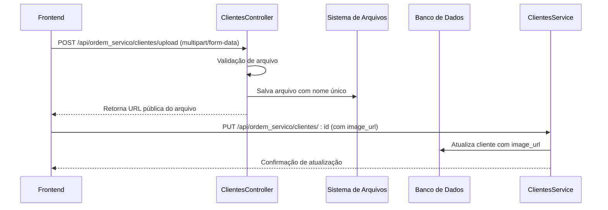
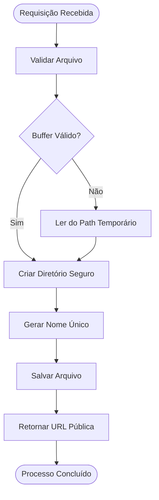
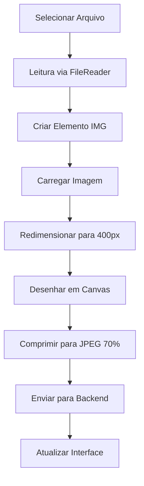
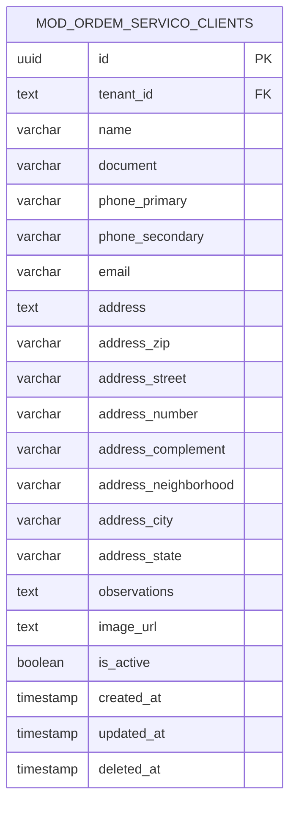
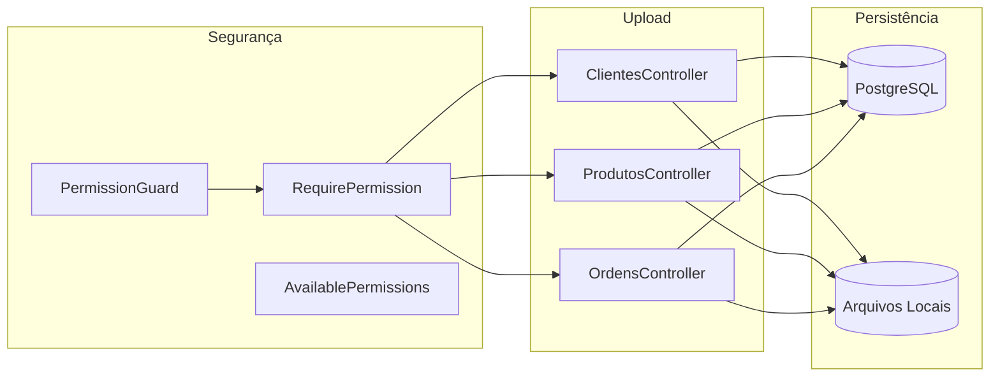
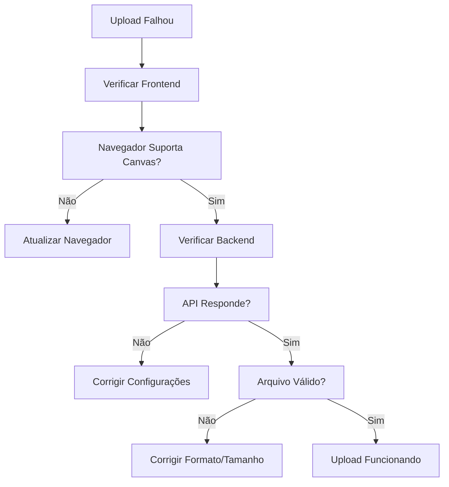

# Upload de Imagens

<cite>
**Arquivos Referenciados Neste Documento**
- [clientes.controller.ts](file://backend/clientes/clientes.controller.ts)
- [clientes.service.ts](file://backend/clientes/clientes.service.ts)
- [ClientModal.tsx](file://frontend/components/ClientModal.tsx)
- [ClientEditModal.tsx](file://frontend/components/ClientEditModal.tsx)
- [page.tsx](file://frontend/pages/clientes/page.tsx)
- [produtos.controller.ts](file://backend/produtos/produtos.controller.ts)
- [ordens.controller.ts](file://backend/ordens/ordens.controller.ts)
- [permission.guard.ts](file://backend/shared/guards/permission.guard.ts)
- [require-permission.decorator.ts](file://backend/shared/decorators/require-permission.decorator.ts)
- [available-permissions.ts](file://backend/shared/constants/available-permissions.ts)
- [001_master.sql](file://backend/migrations/001_master.sql)
</cite>

## Sumário
1. [Introdução](#introdução)
2. [Estrutura do Projeto](#estrutura-do-projeto)
3. [Componentes Principais](#componentes-principais)
4. [Visão Geral da Arquitetura](#visão-geral-da-arquitetura)
5. [Análise Detalhada dos Componentes](#análise-detalhada-dos-componentes)
6. [Análise de Dependências](#análise-de-dependências)
7. [Considerações de Segurança](#considerações-de-segurança)
8. [Considerações de Desempenho](#considerações-de-desempenho)
9. [Guia de Solução de Problemas](#guia-de-solução-de-problemas)
10. [Conclusão](#conclusão)

## Introdução
Este documento apresenta uma documentação abrangente do sistema de upload de imagens de clientes, incluindo implementação do backend, validações de tipo e tamanho, armazenamento seguro, geração de URLs públicas e integração com o frontend. Além disso, são abordadas considerações de segurança, otimização de imagens e possíveis integrações com sistemas de armazenamento externo.

## Estrutura do Projeto
O sistema de upload de imagens de clientes segue uma arquitetura modular com camadas bem definidas:
- Backend NestJS com controllers e services
- Frontend Next.js com componentes React
- Migrations PostgreSQL com definição de tabelas
- Guardas e permissões para controle de acesso

**Diagrama Fonte**
- [clientes.controller.ts](file://backend/clientes/clientes.controller.ts#L12-L182)
- [clientes.service.ts](file://backend/clientes/clientes.service.ts#L1-L253)
- [ClientModal.tsx](file://frontend/components/ClientModal.tsx#L281-L315)
- [ClientEditModal.tsx](file://frontend/components/ClientEditModal.tsx#L316-L350)

**Seção Fonte**
- [clientes.controller.ts](file://backend/clientes/clientes.controller.ts#L1-L182)
- [clientes.service.ts](file://backend/clientes/clientes.service.ts#L1-L253)

## Componentes Principais
O sistema é composto pelos seguintes componentes principais:

### Backend - Clientes Controller
Responsável pelo tratamento das requisições de upload e disponibilização de imagens:

- Endpoint POST `/api/ordem_servico/clientes/upload` para upload de imagens
- Endpoint GET `/api/ordem_servico/clientes/uploads/:tenantId/:filename` para download
- Validação de arquivos via FileInterceptor
- Armazenamento em diretório separado por tenant
- Geração de URLs públicas acessíveis

### Backend - Clientes Service
Lógica de negócio para persistência de dados de clientes, incluindo o campo image_url:

- Persistência de image_url no banco de dados
- Operações CRUD completas com validações
- Auditoria de alterações

### Frontend - ClientModal e ClientEditModal
Componentes React responsáveis pela experiência do usuário:

- Compressão de imagens antes do upload (canvas toBlob)
- Interface intuitiva para seleção de fotos
- Feedback visual durante o processo de upload

**Seção Fonte**
- [clientes.controller.ts](file://backend/clientes/clientes.controller.ts#L74-L140)
- [clientes.service.ts](file://backend/clientes/clientes.service.ts#L96-L149)
- [ClientModal.tsx](file://frontend/components/ClientModal.tsx#L244-L315)
- [ClientEditModal.tsx](file://frontend/components/ClientEditModal.tsx#L279-L350)

## Visão Geral da Arquitetura
O fluxo de upload segue o seguinte padrão:

**Diagrama Fonte**
- [clientes.controller.ts](file://backend/clientes/clientes.controller.ts#L74-L119)
- [clientes.service.ts](file://backend/clientes/clientes.service.ts#L151-L210)

## Análise Detalhada dos Componentes

### Backend - ClientesController
Implementação do upload de imagens com validações robustas:

#### Métodos e Endpoints
- `POST /api/ordem_servico/clientes/upload`: Upload de imagens
- `GET /api/ordem_servico/clientes/uploads/:tenantId/:filename`: Download de imagens

#### Processo de Upload

**Diagrama Fonte**
- [clientes.controller.ts](file://backend/clientes/clientes.controller.ts#L74-L119)

#### Validações Implementadas
- Verificação de presença do arquivo
- Validação de buffer (suporte a diferentes formatos)
- Criação de diretórios com base no tenant
- Geração de nomes únicos para evitar conflitos

#### Armazenamento
- Diretórios organizados por módulo e tenant
- Nomes de arquivos compostos por timestamp e número aleatório
- Extensão preservada do arquivo original

**Seção Fonte**
- [clientes.controller.ts](file://backend/clientes/clientes.controller.ts#L74-L140)

### Frontend - ClientModal e ClientEditModal
Implementação do lado do cliente com otimização de imagens:

#### Processo de Compressão

**Diagrama Fonte**
- [ClientModal.tsx](file://frontend/components/ClientModal.tsx#L244-L279)
- [ClientEditModal.tsx](file://frontend/components/ClientEditModal.tsx#L279-L314)

#### Características da Compressão
- Limite de 400px na maior dimensão
- Qualidade JPEG 70%
- Conversão para formato JPG
- Preservação da proporção

**Seção Fonte**
- [ClientModal.tsx](file://frontend/components/ClientModal.tsx#L244-L315)
- [ClientEditModal.tsx](file://frontend/components/ClientEditModal.tsx#L279-L350)

### Banco de Dados - Tabela de Clientes
A tabela mod_ordem_servico_clients inclui o campo image_url para armazenar a URL da imagem do cliente:

**Diagrama Fonte**
- [001_master.sql](file://backend/migrations/001_master.sql#L47-L74)

**Seção Fonte**
- [001_master.sql](file://backend/migrations/001_master.sql#L47-L74)

## Análise de Dependências
O sistema possui dependências importantes para funcionamento seguro:

**Diagrama Fonte**
- [permission.guard.ts](file://backend/shared/guards/permission.guard.ts#L1-L58)
- [require-permission.decorator.ts](file://backend/shared/decorators/require-permission.decorator.ts#L1-L25)
- [available-permissions.ts](file://backend/shared/constants/available-permissions.ts#L1-L49)
- [clientes.controller.ts](file://backend/clientes/clientes.controller.ts#L1-L182)
- [produtos.controller.ts](file://backend/produtos/produtos.controller.ts#L63-L144)
- [ordens.controller.ts](file://backend/ordens/ordens.controller.ts#L313-L377)

### Permissões de Acesso
O sistema utiliza um sistema de permissões granular:

- **Resource: clients** com ações específicas
- **Action: upload_images** para upload de imagens
- Integração com PermissionGuard e RequirePermission decorator

**Seção Fonte**
- [available-permissions.ts](file://backend/shared/constants/available-permissions.ts#L22-L49)
- [require-permission.decorator.ts](file://backend/shared/decorators/require-permission.decorator.ts#L18-L19)
- [permission.guard.ts](file://backend/shared/guards/permission.guard.ts#L12-L57)

## Considerações de Segurança
O sistema implementa várias camadas de segurança:

### Controle de Acesso
- Autenticação JWT obrigatória
- Verificação de permissões específicas
- Proteção contra acesso direto a arquivos

### Validação de Arquivos
- Verificação de tipo MIME (apenas imagens)
- Limitação de tamanho (5MB)
- Validação de buffer para evitar uploads maliciosos

### Isolamento de Dados
- Armazenamento separado por tenant
- Validação de caminho para evitar acesso fora do diretório permitido
- URLs públicas geradas com base no tenant

### Melhorias Recomendadas
- Implementar validação de extensões
- Adicionar rate limiting para uploads
- Considerar CDN para melhor performance
- Implementar assinatura de URLs temporárias

**Seção Fonte**
- [clientes.controller.ts](file://backend/clientes/clientes.controller.ts#L74-L119)
- [produtos.controller.ts](file://backend/produtos/produtos.controller.ts#L73-L82)
- [permission.guard.ts](file://backend/shared/guards/permission.guard.ts#L12-L57)

## Considerações de Desempenho
O sistema foi projetado com algumas limitações de performance:

### Otimizações Atuais
- Compressão de imagens no frontend (canvas toBlob)
- Armazenamento local otimizado por diretórios
- Nomes únicos evitam conflitos de arquivos

### Melhorias Sugeridas
- **CDN**: Para distribuição global de imagens
- **Cache**: Headers HTTP para cache de imagens
- **Thumbnail**: Geração de múltiplas dimensões
- **Compression**: Implementar WebP e AVIF
- **Lazy Loading**: Carregamento progressivo nas listagens

## Guia de Solução de Problemas

### Erros Comuns no Backend
- **Arquivo não enviado**: Verificar header Content-Type multipart/form-data
- **Buffer inválido**: Confirmar que o arquivo foi lido corretamente
- **Diretório não criado**: Verificar permissões de escrita
- **Acesso negado**: Validar permissões de usuário

### Erros Comuns no Frontend
- **Imagem não carregada**: Verificar console para erros de leitura
- **Compressão falhou**: Confirmar suporte a canvas no navegador
- **Upload não aparece**: Verificar se URL foi atualizada no state

### Diagnóstico de Upload

**Seção Fonte**
- [clientes.controller.ts](file://backend/clientes/clientes.controller.ts#L115-L118)
- [ClientModal.tsx](file://frontend/components/ClientModal.tsx#L305-L314)

## Conclusão
O sistema de upload de imagens de clientes apresenta uma implementação sólida com boas práticas de segurança e otimização. As principais características incluem:

- **Segurança**: Validação rigorosa de arquivos, controle de acesso e isolamento por tenant
- **Eficiência**: Compressão de imagens no frontend e armazenamento otimizado
- **Escalabilidade**: Estrutura modular que permite adaptações futuras
- **Manutenibilidade**: Código bem organizado com testes e validações

Para ambientes de produção, recomenda-se implementar as melhorias sugeridas, especialmente a integração com CDN e validações adicionais de segurança.