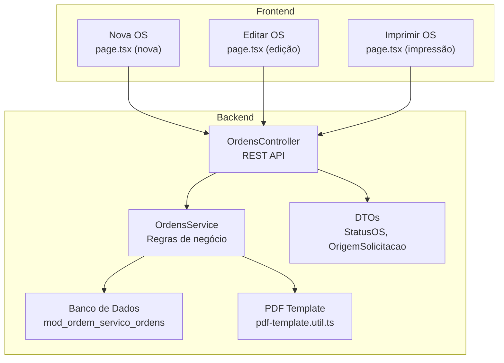
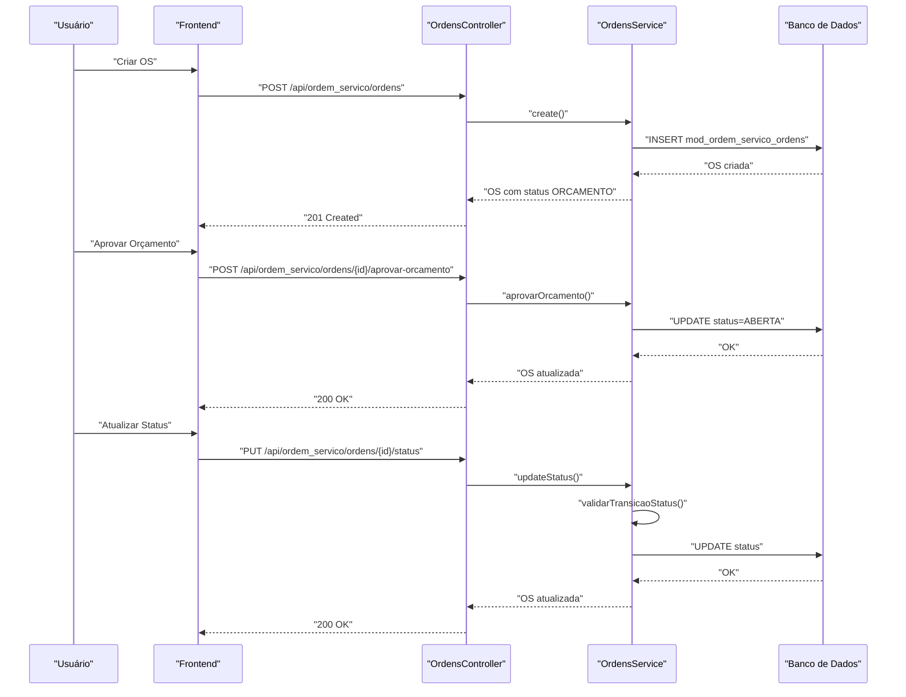
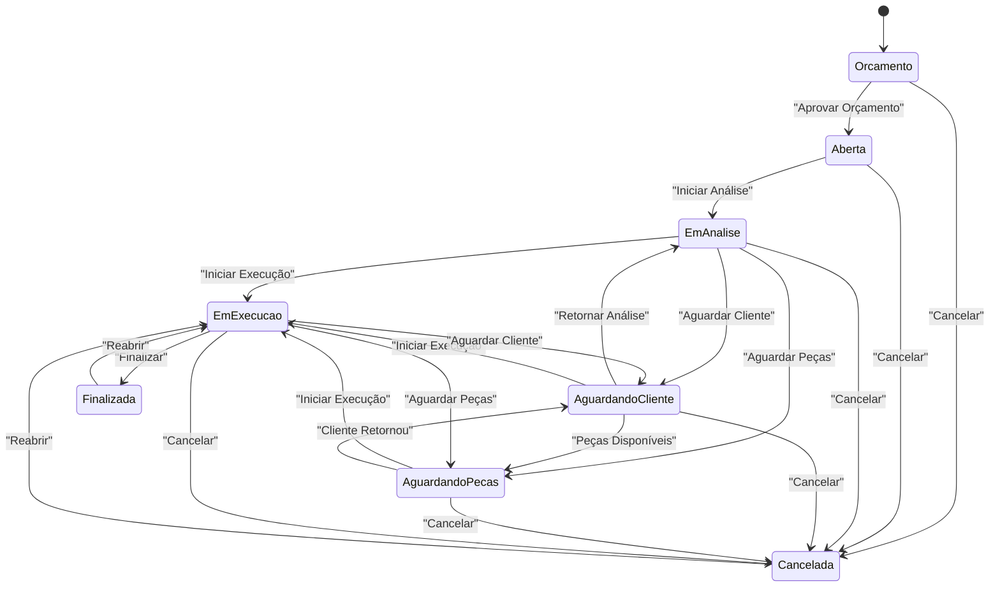
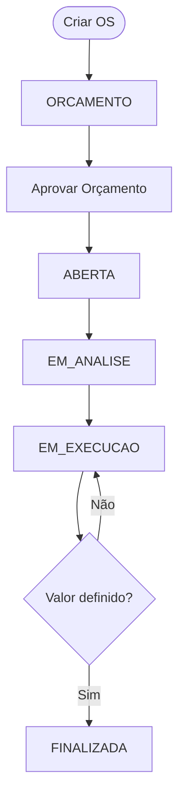
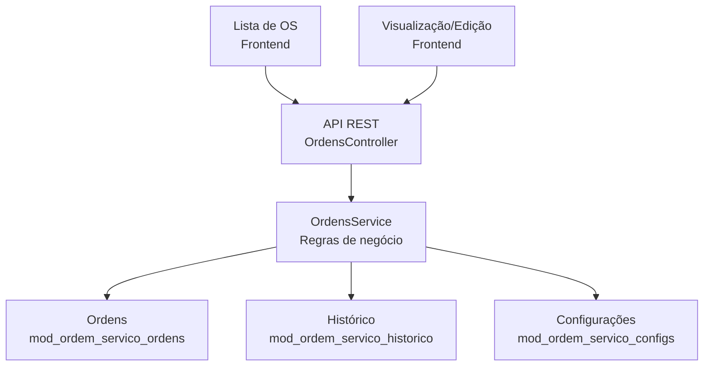
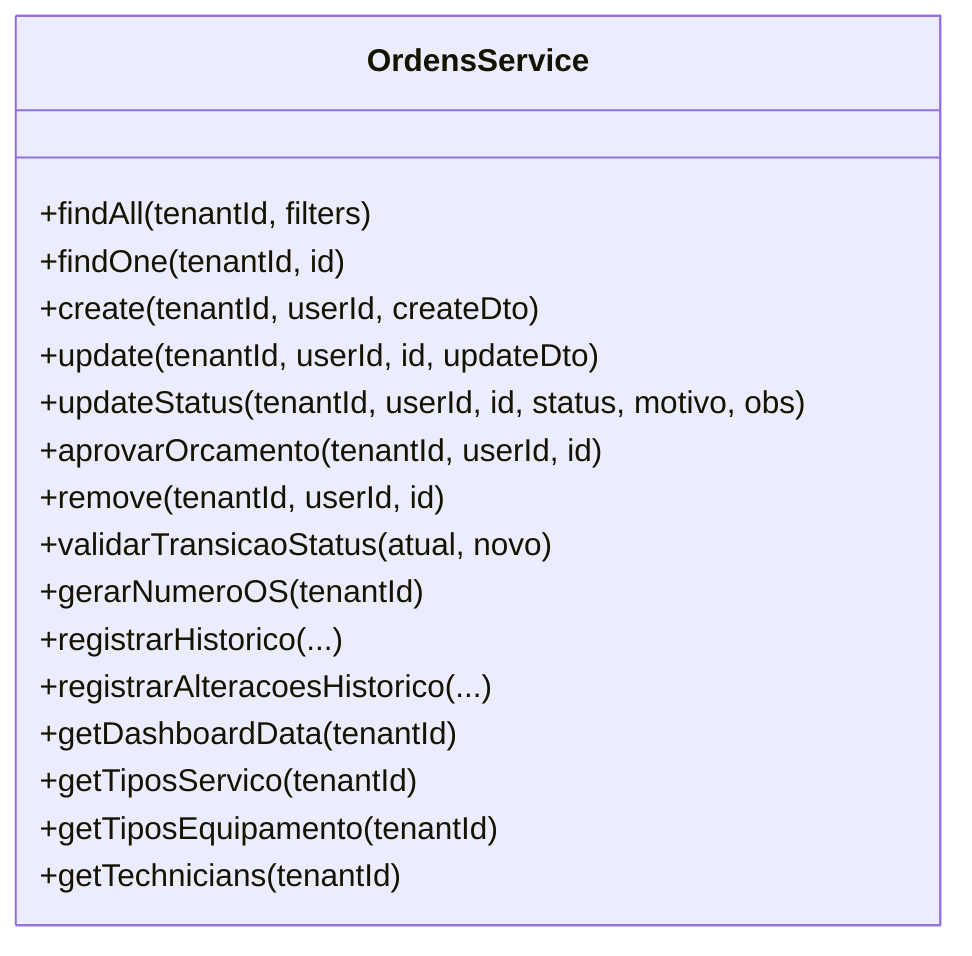
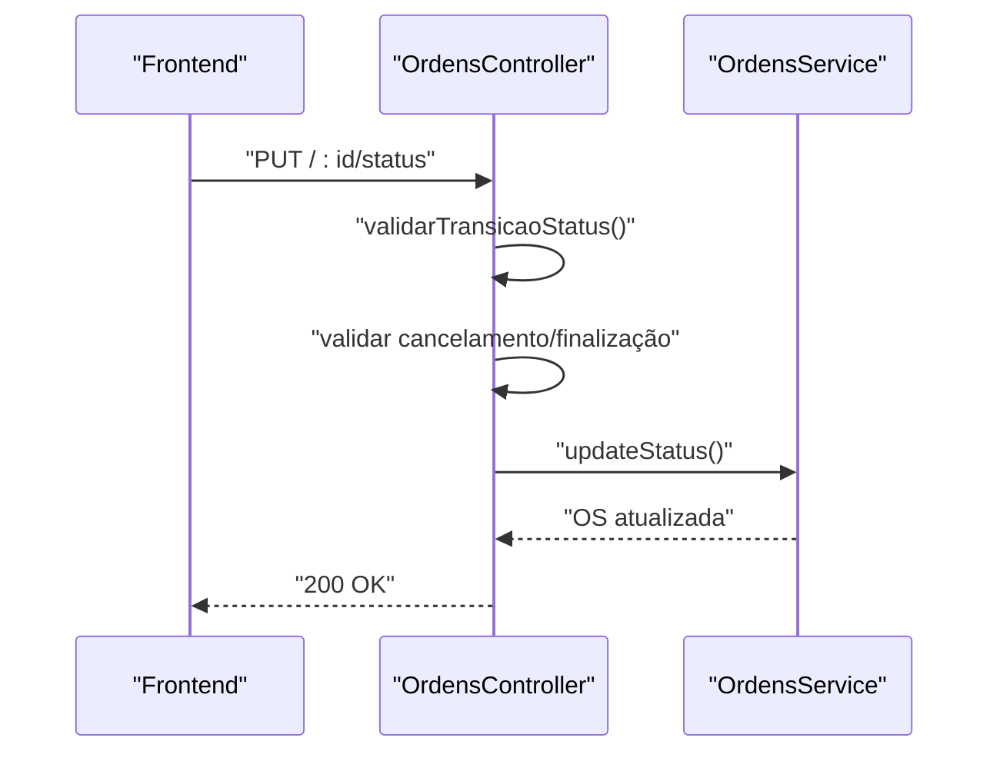
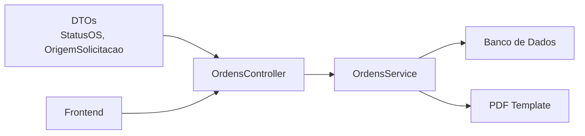

# Ciclo de Vida das Ordens de Serviço

<cite>
**Arquivos referenciados neste documento**
- [ordens.service.ts](file://backend/ordens/ordens.service.ts)
- [ordens.controller.ts](file://backend/ordens/ordens.controller.ts)
- [ordem-servico.dto.ts](file://backend/shared/dto/ordem-servico.dto.ts)
- [004_add_tables_os.sql](file://backend/migrations/004_add_tables_os.sql)
- [seeds_os.sql](file://backend/seeds/seeds_os.sql)
- [pdf-template.util.ts](file://backend/ordens/pdf-template.util.ts)
- [page.tsx (edição)](file://frontend/pages/ordens/edit/page.tsx)
- [page.tsx (nova ordem)](file://frontend/pages/ordens/new/page.tsx)
- [page.tsx (impressão)](file://frontend/pages/ordens/print/page.tsx)
- [ordem-servico.types.ts](file://frontend/types/ordem-servico.types.ts)
</cite>

## Sumário
1. [Introdução](#introdução)
2. [Estrutura do Projeto](#estrutura-do-projeto)
3. [Componentes-Chave](#componentes-chave)
4. [Visão Geral da Arquitetura](#visão-geral-da-arquitetura)
5. [Análise Detalhada dos Componentes](#análise-detalhada-dos-componentes)
6. [Análise de Dependências](#análise-de-dependências)
7. [Considerações de Desempenho](#considerações-de-desempenho)
8. [Guia de Solução de Problemas](#guia-de-solução-de-problemas)
9. [Conclusão](#conclusão)
10. [Apêndices](#apêndices)

## Introdução
Este documento apresenta o ciclo de vida completo das Ordens de Serviço (OS), desde a criação como orçamento até a finalização, incluindo todas as transições válidas de status, regras de negócio, condições especiais e restrições. Também oferece exemplos práticos de fluxos completos, diagramas de fluxo e tabelas de status, além de orientações para desenvolvedores e usuários iniciantes.

## Estrutura do Projeto
O módulo de Ordens de Serviço é composto por:
- Backend (NestJS):
  - Controlador de Ordens: expõe endpoints REST para CRUD, aprovação de orçamento, atualização de status e geração de PDF.
  - Serviço de Ordens: implementa regras de negócio, validações, transições de status e histórico.
  - DTOs: definem os modelos de dados e enums de status e origem de solicitação.
  - Migrações e Seeds: estrutura do banco de dados e configurações iniciais.
  - Template de PDF: gera documentos impressos com base nos dados da OS.
- Frontend (Next.js):
  - Telas de criação, edição e impressão de OS.
  - Tipagens TypeScript para status, origens e transições.

**Diagrama fonte**
- [ordens.controller.ts](file://backend/ordens/ordens.controller.ts#L25-L377)
- [ordens.service.ts](file://backend/ordens/ordens.service.ts#L10-L14)
- [ordem-servico.dto.ts](file://backend/shared/dto/ordem-servico.dto.ts#L9-L18)
- [pdf-template.util.ts](file://backend/ordens/pdf-template.util.ts#L2-L462)

**Seção fonte**
- [ordens.controller.ts](file://backend/ordens/ordens.controller.ts#L25-L377)
- [ordens.service.ts](file://backend/ordens/ordens.service.ts#L10-L14)
- [ordem-servico.dto.ts](file://backend/shared/dto/ordem-servico.dto.ts#L9-L18)
- [pdf-template.util.ts](file://backend/ordens/pdf-template.util.ts#L2-L462)

## Componentes-Chave
- StatusOS: enumeração com todos os estados da OS.
- OrigemSolicitacao: enumeração com as origens de solicitação.
- DTOs de criação e atualização: validam campos e permitem preenchimento opcional de equipamento, formatação e itens.
- Controlador de Ordens: endpoints REST com validações de status, permissões e regras de negócio.
- Serviço de Ordens: implementa transições de status, validações, geração de número sequencial, histórico e PDF.

**Seção fonte**
- [ordem-servico.dto.ts](file://backend/shared/dto/ordem-servico.dto.ts#L9-L18)
- [ordem-servico.dto.ts](file://backend/shared/dto/ordem-servico.dto.ts#L28-L133)
- [ordem-servico.dto.ts](file://backend/shared/dto/ordem-servico.dto.ts#L135-L241)
- [ordens.controller.ts](file://backend/ordens/ordens.controller.ts#L159-L284)
- [ordens.service.ts](file://backend/ordens/ordens.service.ts#L125-L135)

## Visão Geral da Arquitetura
O fluxo típico segue:
- Criação de OS (default: ORCAMENTO) com dados do cliente, equipamento, serviços e valores.
- Aprovação de orçamento (ORCAMENTO → ABERTA).
- Andamento da OS com transições válidas entre EM_ANALISE, AGUARDANDO_CLIENTE, AGUARDANDO_PECAS e EM_EXECUCAO.
- Finalização somente quando em EM_EXECUCAO com valor definido.
- Cancelamento em qualquer estado com obrigatoriedade de motivo.
- Histórico de alterações e impressão de OS.

**Diagrama fonte**
- [ordens.controller.ts](file://backend/ordens/ordens.controller.ts#L159-L284)
- [ordens.service.ts](file://backend/ordens/ordens.service.ts#L557-L654)
- [ordens.service.ts](file://backend/ordens/ordens.service.ts#L856-L890)
- [ordens.service.ts](file://backend/ordens/ordens.service.ts#L772-L829)

## Análise Detalhada dos Componentes

### Enumeração de Status e Origem
- StatusOS: ORCAMENTO (0), ABERTA (1), EM_ANALISE (2), AGUARDANDO_CLIENTE (3), AGUARDANDO_PECAS (4), EM_EXECUCAO (5), FINALIZADA (6), CANCELADA (7).
- OrigemSolicitacao: WHATSAPP, PRESENCIAL, SISTEMA.

**Seção fonte**
- [ordem-servico.dto.ts](file://backend/shared/dto/ordem-servico.dto.ts#L9-L18)
- [ordem-servico.dto.ts](file://backend/shared/dto/ordem-servico.dto.ts#L3-L7)

### Regras de Transição de Status
As transições válidas são definidas como um mapa de estados permitidos. Por exemplo:
- ORCAMENTO → ABERTA, CANCELADA
- ABERTA → EM_ANALISE, CANCELADA
- EM_ANALISE → EM_EXECUCAO, AGUARDANDO_CLIENTE, AGUARDANDO_PECAS, CANCELADA
- AGUARDANDO_CLIENTE → EM_ANALISE, EM_EXECUCAO, AGUARDANDO_PECAS, CANCELADA
- AGUARDANDO_PECAS → EM_EXECUCAO, AGUARDANDO_CLIENTE, CANCELADA
- EM_EXECUCAO → FINALIZADA, AGUARDANDO_CLIENTE, AGUARDANDO_PECAS, CANCELADA
- FINALIZADA → EM_EXECUCAO
- CANCELADA → EM_EXECUCAO

**Diagrama fonte**
- [ordens.service.ts](file://backend/ordens/ordens.service.ts#L125-L135)
- [ordem-servico.types.ts](file://frontend/types/ordem-servico.types.ts#L155-L164)

**Seção fonte**
- [ordens.service.ts](file://backend/ordens/ordens.service.ts#L125-L135)
- [ordem-servico.types.ts](file://frontend/types/ordem-servico.types.ts#L155-L164)

### Regras de Negócio e Restrições
- Criação:
  - Número sequencial gerado automaticamente.
  - Status default: ORCAMENTO (ou ABERTA se informado).
  - Cliente deve estar ativo.
- Edição:
  - Não é permitido editar OS finalizadas ou canceladas.
  - Validação de transição de status.
- Aprovação de Orçamento:
  - Apenas OS com status ORCAMENTO pode ser aprovada.
  - Altera status para ABERTA e marca orcamento_aprovado como verdadeiro.
- Atualização de Status:
  - Valida transição permitida.
  - Cancelamento requer motivo.
  - Finalização somente se status anterior for EM_EXECUCAO e valor_servico > 0.
- Exclusão:
  - Apenas OS com status ORCAMENTO podem ser excluídas por usuários não-admin.
- Histórico:
  - Registra ações como CRIACAO, EDICAO, MUDANCA_STATUS, FINALIZACAO, CANCELAMENTO, APROVACAO_ORCAMENTO.

**Seção fonte**
- [ordens.controller.ts](file://backend/ordens/ordens.controller.ts#L159-L207)
- [ordens.controller.ts](file://backend/ordens/ordens.controller.ts#L286-L308)
- [ordens.controller.ts](file://backend/ordens/ordens.controller.ts#L209-L284)
- [ordens.service.ts](file://backend/ordens/ordens.service.ts#L557-L654)
- [ordens.service.ts](file://backend/ordens/ordens.service.ts#L856-L890)
- [ordens.service.ts](file://backend/ordens/ordens.service.ts#L656-L770)
- [ordens.service.ts](file://backend/ordens/ordens.service.ts#L772-L829)

### Exemplos Práticos de Fluxos Completos

#### Fluxo 1: Criação → Aprovação → Execução → Finalização
- Passos:
  - Criar OS com status ORCAMENTO.
  - Aprovar orçamento (ORCAMENTO → ABERTA).
  - Avançar para EM_ANALISE, AGUARDANDO_CLIENTE, AGUARDANDO_PECAS e EM_EXECUCAO.
  - Finalizar (EM_EXECUCAO → FINALIZADA) com valor_servico > 0.
- Restrições:
  - Não é possível finalizar se status anterior não for EM_EXECUCAO.
  - Valor do serviço deve estar definido.

**Diagrama fonte**
- [ordens.controller.ts](file://backend/ordens/ordens.controller.ts#L286-L308)
- [ordens.controller.ts](file://backend/ordens/ordens.controller.ts#L209-L258)
- [ordens.service.ts](file://backend/ordens/ordens.service.ts#L856-L890)
- [ordens.service.ts](file://backend/ordens/ordens.service.ts#L772-L829)

#### Fluxo 2: Cancelamento Parcial
- Passos:
  - Criar OS.
  - Tentar cancelar em qualquer estado (requer motivo).
- Restrições:
  - Motivo do cancelamento obrigatório.

**Seção fonte**
- [ordens.controller.ts](file://backend/ordens/ordens.controller.ts#L231-L234)
- [ordens.service.ts](file://backend/ordens/ordens.service.ts#L772-L829)

#### Fluxo 3: Reabertura
- Passos:
  - Finalizada ou Cancelada → EM_EXECUCAO.
- Restrições:
  - Reabertura permitida apenas para esses dois estados.

**Seção fonte**
- [ordens.service.ts](file://backend/ordens/ordens.service.ts#L125-L135)

### Tabelas de Status

| Código | Status               | Descrição                              |
|--------|----------------------|----------------------------------------|
| 0      | ORCAMENTO            | Orçamento emitido, aguardando aprovação  |
| 1      | ABERTA               | Aprovado, aguardando análise             |
| 2      | EM_ANALISE           | Em análise técnica                       |
| 3      | AGUARDANDO_CLIENTE   | Aguardando retorno do cliente            |
| 4      | AGUARDANDO_PECAS     | Aguardando peças                         |
| 5      | EM_EXECUCAO          | Em execução do serviço                   |
| 6      | FINALIZADA           | Concluída com sucesso                    |
| 7      | CANCELADA            | Cancelada com motivo                     |

**Seção fonte**
- [ordem-servico.dto.ts](file://backend/shared/dto/ordem-servico.dto.ts#L9-L18)

### Campos e Configurações Importantes
- Campos adicionais no banco:
  - formatacao_so, formatacao_backup, formatacao_backup_descricao, formatacao_senha, laudo_tecnico, garantia_dias.
- Configurações iniciais:
  - condicoes_execucao (textos padrão de impressão).
  - termo_garantia, exibir_valor_total, notificar_whatsapp_status.

**Seção fonte**
- [004_add_tables_os.sql](file://backend/migrations/004_add_tables_os.sql#L36-L44)
- [seeds_os.sql](file://backend/seeds/seeds_os.sql#L17-L22)

### Impressão de OS
- O PDF é gerado com base em um template HTML que inclui:
  - Dados do cliente, serviço, equipamento, itens e valor total.
  - Condições de execução configuráveis.
  - Assinaturas e rodapé.

**Seção fonte**
- [pdf-template.util.ts](file://backend/ordens/pdf-template.util.ts#L2-L462)
- [ordens.controller.ts](file://backend/ordens/ordens.controller.ts#L135-L157)

## Visão Geral da Arquitetura

**Diagrama fonte**
- [ordens.controller.ts](file://backend/ordens/ordens.controller.ts#L25-L377)
- [ordens.service.ts](file://backend/ordens/ordens.service.ts#L10-L14)
- [004_add_tables_os.sql](file://backend/migrations/004_add_tables_os.sql#L6-L32)

## Análise Detalhada dos Componentes

### Componente: OrdensService
- Responsabilidades:
  - Validação de transições de status.
  - Geração de número sequencial.
  - Registro de histórico de alterações.
  - Geração de PDF com template.
  - Busca, criação, atualização e exclusão de OS.
- Complexidade:
  - Validações e buscas com SQL personalizado e sanitização de entradas.
  - Transformação de dados e tratamento de erros robusto.

**Diagrama fonte**
- [ordens.service.ts](file://backend/ordens/ordens.service.ts#L10-L14)
- [ordens.service.ts](file://backend/ordens/ordens.service.ts#L137-L473)
- [ordens.service.ts](file://backend/ordens/ordens.service.ts#L557-L854)
- [ordens.service.ts](file://backend/ordens/ordens.service.ts#L856-L1148)

**Seção fonte**
- [ordens.service.ts](file://backend/ordens/ordens.service.ts#L10-L14)
- [ordens.service.ts](file://backend/ordens/ordens.service.ts#L137-L473)
- [ordens.service.ts](file://backend/ordens/ordens.service.ts#L557-L854)
- [ordens.service.ts](file://backend/ordens/ordens.service.ts#L856-L1148)

### Componente: OrdensController
- Responsabilidades:
  - Expor endpoints REST.
  - Aplicar validações de status e permissões.
  - Chamar métodos do serviço e retornar respostas padronizadas.
- Restrições:
  - Edição bloqueada para OS finalizadas ou canceladas.
  - Cancelamento exige motivo.
  - Finalização exige status anterior EM_EXECUCAO e valor_servico > 0.

**Diagrama fonte**
- [ordens.controller.ts](file://backend/ordens/ordens.controller.ts#L209-L258)
- [ordens.service.ts](file://backend/ordens/ordens.service.ts#L772-L829)

**Seção fonte**
- [ordens.controller.ts](file://backend/ordens/ordens.controller.ts#L209-L258)
- [ordens.service.ts](file://backend/ordens/ordens.service.ts#L772-L829)

### Componente: PDF Template
- Responsabilidades:
  - Gerar HTML para impressão com base nos dados da OS e configurações do tenant.
  - Incluir condições de execução, assinaturas e rodapé.
- Integração:
  - Utiliza utilitário de geração de HTML e gera PDF com Puppeteer.

**Seção fonte**
- [pdf-template.util.ts](file://backend/ordens/pdf-template.util.ts#L2-L462)
- [ordens.service.ts](file://backend/ordens/ordens.service.ts#L16-L123)

### Componente: Frontend (Tipos e Telas)
- Tipos:
  - StatusOS, OrigemSolicitacao, TRANSICOES_PERMITIDAS e STATUS_LABELS.
- Telas:
  - Nova OS: coleta dados, busca clientes, tipos de serviço e equipamento, IA para análise.
  - Editar OS: campos editáveis, validações, histórico e transições de status.
  - Imprimir OS: preview e download do PDF.

**Seção fonte**
- [ordem-servico.types.ts](file://frontend/types/ordem-servico.types.ts#L88-L164)
- [page.tsx (nova ordem)](file://frontend/pages/ordens/new/page.tsx#L129-L160)
- [page.tsx (edição)](file://frontend/pages/ordens/edit/page.tsx#L886-L904)
- [page.tsx (impressão)](file://frontend/pages/ordens/print/page.tsx#L50-L136)

## Análise de Dependências
- Backend:
  - OrdensController depende de OrdensService e DTOs.
  - OrdensService depende de PrismaService, PDF template e configurações.
  - Migrações e seeds garantem estrutura e dados iniciais.
- Frontend:
  - Telas utilizam DTOs e enums do backend para exibição e validação.

**Diagrama fonte**
- [ordem-servico.dto.ts](file://backend/shared/dto/ordem-servico.dto.ts#L9-L18)
- [ordens.controller.ts](file://backend/ordens/ordens.controller.ts#L25-L377)
- [ordens.service.ts](file://backend/ordens/ordens.service.ts#L10-L14)
- [pdf-template.util.ts](file://backend/ordens/pdf-template.util.ts#L2-L462)

**Seção fonte**
- [ordem-servico.dto.ts](file://backend/shared/dto/ordem-servico.dto.ts#L9-L18)
- [ordens.controller.ts](file://backend/ordens/ordens.controller.ts#L25-L377)
- [ordens.service.ts](file://backend/ordens/ordens.service.ts#L10-L14)
- [pdf-template.util.ts](file://backend/ordens/pdf-template.util.ts#L2-L462)

## Considerações de Desempenho
- Validações manuais e sanitização de entradas evitam dependências externas e reduzem riscos de injeção.
- Queries com parâmetros e limites de paginação ajudam a manter desempenho.
- Geração de PDF com Puppeteer otimizada para ambiente server com argumentos específicos.

[Sem seção fonte, pois esta seção fornece orientações gerais]

## Guia de Solução de Problemas
- Erros de transição de status:
  - Confirme que a transição está na lista de estados permitidos.
  - Verifique se o status atual corresponde ao esperado.
- Erros de finalização:
  - Certifique-se de que o status anterior era EM_EXECUCAO e valor_servico > 0.
- Erros de cancelamento:
  - Forneça um motivo de cancelamento.
- Erros de PDF:
  - Verifique se o tenant possui configurações de condições de execução e logo válidas.

**Seção fonte**
- [ordens.controller.ts](file://backend/ordens/ordens.controller.ts#L225-L244)
- [ordens.service.ts](file://backend/ordens/ordens.service.ts#L687-L696)
- [ordens.service.ts](file://backend/ordens/ordens.service.ts#L780-L788)

## Conclusão
O módulo de Ordens de Serviço implementa um fluxo completo e bem estruturado, com regras de negócio claras, validações rigorosas e histórico detalhado. As transições de status são controladas e documentadas, permitindo controle eficiente do ciclo de vida das OS. A integração com o PDF e as telas do frontend oferecem uma experiência completa tanto para usuários quanto para desenvolvedores.

[Sem seção fonte, pois esta seção resume sem analisar arquivos específicos]

## Apêndices

### Exemplos de Validações e Transições no Frontend
- Transições permitidas são exibidas dinamicamente com base no status atual.
- Labels e cores associadas a cada status facilitam a identificação visual.

**Seção fonte**
- [page.tsx (edição)](file://frontend/pages/ordens/edit/page.tsx#L886-L904)
- [ordem-servico.types.ts](file://frontend/types/ordem-servico.types.ts#L116-L136)

### Configurações de Impressão
- Condições de execução podem ser configuradas e impactam diretamente o PDF gerado.

**Seção fonte**
- [seeds_os.sql](file://backend/seeds/seeds_os.sql#L17-L22)
- [page.tsx (impressão)](file://frontend/pages/ordens/print/page.tsx#L120-L128)