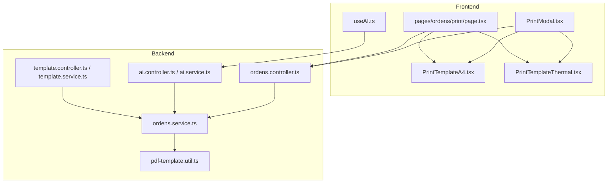
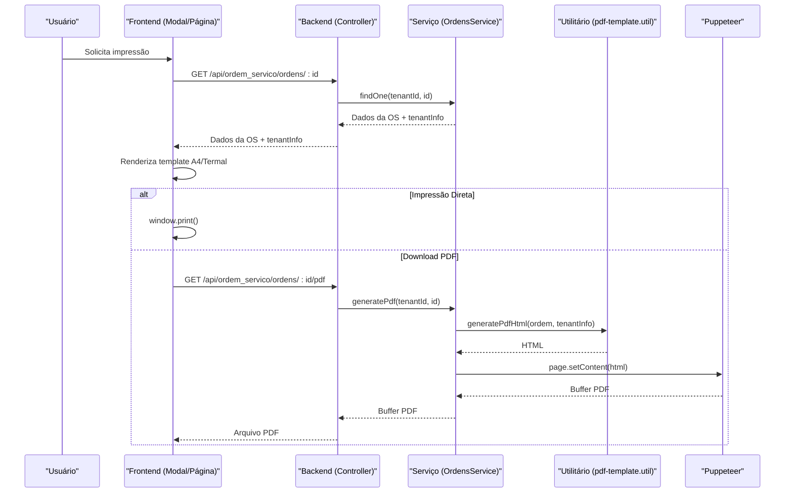
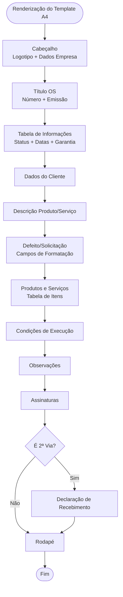
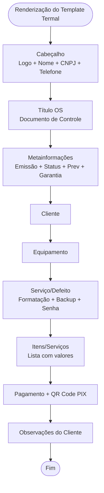
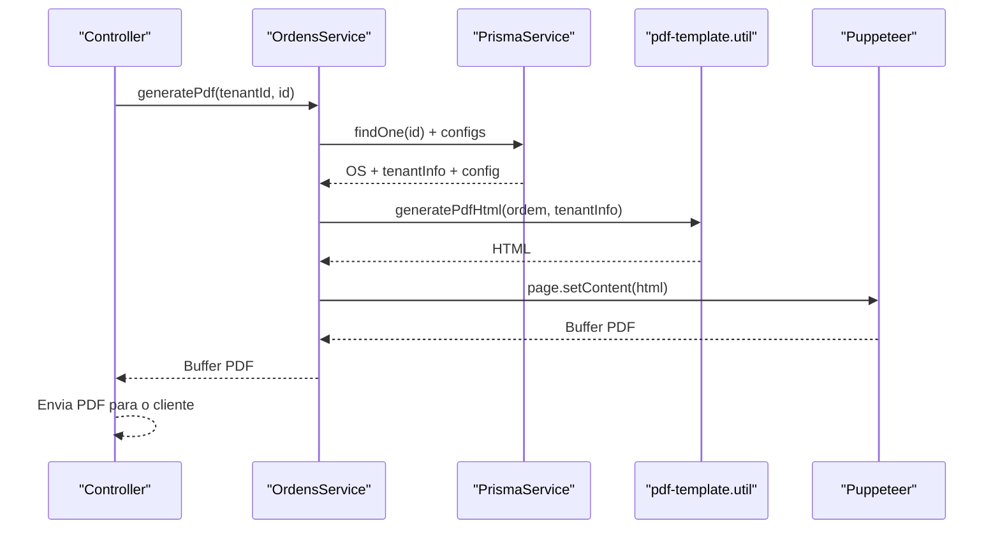
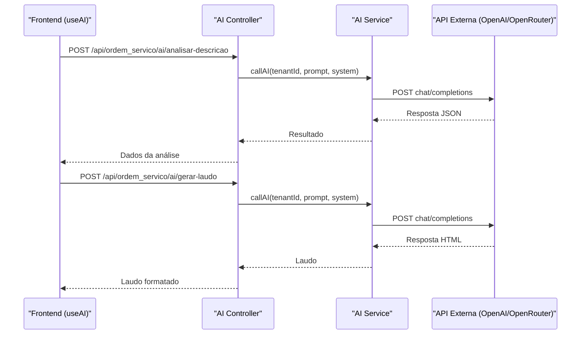
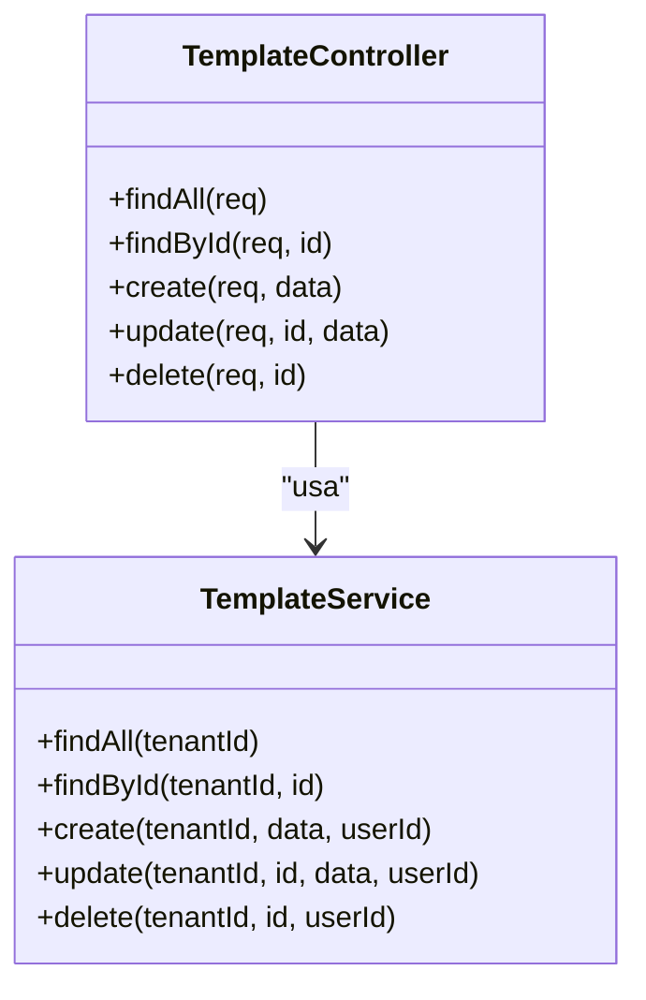
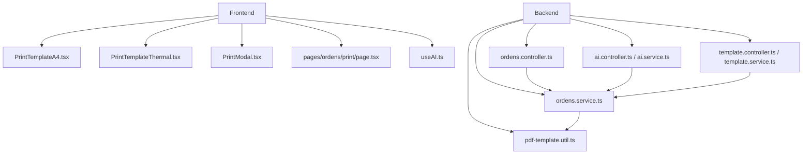

# Geração de Laudos e Relatórios

<cite>
**Arquivos referenciados neste documento**
- [pdf-template.util.ts](file://backend/ordens/pdf-template.util.ts)
- [PrintTemplateA4.tsx](file://frontend/components/PrintTemplateA4.tsx)
- [PrintTemplateThermal.tsx](file://frontend/components/PrintTemplateThermal.tsx)
- [PrintModal.tsx](file://frontend/components/PrintModal.tsx)
- [page.tsx](file://frontend/pages/ordens/print/page.tsx)
- [ordens.controller.ts](file://backend/ordens/ordens.controller.ts)
- [ordens.service.ts](file://backend/ordens/ordens.service.ts)
- [template.service.ts](file://backend/shared/services/template.service.ts)
- [template.controller.ts](file://backend/shared/controllers/template.controller.ts)
- [ai.service.ts](file://backend/shared/services/ai.service.ts)
- [ai.controller.ts](file://backend/shared/controllers/ai.controller.ts)
- [prompts.ts](file://backend/shared/services/prompts.ts)
- [useAI.ts](file://frontend/hooks/useAI.ts)
- [004_add_tables_os.sql](file://backend/migrations/004_add_tables_os.sql)
- [003_add_print_fields.sql](file://backend/migrations/003_add_print_fields.sql)
</cite>

## Sumário
1. [Introdução](#introdução)
2. [Estrutura do Projeto](#estrutura-do-projeto)
3. [Componentes-Chave](#componentes-chave)
4. [Visão Geral da Arquitetura](#visão-geral-da-arquitetura)
5. [Análise Detalhada de Componentes](#análise-detalhada-de-componentes)
6. [Análise de Dependências](#análise-de-dependências)
7. [Considerações de Desempenho](#considerações-de-desempenho)
8. [Guia de Solução de Problemas](#guia-de-solução-de-problemas)
9. [Conclusão](#conclusão)
10. [Apêndices](#apêndices)

## Introdução
Este documento apresenta uma visão abrangente sobre a geração de laudos e relatórios para ordens de serviço, com foco em:
- Geração de PDFs (A4 e termal) com templates padronizados e personalizáveis
- Integração com IA para geração automática de laudos técnicos
- Impressão física e digital, configurações de layout e formatação
- Personalização de templates e integrações adicionais

O sistema oferece tanto uma experiência frontend para visualização e impressão quanto um backend robusto para geração de PDFs com Puppeteer, além de um mecanismo de templates personalizados e um serviço de IA integrado.

## Estrutura do Projeto
O projeto segue uma arquitetura modular com camadas de frontend (Next.js) e backend (NestJS). As principais áreas relevantes para geração de laudos e relatórios são:
- Backend: geração de PDFs, templates, IA e configurações
- Frontend: templates de impressão A4 e termal, modal de impressão e página de visualização

**Diagrama fonte**
- [PrintModal.tsx](file://frontend/components/PrintModal.tsx#L1-L184)
- [page.tsx](file://frontend/pages/ordens/print/page.tsx#L1-L276)
- [PrintTemplateA4.tsx](file://frontend/components/PrintTemplateA4.tsx#L1-L694)
- [PrintTemplateThermal.tsx](file://frontend/components/PrintTemplateThermal.tsx#L1-L273)
- [useAI.ts](file://frontend/hooks/useAI.ts#L1-L41)
- [ordens.controller.ts](file://backend/ordens/ordens.controller.ts#L135-L157)
- [ordens.service.ts](file://backend/ordens/ordens.service.ts#L15-L123)
- [ai.controller.ts](file://backend/shared/controllers/ai.controller.ts#L1-L53)
- [ai.service.ts](file://backend/shared/services/ai.service.ts#L1-L91)
- [template.controller.ts](file://backend/shared/controllers/template.controller.ts#L1-L80)
- [template.service.ts](file://backend/shared/services/template.service.ts#L1-L104)
- [pdf-template.util.ts](file://backend/ordens/pdf-template.util.ts#L1-L462)

**Seção fonte**
- [PrintModal.tsx](file://frontend/components/PrintModal.tsx#L1-L184)
- [page.tsx](file://frontend/pages/ordens/print/page.tsx#L1-L276)
- [PrintTemplateA4.tsx](file://frontend/components/PrintTemplateA4.tsx#L1-L694)
- [PrintTemplateThermal.tsx](file://frontend/components/PrintTemplateThermal.tsx#L1-L273)
- [useAI.ts](file://frontend/hooks/useAI.ts#L1-L41)
- [ordens.controller.ts](file://backend/ordens/ordens.controller.ts#L135-L157)
- [ordens.service.ts](file://backend/ordens/ordens.service.ts#L15-L123)
- [ai.controller.ts](file://backend/shared/controllers/ai.controller.ts#L1-L53)
- [ai.service.ts](file://backend/shared/services/ai.service.ts#L1-L91)
- [template.controller.ts](file://backend/shared/controllers/template.controller.ts#L1-L80)
- [template.service.ts](file://backend/shared/services/template.service.ts#L1-L104)
- [pdf-template.util.ts](file://backend/ordens/pdf-template.util.ts#L1-L462)

## Componentes-Chave
- Templates de impressão:
  - A4: [PrintTemplateA4.tsx](file://frontend/components/PrintTemplateA4.tsx#L72-L694)
  - Termal: [PrintTemplateThermal.tsx](file://frontend/components/PrintTemplateThermal.tsx#L10-L273)
- Modal de impressão: [PrintModal.tsx](file://frontend/components/PrintModal.tsx#L26-L184)
- Página de visualização: [page.tsx](file://frontend/pages/ordens/print/page.tsx#L50-L276)
- Geração de PDF (backend): [ordens.controller.ts](file://backend/ordens/ordens.controller.ts#L135-L157), [ordens.service.ts](file://backend/ordens/ordens.service.ts#L15-L123), [pdf-template.util.ts](file://backend/ordens/pdf-template.util.ts#L2-L461)
- IA para geração de laudos: [ai.controller.ts](file://backend/shared/controllers/ai.controller.ts#L14-L51), [ai.service.ts](file://backend/shared/services/ai.service.ts#L33-L89), [prompts.ts](file://backend/shared/services/prompts.ts#L1-L27), [useAI.ts](file://frontend/hooks/useAI.ts#L7-L33)
- Templates personalizados: [template.controller.ts](file://backend/shared/controllers/template.controller.ts#L13-L79), [template.service.ts](file://backend/shared/services/template.service.ts#L10-L103)

**Seção fonte**
- [PrintTemplateA4.tsx](file://frontend/components/PrintTemplateA4.tsx#L72-L694)
- [PrintTemplateThermal.tsx](file://frontend/components/PrintTemplateThermal.tsx#L10-L273)
- [PrintModal.tsx](file://frontend/components/PrintModal.tsx#L26-L184)
- [page.tsx](file://frontend/pages/ordens/print/page.tsx#L50-L276)
- [ordens.controller.ts](file://backend/ordens/ordens.controller.ts#L135-L157)
- [ordens.service.ts](file://backend/ordens/ordens.service.ts#L15-L123)
- [pdf-template.util.ts](file://backend/ordens/pdf-template.util.ts#L2-L461)
- [ai.controller.ts](file://backend/shared/controllers/ai.controller.ts#L14-L51)
- [ai.service.ts](file://backend/shared/services/ai.service.ts#L33-L89)
- [prompts.ts](file://backend/shared/services/prompts.ts#L1-L27)
- [useAI.ts](file://frontend/hooks/useAI.ts#L7-L33)
- [template.controller.ts](file://backend/shared/controllers/template.controller.ts#L13-L79)
- [template.service.ts](file://backend/shared/services/template.service.ts#L10-L103)

## Visão Geral da Arquitetura
O fluxo de geração de PDFs e impressão segue estas etapas:
1. O frontend carrega os dados da OS e configurações (condições de execução, logotipo).
2. O usuário solicita impressão (modal ou página de visualização).
3. Para impressão direta, o frontend prepara o conteúdo e chama a impressora.
4. Para download de PDF, o backend gera um HTML com base em um template utilitário e converte para PDF usando Puppeteer.

**Diagrama fonte**
- [PrintModal.tsx](file://frontend/components/PrintModal.tsx#L45-L139)
- [page.tsx](file://frontend/pages/ordens/print/page.tsx#L74-L276)
- [ordens.controller.ts](file://backend/ordens/ordens.controller.ts#L135-L157)
- [ordens.service.ts](file://backend/ordens/ordens.service.ts#L15-L123)
- [pdf-template.util.ts](file://backend/ordens/pdf-template.util.ts#L2-L461)

**Seção fonte**
- [PrintModal.tsx](file://frontend/components/PrintModal.tsx#L45-L139)
- [page.tsx](file://frontend/pages/ordens/print/page.tsx#L74-L276)
- [ordens.controller.ts](file://backend/ordens/ordens.controller.ts#L135-L157)
- [ordens.service.ts](file://backend/ordens/ordens.service.ts#L15-L123)
- [pdf-template.util.ts](file://backend/ordens/pdf-template.util.ts#L2-L461)

## Análise Detalhada de Componentes

### Templates de Impressão A4
O template A4 organiza os dados da OS em seções com formatação específica, incluindo:
- Cabeçalho com logotipo, nome e dados da empresa
- Título com número da OS e data de emissão
- Tabela de informações (status, datas previstas, garantia)
- Dados do cliente
- Descrição do produto/serviço
- Defeito/solicitação com campos de formatação
- Produtos e serviços com tabela de itens
- Condições de execução e observações
- Assinaturas
- Declaração de recebimento (via 2ª via)
- Rodapé com marca d’água

**Diagrama fonte**
- [PrintTemplateA4.tsx](file://frontend/components/PrintTemplateA4.tsx#L114-L335)

**Seção fonte**
- [PrintTemplateA4.tsx](file://frontend/components/PrintTemplateA4.tsx#L72-L694)

### Template Termal
O template termal é otimizado para impressoras térmicas de 80mm, com:
- Layout compacto e tipografia adequada
- Cabeçalho com logotipo e dados da empresa
- Identificação da OS e metainformações (status, previsão, garantia)
- Seção do cliente
- Descrição do equipamento
- Detalhamento do serviço/defeito com campos de formatação
- Lista de itens com valores
- Informações de pagamento e QR Code PIX
- Observações do cliente

**Diagrama fonte**
- [PrintTemplateThermal.tsx](file://frontend/components/PrintTemplateThermal.tsx#L76-L271)

**Seção fonte**
- [PrintTemplateThermal.tsx](file://frontend/components/PrintTemplateThermal.tsx#L10-L273)

### Geração de PDF (Backend)
O backend gera PDFs com Puppeteer a partir de um HTML produzido por um utilitário de template. As etapas são:
1. Busca da OS e informações do tenant
2. Leitura de configurações (ex: condições de execução)
3. Conversão de logotipo para base64 (se disponível)
4. Geração do HTML com o utilitário de template
5. Inicialização do Puppeteer, carregamento do conteúdo e geração do PDF

**Diagrama fonte**
- [ordens.controller.ts](file://backend/ordens/ordens.controller.ts#L135-L157)
- [ordens.service.ts](file://backend/ordens/ordens.service.ts#L15-L123)
- [pdf-template.util.ts](file://backend/ordens/pdf-template.util.ts#L2-L461)

**Seção fonte**
- [ordens.controller.ts](file://backend/ordens/ordens.controller.ts#L135-L157)
- [ordens.service.ts](file://backend/ordens/ordens.service.ts#L15-L123)
- [pdf-template.util.ts](file://backend/ordens/pdf-template.util.ts#L2-L461)

### Integração com IA para Geração de Laudos
A IA pode auxiliar na análise de descrições e na geração de laudos técnicos profissionais. O fluxo envolve:
- Chamada ao endpoint de análise de descrição
- Chamada ao endpoint de geração de laudo
- Prompt pré-definido para formatação HTML

**Diagrama fonte**
- [useAI.ts](file://frontend/hooks/useAI.ts#L7-L33)
- [ai.controller.ts](file://backend/shared/controllers/ai.controller.ts#L14-L51)
- [ai.service.ts](file://backend/shared/services/ai.service.ts#L33-L89)
- [prompts.ts](file://backend/shared/services/prompts.ts#L1-L27)

**Seção fonte**
- [useAI.ts](file://frontend/hooks/useAI.ts#L7-L33)
- [ai.controller.ts](file://backend/shared/controllers/ai.controller.ts#L14-L51)
- [ai.service.ts](file://backend/shared/services/ai.service.ts#L33-L89)
- [prompts.ts](file://backend/shared/services/prompts.ts#L1-L27)

### Templates Personalizados
O sistema permite criar, atualizar, buscar e excluir templates personalizados por tenant. O backend expõe endpoints protegidos com autenticação JWT.

**Diagrama fonte**
- [template.controller.ts](file://backend/shared/controllers/template.controller.ts#L13-L79)
- [template.service.ts](file://backend/shared/services/template.service.ts#L10-L103)

**Seção fonte**
- [template.controller.ts](file://backend/shared/controllers/template.controller.ts#L13-L79)
- [template.service.ts](file://backend/shared/services/template.service.ts#L10-L103)

## Análise de Dependências
- Frontend depende de:
  - Componentes de template A4 e termal
  - Hooks de IA para integração com o backend
  - Modal de impressão e página de visualização
- Backend depende de:
  - Prisma para acesso ao banco de dados
  - Puppeteer para geração de PDFs
  - Utilitário de template para HTML
  - Configurações do tenant e condições de execução

**Diagrama fonte**
- [PrintTemplateA4.tsx](file://frontend/components/PrintTemplateA4.tsx#L1-L694)
- [PrintTemplateThermal.tsx](file://frontend/components/PrintTemplateThermal.tsx#L1-L273)
- [PrintModal.tsx](file://frontend/components/PrintModal.tsx#L1-L184)
- [page.tsx](file://frontend/pages/ordens/print/page.tsx#L1-L276)
- [useAI.ts](file://frontend/hooks/useAI.ts#L1-L41)
- [ordens.controller.ts](file://backend/ordens/ordens.controller.ts#L1-L377)
- [ordens.service.ts](file://backend/ordens/ordens.service.ts#L1-L123)
- [ai.controller.ts](file://backend/shared/controllers/ai.controller.ts#L1-L53)
- [ai.service.ts](file://backend/shared/services/ai.service.ts#L1-L91)
- [template.controller.ts](file://backend/shared/controllers/template.controller.ts#L1-L80)
- [template.service.ts](file://backend/shared/services/template.service.ts#L1-L104)
- [pdf-template.util.ts](file://backend/ordens/pdf-template.util.ts#L1-L462)

**Seção fonte**
- [ordens.controller.ts](file://backend/ordens/ordens.controller.ts#L1-L377)
- [ordens.service.ts](file://backend/ordens/ordens.service.ts#L1-L123)
- [ai.controller.ts](file://backend/shared/controllers/ai.controller.ts#L1-L53)
- [ai.service.ts](file://backend/shared/services/ai.service.ts#L1-L91)
- [template.controller.ts](file://backend/shared/controllers/template.controller.ts#L1-L80)
- [template.service.ts](file://backend/shared/services/template.service.ts#L1-L104)
- [pdf-template.util.ts](file://backend/ordens/pdf-template.util.ts#L1-L462)

## Considerações de Desempenho
- Geração de PDFs com Puppeteer:
  - O serviço lança o navegador em modo headless com argumentos otimizados para ambientes Windows/Server.
  - Timeout aumentado para evitar falhas em processos lentos.
  - Margens e formatação controladas via CSS do template.
- Impressão em tempo real:
  - O frontend renderiza os templates e chama a impressora diretamente, evitando geração de PDF desnecessária.
- IA:
  - As chamadas à API externa são assíncronas e tratadas com mensagens de erro específicas.

[Sem fonte, pois esta seção fornece orientações gerais]

## Guia de Solução de Problemas
- Erro ao gerar PDF:
  - Verifique se o tenant possui logotipo e se o caminho está acessível.
  - Confirme se as configurações de condições de execução estão disponíveis.
  - Revise os logs do backend para erros de timeout ou falha no carregamento do conteúdo.
- Erro ao chamar IA:
  - Confirme se a chave de API está configurada e se o provedor (OpenAI/OpenRouter) está ativo.
  - Verifique se o tenant tem permissões para usar a IA.
- Impressão termal:
  - Certifique-se de que o layout está dentro de 80mm de largura.
  - Valide o QR Code PIX e os campos de pagamento.

**Seção fonte**
- [ordens.service.ts](file://backend/ordens/ordens.service.ts#L15-L123)
- [ai.service.ts](file://backend/shared/services/ai.service.ts#L33-L89)

## Conclusão
O módulo oferece uma solução completa para geração de laudos e relatórios de ordens de serviço, com:
- Templates A4 e termal prontos para uso
- Geração de PDFs via backend com Puppeteer
- Integração com IA para análise e geração de laudos técnicos
- Personalização de templates e configurações
- Facilidade de impressão física e digital

[Sem fonte, pois esta seção resume sem analisar arquivos específicos]

## Apêndices

### Tipos de Relatórios Disponíveis
- A4: Layout completo com cabeçalho, seções e assinaturas
- Termal: Layout compacto para impressoras de 80mm

**Seção fonte**
- [PrintTemplateA4.tsx](file://frontend/components/PrintTemplateA4.tsx#L72-L694)
- [PrintTemplateThermal.tsx](file://frontend/components/PrintTemplateThermal.tsx#L10-L273)

### Campos e Layouts
- Campos comuns: número da OS, datas, status, cliente, equipamento, serviços, valores, garantia
- Layouts: CSS responsáveis pela formatação e impressão

**Seção fonte**
- [pdf-template.util.ts](file://backend/ordens/pdf-template.util.ts#L205-L461)
- [PrintTemplateA4.tsx](file://frontend/components/PrintTemplateA4.tsx#L337-L694)
- [PrintTemplateThermal.tsx](file://frontend/components/PrintTemplateThermal.tsx#L76-L273)

### Exemplos de Código
- Geração de PDF (backend):
  - [ordens.controller.ts](file://backend/ordens/ordens.controller.ts#L135-L157)
  - [ordens.service.ts](file://backend/ordens/ordens.service.ts#L15-L123)
  - [pdf-template.util.ts](file://backend/ordens/pdf-template.util.ts#L2-L461)
- Templates de impressão:
  - [PrintTemplateA4.tsx](file://frontend/components/PrintTemplateA4.tsx#L72-L694)
  - [PrintTemplateThermal.tsx](file://frontend/components/PrintTemplateThermal.tsx#L10-L273)
- Integração com IA:
  - [ai.controller.ts](file://backend/shared/controllers/ai.controller.ts#L14-L51)
  - [ai.service.ts](file://backend/shared/services/ai.service.ts#L33-L89)
  - [prompts.ts](file://backend/shared/services/prompts.ts#L1-L27)
  - [useAI.ts](file://frontend/hooks/useAI.ts#L7-L33)
- Templates personalizados:
  - [template.controller.ts](file://backend/shared/controllers/template.controller.ts#L13-L79)
  - [template.service.ts](file://backend/shared/services/template.service.ts#L10-L103)

### Configurações de Layout e Formatação
- Margens e tamanhos:
  - A4: CSS define tamanho máximo de 210mm e margens controladas
  - Termal: CSS define tamanho máximo de 80mm
- Impressão:
  - Media print com @media print e @page
  - Cores e ajustes para impressão correta

**Seção fonte**
- [PrintTemplateA4.tsx](file://frontend/components/PrintTemplateA4.tsx#L337-L694)
- [PrintTemplateThermal.tsx](file://frontend/components/PrintTemplateThermal.tsx#L258-L271)
- [page.tsx](file://frontend/pages/ordens/print/page.tsx#L244-L273)

### Migrações Relevantes
- Campos de formatação e laudo técnico:
  - [004_add_tables_os.sql](file://backend/migrations/004_add_tables_os.sql#L34-L44)
- Garantia e condições de execução:
  - [003_add_print_fields.sql](file://backend/migrations/003_add_print_fields.sql#L5-L21)

**Seção fonte**
- [004_add_tables_os.sql](file://backend/migrations/004_add_tables_os.sql#L34-L44)
- [003_add_print_fields.sql](file://backend/migrations/003_add_print_fields.sql#L5-L21)