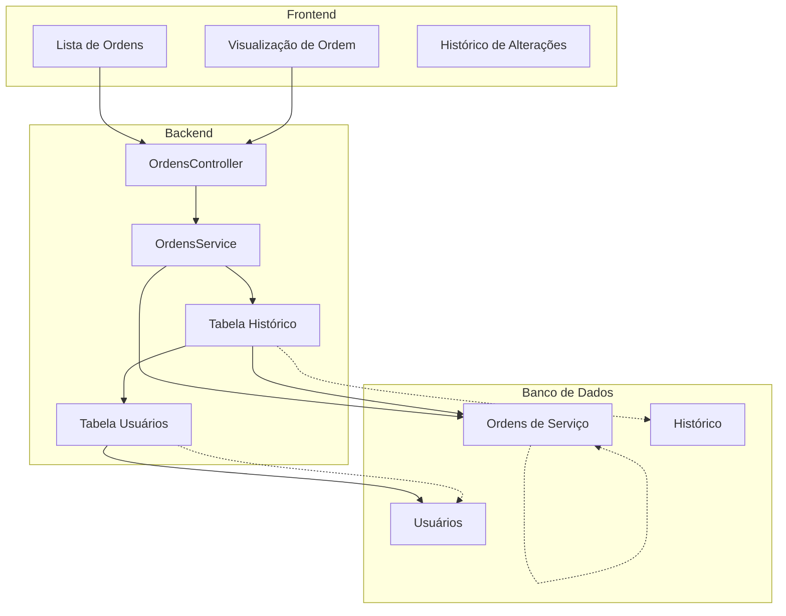
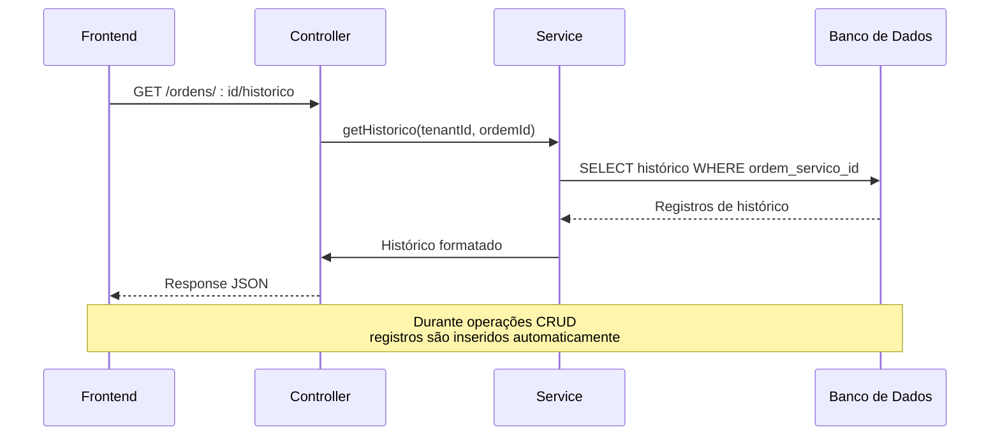

# Histórico e Auditoria

<cite>
**Arquivos referenciados neste documento**
- [backend/ordens/ordens.controller.ts](file://backend/ordens/ordens.controller.ts)
- [backend/ordens/ordens.service.ts](file://backend/ordens/ordens.service.ts)
- [backend/shared/dto/ordem-servico.dto.ts](file://backend/shared/dto/ordem-servico.dto.ts)
- [backend/migrations/001_master.sql](file://backend/migrations/001_master.sql)
- [backend/migrations/004_add_tables_os.sql](file://backend/migrations/004_add_tables_os.sql)
- [frontend/pages/ordens/page.tsx](file://frontend/pages/ordens/page.tsx)
- [frontend/components/OrdemViewModal.tsx](file://frontend/components/OrdemViewModal.tsx)
- [frontend/types/ordem-servico.types.ts](file://frontend/types/ordem-servico.types.ts)
</cite>

## Sumário
1. [Introdução](#introdução)
2. [Estrutura do Histórico](#estrutura-do-histórico)
3. [Geração Automática do Histórico](#geração-automática-do-histórico)
4. [Acesso e Visualização](#acesso-e-visualização)
5. [Consultas Históricas e Relatórios](#consultas-históricas-e-relatórios)
6. [Integração com o Frontend](#integração-com-o-frontend)
7. [Arquitetura do Sistema](#arquitetura-do-sistema)
8. [Considerações de Conformidade e Auditoria](#considerações-de-conformidade-e-auditoria)
9. [Guia de Troubleshooting](#guia-de-troubleshooting)
10. [Conclusão](#conclusão)

## Introdução
Este documento descreve o sistema de histórico e auditoria de ordens de serviço, detalhando como o histórico é gerado automaticamente para todas as alterações, sua estrutura, acesso e visualização, bem como as integrações com o frontend. Também aborda práticas recomendadas para auditorias e conformidade.

## Estrutura do Histórico
O histórico de ordens de serviço é armazenado em uma tabela dedicada com os seguintes campos principais:
- Identificador único do histórico
- Identificador da ordem de serviço associada
- Identificador do usuário que realizou a ação
- Ação realizada (ex: CRIAÇÃO, EDIÇÃO, MUDANÇA_STATUS, FINALIZACAO, CANCELAMENTO, APROVACAO_ORCAMENTO)
- Valor anterior (quando aplicável)
- Valor novo (descrição da mudança)
- Observações adicionais
- Timestamp de criação

A estrutura da tabela de histórico é definida pela migration e inclui constraints de chave estrangeira para manter a integridade referencial com as tabelas de ordens e usuários.

**Seção fonte**
- [backend/migrations/001_master.sql](file://backend/migrations/001_master.sql#L251-L268)

## Geração Automática do Histórico
O histórico é gerado automaticamente pelos seguintes eventos:
- Criação de ordem de serviço: registra a criação com o status inicial e observações iniciais
- Edição de ordem de serviço: registra as alterações específicas detectadas nos campos modificados
- Alteração de status: registra a mudança de status com a descrição apropriada (incluindo finalização e cancelamento)
- Aprovação de orçamento: registra a aprovação com status alterado para aberta

O mecanismo de geração funciona através de métodos privados no serviço que:
1. Detectam alterações comparando os dados atuais com os dados fornecidos
2. Montam mensagens descritivas das mudanças
3. Inserem registros no histórico com timestamps e identificadores

**Seção fonte**
- [backend/ordens/ordens.service.ts](file://backend/ordens/ordens.service.ts#L631-L645)
- [backend/ordens/ordens.service.ts](file://backend/ordens/ordens.service.ts#L761-L762)
- [backend/ordens/ordens.service.ts](file://backend/ordens/ordens.service.ts#L801-L821)
- [backend/ordens/ordens.service.ts](file://backend/ordens/ordens.service.ts#L873-L882)

## Acesso e Visualização
O histórico pode ser acessado através de uma rota específica no controller:
- Endpoint: GET /api/ordem_servico/ordens/:id/historico
- Retorna um array de registros de histórico ordenados cronologicamente (mais recente primeiro)
- Cada registro inclui informações do usuário (nome e email) que realizou a ação

A visualização no frontend é feita através de um modal que exibe:
- Data e hora da ação
- Usuário responsável
- Descrição da ação realizada
- Valores anteriores e novos quando aplicável
- Observações adicionais

**Seção fonte**
- [backend/ordens/ordens.controller.ts](file://backend/ordens/ordens.controller.ts#L121-L133)
- [backend/ordens/ordens.service.ts](file://backend/ordens/ordens.service.ts#L892-L915)
- [frontend/components/OrdemViewModal.tsx](file://frontend/components/OrdemViewModal.tsx#L1-L367)

## Consultas Históricas e Relatórios
Para consultas históricas e geração de relatórios, o sistema oferece:
- Consulta histórica por ordem de serviço (via endpoint específico)
- Filtros avançados no backend para pesquisa de ordens (busca textual, status, datas, etc.)
- Estrutura de dados padronizada para exportação e relatórios

Exemplos de consultas históricas:
- Histórico completo de uma ordem específica
- Histórico filtrado por período
- Histórico por usuário responsável
- Histórico por tipo de ação

**Seção fonte**
- [backend/ordens/ordens.controller.ts](file://backend/ordens/ordens.controller.ts#L34-L55)
- [backend/shared/dto/ordem-servico.dto.ts](file://backend/shared/dto/ordem-servico.dto.ts#L249-L271)

## Integração com o Frontend
A integração com o frontend é implementada através de:
- Componente de visualização de ordens (OrdemViewModal) que exibe o histórico
- Rotas e navegação para visualização detalhada
- Tipagem TypeScript consistente entre backend e frontend
- Componentes de UI responsivos para exibição de histórico

O frontend consome os dados do histórico através de chamadas HTTP e apresenta de forma clara e organizada, com destaque para ações mais importantes e histórico completo em formato tabular.

**Seção fonte**
- [frontend/pages/ordens/page.tsx](file://frontend/pages/ordens/page.tsx#L166-L684)
- [frontend/components/OrdemViewModal.tsx](file://frontend/components/OrdemViewModal.tsx#L1-L367)
- [frontend/types/ordem-servico.types.ts](file://frontend/types/ordem-servico.types.ts#L75-L85)

## Arquitetura do Sistema
A arquitetura do sistema de histórico segue os seguintes padrões:

**Diagrama fonte**
- [backend/ordens/ordens.controller.ts](file://backend/ordens/ordens.controller.ts#L25-L32)
- [backend/ordens/ordens.service.ts](file://backend/ordens/ordens.service.ts#L1006-L1031)
- [backend/migrations/001_master.sql](file://backend/migrations/001_master.sql#L251-L268)

### Fluxo de Geração de Histórico

**Diagrama fonte**
- [backend/ordens/ordens.controller.ts](file://backend/ordens/ordens.controller.ts#L121-L133)
- [backend/ordens/ordens.service.ts](file://backend/ordens/ordens.service.ts#L892-L915)

## Considerações de Conformidade e Auditoria
Para auditorias e conformidade, o sistema oferece:
- Rastreamento completo de todas as alterações
- Identificação clara do usuário responsável por cada ação
- Timestamps precisos para análise temporal
- Histórico persistente mesmo após exclusão de ordens (ver regras de integridade)

Práticas recomendadas:
- Manter histórico sempre ativo para todas as operações críticas
- Realizar auditorias periódicas de acesso e alterações
- Utilizar filtros de data para análises específicas
- Integrar histórico com políticas de retenção de dados

## Guia de Troubleshooting
Problemas comuns e soluções:

**Histórico não está sendo gerado:**
- Verificar se as operações estão passando pelo serviço correto
- Confirmar que os métodos de registro de histórico estão sendo chamados
- Verificar permissões de acesso ao banco de dados

**Dados do histórico incompletos:**
- Verificar se os campos de histórico estão sendo preenchidos corretamente
- Confirmar se as constraints de chave estrangeira estão funcionando
- Validar se os dados do usuário estão disponíveis

**Erros de conexão com o banco:**
- Verificar strings de conexão e credenciais
- Confirmar se as migrations foram executadas corretamente
- Validar permissões de acesso às tabelas

**Seção fonte**
- [backend/ordens/ordens.service.ts](file://backend/ordens/ordens.service.ts#L1015-L1030)

## Conclusão
O sistema de histórico e auditoria de ordens de serviço oferece uma solução robusta e automatizada para rastrear todas as alterações ocorridas no ciclo de vida das ordens. Com geração automática de registros, estrutura padronizada e integração completa com o frontend, proporciona transparência e rastreabilidade essenciais para auditorias e conformidade.