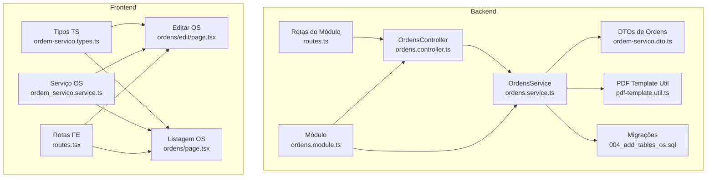
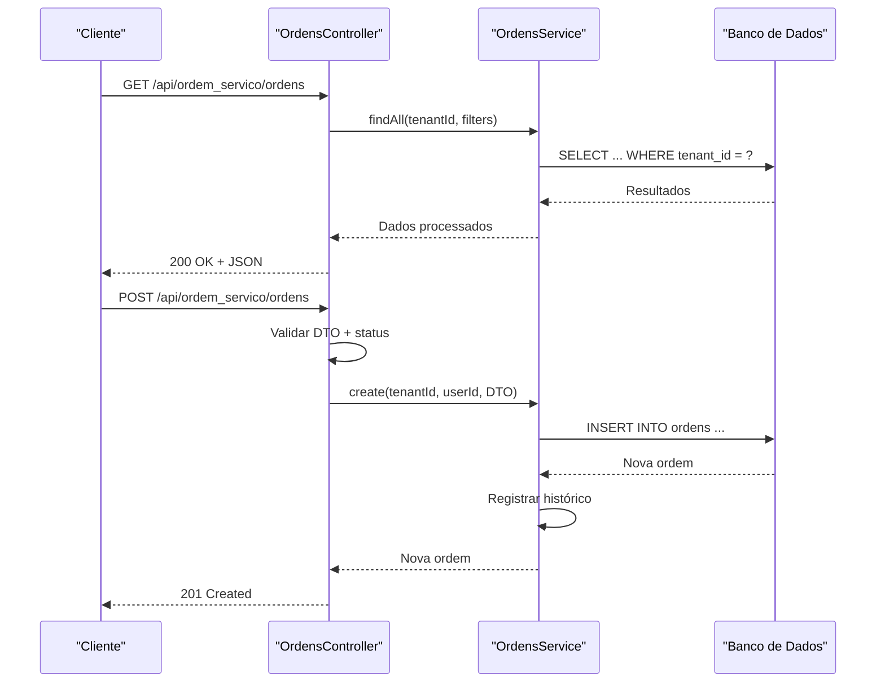
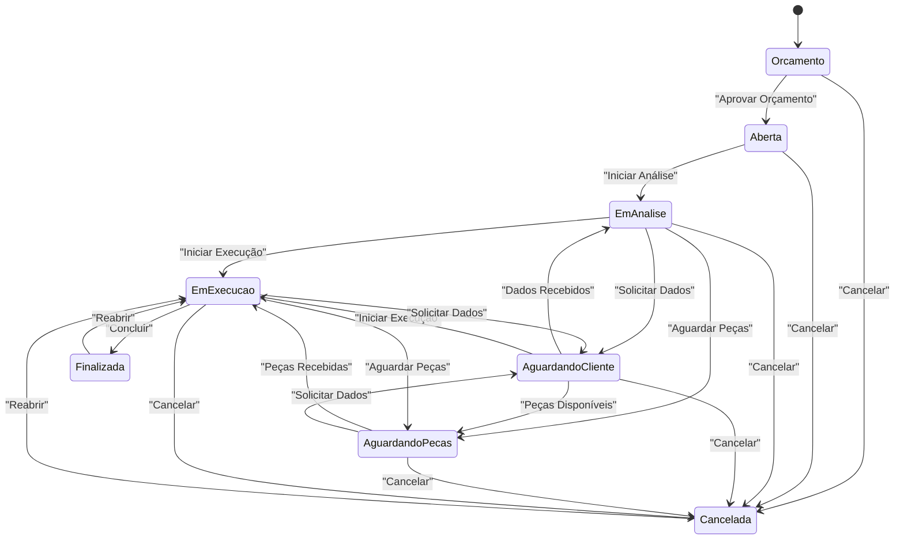
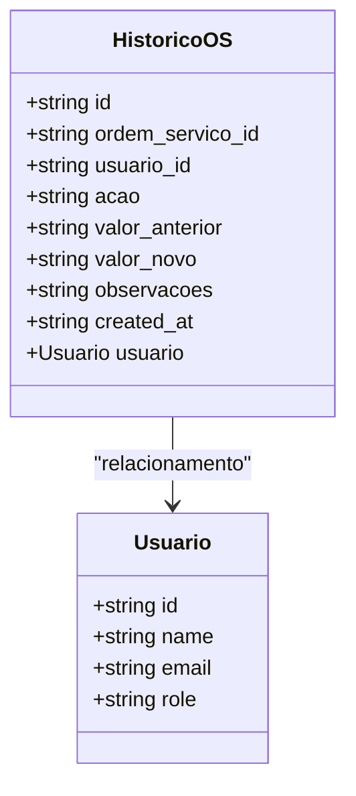
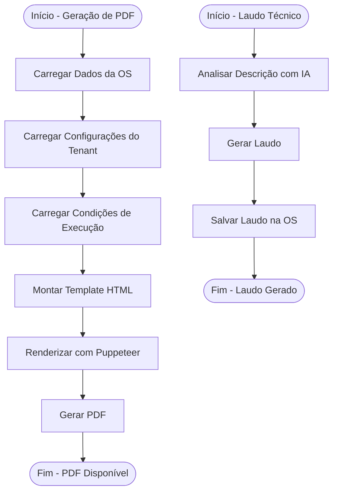
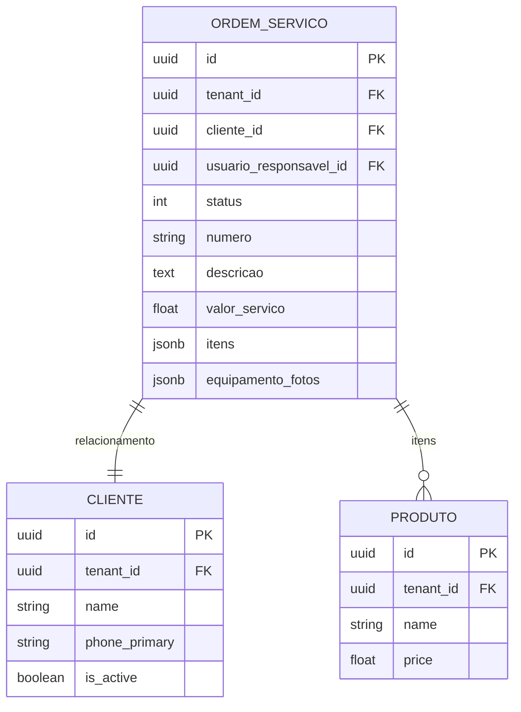
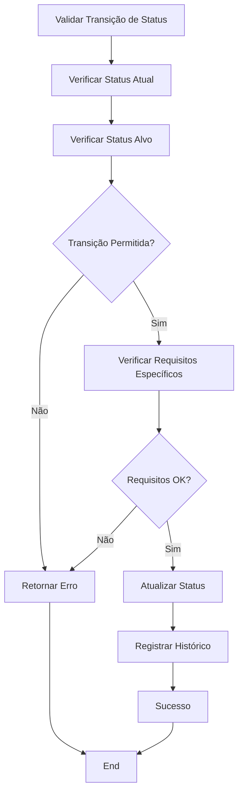
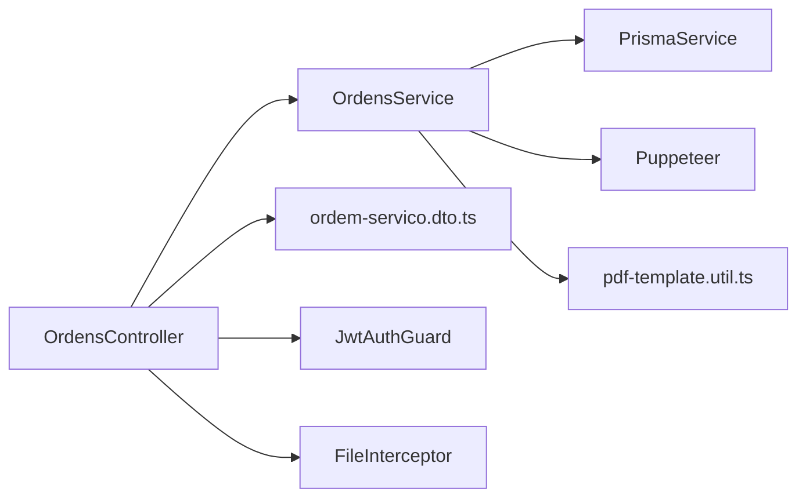

# Módulo de Ordens de Serviço

<cite>
**Arquivos referenciados neste documento**
- [backend/ordens/ordens.controller.ts](file://backend/ordens/ordens.controller.ts)
- [backend/ordens/ordens.service.ts](file://backend/ordens/ordens.service.ts)
- [backend/ordens/pdf-template.util.ts](file://backend/ordens/pdf-template.util.ts)
- [backend/ordens/ordens.module.ts](file://backend/ordens/ordens.module.ts)
- [backend/shared/dto/ordem-servico.dto.ts](file://backend/shared/dto/ordem-servico.dto.ts)
- [backend/migrations/004_add_tables_os.sql](file://backend/migrations/004_add_tables_os.sql)
- [backend/routes.ts](file://backend/routes.ts)
- [frontend/types/ordem-servico.types.ts](file://frontend/types/ordem-servico.types.ts)
- [frontend/pages/ordens/edit/page.tsx](file://frontend/pages/ordens/edit/page.tsx)
- [frontend/pages/ordens/page.tsx](file://frontend/pages/ordens/page.tsx)
- [frontend/services/ordem_servico.service.ts](file://frontend/services/ordem_servico.service.ts)
- [frontend/routes.tsx](file://frontend/routes.tsx)
</cite>

## Sumário
1. [Introdução](#introdução)
2. [Estrutura do Projeto](#estrutura-do-projeto)
3. [Componentes Principais](#componentes-principais)
4. [Visão Geral da Arquitetura](#visão-geral-da-arquitetura)
5. [Análise Detalhada dos Componentes](#análise-detalhada-dos-componentes)
6. [Análise de Dependências](#análise-de-dependências)
7. [Considerações de Desempenho](#considerações-de-desempenho)
8. [Guia de Solução de Problemas](#guia-de-solução-de-problemas)
9. [Conclusão](#conclusão)
10. [Apêndices](#apêndices)

## Introdução
O módulo de Ordens de Serviço é um componente central do sistema que gerencia todo o ciclo de vida das ordens, desde a criação até a conclusão e histórico de auditoria. Ele oferece funcionalidades avançadas de validação de status, geração de PDFs, integrações com IA para geração de laudos técnicos, e relacionamentos com clientes e produtos. Este documento apresenta o ciclo completo de vida das ordens, transições de status, histórico e auditoria, além de documentar as APIs REST, validações complexas, relacionamentos e padrões de uso.

## Estrutura do Projeto
O módulo segue uma estrutura de camadas bem definida:
- Backend: Controllers, Services, DTOs, migrações e utilitários
- Frontend: Páginas, serviços e tipos TypeScript
- Comunicação: APIs REST com autenticação JWT e validações rigorosas

**Diagrama fonte**
- [backend/routes.ts](file://backend/routes.ts#L9-L17)
- [backend/ordens/ordens.controller.ts](file://backend/ordens/ordens.controller.ts#L25-L377)
- [backend/ordens/ordens.service.ts](file://backend/ordens/ordens.service.ts#L1-L1148)
- [backend/ordens/pdf-template.util.ts](file://backend/ordens/pdf-template.util.ts#L1-L462)
- [backend/ordens/ordens.module.ts](file://backend/ordens/ordens.module.ts#L1-L13)
- [backend/migrations/004_add_tables_os.sql](file://backend/migrations/004_add_tables_os.sql#L1-L80)
- [frontend/types/ordem-servico.types.ts](file://frontend/types/ordem-servico.types.ts#L1-L235)
- [frontend/pages/ordens/edit/page.tsx](file://frontend/pages/ordens/edit/page.tsx#L1-L800)
- [frontend/pages/ordens/page.tsx](file://frontend/pages/ordens/page.tsx#L1-L200)
- [frontend/services/ordem_servico.service.ts](file://frontend/services/ordem_servico.service.ts#L1-L20)
- [frontend/routes.tsx](file://frontend/routes.tsx#L1-L20)

**Seção fonte**
- [backend/ordens/ordens.module.ts](file://backend/ordens/ordens.module.ts#L1-L13)
- [backend/routes.ts](file://backend/routes.ts#L1-L17)
- [frontend/routes.tsx](file://frontend/routes.tsx#L1-L20)

## Componentes Principais
- **OrdensController**: Controlador REST com métodos para CRUD, histórico, PDF, upload de arquivos e validações de status
- **OrdensService**: Lógica de negócio central, incluindo geração de PDF, validações de status, histórico e auditoria
- **DTOs de Ordens**: Definições de entrada/saída com validações rigorosas
- **PDF Template Util**: Geração de HTML para PDF com Puppeteer
- **Tipos Frontend**: Interfaces TypeScript para tipagem e validações locais

**Seção fonte**
- [backend/ordens/ordens.controller.ts](file://backend/ordens/ordens.controller.ts#L25-L377)
- [backend/ordens/ordens.service.ts](file://backend/ordens/ordens.service.ts#L1-L1148)
- [backend/shared/dto/ordem-servico.dto.ts](file://backend/shared/dto/ordem-servico.dto.ts#L1-L397)
- [backend/ordens/pdf-template.util.ts](file://backend/ordens/pdf-template.util.ts#L1-L462)
- [frontend/types/ordem-servico.types.ts](file://frontend/types/ordem-servico.types.ts#L1-L235)

## Visão Geral da Arquitetura
O módulo adota o padrão MVC com injeção de dependência do NestJS. O fluxo típico de uma operação segue:
1. Requisição HTTP chega ao controller
2. Controller aplica validações e regras de negócio
3. Service executa operações no banco de dados
4. Resposta é formatada e retornada

**Diagrama fonte**
- [backend/ordens/ordens.controller.ts](file://backend/ordens/ordens.controller.ts#L34-L179)
- [backend/ordens/ordens.service.ts](file://backend/ordens/ordens.service.ts#L557-L654)

## Análise Detalhada dos Componentes

### Ciclo de Vida das Ordens de Serviço
O ciclo completo de vida das ordens segue um estado finito com transições permitidas:

**Diagrama fonte**
- [backend/ordens/ordens.service.ts](file://backend/ordens/ordens.service.ts#L125-L135)
- [frontend/types/ordem-servico.types.ts](file://frontend/types/ordem-servico.types.ts#L154-L164)

#### Transições de Status e Validações
As transições de status são validadas em tempo real:
- **Aprovação de Orçamento**: De ORÇAMENTO para ABERTA
- **Cancelamento**: Requer motivo obrigatório
- **Finalização**: Só é possível quando status é EM_EXECUÇÃO e valor do serviço > 0
- **Reabertura**: Permite voltar de FINALIZADA ou CANCELADA para EM_EXECUÇÃO

**Seção fonte**
- [backend/ordens/ordens.controller.ts](file://backend/ordens/ordens.controller.ts#L209-L258)
- [backend/ordens/ordens.service.ts](file://backend/ordens/ordens.service.ts#L988-L991)

### Histórico e Auditoria
O sistema mantém um histórico completo de todas as alterações:

**Diagrama fonte**
- [backend/shared/dto/ordem-servico.dto.ts](file://backend/shared/dto/ordem-servico.dto.ts#L378-L389)
- [frontend/types/ordem-servico.types.ts](file://frontend/types/ordem-servico.types.ts#L75-L85)

**Seção fonte**
- [backend/ordens/ordens.service.ts](file://backend/ordens/ordens.service.ts#L1006-L1031)
- [backend/ordens/ordens.service.ts](file://backend/ordens/ordens.service.ts#L1033-L1073)

### Geração de PDF e Laudos Técnicos
O módulo gera PDFs personalizados com base em templates HTML e suporta geração de laudos técnicos com IA:

**Diagrama fonte**
- [backend/ordens/ordens.service.ts](file://backend/ordens/ordens.service.ts#L15-L123)
- [backend/ordens/pdf-template.util.ts](file://backend/ordens/pdf-template.util.ts#L2-L462)
- [frontend/pages/ordens/edit/page.tsx](file://frontend/pages/ordens/edit/page.tsx#L590-L614)

**Seção fonte**
- [backend/ordens/ordens.controller.ts](file://backend/ordens/ordens.controller.ts#L135-L157)
- [backend/ordens/pdf-template.util.ts](file://backend/ordens/pdf-template.util.ts#L1-L462)

### Relacionamentos com Clientes e Produtos
O módulo mantém relacionamentos com clientes e produtos através de IDs:

**Diagrama fonte**
- [backend/migrations/004_add_tables_os.sql](file://backend/migrations/004_add_tables_os.sql#L36-L42)
- [backend/shared/dto/ordem-servico.dto.ts](file://backend/shared/dto/ordem-servico.dto.ts#L308-L344)

**Seção fonte**
- [backend/ordens/ordens.service.ts](file://backend/ordens/ordens.service.ts#L475-L555)
- [backend/ordens/ordens.service.ts](file://backend/ordens/ordens.service.ts#L1089-L1125)

### Interfaces de API REST
O módulo expõe uma API REST completa com autenticação JWT:

| Método | Endpoint | Descrição |
|--------|----------|-----------|
| GET | `/api/ordem_servico/ordens` | Listar ordens com filtros |
| GET | `/api/ordem_servico/ordens/:id` | Obter detalhes de uma OS |
| POST | `/api/ordem_servico/ordens` | Criar nova ordem |
| PUT | `/api/ordem_servico/ordens/:id` | Atualizar ordem |
| PUT | `/api/ordem_servico/ordens/:id/status` | Atualizar status |
| DELETE | `/api/ordem_servico/ordens/:id` | Excluir ordem |
| POST | `/api/ordem_servico/ordens/:id/aprovar-orcamento` | Aprovar orçamento |
| GET | `/api/ordem_servico/ordens/:id/historico` | Histórico da OS |
| GET | `/api/ordem_servico/ordens/:id/pdf` | Baixar PDF |
| POST | `/api/ordem_servico/ordens/upload` | Upload de arquivos |

**Seção fonte**
- [backend/ordens/ordens.controller.ts](file://backend/ordens/ordens.controller.ts#L34-L377)

### Validações Complexas de Status
O serviço implementa validações rigorosas para manter a integridade do fluxo:

**Diagrama fonte**
- [backend/ordens/ordens.service.ts](file://backend/ordens/ordens.service.ts#L988-L991)
- [backend/ordens/ordens.controller.ts](file://backend/ordens/ordens.controller.ts#L225-L244)

**Seção fonte**
- [backend/ordens/ordens.service.ts](file://backend/ordens/ordens.service.ts#L988-L991)
- [backend/ordens/ordens.controller.ts](file://backend/ordens/ordens.controller.ts#L225-L244)

### Padrões de Uso Avançados
- **Geração de Laudos**: Integração com IA para análise de descrições e geração de laudos técnicos
- **Upload de Imagens**: Compressão automática e armazenamento seguro por tenant
- **Relatórios**: Dashboard com dados agregados por status
- **Notificações**: Agendamento de notificações para acompanhamento

**Seção fonte**
- [frontend/pages/ordens/edit/page.tsx](file://frontend/pages/ordens/edit/page.tsx#L157-L184)
- [frontend/pages/ordens/edit/page.tsx](file://frontend/pages/ordens/edit/page.tsx#L422-L461)
- [backend/ordens/ordens.service.ts](file://backend/ordens/ordens.service.ts#L917-L940)

## Análise de Dependências
O módulo possui dependências mínimas e bem definidas:

**Diagrama fonte**
- [backend/ordens/ordens.controller.ts](file://backend/ordens/ordens.controller.ts#L1-L27)
- [backend/ordens/ordens.service.ts](file://backend/ordens/ordens.service.ts#L1-L13)

**Seção fonte**
- [backend/ordens/ordens.module.ts](file://backend/ordens/ordens.module.ts#L1-L13)

## Considerações de Desempenho
- **Consulta de Dados**: Queries otimizadas com índices e paginação
- **Geração de PDF**: Puppeteer configurado para ambiente Windows/Server
- **Upload de Arquivos**: Compressão automática de imagens
- **Validações**: Validações no lado do servidor e DTOs no frontend

## Guia de Solução de Problemas

### Problemas Comuns e Soluções

#### Erro ao Finalizar OS
**Causa**: Status não está EM_EXECUÇÃO ou valor do serviço não definido
**Solução**: Verifique o status atual e defina o valor do serviço antes de finalizar

#### Erro de Upload de Imagens
**Causa**: Arquivo excede limite ou formato inválido
**Solução**: Verifique o limite de 5 fotos e formato aceito

#### Erro de Aprovação de Orçamento
**Causa**: Orçamento já foi aprovado ou não encontrado
**Solução**: Confirme o status da OS e tente novamente

**Seção fonte**
- [backend/ordens/ordens.controller.ts](file://backend/ordens/ordens.controller.ts#L286-L308)
- [backend/ordens/ordens.controller.ts](file://backend/ordens/ordens.controller.ts#L422-L444)

## Conclusão
O módulo de Ordens de Serviço oferece uma solução completa e robusta para gestão de processos de serviço, com:
- Controle rigoroso de transições de status
- Histórico e auditoria detalhados
- Geração de PDFs personalizados
- Integração com IA para laudos técnicos
- Relacionamentos com clientes e produtos
- APIs REST completas e bem documentadas

O design modular e as validações implementadas garantem integridade dos dados e experiência consistente tanto para usuários iniciantes quanto para desenvolvedores experientes.

## Apêndices

### Enumerações e Status
- **StatusOS**: ORCAMENTO, ABERTA, EM_ANALISE, AGUARDANDO_CLIENTE, AGUARDANDO_PECAS, EM_EXECUCAO, FINALIZADA, CANCELADA
- **OrigemSolicitacao**: WHATSAPP, PRESENCIAL, SISTEMA
- **Prioridade**: BAIXA, MEDIA, ALTA

### Campos Adicionais do Modelo
- **Formatação**: formatacao_so, formatacao_backup, formatacao_backup_descricao, formatacao_senha
- **Laudo Técnico**: laudo_tecnico
- **Garantia**: garantia_dias
- **Fotos**: equipamento_fotos (array de URLs)

**Seção fonte**
- [backend/shared/dto/ordem-servico.dto.ts](file://backend/shared/dto/ordem-servico.dto.ts#L9-L18)
- [backend/shared/dto/ordem-servico.dto.ts](file://backend/shared/dto/ordem-servico.dto.ts#L78-L133)
- [backend/migrations/004_add_tables_os.sql](file://backend/migrations/004_add_tables_os.sql#L36-L42)