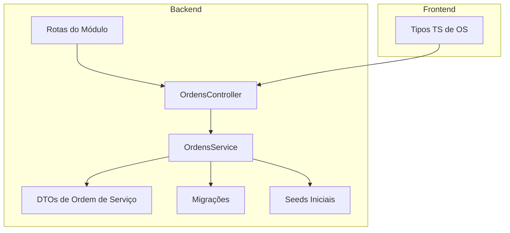
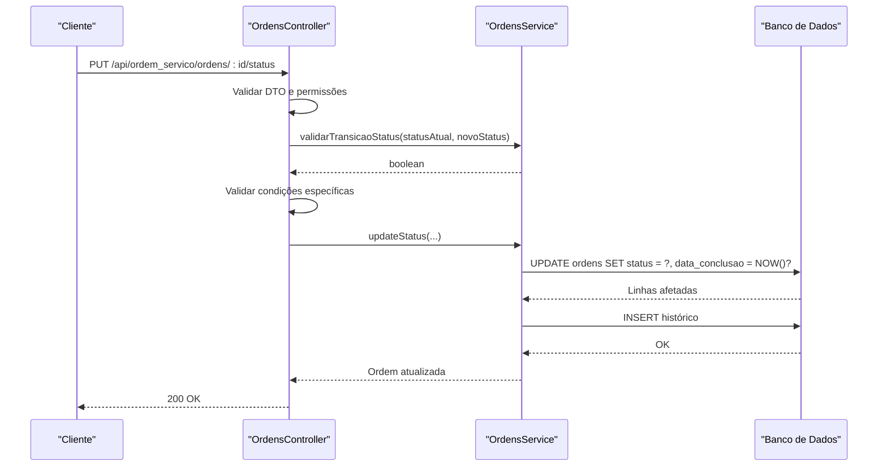
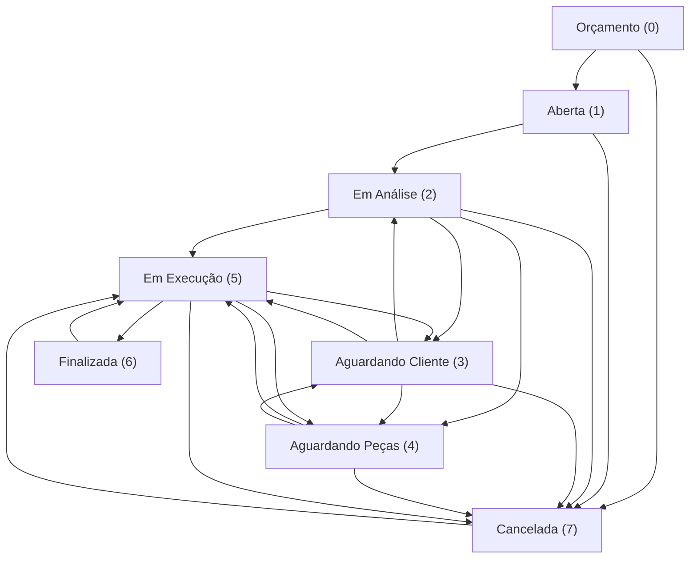
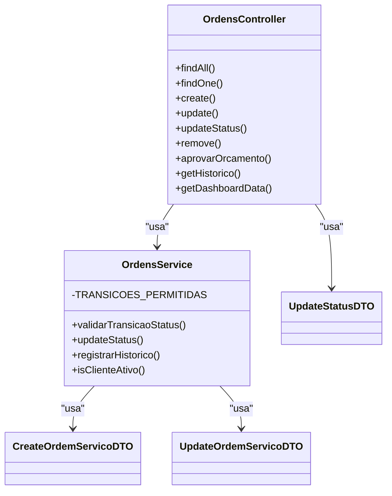

# Status e Transições de Status

<cite>
**Arquivos referenciados neste documento**
- [backend/ordens/ordens.service.ts](file://backend/ordens/ordens.service.ts)
- [backend/ordens/ordens.controller.ts](file://backend/ordens/ordens.controller.ts)
- [backend/shared/dto/ordem-servico.dto.ts](file://backend/shared/dto/ordem-servico.dto.ts)
- [frontend/types/ordem-servico.types.ts](file://frontend/types/ordem-servico.types.ts)
- [backend/migrations/004_add_tables_os.sql](file://backend/migrations/004_add_tables_os.sql)
- [backend/seeds/seeds_os.sql](file://backend/seeds/seeds_os.sql)
- [backend/routes.ts](file://backend/routes.ts)
- [backend/shared/services/permission.service.ts](file://backend/shared/services/permission.service.ts)
- [backend/configuracoes/configuracoes.service.ts](file://backend/configuracoes/configuracoes.service.ts)
</cite>

## Sumário
1. [Introdução](#introdução)
2. [Estrutura do Projeto](#estrutura-do-projeto)
3. [Componentes-Chave](#componentes-chave)
4. [Visão Geral da Arquitetura](#visão-geral-da-arquitetura)
5. [Análise Detalhada dos Status e Transições](#análise-detalhada-dos-status-e-transições)
6. [Análise de Dependências](#análise-de-dependências)
7. [Considerações de Desempenho](#considerações-de-desempenho)
8. [Guia de Solução de Problemas](#guia-de-solução-de-problemas)
9. [Conclusão](#conclusão)

## Introdução
Este documento apresenta uma análise abrangente do sistema de status e transições de ordens de serviço. Ele documenta os 8 status disponíveis, suas descrições, regras de validação para transições, dependências lógicas, condições específicas, tabelas de transição válidas, e exemplos práticos de fluxos típicos e excepcionais. Além disso, aborda validações complexas, como obrigatoriedade de campos em certos status e restrições de permissões, com foco em tornar o conteúdo acessível mesmo para leitores não técnicos.

## Estrutura do Projeto
O módulo de ordens de serviço é composto por camadas bem definidas:
- Backend (NestJS): controladores, serviços, DTOs e migrações.
- Frontend (React): tipos TypeScript e componentes de UI.
- Seeds e migrações: dados iniciais e configurações do banco de dados.

**Diagrama fonte**
- [backend/routes.ts](file://backend/routes.ts#L9-L17)
- [backend/ordens/ordens.controller.ts](file://backend/ordens/ordens.controller.ts#L25-L377)
- [backend/ordens/ordens.service.ts](file://backend/ordens/ordens.service.ts#L1-L1148)
- [backend/shared/dto/ordem-servico.dto.ts](file://backend/shared/dto/ordem-servico.dto.ts#L1-L397)
- [frontend/types/ordem-servico.types.ts](file://frontend/types/ordem-servico.types.ts#L1-L235)
- [backend/migrations/004_add_tables_os.sql](file://backend/migrations/004_add_tables_os.sql#L1-L80)
- [backend/seeds/seeds_os.sql](file://backend/seeds/seeds_os.sql#L1-L69)

**Seção fonte**
- [backend/routes.ts](file://backend/routes.ts#L9-L17)
- [backend/ordens/ordens.controller.ts](file://backend/ordens/ordens.controller.ts#L25-L377)
- [backend/ordens/ordens.service.ts](file://backend/ordens/ordens.service.ts#L1-L1148)
- [backend/shared/dto/ordem-servico.dto.ts](file://backend/shared/dto/ordem-servico.dto.ts#L1-L397)
- [frontend/types/ordem-servico.types.ts](file://frontend/types/ordem-servico.types.ts#L1-L235)
- [backend/migrations/004_add_tables_os.sql](file://backend/migrations/004_add_tables_os.sql#L1-L80)
- [backend/seeds/seeds_os.sql](file://backend/seeds/seeds_os.sql#L1-L69)

## Componentes-Chave
- DTOs de entrada e saída: validação e tipagem para criação, atualização e consulta de ordens de serviço.
- Controlador de ordens: expõe endpoints REST, aplica regras de negócio e validações de permissões.
- Serviço de ordens: implementa lógica de negócios, transições de status, geração de PDF, histórico e validações complexas.
- Tipos do frontend: mapeia os status e transições para a interface do usuário.
- Migrações e seeds: garantem a presença de campos necessários e configurações iniciais.

**Seção fonte**
- [backend/shared/dto/ordem-servico.dto.ts](file://backend/shared/dto/ordem-servico.dto.ts#L1-L397)
- [backend/ordens/ordens.controller.ts](file://backend/ordens/ordens.controller.ts#L25-L377)
- [backend/ordens/ordens.service.ts](file://backend/ordens/ordens.service.ts#L125-L991)
- [frontend/types/ordem-servico.types.ts](file://frontend/types/ordem-servico.types.ts#L87-L164)
- [backend/migrations/004_add_tables_os.sql](file://backend/migrations/004_add_tables_os.sql#L34-L44)
- [backend/seeds/seeds_os.sql](file://backend/seeds/seeds_os.sql#L7-L26)

## Visão Geral da Arquitetura
O fluxo típico de atualização de status segue esta sequência:
1. O controlador recebe a requisição e aplica validações iniciais.
2. O serviço valida a transição de status com base em regras pré-definidas.
3. São aplicadas validações específicas (ex: valor do serviço para finalização).
4. O status é atualizado e uma entrada é registrada no histórico.

**Diagrama fonte**
- [backend/ordens/ordens.controller.ts](file://backend/ordens/ordens.controller.ts#L209-L258)
- [backend/ordens/ordens.service.ts](file://backend/ordens/ordens.service.ts#L772-L829)
- [backend/ordens/ordens.service.ts](file://backend/ordens/ordens.service.ts#L1006-L1031)

**Seção fonte**
- [backend/ordens/ordens.controller.ts](file://backend/ordens/ordens.controller.ts#L209-L258)
- [backend/ordens/ordens.service.ts](file://backend/ordens/ordens.service.ts#L772-L829)
- [backend/ordens/ordens.service.ts](file://backend/ordens/ordens.service.ts#L1006-L1031)

## Análise Detalhada dos Status e Transições

### Status Disponíveis e Descrições
Os status implementados no sistema são:
- 0: Orçamento
- 1: Aberta
- 2: Em Análise
- 3: Aguardando Cliente
- 4: Aguardando Peças
- 5: Em Execução
- 6: Finalizada
- 7: Cancelada

Esses valores e rótulos são definidos tanto nos DTOs quanto nos tipos do frontend.

**Seção fonte**
- [backend/shared/dto/ordem-servico.dto.ts](file://backend/shared/dto/ordem-servico.dto.ts#L9-L18)
- [frontend/types/ordem-servico.types.ts](file://frontend/types/ordem-servico.types.ts#L88-L97)

### Tabelas de Transição Válidas
As transições permitidas são definidas como um mapa de status atual para um conjunto de status destino. No backend, o mapa é mantido como uma constante interna do serviço. No frontend, há uma definição equivalente.

**Diagrama fonte**
- [backend/ordens/ordens.service.ts](file://backend/ordens/ordens.service.ts#L125-L135)
- [frontend/types/ordem-servico.types.ts](file://frontend/types/ordem-servico.types.ts#L154-L164)

**Seção fonte**
- [backend/ordens/ordens.service.ts](file://backend/ordens/ordens.service.ts#L125-L135)
- [frontend/types/ordem-servico.types.ts](file://frontend/types/ordem-servico.types.ts#L154-L164)

### Regras de Validação para Transições
O serviço implementa uma validação centralizada de transições com base no mapa de transições permitidas. O controlador também aplica validações adicionais antes de delegar ao serviço.

- Validação centralizada:
  - O serviço verifica se o status destino pertence ao conjunto de transições permitidas a partir do status atual.
  - Retorna um booleano indicando se a transição é válida.

- Validações adicionais no controlador:
  - Cancelamento: exige um motivo obrigatório.
  - Finalização: só é permitido se o status atual for “Em Execução” e o valor do serviço estiver definido e maior que zero.
  - Edição: impede edição de ordens finalizadas ou canceladas.

**Seção fonte**
- [backend/ordens/ordens.service.ts](file://backend/ordens/ordens.service.ts#L988-L991)
- [backend/ordens/ordens.controller.ts](file://backend/ordens/ordens.controller.ts#L225-L244)
- [backend/ordens/ordens.controller.ts](file://backend/ordens/ordens.controller.ts#L197-L200)

### Exemplos de Fluxos Típicos e Excepcionais
- Fluxo típico:
  - Criação de OS com status inicial “Orçamento”.
  - Aprovação do orçamento altera o status para “Aberta”.
  - Transições: “Aberta” → “Em Análise” → “Em Execução” → “Finalizada”.

- Fluxo excepcional:
  - Durante “Em Análise”, se o cliente não responder, pode-se avançar para “Aguardando Cliente”.
  - Se peças estão faltando, pode-se avançar para “Aguardando Peças”.
  - Qualquer status pode retornar para “Em Execução” após correções.

**Seção fonte**
- [backend/ordens/ordens.service.ts](file://backend/ordens/ordens.service.ts#L557-L654)
- [backend/ordens/ordens.controller.ts](file://backend/ordens/ordens.controller.ts#L286-L308)
- [backend/ordens/ordens.service.ts](file://backend/ordens/ordens.service.ts#L125-L135)

### Validações Complexas e Condições Específicas
- Cancelamento:
  - Requer campo “motivo do cancelamento” obrigatório.
- Finalização:
  - Apenas se o status atual for “Em Execução”.
  - O campo “valor do serviço” deve estar definido e maior que zero.
- Edição:
  - Impede edição de ordens finalizadas ou canceladas.
- Criação:
  - O cliente deve estar ativo; caso contrário, a criação é bloqueada.

**Seção fonte**
- [backend/ordens/ordens.controller.ts](file://backend/ordens/ordens.controller.ts#L231-L244)
- [backend/ordens/ordens.controller.ts](file://backend/ordens/ordens.controller.ts#L197-L200)
- [backend/ordens/ordens.controller.ts](file://backend/ordens/ordens.controller.ts#L168-L172)
- [backend/ordens/ordens.service.ts](file://backend/ordens/ordens.service.ts#L687-L696)

### Histórico de Alterações
O sistema registra no histórico todas as alterações de status e campos importantes, incluindo:
- Status alterado.
- Valor do serviço alterado.
- Responsável alterado.
- Finalização e cancelamento com observações.

**Seção fonte**
- [backend/ordens/ordens.service.ts](file://backend/ordens/ordens.service.ts#L1033-L1073)
- [backend/ordens/ordens.service.ts](file://backend/ordens/ordens.service.ts#L800-L821)

### Campos Condicionais e Configurações
- Campos condicionais para formatação:
  - Sistema operacional, backup, descrição do backup, senha.
- Laudo técnico e garantia em dias.
- Configurações do módulo (ex: condições de execução) armazenadas em configurações do tenant.

**Seção fonte**
- [backend/shared/dto/ordem-servico.dto.ts](file://backend/shared/dto/ordem-servico.dto.ts#L103-L132)
- [frontend/types/ordem-servico.types.ts](file://frontend/types/ordem-servico.types.ts#L31-L36)
- [backend/migrations/004_add_tables_os.sql](file://backend/migrations/004_add_tables_os.sql#L36-L42)
- [backend/seeds/seeds_os.sql](file://backend/seeds/seeds_os.sql#L17-L21)

## Análise de Dependências
- O controlador depende do serviço para:
  - Validação de transições.
  - Aplicação de regras específicas de status.
  - Registro de histórico.
- O serviço depende do prisma para acesso ao banco de dados e utiliza:
  - Constantes de transições locais.
  - Validações de campos e condições.
- Os DTOs definem:
  - Enumerações de status e origem.
  - Tipos para criação, atualização e resposta.
- O frontend consome:
  - Tipos TS para status e transições.
  - Rótulos e cores associadas a cada status.

**Diagrama fonte**
- [backend/ordens/ordens.controller.ts](file://backend/ordens/ordens.controller.ts#L25-L377)
- [backend/ordens/ordens.service.ts](file://backend/ordens/ordens.service.ts#L125-L991)
- [backend/shared/dto/ordem-servico.dto.ts](file://backend/shared/dto/ordem-servico.dto.ts#L28-L291)

**Seção fonte**
- [backend/ordens/ordens.controller.ts](file://backend/ordens/ordens.controller.ts#L25-L377)
- [backend/ordens/ordens.service.ts](file://backend/ordens/ordens.service.ts#L125-L991)
- [backend/shared/dto/ordem-servico.dto.ts](file://backend/shared/dto/ordem-servico.dto.ts#L28-L291)

## Considerações de Desempenho
- Validações de entrada:
  - O serviço realiza validações manuais de UUIDs e sanitizações de busca para evitar injeção e melhorar desempenho.
- Consultas paginadas:
  - A paginação é controlada com limites máximos e mínimos para evitar sobrecarga.
- Geração de PDF:
  - Utiliza Puppeteer com configurações otimizadas para ambiente servidor.

**Seção fonte**
- [backend/ordens/ordens.service.ts](file://backend/ordens/ordens.service.ts#L145-L210)
- [backend/ordens/ordens.service.ts](file://backend/ordens/ordens.service.ts#L163-L167)
- [backend/ordens/ordens.service.ts](file://backend/ordens/ordens.service.ts#L18-L123)

## Guia de Solução de Problemas
- Erro: Transição de status inválida
  - Causa: Tentativa de mover de um status para outro fora do mapa de transições permitidas.
  - Solução: Verifique o status atual e utilize uma transição válida.
- Erro: Cancelamento sem motivo
  - Causa: Campo “motivo do cancelamento” obrigatório.
  - Solução: Forneça o motivo no payload.
- Erro: Finalização sem valor do serviço
  - Causa: Valor do serviço não definido ou menor ou igual a zero.
  - Solução: Defina um valor positivo antes de finalizar.
- Erro: Edição de OS finalizada ou cancelada
  - Causa: Tentativa de edição após status final.
  - Solução: Reabra a OS ou crie uma nova ordem.
- Erro: Criação com cliente inativo
  - Causa: Cliente marcado como inativo.
  - Solução: Ative o cliente ou utilize um ativo.

**Seção fonte**
- [backend/ordens/ordens.controller.ts](file://backend/ordens/ordens.controller.ts#L225-L244)
- [backend/ordens/ordens.controller.ts](file://backend/ordens/ordens.controller.ts#L197-L200)
- [backend/ordens/ordens.controller.ts](file://backend/ordens/ordens.controller.ts#L168-L172)
- [backend/ordens/ordens.service.ts](file://backend/ordens/ordens.service.ts#L687-L696)

## Conclusão
O sistema de status e transições de ordens de serviço implementa um fluxo claro e controlado, com validações rigorosas tanto no backend quanto no frontend. As transições são restritas a um conjunto bem definido, e regras específicas garantem a integridade dos dados, especialmente em momentos críticos como cancelamento e finalização. Com o histórico de alterações e as configurações do módulo, o sistema oferece rastreabilidade e personalização por tenant.