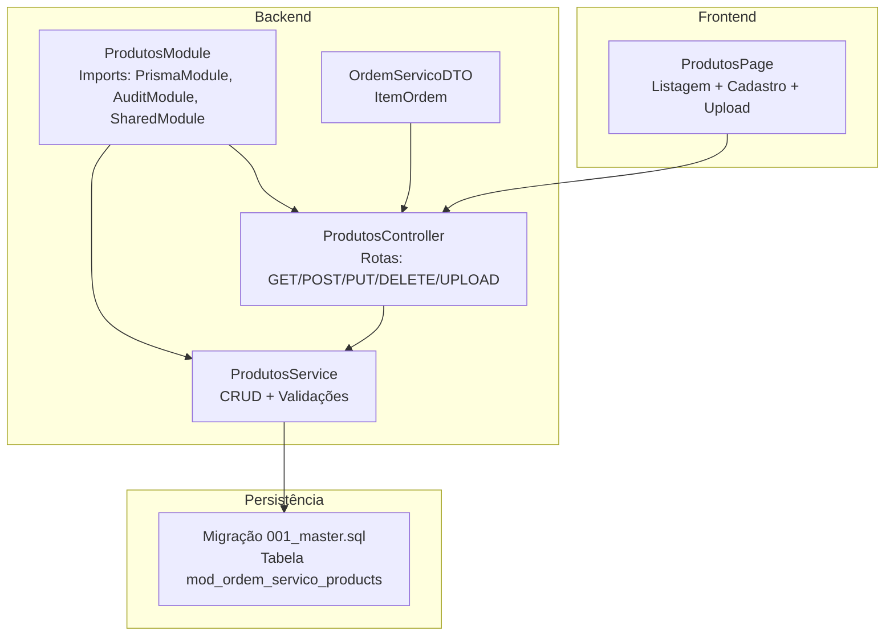
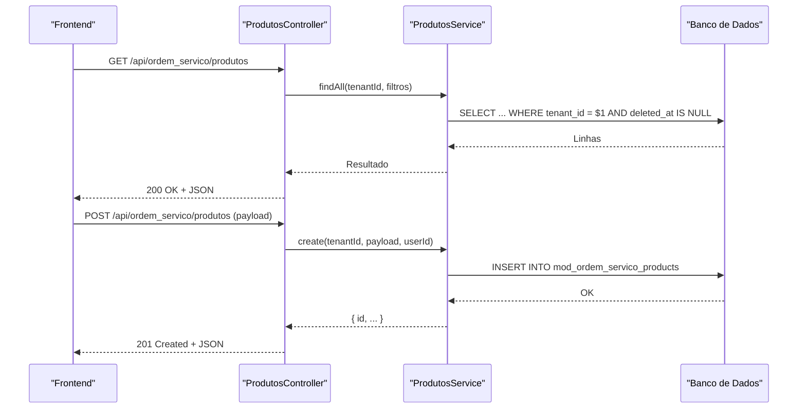
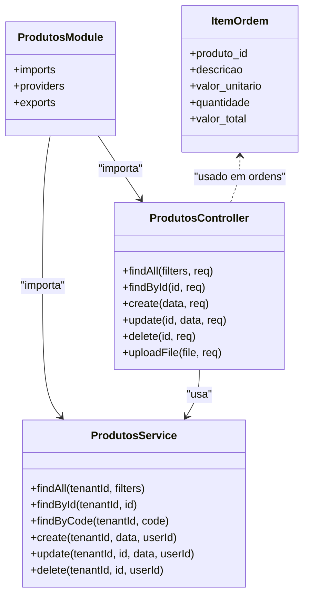
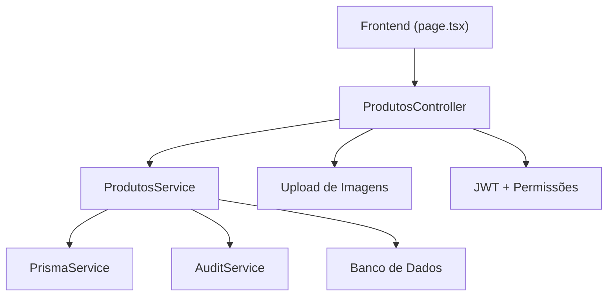

# Catálogo de Produtos

<cite>
**Arquivos Referenciados neste Documento**
- [produtos.controller.ts](file://backend/produtos/produtos.controller.ts)
- [produtos.service.ts](file://backend/produtos/produtos.service.ts)
- [produtos.module.ts](file://backend/produtos/produtos.module.ts)
- [page.tsx](file://frontend/pages/produtos/page.tsx)
- [001_master.sql](file://backend/migrations/001_master.sql)
- [004_add_tables_os.sql](file://backend/migrations/004_add_tables_os.sql)
- [ordem-servico.dto.ts](file://backend/shared/dto/ordem-servico.dto.ts)
- [ordens.controller.ts](file://backend/ordens/ordens.controller.ts)
- [ordens.service.ts](file://backend/ordens/ordens.service.ts)
</cite>

## Sumário
1. [Introdução](#introdução)
2. [Estrutura do Projeto](#estrutura-do-projeto)
3. [Componentes-Chave](#componentes-chave)
4. [Visão Geral da Arquitetura](#visão-geral-da-arquitetura)
5. [Análise Detalhada dos Componentes](#análise-detalhada-dos-componentes)
6. [Análise de Dependências](#análise-de-dependências)
7. [Considerações de Desempenho](#considerações-de-desempenho)
8. [Guia de Solução de Problemas](#guia-de-solução-de-problemas)
9. [Conclusão](#conclusão)

## Introdução
Este documento apresenta o catálogo de produtos do módulo de ordem de serviço, abrangendo a implementação completa do CRUD (criação, leitura, atualização e exclusão), validações de dados, relacionamentos com tipos de serviços e padrões de uso nas ordens de serviço. Também inclui orientações práticas sobre upload de imagens, validações de tamanho e tipo de arquivo, além de exemplos de requisições e respostas da API REST. O conteúdo foi elaborado para ser acessível a iniciantes e oferecer profundidade técnica para desenvolvedores experientes.

## Estrutura do Projeto
O módulo de produtos é composto pelos seguintes elementos principais:
- Backend: controlador, serviço e módulo de produtos
- Frontend: página de listagem e cadastro de produtos
- Migrações: definição da tabela de produtos e índices
- DTOs: definição de estruturas de dados para integração com ordens de serviço

**Diagrama fonte**
- [produtos.controller.ts](file://backend/produtos/produtos.controller.ts#L12-L61)
- [produtos.service.ts](file://backend/produtos/produtos.service.ts#L6-L15)
- [produtos.module.ts](file://backend/produtos/produtos.module.ts#L8-L13)
- [page.tsx](file://frontend/pages/produtos/page.tsx#L15-L601)
- [001_master.sql](file://backend/migrations/001_master.sql#L80-L97)
- [ordem-servico.dto.ts](file://backend/shared/dto/ordem-servico.dto.ts#L20-L26)

**Seção fonte**
- [produtos.controller.ts](file://backend/produtos/produtos.controller.ts#L12-L61)
- [produtos.service.ts](file://backend/produtos/produtos.service.ts#L6-L15)
- [produtos.module.ts](file://backend/produtos/produtos.module.ts#L8-L13)
- [page.tsx](file://frontend/pages/produtos/page.tsx#L15-L601)
- [001_master.sql](file://backend/migrations/001_master.sql#L80-L97)
- [ordem-servico.dto.ts](file://backend/shared/dto/ordem-servico.dto.ts#L20-L26)

## Componentes-Chave
- Controlador de Produtos: expõe as rotas REST para CRUD e upload de imagens, com proteção por autenticação e permissões.
- Serviço de Produtos: implementa regras de negócio, validações e persistência em banco de dados.
- Módulo de Produtos: configura dependências e exporta o serviço.
- Frontend de Produtos: interface de usuário para listagem, cadastro, edição, exclusão e upload de imagens.
- Migração de Produtos: estrutura da tabela e índices.
- DTO de Itens de Ordem: estrutura de itens usada nas ordens de serviço.

**Seção fonte**
- [produtos.controller.ts](file://backend/produtos/produtos.controller.ts#L12-L61)
- [produtos.service.ts](file://backend/produtos/produtos.service.ts#L17-L168)
- [produtos.module.ts](file://backend/produtos/produtos.module.ts#L8-L13)
- [page.tsx](file://frontend/pages/produtos/page.tsx#L15-L601)
- [001_master.sql](file://backend/migrations/001_master.sql#L80-L97)
- [ordem-servico.dto.ts](file://backend/shared/dto/ordem-servico.dto.ts#L20-L26)

## Visão Geral da Arquitetura
O fluxo típico de uma operação CRUD segue:
- Frontend envia requisição HTTP para o controlador de produtos
- Controlador aplica autenticação, permissões e interceptores (upload)
- Serviço realiza validações e persistência
- Auditoria registra a ação
- Resposta é retornada ao frontend

**Diagrama fonte**
- [produtos.controller.ts](file://backend/produtos/produtos.controller.ts#L20-L61)
- [produtos.service.ts](file://backend/produtos/produtos.service.ts#L17-L101)
- [001_master.sql](file://backend/migrations/001_master.sql#L80-L97)

**Seção fonte**
- [produtos.controller.ts](file://backend/produtos/produtos.controller.ts#L20-L61)
- [produtos.service.ts](file://backend/produtos/produtos.service.ts#L17-L101)
- [001_master.sql](file://backend/migrations/001_master.sql#L80-L97)

## Análise Detalhada dos Componentes

### Controlador de Produtos
- Rotas:
  - GET /api/ordem_servico/produtos: lista produtos com filtros de busca e status
  - GET /api/ordem_servico/produtos/:id: busca produto por ID
  - POST /api/ordem_servico/produtos: cria novo produto
  - PUT /api/ordem_servico/produtos/:id: atualiza produto
  - DELETE /api/ordem_servico/produtos/:id: marca produto como excluído
  - POST /api/ordem_servico/produtos/upload: upload de imagem com validações de tipo e tamanho
- Segurança:
  - Autenticação JWT e permissões específicas para cada rota
  - Upload permite acesso público temporário para o endpoint específico
- Upload de Imagens:
  - Valida tipo MIME (jpeg, png, webp, gif)
  - Limite de tamanho de 5MB
  - Processamento robusto de buffers (JSON Buffer, array-like object, fallback para path)
  - Armazenamento em uploads/produtos/{tenantId}/ com nome único

**Seção fonte**
- [produtos.controller.ts](file://backend/produtos/produtos.controller.ts#L20-L143)

### Serviço de Produtos
- Operações:
  - findAll: consulta com filtros de busca textual e status, ordenação alfabética
  - findById: busca por ID
  - findByCode: busca por código único
  - create: validações obrigatórias (código, nome, preço), unicidade de código, inserção com campos padrão
  - update: validações semelhantes, verificação de unicidade quando código muda, atualização com timestamps
  - delete: soft delete com campo deleted_at
- Auditoria:
  - Registros de ações CREATE_PRODUCT, UPDATE_PRODUCT, DELETE_PRODUCT

**Seção fonte**
- [produtos.service.ts](file://backend/produtos/produtos.service.ts#L17-L168)

### Módulo de Produtos
- Imports: PrismaModule, AuditModule, SharedModule
- Providers: ProdutosService
- Exports: ProdutosService

**Seção fonte**
- [produtos.module.ts](file://backend/produtos/produtos.module.ts#L8-L13)

### Frontend de Produtos
- Funcionalidades:
  - Listagem com busca e filtros (status e tipo)
  - Cadastro/edição com campos: código, nome, preço, custo, margem, descrição, tipo (Produto/Serviço), imagem, ativo
  - Upload de imagem via endpoint específico
  - Exclusão com confirmação
- Validações:
  - Formatação monetária e cálculo de preço com base em custo e margem
  - Validação de preço antes de salvar

**Seção fonte**
- [page.tsx](file://frontend/pages/produtos/page.tsx#L15-L601)

### Migração de Produtos
- Tabela: mod_ordem_servico_products
- Campos: id, tenant_id, code, name, type, price, cost_price, description, image_url, is_active, created_at, updated_at, deleted_at
- Índices: tenant_id, code, name, unique(code, tenant_id) onde deleted_at IS NULL

**Seção fonte**
- [001_master.sql](file://backend/migrations/001_master.sql#L80-L97)

### Relacionamento com Ordens de Serviço
- DTO ItemOrdem define campos usados nas ordens: produto_id, descrição, valor_unitario, quantidade, valor_total
- No frontend de ordens, há estados e lógica para adicionar itens com base no catálogo de produtos
- A estrutura permite vincular produtos/serviços às ordens durante a criação ou edição

**Seção fonte**
- [ordem-servico.dto.ts](file://backend/shared/dto/ordem-servico.dto.ts#L20-L26)
- [page.tsx](file://frontend/pages/ordens/edit/page.tsx#L79-L86)

## Visão Geral da Arquitetura

**Diagrama fonte**
- [produtos.controller.ts](file://backend/produtos/produtos.controller.ts#L12-L61)
- [produtos.service.ts](file://backend/produtos/produtos.service.ts#L6-L15)
- [produtos.module.ts](file://backend/produtos/produtos.module.ts#L8-L13)
- [ordem-servico.dto.ts](file://backend/shared/dto/ordem-servico.dto.ts#L20-L26)

## Análise Detalhada dos Componentes

### CRUD de Produtos

#### Consulta
- Endpoint: GET /api/ordem_servico/produtos
- Filtros:
  - search: busca textual em name e code
  - status: ativo/inativo
- Ordenação: alfabética por name

**Seção fonte**
- [produtos.controller.ts](file://backend/produtos/produtos.controller.ts#L20-L26)
- [produtos.service.ts](file://backend/produtos/produtos.service.ts#L17-L40)

#### Criação
- Endpoint: POST /api/ordem_servico/produtos
- Campos obrigatórios: code, name, price
- Validação: unicidade de code por tenant
- Persistência: insere registro com campos padrão (type, is_active, timestamps)

Exemplo de requisição (resumo):
- Método: POST
- URL: /api/ordem_servico/produtos
- Cabeçalhos: Authorization: Bearer <token>, Content-Type: application/json
- Corpo: { code, name, price, cost_price, description, type, image_url, is_active }

Exemplo de resposta:
- Status: 201 Created
- Corpo: { id, code, name, price, ... }

**Seção fonte**
- [produtos.controller.ts](file://backend/produtos/produtos.controller.ts#L36-L43)
- [produtos.service.ts](file://backend/produtos/produtos.service.ts#L58-L101)

#### Edição
- Endpoint: PUT /api/ordem_servico/produtos/:id
- Validações: campos obrigatórios e unicidade de code (se alterado)
- Persistência: atualiza todos os campos com updated_at

Exemplo de requisição (resumo):
- Método: PUT
- URL: /api/ordem_servico/produtos/:id
- Cabeçalhos: Authorization: Bearer <token>, Content-Type: application/json
- Corpo: { code, name, price, cost_price, description, type, image_url, is_active }

Exemplo de resposta:
- Status: 200 OK
- Corpo: { id, ... }

**Seção fonte**
- [produtos.controller.ts](file://backend/produtos/produtos.controller.ts#L45-L52)
- [produtos.service.ts](file://backend/produtos/produtos.service.ts#L103-L152)

#### Exclusão
- Endpoint: DELETE /api/ordem_servico/produtos/:id
- Comportamento: soft delete (deleted_at)

Exemplo de requisição (resumo):
- Método: DELETE
- URL: /api/ordem_servico/produtos/:id
- Cabeçalhos: Authorization: Bearer <token>

Exemplo de resposta:
- Status: 200 OK
- Corpo: { success: true }

**Seção fonte**
- [produtos.controller.ts](file://backend/produtos/produtos.controller.ts#L54-L61)
- [produtos.service.ts](file://backend/produtos/produtos.service.ts#L154-L168)

### Upload de Imagens
- Endpoint: POST /api/ordem_servico/produtos/upload
- Formato esperado: multipart/form-data com campo file
- Validações:
  - Tipos MIME permitidos: image/jpeg, image/png, image/webp, image/gif
  - Tamanho máximo: 5MB
  - Buffer: aceita JSON Buffer, array-like object, fallback para path
- Armazenamento: uploads/produtos/{tenantId}/ com nome único

Exemplo de requisição (resumo):
- Método: POST
- URL: /api/ordem_servico/produtos/upload
- Cabeçalhos: Authorization: Bearer <token>, Content-Type: multipart/form-data
- Corpo: file=<arquivo>

Exemplo de resposta:
- Status: 200 OK
- Corpo: { url: "/uploads/produtos/{tenantId}/{nome-único}" }

**Seção fonte**
- [produtos.controller.ts](file://backend/produtos/produtos.controller.ts#L63-L143)

### Validações de Dados
- Backend:
  - Campos obrigatórios: name, code, price
  - Unicidade de code por tenant
  - Filtros de busca e status
- Frontend:
  - Formatação monetária e cálculo de preço com base em custo e margem
  - Validação de preço antes de salvar

**Seção fonte**
- [produtos.service.ts](file://backend/produtos/produtos.service.ts#L58-L68)
- [page.tsx](file://frontend/pages/produtos/page.tsx#L109-L152)

### Relacionamentos com Tipos de Serviço
- O campo type permite distinguir entre "Produto" e "Serviço"
- Na interface, há um switch para alternar entre os dois tipos
- Este campo influencia a apresentação e o tratamento em outras partes do sistema

**Seção fonte**
- [page.tsx](file://frontend/pages/produtos/page.tsx#L420-L425)
- [001_master.sql](file://backend/migrations/001_master.sql#L85-L85)

### Uso nas Ordens de Serviço
- DTO ItemOrdem contém produto_id, descrição, valor_unitario, quantidade e valor_total
- No frontend de ordens, há lógica para adicionar itens com base no catálogo de produtos
- Isso permite vincular produtos/serviços às ordens durante a criação ou edição

**Seção fonte**
- [ordem-servico.dto.ts](file://backend/shared/dto/ordem-servico.dto.ts#L20-L26)
- [page.tsx](file://frontend/pages/ordens/edit/page.tsx#L79-L86)

## Análise de Dependências

**Diagrama fonte**
- [produtos.controller.ts](file://backend/produtos/produtos.controller.ts#L1-L10)
- [produtos.service.ts](file://backend/produtos/produtos.service.ts#L1-L15)
- [page.tsx](file://frontend/pages/produtos/page.tsx#L12-L13)

**Seção fonte**
- [produtos.controller.ts](file://backend/produtos/produtos.controller.ts#L1-L10)
- [produtos.service.ts](file://backend/produtos/produtos.service.ts#L1-L15)
- [page.tsx](file://frontend/pages/produtos/page.tsx#L12-L13)

## Considerações de Desempenho
- Índices:
  - Índices em tenant_id, code, name e unique(code, tenant_id) ajudam consultas e integridade
- Consultas:
  - Filtros de busca e status são aplicados com LIKE e comparação direta
- Upload:
  - Leitura de buffer com fallback para path evita falhas em diferentes ambientes

**Seção fonte**
- [001_master.sql](file://backend/migrations/001_master.sql#L343-L349)
- [produtos.service.ts](file://backend/produtos/produtos.service.ts#L17-L40)
- [produtos.controller.ts](file://backend/produtos/produtos.controller.ts#L108-L112)

## Guia de Solução de Problemas

### Erros Comuns no Upload de Imagens
- Nenhum arquivo enviado: erro 400
- Tipo de arquivo não permitido: erro 400
- Arquivo muito grande (> 5MB): erro 400
- Falha crítica no buffer: erro 500

Sugestões:
- Verifique o tipo MIME e tamanho do arquivo
- Confirme que o frontend envia multipart/form-data
- Revise logs do servidor para diagnóstico

**Seção fonte**
- [produtos.controller.ts](file://backend/produtos/produtos.controller.ts#L68-L82)
- [produtos.controller.ts](file://backend/produtos/produtos.controller.ts#L115-L117)
- [produtos.controller.ts](file://backend/produtos/produtos.controller.ts#L139-L142)

### Erros de Validação no CRUD
- Código, Nome e Preço obrigatórios: erro 500 com mensagem específica
- Código já em uso: erro 500 com mensagem informando duplicidade

Sugestões:
- Garanta que campos obrigatórios estejam presentes
- Evite duplicidade de código dentro do mesmo tenant

**Seção fonte**
- [produtos.service.ts](file://backend/produtos/produtos.service.ts#L60-L62)
- [produtos.service.ts](file://backend/produtos/produtos.service.ts#L66-L68)

### Erros de Permissão
- Acesso negado: verifique se o usuário possui permissão adequada (create/edit/delete/view/upload_images)

**Seção fonte**
- [produtos.controller.ts](file://backend/produtos/produtos.controller.ts#L21-L22)
- [produtos.controller.ts](file://backend/produtos/produtos.controller.ts#L37-L38)
- [produtos.controller.ts](file://backend/produtos/produtos.controller.ts#L46-L47)
- [produtos.controller.ts](file://backend/produtos/produtos.controller.ts#L55-L56)
- [produtos.controller.ts](file://backend/produtos/produtos.controller.ts#L64-L65)

## Conclusão
O catálogo de produtos foi implementado com foco em segurança, validações rigorosas e integração com o restante do módulo de ordem de serviço. As rotas REST oferecem um comportamento previsível e as validações de upload garantem qualidade e integridade dos recursos. A estrutura modular facilita manutenção e expansão, enquanto os DTOs e migrações asseguram consistência de dados.