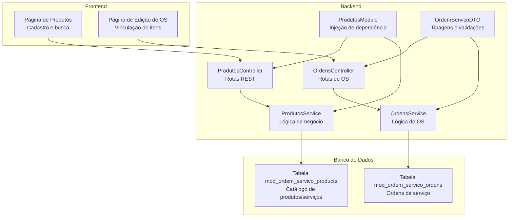
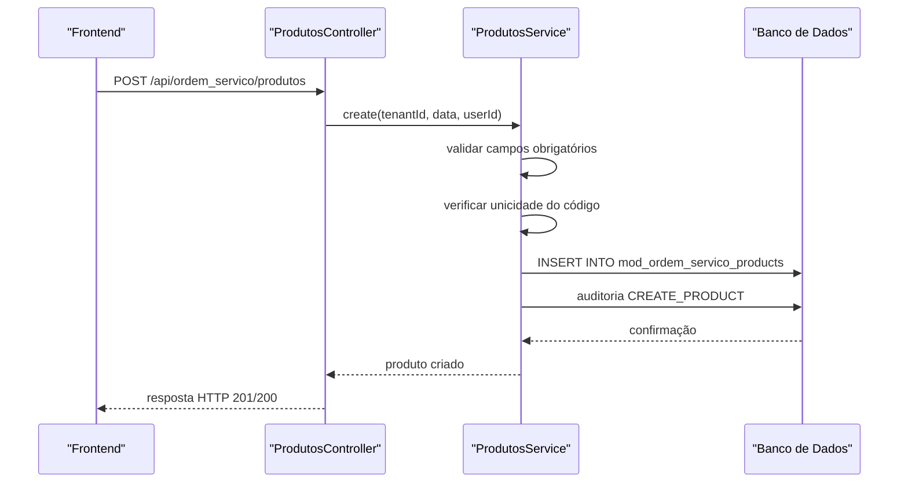
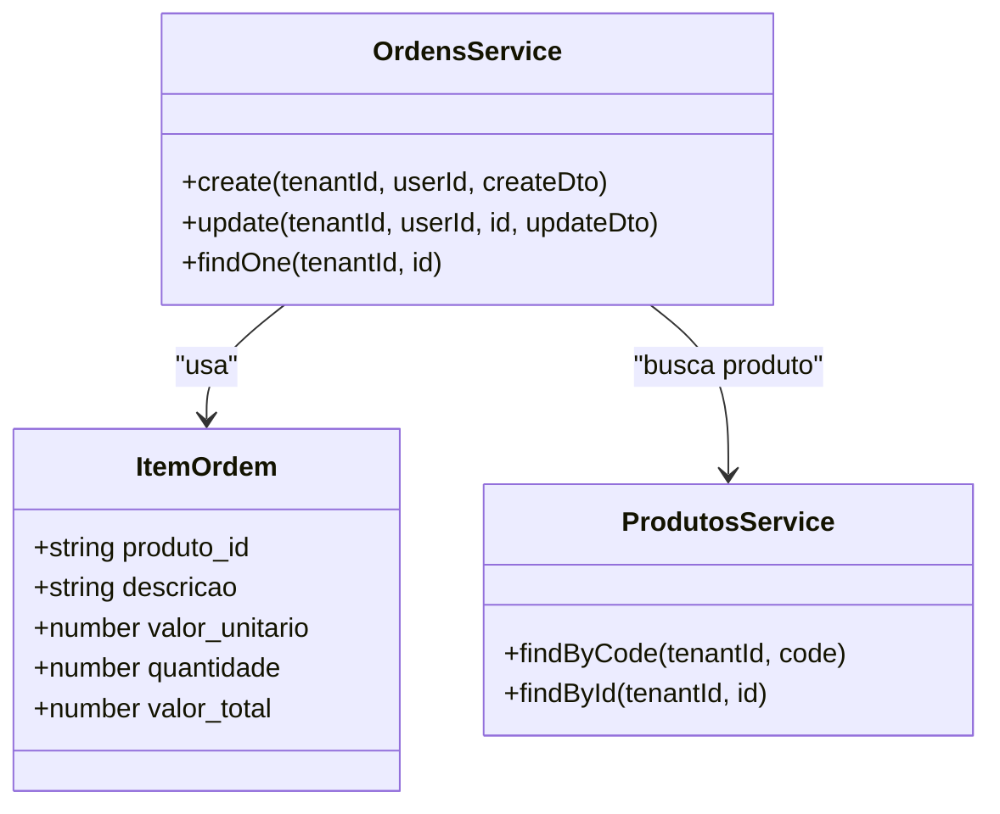
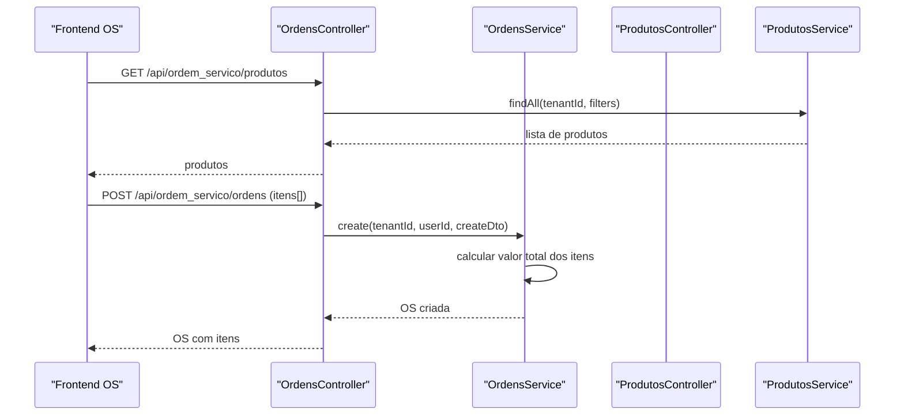
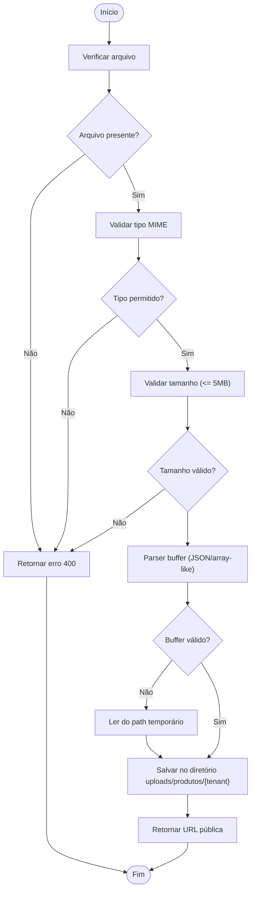

# Módulo de Produtos e Serviços

<cite>
**Arquivos referenciados neste documento**
- [produtos.controller.ts](file://backend/produtos/produtos.controller.ts)
- [produtos.service.ts](file://backend/produtos/produtos.service.ts)
- [produtos.module.ts](file://backend/produtos/produtos.module.ts)
- [ordens.controller.ts](file://backend/ordens/ordens.controller.ts)
- [ordens.service.ts](file://backend/ordens/ordens.service.ts)
- [ordem-servico.dto.ts](file://backend/shared/dto/ordem-servico.dto.ts)
- [001_master.sql](file://backend/migrations/001_master.sql)
- [004_add_tables_os.sql](file://backend/migrations/004_add_tables_os.sql)
- [page.tsx (produtos)](file://frontend/pages/produtos/page.tsx)
- [page.tsx (ordens edit)](file://frontend/pages/ordens/edit/page.tsx)
</cite>

## Sumário
1. [Introdução](#introdução)
2. [Estrutura do Projeto](#estrutura-do-projeto)
3. [Componentes-Chave](#componentes-chave)
4. [Visão Geral da Arquitetura](#visão-geral-da-arquitetura)
5. [Análise Detalhada dos Componentes](#análise-detalhada-dos-componentes)
6. [Relacionamento com Ordens de Serviço](#relacionamento-com-ordens-de-serviço)
7. [Considerações de Desempenho](#considerações-de-desempenho)
8. [Guia de Solução de Problemas](#guia-de-solução-de-problemas)
9. [Conclusão](#conclusão)

## Introdução
O módulo de Produtos e Serviços oferece um catálogo completo de itens comercializados, com suporte a produtos físicos e serviços, controle de estoque, preços, imagens e integração direta com Ordens de Serviço. Ele permite que os usuários cadastrem, editem, visualizem e removam itens, além de vinculá-los como itens em ordens de serviço, calculando automaticamente valores totais e gerando relatórios.

## Estrutura do Projeto
O módulo é composto pelos seguintes elementos principais:
- Backend: Controladores, serviços e módulos NestJS para gerenciar o catálogo de produtos e serviços.
- Frontend: Interfaces para cadastro, edição, busca e upload de imagens.
- Migrações: Definição da estrutura de dados do catálogo e relacionamentos com Ordens de Serviço.
- DTOs: Tipagens e validações para comunicação entre frontend e backend.

**Diagrama fonte**
- [produtos.controller.ts](file://backend/produtos/produtos.controller.ts#L12-L61)
- [produtos.service.ts](file://backend/produtos/produtos.service.ts#L1-L169)
- [produtos.module.ts](file://backend/produtos/produtos.module.ts#L8-L13)
- [ordens.controller.ts](file://backend/ordens/ordens.controller.ts#L25-L377)
- [ordens.service.ts](file://backend/ordens/ordens.service.ts#L1-L1148)
- [ordem-servico.dto.ts](file://backend/shared/dto/ordem-servico.dto.ts#L20-L26)
- [001_master.sql](file://backend/migrations/001_master.sql#L80-L94)

**Seção fonte**
- [produtos.controller.ts](file://backend/produtos/produtos.controller.ts#L12-L61)
- [produtos.service.ts](file://backend/produtos/produtos.service.ts#L1-L169)
- [produtos.module.ts](file://backend/produtos/produtos.module.ts#L8-L13)
- [ordens.controller.ts](file://backend/ordens/ordens.controller.ts#L25-L377)
- [ordens.service.ts](file://backend/ordens/ordens.service.ts#L1-L1148)
- [ordem-servico.dto.ts](file://backend/shared/dto/ordem-servico.dto.ts#L20-L26)
- [001_master.sql](file://backend/migrations/001_master.sql#L80-L94)

## Componentes-Chave
- ProdutosController: Expõe endpoints REST para CRUD de produtos e upload de imagens, com autenticação e permissões.
- ProdutosService: Implementa regras de negócio, validações e persistência no banco de dados.
- OrdensController e OrdensService: Gerenciam Ordens de Serviço, incluindo criação, atualização, status e geração de PDF.
- DTOs: Define ItemOrdem com campos produto_id, descrição, preço unitário, quantidade e valor total.
- Frontend: Interfaces para cadastro de produtos e inclusão de itens em ordens de serviço.

**Seção fonte**
- [produtos.controller.ts](file://backend/produtos/produtos.controller.ts#L12-L61)
- [produtos.service.ts](file://backend/produtos/produtos.service.ts#L58-L101)
- [ordens.controller.ts](file://backend/ordens/ordens.controller.ts#L159-L179)
- [ordens.service.ts](file://backend/ordens/ordens.service.ts#L557-L654)
- [ordem-servico.dto.ts](file://backend/shared/dto/ordem-servico.dto.ts#L20-L26)
- [page.tsx (produtos)](file://frontend/pages/produtos/page.tsx#L15-L69)
- [page.tsx (ordens edit)](file://frontend/pages/ordens/edit/page.tsx#L263-L275)

## Visão Geral da Arquitetura
O fluxo básico de cadastro de produtos segue:
- Frontend envia requisição HTTP para o backend.
- Controlador recebe e valida dados.
- Serviço aplica regras de negócio e persistência.
- Auditoria registra a ação.
- Resposta é retornada ao frontend.

**Diagrama fonte**
- [produtos.controller.ts](file://backend/produtos/produtos.controller.ts#L36-L43)
- [produtos.service.ts](file://backend/produtos/produtos.service.ts#L58-L101)

**Seção fonte**
- [produtos.controller.ts](file://backend/produtos/produtos.controller.ts#L36-L43)
- [produtos.service.ts](file://backend/produtos/produtos.service.ts#L58-L101)

## Análise Detalhada dos Componentes

### ProdutosController
- Endpoints:
  - GET /api/ordem_servico/produtos: Listagem com filtros de busca e status.
  - GET /api/ordem_servico/produtos/:id: Detalhe por ID.
  - POST /api/ordem_servico/produtos: Criação de produto.
  - PUT /api/ordem_servico/produtos/:id: Atualização de produto.
  - DELETE /api/ordem_servico/produtos/:id: Exclusão lógica.
  - POST /api/ordem_servico/produtos/upload: Upload de imagem com validações de tipo e tamanho.
- Segurança:
  - Autenticação JWT e permissões específicas para cada operação.
  - Upload de imagem público apenas para o endpoint de upload de produtos.

**Seção fonte**
- [produtos.controller.ts](file://backend/produtos/produtos.controller.ts#L20-L61)
- [produtos.controller.ts](file://backend/produtos/produtos.controller.ts#L63-L143)

### ProdutosService
- Operações:
  - findAll: Consulta paginada com busca textual e filtro de status.
  - findById e findByCode: Recupera registros únicos.
  - create: Valida campos obrigatórios, unicidade de código e insere no banco.
  - update: Valida campos, unicidade de código quando alterado e atualiza.
  - delete: Marca como excluído logicamente.
- Persistência:
  - Utiliza consultas SQL brutas com parâmetros nomeados.
  - Registra auditoria para cada operação.

**Seção fonte**
- [produtos.service.ts](file://backend/produtos/produtos.service.ts#L17-L40)
- [produtos.service.ts](file://backend/produtos/produtos.service.ts#L42-L56)
- [produtos.service.ts](file://backend/produtos/produtos.service.ts#L58-L101)
- [produtos.service.ts](file://backend/produtos/produtos.service.ts#L103-L152)
- [produtos.service.ts](file://backend/produtos/produtos.service.ts#L154-L168)

### ProdutosModule
- Configura injeção de dependência:
  - PrismaModule, AuditModule e SharedModule.
  - Exporta ProdutosService para uso em outros módulos.

**Seção fonte**
- [produtos.module.ts](file://backend/produtos/produtos.module.ts#L8-L13)

### Frontend: Catálogo de Produtos
- Funcionalidades:
  - Listagem com busca e filtros de status e tipo.
  - Cadastro e edição de produtos com campos: código, nome, preço, custo, margem, descrição, tipo, imagem e status.
  - Upload de imagem e prévia.
  - Validações de formato monetário e geração de código aleatório.

**Seção fonte**
- [page.tsx (produtos)](file://frontend/pages/produtos/page.tsx#L15-L69)
- [page.tsx (produtos)](file://frontend/pages/produtos/page.tsx#L175-L211)
- [page.tsx (produtos)](file://frontend/pages/produtos/page.tsx#L154-L173)

## Relacionamento com Ordens de Serviço
Os produtos/serviços são utilizados como itens nas Ordens de Serviço através de um array de ItemOrdem. Cada item pode:
- Referenciar um produto existente (produto_id) ou ser um item customizado (sem produto_id).
- Ter campos como descrição, quantidade, valor unitário e valor total calculado automaticamente.
- Ser incluído durante a criação ou edição de uma OS.

**Diagrama fonte**
- [ordem-servico.dto.ts](file://backend/shared/dto/ordem-servico.dto.ts#L20-L26)
- [ordens.service.ts](file://backend/ordens/ordens.service.ts#L557-L654)
- [produtos.service.ts](file://backend/produtos/produtos.service.ts#L50-L56)

### Fluxo de Inclusão de Itens em OS

**Diagrama fonte**
- [page.tsx (ordens edit)](file://frontend/pages/ordens/edit/page.tsx#L263-L275)
- [ordens.controller.ts](file://backend/ordens/ordens.controller.ts#L159-L179)
- [ordens.service.ts](file://backend/ordens/ordens.service.ts#L557-L654)
- [produtos.controller.ts](file://backend/produtos/produtos.controller.ts#L20-L26)
- [produtos.service.ts](file://backend/produtos/produtos.service.ts#L17-L40)

**Seção fonte**
- [page.tsx (ordens edit)](file://frontend/pages/ordens/edit/page.tsx#L263-L275)
- [ordens.controller.ts](file://backend/ordens/ordens.controller.ts#L159-L179)
- [ordens.service.ts](file://backend/ordens/ordens.service.ts#L557-L654)
- [produtos.controller.ts](file://backend/produtos/produtos.controller.ts#L20-L26)
- [produtos.service.ts](file://backend/produtos/produtos.service.ts#L17-L40)

## Considerações de Desempenho
- Consultas SQL com parâmetros nomeados evitam injeção e permitem uso de índices.
- Índices criados:
  - Tabela mod_ordem_servico_products: tenant_id, code, name e índice único (tenant_id, code) onde deleted_at IS NULL.
- Recomendações:
  - Utilizar paginação e filtros no frontend para reduzir o volume de dados.
  - Armazenar imagens em sistemas de armazenamento otimizados (CDN) para melhorar tempo de carregamento.
  - Evitar uploads de arquivos grandes; manter limites de tamanho e tipo.

**Seção fonte**
- [001_master.sql](file://backend/migrations/001_master.sql#L343-L349)

## Guia de Solução de Problemas

### Erros Comuns e Soluções
- Código de produto duplicado:
  - Ocorrência: Tentativa de criar/atualizar um produto com código já existente.
  - Solução: Altere o código ou utilize um gerador automático.
  - Fonte: [produtos.service.ts](file://backend/produtos/produtos.service.ts#L65-L68)

- Validação de campos obrigatórios:
  - Ocorrência: Falta de campos como nome, código ou preço.
  - Solução: Preencher todos os campos obrigatórios antes de salvar.
  - Fonte: [produtos.service.ts](file://backend/produtos/produtos.service.ts#L60-L62)

- Upload de imagem inválido:
  - Ocorrência: Arquivo com tipo não permitido, tamanho maior que 5MB ou buffer inválido.
  - Solução: Verificar tipo (JPEG, PNG, WebP, GIF), tamanho e formato.
  - Fonte: [produtos.controller.ts](file://backend/produtos/produtos.controller.ts#L73-L82)

- Erro ao buscar produtos no frontend:
  - Ocorrência: Falha na requisição GET /api/ordem_servico/produtos.
  - Solução: Verificar autenticação, permissões e rede.
  - Fonte: [page.tsx (produtos)](file://frontend/pages/produtos/page.tsx#L51-L70)

- Erro ao incluir item em OS:
  - Ocorrência: Validação de campos obrigatórios do item (descrição, quantidade, valor unitário).
  - Solução: Preencher todos os campos antes de adicionar.
  - Fonte: [page.tsx (ordens edit)](file://frontend/pages/ordens/edit/page.tsx#L277-L285)

### Fluxo de Validação de Upload de Imagem

**Diagrama fonte**
- [produtos.controller.ts](file://backend/produtos/produtos.controller.ts#L63-L143)

**Seção fonte**
- [produtos.controller.ts](file://backend/produtos/produtos.controller.ts#L63-L143)

## Conclusão
O módulo de Produtos e Serviços fornece uma solução robusta para gerenciar catálogos de itens e integrá-los às Ordens de Serviço. Com validações rigorosas, segurança por permissões, persistência eficiente e integração frontend-backend, ele atende tanto a necessidades de iniciantes quanto a requisitos avançados de desenvolvimento. A utilização de DTOs, SQL bruto com parâmetros e índices otimizados garante desempenho e manutenibilidade.