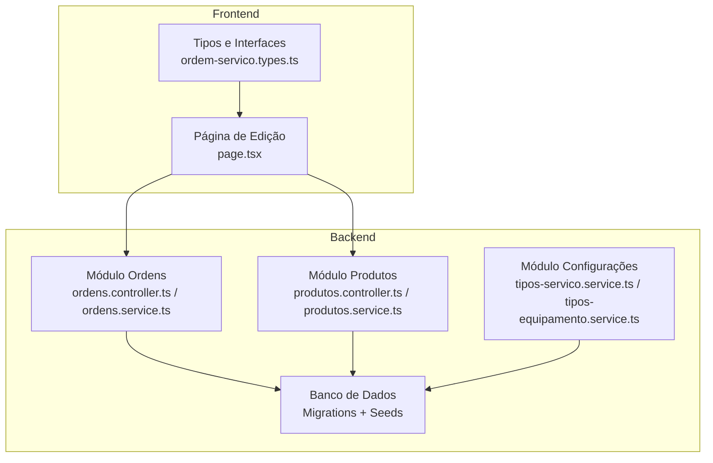
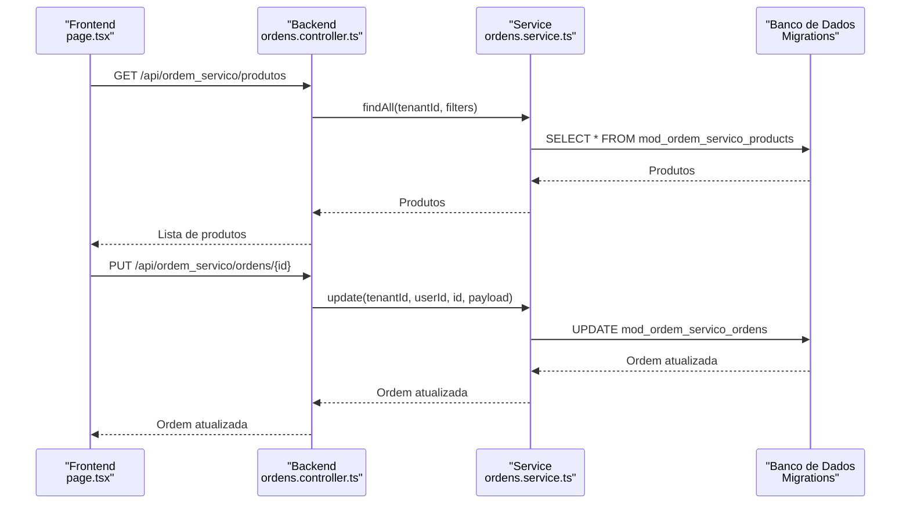
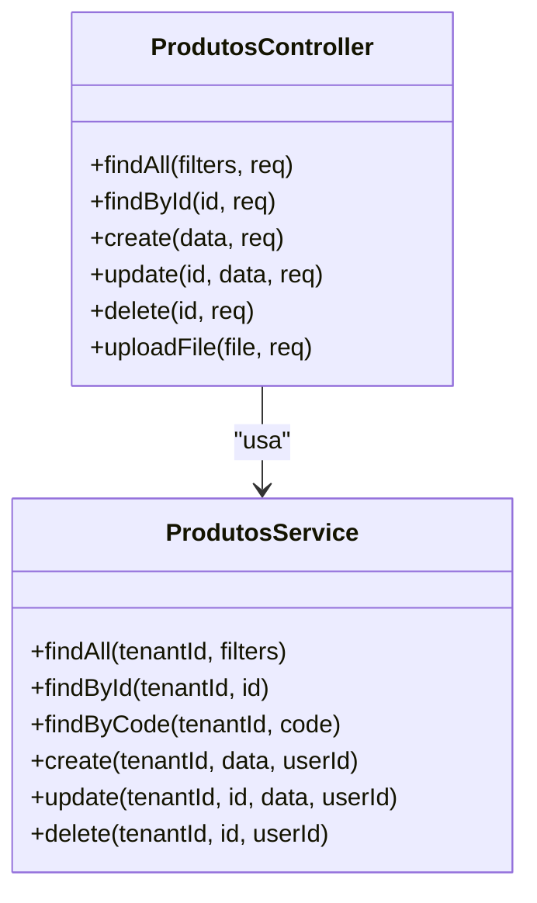
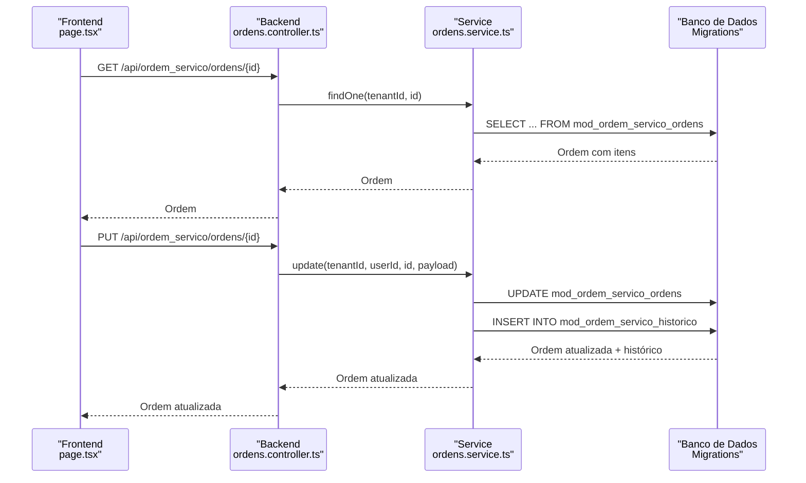
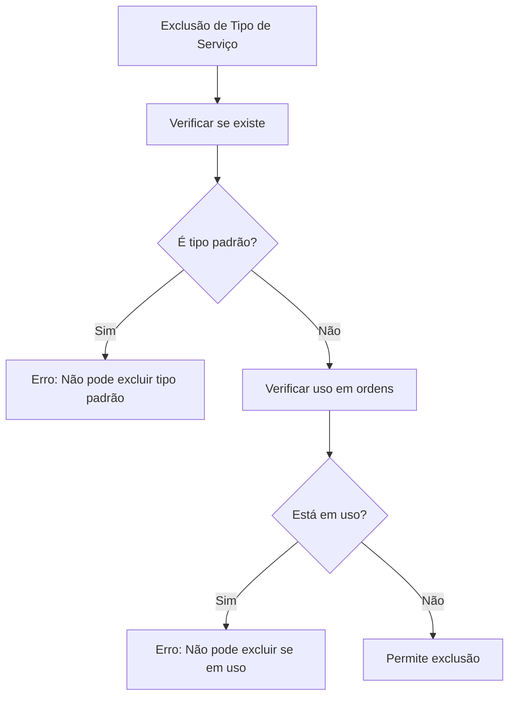
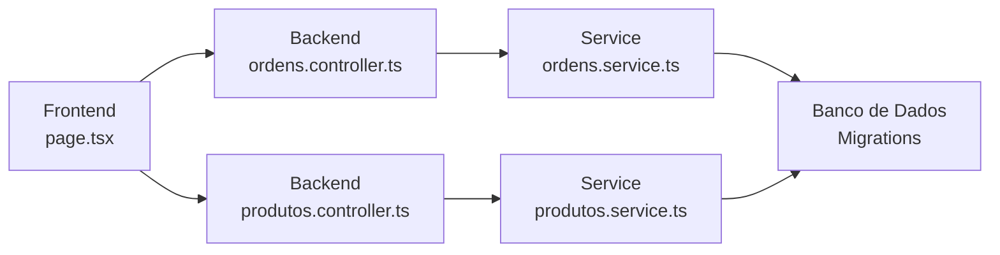

# Relacionamentos e Integrações

<cite>
**Arquivos Referenciados neste Documento**
- [produtos.controller.ts](file://backend/produtos/produtos.controller.ts)
- [produtos.service.ts](file://backend/produtos/produtos.service.ts)
- [ordens.controller.ts](file://backend/ordens/ordens.controller.ts)
- [ordens.service.ts](file://backend/ordens/ordens.service.ts)
- [tipos-servico.service.ts](file://backend/configuracoes/tipos-servico.service.ts)
- [tipos-equipamento.service.ts](file://backend/configuracoes/tipos-equipamento.service.ts)
- [ordem-servico.dto.ts](file://backend/shared/dto/ordem-servico.dto.ts)
- [001_master.sql](file://backend/migrations/001_master.sql)
- [004_add_tables_os.sql](file://backend/migrations/004_add_tables_os.sql)
- [page.tsx](file://frontend/pages/ordens/edit/page.tsx)
- [ordem-servico.types.ts](file://frontend/types/ordem-servico.types.ts)
- [seeds_os.sql](file://backend/seeds/seeds_os.sql)
</cite>

## Sumário
- Introdução
- Estrutura do Projeto
- Componentes-Chave
- Visão Geral da Arquitetura
- Análise Detalhada dos Componentes
- Dependências e Integrações
- Considerações de Desempenho
- Guia de Solução de Problemas
- Conclusão

## Introdução
Este documento explora os relacionamentos entre produtos/serviços e outras partes do sistema de Ordens de Serviço. Ele detalha como produtos e serviços são integrados às ordens, incluindo histórico de preços e quantidades, padrões de uso e relacionamentos complexos. Também aborda como os dados fluem entre módulos, integridade referencial e validações cruzadas, tornando o conteúdo acessível para iniciantes e profundo o suficiente para desenvolvedores experientes.

## Estrutura do Projeto
O projeto segue uma arquitetura modular com camadas bem definidas:
- Backend: Controllers, Services e Migrations
- Frontend: Páginas Next.js com componentes reutilizáveis
- Migrations: Definição de tabelas e índices
- Seeds: Dados iniciais para configurações e permissões

**Diagrama Fonte**
- [page.tsx](file://frontend/pages/ordens/edit/page.tsx#L1-L1705)
- [produtos.controller.ts](file://backend/produtos/produtos.controller.ts#L1-L144)
- [produtos.service.ts](file://backend/produtos/produtos.service.ts#L1-L169)
- [ordens.controller.ts](file://backend/ordens/ordens.controller.ts#L1-L377)
- [ordens.service.ts](file://backend/ordens/ordens.service.ts#L1-L1148)
- [tipos-servico.service.ts](file://backend/configuracoes/tipos-servico.service.ts#L1-L128)
- [tipos-equipamento.service.ts](file://backend/configuracoes/tipos-equipamento.service.ts#L1-L123)
- [001_master.sql](file://backend/migrations/001_master.sql#L1-L622)
- [004_add_tables_os.sql](file://backend/migrations/004_add_tables_os.sql#L1-L80)
- [seeds_os.sql](file://backend/seeds/seeds_os.sql#L1-L69)

**Seção Fonte**
- [page.tsx](file://frontend/pages/ordens/edit/page.tsx#L1-L1705)
- [produtos.controller.ts](file://backend/produtos/produtos.controller.ts#L1-L144)
- [produtos.service.ts](file://backend/produtos/produtos.service.ts#L1-L169)
- [ordens.controller.ts](file://backend/ordens/ordens.controller.ts#L1-L377)
- [ordens.service.ts](file://backend/ordens/ordens.service.ts#L1-L1148)
- [tipos-servico.service.ts](file://backend/configuracoes/tipos-servico.service.ts#L1-L128)
- [tipos-equipamento.service.ts](file://backend/configuracoes/tipos-equipamento.service.ts#L1-L123)
- [001_master.sql](file://backend/migrations/001_master.sql#L1-L622)
- [004_add_tables_os.sql](file://backend/migrations/004_add_tables_os.sql#L1-L80)
- [seeds_os.sql](file://backend/seeds/seeds_os.sql#L1-L69)

## Componentes-Chave
- Módulo Produtos: CRUD de produtos com validações, auditoria e upload de imagens.
- Módulo Ordens: Gestão completa de ordens, histórico, status e integração com produtos.
- Módulo Configurações: Tipos de serviço e equipamento com regras de exclusão e integridade.
- DTOs e Tipagens: Definição de estruturas de dados e validações no backend e frontend.
- Migrations: Tabelas e índices para garantir integridade referencial e desempenho.
- Seeds: Dados iniciais para configurações e permissões.

**Seção Fonte**
- [produtos.controller.ts](file://backend/produtos/produtos.controller.ts#L1-L144)
- [produtos.service.ts](file://backend/produtos/produtos.service.ts#L1-L169)
- [ordens.controller.ts](file://backend/ordens/ordens.controller.ts#L1-L377)
- [ordens.service.ts](file://backend/ordens/ordens.service.ts#L1-L1148)
- [tipos-servico.service.ts](file://backend/configuracoes/tipos-servico.service.ts#L1-L128)
- [tipos-equipamento.service.ts](file://backend/configuracoes/tipos-equipamento.service.ts#L1-L123)
- [ordem-servico.dto.ts](file://backend/shared/dto/ordem-servico.dto.ts#L1-L397)
- [001_master.sql](file://backend/migrations/001_master.sql#L1-L622)
- [004_add_tables_os.sql](file://backend/migrations/004_add_tables_os.sql#L1-L80)
- [seeds_os.sql](file://backend/seeds/seeds_os.sql#L1-L69)

## Visão Geral da Arquitetura
O fluxo de dados entre produtos e ordens ocorre principalmente através do campo `itens` nas ordens, que armazena uma lista de itens com informações de produto, quantidade e valores. O frontend permite buscar produtos, adicionar itens à ordem e calcular automaticamente o valor total. O backend valida e persiste esses dados com auditoria e histórico.

**Diagrama Fonte**
- [page.tsx](file://frontend/pages/ordens/edit/page.tsx#L263-L275)
- [page.tsx](file://frontend/pages/ordens/edit/page.tsx#L615-L688)
- [ordens.controller.ts](file://backend/ordens/ordens.controller.ts#L181-L207)
- [ordens.service.ts](file://backend/ordens/ordens.service.ts#L656-L770)
- [001_master.sql](file://backend/migrations/001_master.sql#L202-L249)

**Seção Fonte**
- [page.tsx](file://frontend/pages/ordens/edit/page.tsx#L263-L275)
- [page.tsx](file://frontend/pages/ordens/edit/page.tsx#L615-L688)
- [ordens.controller.ts](file://backend/ordens/ordens.controller.ts#L181-L207)
- [ordens.service.ts](file://backend/ordens/ordens.service.ts#L656-L770)
- [001_master.sql](file://backend/migrations/001_master.sql#L202-L249)

## Análise Detalhada dos Componentes

### Módulo Produtos
- Funcionalidades:
  - Listagem, busca e filtragem de produtos.
  - Validações de obrigatoriedade e unicidade de código.
  - Upload de imagens com validações de tipo e tamanho.
  - Auditoria de criação/atualização/exclusão.
- Dados armazenados:
  - Código, nome, preço, custo, tipo, descrição, imagem, status ativo.
- Integração com ordens:
  - Os produtos são buscados e adicionados como itens nas ordens.
  - O frontend calcula automaticamente o total com base em quantidade e valor unitário.

**Diagrama Fonte**
- [produtos.controller.ts](file://backend/produtos/produtos.controller.ts#L1-L144)
- [produtos.service.ts](file://backend/produtos/produtos.service.ts#L1-L169)

**Seção Fonte**
- [produtos.controller.ts](file://backend/produtos/produtos.controller.ts#L1-L144)
- [produtos.service.ts](file://backend/produtos/produtos.service.ts#L1-L169)

### Módulo Ordens
- Funcionalidades:
  - Gestão completa de ordens: criação, atualização, status, histórico, PDF.
  - Validações de transição de status e regras de negócio.
  - Integração com produtos através do campo `itens`.
  - Busca avançada com filtros e paginação.
- Dados armazenados:
  - Número sequencial, cliente, técnico, tipo de serviço, equipamento, formatação, itens, valores, histórico.
- Histórico de preços e quantidades:
  - O campo `itens` armazena descrição, valor unitário, quantidade e valor total.
  - O frontend recalcula automaticamente o total do serviço com base nos itens.

**Diagrama Fonte**
- [page.tsx](file://frontend/pages/ordens/edit/page.tsx#L495-L556)
- [page.tsx](file://frontend/pages/ordens/edit/page.tsx#L615-L688)
- [ordens.controller.ts](file://backend/ordens/ordens.controller.ts#L101-L119)
- [ordens.controller.ts](file://backend/ordens/ordens.controller.ts#L181-L207)
- [ordens.service.ts](file://backend/ordens/ordens.service.ts#L475-L555)
- [ordens.service.ts](file://backend/ordens/ordens.service.ts#L656-L770)
- [ordens.service.ts](file://backend/ordens/ordens.service.ts#L892-L915)
- [001_master.sql](file://backend/migrations/001_master.sql#L202-L268)

**Seção Fonte**
- [page.tsx](file://frontend/pages/ordens/edit/page.tsx#L495-L556)
- [page.tsx](file://frontend/pages/ordens/edit/page.tsx#L615-L688)
- [ordens.controller.ts](file://backend/ordens/ordens.controller.ts#L101-L119)
- [ordens.controller.ts](file://backend/ordens/ordens.controller.ts#L181-L207)
- [ordens.service.ts](file://backend/ordens/ordens.service.ts#L475-L555)
- [ordens.service.ts](file://backend/ordens/ordens.service.ts#L656-L770)
- [ordens.service.ts](file://backend/ordens/ordens.service.ts#L892-L915)
- [001_master.sql](file://backend/migrations/001_master.sql#L202-L268)

### Módulo Configurações
- Tipos de Serviço:
  - Validações de unicidade de nome e regras de exclusão (não pode excluir tipos padrão e que estão em uso).
- Tipos de Equipamento:
  - Mesmo princípio de integridade referencial com verificação de uso.

**Diagrama Fonte**
- [tipos-servico.service.ts](file://backend/configuracoes/tipos-servico.service.ts#L95-L127)

**Seção Fonte**
- [tipos-servico.service.ts](file://backend/configuracoes/tipos-servico.service.ts#L1-L128)
- [tipos-equipamento.service.ts](file://backend/configuracoes/tipos-equipamento.service.ts#L1-L123)

### DTOs e Tipagens
- Define estruturas de dados para criação, atualização e resposta de ordens de serviço.
- Inclui definições de enums para status e origem da solicitação.
- O campo `itens` permite uma lista de itens com produto_id, descrição, valor_unitario, quantidade e valor_total.

**Seção Fonte**
- [ordem-servico.dto.ts](file://backend/shared/dto/ordem-servico.dto.ts#L1-L397)

### Migrations e Integridade Referencial
- Tabelas principais:
  - `mod_ordem_servico_ordens`: Ordem de serviço com campos de equipamento, formatação, itens e valores.
  - `mod_ordem_servico_products`: Produtos com código, nome, preço, custo, tipo e status.
  - `mod_ordem_servico_historico`: Histórico de alterações com auditoria.
- Índices e restrições:
  - Índices para performance e unicidade de número de ordem.
  - Restrições de chave estrangeira e check constraints para validações.

**Seção Fonte**
- [001_master.sql](file://backend/migrations/001_master.sql#L202-L249)
- [001_master.sql](file://backend/migrations/001_master.sql#L343-L396)
- [004_add_tables_os.sql](file://backend/migrations/004_add_tables_os.sql#L34-L44)

## Dependências e Integrações
- Frontend-Backend:
  - O frontend consome endpoints do backend para buscar produtos e atualizar ordens.
  - O frontend calcula automaticamente o total com base em quantidade e valor unitário.
- Backend-Banco de Dados:
  - As operações de CRUD utilizam consultas SQL parametrizadas e triggers para atualização automática de timestamps.
- Integridade Referencial:
  - Chaves estrangeiras garantem que ordens estejam associadas a clientes válidos.
  - Regras de exclusão impedem remoção de tipos padrão e que estão em uso.

**Diagrama Fonte**
- [page.tsx](file://frontend/pages/ordens/edit/page.tsx#L263-L275)
- [page.tsx](file://frontend/pages/ordens/edit/page.tsx#L615-L688)
- [ordens.controller.ts](file://backend/ordens/ordens.controller.ts#L1-L377)
- [ordens.service.ts](file://backend/ordens/ordens.service.ts#L1-L1148)
- [produtos.controller.ts](file://backend/produtos/produtos.controller.ts#L1-L144)
- [produtos.service.ts](file://backend/produtos/produtos.service.ts#L1-L169)
- [001_master.sql](file://backend/migrations/001_master.sql#L202-L268)

**Seção Fonte**
- [page.tsx](file://frontend/pages/ordens/edit/page.tsx#L263-L275)
- [page.tsx](file://frontend/pages/ordens/edit/page.tsx#L615-L688)
- [ordens.controller.ts](file://backend/ordens/ordens.controller.ts#L1-L377)
- [ordens.service.ts](file://backend/ordens/ordens.service.ts#L1-L1148)
- [produtos.controller.ts](file://backend/produtos/produtos.controller.ts#L1-L144)
- [produtos.service.ts](file://backend/produtos/produtos.service.ts#L1-L169)
- [001_master.sql](file://backend/migrations/001_master.sql#L202-L268)

## Considerações de Desempenho
- Índices estratégicos:
  - Índices em `tenant_id`, `cliente_id`, `status`, `data_abertura`, `numero` e `user_id` melhoram a performance de consultas.
- Consultas parametrizadas:
  - Uso de `$1, $2, ...` evita injeção e melhora a segurança.
- Validações no frontend:
  - Cálculo automático do total de itens reduz carga no backend e melhora experiência do usuário.

[Sem fonte específica, pois esta seção fornece orientações gerais]

## Guia de Solução de Problemas
- Erros de upload de imagens:
  - Verifique tipos MIME permitidos e tamanho máximo.
  - Confirme permissões de escrita no diretório de uploads.
- Validações de status:
  - Certifique-se de seguir as transições permitidas para evitar erros de atualização.
- Integridade referencial:
  - Ao excluir tipos de serviço/equipamento, verifique se estão em uso.

**Seção Fonte**
- [produtos.controller.ts](file://backend/produtos/produtos.controller.ts#L63-L144)
- [ordens.service.ts](file://backend/ordens/ordens.service.ts#L988-L991)
- [tipos-servico.service.ts](file://backend/configuracoes/tipos-servico.service.ts#L108-L119)
- [tipos-equipamento.service.ts](file://backend/configuracoes/tipos-equipamento.service.ts#L103-L114)

## Conclusão
O sistema estabelece relacionamentos sólidos entre produtos/serviços e ordens de serviço, com validações rigorosas, auditoria e histórico. A integração entre frontend e backend permite uma experiência eficiente, enquanto as migrations garantem integridade referencial e desempenho. As práticas descritas neste documento ajudam a manter a qualidade e a escalabilidade do módulo.