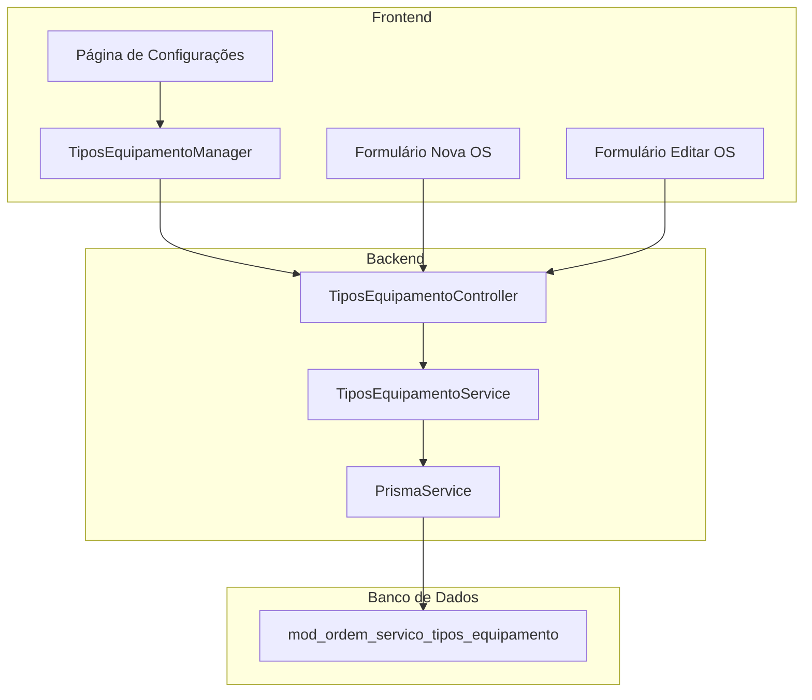
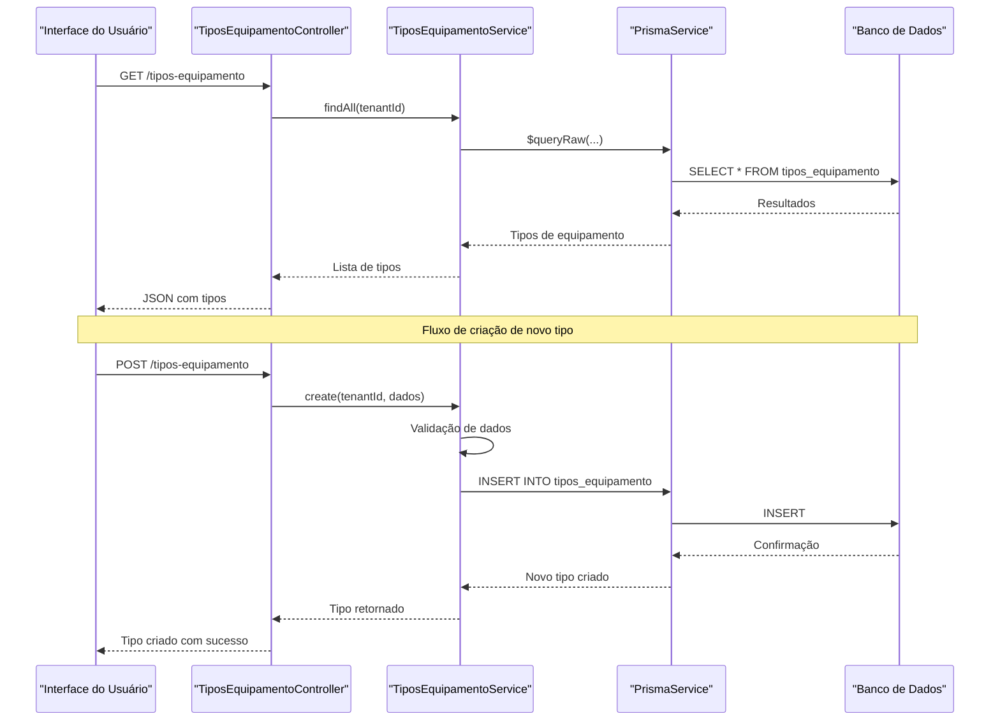
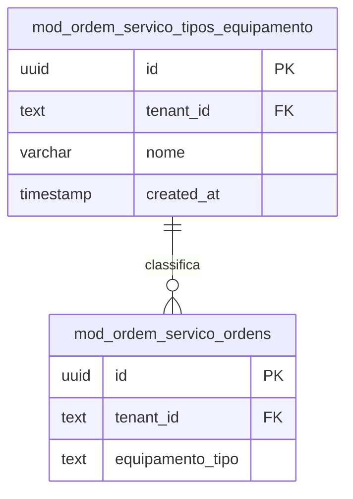
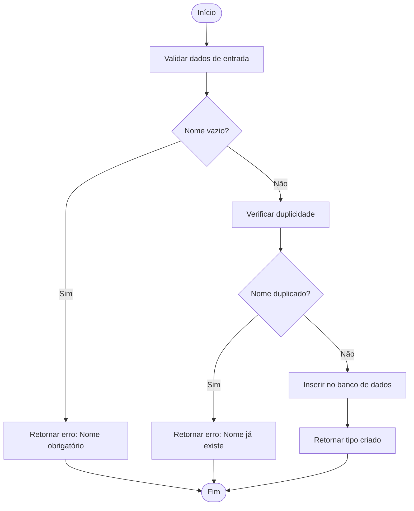
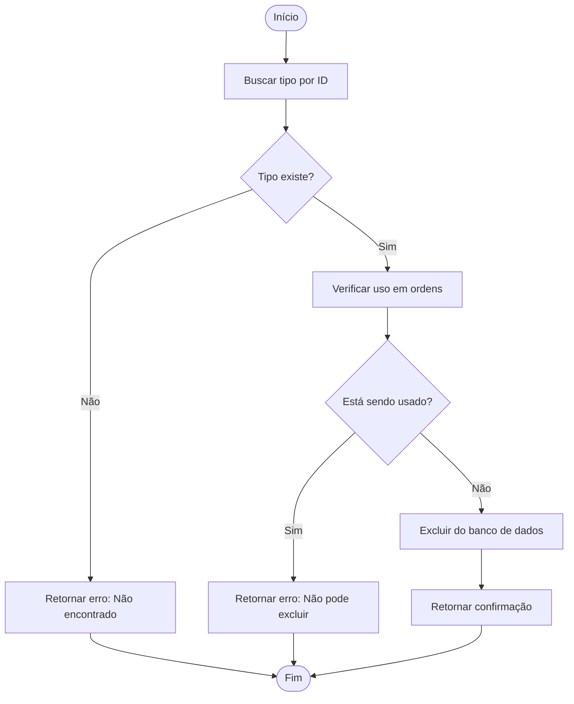
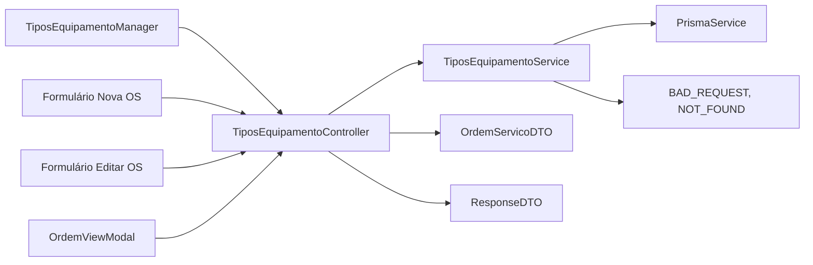

# Tipos de Equipamentos

<cite>
**Arquivos Referenciados neste Documento**
- [tipos-equipamento.controller.ts](file://backend/configuracoes/tipos-equipamento.controller.ts)
- [tipos-equipamento.service.ts](file://backend/configuracoes/tipos-equipamento.service.ts)
- [TiposEquipamentoManager.tsx](file://frontend/components/TiposEquipamentoManager.tsx)
- [ordens.controller.ts](file://backend/ordens/ordens.controller.ts)
- [ordens.service.ts](file://backend/ordens/ordens.service.ts)
- [ordem-servico.dto.ts](file://backend/shared/dto/ordem-servico.dto.ts)
- [001_master.sql](file://backend/migrations/001_master.sql)
- [004_add_tables_os.sql](file://backend/migrations/004_add_tables_os.sql)
- [page.tsx (configurações)](file://frontend/pages/configuracoes/page.tsx)
- [page.tsx (ordens novo)](file://frontend/pages/ordens/new/page.tsx)
- [page.tsx (ordens editar)](file://frontend/pages/ordens/edit/page.tsx)
- [OrdemViewModal.tsx](file://frontend/components/OrdemViewModal.tsx)
- [PrintTemplateA4.tsx](file://frontend/components/PrintTemplateA4.tsx)
- [PrintTemplateThermal.tsx](file://frontend/components/PrintTemplateThermal.tsx)
- [produtos.controller.ts](file://backend/produtos/produtos.controller.ts)
</cite>

## Sumário
1. [Introdução](#introdução)
2. [Estrutura do Projeto](#estrutura-do-projeto)
3. [Componentes Principais](#componentes-principais)
4. [Visão Geral da Arquitetura](#visão-geral-da-arquitetura)
5. [Análise Detalhada dos Componentes](#análise-detalhada-dos-componentes)
6. [Análise de Dependências](#análise-de-dependências)
7. [Considerações de Desempenho](#considerações-de-desempenho)
8. [Guia de Solução de Problemas](#guia-de-solução-de-problemas)
9. [Conclusão](#conclusão)

## Introdução
O módulo de tipos de equipamentos é uma funcionalidade essencial do sistema de Ordens de Serviço que permite categorizar e organizar os equipamentos associados às ordens de serviço. Este módulo fornece um conjunto de categorias pré-definidas (como Desktop, Notebook, Celular, Tablet, All-in-One, Monitor, Impressora) que podem ser utilizadas para classificar equipamentos durante o processo de abertura e edição de ordens de serviço.

O módulo é composto por três camadas principais:
- **Backend (NestJS)**: Controlador e serviço que gerenciam o CRUD completo dos tipos de equipamentos
- **Frontend (React)**: Interface de usuário que permite a gestão visual dos tipos de equipamentos
- **Banco de Dados (PostgreSQL)**: Armazenamento persistente das categorias de equipamentos

## Estrutura do Projeto
O módulo de tipos de equipamentos segue uma estrutura organizacional clara com separação de responsabilidades:

**Fontes**
- [tipos-equipamento.controller.ts](file://backend/configuracoes/tipos-equipamento.controller.ts#L1-L39)
- [tipos-equipamento.service.ts](file://backend/configuracoes/tipos-equipamento.service.ts#L1-L123)

## Componentes Principais

### Backend - Controlador de Tipos de Equipamentos
O controlador é responsável por expor a API REST para gerenciamento dos tipos de equipamentos:

**Endpoints Disponíveis:**
- `GET /api/ordem_servico/tipos-equipamento` - Listar todos os tipos de equipamentos
- `GET /api/ordem_servico/tipos-equipamento/:id` - Obter um tipo específico
- `POST /api/ordem_servico/tipos-equipamento` - Criar novo tipo
- `PUT /api/ordem_servico/tipos-equipamento/:id` - Atualizar tipo existente
- `DELETE /api/ordem_servico/tipos-equipamento/:id` - Excluir tipo

**Fontes**
- [tipos-equipamento.controller.ts](file://backend/configuracoes/tipos-equipamento.controller.ts#L1-L39)

### Backend - Serviço de Tipos de Equipamentos
O serviço implementa toda a lógica de negócio e validações:

**Funcionalidades:**
- Validação de dados obrigatórios
- Verificação de duplicidade de nomes
- Controle de exclusão com restrições
- Consultas paginadas e ordenadas
- Integração com o banco de dados através do Prisma

**Fontes**
- [tipos-equipamento.service.ts](file://backend/configuracoes/tipos-equipamento.service.ts#L1-L123)

### Frontend - Interface de Gestão
O frontend oferece uma interface intuitiva para gerenciar os tipos de equipamentos:

**Recursos:**
- Lista completa de tipos de equipamentos
- Formulário de criação/edição
- Validação de campos obrigatórios
- Confirmação de exclusão
- Integração em tempo real com a API

**Fontes**
- [TiposEquipamentoManager.tsx](file://frontend/components/TiposEquipamentoManager.tsx#L1-L370)

## Visão Geral da Arquitetura

**Fontes**
- [tipos-equipamento.controller.ts](file://backend/configuracoes/tipos-equipamento.controller.ts#L10-L38)
- [tipos-equipamento.service.ts](file://backend/configuracoes/tipos-equipamento.service.ts#L8-L57)

## Análise Detalhada dos Componentes

### Modelagem de Dados

**Fontes**
- [001_master.sql](file://backend/migrations/001_master.sql#L288-L294)
- [001_master.sql](file://backend/migrations/001_master.sql#L499-L544)

### Relacionamento com Ordens de Serviço

Os tipos de equipamentos são utilizados para classificar equipamentos nas ordens de serviço através de um campo de texto simples:

**Campos no DTO de Ordem de Serviço:**
- `equipamento_tipo`: Armazena o nome do tipo de equipamento selecionado
- `equipamento_marca`: Marca do equipamento
- `equipamento_modelo`: Modelo do equipamento
- `equipamento_serie`: Número de série
- `equipamento_acessorios`: Acessórios inclusos
- `equipamento_estado`: Estado físico do equipamento

**Fontes**
- [ordem-servico.dto.ts](file://backend/shared/dto/ordem-servico.dto.ts#L78-L101)
- [ordens.controller.ts](file://backend/ordens/ordens.controller.ts#L79-L88)

### Integração com Produtos

Apesar de compartilhar similaridades com os produtos, os tipos de equipamentos têm um papel distinto:

**Diferenças:**
- **Tipos de Equipamentos**: Categorias pré-definidas para classificação
- **Produtos**: Itens comerciais que podem ser vendidos ou utilizados
- **Relacionamento**: Ambos podem ser usados em ordens de serviço, mas com propósitos diferentes

**Fontes**
- [produtos.controller.ts](file://backend/produtos/produtos.controller.ts#L1-L144)

### Fluxo de Criação de Tipos de Equipamentos

**Fontes**
- [tipos-equipamento.service.ts](file://backend/configuracoes/tipos-equipamento.service.ts#L33-L57)

### Fluxo de Exclusão de Tipos de Equipamentos

**Fontes**
- [tipos-equipamento.service.ts](file://backend/configuracoes/tipos-equipamento.service.ts#L95-L122)

## Análise de Dependências

### Dependências Internas

**Fontes**
- [tipos-equipamento.controller.ts](file://backend/configuracoes/tipos-equipamento.controller.ts#L1-L39)
- [TiposEquipamentoManager.tsx](file://frontend/components/TiposEquipamentoManager.tsx#L1-L370)

### Dependências Externas

**Bibliotecas e Tecnologias:**
- **NestJS**: Framework backend TypeScript
- **Prisma**: ORM para PostgreSQL
- **React**: Framework frontend
- **Lucide React**: Ícones SVG
- **TailwindCSS**: Estilização

## Considerações de Desempenho

### Otimizações Implementadas
- **Consultas otimizadas**: Uso de `ORDER BY` e `LIMIT` nas queries
- **Paginação automática**: Tratamento de grandes volumes de dados
- **Validações no servidor**: Prevenção de dados inválidos
- **Cache de sessão**: Armazenamento seguro de tokens JWT

### Melhorias Potenciais
- **Índices adicionais**: Criação de índices para campos de busca frequentes
- **Paginação com cursor**: Implementação de paginação mais eficiente
- **Caching de tipos**: Armazenamento em cache dos tipos de equipamentos

## Guia de Solução de Problemas

### Erros Comuns e Soluções

**1. Erro de Nome Obrigatório**
- **Causa**: Tentativa de criar/atualizar sem informar o nome
- **Solução**: Verificar se o campo `nome` está preenchido
- **Fonte**: [tipos-equipamento.service.ts](file://backend/configuracoes/tipos-equipamento.service.ts#L36-L38)

**2. Erro de Nome Duplicado**
- **Causa**: Tentativa de criar tipo com nome já existente
- **Solução**: Utilizar nome único ou modificar o existente
- **Fonte**: [tipos-equipamento.service.ts](file://backend/configuracoes/tipos-equipamento.service.ts#L46-L48)

**3. Erro de Exclusão em Uso**
- **Causa**: Tentativa de excluir tipo que está sendo usado em ordens
- **Solução**: Remover o tipo de todas as ordens antes de excluir
- **Fonte**: [tipos-equipamento.service.ts](file://backend/configuracoes/tipos-equipamento.service.ts#L112-L114)

**4. Erro de Autenticação**
- **Causa**: Requisição sem token JWT válido
- **Solução**: Verificar header Authorization e token de acesso
- **Fonte**: [tipos-equipamento.controller.ts](file://backend/configuracoes/tipos-equipamento.controller.ts#L6)

### Diagnóstico de Erros

**Para depurar problemas no frontend:**
1. Verificar console do navegador
2. Validar requisições no Network tab
3. Confirmar presença do token no localStorage

**Para depurar problemas no backend:**
1. Verificar logs do servidor
2. Validar conexão com o banco de dados
3. Confirmar permissões de acesso

**Fontes**
- [TiposEquipamentoManager.tsx](file://frontend/components/TiposEquipamentoManager.tsx#L214-L224)
- [tipos-equipamento.controller.ts](file://backend/configuracoes/tipos-equipamento.controller.ts#L1-L39)

## Conclusão

O módulo de tipos de equipamentos é uma implementação sólida e bem estruturada que fornece funcionalidades essenciais para a gestão de categorias de equipamentos no sistema de Ordens de Serviço. A arquitetura seguindo o padrão MVC, com controle de acesso, validações rigorosas e integração completa com o frontend, demonstra boas práticas de desenvolvimento.

**Principais pontos fortes:**
- **Segurança**: Autenticação JWT obrigatória
- **Validação**: Verificações completas de dados
- **Integração**: Conexão direta com ordens de serviço
- **Usabilidade**: Interface intuitiva no frontend
- **Extensibilidade**: Facilidade para adicionar novos campos

**Áreas para melhoria contínua:**
- Implementação de paginação mais avançada
- Adição de índices no banco de dados
- Melhorias no caching de dados
- Expansão de funcionalidades de relatórios

O módulo está pronto para uso em produção e fornece uma base sólida para a gestão de equipamentos em sistemas de ordens de serviço.