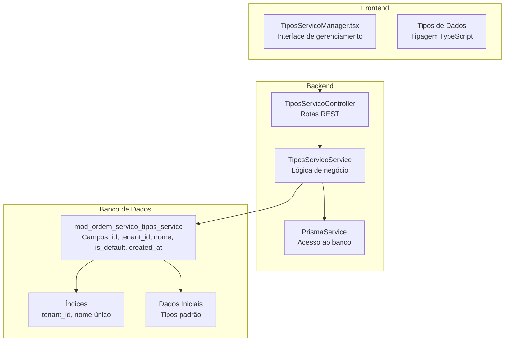
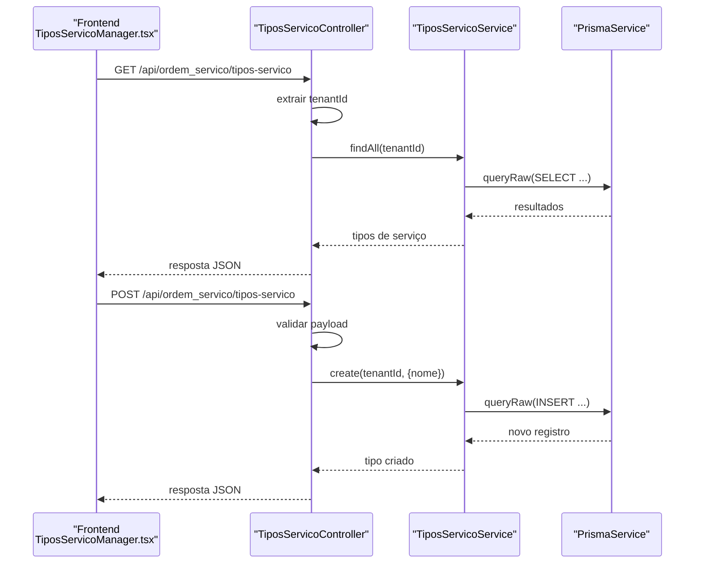
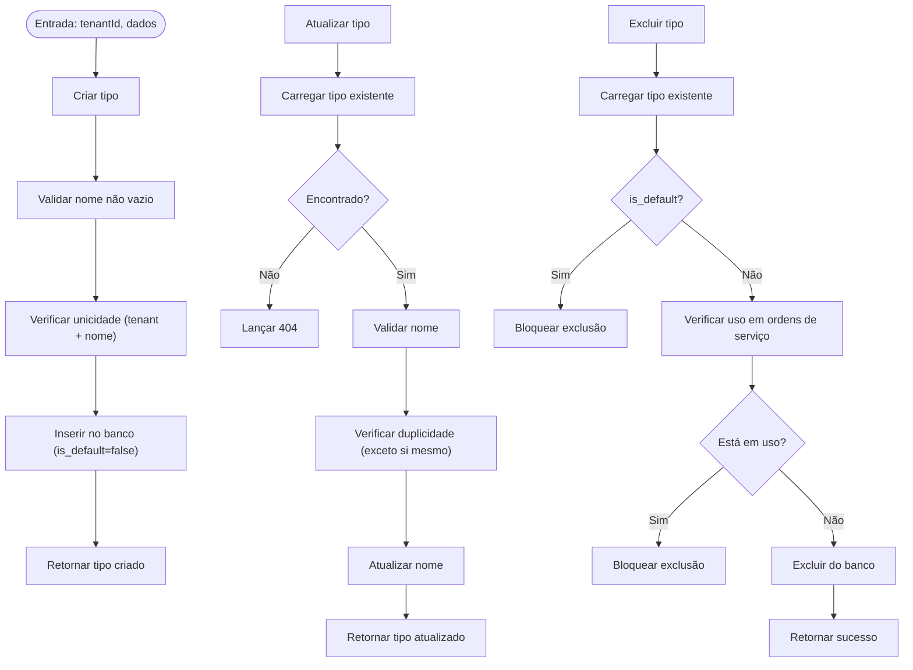
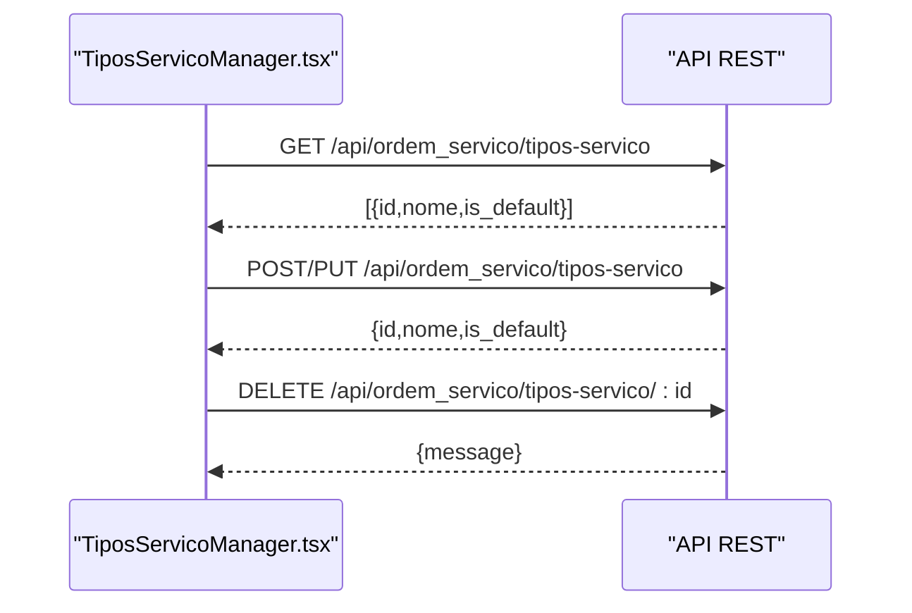
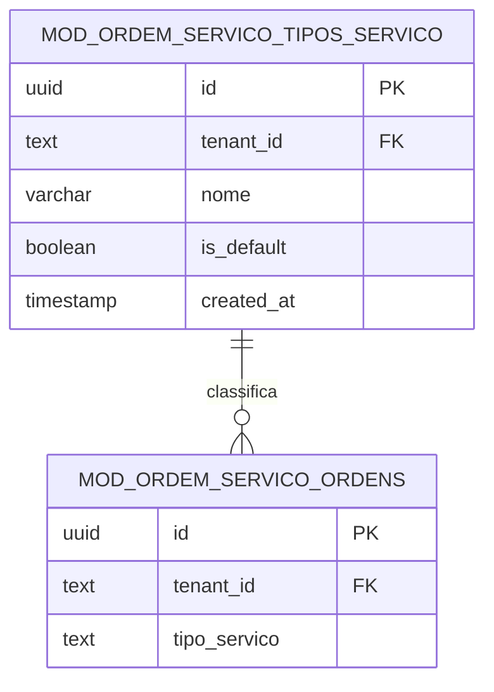

# Tipos de Serviços

<cite>
**Arquivos Referenciados Neste Documento**
- [tipos-servico.controller.ts](file://backend/configuracoes/tipos-servico.controller.ts)
- [tipos-servico.service.ts](file://backend/configuracoes/tipos-servico.service.ts)
- [TiposServicoManager.tsx](file://frontend/components/TiposServicoManager.tsx)
- [001_master.sql](file://backend/migrations/001_master.sql)
- [004_add_tables_os.sql](file://backend/migrations/004_add_tables_os.sql)
- [seeds_os.sql](file://backend/seeds/seeds_os.sql)
- [ordens.service.ts](file://backend/ordens/ordens.service.ts)
- [ordem-servico.dto.ts](file://backend/shared/dto/ordem-servico.dto.ts)
- [ordem-servico.types.ts](file://frontend/types/ordem-servico.types.ts)
- [ordem_servico.service.ts](file://frontend/services/ordem_servico.service.ts)
</cite>

## Sumário
1. [Introdução](#introdução)
2. [Estrutura do Projeto](#estrutura-do-projeto)
3. [Componentes Principais](#componentes-principais)
4. [Visão Geral da Arquitetura](#visão-geral-da-arquitetura)
5. [Análise Detalhada dos Componentes](#análise-detalhada-dos-componentes)
6. [Relacionamentos e Integrações](#relacionamentos-e-integrações)
7. [Considerações de Desempenho](#considerações-de-desempenho)
8. [Guia de Solução de Problemas](#guia-de-solução-de-problemas)
9. [Conclusão](#conclusão)

## Introdução
O módulo de tipos de serviços permite organizar e classificar os serviços oferecidos dentro do sistema de ordens de serviço. Ele fornece um conjunto de categorias (tipos) que ajudam a agrupar serviços, facilitando a gestão, relatórios e padronização dos serviços prestados. O módulo inclui:
- Cadastro e gerenciamento de tipos de serviço
- Validações de unicidade e integridade
- Relacionamento com ordens de serviço
- Interface de gerenciamento no frontend

## Estrutura do Projeto
O módulo de tipos de serviços é composto pelos seguintes elementos:
- Backend: controller e service para operações CRUD
- Frontend: componente de gerenciamento com interface intuitiva
- Migrations: definição da tabela e dados iniciais
- Seeds: dados padrão para novos tenants
- Integração com ordens de serviço

**Diagrama fonte**
- [tipos-servico.controller.ts](file://backend/configuracoes/tipos-servico.controller.ts#L1-L39)
- [tipos-servico.service.ts](file://backend/configuracoes/tipos-servico.service.ts#L1-L128)
- [001_master.sql](file://backend/migrations/001_master.sql#L274-L286)
- [TiposServicoManager.tsx](file://frontend/components/TiposServicoManager.tsx#L1-L407)

**Seção fonte**
- [tipos-servico.controller.ts](file://backend/configuracoes/tipos-servico.controller.ts#L1-L39)
- [tipos-servico.service.ts](file://backend/configuracoes/tipos-servico.service.ts#L1-L128)
- [TiposServicoManager.tsx](file://frontend/components/TiposServicoManager.tsx#L1-L407)
- [001_master.sql](file://backend/migrations/001_master.sql#L274-L286)

## Componentes Principais
- Controller de tipos de serviço: expõe endpoints REST para consulta, criação, atualização e remoção de tipos de serviço.
- Service de tipos de serviço: implementa regras de negócio, validações e integridade referencial.
- Componente frontend de gerenciamento: interface para visualizar, adicionar, editar e remover tipos de serviço.
- Tabela de tipos de serviço: armazena os registros com campos de identificação, pertencimento ao tenant e marcação de padrão.
- Seeds: insere tipos padrão para novos tenants.

**Seção fonte**
- [tipos-servico.controller.ts](file://backend/configuracoes/tipos-servico.controller.ts#L1-L39)
- [tipos-servico.service.ts](file://backend/configuracoes/tipos-servico.service.ts#L1-L128)
- [TiposServicoManager.tsx](file://frontend/components/TiposServicoManager.tsx#L1-L407)
- [001_master.sql](file://backend/migrations/001_master.sql#L274-L286)
- [seeds_os.sql](file://backend/seeds/seeds_os.sql#L433-L476)

## Visão Geral da Arquitetura
O fluxo básico segue o padrão REST com autenticação JWT:
- O frontend chama endpoints do backend
- O controller recebe a requisição e extrai o tenantId
- O service executa a lógica de negócio e interage com o banco de dados
- Resposta é retornada ao frontend

**Diagrama fonte**
- [TiposServicoManager.tsx](file://frontend/components/TiposServicoManager.tsx#L230-L279)
- [tipos-servico.controller.ts](file://backend/configuracoes/tipos-servico.controller.ts#L10-L38)
- [tipos-servico.service.ts](file://backend/configuracoes/tipos-servico.service.ts#L8-L57)

## Análise Detalhada dos Componentes

### Controller de Tipos de Serviço
- Define rotas REST para:
  - Listagem completa: GET /api/ordem_servico/tipos-servico
  - Consulta por ID: GET /api/ordem_servico/tipos-servico/:id
  - Criação: POST /api/ordem_servico/tipos-servico
  - Atualização: PUT /api/ordem_servico/tipos-servico/:id
  - Exclusão: DELETE /api/ordem_servico/tipos-servico/:id
- Aplica guardião de autenticação JWT
- Extrai tenantId do usuário logado ou do cabeçalho x-tenant-id

**Seção fonte**
- [tipos-servico.controller.ts](file://backend/configuracoes/tipos-servico.controller.ts#L1-L39)

### Service de Tipos de Serviço
Responsabilidades:
- Listagem: ordena por tipo padrão e nome
- Consulta por ID: retorna um tipo específico ou dispara erro 404
- Criação: validações de campo obrigatório e unicidade
- Atualização: validações, verificação de duplicidade e proteção de tipos padrão
- Exclusão: proteção de tipos padrão e verificação de uso em ordens de serviço

**Diagrama fonte**
- [tipos-servico.service.ts](file://backend/configuracoes/tipos-servico.service.ts#L33-L127)

**Seção fonte**
- [tipos-servico.service.ts](file://backend/configuracoes/tipos-servico.service.ts#L1-L128)

### Componente de Gerenciamento no Frontend
- Carrega tipos de serviço via GET
- Permite criar/editar tipos com formulário simples
- Exibe badges para tipos padrão
- Impede exclusão de tipos padrão
- Trata erros de rede e apresenta feedback ao usuário

**Diagrama fonte**
- [TiposServicoManager.tsx](file://frontend/components/TiposServicoManager.tsx#L230-L314)

**Seção fonte**
- [TiposServicoManager.tsx](file://frontend/components/TiposServicoManager.tsx#L1-L407)

### Tabela e Dados Iniciais
- Tabela: mod_ordem_servico_tipos_servico
  - Campos: id, tenant_id, nome, is_default, created_at
  - Restrições: chave estrangeira para tenants, índice único (tenant_id, nome)
- Seeds: insere tipos padrão para novos tenants (Formatação, Manutenção, Suporte Técnico, Outros)

**Seção fonte**
- [001_master.sql](file://backend/migrations/001_master.sql#L274-L286)
- [001_master.sql](file://backend/migrations/001_master.sql#L433-L476)
- [seeds_os.sql](file://backend/seeds/seeds_os.sql#L433-L476)

## Relacionamentos e Integrações

### Com Ordens de Serviço
- Os tipos de serviço são utilizados como classificação nos registros de ordens de serviço.
- Na criação e atualização de ordens, o campo tipo_servico é preenchido com o nome do tipo selecionado.
- O service de ordens de serviço filtra e exibe ordens por tipo de serviço.

**Diagrama fonte**
- [001_master.sql](file://backend/migrations/001_master.sql#L202-L249)
- [001_master.sql](file://backend/migrations/001_master.sql#L274-L286)
- [ordens.service.ts](file://backend/ordens/ordens.service.ts#L274-L276)

**Seção fonte**
- [ordens.service.ts](file://backend/ordens/ordens.service.ts#L274-L276)
- [ordens.service.ts](file://backend/ordens/ordens.service.ts#L568-L589)
- [ordens.service.ts](file://backend/ordens/ordens.service.ts#L1041-L1042)
- [ordem-servico.dto.ts](file://backend/shared/dto/ordem-servico.dto.ts#L32-L33)
- [ordem-servico.types.ts](file://frontend/types/ordem-servico.types.ts#L9-L9)

### Com Produtos
- A tabela de produtos/serviços é separada da tabela de tipos de serviço.
- Produtos podem estar relacionados a itens de ordem de serviço, mas não diretamente com tipos de serviço.
- Ambos servem para organizar diferentes aspectos do módulo.

**Seção fonte**
- [001_master.sql](file://backend/migrations/001_master.sql#L80-L97)
- [produtos.service.ts](file://backend/produtos/produtos.service.ts#L17-L40)

## Considerações de Desempenho
- Índices: a migration define índices para tenant_id e nome único, otimizando buscas e garantindo unicidade.
- Ordenação: a listagem de tipos é ordenada por is_default e nome, facilitando a exibição.
- Queries: o service utiliza queryRaw para consultas específicas, mantendo controle sobre o SQL gerado.

**Seção fonte**
- [001_master.sql](file://backend/migrations/001_master.sql#L388-L390)
- [tipos-servico.service.ts](file://backend/configuracoes/tipos-servico.service.ts#L8-L17)

## Guia de Solução de Problemas

### Erros Comuns e Soluções
- Erro 400: Nome obrigatório
  - Causa: tentativa de criar/atualizar sem nome
  - Solução: preencher o campo nome antes de salvar
  - Fonte: [tipos-servico.service.ts](file://backend/configuracoes/tipos-servico.service.ts#L36-L71)

- Erro 400: Nome duplicado
  - Causa: já existe um tipo com o mesmo nome no mesmo tenant
  - Solução: escolher outro nome ou verificar se já existe
  - Fonte: [tipos-servico.service.ts](file://backend/configuracoes/tipos-servico.service.ts#L41-L48)

- Erro 404: Tipo não encontrado
  - Causa: consulta por ID inexistente
  - Solução: verificar se o ID está correto
  - Fonte: [tipos-servico.service.ts](file://backend/configuracoes/tipos-servico.service.ts#L26-L31)

- Erro 400: Não é possível excluir tipo padrão
  - Causa: tentativa de excluir um tipo marcado como padrão
  - Solução: remover o tipo padrão ou criar outro antes de excluir
  - Fonte: [tipos-servico.service.ts](file://backend/configuracoes/tipos-servico.service.ts#L104-L106)

- Erro 400: Tipo em uso em ordens de serviço
  - Causa: tentativa de excluir tipo que ainda está sendo referenciado
  - Solução: alterar as ordens de serviço para outro tipo antes de excluir
  - Fonte: [tipos-servico.service.ts](file://backend/configuracoes/tipos-servico.service.ts#L117-L119)

### Dicas de Uso
- Sempre que criar um novo tenant, os seeds inserem tipos padrão automaticamente.
- Para padronizar a classificação de serviços, evite excluir tipos padrão e prefira criar novos tipos personalizados.
- Utilize a interface de gerenciamento para manter os tipos organizados e atualizados.

**Seção fonte**
- [seeds_os.sql](file://backend/seeds/seeds_os.sql#L433-L476)
- [TiposServicoManager.tsx](file://frontend/components/TiposServicoManager.tsx#L289-L314)

## Conclusão
O módulo de tipos de serviços oferece uma estrutura sólida para organizar e classificar serviços no sistema de ordens de serviço. Com validações rigorosas, integridade referencial e integração direta com ordens de serviço, ele proporciona uma base confiável para relatórios e análise. A interface frontend simplifica o gerenciamento, enquanto as migrations e seeds garantem consistência e padronização em novos ambientes.