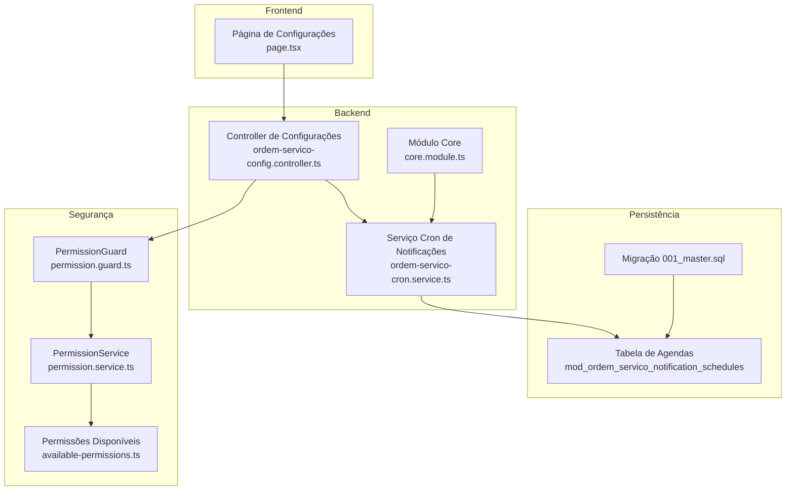
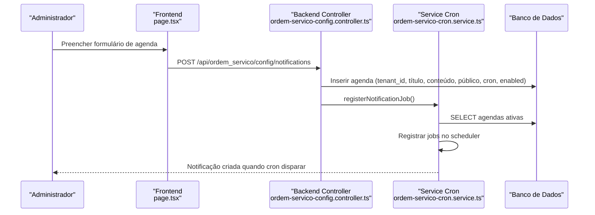
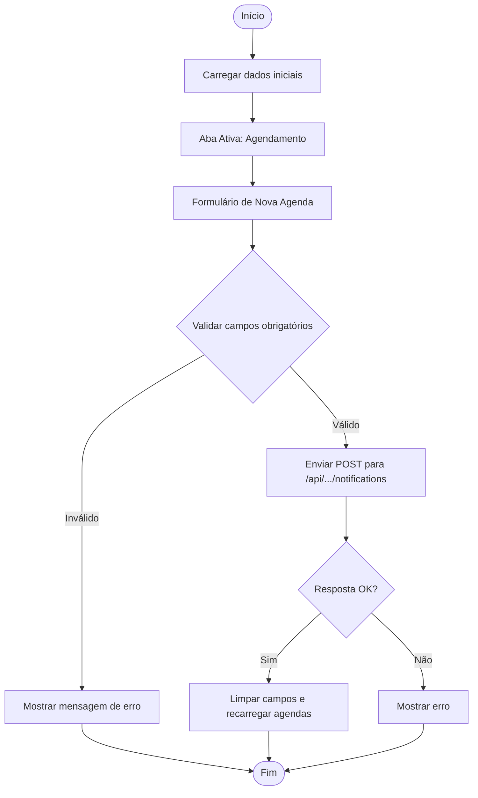
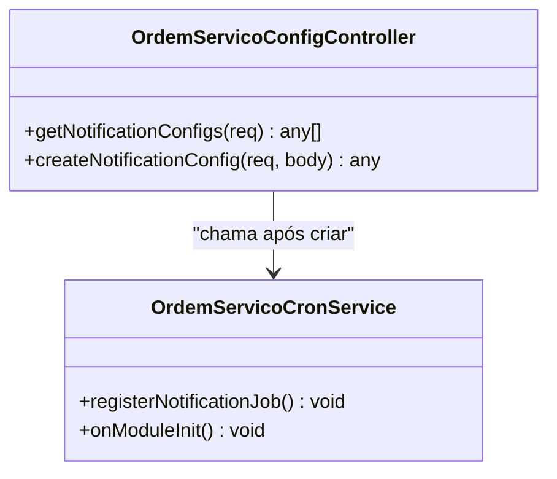
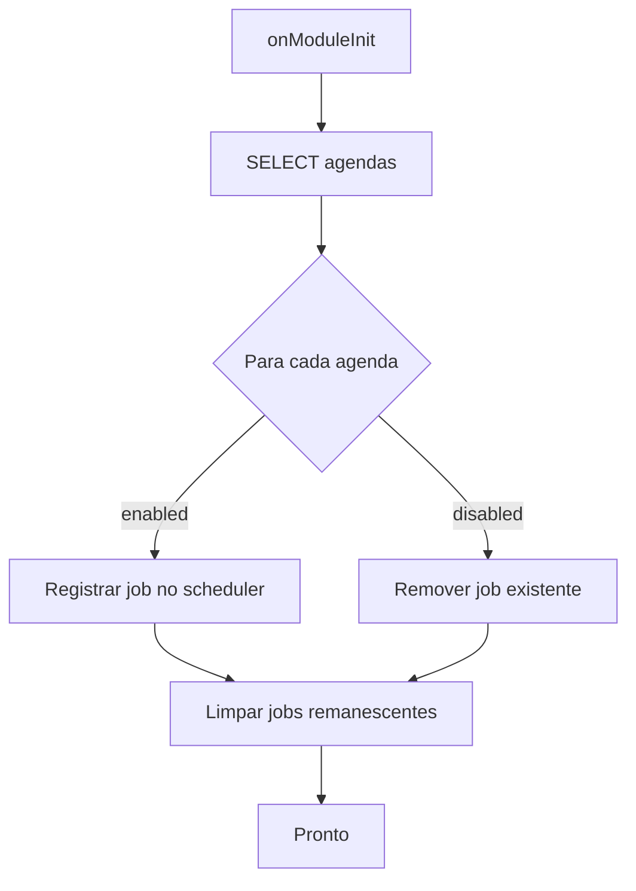
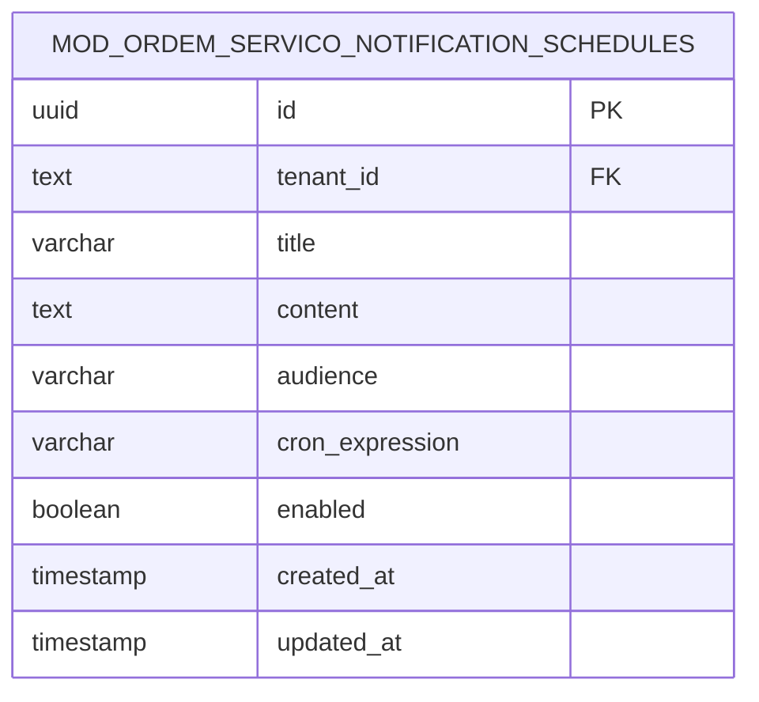
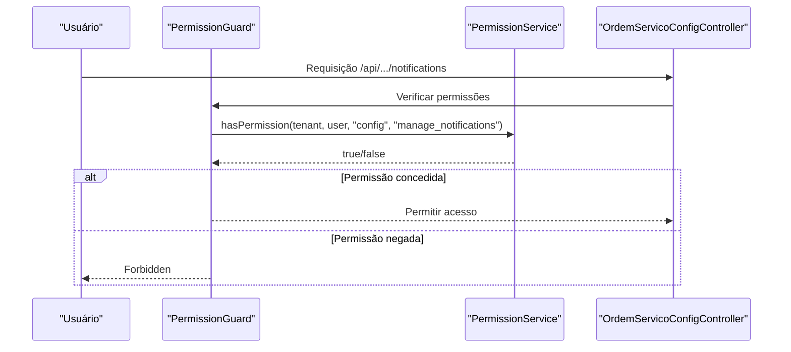
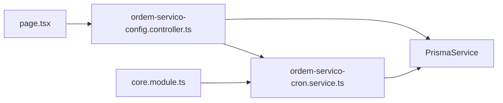

# Configurações de Notificações

<cite>
**Arquivos referenciados neste documento**
- [page.tsx](file://frontend/pages/configuracoes/page.tsx)
- [ordem-servico-config.controller.ts](file://backend/core/ordem-servico-config.controller.ts)
- [ordem-servico-cron.service.ts](file://backend/core/ordem-servico-cron.service.ts)
- [001_master.sql](file://backend/migrations/001_master.sql)
- [available-permissions.ts](file://backend/shared/constants/available-permissions.ts)
- [permission.guard.ts](file://backend/shared/guards/permission.guard.ts)
- [permission.service.ts](file://backend/shared/services/permission.service.ts)
- [core.module.ts](file://backend/core/core.module.ts)
</cite>

## Sumário
1. [Introdução](#introdução)
2. [Estrutura do Projeto](#estrutura-do-projeto)
3. [Componentes-Chave](#componentes-chave)
4. [Visão Geral da Arquitetura](#visão-geral-da-arquitetura)
5. [Análise Detalhada dos Componentes](#análise-detalhada-dos-componentes)
6. [Análise de Dependências](#análise-de-dependências)
7. [Considerações de Desempenho](#considerações-de-desempenho)
8. [Guia de Solução de Problemas](#guia-de-solução-de-problemas)
9. [Conclusão](#conclusão)

## Introdução
Este documento explica como funcionam as notificações automáticas no módulo de Ordens de Serviço. Ele descreve a interface de administração no frontend, como criar e editar agendas de notificação, quais campos são configuráveis, como testar e validar antes de ativar, e como o frontend se integra com o backend. Também aborda segurança, validação de dados e controle de acesso.

## Estrutura do Projeto
O sistema de notificações é composto por:
- Frontend: página de configurações com formulário de criação de agendas e listagem de agendas existentes.
- Backend: controller que expõe endpoints REST e service de cron que lê agendas e dispara notificações automaticamente.
- Persistência: tabela de agendas de notificação e migração que a cria.
- Segurança: guardas de permissão e definições de recursos e ações.

**Diagrama fonte**
- [page.tsx](file://frontend/pages/configuracoes/page.tsx#L364-L840)
- [ordem-servico-config.controller.ts](file://backend/core/ordem-servico-config.controller.ts#L9-L46)
- [ordem-servico-cron.service.ts](file://backend/core/ordem-servico-cron.service.ts#L5-L84)
- [001_master.sql](file://backend/migrations/001_master.sql#L28-L41)
- [permission.guard.ts](file://backend/shared/guards/permission.guard.ts#L1-L58)
- [permission.service.ts](file://backend/shared/services/permission.service.ts#L1-L313)
- [available-permissions.ts](file://backend/shared/constants/available-permissions.ts#L137-L163)
- [core.module.ts](file://backend/core/core.module.ts#L1-L13)

**Seção fonte**
- [page.tsx](file://frontend/pages/configuracoes/page.tsx#L364-L840)
- [ordem-servico-config.controller.ts](file://backend/core/ordem-servico-config.controller.ts#L9-L46)
- [ordem-servico-cron.service.ts](file://backend/core/ordem-servico-cron.service.ts#L5-L84)
- [001_master.sql](file://backend/migrations/001_master.sql#L28-L41)
- [permission.guard.ts](file://backend/shared/guards/permission.guard.ts#L1-L58)
- [permission.service.ts](file://backend/shared/services/permission.service.ts#L1-L313)
- [available-permissions.ts](file://backend/shared/constants/available-permissions.ts#L137-L163)
- [core.module.ts](file://backend/core/core.module.ts#L1-L13)

## Componentes-Chave
- Interface de administração de notificações no frontend:
  - Aba de “Agendamento” com formulário para criar novas agendas.
  - Campos: título, conteúdo, público-alvo, frequência e horário (quando aplicável), botão de criar.
  - Validação básica de campos obrigatórios antes de enviar.
- Backend:
  - Endpoint GET para listar agendas do tenant.
  - Endpoint POST para criar agenda com os mesmos campos.
  - Service de cron que lê agendas ativas e as registra no scheduler interno.
  - Ao criar uma agenda, o service de cron é acionado para recarregar os jobs.
- Persistência:
  - Tabela de agendas com campos: id, tenant_id, título, conteúdo, público-alvo, expressão cron, ativo.
- Segurança:
  - Controller protegido com autenticação JWT e papel SUPER_ADMIN.
  - Guarda de permissão e serviço de permissões com recursos e ações disponíveis.

**Seção fonte**
- [page.tsx](file://frontend/pages/configuracoes/page.tsx#L364-L840)
- [ordem-servico-config.controller.ts](file://backend/core/ordem-servico-config.controller.ts#L18-L46)
- [ordem-servico-cron.service.ts](file://backend/core/ordem-servico-cron.service.ts#L20-L84)
- [001_master.sql](file://backend/migrations/001_master.sql#L28-L41)
- [available-permissions.ts](file://backend/shared/constants/available-permissions.ts#L137-L163)
- [permission.guard.ts](file://backend/shared/guards/permission.guard.ts#L12-L57)
- [permission.service.ts](file://backend/shared/services/permission.service.ts#L131-L162)

## Visão Geral da Arquitetura
O fluxo básico de criação de uma notificação automática:
1. Administrador preenche o formulário no frontend (título, conteúdo, público, frequência).
2. O frontend envia uma requisição POST para o backend com os dados.
3. O backend persiste a agenda e chama o service de cron para recarregar os jobs.
4. O service de cron lê agendas ativas e registra tarefas no scheduler interno.
5. Quando o cron dispara, o backend cria uma notificação no sistema com base nos dados da agenda.

**Diagrama fonte**
- [page.tsx](file://frontend/pages/configuracoes/page.tsx#L594-L626)
- [ordem-servico-config.controller.ts](file://backend/core/ordem-servico-config.controller.ts#L28-L46)
- [ordem-servico-cron.service.ts](file://backend/core/ordem-servico-cron.service.ts#L20-L84)

**Seção fonte**
- [page.tsx](file://frontend/pages/configuracoes/page.tsx#L594-L626)
- [ordem-servico-config.controller.ts](file://backend/core/ordem-servico-config.controller.ts#L28-L46)
- [ordem-servico-cron.service.ts](file://backend/core/ordem-servico-cron.service.ts#L20-L84)

## Análise Detalhada dos Componentes

### Interface de Administração de Notificações (Frontend)
- Aba de “Agendamento”:
  - Novo Agendamento: formulário com campos título, conteúdo, público-alvo, frequência e horário (para agendas diárias).
  - Validação inicial: campos obrigatórios (título e conteúdo).
  - Envio: chamada POST para o endpoint de notificações.
- Funções auxiliares:
  - Detectar tipo de frequência a partir da expressão cron.
  - Gerar expressão cron com base no tipo e horário.
  - Obter horário a partir de uma expressão cron.

**Diagrama fonte**
- [page.tsx](file://frontend/pages/configuracoes/page.tsx#L396-L438)
- [page.tsx](file://frontend/pages/configuracoes/page.tsx#L594-L626)

**Seção fonte**
- [page.tsx](file://frontend/pages/configuracoes/page.tsx#L364-L840)
- [page.tsx](file://frontend/pages/configuracoes/page.tsx#L396-L438)
- [page.tsx](file://frontend/pages/configuracoes/page.tsx#L594-L626)

### Backend: Controller de Configurações
- Proteção:
  - Autenticação JWT + papel SUPER_ADMIN.
- Endpoints:
  - GET /api/ordem_servico/config/notifications: retorna agendas do tenant.
  - POST /api/ordem_servico/config/notifications: cria agenda com título, conteúdo, público, cron e ativo.
  - Após criar, chama o service de cron para recarregar os jobs.

**Diagrama fonte**
- [ordem-servico-config.controller.ts](file://backend/core/ordem-servico-config.controller.ts#L18-L46)
- [ordem-servico-cron.service.ts](file://backend/core/ordem-servico-cron.service.ts#L14-L17)

**Seção fonte**
- [ordem-servico-config.controller.ts](file://backend/core/ordem-servico-config.controller.ts#L18-L46)

### Backend: Service de Cron de Notificações
- Inicialização:
  - Ao iniciar o módulo, lê todas as agendas de notificação.
  - Para cada agenda ativa, registra um job no scheduler interno com chave única.
  - Remove jobs antigos que não estão mais ativos.
- Execução:
  - Quando o cron dispara, cria uma notificação no sistema com título, conteúdo, severidade, público e módulo de origem.

**Diagrama fonte**
- [ordem-servico-cron.service.ts](file://backend/core/ordem-servico-cron.service.ts#L14-L62)

**Seção fonte**
- [ordem-servico-cron.service.ts](file://backend/core/ordem-servico-cron.service.ts#L20-L84)

### Persistência: Tabela de Agendas
- Campos principais:
  - id, tenant_id, title, content, audience, cron_expression, enabled.
- Relacionamento:
  - Cada agenda pertence a um tenant e pode estar ativa ou inativa.

**Diagrama fonte**
- [001_master.sql](file://backend/migrations/001_master.sql#L28-L41)

**Seção fonte**
- [001_master.sql](file://backend/migrations/001_master.sql#L28-L41)

### Segurança e Controle de Acesso
- Papel necessário:
  - SUPER_ADMIN para acessar o endpoint de configurações.
- Recursos e ações:
  - Recurso “config” com ação “manage_notifications” permite gerenciar notificações.
- Verificação de permissão:
  - Guarda de permissão verifica se o usuário tem a permissão necessária.
  - Serviço de permissões busca permissões do usuário e registra auditorias.

**Diagrama fonte**
- [permission.guard.ts](file://backend/shared/guards/permission.guard.ts#L12-L57)
- [permission.service.ts](file://backend/shared/services/permission.service.ts#L131-L162)
- [available-permissions.ts](file://backend/shared/constants/available-permissions.ts#L137-L163)
- [ordem-servico-config.controller.ts](file://backend/core/ordem-servico-config.controller.ts#L10-L11)

**Seção fonte**
- [permission.guard.ts](file://backend/shared/guards/permission.guard.ts#L12-L57)
- [permission.service.ts](file://backend/shared/services/permission.service.ts#L131-L162)
- [available-permissions.ts](file://backend/shared/constants/available-permissions.ts#L137-L163)
- [ordem-servico-config.controller.ts](file://backend/core/ordem-servico-config.controller.ts#L10-L11)

## Análise de Dependências
- Frontend depende do backend para:
  - Listar agendas (GET).
  - Criar agendas (POST).
- Backend depende de:
  - Prisma para acesso ao banco.
  - CronService para registrar e executar jobs.
  - Módulo Core para injetar dependências.

**Diagrama fonte**
- [page.tsx](file://frontend/pages/configuracoes/page.tsx#L457-L472)
- [ordem-servico-config.controller.ts](file://backend/core/ordem-servico-config.controller.ts#L13-L16)
- [core.module.ts](file://backend/core/core.module.ts#L7-L12)

**Seção fonte**
- [page.tsx](file://frontend/pages/configuracoes/page.tsx#L457-L472)
- [ordem-servico-config.controller.ts](file://backend/core/ordem-servico-config.controller.ts#L13-L16)
- [core.module.ts](file://backend/core/core.module.ts#L7-L12)

## Considerações de Desempenho
- O service de cron carrega todas as agendas ativas ao iniciar e sempre limpa jobs remanescentes, evitando duplicidade.
- A persistência usa índices implícitos em chaves estrangeiras e primárias; consultas são simples e diretas.
- Recomendações:
  - Evite criar muitas agendas com horários muito próximos para reduzir concorrência de disparos.
  - Mantenha a expressão cron otimizada (ex: horário fixo diariamente) para evitar sobrecarga.

[Sem seção fonte, pois esta seção fornece orientações gerais]

## Guia de Solução de Problemas
- Não aparecem agendas no frontend:
  - Confirme que o usuário está logado e possui o papel necessário.
  - Verifique se o endpoint GET retorna dados do tenant correto.
- Erro ao criar agenda:
  - Valide campos obrigatórios (título e conteúdo).
  - Confirme permissões de “config:manage_notifications”.
- Nenhuma notificação sendo criada:
  - Verifique se a agenda está ativa.
  - Confirme se o cron está registrando jobs (ver logs do service de cron).
  - Confirme se o horário da expressão cron está correto.

**Seção fonte**
- [page.tsx](file://frontend/pages/configuracoes/page.tsx#L594-L626)
- [ordem-servico-config.controller.ts](file://backend/core/ordem-servico-config.controller.ts#L18-L26)
- [ordem-servico-cron.service.ts](file://backend/core/ordem-servico-cron.service.ts#L20-L62)

## Conclusão
O módulo de notificações automáticas combina uma interface simples no frontend com um backend robusto e seguro. As agendas são fáceis de criar e validar, e o sistema garante que somente usuários com permissão adequada possam gerenciá-las. Com boas práticas de cron e monitoramento, o sistema mantém baixo impacto no desempenho e alta confiabilidade.

[Sem seção fonte, pois esta seção resume sem analisar arquivos específicos]