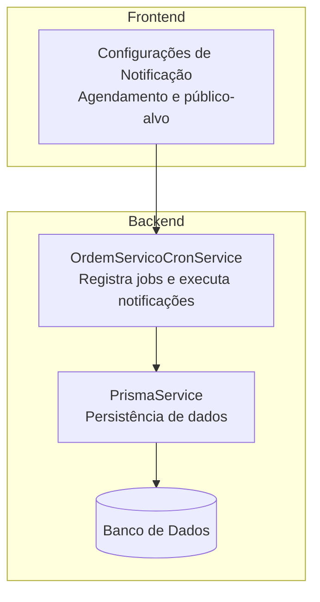
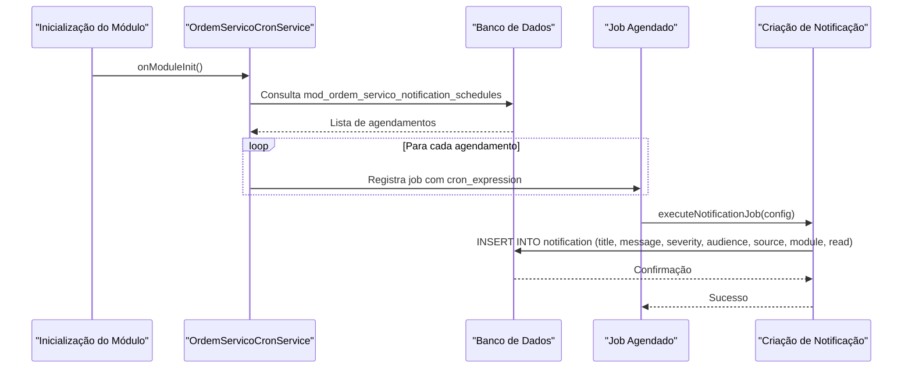
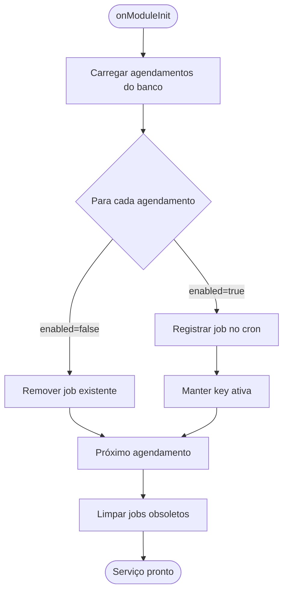
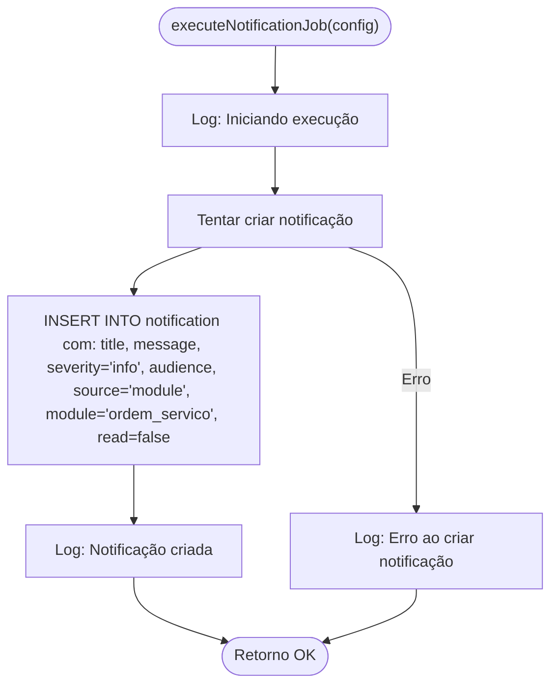
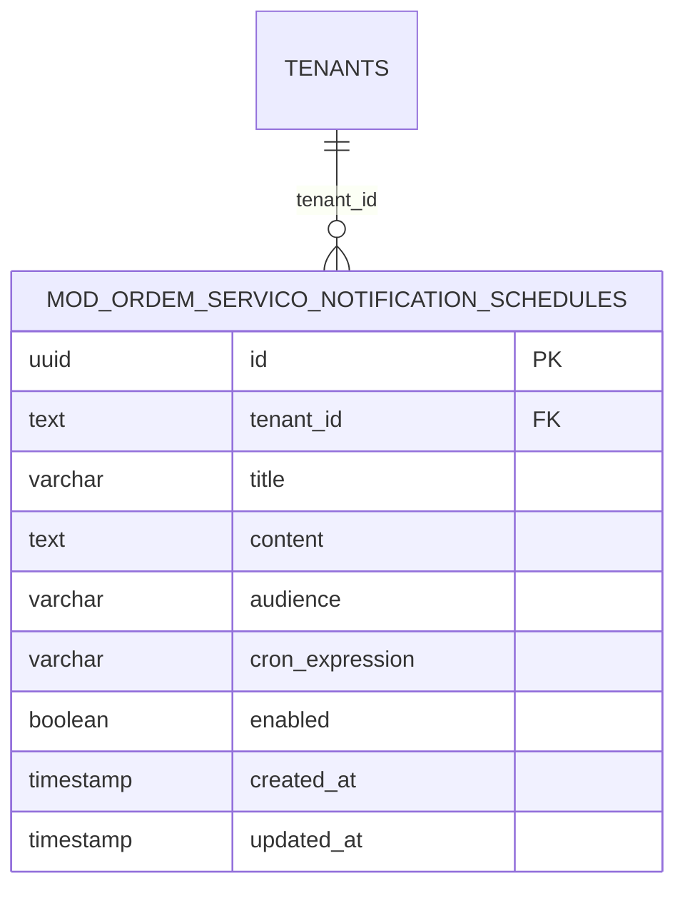
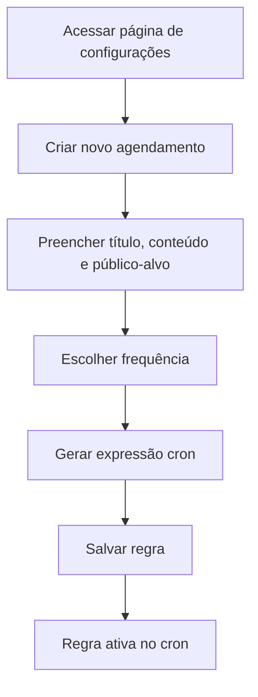
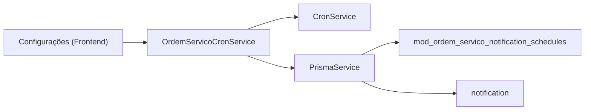

# Execução de Notificações

<cite>
**Arquivos referenciados neste documento**
- [ordem-servico-cron.service.ts](file://backend/core/ordem-servico-cron.service.ts)
- [001_master.sql](file://backend/migrations/001_master.sql)
- [004_add_tables_os.sql](file://backend/migrations/004_add_tables_os.sql)
- [page.tsx](file://frontend/pages/configuracoes/page.tsx)
</cite>

## Sumário
- Introdução
- Estrutura do Projeto
- Componentes-Chave
- Visão Geral da Arquitetura
- Análise Detalhada dos Componentes
- Análise de Dependências
- Considerações de Desempenho
- Guia de Solução de Problemas
- Conclusão

## Introdução
Este documento explica como o módulo de notificações automáticas funciona no backend. Ele descreve o método de execução de notificações agendadas, como os registros são criados no banco de dados e como as notificações são geradas. Também aborda o modelo de notificação com seus campos principais, tratamento de exceções e logs, além de recomendações de desempenho e otimizações.

## Estrutura do Projeto
O fluxo de notificações automáticas envolve três partes principais:
- Agendamento de notificações: armazenado em uma tabela de agendamentos.
- Registro de jobs no cron: o serviço carrega os agendamentos e registra tarefas programadas.
- Criação de notificações: ao disparar, o job insere um registro na tabela de notificações.

**Diagrama fonte**
- [ordem-servico-cron.service.ts](file://backend/core/ordem-servico-cron.service.ts#L14-L84)
- [001_master.sql](file://backend/migrations/001_master.sql#L27-L41)
- [004_add_tables_os.sql](file://backend/migrations/004_add_tables_os.sql#L17-L32)

**Seção fonte**
- [ordem-servico-cron.service.ts](file://backend/core/ordem-servico-cron.service.ts#L14-L84)
- [001_master.sql](file://backend/migrations/001_master.sql#L27-L41)
- [004_add_tables_os.sql](file://backend/migrations/004_add_tables_os.sql#L17-L32)

## Componentes-Chave
- Serviço de Cron do Módulo de Ordens de Serviço: carrega os agendamentos e registra jobs no cron.
- Tabela de Agendamentos: armazena regras de notificação automática.
- Persistência de Notificações: ao executar um job, o sistema cria um registro de notificação.

**Seção fonte**
- [ordem-servico-cron.service.ts](file://backend/core/ordem-servico-cron.service.ts#L14-L84)
- [001_master.sql](file://backend/migrations/001_master.sql#L27-L41)
- [004_add_tables_os.sql](file://backend/migrations/004_add_tables_os.sql#L17-L32)

## Visão Geral da Arquitetura
O fluxo começa com o carregamento de regras de agendamento. Para cada regra ativa, o serviço registra um job no cron. Quando o horário chega, o job executa o método de criação de notificação, que insere um novo registro no banco de dados.

**Diagrama fonte**
- [ordem-servico-cron.service.ts](file://backend/core/ordem-servico-cron.service.ts#L14-L84)
- [001_master.sql](file://backend/migrations/001_master.sql#L27-L41)

## Análise Detalhada dos Componentes

### Serviço de Cron do Módulo de Ordens de Serviço
Responsável por:
- Carregar os agendamentos ativos do banco.
- Registrar jobs no cron com base nas expressões cron.
- Executar o método de criação de notificação quando o tempo chegar.
- Limpar jobs antigos e manter apenas os ativos.

**Diagrama fonte**
- [ordem-servico-cron.service.ts](file://backend/core/ordem-servico-cron.service.ts#L14-L62)

**Seção fonte**
- [ordem-servico-cron.service.ts](file://backend/core/ordem-servico-cron.service.ts#L14-L84)

### Método executeNotificationJob
Quando o job é acionado, o método:
- Loga a execução.
- Insere um novo registro na tabela de notificações com os campos título, mensagem, severidade, público-alvo, origem, módulo e status de leitura.
- Em caso de erro, loga a falha.

**Diagrama fonte**
- [ordem-servico-cron.service.ts](file://backend/core/ordem-servico-cron.service.ts#L64-L83)

**Seção fonte**
- [ordem-servico-cron.service.ts](file://backend/core/ordem-servico-cron.service.ts#L64-L83)

### Tabela de Agendamentos de Notificações
A tabela armazena:
- Identificador único do agendamento.
- Identificador do tenant.
- Título e conteúdo da notificação.
- Público-alvo (ex: todos, administradores, super admin).
- Expressão cron.
- Status de ativação.
- Timestamps de criação e atualização.

**Diagrama fonte**
- [001_master.sql](file://backend/migrations/001_master.sql#L27-L41)

**Seção fonte**
- [001_master.sql](file://backend/migrations/001_master.sql#L27-L41)

### Tabela de Notificações (Persistência)
Embora o método de criação utilize a tabela de notificações, a definição completa da estrutura da tabela de notificações não foi encontrada nos arquivos fornecidos. O método insere os seguintes campos:
- title
- message
- severity
- audience
- source
- module
- read

Esses campos indicam que a notificação possui título, mensagem, severidade, público-alvo, origem do registro, módulo associado e status de leitura.

**Seção fonte**
- [ordem-servico-cron.service.ts](file://backend/core/ordem-servico-cron.service.ts#L67-L78)

### Frontend: Configurações de Agendamento
A interface permite:
- Criar novas regras de notificação automática.
- Definir título, conteúdo e público-alvo.
- Escolher frequência (diária, semanal, etc.) e obter a expressão cron correspondente.

**Diagrama fonte**
- [page.tsx](file://frontend/pages/configuracoes/page.tsx#L753-L811)

**Seção fonte**
- [page.tsx](file://frontend/pages/configuracoes/page.tsx#L753-L811)

## Análise de Dependências
- O serviço depende de:
  - Um serviço de cron para registrar e executar jobs.
  - O Prisma para acesso ao banco de dados.
- O banco de dados contém:
  - A tabela de agendamentos de notificações.
  - A tabela de notificações (campos usados pelo método de criação).
- O frontend fornece a interface para criar e gerenciar regras de agendamento.

**Diagrama fonte**
- [ordem-servico-cron.service.ts](file://backend/core/ordem-servico-cron.service.ts#L1-L12)
- [001_master.sql](file://backend/migrations/001_master.sql#L27-L41)

**Seção fonte**
- [ordem-servico-cron.service.ts](file://backend/core/ordem-servico-cron.service.ts#L1-L12)
- [001_master.sql](file://backend/migrations/001_master.sql#L27-L41)

## Considerações de Desempenho
- Escalabilidade de agendamentos:
  - Evite ter milhares de regras ativas. Prefira agrupar notificações com a mesma frequência e público-alvo.
  - Utilize índices nas colunas de busca e ordenação (ex: enabled, tenant_id).
- Frequências crônicas:
  - Evite expressões muito complexas. Prefira expressões simples e bem definidas.
  - Distribua cargas de trabalho para evitar picos de inserção simultânea.
- Persistência:
  - Use transações para operações que envolvam múltiplas inserções.
  - Considere batch inserts se for necessário criar várias notificações de uma vez.
- Monitoramento:
  - Monitore o tempo de resposta dos jobs e logs de erros.
  - Aplique limites de retry e dead-letter para jobs falhos.

[Sem fonte, pois esta seção oferece orientações gerais]

## Guia de Solução de Problemas
- Erros ao registrar jobs:
  - Verifique se há falhas na consulta de agendamentos.
  - Confirme se o serviço de cron está disponível e funcionando.
- Falhas na criação de notificações:
  - Revise os logs de erro.
  - Valide os campos obrigatórios e os tipos de dados.
- Jobs desativados:
  - Certifique-se de que a flag enabled esteja correta.
  - Verifique se o job antigo foi removido corretamente.

**Seção fonte**
- [ordem-servico-cron.service.ts](file://backend/core/ordem-servico-cron.service.ts#L59-L61)
- [ordem-servico-cron.service.ts](file://backend/core/ordem-servico-cron.service.ts#L80-L82)

## Conclusão
O processo de notificações automáticas é composto por três etapas principais: agendamento, registro de jobs e criação de notificações. O serviço carrega as regras do banco, registra jobs no cron e, ao ser acionado, insere um novo registro de notificação. A persistência utiliza a tabela de notificações com campos como título, mensagem, severidade, público-alvo, origem, módulo e status de leitura. Para manter o desempenho, recomenda-se otimizar expressões cron, usar índices e monitorar logs e erros.

[Sem fonte, pois esta seção resume sem análise específica de arquivos]