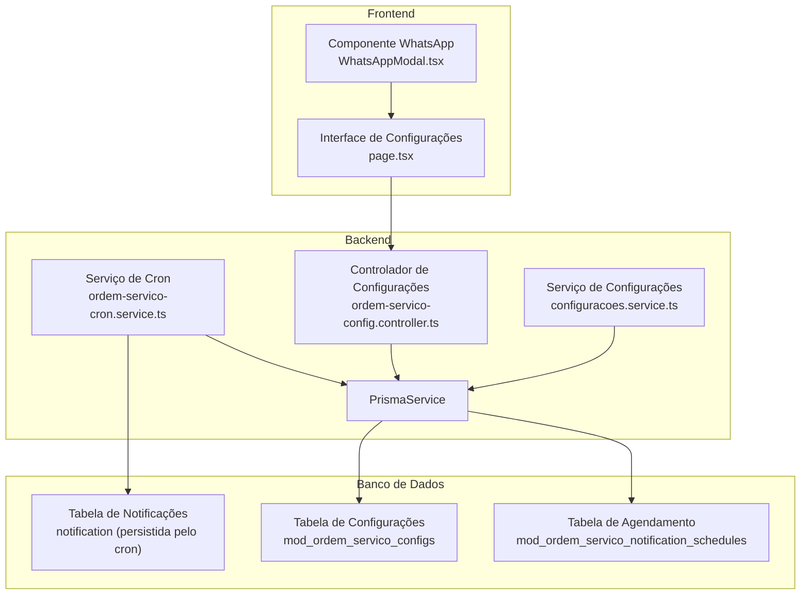
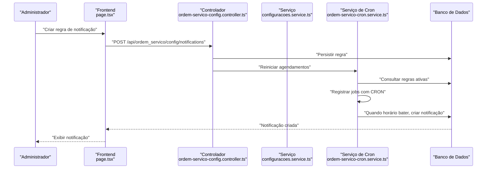
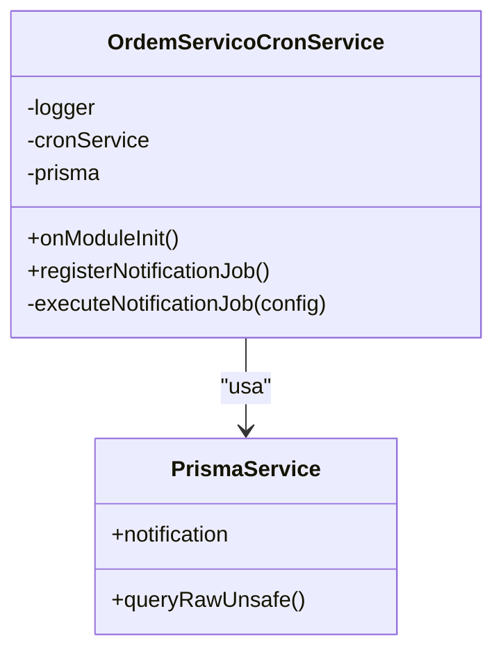
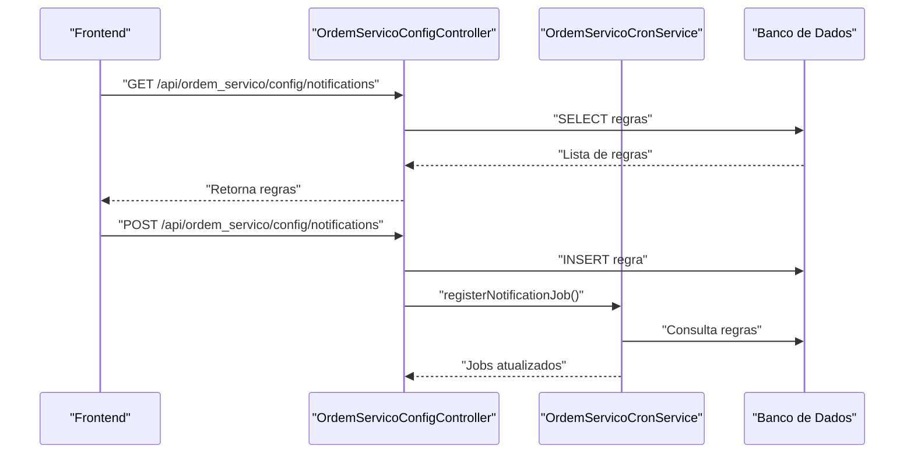
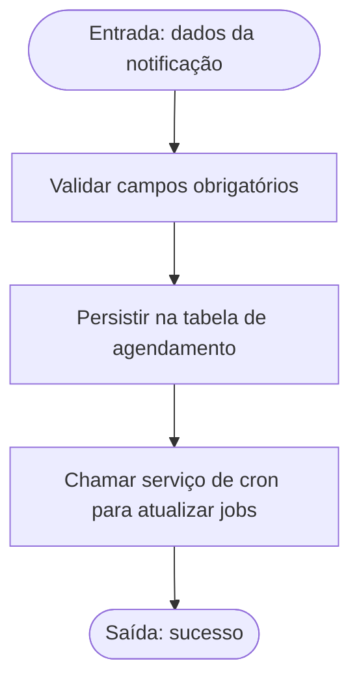
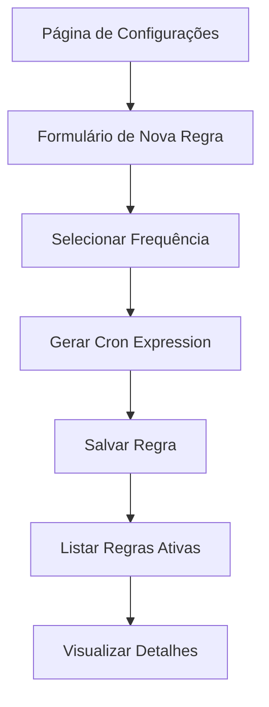
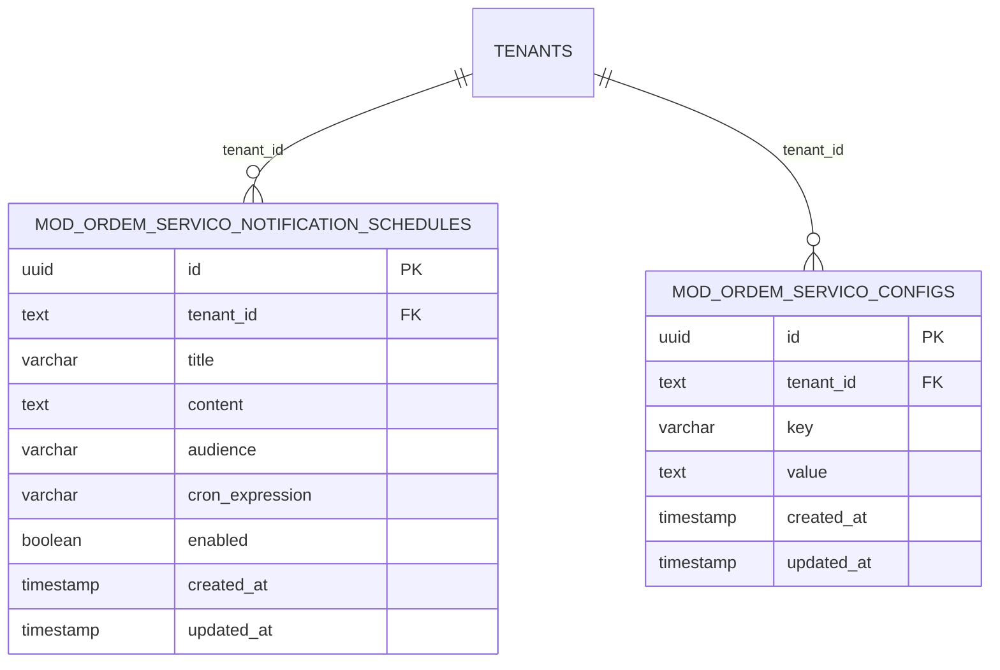
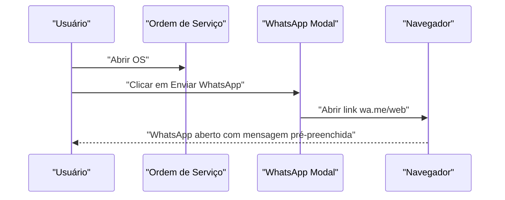
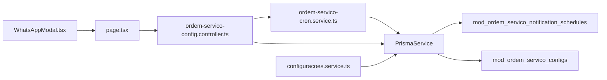

# Notificações Automáticas

<cite>
**Arquivos Referenciados neste Documento**
- [ordem-servico-cron.service.ts](file://backend/core/ordem-servico-cron.service.ts)
- [ordem-servico-config.controller.ts](file://backend/core/ordem-servico-config.controller.ts)
- [configuracoes.controller.ts](file://backend/configuracoes/configuracoes.controller.ts)
- [configuracoes.service.ts](file://backend/configuracoes/configuracoes.service.ts)
- [001_master.sql](file://backend/migrations/001_master.sql)
- [004_add_tables_os.sql](file://backend/migrations/004_add_tables_os.sql)
- [page.tsx](file://frontend/pages/configuracoes/page.tsx)
- [WhatsAppModal.tsx](file://frontend/components/WhatsAppModal.tsx)
</cite>

## Sumário
1. [Introdução](#introdução)
2. [Estrutura do Projeto](#estrutura-do-projeto)
3. [Componentes-Chave](#componentes-chave)
4. [Visão Geral da Arquitetura](#visão-geral-da-arquitetura)
5. [Análise Detalhada dos Componentes](#análise-detalhada-dos-componentes)
6. [Análise de Dependências](#análise-de-dependências)
7. [Considerações de Desempenho](#considerações-de-desempenho)
8. [Guia de Solução de Problemas](#guia-de-solução-de-problemas)
9. [Conclusão](#conclusão)

## Introdução
Este documento apresenta o sistema de notificações automáticas do módulo Ordem de Serviço. Ele explica como o sistema agenda e executa notificações com base em regras configuráveis, como os cron jobs são registrados e mantidos, e como os dados são persistidos. Também aborda a integração com canais de comunicação como e-mail e WhatsApp, além de orientações práticas para solução de problemas comuns.

## Estrutura do Projeto
O sistema de notificações automáticas é composto pelos seguintes elementos principais:
- Backend: serviço de cron, controladores e serviços de configuração
- Frontend: interface para criação e gerenciamento de regras de notificação
- Migrações: definição de tabelas de agendamento e configurações
- Canais de notificação: persistência de notificações e geração de links para WhatsApp

**Diagrama fonte**
- [ordem-servico-cron.service.ts](file://backend/core/ordem-servico-cron.service.ts#L1-L84)
- [ordem-servico-config.controller.ts](file://backend/core/ordem-servico-config.controller.ts#L1-L68)
- [configuracoes.controller.ts](file://backend/configuracoes/configuracoes.controller.ts#L1-L136)
- [configuracoes.service.ts](file://backend/configuracoes/configuracoes.service.ts#L1-L331)
- [001_master.sql](file://backend/migrations/001_master.sql#L28-L41)
- [004_add_tables_os.sql](file://backend/migrations/004_add_tables_os.sql#L18-L32)
- [page.tsx](file://frontend/pages/configuracoes/page.tsx#L750-L949)
- [WhatsAppModal.tsx](file://frontend/components/WhatsAppModal.tsx#L1-L206)

**Seção fonte**
- [ordem-servico-cron.service.ts](file://backend/core/ordem-servico-cron.service.ts#L1-L84)
- [ordem-servico-config.controller.ts](file://backend/core/ordem-servico-config.controller.ts#L1-L68)
- [configuracoes.controller.ts](file://backend/configuracoes/configuracoes.controller.ts#L1-L136)
- [configuracoes.service.ts](file://backend/configuracoes/configuracoes.service.ts#L1-L331)
- [001_master.sql](file://backend/migrations/001_master.sql#L28-L41)
- [004_add_tables_os.sql](file://backend/migrations/004_add_tables_os.sql#L18-L32)
- [page.tsx](file://frontend/pages/configuracoes/page.tsx#L750-L949)
- [WhatsAppModal.tsx](file://frontend/components/WhatsAppModal.tsx#L1-L206)

## Componentes-Chave
- Serviço de Cron: registra e executa tarefas programadas com base em regras armazenadas no banco de dados.
- Controlador de Configurações: expõe endpoints para criar e consultar regras de notificação.
- Serviço de Configurações: fornece métodos para persistir e recuperar dados de notificação.
- Frontend: permite criar regras de notificação e visualizar agendamentos ativos.
- Migrações: definem as tabelas de agendamento e configurações.
- Canais de Notificação: persiste notificações no banco e gera links para WhatsApp.

**Seção fonte**
- [ordem-servico-cron.service.ts](file://backend/core/ordem-servico-cron.service.ts#L1-L84)
- [ordem-servico-config.controller.ts](file://backend/core/ordem-servico-config.controller.ts#L1-L68)
- [configuracoes.controller.ts](file://backend/configuracoes/configuracoes.controller.ts#L1-L136)
- [configuracoes.service.ts](file://backend/configuracoes/configuracoes.service.ts#L139-L177)
- [page.tsx](file://frontend/pages/configuracoes/page.tsx#L750-L949)
- [001_master.sql](file://backend/migrations/001_master.sql#L28-L41)
- [004_add_tables_os.sql](file://backend/migrations/004_add_tables_os.sql#L18-L32)
- [WhatsAppModal.tsx](file://frontend/components/WhatsAppModal.tsx#L102-L120)

## Visão Geral da Arquitetura
O fluxo de notificações automáticas segue estas etapas:
1. O módulo carrega regras de notificação do banco de dados.
2. O serviço de cron registra jobs com base nas regras ativas.
3. Quando o tempo programado chega, o job cria uma notificação no banco.
4. A interface exibe as notificações criadas.
5. O WhatsApp pode ser acionado a partir de dados da OS.

**Diagrama fonte**
- [ordem-servico-config.controller.ts](file://backend/core/ordem-servico-config.controller.ts#L28-L46)
- [configuracoes.service.ts](file://backend/configuracoes/configuracoes.service.ts#L156-L177)
- [ordem-servico-cron.service.ts](file://backend/core/ordem-servico-cron.service.ts#L20-L62)
- [page.tsx](file://frontend/pages/configuracoes/page.tsx#L750-L949)

**Seção fonte**
- [ordem-servico-config.controller.ts](file://backend/core/ordem-servico-config.controller.ts#L18-L46)
- [configuracoes.service.ts](file://backend/configuracoes/configuracoes.service.ts#L139-L177)
- [ordem-servico-cron.service.ts](file://backend/core/ordem-servico-cron.service.ts#L20-L84)
- [page.tsx](file://frontend/pages/configuracoes/page.tsx#L750-L949)

## Análise Detalhada dos Componentes

### Serviço de Cron de Notificações
Responsável por:
- Carregar regras de notificação do banco de dados.
- Registrar jobs de cron com base nas regras ativas.
- Limpar jobs desativados e manter consistência.
- Executar a tarefa de criação de notificações quando o horário bater.

**Diagrama fonte**
- [ordem-servico-cron.service.ts](file://backend/core/ordem-servico-cron.service.ts#L5-L84)

**Seção fonte**
- [ordem-servico-cron.service.ts](file://backend/core/ordem-servico-cron.service.ts#L14-L84)

### Controlador de Configurações de Notificação
Fornece endpoints para:
- Listar regras de notificação.
- Criar novas regras de notificação.
- Registrar novamente os jobs após alterações.

**Diagrama fonte**
- [ordem-servico-config.controller.ts](file://backend/core/ordem-servico-config.controller.ts#L18-L46)

**Seção fonte**
- [ordem-servico-config.controller.ts](file://backend/core/ordem-servico-config.controller.ts#L18-L46)

### Serviço de Configurações
Fornece métodos para:
- Recuperar notificações do banco.
- Criar notificações com base nos dados fornecidos.
- Persistir configurações gerais do módulo.

**Diagrama fonte**
- [configuracoes.service.ts](file://backend/configuracoes/configuracoes.service.ts#L156-L177)

**Seção fonte**
- [configuracoes.service.ts](file://backend/configuracoes/configuracoes.service.ts#L139-L177)

### Frontend: Interface de Configuração de Notificações
Permite:
- Criar regras de notificação com título, conteúdo, público-alvo e frequência.
- Visualizar regras ativas e seus cron expressions.
- Gerenciar status de ativação/desativação.

**Diagrama fonte**
- [page.tsx](file://frontend/pages/configuracoes/page.tsx#L750-L949)

**Seção fonte**
- [page.tsx](file://frontend/pages/configuracoes/page.tsx#L750-L949)

### Migrações: Tabelas de Agendamento e Configurações
Define:
- Tabela de agendamento de notificações com campos para título, conteúdo, público-alvo, cron expression e status.
- Tabela de configurações gerais do módulo.
- Índices para desempenho e integridade referencial.

**Diagrama fonte**
- [001_master.sql](file://backend/migrations/001_master.sql#L28-L41)
- [001_master.sql](file://backend/migrations/001_master.sql#L12-L22)

**Seção fonte**
- [001_master.sql](file://backend/migrations/001_master.sql#L28-L41)
- [001_master.sql](file://backend/migrations/001_master.sql#L12-L22)
- [004_add_tables_os.sql](file://backend/migrations/004_add_tables_os.sql#L18-L32)

### Canais de Notificação: E-mail e WhatsApp
- E-mail: o sistema não implementa envio automático de e-mails. As notificações são armazenadas como registros no banco e podem ser consumidas por outros canais ou processos externos.
- WhatsApp: o frontend gera links para envio via WhatsApp Web ou API, baseado nos dados da ordem de serviço.

**Diagrama fonte**
- [WhatsAppModal.tsx](file://frontend/components/WhatsAppModal.tsx#L102-L120)

**Seção fonte**
- [WhatsAppModal.tsx](file://frontend/components/WhatsAppModal.tsx#L102-L120)

## Análise de Dependências
- O serviço de cron depende de PrismaService para persistência e consulta de dados.
- O controlador de configurações chama o serviço de cron para atualizar os jobs após criação de regras.
- O frontend interage com o controlador via endpoints REST.
- As migrações garantem a existência das tabelas necessárias.

**Diagrama fonte**
- [ordem-servico-cron.service.ts](file://backend/core/ordem-servico-cron.service.ts#L1-L12)
- [ordem-servico-config.controller.ts](file://backend/core/ordem-servico-config.controller.ts#L1-L16)
- [configuracoes.controller.ts](file://backend/configuracoes/configuracoes.controller.ts#L1-L12)
- [configuracoes.service.ts](file://backend/configuracoes/configuracoes.service.ts#L1-L12)
- [page.tsx](file://frontend/pages/configuracoes/page.tsx#L750-L758)
- [WhatsAppModal.tsx](file://frontend/components/WhatsAppModal.tsx#L1-L14)

**Seção fonte**
- [ordem-servico-cron.service.ts](file://backend/core/ordem-servico-cron.service.ts#L1-L12)
- [ordem-servico-config.controller.ts](file://backend/core/ordem-servico-config.controller.ts#L1-L16)
- [configuracoes.controller.ts](file://backend/configuracoes/configuracoes.controller.ts#L1-L12)
- [configuracoes.service.ts](file://backend/configuracoes/configuracoes.service.ts#L1-L12)
- [page.tsx](file://frontend/pages/configuracoes/page.tsx#L750-L758)
- [WhatsAppModal.tsx](file://frontend/components/WhatsAppModal.tsx#L1-L14)

## Considerações de Desempenho
- Índices: as migrações criam índices para colunas usadas em consultas frequentes, como `enabled` e `tenant_id`, ajudando no desempenho de buscas.
- Escalabilidade: o número de regras de notificação crescente pode impactar o tempo de inicialização do módulo. Recomenda-se monitorar o tempo de registro de jobs e otimizar consultas se necessário.
- Persistência: a criação de notificações ocorre de forma síncrona durante a execução do job. Em cenários de alta frequência, considere estratégias assíncronas para evitar sobrecarga.

**Seção fonte**
- [001_master.sql](file://backend/migrations/001_master.sql#L329-L331)

## Guia de Solução de Problemas
- Jobs não estão sendo registrados:
  - Verifique se há regras ativas no banco e se o campo `enabled` está marcado como verdadeiro.
  - Confirme se o serviço de cron foi reiniciado após a criação de novas regras.
- Erros ao criar regra:
  - Valide os campos obrigatórios: título, conteúdo, público-alvo, cron expression.
  - Confirme se o endpoint de criação está sendo chamado com permissões adequadas.
- Notificações não aparecem:
  - Verifique se o job está ativo e se o horário programado já passou.
  - Confirme se há permissões de acesso à página de notificações.

**Seção fonte**
- [ordem-servico-config.controller.ts](file://backend/core/ordem-servico-config.controller.ts#L28-L46)
- [configuracoes.service.ts](file://backend/configuracoes/configuracoes.service.ts#L156-L177)
- [ordem-servico-cron.service.ts](file://backend/core/ordem-servico-cron.service.ts#L20-L62)

## Conclusão
O sistema de notificações automáticas é baseado em regras armazenadas no banco de dados e executadas por meio de um serviço de cron. Ele permite criar regras com diferentes frequências e públicos-alvo, e as notificações são persistidas no banco para posterior consumo. Embora o e-mail não esteja implementado no código-fonte, o WhatsApp pode ser acionado diretamente a partir dos dados da ordem de serviço. A arquitetura é modular e escalável, com foco em simplicidade e manutenibilidade.