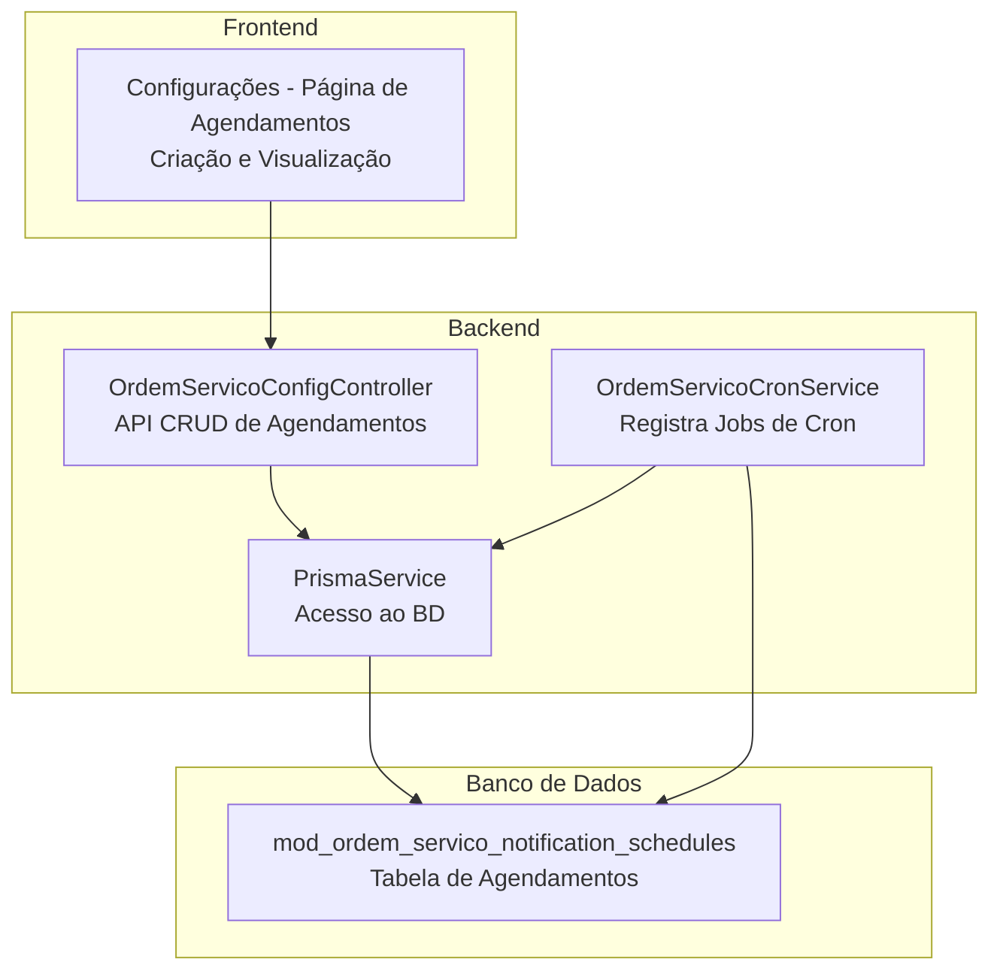
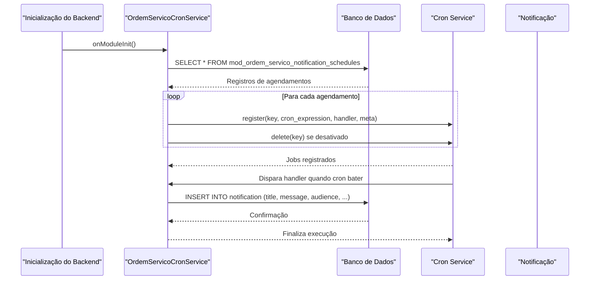
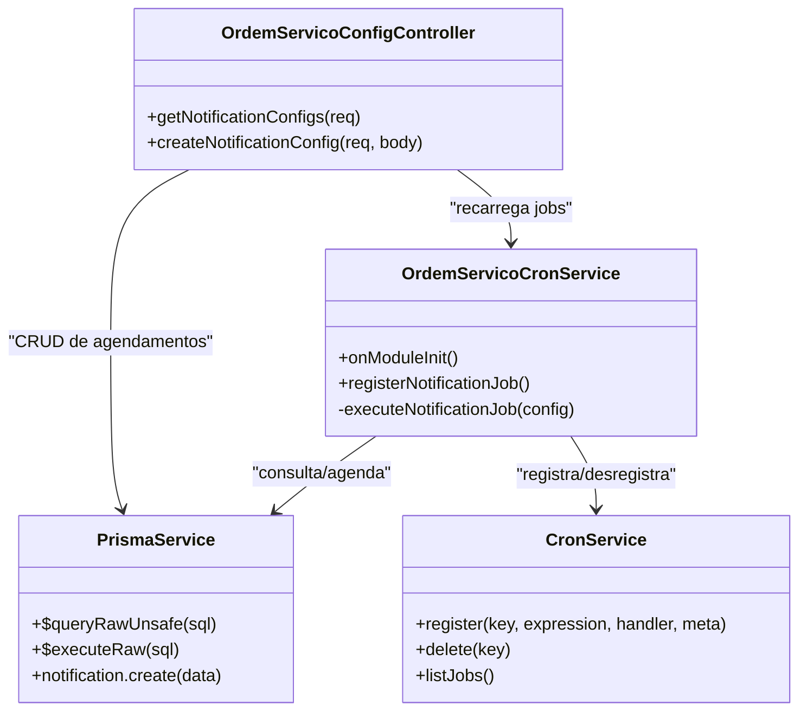
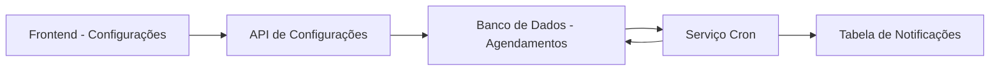

# Programação de Notificações

<cite>
**Arquivos Referenciados neste Documento**
- [ordem-servico-cron.service.ts](file://backend/core/ordem-servico-cron.service.ts)
- [ordem-servico-config.controller.ts](file://backend/core/ordem-servico-config.controller.ts)
- [001_master.sql](file://backend/migrations/001_master.sql)
- [004_add_tables_os.sql](file://backend/migrations/004_add_tables_os.sql)
- [page.tsx](file://frontend/pages/configuracoes/page.tsx)
</cite>

## Sumário
1. [Introdução](#introdução)
2. [Estrutura do Projeto](#estrutura-do-projeto)
3. [Componentes Principais](#componentes-principais)
4. [Visão Geral da Arquitetura](#visão-geral-da-arquitetura)
5. [Análise Detalhada dos Componentes](#análise-detalhada-dos-componentes)
6. [Análise de Dependências](#análise-de-dependências)
7. [Considerações de Desempenho](#considerações-de-desempenho)
8. [Guia de Resolução de Problemas](#guia-de-resolução-de-problemas)
9. [Conclusão](#conclusão)

## Introdução
Este documento explica como funciona o sistema de programação de notificações automáticas do módulo de Ordens de Serviço. Ele aborda:
- Como são criadas, editadas e desativadas agendas de notificação
- O papel do agendamento baseado em expressões cron
- A estrutura da tabela de agendamento e seus campos
- Como o sistema registra automaticamente jobs com base nas configurações do banco de dados
- Questões de timezone, horário de verão e sincronização de data/hora

O objetivo é tornar o assunto acessível para iniciantes e oferecer profundidade técnica para desenvolvedores experientes.

## Estrutura do Projeto
O sistema de notificações está distribuído entre backend e frontend:
- Backend: serviços NestJS que leem as configurações do banco e registram jobs de cron
- Frontend: interface para criar, visualizar e gerenciar agendas de notificação
- Migrações: criação da tabela de agendamento de notificações

**Diagrama fonte**
- [ordem-servico-cron.service.ts](file://backend/core/ordem-servico-cron.service.ts#L1-L84)
- [ordem-servico-config.controller.ts](file://backend/core/ordem-servico-config.controller.ts#L1-L68)
- [001_master.sql](file://backend/migrations/001_master.sql#L28-L41)
- [page.tsx](file://frontend/pages/configuracoes/page.tsx#L750-L949)

**Seção fonte**
- [ordem-servico-cron.service.ts](file://backend/core/ordem-servico-cron.service.ts#L1-L84)
- [ordem-servico-config.controller.ts](file://backend/core/ordem-servico-config.controller.ts#L1-L68)
- [001_master.sql](file://backend/migrations/001_master.sql#L28-L41)
- [page.tsx](file://frontend/pages/configuracoes/page.tsx#L750-L949)

## Componentes Principais
- OrdemServicoCronService: lê a tabela de agendamentos e registra/desregistra jobs de cron automaticamente
- OrdemServicoConfigController: API REST para consulta e criação de agendamentos
- Tabela mod_ordem_servico_notification_schedules: armazena as configurações de cada notificação automática
- Frontend: formulário e listagem de agendamentos com geração de expressões cron

**Seção fonte**
- [ordem-servico-cron.service.ts](file://backend/core/ordem-servico-cron.service.ts#L14-L62)
- [ordem-servico-config.controller.ts](file://backend/core/ordem-servico-config.controller.ts#L18-L46)
- [001_master.sql](file://backend/migrations/001_master.sql#L28-L41)
- [page.tsx](file://frontend/pages/configuracoes/page.tsx#L750-L949)

## Visão Geral da Arquitetura
O fluxo básico é:
- O backend inicializa e lê todos os registros da tabela de agendamentos
- Para cada registro ativo, ele registra um job de cron com a expressão cron correspondente
- Quando o cron dispara, o backend cria uma notificação no sistema com base nos campos do agendamento

**Diagrama fonte**
- [ordem-servico-cron.service.ts](file://backend/core/ordem-servico-cron.service.ts#L14-L62)
- [ordem-servico-cron.service.ts](file://backend/core/ordem-servico-cron.service.ts#L64-L83)

## Análise Detalhada dos Componentes

### Tabela de Agendamento de Notificações
A tabela armazena as configurações de cada notificação automática. Os principais campos são:
- id: identificador único
- tenant_id: vínculo ao locatário
- title: título da notificação
- content: corpo da mensagem
- audience: público-alvo (ex: all, admin, super_admin)
- cron_expression: expressão cron que define o agendamento
- enabled: ativa/desativa o agendamento
- created_at / updated_at: timestamps

A migração original e a migração de sincronização criam a tabela com esses campos e índices para melhor desempenho.

**Seção fonte**
- [001_master.sql](file://backend/migrations/001_master.sql#L28-L41)
- [004_add_tables_os.sql](file://backend/migrations/004_add_tables_os.sql#L18-L32)

### Backend: Registro Automático de Jobs
O serviço de cron:
- Lê todos os agendamentos no banco
- Para cada um ativo, registra um job com chave única baseada no id
- Se estiver desativado, remove o job existente
- Remove jobs antigos que não estão mais na base

Quando o job dispara, ele cria uma notificação com:
- título e mensagem do agendamento
- severidade, público-alvo, origem e módulo

**Seção fonte**
- [ordem-servico-cron.service.ts](file://backend/core/ordem-servico-cron.service.ts#L20-L62)
- [ordem-servico-cron.service.ts](file://backend/core/ordem-servico-cron.service.ts#L64-L83)

### Frontend: Criação e Edição de Agendamentos
A página de configurações permite:
- Criar novos agendamentos com título, conteúdo, público-alvo e frequência
- Escolher entre diário, semanal, mensal, intervalo (minutos) ou personalizado
- Para frequências específicas, o frontend gera a expressão cron correspondente
- Visualizar a lista de agendamentos ativos

Além disso, o frontend exibe a expressão cron associada a cada agendamento e o público-alvo.

**Seção fonte**
- [page.tsx](file://frontend/pages/configuracoes/page.tsx#L750-L949)
- [page.tsx](file://frontend/pages/configuracoes/page.tsx#L400-L438)

### API de Configurações
O controller expõe endpoints:
- GET /api/ordem_servico/config/notifications: retorna todos os agendamentos do tenant
- POST /api/ordem_servico/config/notifications: cria um novo agendamento e força o serviço de cron a recarregar os jobs

**Seção fonte**
- [ordem-servico-config.controller.ts](file://backend/core/ordem-servico-config.controller.ts#L18-L46)

### Expressões Cron e Frequências
O frontend gera expressões cron com base em opções selecionadas:
- Diário: define minuto e hora, executa todo dia
- Semanal: define minuto e hora, executa em um dia da semana
- Mensal: define minuto e hora, executa em um dia do mês
- Intervalo: executa a cada N minutos
- Personalizado: permite inserir manualmente

Funções no frontend:
- getFrequencyType: identifica o tipo de frequência com base na expressão cron
- getTimeFromCron: extrai hora:minuto da expressão cron
- generateCron: gera a expressão cron com base no tipo e parâmetros

Exemplos práticos (sem conteúdo, apenas formato):
- “0 9 * * *” — todos os dias às 09:00
- “0 14 * * 1” — toda segunda-feira às 14:00
- “0 9 15 * *” — todo dia 15 de cada mês às 09:00
- “*/15 * * * *” — a cada 15 minutos

**Seção fonte**
- [page.tsx](file://frontend/pages/configuracoes/page.tsx#L400-L438)

### Como Criar, Editar e Desativar Agendamentos
- Criar: preencher título, conteúdo, público-alvo e frequência; salvar; o backend recarrega os jobs automaticamente
- Editar: alterar qualquer campo e salvar; o backend recarrega os jobs automaticamente
- Desativar: marcar como desativado; o backend remove o job correspondente

O backend recarrega os jobs sempre que um agendamento é criado/atualizado.

**Seção fonte**
- [ordem-servico-config.controller.ts](file://backend/core/ordem-servico-config.controller.ts#L28-L46)
- [ordem-servico-cron.service.ts](file://backend/core/ordem-servico-cron.service.ts#L14-L17)
- [ordem-servico-cron.service.ts](file://backend/core/ordem-servico-cron.service.ts#L49-L57)

## Visão Geral da Arquitetura

**Diagrama fonte**
- [ordem-servico-cron.service.ts](file://backend/core/ordem-servico-cron.service.ts#L1-L84)
- [ordem-servico-config.controller.ts](file://backend/core/ordem-servico-config.controller.ts#L1-L68)

## Análise de Dependências

**Diagrama fonte**
- [ordem-servico-config.controller.ts](file://backend/core/ordem-servico-config.controller.ts#L18-L46)
- [ordem-servico-cron.service.ts](file://backend/core/ordem-servico-cron.service.ts#L20-L62)
- [001_master.sql](file://backend/migrations/001_master.sql#L28-L41)

**Seção fonte**
- [ordem-servico-config.controller.ts](file://backend/core/ordem-servico-config.controller.ts#L18-L46)
- [ordem-servico-cron.service.ts](file://backend/core/ordem-servico-cron.service.ts#L20-L62)
- [001_master.sql](file://backend/migrations/001_master.sql#L28-L41)

## Considerações de Desempenho
- Índices: a migração cria índices para colunas usadas em consultas (enabled, tenant_id), ajudando na performance de leitura e filtragem
- Recarregamento de jobs: o serviço recarrega todos os agendamentos ao iniciar e após cada criação/atualização; isso garante consistência mas pode impactar em ambientes com muitos registros
- Frequências curtas: agendamentos com intervalos menores (ex: a cada 1 minuto) podem gerar alta carga; planeje com cautela

**Seção fonte**
- [001_master.sql](file://backend/migrations/001_master.sql#L329-L331)

## Guia de Resolução de Problemas

### O job não foi registrado
- Verifique se o agendamento está com enabled=true
- Confirme se a expressão cron é válida
- Reinicie o serviço para forçar o recarregamento

### Job registrado mas não dispara
- Valide a expressão cron com base nas opções do frontend
- Confirme o timezone do servidor (ver abaixo)
- Verifique logs do serviço

### A notificação não aparece
- Confirme se o público-alvo (audience) corresponde ao perfil do usuário
- Verifique se a notificação foi criada na tabela de notificações

### Timezone e Horário de Verão
- O backend lê as expressões cron e as registra no serviço de cron. A hora real depende do timezone do servidor onde roda o backend
- Recomenda-se manter o servidor no timezone desejado e evitar alterações de horário de verão durante horários críticos de agendamento
- Se necessário, ajuste as expressões cron manualmente para compensar mudanças de timezone

### Sincronização de Data/Hora
- O backend não converte explicitamente timezone; ele usa a hora do servidor
- Para maior precisão, mantenha o servidor com hora correta e sincronizada (ex: NTP)

**Seção fonte**
- [ordem-servico-cron.service.ts](file://backend/core/ordem-servico-cron.service.ts#L64-L83)

## Conclusão
O sistema de programação de notificações permite criar regras automáticas de envio de notificações com base em expressões cron. O backend lê as configurações do banco e registra/desregistra jobs automaticamente, enquanto o frontend oferece uma interface prática para criar e gerenciar essas regras. Com boas práticas de timezone e sincronização, o sistema pode ser confiável e escalável.