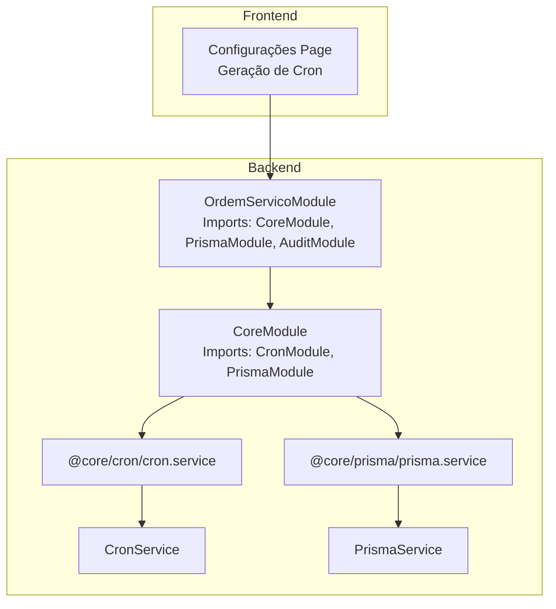
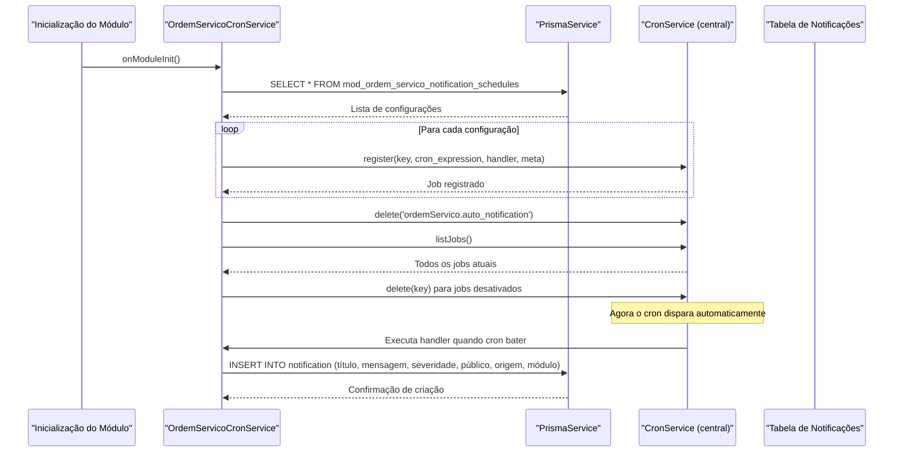
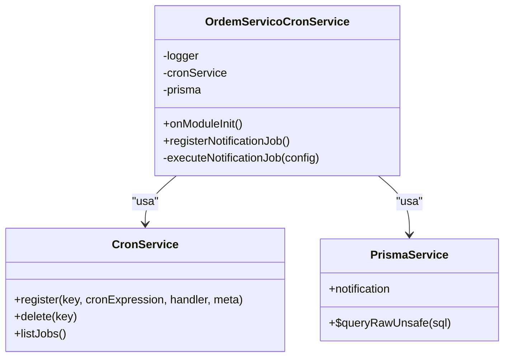
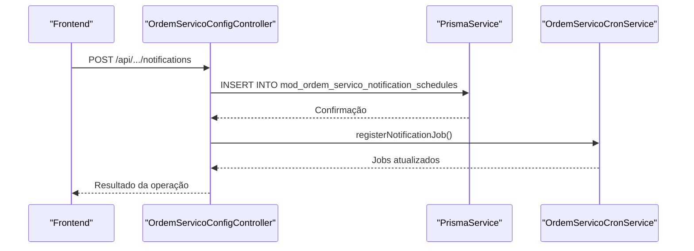
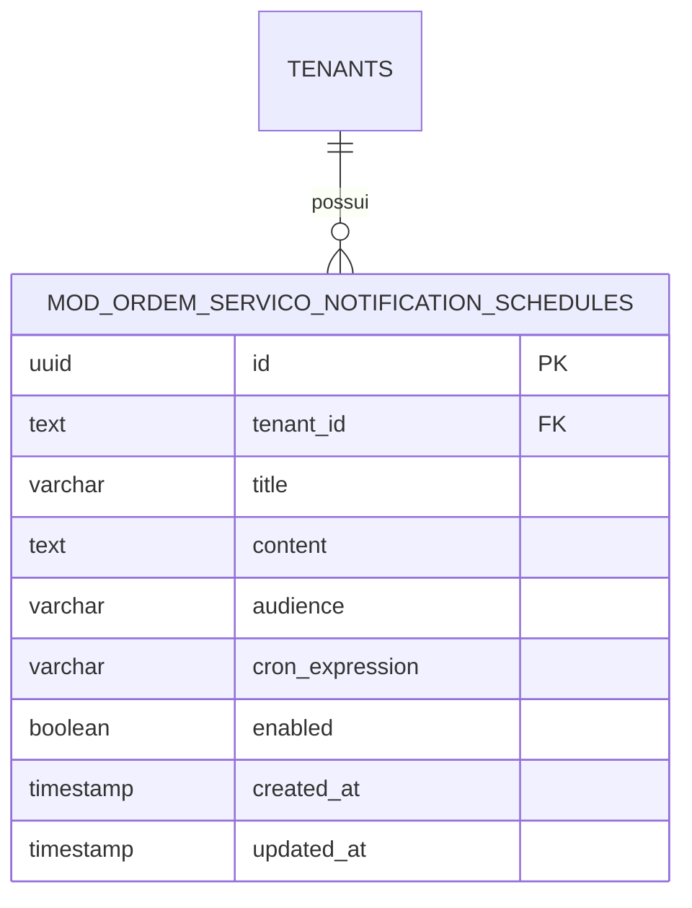
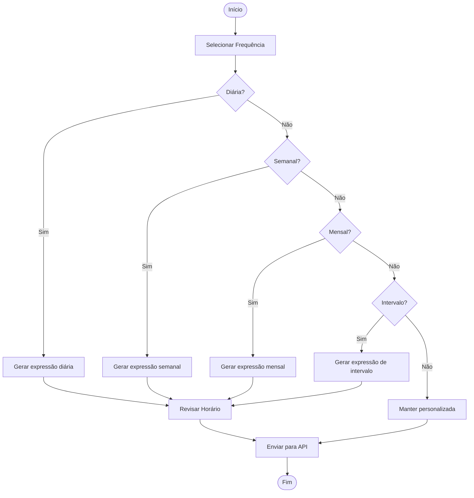
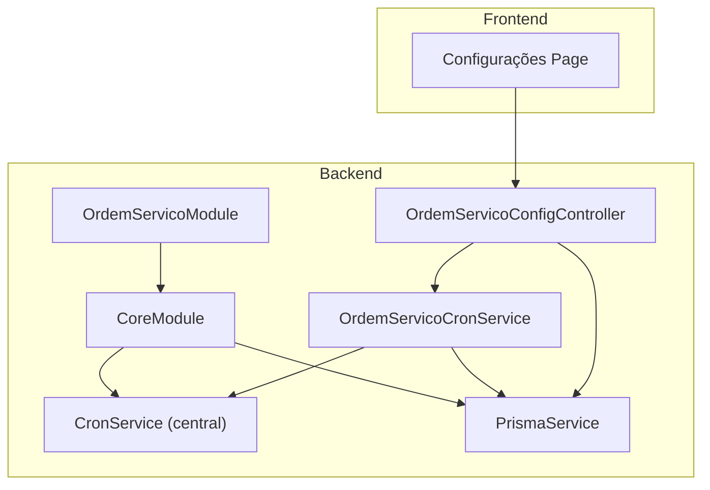
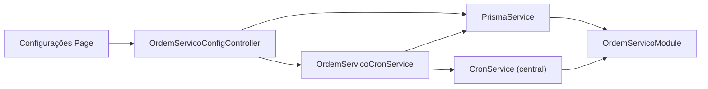

# Sistema de Cron Jobs

<cite>
**Arquivos referenciados neste documento**
- [ordem-servico-cron.service.ts](file://backend/core/ordem-servico-cron.service.ts)
- [ordem-servico-config.controller.ts](file://backend/core/ordem-servico-config.controller.ts)
- [core.module.ts](file://backend/core/core.module.ts)
- [ordem_servico.module.ts](file://backend/ordem_servico.module.ts)
- [001_master.sql](file://backend/migrations/001_master.sql)
- [004_add_tables_os.sql](file://backend/migrations/004_add_tables_os.sql)
- [configuracoes.service.ts](file://backend/configuracoes/configuracoes.service.ts)
- [page.tsx](file://frontend/pages/configuracoes/page.tsx)
- [module.config.json](file://backend/module.config.json)
</cite>

## Sumário
1. [Introdução](#introdução)
2. [Estrutura do Projeto](#estrutura-do-projeto)
3. [Componentes Principais](#componentes-principais)
4. [Visão Geral da Arquitetura](#visão-geral-da-arquitetura)
5. [Análise Detalhada dos Componentes](#análise-detalhada-dos-componentes)
6. [Análise de Dependências](#análise-de-dependências)
7. [Considerações de Desempenho](#considerações-de-desempenho)
8. [Guia de Solução de Problemas](#guia-de-solução-de-problemas)
9. [Conclusão](#conclusão)

## Introdução
Este documento apresenta o sistema de cron jobs do módulo de notificações automáticas, focando na implementação do OrdemServicoCronService, registro de jobs, gerenciamento de agendamentos e integração com o serviço de cron central. O sistema permite criar regras de notificação programadas (via expressões cron) que geram notificações no sistema automaticamente, com base em configurações armazenadas em uma tabela de agendamentos.

## Estrutura do Projeto
O módulo de ordens de serviço é composto pelos seguintes elementos relevantes para o sistema de cron:
- Backend: OrdemServicoCronService (registro e execução de jobs), OrdemServicoConfigController (API de configuração), CoreModule (injeção de dependências), OrdemServicoModule (módulo principal).
- Frontend: Interface de configuração de notificações automáticas com geração de expressões cron.
- Migrations: Tabelas de configurações e agendamentos de notificações.
- Configuração do módulo: Declaração de rotas e permissões.

**Diagrama fonte**
- [core.module.ts](file://backend/core/core.module.ts#L1-L13)
- [ordem_servico.module.ts](file://backend/ordem_servico.module.ts#L1-L35)

**Seção fonte**
- [core.module.ts](file://backend/core/core.module.ts#L1-L13)
- [ordem_servico.module.ts](file://backend/ordem_servico.module.ts#L1-L35)

## Componentes Principais
- OrdemServicoCronService: Responsável por carregar as configurações de notificação agendadas e registrar/excluir jobs no serviço de cron central.
- OrdemServicoConfigController: Fornece endpoints para criar e consultar configurações de notificação.
- Tabela de agendamentos: Armazena regras de notificação programadas com expressões cron.
- Frontend de configurações: Interface para criar e gerenciar regras de notificação.

**Seção fonte**
- [ordem-servico-cron.service.ts](file://backend/core/ordem-servico-cron.service.ts#L1-L84)
- [ordem-servico-config.controller.ts](file://backend/core/ordem-servico-config.controller.ts#L1-L254)

## Visão Geral da Arquitetura
O fluxo básico do sistema de cron funciona da seguinte forma:
- Na inicialização do módulo, o OrdemServicoCronService consulta a tabela de agendamentos.
- Para cada configuração ativa, ele registra um job no serviço de cron central usando a expressão cron correspondente.
- Quando o cron dispara, o job executa a função de criação de notificação.
- O frontend permite criar novas regras de notificação com diferentes frequências (diária, semanal, mensal, intervalo, personalizada).

**Diagrama fonte**
- [ordem-servico-cron.service.ts](file://backend/core/ordem-servico-cron.service.ts#L14-L62)
- [ordem-servico-config.controller.ts](file://backend/core/ordem-servico-config.controller.ts#L28-L46)

## Análise Detalhada dos Componentes

### OrdemServicoCronService
Responsável pelo ciclo de vida completo dos jobs de notificação automática:
- Inicialização: ao iniciar o módulo, carrega todas as configurações de notificação agendadas.
- Registro de jobs: para cada configuração ativa, registra um job no serviço de cron central com chave única e metadados.
- Limpeza de jobs: remove jobs antigos que não estão mais ativos e faz limpeza de chaves globais.
- Execução: ao ser disparado, cria uma notificação no sistema com título, mensagem, severidade e público-alvo.

**Diagrama fonte**
- [ordem-servico-cron.service.ts](file://backend/core/ordem-servico-cron.service.ts#L5-L84)

**Seção fonte**
- [ordem-servico-cron.service.ts](file://backend/core/ordem-servico-cron.service.ts#L14-L83)

### OrdemServicoConfigController
Fornece endpoints para gerenciar as configurações de notificação:
- GET /api/ordem_servico/config/notifications: recupera todas as configurações de notificação.
- POST /api/ordem_servico/config/notifications: insere uma nova configuração e força o re-registro de jobs.

**Diagrama fonte**
- [ordem-servico-config.controller.ts](file://backend/core/ordem-servico-config.controller.ts#L28-L46)

**Seção fonte**
- [ordem-servico-config.controller.ts](file://backend/core/ordem-servico-config.controller.ts#L18-L46)

### Tabela de Agendamentos de Notificações
A tabela armazena as regras de notificação programadas:
- id: identificador único.
- tenant_id: vínculo ao locatário.
- title: título da notificação.
- content: conteúdo da notificação.
- audience: público-alvo (ex: all, admin, super_admin).
- cron_expression: expressão cron que define a frequência.
- enabled: indica se o job está ativo.
- created_at/updated_at: timestamps de criação e atualização.

**Diagrama fonte**
- [001_master.sql](file://backend/migrations/001_master.sql#L28-L41)

**Seção fonte**
- [001_master.sql](file://backend/migrations/001_master.sql#L28-L41)

### Frontend de Configurações
O frontend permite criar regras de notificação com diferentes frequências:
- Frequências predefinidas: diária, semanal, mensal, intervalo (minutos).
- Horário: extraído da expressão cron.
- Validação e geração de expressões cron para diferentes padrões.

**Diagrama fonte**
- [page.tsx](file://frontend/pages/configuracoes/page.tsx#L421-L438)

**Seção fonte**
- [page.tsx](file://frontend/pages/configuracoes/page.tsx#L400-L443)

## Visão Geral da Arquitetura

**Diagrama fonte**
- [ordem_servico.module.ts](file://backend/ordem_servico.module.ts#L11-L30)
- [core.module.ts](file://backend/core/core.module.ts#L7-L12)
- [ordem-servico-cron.service.ts](file://backend/core/ordem-servico-cron.service.ts#L1-L12)
- [ordem-servico-config.controller.ts](file://backend/core/ordem-servico-config.controller.ts#L1-L16)

**Seção fonte**
- [ordem_servico.module.ts](file://backend/ordem_servico.module.ts#L11-L30)
- [core.module.ts](file://backend/core/core.module.ts#L7-L12)

## Análise Detalhada dos Componentes

### Registro de Jobs
- O OrdemServicoCronService carrega todas as configurações de notificação agendadas.
- Para cada configuração com enabled=true, registra um job no serviço de cron central com:
  - key única baseada no ID da configuração.
  - cron_expression.
  - handler assíncrono que executa a criação de notificação.
  - metadados com nome, descrição e URL de configurações.
- Remove jobs antigos e faz limpeza de chaves globais.

**Seção fonte**
- [ordem-servico-cron.service.ts](file://backend/core/ordem-servico-cron.service.ts#L20-L62)

### Execução de Jobs
- Ao ser disparado, o job:
  - Registra no log a execução.
  - Cria uma notificação no sistema com título, mensagem, severidade, público-alvo, origem e módulo.
  - Em caso de erro, registra no log.

**Seção fonte**
- [ordem-servico-cron.service.ts](file://backend/core/ordem-servico-cron.service.ts#L64-L83)

### Criação de Configurações via API
- O endpoint POST /api/ordem_servico/config/notifications:
  - Insere uma nova configuração de notificação agendada.
  - Chama registerNotificationJob() para sincronizar os jobs.

**Seção fonte**
- [ordem-servico-config.controller.ts](file://backend/core/ordem-servico-config.controller.ts#L28-L46)

### Relacionamento com o Banco de Dados
- A tabela mod_ordem_servico_notification_schedules armazena as configurações de notificação.
- A migração 001_master.sql define a estrutura da tabela e índices.
- A migração 004_add_tables_os.sql cria uma tabela diferente (mod_ordemservico_notification_schedules) com relacionamentos adicionais, mas o serviço utiliza a tabela definida em 001_master.sql.

**Seção fonte**
- [001_master.sql](file://backend/migrations/001_master.sql#L28-L41)
- [004_add_tables_os.sql](file://backend/migrations/004_add_tables_os.sql#L18-L32)

### Frontend de Configurações
- O frontend gera expressões cron com base nas escolhas do usuário:
  - Frequência diária, semanal, mensal, intervalo.
  - Extração de horário da expressão cron.
  - Validação e envio para a API.

**Seção fonte**
- [page.tsx](file://frontend/pages/configuracoes/page.tsx#L421-L438)

## Análise de Dependências

**Diagrama fonte**
- [core.module.ts](file://backend/core/core.module.ts#L7-L12)
- [ordem-servico-config.controller.ts](file://backend/core/ordem-servico-config.controller.ts#L13-L16)
- [ordem-servico-cron.service.ts](file://backend/core/ordem-servico-cron.service.ts#L9-L12)

**Seção fonte**
- [core.module.ts](file://backend/core/core.module.ts#L7-L12)
- [ordem-servico-config.controller.ts](file://backend/core/ordem-servico-config.controller.ts#L13-L16)
- [ordem-servico-cron.service.ts](file://backend/core/ordem-servico-cron.service.ts#L9-L12)

## Considerações de Desempenho
- Consultas: O serviço carrega todas as configurações de notificação agendadas. Em ambientes com muitos registros, considere adicionar filtros ou paginação.
- Índices: A migração 001_master.sql inclui índices para enabled e tenant_id, o que melhora a performance de consultas.
- Frequência de execução: Avalie a carga do sistema com base nas expressões cron e evite sobrecarregar o servidor com muitos jobs simultâneos.

[Sem fonte, pois esta seção fornece orientações gerais]

## Guia de Solução de Problemas

### Falhas na Inicialização
- Verifique se o serviço de cron central está disponível e se as dependências foram injetadas corretamente.
- Confirme se o módulo CoreModule foi importado corretamente no OrdemServicoModule.

**Seção fonte**
- [core.module.ts](file://backend/core/core.module.ts#L7-L12)
- [ordem_servico.module.ts](file://backend/ordem_servico.module.ts#L11-L30)

### Jobs Não Estão sendo Registrados
- Confirme se as configurações têm enabled=true e se a cron_expression é válida.
- Verifique se o método registerNotificationJob() foi chamado após a criação de uma nova configuração.

**Seção fonte**
- [ordem-servico-cron.service.ts](file://backend/core/ordem-servico-cron.service.ts#L20-L62)
- [ordem-servico-config.controller.ts](file://backend/core/ordem-servico-config.controller.ts#L43-L43)

### Erros ao Criar Notificações
- Verifique o log de erros do OrdemServicoCronService durante a execução do job.
- Confirme se a tabela de notificações está presente e se há permissões adequadas no banco de dados.

**Seção fonte**
- [ordem-servico-cron.service.ts](file://backend/core/ordem-servico-cron.service.ts#L64-L83)

### Desativação de Jobs
- Para desativar um job, defina enabled=false na configuração correspondente e chame registerNotificationJob() para remover o job do serviço de cron central.

**Seção fonte**
- [ordem-servico-cron.service.ts](file://backend/core/ordem-servico-cron.service.ts#L45-L47)
- [ordem-servico-config.controller.ts](file://backend/core/ordem-servico-config.controller.ts#L28-L46)

## Conclusão
O sistema de cron jobs do módulo de notificações automáticas permite criar regras de notificação programadas com base em expressões cron. O OrdemServicoCronService é responsável por registrar e gerenciar esses jobs, enquanto o OrdemServicoConfigController fornece a API para criar e consultar configurações. O frontend oferece uma interface intuitiva para definir frequências e horários. Com os índices apropriados e uma gestão cuidadosa dos jobs, o sistema pode ser escalável e confiável.