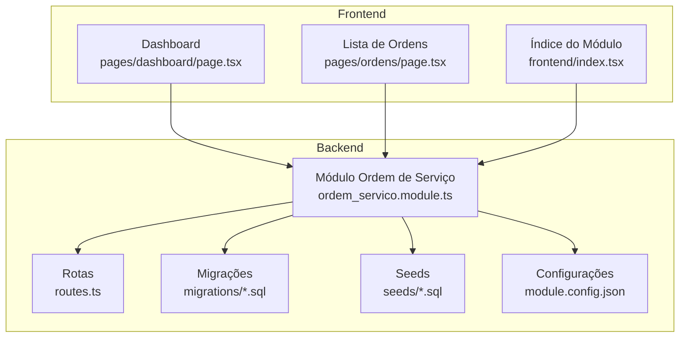
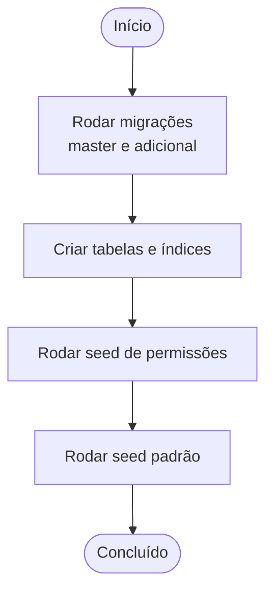
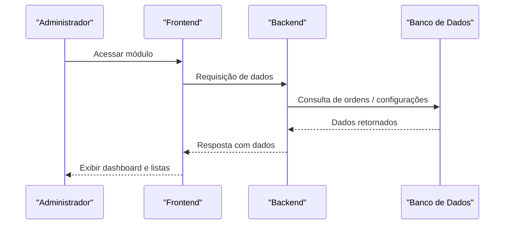
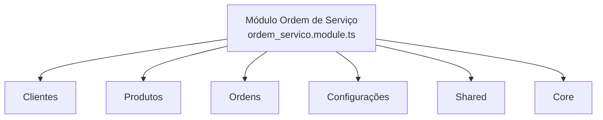
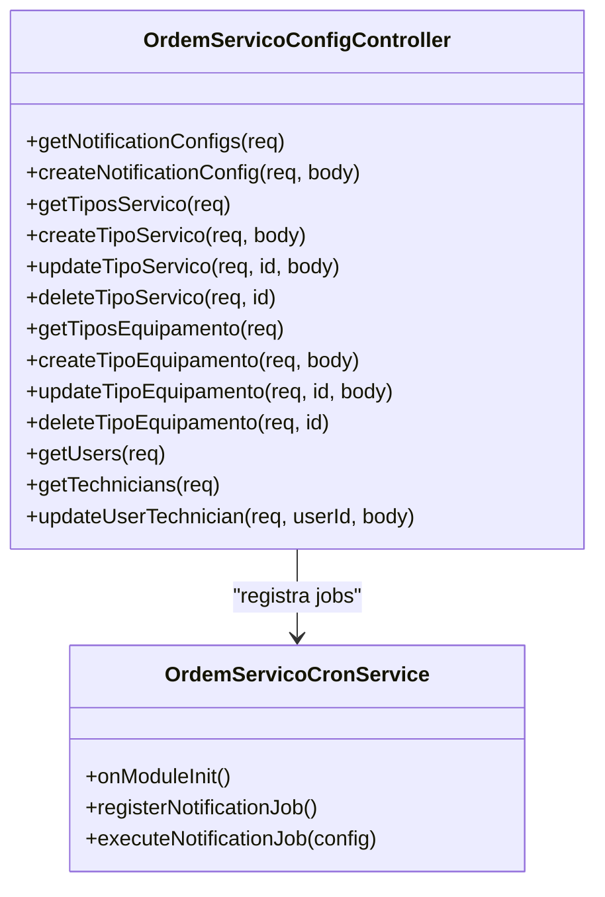
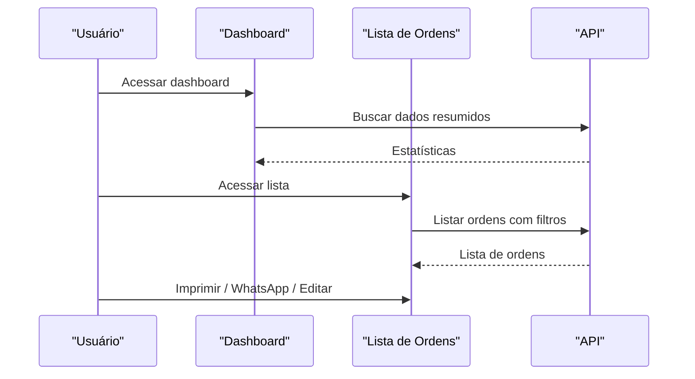
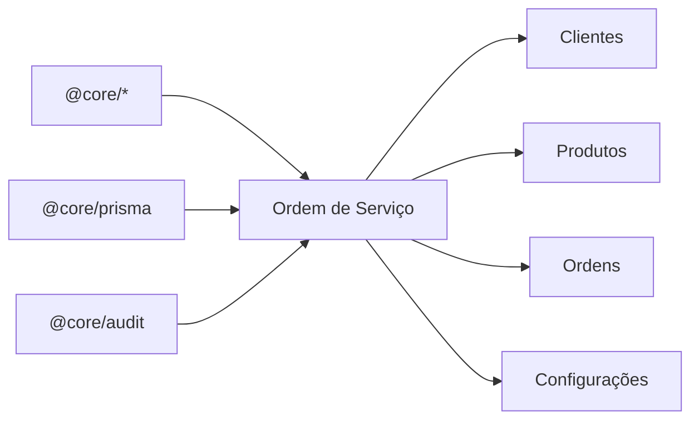

# Primeiros Passos

<cite>
**Arquivos Referenciados Neste Documento**
- [README.md](file://README.md)
- [backend/README.md](file://backend/README.md)
- [module.json](file://module.json)
- [backend/module.json](file://backend/module.json)
- [backend/module.config.json](file://backend/module.config.json)
- [backend/migrations/001_master.sql](file://backend/migrations/001_master.sql)
- [backend/migrations/004_add_tables_os.sql](file://backend/migrations/004_add_tables_os.sql)
- [backend/seeds/seed.sql](file://backend/seeds/seed.sql)
- [backend/seeds/seeds_os.sql](file://backend/seeds/seeds_os.sql)
- [backend/seeds/permissions_seed.sql](file://backend/seeds/permissions_seed.sql)
- [backend/ordem_servico.module.ts](file://backend/ordem_servico.module.ts)
- [backend/routes.ts](file://backend/routes.ts)
- [backend/core/ordem-servico-config.controller.ts](file://backend/core/ordem-servico-config.controller.ts)
- [backend/core/ordem-servico-cron.service.ts](file://backend/core/ordem-servico-cron.service.ts)
- [frontend/index.tsx](file://frontend/index.tsx)
- [frontend/pages/dashboard/page.tsx](file://frontend/pages/dashboard/page.tsx)
- [frontend/pages/ordens/page.tsx](file://frontend/pages/ordens/page.tsx)
</cite>

## Sumário
1. [Introdução](#introdução)
2. [Estrutura do Projeto](#estrutura-do-projeto)
3. [Pré-requisitos do Sistema](#pré-requisitos-do-sistema)
4. [Configuração do Ambiente de Desenvolvimento](#configuração-do-ambiente-de-desenvolvimento)
5. [Instalação de Dependências](#instalação-de-dependências)
6. [Execução de Migrações e Seeds](#execução-de-migrações-e-seeds)
7. [Configuração Inicial e Primeiros Passos](#configuração-inicial-e-primeiros-passos)
8. [Exemplos Práticos de Uso Básico](#exemplos-práticos-de-uso-básico)
9. [Variáveis de Ambiente e Configurações](#variáveis-de-ambiente-e-configurações)
10. [Arquitetura Geral](#arquitetura-geral)
11. [Análise Detalhada de Componentes](#análise-detalhada-de-componentes)
12. [Análise de Dependências](#análise-de-dependências)
13. [Considerações de Desempenho](#considerações-de-desempenho)
14. [Guia de Solução de Problemas](#guia-de-solução-de-problemas)
15. [Conclusão](#conclusão)

## Introdução
Este guia apresenta os passos essenciais para configurar e instalar o módulo de Ordens de Serviço em um sistema multitenant. Ele cobre desde os pré-requisitos até a configuração inicial, migrações do banco de dados, seeds, permissões e primeiros passos no sistema. Também inclui orientações práticas para criar usuários administradores, entender as rotas e endpoints disponíveis, e explorar o frontend.

## Estrutura do Projeto
O módulo é composto por:
- Backend NestJS com módulos específicos (clientes, produtos, ordens, configurações, compartilhado, core)
- Frontend Next.js com páginas e componentes voltados à gestão de ordens de serviço
- Migrações e seeds para criação de tabelas e dados iniciais
- Arquivos de configuração do módulo e do backend

**Diagrama fonte**
- [backend/ordem_servico.module.ts](file://backend/ordem_servico.module.ts#L1-L35)
- [backend/routes.ts](file://backend/routes.ts#L1-L17)
- [backend/migrations/001_master.sql](file://backend/migrations/001_master.sql#L1-L622)
- [backend/seeds/permissions_seed.sql](file://backend/seeds/permissions_seed.sql#L1-L329)
- [backend/module.config.json](file://backend/module.config.json#L1-L79)
- [frontend/pages/dashboard/page.tsx](file://frontend/pages/dashboard/page.tsx#L1-L437)
- [frontend/pages/ordens/page.tsx](file://frontend/pages/ordens/page.tsx#L1-L684)
- [frontend/index.tsx](file://frontend/index.tsx#L1-L22)

**Seção fonte**
- [README.md](file://README.md#L1-L59)
- [backend/README.md](file://backend/README.md#L1-L59)

## Pré-requisitos do Sistema
- Sistema operacional compatível com Node.js e PostgreSQL
- Node.js LTS instalado
- PostgreSQL com suporte a extensões PL/pgSQL e UUID
- Um ambiente com suporte a autenticação JWT e módulos de permissões
- Acesso ao banco de dados com privilégios para criar tabelas, índices e triggers

**Seção fonte**
- [backend/migrations/001_master.sql](file://backend/migrations/001_master.sql#L1-L622)
- [backend/migrations/004_add_tables_os.sql](file://backend/migrations/004_add_tables_os.sql#L1-L80)

## Configuração do Ambiente de Desenvolvimento
- Clone o repositório e entre no diretório do módulo
- Instale as dependências do backend e frontend conforme as instruções abaixo
- Configure as variáveis de ambiente (veja a seção de Variáveis de Ambiente)
- Certifique-se de que o servidor PostgreSQL esteja rodando e acessível

## Instalação de Dependências
- Backend (NestJS):
  - Navegue até o diretório backend
  - Execute o comando de instalação de dependências (ex: npm install)
  - Inicie o servidor de desenvolvimento (ex: npm run start:dev)
- Frontend (Next.js):
  - Navegue até o diretório frontend
  - Execute o comando de instalação de dependências (ex: npm install)
  - Inicie o servidor de desenvolvimento (ex: npm run dev)

**Seção fonte**
- [frontend/pages/ordens/page.tsx](file://frontend/pages/ordens/page.tsx#L41-L152)

## Execução de Migrações e Seeds
- Migrações:
  - Execute as migrações SQL localizadas em backend/migrations/
  - O arquivo master cria todas as tabelas e índices necessários
  - O arquivo adicional sincroniza campos e tabelas ausentes em ambientes específicos
- Seeds:
  - Execute os scripts de seed em backend/seeds/ para popular dados iniciais
  - O seed de permissões cria templates e permissões padrão
  - Seeds adicionais configuram termos e condições iniciais

**Diagrama fonte**
- [backend/migrations/001_master.sql](file://backend/migrations/001_master.sql#L1-L622)
- [backend/migrations/004_add_tables_os.sql](file://backend/migrations/004_add_tables_os.sql#L1-L80)
- [backend/seeds/permissions_seed.sql](file://backend/seeds/permissions_seed.sql#L1-L329)
- [backend/seeds/seed.sql](file://backend/seeds/seed.sql#L1-L18)

**Seção fonte**
- [backend/migrations/001_master.sql](file://backend/migrations/001_master.sql#L1-L622)
- [backend/migrations/004_add_tables_os.sql](file://backend/migrations/004_add_tables_os.sql#L1-L80)
- [backend/seeds/permissions_seed.sql](file://backend/seeds/permissions_seed.sql#L1-L329)
- [backend/seeds/seed.sql](file://backend/seeds/seed.sql#L1-L18)
- [backend/seeds/seeds_os.sql](file://backend/seeds/seeds_os.sql#L1-L69)

## Configuração Inicial e Primeiros Passos
- Crie um usuário administrador no sistema (super admin ou admin) e atribua papéis no módulo
- Execute as migrações e seeds para criar as tabelas e dados iniciais
- Acesse o frontend e navegue pelas páginas do módulo:
  - Dashboard
  - Lista de Ordens
  - Clientes
  - Produtos/Serviços
  - Configurações

**Diagrama fonte**
- [frontend/pages/dashboard/page.tsx](file://frontend/pages/dashboard/page.tsx#L283-L437)
- [frontend/pages/ordens/page.tsx](file://frontend/pages/ordens/page.tsx#L204-L267)
- [backend/core/ordem-servico-config.controller.ts](file://backend/core/ordem-servico-config.controller.ts#L1-L254)

**Seção fonte**
- [frontend/pages/dashboard/page.tsx](file://frontend/pages/dashboard/page.tsx#L283-L437)
- [frontend/pages/ordens/page.tsx](file://frontend/pages/ordens/page.tsx#L166-L684)
- [backend/core/ordem-servico-config.controller.ts](file://backend/core/ordem-servico-config.controller.ts#L1-L254)

## Exemplos Práticos de Uso Básico
- Criar um novo cadastro de cliente:
  - Acesse a página de Clientes e preencha os dados obrigatórios
- Registrar um novo produto/serviço:
  - Acesse a página de Produtos/Serviços e insira as informações
- Criar uma ordem de serviço:
  - Acesse a página de Ordens e utilize o botão “Nova Ordem”
- Visualizar e imprimir uma ordem:
  - Na lista de Ordens, clique em “Visualizar” e depois em “Imprimir” (A4 ou 50/80mm)
- Atribuir papéis de técnico/admin:
  - Acesse Configurações e gerencie os papéis de usuários

**Seção fonte**
- [frontend/pages/ordens/page.tsx](file://frontend/pages/ordens/page.tsx#L379-L383)
- [frontend/pages/dashboard/page.tsx](file://frontend/pages/dashboard/page.tsx#L295-L307)

## Variáveis de Ambiente e Configurações
- Backend:
  - Configurações do módulo e rotas são definidas em backend/module.config.json
  - As permissões e menus são declarados em module.json e backend/module.json
- Frontend:
  - A URL da API pode ser configurada via NEXT_PUBLIC_API_URL
  - O frontend consome tokens de autenticação de cookies ou sessionStorage

**Seção fonte**
- [backend/module.config.json](file://backend/module.config.json#L1-L79)
- [module.json](file://module.json#L1-L48)
- [backend/module.json](file://backend/module.json#L1-L48)
- [frontend/pages/ordens/page.tsx](file://frontend/pages/ordens/page.tsx#L41-L152)

## Arquitetura Geral
O módulo segue uma arquitetura modular com:
- Módulo principal que importa os submódulos de clientes, produtos, ordens e configurações
- Controllers e serviços para gerenciar entidades e regras de negócio
- Frontend com páginas e componentes reutilizáveis
- Migrações e seeds para provisionamento inicial

**Diagrama fonte**
- [backend/ordem_servico.module.ts](file://backend/ordem_servico.module.ts#L1-L35)

**Seção fonte**
- [backend/ordem_servico.module.ts](file://backend/ordem_servico.module.ts#L1-L35)

## Análise Detalhada de Componentes
### Configurações do Módulo
- O controller de configurações expõe endpoints para notificações automáticas, tipos de serviço, tipos de equipamento e gestão de usuários/técnicos
- O serviço de cron registra jobs de notificação com base nas configurações

**Diagrama fonte**
- [backend/core/ordem-servico-config.controller.ts](file://backend/core/ordem-servico-config.controller.ts#L1-L254)
- [backend/core/ordem-servico-cron.service.ts](file://backend/core/ordem-servico-cron.service.ts#L1-L84)

**Seção fonte**
- [backend/core/ordem-servico-config.controller.ts](file://backend/core/ordem-servico-config.controller.ts#L1-L254)
- [backend/core/ordem-servico-cron.service.ts](file://backend/core/ordem-servico-cron.service.ts#L1-L84)

### Frontend: Dashboard e Lista de Ordens
- O dashboard apresenta atalhos e cards com ordens filtradas por status
- A página de ordens permite busca, filtros, impressão e envio via WhatsApp

**Diagrama fonte**
- [frontend/pages/dashboard/page.tsx](file://frontend/pages/dashboard/page.tsx#L283-L437)
- [frontend/pages/ordens/page.tsx](file://frontend/pages/ordens/page.tsx#L204-L267)

**Seção fonte**
- [frontend/pages/dashboard/page.tsx](file://frontend/pages/dashboard/page.tsx#L283-L437)
- [frontend/pages/ordens/page.tsx](file://frontend/pages/ordens/page.tsx#L166-L684)

## Análise de Dependências
- O módulo depende de outros módulos do sistema (core, prisma, audit)
- Importa submódulos de clientes, produtos, ordens e configurações
- As rotas são registradas no backend e expostas no frontend

**Diagrama fonte**
- [backend/ordem_servico.module.ts](file://backend/ordem_servico.module.ts#L1-L35)
- [backend/routes.ts](file://backend/routes.ts#L1-L17)

**Seção fonte**
- [backend/ordem_servico.module.ts](file://backend/ordem_servico.module.ts#L1-L35)
- [backend/routes.ts](file://backend/routes.ts#L1-L17)

## Considerações de Desempenho
- As migrações incluem índices otimizados para consultas frequentes (clientes, produtos, ordens)
- Triggers automatizam atualizações de timestamps
- Recomenda-se manter os índices e triggers conforme as migrações para desempenho adequado

**Seção fonte**
- [backend/migrations/001_master.sql](file://backend/migrations/001_master.sql#L325-L396)
- [backend/migrations/001_master.sql](file://backend/migrations/001_master.sql#L400-L428)

## Guia de Solução de Problemas
- Erro ao carregar ordens:
  - Verifique se o token de autenticação está presente nos headers
  - Confirme se a URL da API está correta (NEXT_PUBLIC_API_URL)
- Falha nas permissões:
  - Execute o seed de permissões para criar templates e permissões padrão
- Problemas com notificações automáticas:
  - Revise as configurações de notificação e o serviço cron

**Seção fonte**
- [frontend/pages/ordens/page.tsx](file://frontend/pages/ordens/page.tsx#L41-L152)
- [backend/seeds/permissions_seed.sql](file://backend/seeds/permissions_seed.sql#L1-L329)
- [backend/core/ordem-servico-cron.service.ts](file://backend/core/ordem-servico-cron.service.ts#L20-L62)

## Conclusão
Com este guia, você pode configurar e instalar o módulo de Ordens de Serviço, executar migrações e seeds, criar usuários administradores e começar a utilizar as funcionalidades básicas do sistema. Utilize os primeiros passos e os exemplos práticos para familiarizar-se com o fluxo de trabalho e expandir as configurações conforme necessário.