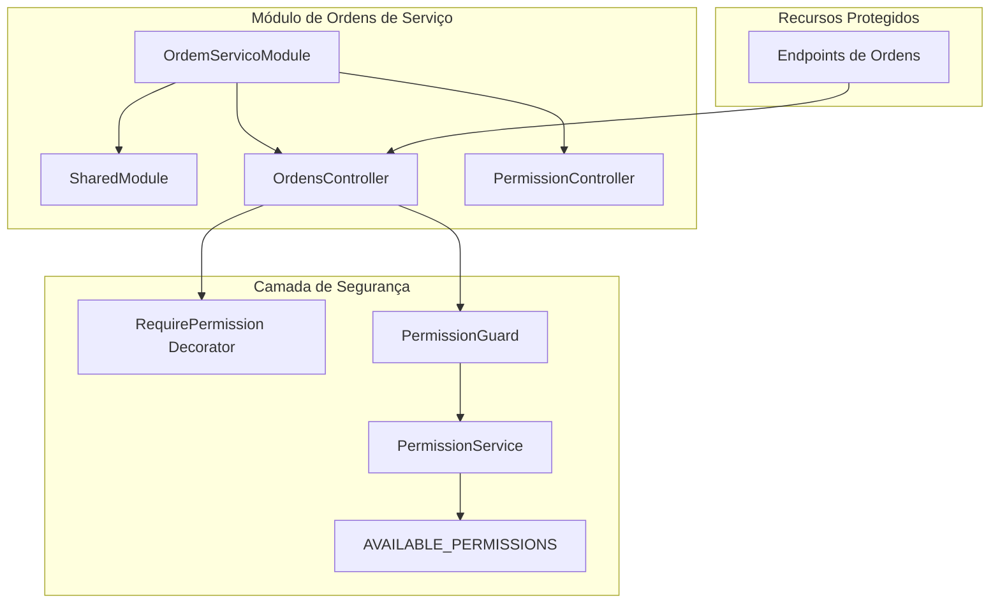
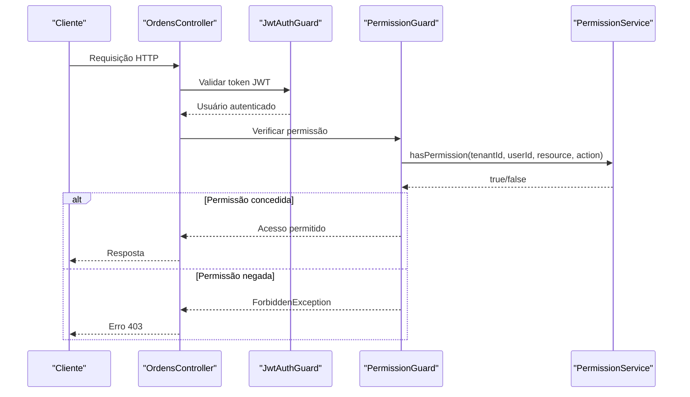
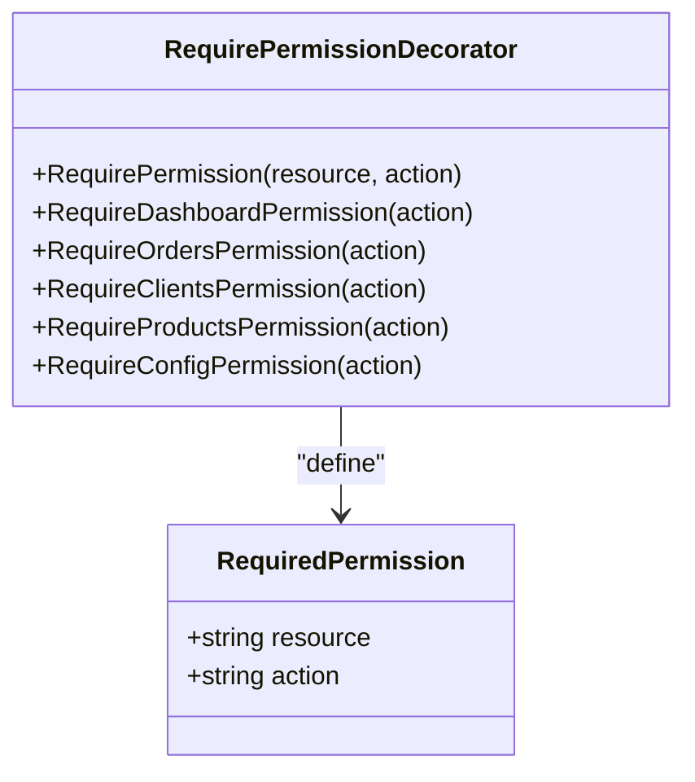
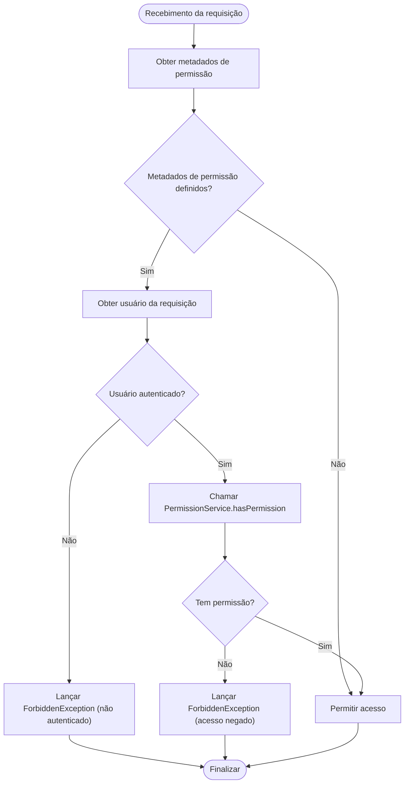
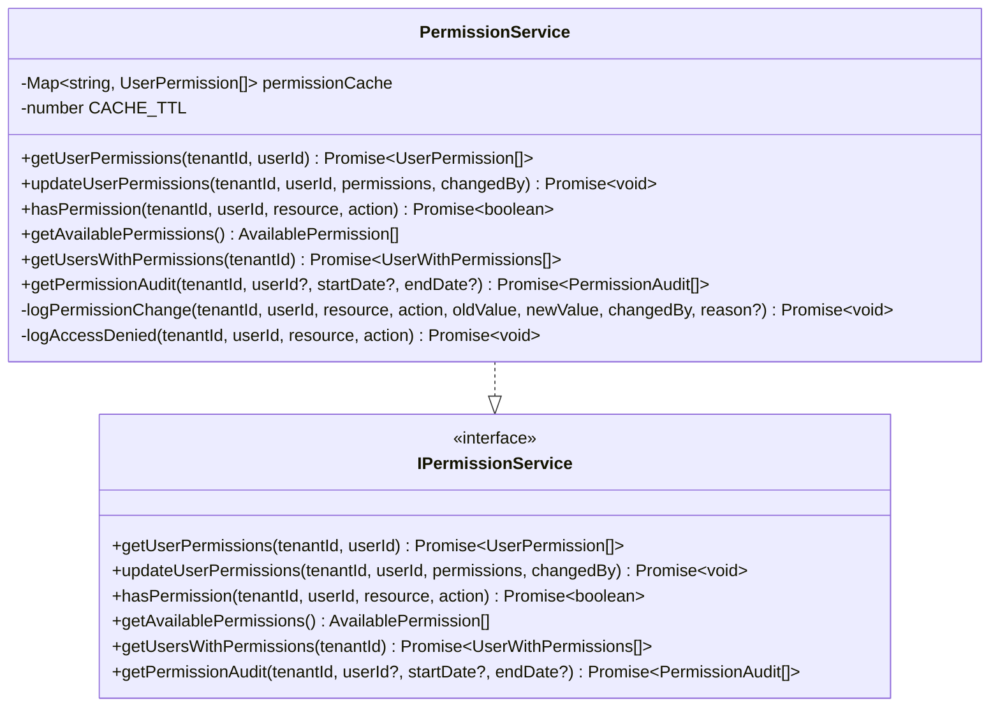
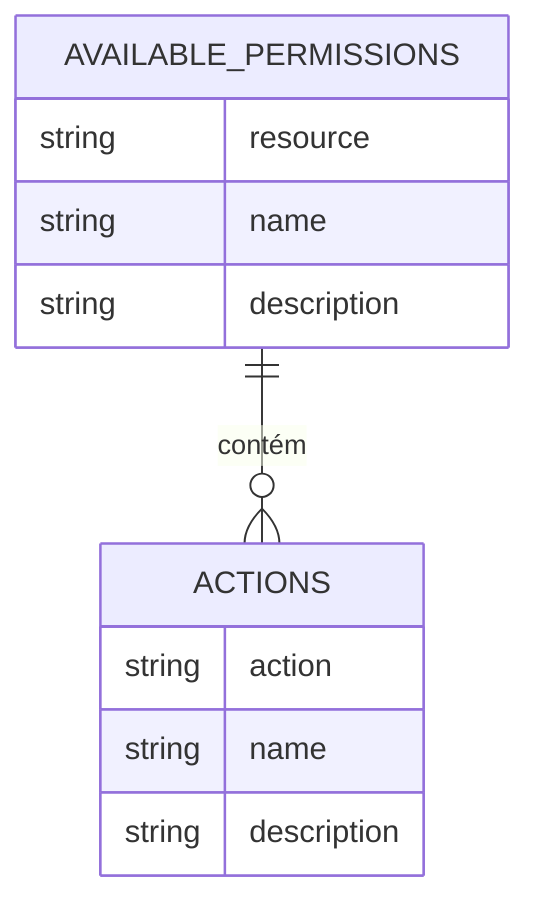
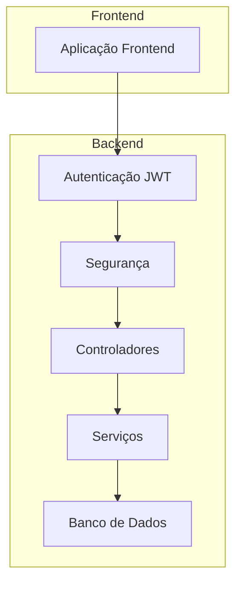
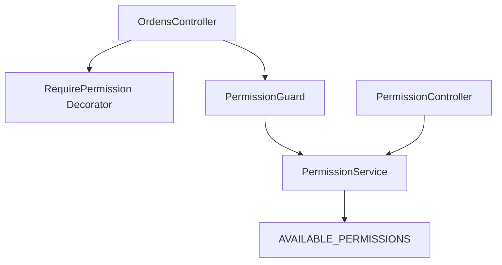

# Autenticação e Autorização

<cite>
**Arquivos referenciados neste documento**
- [require-permission.decorator.ts](file://backend/shared/decorators/require-permission.decorator.ts)
- [permission.guard.ts](file://backend/shared/guards/permission.guard.ts)
- [permission.service.ts](file://backend/shared/services/permission.service.ts)
- [available-permissions.ts](file://backend/shared/constants/available-permissions.ts)
- [permission.controller.ts](file://backend/shared/controllers/permission.controller.ts)
- [ordens.controller.ts](file://backend/ordens/ordens.controller.ts)
- [ordem_servico.module.ts](file://backend/ordem_servico.module.ts)
</cite>

## Sumário
1. [Introdução](#introdução)
2. [Estrutura do Projeto](#estrutura-do-projeto)
3. [Componentes Principais](#componentes-principais)
4. [Visão Geral da Arquitetura](#visão-geral-da-arquitetura)
5. [Análise Detalhada dos Componentes](#análise-detalhada-dos-componentes)
6. [Análise de Dependências](#análise-de-dependências)
7. [Considerações de Desempenho](#considerações-de-desempenho)
8. [Guia de Solução de Problemas](#guia-de-solução-de-problemas)
9. [Conclusão](#conclusão)

## Introdução
Este documento descreve o sistema de autenticação e autorização implementado no módulo de Ordens de Serviço. Ele explica como os tokens JWT são gerados e validados, como o mecanismo de permissões baseado em recursos e ações (RBAC) funciona, e como proteger endpoints usando decorators e guards. Também apresenta exemplos práticos de requisições autenticadas, estrutura de tokens JWT e respostas de erro para acesso negado.

## Estrutura do Projeto
O módulo de Ordens de Serviço é composto pelos seguintes elementos principais:
- Decorators de permissão para marcar endpoints com requisitos específicos
- Guardiões de permissão para validar acesso em tempo de requisição
- Serviço de permissões para consultar e validar permissões de usuários
- Controlador de permissões para gerenciamento de permissões e auditoria
- Controladores de recursos protegidos (ex: Ordens) que utilizam o guardião de permissão

**Diagrama fonte**
- [ordem_servico.module.ts](file://backend/ordem_servico.module.ts#L11-L31)
- [ordens.controller.ts](file://backend/ordens/ordens.controller.ts#L25-L32)
- [permission.controller.ts](file://backend/shared/controllers/permission.controller.ts#L6-L11)

**Seção fonte**
- [ordem_servico.module.ts](file://backend/ordem_servico.module.ts#L1-L35)

## Componentes Principais
- Decorators de permissão: permitem especificar recursos e ações necessárias para acesso a endpoints
- Guardião de permissão: intercepta requisições e verifica permissões antes de permitir acesso
- Serviço de permissões: consulta permissões do usuário, aplica cache e registra auditoria
- Controlador de permissões: fornece endpoints para gerenciar permissões e auditoria

**Seção fonte**
- [require-permission.decorator.ts](file://backend/shared/decorators/require-permission.decorator.ts#L1-L25)
- [permission.guard.ts](file://backend/shared/guards/permission.guard.ts#L1-L58)
- [permission.service.ts](file://backend/shared/services/permission.service.ts#L1-L313)
- [permission.controller.ts](file://backend/shared/controllers/permission.controller.ts#L1-L83)

## Visão Geral da Arquitetura
O fluxo de autenticação e autorização segue este padrão:
1. O controlador de Ordens aplica o guardião JWT global
2. Antes de executar qualquer lógica, o guardião de permissão verifica se o endpoint requer permissão específica
3. O guardião extrai informações do usuário da requisição e consulta o serviço de permissões
4. O serviço de permissões aplica regras de acesso, incluindo bypass automático para administradores
5. Se a permissão for concedida, o controlador prossegue com a operação

**Diagrama fonte**
- [ordens.controller.ts](file://backend/ordens/ordens.controller.ts#L25-L32)
- [permission.guard.ts](file://backend/shared/guards/permission.guard.ts#L12-L57)
- [permission.service.ts](file://backend/shared/services/permission.service.ts#L131-L162)

## Análise Detalhada dos Componentes

### Decorators de Permissão
Os decorators permitem declarar explicitamente quais permissões são necessárias para cada endpoint. Eles armazenam metadados sobre o recurso e a ação esperados.

**Diagrama fonte**
- [require-permission.decorator.ts](file://backend/shared/decorators/require-permission.decorator.ts#L3-L9)

**Seção fonte**
- [require-permission.decorator.ts](file://backend/shared/decorators/require-permission.decorator.ts#L1-L25)

### Guardião de Permissão
O guardião de permissão é responsável por interceptar requisições e validar permissões antes de permitir o acesso ao endpoint.

**Diagrama fonte**
- [permission.guard.ts](file://backend/shared/guards/permission.guard.ts#L12-L57)

**Seção fonte**
- [permission.guard.ts](file://backend/shared/guards/permission.guard.ts#L1-L58)

### Serviço de Permissões
O serviço de permissões consulta permissões do usuário, aplica cache e registra auditoria. Também implementa um bypass automático para usuários com papéis ADMIN ou SUPER_ADMIN.

**Diagrama fonte**
- [permission.service.ts](file://backend/shared/services/permission.service.ts#L13-L68)
- [permission.service.ts](file://backend/shared/services/permission.service.ts#L131-L162)
- [permission.service.ts](file://backend/shared/services/permission.service.ts#L261-L312)

**Seção fonte**
- [permission.service.ts](file://backend/shared/services/permission.service.ts#L1-L313)

### Permissões Disponíveis (RBAC)
As permissões disponíveis são definidas em constantes e incluem recursos e ações específicas. Os recursos disponíveis são:
- DASHBOARD
- CLIENTES
- PRODUTOS
- ORDEM_SERVICO
- CONFIGURACOES

As ações disponíveis incluem:
- VIEW, VIEW_DETAILS, CREATE, EDIT, DELETE, CHANGE_STATUS, APPROVE_BUDGET, VIEW_HISTORY, UPLOAD_IMAGES, MANAGE_PERMISSIONS, MANAGE_NOTIFICATIONS

**Diagrama fonte**
- [available-permissions.ts](file://backend/shared/constants/available-permissions.ts#L3-L164)

**Seção fonte**
- [available-permissions.ts](file://backend/shared/constants/available-permissions.ts#L1-L164)

### Controlador de Permissões
O controlador de permissões fornece endpoints para:
- Listar permissões disponíveis
- Listar usuários com suas permissões
- Consultar permissões de um usuário específico
- Atualizar permissões de um usuário
- Consultar auditoria de permissões

**Seção fonte**
- [permission.controller.ts](file://backend/shared/controllers/permission.controller.ts#L1-L83)

## Visão Geral da Arquitetura

**Diagrama fonte**
- [ordens.controller.ts](file://backend/ordens/ordens.controller.ts#L25-L32)
- [permission.controller.ts](file://backend/shared/controllers/permission.controller.ts#L6-L11)

## Análise Detalhada dos Componentes

### Como Funciona o JWT e Autenticação
- Todos os endpoints do módulo de Ordens estão protegidos pelo guardião JWT global
- O guardião JWT é aplicado no controlador de Ordens
- Após autenticação bem-sucedida, o usuário é adicionado ao objeto de requisição
- O guardião de permissão utiliza as informações do usuário (id, tenantId) para validar permissões

**Seção fonte**
- [ordens.controller.ts](file://backend/ordens/ordens.controller.ts#L25-L32)

### Como Usar o Decorator @RequirePermission
Para proteger um endpoint com permissão específica, utilize o decorator RequirePermission ou seus derivados:

- RequirePermission("resource", "action")
- RequireDashboardPermission("action")
- RequireOrdersPermission("action")
- RequireClientsPermission("action")
- RequireProductsPermission("action")
- RequireConfigPermission("action")

Exemplo de uso em um endpoint:
- O decorator define metadados que o guardião de permissão lê
- Se não houver metadados, o acesso é permitido automaticamente

**Seção fonte**
- [require-permission.decorator.ts](file://backend/shared/decorators/require-permission.decorator.ts#L8-L25)
- [permission.guard.ts](file://backend/shared/guards/permission.guard.ts#L12-L22)

### Como Funciona o Guardião de Permissão
O guardião de permissão:
1. Lê os metadados de permissão do endpoint
2. Verifica se o usuário está autenticado (possui id e tenantId)
3. Chama o serviço de permissões para validar acesso
4. Em caso de erro, lança ForbiddenException com mensagens específicas

**Seção fonte**
- [permission.guard.ts](file://backend/shared/guards/permission.guard.ts#L12-L57)

### Exemplos de Cabeçalhos de Requisição
Para acessar endpoints protegidos, utilize o seguinte cabeçalho de autorização:
- Authorization: Bearer <seu_token_jwt>

Observações:
- O token JWT deve ser válido e não expirado
- O usuário associado ao token deve estar ativo e ter um tenantId válido

### Estrutura de Token JWT
O token JWT contém informações do usuário que são utilizadas pela aplicação:
- Informações do usuário (id, tenantId, role, etc.)
- Dados de autenticação e validade

**Seção fonte**
- [permission.guard.ts](file://backend/shared/guards/permission.guard.ts#L24-L30)

### Respostas de Erro para Acesso Negado
Quando um usuário não possui permissão ou não está autenticado:
- Erro 403 Forbidden com mensagem específica
- Casos possíveis:
  - "Usuário não autenticado"
  - "Acesso negado. Permissão necessária: <recurso>:<ação>"
  - "Erro ao verificar permissões"

**Seção fonte**
- [permission.guard.ts](file://backend/shared/guards/permission.guard.ts#L28-L30)
- [permission.guard.ts](file://backend/shared/guards/permission.guard.ts#L42-L44)
- [permission.guard.ts](file://backend/shared/guards/permission.guard.ts#L54-L56)

### Exemplos Práticos de Chamadas Autenticadas
Para chamar endpoints protegidos:
1. Obtenha um token JWT através do processo de autenticação
2. Inclua o cabeçalho Authorization: Bearer <token>
3. Acesse endpoints como:
   - GET /api/ordem_servico/ordens
   - POST /api/ordem_servico/ordens
   - PUT /api/ordem_servico/ordens/:id
   - DELETE /api/ordem_servico/ordens/:id

Para verificar permissões antes de acessar endpoints:
- Utilize o endpoint GET /api/ordem_servico/permissions/available para obter as permissões disponíveis
- Utilize o endpoint GET /api/ordem_servico/permissions/users/:userId para verificar permissões específicas

**Seção fonte**
- [permission.controller.ts](file://backend/shared/controllers/permission.controller.ts#L13-L22)
- [permission.controller.ts](file://backend/shared/controllers/permission.controller.ts#L35-L47)

## Análise de Dependências

**Diagrama fonte**
- [require-permission.decorator.ts](file://backend/shared/decorators/require-permission.decorator.ts#L1-L25)
- [permission.guard.ts](file://backend/shared/guards/permission.guard.ts#L1-L58)
- [permission.service.ts](file://backend/shared/services/permission.service.ts#L1-L313)
- [available-permissions.ts](file://backend/shared/constants/available-permissions.ts#L1-L164)
- [ordens.controller.ts](file://backend/ordens/ordens.controller.ts#L25-L32)
- [permission.controller.ts](file://backend/shared/controllers/permission.controller.ts#L1-L83)

**Seção fonte**
- [ordem_servico.module.ts](file://backend/ordem_servico.module.ts#L11-L31)

## Considerações de Desempenho
- O serviço de permissões implementa cache de permissões com TTL de 5 minutos
- O cache melhora o desempenho ao evitar consultas repetidas ao banco de dados
- A auditoria de permissões é registrada apenas em casos específicos (alterações e tentativas de acesso negado)

## Guia de Solução de Problemas
- Erro "Usuário não autenticado": verifique se o token JWT está presente e válido
- Erro "Acesso negado": confirme se o usuário possui a permissão necessária para o recurso e ação
- Erro "Erro ao verificar permissões": verifique a conectividade com o banco de dados e logs do serviço de permissões
- Para depuração, utilize o endpoint de auditoria de permissões para rastrear tentativas de acesso

**Seção fonte**
- [permission.guard.ts](file://backend/shared/guards/permission.guard.ts#L28-L30)
- [permission.guard.ts](file://backend/shared/guards/permission.guard.ts#L42-L44)
- [permission.guard.ts](file://backend/shared/guards/permission.guard.ts#L54-L56)
- [permission.service.ts](file://backend/shared/services/permission.service.ts#L261-L312)

## Conclusão
O sistema de autenticação e autorização do módulo de Ordens de Serviço utiliza um modelo RBAC claro com decorators e guardiões para proteger endpoints. As permissões são baseadas em recursos e ações, com cache de permissões e auditoria integrada. O guardião de permissão garante que apenas usuários autenticados com as permissões adequadas possam acessar os endpoints protegidos.