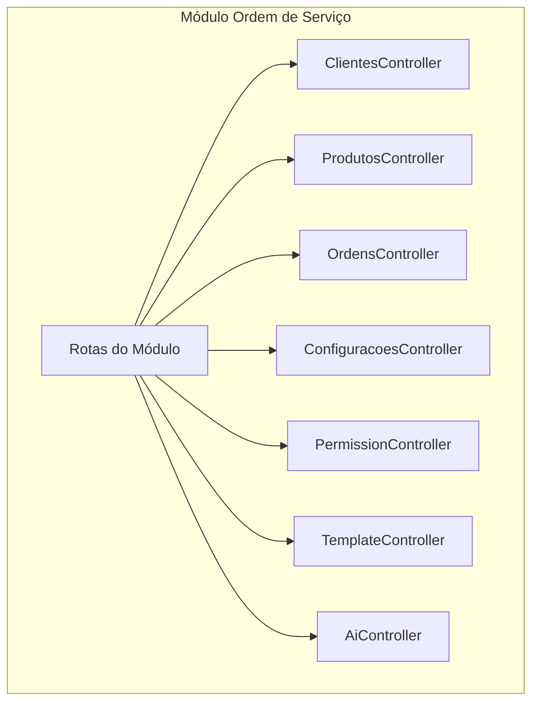
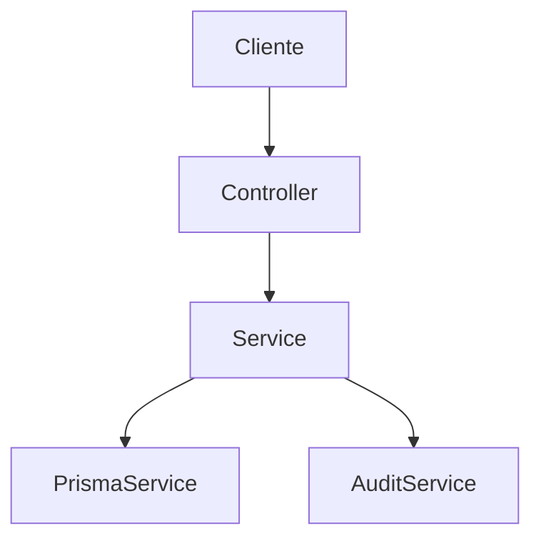
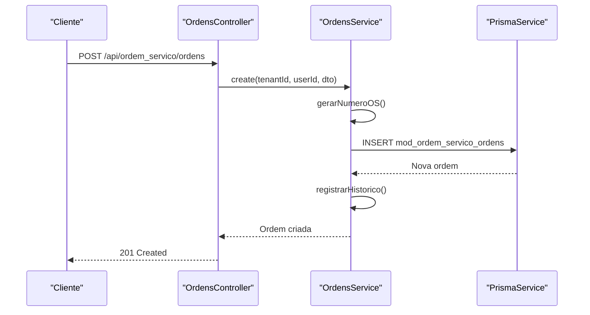
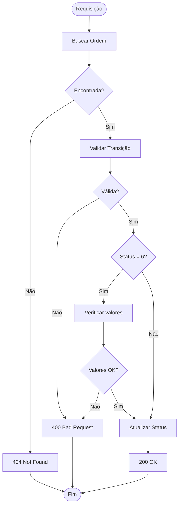
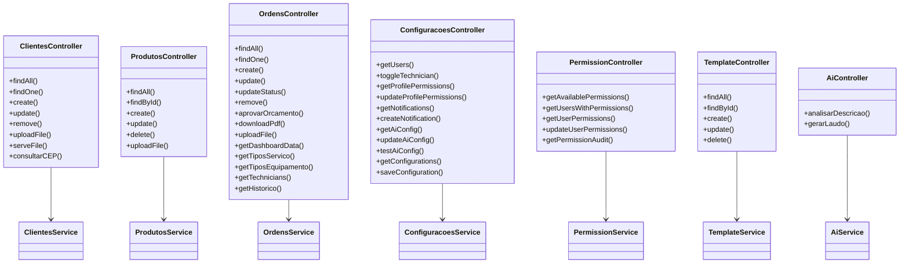

# Endpoints REST

<cite>
**Arquivos referenciados neste documento**
- [routes.ts](file://backend/routes.ts)
- [ordem_servico.module.ts](file://backend/ordem_servico.module.ts)
- [clientes.controller.ts](file://backend/clientes/clientes.controller.ts)
- [produtos.controller.ts](file://backend/produtos/produtos.controller.ts)
- [ordens.controller.ts](file://backend/ordens/ordens.controller.ts)
- [configuracoes.controller.ts](file://backend/configuracoes/configuracoes.controller.ts)
- [permission.controller.ts](file://backend/shared/controllers/permission.controller.ts)
- [template.controller.ts](file://backend/shared/controllers/template.controller.ts)
- [ai.controller.ts](file://backend/shared/controllers/ai.controller.ts)
- [ordem-servico.dto.ts](file://backend/shared/dto/ordem-servico.dto.ts)
- [clientes.service.ts](file://backend/clientes/clientes.service.ts)
- [produtos.service.ts](file://backend/produtos/produtos.service.ts)
- [ordens.service.ts](file://backend/ordens/ordens.service.ts)
- [configuracoes.service.ts](file://backend/configuracoes/configuracoes.service.ts)
- [permission.service.ts](file://backend/shared/services/permission.service.ts)
- [template.service.ts](file://backend/shared/services/template.service.ts)
- [ai.service.ts](file://backend/shared/services/ai.service.ts)
</cite>

## Sumário
1. [Introdução](#introdução)
2. [Estrutura do Projeto](#estrutura-do-projeto)
3. [Componentes Principais](#componentes-principais)
4. [Visão Geral da Arquitetura](#visão-geral-da-arquitetura)
5. [Análise Detalhada dos Endpoints](#análise-detalhada-dos-endpoints)
6. [Análise de Dependências](#análise-de-dependências)
7. [Considerações de Desempenho](#considerações-de-desempenho)
8. [Guia de Solução de Problemas](#guia-de-solução-de-problemas)
9. [Conclusão](#conclusão)

## Introdução
Este documento apresenta a documentação completa dos endpoints REST do módulo de Ordens de Serviço. Ele descreve todos os recursos expostos pelas APIs, incluindo métodos HTTP, padrões de URL, parâmetros de requisição e respostas esperadas. Os endpoints estão organizados por módulos conforme solicitado: Clientes, Produtos, Ordens, Configurações, Permissões, Templates, IA e Configurações do Sistema.

Além disso, o documento inclui:
- Exemplos práticos de uso e respostas completas para cada endpoint
- Explicações sobre validações, permissões e tratamento de erros
- Diagramas de arquitetura e fluxos de processamento
- Diretrizes de desempenho e boas práticas

## Estrutura do Projeto
O módulo segue uma estrutura modular com controllers, services e DTOs separados por funcionalidades. A configuração global do módulo importa os subsistemas de Clientes, Produtos, Ordens, Configurações, Permissões, Templates e IA.

**Diagrama fonte**
- [routes.ts](file://backend/routes.ts#L9-L17)
- [ordem_servico.module.ts](file://backend/ordem_servico.module.ts#L11-L31)

**Seção fonte**
- [routes.ts](file://backend/routes.ts#L1-L17)
- [ordem_servico.module.ts](file://backend/ordem_servico.module.ts#L1-L35)

## Componentes Principais
- Clientes: CRUD completo de clientes, upload de fotos, consulta de CEP
- Produtos: CRUD de produtos, upload de imagens
- Ordens: CRUD completo de ordens de serviço, histórico, PDF, status, aprovação de orçamento
- Configurações: Gestão de usuários, permissões, notificações, configurações de IA e gerais
- Permissões: Consulta e atualização de permissões de usuários
- Templates: Gerenciamento de templates de documentos
- IA: Análise de descrições e geração de laudos

**Seção fonte**
- [clientes.controller.ts](file://backend/clientes/clientes.controller.ts#L12-L182)
- [produtos.controller.ts](file://backend/produtos/produtos.controller.ts#L11-L144)
- [ordens.controller.ts](file://backend/ordens/ordens.controller.ts#L25-L377)
- [configuracoes.controller.ts](file://backend/configuracoes/configuracoes.controller.ts#L6-L136)
- [permission.controller.ts](file://backend/shared/controllers/permission.controller.ts#L6-L83)
- [template.controller.ts](file://backend/shared/controllers/template.controller.ts#L6-L80)
- [ai.controller.ts](file://backend/shared/controllers/ai.controller.ts#L7-L53)

## Visão Geral da Arquitetura
A arquitetura segue o padrão MVC com controllers responsáveis pela entrada de requisições, services com a lógica de negócio e DTOs para validação e tipagem. O módulo utiliza autenticação JWT e um sistema de permissões baseado em recursos e ações.

**Diagrama fonte**
- [ordem-servico.dto.ts](file://backend/shared/dto/ordem-servico.dto.ts#L1-L397)
- [clientes.service.ts](file://backend/clientes/clientes.service.ts#L1-L253)
- [produtos.service.ts](file://backend/produtos/produtos.service.ts#L1-L169)
- [ordens.service.ts](file://backend/ordens/ordens.service.ts#L1-L800)

## Análise Detalhada dos Endpoints

### Módulo Clientes (/api/ordem_servico/clientes)

#### GET /api/ordem_servico/clientes
- Método: GET
- Autenticação: JWT + Permissão
- Permissão necessária: clients:view
- Parâmetros de query:
  - search (opcional): termo de busca textual
- Resposta: Lista de clientes com campos básicos
- Status esperados: 200, 401, 403

#### GET /api/ordem_servico/clientes/:id
- Método: GET
- Autenticação: JWT + Permissão
- Permissão necessária: clients:view_details
- Parâmetros de path: id (UUID)
- Resposta: Dados completos do cliente
- Status esperados: 200, 401, 403, 404

#### POST /api/ordem_servico/clientes
- Método: POST
- Autenticação: JWT + Permissão
- Permissão necessária: clients:create
- Corpo: Dados do cliente (name, phone_primary obrigatórios)
- Resposta: Cliente criado com id
- Status esperados: 201, 400, 401, 403

#### PUT /api/ordem_servico/clientes/:id
- Método: PUT
- Autenticação: JWT + Permissão
- Permissão necessária: clients:edit
- Parâmetros de path: id (UUID)
- Corpo: Dados atualizados do cliente
- Resposta: Cliente atualizado
- Status esperados: 200, 400, 401, 403, 404

#### DELETE /api/ordem_servico/clientes/:id
- Método: DELETE
- Autenticação: JWT + Permissão
- Permissão necessária: clients:delete
- Parâmetros de path: id (UUID)
- Resposta: { success: true }
- Status esperados: 200, 401, 403, 404

#### POST /api/ordem_servico/clientes/upload
- Método: POST
- Autenticação: JWT + Permissão
- Permissão necessária: clients:upload_images
- Conteúdo: Arquivo de imagem (JPEG, PNG, WEBP, GIF)
- Resposta: { url: "/api/ordem_servico/clientes/uploads/{tenant}/{filename}" }
- Status esperados: 201, 400, 401, 403

#### GET /api/ordem_servico/clientes/uploads/:tenantId/:filename
- Método: GET
- Autenticação: Nenhuma (acesso público)
- Resposta: Arquivo de imagem
- Status esperados: 200, 403, 404

#### GET /api/ordem_servico/clientes/cep/:cep
- Método: GET
- Autenticação: Nenhuma (acesso público)
- Parâmetros de path: cep (somente dígitos)
- Resposta: Dados do CEP formatados
- Status esperados: 200, 400, 404

**Seção fonte**
- [clientes.controller.ts](file://backend/clientes/clientes.controller.ts#L21-L182)

### Módulo Produtos (/api/ordem_servico/produtos)

#### GET /api/ordem_servico/produtos
- Método: GET
- Autenticação: JWT + Permissão
- Permissão necessária: products:view
- Parâmetros de query: filters (search, status)
- Resposta: Lista de produtos
- Status esperados: 200, 401, 403

#### GET /api/ordem_servico/produtos/:id
- Método: GET
- Autenticação: JWT + Permissão
- Permissão necessária: products:view
- Parâmetros de path: id (UUID)
- Resposta: Produto específico
- Status esperados: 200, 401, 403, 404

#### POST /api/ordem_servico/produtos
- Método: POST
- Autenticação: JWT + Permissão
- Permissão necessária: products:create
- Corpo: Dados do produto (code, name, price obrigatórios)
- Resposta: Produto criado com id
- Status esperados: 201, 400, 401, 403

#### PUT /api/ordem_servico/produtos/:id
- Método: PUT
- Autenticação: JWT + Permissão
- Permissão necessária: products:edit
- Parâmetros de path: id (UUID)
- Corpo: Dados atualizados do produto
- Resposta: Produto atualizado
- Status esperados: 200, 400, 401, 403, 404

#### DELETE /api/ordem_servico/produtos/:id
- Método: DELETE
- Autenticação: JWT + Permissão
- Permissão necessária: products:delete
- Parâmetros de path: id (UUID)
- Resposta: { success: true }
- Status esperados: 200, 401, 403, 404

#### POST /api/ordem_servico/produtos/upload
- Método: POST
- Autenticação: JWT + Permissão
- Permissão necessária: products:upload_images
- Conteúdo: Arquivo de imagem (até 5MB)
- Resposta: { url: "/uploads/produtos/{tenant}/{filename}" }
- Status esperados: 201, 400, 401, 403

**Seção fonte**
- [produtos.controller.ts](file://backend/produtos/produtos.controller.ts#L20-L144)

### Módulo Ordens (/api/ordem_servico/ordens)

#### GET /api/ordem_servico/ordens
- Método: GET
- Autenticação: JWT
- Parâmetros de query: 
  - search (opcional)
  - status[] (opcional)
  - cliente_id (opcional)
  - usuario_responsavel_id (opcional)
  - data_inicio (opcional)
  - data_fim (opcional)
  - origem_solicitacao (opcional)
  - tipo_servico (opcional)
  - page (opcional, default 1)
  - limit (opcional, default 20, máx 100)
- Resposta: Lista paginada de ordens com totais
- Status esperados: 200, 400, 401

#### GET /api/ordem_servico/ordens/dashboard
- Método: GET
- Autenticação: JWT
- Resposta: Dados para dashboard
- Status esperados: 200, 401

#### GET /api/ordem_servico/ordens/tipos-servico
- Método: GET
- Autenticação: JWT
- Resposta: Lista de tipos de serviço
- Status esperados: 200, 401

#### GET /api/ordem_servico/ordens/tipos-equipamento
- Método: GET
- Autenticação: JWT
- Resposta: Lista de tipos de equipamento
- Status esperados: 200, 401

#### GET /api/ordem_servico/ordens/technicians
- Método: GET
- Autenticação: JWT
- Resposta: Lista de técnicos
- Status esperados: 200, 401

#### GET /api/ordem_servico/ordens/:id
- Método: GET
- Autenticação: JWT
- Parâmetros de path: id (UUID)
- Resposta: Detalhes completos da ordem
- Status esperados: 200, 401, 404

#### GET /api/ordem_servico/ordens/:id/historico
- Método: GET
- Autenticação: JWT
- Parâmetros de path: id (UUID)
- Resposta: Histórico de alterações
- Status esperados: 200, 401, 404

#### GET /api/ordem_servico/ordens/:id/pdf
- Método: GET
- Autenticação: JWT
- Parâmetros de path: id (UUID)
- Resposta: Arquivo PDF
- Status esperados: 200, 401, 404, 500

#### POST /api/ordem_servico/ordens
- Método: POST
- Autenticação: JWT
- Corpo: Dados da ordem (CreateOrdemServicoDTO)
- Validações: Cliente deve estar ativo
- Resposta: Ordem criada
- Status esperados: 201, 400, 401

#### PUT /api/ordem_servico/ordens/:id
- Método: PUT
- Autenticação: JWT
- Parâmetros de path: id (UUID)
- Corpo: Dados atualizados (UpdateOrdemServicoDTO)
- Validações: Não pode editar ordens finalizadas/canceladas
- Resposta: Ordem atualizada
- Status esperados: 200, 400, 401, 403, 404

#### PUT /api/ordem_servico/ordens/:id/status
- Método: PUT
- Autenticação: JWT
- Parâmetros de path: id (UUID)
- Corpo: { status, motivo_cancelamento?, observacoes? }
- Validações: Transições de status válidas, obrigatoriedade de motivo para cancelamento, validação de finalização
- Resposta: Ordem com status atualizado
- Status esperados: 200, 400, 401, 404

#### DELETE /api/ordem_servico/ordens/:id
- Método: DELETE
- Autenticação: JWT
- Parâmetros de path: id (UUID)
- Validações: Apenas orçamentos podem ser excluídos por não-admins
- Resposta: { success: true }
- Status esperados: 200, 400, 401, 403, 404

#### POST /api/ordem_servico/ordens/:id/aprovar-orcamento
- Método: POST
- Autenticação: JWT
- Parâmetros de path: id (UUID)
- Validações: Apenas orçamentos podem ser aprovados
- Resposta: Ordem aprovada
- Status esperados: 200, 400, 401, 404

#### POST /api/ordem_servico/ordens/upload
- Método: POST
- Autenticação: JWT
- Conteúdo: Arquivo de imagem
- Resposta: { url: "/api/ordem_servico/ordens/uploads/{tenant}/{filename}" }
- Status esperados: 201, 400, 401

#### GET /api/ordem_servico/ordens/uploads/:tenantId/:filename
- Método: GET
- Autenticação: Nenhuma (acesso público)
- Resposta: Arquivo de imagem
- Status esperados: 200, 403, 404

**Seção fonte**
- [ordens.controller.ts](file://backend/ordens/ordens.controller.ts#L34-L377)
- [ordem-servico.dto.ts](file://backend/shared/dto/ordem-servico.dto.ts#L28-L133)

### Módulo Configurações (/api/ordem_servico/config)

#### GET /api/ordem_servico/config/users
- Método: GET
- Autenticação: JWT
- Resposta: Lista de usuários
- Status esperados: 200, 401

#### PUT /api/ordem_servico/config/users/:id/technician
- Método: PUT
- Autenticação: JWT
- Parâmetros de path: id (UUID)
- Corpo: { is_technician: boolean }
- Resposta: { success: true, userId, isTechnician }
- Status esperados: 200, 401

#### GET /api/ordem_servico/config/profile-permissions
- Método: GET
- Autenticação: JWT
- Resposta: Permissões de perfil estruturadas
- Status esperados: 200, 401

#### POST /api/ordem_servico/config/profile-permissions
- Método: POST
- Autenticação: JWT
- Corpo: { permissions: any }
- Resposta: { success: true, permissions }
- Status esperados: 200, 401

#### GET /api/ordem_servico/config/notifications
- Método: GET
- Autenticação: JWT
- Resposta: Lista de notificações agendadas
- Status esperados: 200, 401

#### POST /api/ordem_servico/config/notifications
- Método: POST
- Autenticação: JWT
- Corpo: Dados da notificação
- Resposta: { success: true, result }
- Status esperados: 201, 400, 401

#### GET /api/ordem_servico/config/ai
- Método: GET
- Autenticação: JWT
- Resposta: Configuração de IA (com API Key mascarada)
- Status esperados: 200, 401

#### POST /api/ordem_servico/config/ai
- Método: POST
- Autenticação: JWT
- Corpo: Configuração de IA
- Resposta: { success: true }
- Status esperados: 200, 400, 401

#### POST /api/ordem_servico/config/ai/test
- Método: POST
- Autenticação: JWT
- Corpo: Configuração de teste
- Resposta: { success: true, response } ou erro
- Status esperados: 200, 400, 401

#### GET /api/ordem_servico/config/settings
- Método: GET
- Autenticação: JWT
- Resposta: Configurações gerais do tenant
- Status esperados: 200, 401

#### POST /api/ordem_servico/config/settings
- Método: POST
- Autenticação: JWT
- Corpo: { config_key: string, config_value: any }
- Resposta: { success: true }
- Status esperados: 200, 400, 401

**Seção fonte**
- [configuracoes.controller.ts](file://backend/configuracoes/configuracoes.controller.ts#L14-L136)
- [configuracoes.service.ts](file://backend/configuracoes/configuracoes.service.ts#L37-L331)

### Módulo Permissões (/api/ordem_servico/permissions)

#### GET /api/ordem_servico/permissions/available
- Método: GET
- Autenticação: JWT
- Resposta: Permissões disponíveis
- Status esperados: 200, 401

#### GET /api/ordem_servico/permissions/users
- Método: GET
- Autenticação: JWT
- Resposta: Usuários com suas permissões
- Status esperados: 200, 401

#### GET /api/ordem_servico/permissions/users/:userId
- Método: GET
- Autenticação: JWT
- Parâmetros de path: userId (UUID)
- Resposta: Permissões do usuário
- Status esperados: 200, 401

#### PUT /api/ordem_servico/permissions/users/:userId
- Método: PUT
- Autenticação: JWT
- Parâmetros de path: userId (UUID)
- Corpo: { permissions: any[] }
- Resposta: { success: true }
- Status esperados: 200, 401

#### GET /api/ordem_servico/permissions/audit
- Método: GET
- Autenticação: JWT
- Parâmetros de path: userId? (UUID)
- Resposta: Auditoria de permissões
- Status esperados: 200, 401

**Seção fonte**
- [permission.controller.ts](file://backend/shared/controllers/permission.controller.ts#L13-L83)
- [permission.service.ts](file://backend/shared/services/permission.service.ts#L21-L313)

### Módulo Templates (/api/ordem_servico/templates)

#### GET /api/ordem_servico/templates
- Método: GET
- Autenticação: JWT
- Resposta: Lista de templates
- Status esperados: 200, 401

#### GET /api/ordem_servico/templates/:id
- Método: GET
- Autenticação: JWT
- Parâmetros de path: id (UUID)
- Resposta: Template específico
- Status esperados: 200, 401, 404

#### POST /api/ordem_servico/templates
- Método: POST
- Autenticação: JWT
- Corpo: { name, content, type? }
- Resposta: { success: true, result }
- Status esperados: 201, 400, 401

#### PUT /api/ordem_servico/templates/:id
- Método: PUT
- Autenticação: JWT
- Parâmetros de path: id (UUID)
- Corpo: { name, content, type? }
- Resposta: { success: true, result }
- Status esperados: 200, 400, 401, 404

#### DELETE /api/ordem_servico/templates/:id
- Método: DELETE
- Autenticação: JWT
- Parâmetros de path: id (UUID)
- Resposta: { success: true }
- Status esperados: 200, 401, 404

**Seção fonte**
- [template.controller.ts](file://backend/shared/controllers/template.controller.ts#L13-L80)
- [template.service.ts](file://backend/shared/services/template.service.ts#L10-L104)

### Módulo IA (/api/ordem_servico/ai)

#### POST /api/ordem_servico/ai/analisar-descricao
- Método: POST
- Autenticação: JWT
- Corpo: { descricao: string }
- Resposta: JSON analisado ou { text: string }
- Status esperados: 200, 400, 401

#### POST /api/ordem_servico/ai/gerar-laudo
- Método: POST
- Autenticação: JWT
- Corpo: { problema: string, notas: string }
- Resposta: { laudo: string }
- Status esperados: 200, 400, 401

**Seção fonte**
- [ai.controller.ts](file://backend/shared/controllers/ai.controller.ts#L14-L53)
- [ai.service.ts](file://backend/shared/services/ai.service.ts#L33-L91)

## Arquitetura de Processamento

### Fluxo de Criação de Ordem de Serviço

**Diagrama fonte**
- [ordens.controller.ts](file://backend/ordens/ordens.controller.ts#L159-L179)
- [ordens.service.ts](file://backend/ordens/ordens.service.ts#L557-L654)

### Fluxo de Validação de Status

**Diagrama fonte**
- [ordens.controller.ts](file://backend/ordens/ordens.controller.ts#L209-L258)
- [ordens.service.ts](file://backend/ordens/ordens.service.ts#L772-L800)

## Análise de Dependências

### Relacionamento entre Controllers e Services

**Diagrama fonte**
- [clientes.controller.ts](file://backend/clientes/clientes.controller.ts#L14-L182)
- [produtos.controller.ts](file://backend/produtos/produtos.controller.ts#L13-L144)
- [ordens.controller.ts](file://backend/ordens/ordens.controller.ts#L27-L377)
- [configuracoes.controller.ts](file://backend/configuracoes/configuracoes.controller.ts#L8-L136)
- [permission.controller.ts](file://backend/shared/controllers/permission.controller.ts#L9-L83)
- [template.controller.ts](file://backend/shared/controllers/template.controller.ts#L9-L80)
- [ai.controller.ts](file://backend/shared/controllers/ai.controller.ts#L10-L53)

**Seção fonte**
- [routes.ts](file://backend/routes.ts#L9-L17)

## Considerações de Desempenho
- Filtros de busca em Ordens: Buscas muito curtas (< 2 caracteres) são bloqueadas para performance
- Paginação: Limite máximo de 100 registros por página
- Validação de dados: DTOs com class-validator e sanitização manual para evitar SQL injection
- Cache de permissões: Cache de 5 minutos para permissões de usuários
- Uploads: Validação de tipo e tamanho de arquivos
- PDF: Geração com Puppeteer, otimizada para ambiente server

## Guia de Solução de Problemas

### Erros Comuns e Soluções
- 401 Unauthorized: Verifique o token JWT e cabeçalhos de autorização
- 403 Forbidden: Confira as permissões do usuário para o recurso específico
- 400 Bad Request: Valide os DTOs e parâmetros conforme especificado
- 404 Not Found: Verifique se o ID existe e pertence ao tenant correto
- 413 Payload Too Large: Arquivo excede o limite de 5MB (para uploads de produtos)

### Diagnóstico de Erros de IA
- Verifique se a IA está habilitada para o tenant
- Confirme a API Key configurada
- Teste a conexão com a API de IA antes de usar

**Seção fonte**
- [ordens.controller.ts](file://backend/ordens/ordens.controller.ts#L48-L54)
- [configuracoes.service.ts](file://backend/configuracoes/configuracoes.service.ts#L254-L281)

## Conclusão
O módulo de Ordens de Serviço oferece uma API REST completa e bem estruturada com:
- Segurança robusta através de autenticação JWT e sistema de permissões
- Validação rigorosa de dados com DTOs e sanitização
- Funcionalidades abrangentes de gestão de clientes, produtos, ordens e configurações
- Integração com IA para análise e geração de conteúdo
- Recursos avançados de auditoria e histórico

A documentação apresentada fornece os detalhes necessários para integração eficiente e uso seguro de todos os endpoints disponíveis.